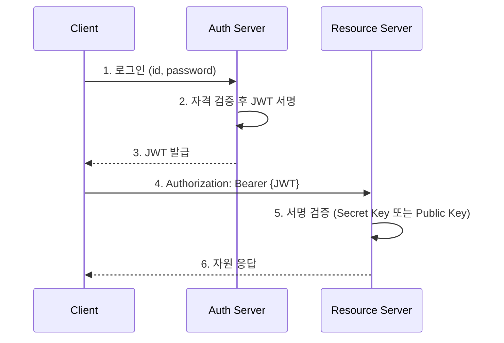
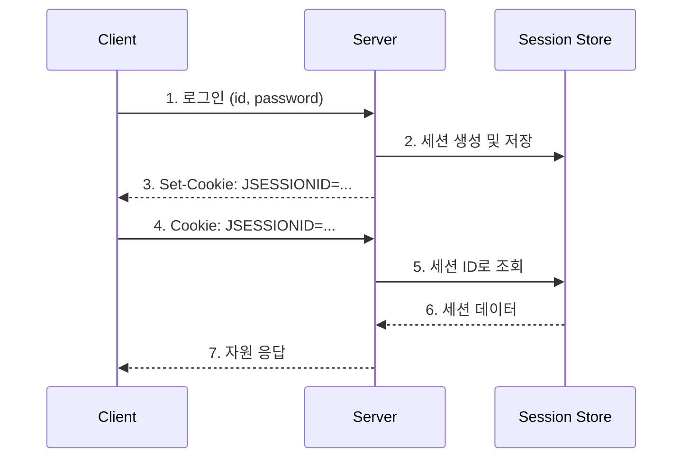

---

title: Server Side Session vs Token
date: 2022-06-16
categories: [Session, Token]
tags: [Session, Token, JWT]
layout: post
toc: true
math: true
mermaid: true

---

## 참고자료

- [RFC 7519 - JSON Web Token (JWT)](https://datatracker.ietf.org/doc/html/rfc7519)
- [RFC 7515 - JSON Web Signature (JWS)](https://datatracker.ietf.org/doc/html/rfc7515)
- [RFC 7516 - JSON Web Encryption (JWE)](https://datatracker.ietf.org/doc/html/rfc7516)
- [RFC 6265 - HTTP State Management Mechanism](https://datatracker.ietf.org/doc/html/rfc6265)
- [Apache Tomcat - StandardSessionIdGenerator.java](https://github.com/apache/tomcat/blob/main/java/org/apache/catalina/util/StandardSessionIdGenerator.java)
- [Spring Security Reference - Cross Site Request Forgery](https://docs.spring.io/spring-security/reference/servlet/exploits/csrf.html)
- [Baeldung - Tokens vs Sessions](https://www.baeldung.com/cs/tokens-vs-sessions)

---

## 배경

인증 방식을 고를 때마다 "JWT는 stateless라 확장에 유리하고 세션은 보안에 유리하다"는 요약을 반복해서 봤다. 그런데 이 요약만으로는 답이 안 나오는 질문이 몇 개 남았다.

- JWT의 페이로드는 정말 안전한가? 흔히 "해시되어 있어서 못 읽는다"고 하는데, 그러면 서버는 그 안의 클레임을 어떻게 꺼내 쓰는가?
- 세션 ID는 어떻게 만들어지길래 추측이 불가능하다고 하는가?
- 둘 중 하나를 골랐다면 그 다음에 남는 위험은 무엇인가?

명세(RFC)와 톰캣 구현체를 직접 확인해서 이 세 가지에 답을 붙였다.

---

## 들어가기 전, 인증과 인가

인증(Authentication)은 요청을 보낸 주체가 누구인지 확인하는 과정이다. 인가(Authorization)는 확인된 주체가 해당 자원에 접근할 권한을 가지고 있는지 판정하는 과정이다.

세션과 토큰은 둘 다 인증 과정에서 만들어지고, 그 이후의 요청마다 인가를 판정하는 근거로 쓰인다.

---

## 토큰 기반 인증 (JWT)



핵심은 5번이다. 자원 서버는 인증 서버에 되묻지 않고 자기가 가진 키만으로 토큰의 유효성을 판정한다. 상태를 어디에도 저장하지 않기 때문에 서버를 늘려도 공유할 것이 없다.

### 장점 1. 발급처와 사용처를 분리할 수 있다

한 플랫폼에 분산 서버가 5대 있다고 하자. 서버 A가 발급한 토큰을 서버 B, C, D, E가 그대로 검증할 수 있다. 서명 키만 공유하면 되고, 비대칭 키를 쓰면 검증 측에는 공개 키만 배포하면 된다.

### 장점 2. 구현 부담이 작다

JWT는 RFC 7519로 표준화되어 있고, 언어마다 검증된 라이브러리가 이미 존재한다. 직접 만들 부분이 사실상 없다.

### 장점 3. 위조가 어렵다

여기서 흔히 오해가 생긴다. 아래에서 따로 다룬다.

---

## 궁금증 1. JWT의 페이로드는 읽을 수 있는가

읽을 수 있다. "JWT는 해시되어 있어서 못 읽는다"는 설명은 틀렸다.

RFC 7519 3절이 JWT의 두 가지 직렬화 형태를 규정한다.

[RFC 7519 3절](https://datatracker.ietf.org/doc/html/rfc7519#section-3)의 정의를 정리하면 이렇다. JWT는 마침표로 구분된 조각들의 나열이고, 각 조각은 **base64url로 인코딩된** 값이다. 조각이 몇 개인지는 JWS 압축 직렬화를 쓰는지 JWE 압축 직렬화를 쓰는지에 따라 달라진다.

여기서 두 가지가 명확해진다.

첫째, 우리가 보통 JWT라고 부르는 세 조각짜리 토큰은 JWS다. 서명은 붙지만 암호화는 되지 않는다. base64url은 인코딩이지 암호화가 아니므로 누구든 페이로드를 디코딩해서 읽을 수 있다. 서버가 클레임을 꺼내 쓸 수 있는 이유도 같다.

둘째, 페이로드를 정말 감추려면 JWE(RFC 7516)를 써야 한다. 이 경우 조각이 다섯 개가 된다.

```
JWS (일반적인 JWT)
  header.payload.signature
  -> payload는 base64url 디코딩만으로 읽힌다

JWE
  header.encrypted_key.iv.ciphertext.tag
  -> ciphertext는 키 없이 읽을 수 없다
```

그래서 JWT가 보장하는 것은 기밀성이 아니라 **무결성**이다. 내용을 못 읽게 막는 것이 아니라, 내용이 바뀌었는지를 서버가 알아챌 수 있게 하는 것이다. 비밀번호나 주민번호 같은 값을 JWS 페이로드에 넣으면 그대로 노출된다.

### 서명은 어떻게 검증되는가

RFC 7515 5.2절의 검증 절차를 요약하면 이렇다.

1. 토큰을 마침표 기준으로 세 조각으로 나눈다.
2. 헤더를 base64url 디코딩해서 `alg`(서명 알고리즘)를 확인한다.
3. `base64url(header) + "." + base64url(payload)`라는 문자열을 만든다. 이것이 서명 대상(JWS Signing Input)이다.
4. 서버가 가진 키로 3번 문자열에 대해 같은 알고리즘의 서명을 새로 계산한다.
5. 새로 계산한 서명과 토큰의 세 번째 조각을 비교한다.

비교 대상은 토큰 전체가 아니라 **세 번째 조각인 서명부**다. 5번이 일치하면 헤더와 페이로드가 발급 이후 변조되지 않았다는 뜻이 된다.

이 절차에서 `alg` 값을 검증 없이 그대로 신뢰하면 `alg: none`을 넣은 위조 토큰을 통과시키는 취약점이 생긴다. 신뢰할 알고리즘을 서버 쪽에서 고정해두는 것이 안전하다.

### 토큰 방식의 단점

발급 이후 서버가 개입할 수단이 없다. 토큰이 탈취되어도 만료 시각이 오기 전까지는 유효하다. 서명 키가 노출되면 공격자가 임의의 클레임으로 토큰을 무제한 생성할 수 있으므로 피해 범위가 계정 하나로 끝나지 않는다.

이를 줄이려고 액세스 토큰의 만료를 짧게 잡고 리프레시 토큰으로 갱신하는 구조를 쓴다. 다만 이것은 탈취 시 노출 시간을 줄이는 완화책이지 근본 대책은 아니다. 즉시 무효화가 필요하면 결국 서버에 상태를 두는 블랙리스트나 토큰 버전 관리가 붙는데, 이 시점에서 stateless라는 장점은 상당 부분 사라진다.

---

## 세션 기반 인증



서버가 인증 상태를 들고 있고 클라이언트에게는 그 상태를 가리키는 식별자만 넘긴다. 세션 데이터는 서버 메모리나 별도 저장소에 둔다.

---

## 궁금증 2. 세션 ID는 어떻게 만들어지는가

톰캣의 기본 구현체인 `StandardSessionIdGenerator`를 확인했다.

```java
package org.apache.catalina.util;

public class StandardSessionIdGenerator extends SessionIdGeneratorBase {

    @Override
    public String generateSessionId(String route) {

        byte[] random = new byte[16];
        int sessionIdLength = getSessionIdLength();

        // Render the result as a String of hexadecimal digits
        // Start with enough space for sessionIdLength and medium route size
        StringBuilder buffer = new StringBuilder(2 * sessionIdLength + 20);

        int resultLenBytes = 0;

        while (resultLenBytes < sessionIdLength) {
            getRandomBytes(random);
            for (int j = 0;
            j < random.length && resultLenBytes < sessionIdLength;
            j++) {
                byte b1 = (byte) ((random[j] & 0xf0) >> 4);
                byte b2 = (byte) (random[j] & 0x0f);
                if (b1 < 10)
                    buffer.append((char) ('0' + b1));
                else
                    buffer.append((char) ('A' + (b1 - 10)));
                if (b2 < 10)
                    buffer.append((char) ('0' + b2));
                else
                    buffer.append((char) ('A' + (b2 - 10)));
                resultLenBytes++;
            }
        }

        if (route != null && route.length() > 0) {
            buffer.append('.').append(route);
        } else {
            String jvmRoute = getJvmRoute();
            if (jvmRoute != null && jvmRoute.length() > 0) {
                buffer.append('.').append(jvmRoute);
            }
        }

        return buffer.toString();
    }
}
```

동작을 정리하면 세 단계다.

1. 16바이트 단위로 난수를 뽑아, 바이트마다 상위 4비트와 하위 4비트를 각각 16진수 문자 하나로 변환한다. `sessionIdLength`(기본 16바이트)를 채울 때까지 반복하므로 기본값에서는 32자리 16진 문자열이 나온다.
2. `route` 인자가 있으면 난수 뒤에 `.`과 함께 붙인다.
3. `route`가 없으면 `jvmRoute` 설정값을 같은 방식으로 붙인다.

난수 자체는 상위 클래스인 `SessionIdGeneratorBase`가 `SecureRandom`으로 만든다. 즉 추측 저항성은 `SecureRandom`이 담당하고, 이 클래스는 그것을 16진 문자열로 표현하는 역할만 한다.

`route`를 뒤에 붙이는 이유는 난수 중복 방지가 아니다. 로드밸런서가 세션 ID 꼬리표를 보고 같은 클라이언트를 같은 인스턴스로 보내는 스티키 세션(sticky session)을 구현하기 위한 것이다. 톰캣 클러스터링 문서에서 `jvmRoute`를 이 용도로 설명한다.

### 세션 방식의 장단점

서버가 세션을 들고 있으므로 특정 세션만 골라 즉시 만료시킬 수 있다. 탈취가 의심되면 그 세션을 지우는 것으로 대응이 끝난다. 토큰 방식이 구조적으로 하지 못하는 일이다.

대신 수평 확장에 비용이 붙는다. 서버 A가 만든 세션을 B와 C도 알아야 하므로 Redis 같은 공용 저장소를 두거나 서버 간 세션 복제를 구성해야 한다. 공용 저장소를 두면 그 저장소가 새로운 단일 장애점이 되고, 복제를 쓰면 서버가 늘어날수록 복제 트래픽이 늘어난다.

---

## 궁금증 3. 그래서 무엇을 고를 것인가

두 방식은 `확장 비용`과 `무효화 능력`을 맞바꾼다.

| 항목 | JWT (JWS) | 서버 세션 |
|---|---|---|
| 상태 저장 위치 | 클라이언트 | 서버 또는 공용 저장소 |
| 수평 확장 | 키만 공유하면 됨 | 공용 저장소나 복제 필요 |
| 개별 즉시 무효화 | 구조적으로 불가, 별도 상태 필요 | 가능 |
| 페이로드 노출 | base64url 디코딩으로 읽힘 | 식별자만 나가므로 내용 노출 없음 |
| 키 또는 저장소 사고 시 | 서명 키 유출 시 전 계정 위조 가능 | 저장소 장애 시 전 계정 인증 중단 |

판단 기준은 결국 "세션 하나를 즉시 끊어야 하는 요구가 있는가"다. 로그아웃 즉시 반영, 관리자 강제 로그아웃, 이상 접속 차단 같은 요구가 명시적으로 있으면 세션 쪽이 맞다. 그런 요구가 없고 서버 대수가 자주 바뀌는 환경이라면 JWT의 운영 비용이 더 낮다.

금융권이 세션을 많이 쓴다고 알려져 있는데, 이는 보안이 중요해서라기보다 **거래 단위로 세션을 끊어야 하는 요구가 명시되어 있기 때문**으로 보인다. 다만 이 부분은 규정 원문을 직접 확인하지 않았으므로 추측이다.

---

## 선택 이후에 남는 문제

무엇을 고르든 자격 증명은 HTTP를 타고 클라이언트에 저장된다. 그래서 저장 방식과 전송 방식에서 다시 문제가 생긴다.

### XSS

스크립트가 주입되면 `document.cookie`나 `localStorage`에 접근해 자격 증명을 가져갈 수 있다. 쿠키에 `HttpOnly` 속성을 붙이면 자바스크립트에서 그 쿠키를 읽지 못한다.

[OWASP 문서](https://owasp.org/www-community/HttpOnly)는 이 플래그의 목적을 "클라이언트 측 스크립트가 보호 대상 쿠키에 접근하는 위험을 **줄이는 것**"이라고 적는다. 없앤다가 아니라 줄인다고 쓴 그대로, XSS 자체를 막지는 못한다. 스크립트가 실행되면 쿠키를 읽지 못해도 그 쿠키가 자동으로 실리는 요청을 대신 보낼 수 있다. 입력 검증과 출력 이스케이프, CSP는 별도로 필요하다.

### CSRF

여기서 예전에 잘못 알고 있던 부분을 바로잡는다. 스프링 시큐리티의 `csrf().disable()`은 CSRF를 막는 옵션이 아니라 **막는 기능을 끄는 옵션**이다. 공식 문서는 반대로 말한다.

[공식 문서](https://docs.spring.io/spring-security/reference/servlet/exploits/csrf.html)는 반대로 말한다. 스프링 시큐리티는 POST처럼 상태를 바꾸는 HTTP 메서드에 대해 **기본적으로 CSRF 보호를 켜두므로 추가 코드가 필요 없다**는 것이다.

그렇다면 왜 실무 예제에서 `disable()`이 자주 보이는가. CSRF는 브라우저가 쿠키를 자동으로 실어 보내기 때문에 성립하는 공격이다. 세션 쿠키를 쓰지 않고 `Authorization` 헤더에 토큰을 직접 담는 API 서버라면 브라우저가 자동으로 채워주는 값이 없으므로 공격이 성립하지 않는다. 이 조건에서만 꺼도 된다는 뜻이지, 끄면 안전해진다는 뜻이 아니다.

쿠키에 세션이나 토큰을 담는다면 CSRF 보호를 켜둔 채로 `SameSite` 속성을 함께 쓰는 것이 맞다.

---

## 정리하며

처음 던진 세 가지 질문에 대한 답이다.

**JWT의 페이로드는 읽을 수 있는가.** 읽을 수 있다. 일반적인 JWT는 JWS이고 페이로드는 base64url 인코딩일 뿐이다. JWT가 보장하는 것은 기밀성이 아니라 무결성이다. 페이로드를 감춰야 하면 JWE를 써야 한다.

**세션 ID는 어떻게 만들어지는가.** 톰캣 기본 구현은 `SecureRandom`으로 16바이트 난수를 뽑아 32자리 16진 문자열로 표현한다. 뒤에 붙는 `jvmRoute`는 중복 방지가 아니라 스티키 세션용 꼬리표다.

**고르고 나면 무엇이 남는가.** 확장 비용과 즉시 무효화 능력의 맞교환이 끝나도, 클라이언트에 저장된 자격 증명을 XSS와 CSRF로부터 어떻게 지킬지가 그대로 남는다. `HttpOnly`는 완화책이고, `csrf().disable()`은 보호가 아니라 해제다.
