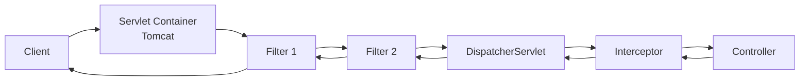
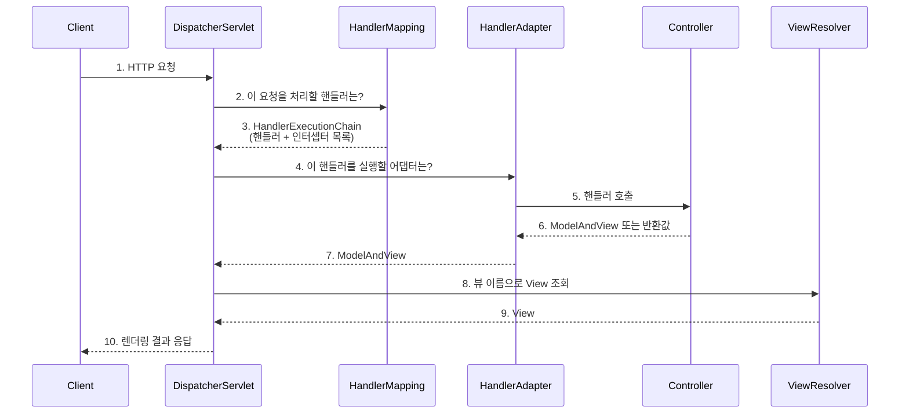

---

title: Filter Interceptor 그 사이의, Dispatcher-Servlet
date: 2022-08-01
categories: [Spring, Filter, Servlet, Interceptor]
tags: [Filter, Servlet, Interceptor, DispatcherServlet]
layout: post
toc: true
math: true
mermaid: true

---

## 참고자료

- [Jakarta Servlet Specification 6.0](https://jakarta.ee/specifications/servlet/6.0/jakarta-servlet-spec-6.0)
- [Jakarta Servlet API - Filter](https://jakarta.ee/specifications/servlet/6.0/apidocs/jakarta.servlet/jakarta/servlet/filter)
- [Spring Framework Reference - DispatcherServlet](https://docs.spring.io/spring-framework/reference/web/webmvc/mvc-servlet.html)
- [Spring Framework Javadoc - HandlerInterceptor](https://docs.spring.io/spring-framework/docs/current/javadoc-api/org/springframework/web/servlet/HandlerInterceptor.html)
- [DispatcherServlet.java 소스](https://github.com/spring-projects/spring-framework/blob/main/spring-webmvc/src/main/java/org/springframework/web/servlet/DispatcherServlet.java)

---

## 배경

인증 로직을 필터에 넣을지 인터셉터에 넣을지 고민하다가, 정작 둘이 어디서 갈라지는지를 설명하지 못한다는 걸 알았다. "필터는 스프링 밖, 인터셉터는 스프링 안"이라는 요약은 들었지만 그 경계에 정확히 무엇이 있는지가 흐릿했다.

경계에 있는 것이 디스패처 서블릿이다. 그래서 필터에서 시작해 디스패처 서블릿을 지나 인터셉터로 이어지는 경로를 하나씩 확인했다.

---

## 전체 경로



필터는 서블릿 컨테이너가 관리하고, 인터셉터는 디스패처 서블릿이 관리한다. 이 소속 차이가 뒤에 나오는 모든 차이의 원인이다.

---

## 1. 필터

### 1.1 필터란 무엇인가

필터는 요청이 서블릿에 도달하기 전과 응답이 클라이언트로 나가기 전에 끼어드는 컴포넌트다. 스프링이 아니라 서블릿 명세가 정의한다.

[서블릿 명세 6장](https://jakarta.ee/specifications/servlet/6.0/jakarta-servlet-spec-6.0)이 내린 정의를 옮기면 이렇다. 필터는 **HTTP 요청과 응답, 헤더 정보의 내용을 변형할 수 있는 재사용 가능한 코드 조각**이다.

정의에 "서블릿"이라는 말이 없다는 점이 중요하다. 필터는 스프링을 몰라도 되고, 스프링 컨텍스트가 뜨지 않아도 동작한다.

주의할 점 하나. 이 글을 처음 쓸 당시에는 `javax.servlet` 패키지였다. Jakarta EE 9부터 패키지가 `jakarta.servlet`으로 바뀌었고, 스프링 부트 3.x 이상은 `jakarta.servlet`을 쓴다. 아래 코드의 패키지명은 사용하는 버전에 맞춰 읽어야 한다.

### 1.2 필터 인터페이스

```java
package jakarta.servlet;

import java.io.IOException;

public interface Filter {

    default void init(FilterConfig filterConfig) throws ServletException {}

    void doFilter(
            ServletRequest request,
            ServletResponse response,
            FilterChain chain
    ) throws IOException, ServletException;

    default void destroy() {}
}
```

메서드가 세 개인데, 실제로 구현해야 하는 것은 `doFilter` 하나다. `init`과 `destroy`는 자바 8 이후 default 메서드가 되어 선택 사항이 됐다.

명세의 Filter 인터페이스 주석은 필터의 용도로 아홉 가지를 든다.

1. Authentication Filters
2. Logging and Auditing Filters
3. Image conversion Filters
4. Data compression Filters
5. Encryption Filters
6. Tokenizing Filters
7. Filters that trigger resource access events
8. XSL/T filters
9. Mime-type chain Filter

실무에서 만나는 것은 대체로 1번과 2번, 그리고 요청과 응답 본문을 가공하는 3, 4, 5번 계열이다.

### 1.3 세 메서드의 호출 시점

**init(FilterConfig)**

웹 컨테이너가 필터 인스턴스를 만든 직후 한 번만 호출한다. 여기서 던진 예외는 필터 등록 실패로 이어지므로, 무거운 초기화를 넣으면 애플리케이션 기동 자체가 막힌다.

**doFilter(request, response, chain)**

`url-pattern`에 걸리는 모든 요청마다 호출된다. 세 번째 인자인 `FilterChain`이 이 메서드의 성격을 결정한다.

```java
@Override
public void doFilter(ServletRequest request, ServletResponse response, FilterChain chain)
        throws IOException, ServletException {

    // 여기는 요청이 안쪽으로 들어가기 전
    long start = System.currentTimeMillis();

    chain.doFilter(request, response);  // 다음 필터 또는 디스패처 서블릿으로

    // 여기는 응답이 바깥쪽으로 나온 후
    log.info("elapsed={}ms", System.currentTimeMillis() - start);
}
```

`chain.doFilter()`를 호출하지 않으면 요청은 그 자리에서 멈춘다. 인증 실패 시 요청을 끊는 필터가 이 성질을 이용한다. 반대로 호출을 빠뜨리면 정상 요청까지 조용히 사라지므로, 필터를 처음 쓸 때 가장 자주 만나는 실수이기도 하다.

**destroy()**

컨테이너가 필터를 폐기하기 직전에 한 번 호출한다. 열어둔 자원을 돌려주는 자리다. 이 메서드가 호출된 뒤로는 해당 필터의 `doFilter`가 호출되지 않는다.

---

## 2. 디스패처 서블릿

### 2.1 무엇인가

`dispatch`는 보낸다는 뜻이다. 이름 그대로, 들어온 요청을 처리할 대상에게 넘겨주는 서블릿이다.

서블릿 컨테이너가 HTTP 요청을 받으면 `url-pattern`에 따라 서블릿을 고른다. 스프링 MVC 애플리케이션은 보통 `/` 하나를 디스패처 서블릿에 매핑하기 때문에, 사실상 모든 요청이 이 서블릿 하나로 모인다. 이 구조를 프론트 컨트롤러 패턴이라고 부른다.

[스프링 공식 문서](https://docs.spring.io/spring-framework/reference/web/webmvc/mvc-servlet.html)도 이 점을 강조한다. 디스패처 서블릿 역시 다른 서블릿과 마찬가지로 **서블릿 명세에 따라** 자바 설정이나 `web.xml`로 선언하고 매핑해야 한다는 것이다. 스프링의 특별한 무언가가 아니라 그냥 서블릿 하나다.

### 2.2 왜 하나로 모으는가

요청마다 서블릿을 따로 만들면 인증, 로깅, 예외 변환, 파라미터 바인딩 같은 공통 작업이 서블릿 수만큼 중복된다. 진입점을 하나로 두면 공통 작업을 한 곳에서 처리하고, 개별 처리는 컨트롤러에 위임할 수 있다.

극장 매표소에 비유할 수 있다. 관객은 상영관마다 다른 창구를 찾아다니지 않는다. 매표소 한 곳에서 표를 확인받고 몇 관으로 가면 되는지 안내받는다. 표 확인이라는 공통 절차는 매표소가, 상영은 각 상영관이 담당한다.

### 2.3 모든 요청을 가로채면 정적 자원은 어떻게 되는가

`/`를 디스패처 서블릿에 매핑하면 HTML, CSS, JavaScript, 이미지 요청까지 전부 이 서블릿으로 들어온다. 이 요청들에 대응하는 컨트롤러가 없으므로 그대로 두면 404가 난다.

해결 방향은 두 가지다.

**방법 1. URL로 분리한다**

`/app/**`은 디스패처 서블릿에, `/resources/**`는 컨테이너의 기본 서블릿에 맡긴다. 경로만 보고 갈라지므로 동작은 명확하다.

**방법 2. 컨트롤러를 먼저 찾고, 없으면 정적 자원으로 넘긴다**

디스패처 서블릿이 핸들러 매핑에서 컨트롤러를 찾고, 찾지 못했을 때 정적 자원 경로를 뒤진다. 스프링 부트의 기본 동작이 이쪽이다.

두 방법 중 2번을 썼다. 1번은 모든 요청에 대해 URL 패턴을 미리 설계해야 하는데, API 경로가 늘어날수록 패턴 규칙이 실제 자원 구조와 어긋나기 시작한다. 경로에 `/app` 같은 접두어가 붙어 URL이 자원을 그대로 드러내지 못하는 것도 걸렸다.

2번을 쓰면 컨트롤러 탐색이 한 번 실패한 뒤에 정적 자원 탐색이 일어나므로 그만큼 경로가 길어진다. 다만 정적 자원을 앞단 웹 서버나 CDN이 처리하는 구성이라면 이 비용은 애초에 발생하지 않는다.

### 2.4 동작 과정



2번과 3번에서 핸들러 매핑이 돌려주는 것이 `HandlerExecutionChain`이다. 여기에 실행할 핸들러와 **적용할 인터셉터 목록**이 함께 담긴다. 인터셉터가 디스패처 서블릿 안쪽에 있다는 말의 실체가 이것이다.

4번의 핸들러 어댑터가 따로 있는 이유는 핸들러의 형태가 하나가 아니기 때문이다. `@RequestMapping`이 붙은 메서드, `Controller` 인터페이스 구현체, `HttpRequestHandler` 구현체는 호출 규약이 서로 다르다. 디스패처 서블릿이 이 차이를 전부 알 필요가 없도록 어댑터가 중간에서 규약을 맞춘다.

`@RestController`를 쓰면 8번과 9번은 건너뛴다. `HttpMessageConverter`가 반환 객체를 JSON으로 직렬화해서 바로 응답 본문에 쓴다.

역할을 나누면 이렇게 정리된다.

| 구성요소 | 소유 |
|---|---|
| DispatcherServlet, HandlerMapping, HandlerAdapter, ViewResolver | 스프링 구현체 |
| Controller, Service, Repository, 응답 DTO | 개발자 |
| Database, 외부 API | 외부 시스템 |

---

## 3. 인터셉터

### 3.1 무엇인가

인터셉터는 디스패처 서블릿이 핸들러를 호출하기 전후에 끼어드는 컴포넌트다. 스프링 MVC가 정의하고, 스프링 빈으로 등록된다.

앞의 시퀀스에서 본 것처럼 핸들러 매핑이 `HandlerExecutionChain`에 인터셉터 목록을 담아 돌려준다. 목록이 비어 있으면 디스패처 서블릿은 핸들러를 곧바로 호출하고, 비어 있지 않으면 인터셉터를 순서대로 거친 뒤 호출한다.

### 3.2 인터페이스

```java
package org.springframework.web.servlet;

public interface HandlerInterceptor {

    default boolean preHandle(HttpServletRequest request, HttpServletResponse response, Object handler)
        throws Exception {

        return true;
    }

    default void postHandle(HttpServletRequest request, HttpServletResponse response, Object handler,
                            @Nullable ModelAndView modelAndView) throws Exception {
    }

    default void afterCompletion(HttpServletRequest request, HttpServletResponse response, Object handler,
                                 @Nullable Exception ex) throws Exception {
    }
}
```

**preHandle**

핸들러가 호출되기 전에 실행된다. 반환 타입이 `boolean`인 것이 이 메서드의 성격을 정한다. `true`면 다음 단계로 넘어가고, `false`면 여기서 요청 처리가 끝난다. 필터에서 `chain.doFilter()`를 호출하지 않는 것과 같은 효과를 반환값 하나로 낸다.

세 번째 인자인 `Object handler`가 필터에는 없는 정보다. `@RequestMapping`이 붙은 메서드가 핸들러라면 이 인자는 `HandlerMethod` 타입이고, 여기서 대상 메서드와 그 메서드에 붙은 애노테이션을 꺼낼 수 있다.

```java
@Override
public boolean preHandle(HttpServletRequest request, HttpServletResponse response, Object handler) {
    if (!(handler instanceof HandlerMethod handlerMethod)) {
        return true;  // 정적 자원 요청 등은 통과
    }
    RequireRole annotation = handlerMethod.getMethodAnnotation(RequireRole.class);
    if (annotation == null) {
        return true;
    }
    // 이 메서드가 요구하는 권한을 알고 검사할 수 있다
    return hasRole(request, annotation.value());
}
```

필터 단계에서는 이 요청이 어느 컨트롤러 메서드로 갈지 아직 정해지지 않았기 때문에 같은 판단을 할 수 없다. 이것이 필터와 인터셉터를 가르는 실질적인 기준이다.

**postHandle**

핸들러가 호출된 뒤, 뷰가 렌더링되기 전에 실행된다. `ModelAndView`를 받으므로 모델에 값을 더 넣을 수 있다. `@RestController`를 쓰면 `ModelAndView`가 `null`로 들어오므로 쓸 일이 거의 없다.

핸들러가 예외를 던지면 이 메서드는 호출되지 않는다.

**afterCompletion**

뷰 렌더링까지 포함해 요청 처리가 모두 끝난 뒤 실행된다. `postHandle`과 달리 예외가 발생해도 호출되고, 발생한 예외가 네 번째 인자로 들어온다. 그래서 자원 정리와 처리 시간 측정처럼 실패 여부와 무관하게 반드시 실행되어야 하는 작업은 여기에 둔다.

`preHandle`이 `true`를 반환한 인터셉터에 대해서만 호출된다는 점도 기억해둘 만하다. 세 번째 인터셉터가 요청을 끊었다면 앞의 두 개만 `afterCompletion`을 받는다.

---

## 4. 그래서 어디에 무엇을 넣는가

두 지점의 차이를 한 번에 놓고 보면 이렇다.

| 항목 | Filter | Interceptor |
|---|---|---|
| 정의 주체 | 서블릿 명세 | 스프링 MVC |
| 관리 주체 | 서블릿 컨테이너 | DispatcherServlet |
| 실행 위치 | 디스패처 서블릿 앞 | 핸들러 호출 앞뒤 |
| 대상 핸들러를 아는가 | 모름 | 앎 (`HandlerMethod`) |
| 요청/응답 객체 교체 | 가능 (`ServletRequestWrapper`) | 불가 |
| 스프링 예외 처리 적용 | 받지 않음 | `@ControllerAdvice` 적용 |
| 중단 방법 | `chain.doFilter()` 미호출 | `preHandle`에서 `false` |

판단 기준을 두 가지로 정리했다.

**요청과 응답 객체 자체를 손대야 하는가.** 본문을 여러 번 읽어야 하거나, 인코딩을 바꾸거나, 응답을 가로채 압축해야 한다면 필터다. 인터셉터는 이미 확정된 요청 객체를 넘겨받으므로 교체할 수 없다.

**어느 핸들러로 갈 요청인지 알아야 하는가.** 컨트롤러 메서드에 붙은 애노테이션을 보고 권한을 판정하는 식이라면 인터셉터다. 필터에서는 URL 문자열로 추측하는 수밖에 없고, 경로가 바뀔 때마다 필터 설정이 따라 깨진다.

예외 처리 경로가 다르다는 점도 실무에서 자주 걸린다. 인터셉터에서 던진 예외는 디스패처 서블릿 안쪽에서 발생하므로 `@ControllerAdvice`가 잡아 일관된 에러 응답으로 바꿔준다. 필터에서 던진 예외는 그 바깥이라 컨테이너의 기본 에러 페이지로 떨어진다. 필터에서 인증 실패를 처리한다면 응답 본문을 직접 써주어야 한다는 뜻이다.

스프링 시큐리티가 필터로 구현된 것도 이 구도에서 이해할 수 있다. 인증은 스프링 MVC가 아닌 요청에도 적용되어야 하고, 요청 자체를 인증 정보로 감싸야 하며, 디스패처 서블릿에 닿기 전에 끊을 수 있어야 한다. 세 조건 모두 필터가 있는 자리에서만 만족된다.

---

## 정리하며

처음에 흐릿했던 "필터는 스프링 밖, 인터셉터는 스프링 안"이라는 요약을 이제 풀어 쓸 수 있게 됐다.

경계에 있는 것은 **디스패처 서블릿**이다. 필터는 그 앞에서 서블릿 컨테이너가 부르고, 인터셉터는 그 안에서 디스패처 서블릿이 부른다.

이 위치 차이 하나에서 나머지가 전부 따라 나온다. **필터는 아직 어느 컨트롤러로 갈지 모르고**, 대신 요청과 응답 객체를 통째로 바꿔치기할 수 있다. **인터셉터는 갈 곳을 이미 알고 있고**, 대신 요청 객체는 확정된 상태로 받는다.

예외가 어디로 흘러가는지도 마찬가지다. 인터셉터에서 던진 예외는 디스패처 서블릿 안쪽이라 `@ControllerAdvice`가 받고, 필터에서 던진 예외는 그 바깥이라 컨테이너의 기본 에러 페이지로 떨어진다.

**그래서 판단은 두 가지만 물으면 된다.** 요청이나 응답 객체 자체를 손대야 하는가, 그리고 어느 핸들러로 갈 요청인지 알아야 하는가다. 앞쪽이면 필터, 뒤쪽이면 인터셉터다.