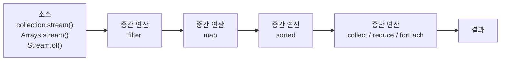

---

title: Java 8 - Stream/Lambda
date: 2022-08-09
categories: [Java]
tags: [Stream, Lambda, Java8]
layout: post
toc: true
math: true
mermaid: true

---

## 참고자료

- [java.util.stream 패키지 요약](https://docs.oracle.com/javase/8/docs/api/java/util/stream/package-summary.html)
- [Stream 인터페이스 Javadoc](https://docs.oracle.com/javase/8/docs/api/java/util/stream/Stream.html)
- [Collectors Javadoc](https://docs.oracle.com/javase/8/docs/api/java/util/stream/Collectors.html)
- [The Java Tutorials - Lambda Expressions](https://docs.oracle.com/javase/tutorial/java/javaOO/lambdaexpressions.html)
- [JEP 107: Bulk Data Operations for Collections](https://openjdk.org/jeps/107)
- [Brian Goetz - Translation of Lambda Expressions](https://cr.openjdk.org/~briangoetz/lambda/lambda-translation.html)
- [JLS SE21, 15.27 Lambda Expressions](https://docs.oracle.com/javase/specs/jls/se21/html/jls-15.html#jls-15.27)

---

## 배경

`for` 문으로 잘 돌던 코드를 스트림으로 바꿔 쓰는 사람들이 있었다. 짧아지긴 하는데 **무엇이 더 좋아지는지**를 설명하지 못했다.

그리고 람다가 스트림과 늘 붙어 다니는데 둘의 관계도 흐릿했다. 스트림 때문에 람다가 생긴 것인지, 람다가 있어서 스트림이 가능해진 것인지도 몰랐다.

정리하면서 확인하고 싶었던 것들이다.

- 스트림이 `for` 문 대비 무엇을 해주는가? 단지 짧아지는 것인가?
- 중간 연산과 종단 연산을 나눈 이유가 무엇인가?
- 람다는 컴파일하면 무엇이 되는가? 익명 클래스와 같은 것인가?
- 병렬 스트림은 그냥 붙이면 빨라지는가?

---

## Stream이란 무엇인가

컬렉션이나 배열의 원소를 하나씩 훑으면서 반복 작업을 처리하게 해주는 API다. `for`와 `if`를 직접 쓰지 않고도 같은 일을 표현할 수 있다.

주의할 점은 이름이다. `java.io`의 `InputStream`과는 아무 관계가 없다. 자바독은 스트림을 이렇게 정의한다.

[Stream 자바독](https://docs.oracle.com/javase/8/docs/api/java/util/stream/Stream.html)의 첫 문장을 옮기면 "순차 집계 연산과 병렬 집계 연산을 지원하는 **원소의 시퀀스**"다.

"원소를 담는 자료구조"가 아니라 "원소의 시퀀스"라고 쓴 것이 요점이다. 스트림은 값을 저장하지 않는다. 원본에서 원소를 끌어와 파이프라인을 통과시킬 뿐이다.

### 함수형 프로그래밍과의 관계

객체지향에서는 메서드의 인자로 객체를 넘긴다. 함수형에서는 인자로 함수를 넘기고, 변수에 함수를 담고, 함수를 반환값으로 받는다. 자바 8은 후자를 문법 수준에서 지원하기 위해 람다 표현식과 함수형 인터페이스를 도입했고, 스트림은 그 위에 얹힌 API다.

---

## 스트림 파이프라인의 세 단계

자바독은 스트림 연산을 소스, 중간 연산, 종단 연산으로 나눈다.



중간 연산은 스트림을 반환하므로 계속 이어 붙일 수 있다. 종단 연산은 스트림이 아닌 값을 반환하고, 여기서 파이프라인이 끝난다.

### 종단 연산이 하나뿐인 이유

흔히 "종단 연산은 하나의 값으로 줄이니까 하나만 쓸 수 있다"고 설명하는데, 이 설명은 `forEach` 같은 연산에 들어맞지 않는다. `forEach`는 아무 값도 만들지 않지만 여전히 종단 연산이고, 그 뒤로 다른 연산을 붙일 수 없다.

실제 이유는 자바독에 명시되어 있다.

[java.util.stream 패키지 문서](https://docs.oracle.com/javase/8/docs/api/java/util/stream/package-summary.html)가 규정한 내용은 이렇다. 스트림에 대한 연산은 중간 연산이든 종단 연산이든 **한 번만** 수행되어야 하며, 재사용이 감지되면 구현체가 `IllegalStateException`을 던질 수 있다.

즉 종단 연산이 하나인 이유는 반환값의 형태가 아니라 **스트림이 일회용이기 때문**이다.

```java
Stream<Integer> stream = List.of(1, 2, 3).stream();
stream.forEach(System.out::println);
stream.count();  // IllegalStateException: stream has already been operated upon or closed
```

### 중간 연산은 지연 실행된다

중간 연산만 늘어놓고 종단 연산을 붙이지 않으면 아무 일도 일어나지 않는다.

```java
List.of(1, 2, 3).stream()
    .map(n -> {
        System.out.println("map 호출: " + n);
        return n * n;
    });
// 출력 없음
```

이 성질 때문에 파이프라인은 원소 단위로 세로로 흐른다. `filter`가 전체를 훑고 나서 `map`이 전체를 훑는 것이 아니라, 원소 하나가 `filter`와 `map`을 차례로 통과한 뒤 다음 원소로 넘어간다. `findFirst`처럼 조건을 만족하는 순간 멈추는 연산이 전체를 순회하지 않아도 되는 이유가 여기에 있다.

---

## 기본 사용

### 리스트 합계, 반복문 방식

```java
private static int normalSum(List<Integer> numbers) {
    int sum = 0;
    for (int number : numbers) {
        sum += number;
    }
    return sum;
}
```

### 리스트 합계, 스트림 방식

```java
private static int streamSum(List<Integer> numbers) {
    return numbers.stream()
            .reduce(0, (number1, number2) -> number1 + number2);
}
```

`reduce(초기값, 누적함수)` 형태다. 초기값에서 시작해 원소를 차례로 누적 함수에 넣고, 그 결과를 다음 호출의 첫 인자로 넘긴다.

`Integer`를 다루므로 매 연산마다 언박싱과 박싱이 일어난다. 정수 합계라면 기본형 특화 스트림을 쓰는 편이 낫다.

```java
private static int primitiveSum(List<Integer> numbers) {
    return numbers.stream()
            .mapToInt(Integer::intValue)   // IntStream으로 전환
            .sum();
}
```

---

## 중간 연산

### sorted

```java
private static void middleOperationSorted(List<Integer> numbers) {
    numbers.stream()
            .sorted()
            .forEach(System.out::println);
}
```

### distinct

```java
// 중복 제거만
private static void middleOperationDistinct(List<Integer> numbers) {
    numbers.stream()
            .distinct()
            .forEach(System.out::println);
}

// 중복 제거 후 정렬
private static void middleOperationDistinctSorted(List<Integer> numbers) {
    numbers.stream()
            .distinct()
            .sorted()
            .forEach(System.out::println);
}
```

`distinct`는 `equals`로 중복을 판정한다. 사용자 정의 타입을 넣으면서 `equals`와 `hashCode`를 재정의하지 않으면 참조가 다른 동일 값 객체가 그대로 남는다.

### filter

```java
// if문을 대체한다. 홀수만 합산
private static int middleOperationFilter(List<Integer> numbers) {
    return numbers.stream()
            .filter(number -> number % 2 == 1)
            .reduce(0, (number1, number2) -> number1 + number2);
}
```

음수가 섞이면 `number % 2 == 1`은 홀수를 걸러내지 못한다. 자바에서 `-3 % 2`는 `-1`이기 때문이다. 부호와 무관하게 홀수를 판정하려면 `number % 2 != 0`을 쓴다.

### map

```java
private static void middleOperationMap(List<Integer> numbers) {
    numbers.stream()
            .map(n -> n * n)
            .forEach(System.out::println);

    // 원본은 그대로다
    numbers.forEach(System.out::println);
}
```

`[4, 6, 8, 13, 3, 15, 8, 6, 21]`을 넣으면 첫 번째 출력은 제곱값이고 두 번째 출력은 원본이다.

```
16 36 64 169 9 225 64 36 441
4 6 8 13 3 15 8 6 21
```

`map`은 원본을 바꾸지 않는다. 새 값을 흘려보낼 뿐이다. 다만 원소가 가변 객체이고 매핑 함수 안에서 그 객체의 필드를 건드리면 원본도 바뀐다. 스트림이 지켜주는 것은 "컬렉션 구조를 바꾸지 않는다"까지다.

```java
// 문자열을 모두 소문자로
private static void mapToLowerCase() {
    Stream.of("Apple", "Ant", "Bat")
            .map(String::toLowerCase)
            .forEach(System.out::println);
}

// 각 문자열의 길이
private static void mapLengthOfString() {
    Stream.of("Apple", "Ant", "Bat")
            .mapToInt(String::length)
            .forEach(System.out::println);
}
```

---

## 종단 연산

### max, min

```java
// 가장 큰 값
private static Optional<Integer> endMax(List<Integer> numbers) {
    return numbers.stream()
            .max(Integer::compare);
}

// 가장 작은 값
private static Optional<Integer> endMin(List<Integer> numbers) {
    return numbers.stream()
            .min(Integer::compare);
}
```

반환 타입이 `Optional<Integer>`다. 빈 스트림에는 최댓값이 없으므로 `null`을 돌려주는 대신 빈 `Optional`을 돌려준다. 값을 꺼낼 때는 기본값을 함께 정해두는 편이 안전하다.

```java
int max = numbers.stream()
        .max(Integer::compare)
        .orElse(Integer.MIN_VALUE);
```

### collect

```java
// 짝수만 골라 리스트로
private static List<Integer> collectEven(List<Integer> numbers) {
    return numbers.stream()
            .filter(n -> n % 2 == 0)
            .collect(Collectors.toList());
}
```

자바 16 이상에서는 `toList()`로 줄일 수 있다. 다만 반환되는 리스트가 불변이라는 차이가 있다.

```java
List<Integer> immutable = numbers.stream()
        .filter(n -> n % 2 == 0)
        .toList();   // 수정하면 UnsupportedOperationException
```

---

## 반복문과 스트림의 성능

배열에서 최댓값을 구하는 두 코드를 비교했다.

```java
// 반복문
int[] a = ints;
int e = ints.length;
int m = Integer.MIN_VALUE;
for (int i = 0; i < e; i++) {
    if (a[i] > m) m = a[i];
}
```

```java
// 스트림
int m = Arrays.stream(ints)
        .reduce(Integer.MIN_VALUE, Math::max);
```

측정 결과는 반복문 0.36ms, 순차 스트림 5.35ms였다. `int[]`가 아니라 `ArrayList`에서도 반복문이 더 빨랐다.

### 왜 느린가

처음에는 "스트림이 나중에 나온 문법이라 컴파일러가 아직 최적화하지 못한다"는 설명을 봤는데, 확인해보니 근거가 약하다. JIT 컴파일러는 소스 문법이 아니라 실행 중인 바이트코드와 프로파일을 보고 최적화하므로 문법이 언제 도입됐는지는 판단 근거가 아니다.

람다 변환 방식을 보면 다른 답이 나온다. 람다는 익명 클래스로 컴파일되지 않는다. `invokedynamic` 명령으로 컴파일되고, 런타임에 `LambdaMetafactory`가 구현체를 만들어 연결한다.

람다 변환 방식을 설계한 [Brian Goetz의 문서](https://cr.openjdk.org/~briangoetz/lambda/lambda-translation.html)가 그 이유를 설명한다. 컴파일러는 클래스 파일을 컴파일 시점에 만들지 않고 `invokedynamic` 호출 지점을 만든다. 그 호출 지점의 정적 인자 목록이 람다 본문을 서술하고, **람다를 어떻게 표현할지는 런타임이 결정한다.**

여기서 비용이 세 갈래로 나온다.

첫째, **인터페이스를 통한 간접 호출**이다. `reduce`는 인자로 받은 `IntBinaryOperator`를 원소마다 호출한다. 한 호출 지점에 한 종류의 구현체만 오면(monomorphic) JIT가 인라이닝해서 비용을 거의 없앨 수 있다. 그런데 같은 스트림 코드를 서로 다른 람다로 여러 번 호출하면 그 호출 지점이 megamorphic이 되고, 이때는 인라이닝이 포기된다. 반복문에는 이 호출 지점 자체가 없다.

둘째, **파이프라인 객체 생성**이다. 스트림 하나를 만들 때마다 `Spliterator`와 단계별 `Sink` 객체가 만들어진다. 원소가 몇 개뿐이면 이 준비 비용이 실제 계산보다 크다.

셋째, **박싱**이다. `Stream<Integer>`는 원소마다 `Integer` 객체를 오간다. 위 예시는 `Arrays.stream(int[])`가 `IntStream`을 돌려주므로 이 문제는 피했지만, 컬렉션에서 시작하는 대부분의 코드에는 박싱이 남는다.

정리하면 느린 원인은 문법의 나이가 아니라 호출 간접화, 파이프라인 준비 비용, 박싱이다. 그래서 원소 수가 많고 연산이 무거워질수록 준비 비용이 상대적으로 작아지고, 병렬 스트림을 쓸 수 있는 조건이면 순서가 뒤집히기도 한다.

### 그럼에도 스트림을 쓰는 이유

이 측정은 배열 최댓값이라는 한 가지 경우다. 반복문 안에서 인덱스와 누적 변수를 직접 다루면 그만큼 실수할 자리가 생기고, 조건이 세 개쯤 겹치면 중첩 `if` 때문에 의도를 읽기 어려워진다. 스트림은 "무엇을 거르고 무엇으로 바꾸는가"를 그대로 드러낸다.

밀리초 단위 차이가 문제 되는 구간은 생각보다 좁다. 그 구간이 어디인지 측정으로 확인한 다음에 반복문으로 바꾸는 순서가 맞다.

---

## 람다로 가는 여섯 단계

자바 공식 튜토리얼은 조건에 맞는 객체를 골라내는 문제를 여섯 단계로 발전시키면서 람다가 왜 필요한지 보여준다. 같은 흐름을 따라가며 정리했다.

### 준비

```java
public static void main(String[] args) {
    List<Person> roster = List.of(
            new Person("Diger", 24, Person.Gender.MALE),
            new Person("John", 25, Person.Gender.MALE),
            new Person("Minsu", 26, Person.Gender.MALE),
            new Person("Jieun", 23, Person.Gender.FEMALE),
            new Person("Sora", 22, Person.Gender.FEMALE)
    );
}
```

### 접근 1. 조건을 메서드에 박아 넣기

```java
public static void printPersonsOlderThan(List<Person> roster, int age) {
    for (Person person : roster) {
        if (person.getAge() >= age) {
            System.out.println(person.getName());
        }
    }
}
```

`age` 이상이라는 조건이 메서드 본문에 고정되어 있다. 나이 범위로 찾고 싶어지면 메서드를 새로 만들어야 한다.

### 접근 2. 조건을 조금 더 일반화하기

```java
public static void printPersonsWithinAgeRange(List<Person> roster, int low, int high) {
    for (Person person : roster) {
        if (low <= person.getAge() && person.getAge() < high) {
            System.out.println(person.getName());
        }
    }
}
```

범위 검색은 되지만 성별로 찾자는 요구가 오면 다시 메서드가 하나 늘어난다. 조건이 늘어나는 만큼 메서드가 늘어나는 구조 자체는 그대로다.

### 접근 3. 조건을 객체로 분리하기

```java
public class CheckPersonEligibleForSelectiveService {

    public boolean test(Person person) {
        return person.getGender() == Person.Gender.MALE
                && person.getAge() >= 18
                && person.getAge() <= 25;
    }
}
```

```java
public static void printPersons(List<Person> roster, CheckPersonEligibleForSelectiveService tester) {
    for (Person person : roster) {
        if (tester.test(person)) {
            System.out.println(person.getName());
        }
    }
}
```

순회 로직과 판정 조건이 분리됐다. 이제 조건이 바뀌어도 `printPersons`는 그대로다. 대신 조건 하나마다 클래스 파일이 하나씩 생긴다.

### 접근 4. 익명 클래스로 클래스 선언 줄이기

```java
printPersons(roster, new CheckPerson() {
    @Override
    public boolean test(Person person) {
        return person.getGender() == Person.Gender.MALE
                && person.getAge() >= 18
                && person.getAge() <= 25;
    }
});
```

파일은 안 늘어나지만, 정작 전달하려는 것은 `test`의 본문 한 줄인데 그 주위를 감싸는 문법이 다섯 줄이다.

### 접근 5. 람다 표현식

`CheckPerson`은 추상 메서드가 하나뿐인 인터페이스, 즉 함수형 인터페이스다. 이런 인터페이스는 람다로 대체할 수 있다.

```java
printPersons(roster, person ->
        person.getGender() == Person.Gender.MALE
                && person.getAge() >= 18
                && person.getAge() <= 25);
```

`java.util.function.Predicate<T>`가 이미 같은 모양을 제공하므로 인터페이스를 직접 만들 필요도 없다.

```java
public static void printPersons(List<Person> roster, Predicate<Person> tester) {
    for (Person person : roster) {
        if (tester.test(person)) {
            System.out.println(person.getName());
        }
    }
}

// 호출부
printPersons(roster, person -> person.getAge() >= 24);
```

### 접근 6. 스트림과 결합

여기까지 오면 순회 코드도 남길 이유가 없다.

```java
roster.stream()
        .filter(person -> person.getAge() >= 24)
        .map(Person::getName)
        .forEach(System.out::println);
```

접근 1에서는 조건을 바꾸려면 메서드를 새로 만들어야 했다. 접근 6에서는 `filter`에 넘기는 람다만 바꾸면 된다. 이 여섯 단계가 결국 하나의 방향을 가리킨다. **변하는 부분을 값으로 만들어 밖에서 주입할 수 있게 하는 것**이고, 람다는 그 값이 함수일 때 쓰는 문법이다.

---

## 흔히 틀리는 지점

**스트림 재사용.** 종단 연산을 두 번 부르면 `IllegalStateException`이 난다. 같은 소스를 두 번 쓰려면 `stream()`을 다시 호출해야 한다.

**중간 연산만 쓰고 끝내기.** 종단 연산이 없으면 파이프라인은 실행되지 않는다. 컴파일 에러도 나지 않으므로 조용히 아무 일도 일어나지 않는다.

**`peek`로 부수 효과 넣기.** 자바독은 `peek`을 디버깅 용도로만 설명한다. 게다가 종단 연산이 원소를 다 필요로 하지 않으면 `peek`이 일부 원소에서만 호출된다.

**병렬 스트림에서 공유 상태 변경.** `parallelStream()` 안에서 바깥 변수를 수정하면 결과가 실행할 때마다 달라진다. 누적이 필요하면 `collect`나 `reduce`를 쓴다.

---

## 정리하며

처음 던진 질문들에 대한 답이다.

**`for` 문 대비 무엇을 해주는가.** 짧아지는 것은 부수 효과다. 실제로 달라지는 것은 **무엇을 할지와 어떻게 할지가 분리된다**는 점이다.

`for` 문은 순회 방법이 코드에 박혀 있다. 인덱스를 어떻게 올리고 언제 멈출지가 전부 드러나 있다. 스트림은 "걸러서 변환해서 모은다"만 적고, **순회 방법은 라이브러리가 정한다.**

그래서 병렬 처리로 바꿀 때 코드가 거의 안 바뀐다. 순회 방법이 밖에 있으니 그것만 바꾸면 된다.

**중간 연산과 종단 연산을 왜 나눴는가.** 지연 실행을 위해서다. 중간 연산은 파이프라인을 조립할 뿐 실행하지 않고, **종단 연산이 불릴 때 한 번에 흐른다.**

이게 두 가지를 가능하게 한다. **원소마다 전체 파이프라인을 통과시킬 수 있어서** 중간 결과 컬렉션을 만들지 않는다. 그리고 `findFirst`처럼 일부만 필요한 경우 **나머지를 아예 계산하지 않는다.**

종단 연산이 없으면 아무 일도 안 일어나는 것이 이 구조의 결과다.

**람다는 컴파일하면 무엇이 되는가.** 익명 클래스와 다르다. 익명 클래스는 컴파일할 때 클래스 파일이 하나 더 생기고 실행 시점에 객체가 만들어진다.

람다는 **`invokedynamic`이라는 명령으로 컴파일되고, 실제 구현체는 실행 중에 만들어진다.** 클래스 파일이 늘지 않고, 상태를 안 가지는 람다는 인스턴스가 재사용되기도 한다.

**병렬 스트림은 붙이면 빨라지는가.** 아니다. 오히려 느려지는 경우가 많다.

작업을 쪼개고 나눠 주고 합치는 비용이 든다. **원소가 적거나 원소당 작업이 가벼우면 그 비용이 이득보다 크다.**

그리고 기본 스레드 풀을 공유한다. 한 곳에서 오래 도는 병렬 스트림이 있으면 **다른 곳의 병렬 스트림이 그동안 밀린다.**

**순서에 의존하거나 공유 상태를 바꾸는 코드는 아예 틀린 결과를 낸다.** 누적이 필요하면 바깥 변수를 고치지 말고 `collect`나 `reduce`를 써야 한다.

정리하고 나서 남은 감각은 **스트림이 문법 설탕이 아니라 "어떻게"를 넘기는 장치**라는 것이었다. 순회 방법을 라이브러리에 맡겼기 때문에 지연 실행도 병렬화도 가능해졌고, 반대로 순회 방법에 의존하는 코드를 스트림으로 옮기면 그 자리에서 문제가 생겼다.