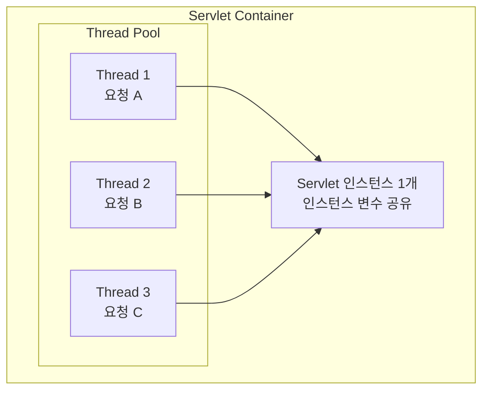
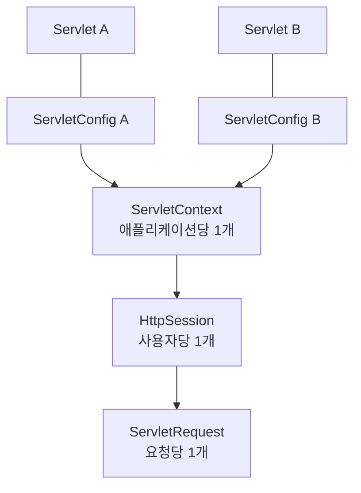

---

title: Interface 명세로 알아보는 Servlet
date: 2022-08-15
categories: [Java, Spring, Servlet]
tags: [Java, Spring, Servlet]
layout: post
toc: true
math: true
mermaid: true

---

## 참고자료

- [Jakarta Servlet Specification 6.0](https://jakarta.ee/specifications/servlet/6.0/jakarta-servlet-spec-6.0)
- [Jakarta Servlet API - Servlet](https://jakarta.ee/specifications/servlet/6.0/apidocs/jakarta.servlet/jakarta/servlet/servlet)
- [Jakarta Servlet API - ServletRequest](https://jakarta.ee/specifications/servlet/6.0/apidocs/jakarta.servlet/jakarta/servlet/servletrequest)
- [Jakarta Servlet API - ServletResponse](https://jakarta.ee/specifications/servlet/6.0/apidocs/jakarta.servlet/jakarta/servlet/servletresponse)
- [HttpServlet.java 소스 (Tomcat)](https://github.com/apache/tomcat/blob/main/java/jakarta/servlet/http/HttpServlet.java)
- [The Java EE 5 Tutorial - Java Servlet Technology](https://docs.oracle.com/javaee/5/tutorial/doc/bnafe.html)

---

## 배경

스프링을 쓰면서 서블릿을 직접 만든 적은 한 번도 없었다. `@RestController`에 메서드를 쓰면 요청이 알아서 들어오고 반환값이 알아서 JSON이 된다.

그런데 몇 가지가 설명되지 않았다.

- 컨트롤러의 필드에 상태를 담으면 왜 위험한가? 스프링 빈이 싱글톤이라는 말은 들었는데, 그 싱글톤은 어디서 오는가?
- `@GetMapping`, `@PostMapping`은 결국 무엇으로 갈라지는가?
- 응답을 다 쓴 뒤에 상태 코드를 바꾸려 하면 왜 `IllegalStateException`이 나는가?

세 질문 모두 답이 서블릿 명세에 있었다. 인터페이스 선언과 그 위에 붙은 명세 문구를 하나씩 읽으면서 확인했다.

---

## 서블릿이란 무엇인가

명세는 서블릿을 이렇게 정의한다.

[공식 튜토리얼](https://docs.oracle.com/javaee/5/tutorial/doc/bnafe.html)의 정의를 옮기면 이렇다. 서블릿은 **요청과 응답 방식으로 접근되는 애플리케이션을 호스팅하는 서버의 기능을 확장하는 자바 클래스**다.

정의에 HTTP가 없다는 점이 눈에 띈다. 서블릿 자체는 프로토콜 중립이고, HTTP에 특화된 것은 그 하위 계층인 `HttpServlet`이다.

아래 코드의 패키지 이름은 이 글을 쓸 당시의 `javax.servlet` 기준이다. Jakarta EE 9부터 `jakarta.servlet`으로 바뀌었고, 스프링 부트 3.x 이상은 후자를 쓴다.

---

## Servlet 인터페이스

```java
public interface Servlet {

    void init(ServletConfig config) throws ServletException;

    ServletConfig getServletConfig();

    void service(ServletRequest req, ServletResponse res) throws ServletException, IOException;

    String getServletInfo();

    void destroy();
}
```

메서드 다섯 개가 전부다. 이 중 셋이 생명주기를 이룬다.

### init(ServletConfig)

명세가 규정하는 내용은 이렇다. 서블릿 컨테이너는 서블릿 인스턴스를 만든 뒤 `init`을 **정확히 한 번(exactly once)** 호출하고, `init`이 성공적으로 끝나야 그 서블릿이 요청을 받기 시작한다.

"정확히 한 번"이라는 표현이 요점이다. 요청마다가 아니라 인스턴스마다 한 번이다. 명세는 실패 조건도 함께 못 박는다. `ServletException`을 던지거나 웹 서버가 정한 시간 안에 반환하지 않으면 컨테이너는 그 서블릿을 서비스에 투입하지 않는다.

### service(ServletRequest, ServletResponse)

여기에 첫 번째 질문의 답이 있다.

명세는 `service` 메서드를 설명하면서 이런 경고를 붙인다. 서블릿은 보통 여러 요청을 동시에 처리하는 **멀티스레드 컨테이너** 안에서 실행되므로, 개발자가 공유 자원에 대한 접근을 직접 동기화해야 한다는 것이다. 그리고 그 공유 자원 목록에 파일과 네트워크 연결뿐 아니라 **서블릿의 클래스 변수와 인스턴스 변수**를 명시적으로 포함시킨다.

명세가 인스턴스 변수를 공유 자원으로 분류한다. 서블릿 인스턴스는 하나인데 그 위를 여러 요청 스레드가 동시에 지나가기 때문이다.



이 그림이 곧 스프링 빈이 왜 상태를 가지면 안 되는지에 대한 설명이기도 하다. 디스패처 서블릿도 서블릿이므로 인스턴스가 하나이고, 그 서블릿이 호출하는 컨트롤러 빈도 기본 스코프가 싱글톤이다. 컨트롤러 필드에 요청별 값을 담으면 두 요청이 같은 필드를 덮어쓴다.

```java
@RestController
public class BadController {

    private String currentUser;   // 요청 스레드들이 공유한다

    @GetMapping("/me")
    public String me(@RequestParam String user) {
        this.currentUser = user;              // 스레드 A가 쓰고
        return "hello " + this.currentUser;   // 스레드 B가 덮어쓴 값을 읽을 수 있다
    }
}
```

요청별 상태는 메서드 지역 변수나 `ServletRequest`의 속성에 둔다. 지역 변수는 스레드마다 별도의 스택에 잡히므로 공유되지 않는다.

과거에는 `SingleThreadModel`이라는 마커 인터페이스가 있었지만 서블릿 2.4에서 deprecated 됐다. 인스턴스를 여러 개 만들어 스레드 안전을 흉내 내는 방식이라, 클래스 변수는 여전히 공유되면서 확장성만 떨어뜨렸기 때문이다.

### destroy()

명세가 규정하는 호출 시점은 두 갈래다. `service` 메서드 안에 있던 모든 스레드가 **빠져나갔거나**, 정해진 **타임아웃이 지났거나**. 그리고 컨테이너가 `destroy`를 호출한 뒤로는 그 서블릿의 `service`를 다시 부르지 않는다.

"타임아웃이 지난 뒤에도 호출된다"는 조건이 붙어 있다. 처리 중인 요청이 늦어지면 컨테이너는 그것을 기다리지 않고 `destroy`를 부른다. 그래서 종료 처리에서 정리하는 자원과 요청 처리에서 쓰는 자원이 겹치면, 종료 중인 서블릿 위에서 남은 요청이 이미 닫힌 자원을 만질 수 있다.

---

## HttpServlet.service()가 HTTP 메서드를 가르는 곳

두 번째 질문의 답이다. `@GetMapping`과 `@PostMapping`은 결국 어디서 갈라지는가.

`HttpServlet`은 `Servlet`의 `service(ServletRequest, ServletResponse)`를 구현하면서, HTTP 요청을 받아 메서드 이름으로 분기한다.

```java
protected void service(HttpServletRequest req, HttpServletResponse resp)
        throws ServletException, IOException {

    String method = req.getMethod();

    if (method.equals(METHOD_GET)) {
        long lastModified = getLastModified(req);
        if (lastModified == -1) {
            // servlet doesn't support if-modified-since, no reason
            // to go through further expensive logic
            doGet(req, resp);
        } else {
            long ifModifiedSince;
            try {
                ifModifiedSince = req.getDateHeader(HEADER_IFMODSINCE);
            } catch (IllegalArgumentException iae) {
                // Invalid date header - proceed as if none was set
                ifModifiedSince = -1;
            }
            if (ifModifiedSince < (lastModified / 1000 * 1000)) {
                // If the servlet mod time is later, call doGet()
                // Round down to the nearest second for a proper compare
                // A ifModifiedSince of -1 will always be less
                maybeSetLastModified(resp, lastModified);
                doGet(req, resp);
            } else {
                resp.setStatus(HttpServletResponse.SC_NOT_MODIFIED);
            }
        }

    } else if (method.equals(METHOD_HEAD)) {
        long lastModified = getLastModified(req);
        maybeSetLastModified(resp, lastModified);
        doHead(req, resp);

    } else if (method.equals(METHOD_POST)) {
        doPost(req, resp);

    } else if (method.equals(METHOD_PUT)) {
        doPut(req, resp);

    } else if (method.equals(METHOD_DELETE)) {
        doDelete(req, resp);

    } else if (method.equals(METHOD_OPTIONS)) {
        doOptions(req, resp);

    } else if (method.equals(METHOD_TRACE)) {
        doTrace(req, resp);

    } else {
        // Note that this means NO servlet supports whatever
        // method was requested, anywhere on this server.
        String errMsg = lStrings.getString("http.method_not_implemented");
        Object[] errArgs = new Object[1];
        errArgs[0] = method;
        errMsg = MessageFormat.format(errMsg, errArgs);

        resp.sendError(HttpServletResponse.SC_NOT_IMPLEMENTED, errMsg);
    }
}
```

읽어볼 만한 지점이 두 개 있다.

**GET에만 조건부 요청 처리가 붙어 있다.** `getLastModified`가 `-1`이 아니면 요청의 `If-Modified-Since` 헤더와 비교해서, 변경이 없으면 본문을 만들지 않고 304를 돌려준다. 주석이 "no reason to go through further expensive logic"이라고 밝힌 그대로, 본문 생성 비용을 건너뛰기 위한 분기다. `lastModified / 1000 * 1000`은 HTTP 날짜 헤더가 초 단위라 밀리초를 버리고 비교하려는 것이다.

**마지막 else의 응답이 501이다.** 404가 아니다. 컨테이너가 인식하지 못하는 HTTP 메서드는 "자원이 없다"가 아니라 "서버가 이 메서드를 구현하지 않았다"로 답한다.

스프링 MVC는 여기서 한 층 더 간다. 디스패처 서블릿이 `HttpServlet`을 상속하고 `doGet`, `doPost` 등을 모두 하나의 처리 경로로 모은 다음, `RequestMappingHandlerMapping`이 URL과 HTTP 메서드 조합으로 핸들러 메서드를 찾는다. `@GetMapping`이 붙은 메서드가 호출되기까지 위 `if` 체인을 반드시 지난다.

---

## ServletConfig, 서블릿 하나의 설정

```java
public interface ServletConfig {

    String getServletName();

    ServletContext getServletContext();

    String getInitParameter(String name);

    Enumeration<String> getInitParameterNames();
}
```

`getServletName()`은 서블릿 인스턴스의 이름을 돌려준다. 배포 서술자에 지정한 이름이 있으면 그것이고, 등록되지 않은 서블릿이면 클래스 이름이 된다.

`getInitParameter(String)`은 이름 그대로 **초기화 파라미터**를 읽는다. 서블릿 인스턴스의 이름을 읽는 메서드가 아니다. 이 파라미터는 `web.xml`의 `<init-param>`이나 자바 설정에서 지정한다.

```xml
<servlet>
  <servlet-name>myServlet</servlet-name>
  <servlet-class>com.example.MyServlet</servlet-class>
  <init-param>
    <param-name>configPath</param-name>
    <param-value>/WEB-INF/my-config.xml</param-value>
  </init-param>
</servlet>
```

`getServletContext()`가 돌려주는 `ServletContext`는 범위가 다르다. `ServletConfig`가 서블릿 하나의 설정이라면 `ServletContext`는 웹 애플리케이션 전체가 공유하는 컨텍스트다. 그래서 여기에 담은 속성은 모든 서블릿에서 보이고, 동시에 모든 요청 스레드가 함께 만지는 공유 자원이 된다.



속성을 담을 수 있는 범위가 `ServletContext`, `HttpSession`, `ServletRequest` 세 가지이고, 아래로 갈수록 수명이 짧고 공유 범위가 좁다. 요청 하나 동안만 필요한 값을 `ServletContext`에 넣으면 다른 요청이 그 값을 읽는다.

---

## ServletRequest에서 실제로 걸렸던 것들

`ServletRequest`는 메서드가 서른 개 남짓이다. 전부 옮겨 적는 대신, 쓰면서 문제가 됐던 것만 정리했다.

### 본문은 한 번만 읽을 수 있다

`getInputStream()`과 `getReader()`는 같은 본문을 서로 다른 방식으로 읽는다. 명세는 둘 중 하나만 호출할 수 있다고 규정하고, 이미 읽은 스트림은 되감을 수 없다.

```java
BufferedReader reader = request.getReader();
String body = reader.lines().collect(Collectors.joining());

request.getInputStream();   // IllegalStateException
```

요청 본문을 로깅하는 필터를 만들 때 이 제약이 곧바로 문제가 된다. 필터가 본문을 읽어버리면 컨트롤러의 `@RequestBody`가 빈 값을 받는다. 그래서 본문을 다시 읽어야 하면 `HttpServletRequestWrapper`로 감싸 내용을 캐시해두고, 그 래퍼를 `chain.doFilter()`에 넘긴다.

```java
public class CachedBodyRequestWrapper extends HttpServletRequestWrapper {

    private final byte[] cachedBody;

    public CachedBodyRequestWrapper(HttpServletRequest request) throws IOException {
        super(request);
        this.cachedBody = request.getInputStream().readAllBytes();
    }

    @Override
    public ServletInputStream getInputStream() {
        return new CachedBodyServletInputStream(this.cachedBody);
    }

    @Override
    public BufferedReader getReader() {
        return new BufferedReader(
                new InputStreamReader(new ByteArrayInputStream(this.cachedBody)));
    }
}
```

이 래퍼는 필터에서만 만들 수 있다. 인터셉터는 이미 확정된 요청 객체를 넘겨받으므로 교체할 수 없다. 본문을 통째로 메모리에 올리므로 업로드 요청처럼 큰 본문에는 적용 대상에서 빼야 한다.

### 인코딩은 본문을 읽기 전에 정해야 한다

명세는 `setCharacterEncoding`에 순서 제약을 건다. **요청 파라미터를 읽거나 `getReader()`로 입력을 읽기 전에** 호출해야 한다는 것이다.

`setCharacterEncoding("UTF-8")`을 파라미터를 한 번 읽은 뒤에 호출하면 아무 효과가 없다. 한글이 깨지는데 인코딩 설정을 아무리 넣어도 고쳐지지 않는 상황이 대체로 이 순서 문제다. 그래서 인코딩을 강제하는 필터는 필터 체인 맨 앞에 둔다.

### getRemoteAddr()이 돌려주는 것은 클라이언트 IP가 아닐 수 있다

명세는 이 메서드가 "요청을 보낸 클라이언트나 **마지막 프록시**의 IP 주소"를 돌려준다고 쓴다. 리버스 프록시나 로드밸런서 뒤에 애플리케이션을 두면 여기서 나오는 값은 그 프록시의 주소다.

실제 클라이언트 주소는 프록시가 넣어준 `X-Forwarded-For` 헤더에서 읽어야 한다. 다만 이 헤더는 클라이언트가 위조해서 보낼 수도 있으므로, 신뢰할 수 있는 프록시가 덧붙인 값만 인정하도록 처리해야 한다. 이 값을 그대로 접근 제어나 감사 로그에 쓰면 위조된 주소를 기록하게 된다.

### getRealPath(String)은 deprecated다

인터페이스에 `@Deprecated`가 붙어 있다. WAR를 압축 해제하지 않고 실행하거나 원격 파일 시스템을 쓰면 대응하는 실제 경로가 없기 때문이다. 대신 `ServletContext.getResourceAsStream(String)`으로 스트림을 받는다.

---

## ServletResponse와 커밋

세 번째 질문의 답이다. 응답을 쓴 뒤에 상태 코드를 바꾸면 왜 예외가 나는가.

```java
public interface ServletResponse {

    String getCharacterEncoding();
    String getContentType();
    ServletOutputStream getOutputStream() throws IOException;
    PrintWriter getWriter() throws IOException;
    void setCharacterEncoding(String charset);
    void setContentLength(int len);
    void setContentType(String type);
    void setBufferSize(int size);
    int getBufferSize();
    void flushBuffer() throws IOException;
    void resetBuffer();
    boolean isCommitted();
    void reset();
    void setLocale(Locale loc);
    Locale getLocale();
}
```

### 커밋이란 무엇인가

명세가 정의하는 "커밋된 응답(committed response)"은 **이미 상태 코드와 헤더가 기록되어 나간 응답**이다.

HTTP 응답은 상태 줄과 헤더가 먼저 나가고 본문이 뒤따른다. 한 번 네트워크로 나간 바이트는 회수할 수 없다. 그래서 헤더가 나간 시점 이후로는 상태 코드도 헤더도 바꿀 수 없다.

커밋이 일어나는 시점은 세 가지다.

1. 응답 버퍼가 가득 차서 컨테이너가 내보낼 때
2. `flushBuffer()`를 명시적으로 호출할 때
3. `setContentLength()`로 알린 만큼의 본문을 다 썼을 때

여기서 버퍼의 존재 이유가 드러난다. 버퍼가 없으면 첫 바이트를 쓰는 순간 커밋되므로, 본문을 쓰다가 예외가 나도 에러 응답으로 바꿀 수 없다. 버퍼가 있으면 그 안에 담겨 있는 동안에는 되돌릴 여지가 남는다.

### reset과 resetBuffer의 차이

| 메서드 | 본문 버퍼 | 상태 코드, 헤더 | 커밋 후 호출 시 |
|---|---|---|---|
| `resetBuffer()` | 지움 | 유지 | `IllegalStateException` |
| `reset()` | 지움 | 지움 | `IllegalStateException` |

둘 다 커밋 이후에는 `IllegalStateException`을 던진다. 그래서 예외 처리 코드에서 응답을 갈아엎으려면 먼저 `isCommitted()`로 확인해야 한다.

```java
if (!response.isCommitted()) {
    response.reset();
    response.setStatus(HttpServletResponse.SC_INTERNAL_SERVER_ERROR);
    response.setContentType("application/json");
    response.getWriter().write("{\"message\":\"error\"}");
}
```

스프링에서 `@ExceptionHandler`가 동작하지 않고 응답이 깨진 채로 나가는 경우가 있는데, 상당수가 이 상황이다. 컨트롤러가 응답 스트림에 직접 쓰다가 버퍼를 넘겨 커밋시킨 뒤에 예외를 던지면, 예외 핸들러가 잡더라도 이미 나간 헤더를 되돌릴 수 없다.

### getOutputStream과 getWriter는 함께 쓸 수 없다

명세는 둘 중 하나만 호출할 수 있다고 규정한다. 이미 `getWriter()`를 부른 응답에 `getOutputStream()`을 부르면 `IllegalStateException`이 난다. 바이트 스트림과 문자 스트림이 같은 버퍼를 서로 다른 방식으로 다루기 때문이다.

### 인코딩 설정도 순서를 탄다

`setCharacterEncoding()`은 `getWriter()`를 호출하기 전에 불러야 한다. `getWriter()`가 반환되는 순간 그 시점의 인코딩으로 `PrintWriter`가 만들어지고, 이후 인코딩을 바꿔도 이미 만들어진 Writer에는 반영되지 않는다.

`setLocale()`도 마찬가지다. 명세는 `setContentType`으로 charset을 지정한 뒤, `setCharacterEncoding`을 호출한 뒤, `getWriter`를 호출한 뒤, 또는 응답이 커밋된 뒤에 부르면 문자 인코딩을 설정하지 않는다고 규정한다. HTTP에서 로케일은 `Content-Language` 헤더로, 문자 인코딩은 텍스트 미디어 타입의 `Content-Type` 헤더 일부로 전달된다.

---

## 정리하며

처음 던진 세 질문의 답이다.

**컨트롤러 필드에 상태를 담으면 왜 위험한가.** 서블릿 인스턴스는 하나이고 요청마다 스레드가 다르다. 명세가 서블릿의 인스턴스 변수를 명시적으로 공유 자원으로 분류하고 동기화 책임을 개발자에게 넘긴다. 스프링 빈의 싱글톤 스코프도 같은 구조 위에 있다.

**HTTP 메서드는 어디서 갈라지는가.** `HttpServlet.service()`의 `if` 체인이다. `req.getMethod()` 문자열을 비교해 `doGet`, `doPost` 등으로 보내고, 아무것도 걸리지 않으면 404가 아니라 501을 돌려준다.

**응답을 쓴 뒤 상태 코드를 바꾸면 왜 예외가 나는가.** 상태 줄과 헤더가 본문보다 먼저 나가는 HTTP의 구조 때문이다. 나간 바이트는 회수할 수 없으므로 커밋 이후의 `reset()`은 `IllegalStateException`이 된다. 버퍼는 그 커밋 시점을 늦춰 되돌릴 여지를 만드는 장치다.

세 답이 모두 "서블릿이 그렇게 동작하도록 명세에 적혀 있다"로 귀결된다. 프레임워크가 감춰주는 부분이 많을수록, 예외 상황에서는 감춰진 계층의 규칙이 그대로 드러난다.
