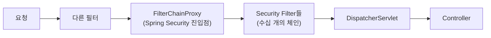
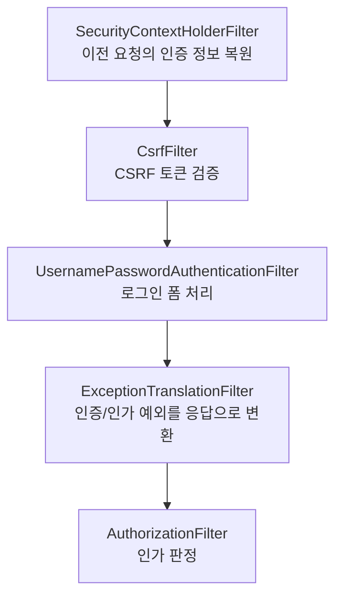
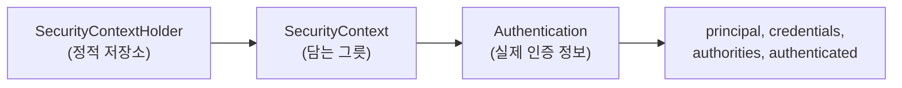
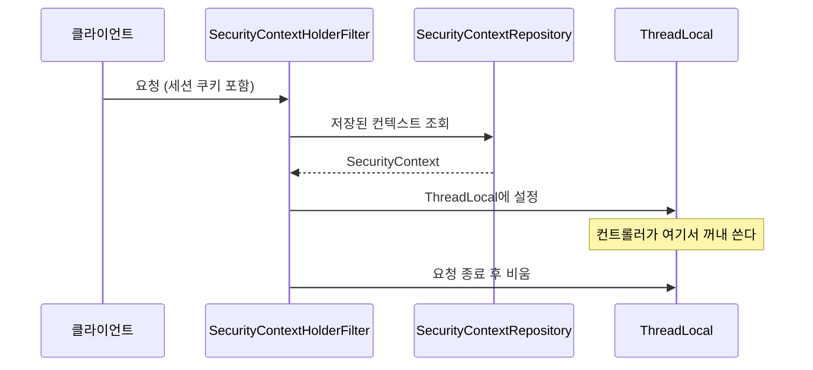
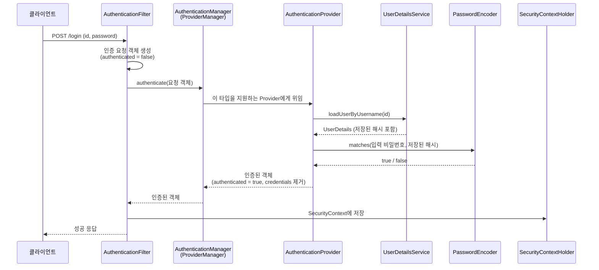
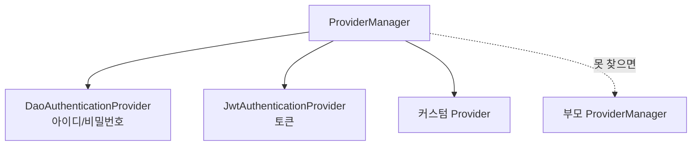

---

title: "Spring Security의 인증이 어디서 어떻게 일어나는가"
date: 2022-08-27
categories: [Spring, Security]
tags: [SpringSecurity, Authentication, Authorization, FilterChain, SecurityContext]
layout: post
toc: true
math: true
mermaid: true

---

## 참고자료

- [Spring Security - Architecture](https://docs.spring.io/spring-security/reference/servlet/architecture.html)
- [Spring Security - Authentication Architecture](https://docs.spring.io/spring-security/reference/servlet/authentication/architecture.html)
- [Spring Security - Username/Password Authentication](https://docs.spring.io/spring-security/reference/servlet/authentication/passwords/index.html)
- [Spring Security - Authorization Architecture](https://docs.spring.io/spring-security/reference/servlet/authorization/architecture.html)

---

## 배경

Spring Security를 설정 파일 몇 줄로 붙여 쓰긴 했는데, 커스텀 인증을 만들려니 어디를 건드려야 할지 몰랐다.

정리하면서 확인하고 싶었던 것들이다.

- Spring Security는 어느 지점에서 동작하는가? 컨트롤러 전인가 후인가?
- 인증 정보가 어디에 저장되길래 컨트롤러에서 `@AuthenticationPrincipal`로 꺼낼 수 있는가?
- 등장하는 인터페이스가 많은데 각각 무슨 역할인가?
- 커스텀 인증을 만들려면 무엇을 구현해야 하는가?

공식 문서를 따라가면서 정리했다.

---

## 1. 용어부터

### 1.1 인증과 인가

**인증(Authentication)** 은 "요청을 보낸 주체가 누구인가"를 확인하는 것이다.

**인가(Authorization)** 는 "확인된 주체가 이 자원에 접근할 권한이 있는가"를 판정하는 것이다.

순서가 정해져 있다. 누구인지 모르면 권한을 따질 수 없으므로 인증이 먼저다.

### 1.2 Principal과 Credentials

인증을 다룰 때 반복해서 나오는 두 단어다.

**Principal**은 인증의 대상, 즉 "누구"에 해당한다. 로그인 아이디나 이메일이 여기 들어간다.

**Credentials**은 그 신원을 증명하는 수단이다. 보통 비밀번호다.

**인증에 성공하면 이 둘의 내용이 바뀐다.** 이 변화가 Spring Security 동작을 이해하는 열쇠다.

| 필드 | 인증 전 | 인증 후 |
|---|---|---|
| `principal` | 아이디 문자열 | 사용자 객체(`UserDetails`) |
| `credentials` | 비밀번호 | **지워진다** |
| `authorities` | 비어 있음 | 권한 목록 |
| `authenticated` | `false` | `true` |

**인증 후에 credentials를 지우는 것**이 요점이다. 인증이 끝나면 비밀번호는 더 이상 필요 없고, 메모리에 남아 있으면 위험하기 때문이다.

---

## 2. 어느 지점에서 동작하는가

첫 번째 질문이다. **Spring Security는 서블릿 필터다.** 그래서 디스패처 서블릿보다 앞에서 동작한다.



**디스패처 서블릿 앞이라는 점이 중요하다.** 인증에 실패하면 컨트롤러까지 가지 않는다. 그리고 스프링 MVC를 안 쓰는 요청에도 적용된다.

### 2.1 필터가 하나가 아니다

Spring Security는 필터 하나가 아니라 **필터들의 체인**이다. 각 필터가 한 가지 일만 한다.



순서가 중요하다. 예를 들어 `ExceptionTranslationFilter`가 `AuthorizationFilter`보다 **앞에** 있어야 인가 실패 예외를 잡아서 401이나 403으로 바꿀 수 있다.

실제로 어떤 필터들이 어떤 순서로 등록됐는지 볼 수 있다.

```yaml
logging:
  level:
    org.springframework.security: DEBUG
```

기동 로그에 필터 목록이 순서대로 찍힌다. **커스텀 필터를 끼워 넣을 때 이걸 먼저 확인해야** 어디에 넣을지 정할 수 있다.

### 2.2 왜 필터로 만들었는가

[서블릿 필터에 관한 글](/posts/Filter-DispatchServlet-Interceptor/)에서 정리한 내용이 여기서 이어진다.

인터셉터가 아니라 필터인 이유가 셋이다.

**스프링 MVC가 아닌 요청도 보호해야 한다.** 정적 자원이나 다른 서블릿으로 가는 요청도 마찬가지다.

**요청 객체를 감싸야 한다.** 인증 정보를 담은 래퍼로 교체하는데, 이건 필터에서만 가능하다.

**디스패처 서블릿에 닿기 전에 끊을 수 있어야 한다.** 인증 실패한 요청이 스프링 MVC 처리 과정에 들어가지 않는 편이 안전하다.

---

## 3. 인증 정보는 어디에 저장되는가

두 번째 질문이다.

### 3.1 SecurityContextHolder

인증 정보를 담는 자리다. 구조가 세 겹이다.



왜 세 겹인가. 각 층이 다른 일을 한다.

**`SecurityContextHolder`** 는 저장 전략을 정한다. 기본값이 `ThreadLocal`이다.

**`SecurityContext`** 는 `Authentication`을 담는 얇은 그릇이다. 나중에 여러 개를 담게 될 수도 있어서 한 겹을 뒀다.

**`Authentication`** 이 실제 인증 정보다.

### 3.2 ThreadLocal이라는 점의 의미

`ThreadLocal`은 **스레드마다 별도의 값을 갖는 저장소**다. 같은 코드에서 같은 변수를 읽어도 스레드마다 다른 값이 나온다.

이 선택이 실무에서 만드는 결과가 셋이다.

**컨트롤러에서 인자 없이 꺼낼 수 있다.**

```java
Authentication auth = SecurityContextHolder.getContext().getAuthentication();
```

요청을 처리하는 스레드에 이미 담겨 있으므로 파라미터로 넘길 필요가 없다. `@AuthenticationPrincipal`도 결국 여기서 꺼내는 것이다.

**다른 스레드에서는 안 보인다.** `@Async` 메서드나 직접 만든 스레드에서 꺼내면 `null`이다.

```java
// 별도 스레드로 전파하려면 설정이 필요하다
SecurityContextHolder.setStrategyName(SecurityContextHolder.MODE_INHERITABLETHREADLOCAL);
```

**요청이 끝나면 반드시 비워야 한다.** 서블릿 컨테이너는 스레드를 재사용한다. 안 지우면 다음 요청이 이전 사용자의 인증 정보를 물려받는다.

Spring Security가 `SecurityContextHolderFilter`에서 이 정리를 해준다. 그래서 직접 신경 쓸 일은 없지만, **`ThreadLocal`을 직접 쓸 때는 이 함정을 기억해야 한다.**

### 3.3 요청 사이에는 어떻게 유지되는가

HTTP는 무상태다. 그런데 로그인 한 번 하면 이후 요청에서도 인증이 유지된다.

`SecurityContextRepository`가 그 역할을 한다. 기본 구현이 세션에 저장하는 방식이다.



토큰 기반 인증에서는 이 저장소를 안 쓴다. 매 요청의 토큰을 검증해서 그때그때 컨텍스트를 만들고, 세션에 저장하지 않는다.

```java
http.sessionManagement(session ->
        session.sessionCreationPolicy(SessionCreationPolicy.STATELESS));
```

---

## 4. 인증이 처리되는 과정

세 번째 질문이다. 아이디와 비밀번호 인증을 예로 전체 흐름을 본다.



각 인터페이스의 역할을 하나씩 본다.

### 4.1 AuthenticationFilter

요청에서 인증 정보를 꺼내 **아직 인증되지 않은** `Authentication` 객체를 만든다.

폼 로그인이면 `UsernamePasswordAuthenticationFilter`가 파라미터에서 아이디와 비밀번호를 꺼낸다. 토큰 인증이면 직접 만든 필터가 헤더에서 토큰을 꺼낸다.

**이 단계에서는 아직 검증하지 않는다.** 검증은 다음 단계다.

### 4.2 AuthenticationManager

인증을 총괄하는 인터페이스다. 메서드가 하나뿐이다.

```java
public interface AuthenticationManager {
    Authentication authenticate(Authentication authentication) throws AuthenticationException;
}
```

**입력도 `Authentication`이고 출력도 `Authentication`이다.** 인증 전 객체를 넣으면 인증 후 객체가 나온다. 1.2절의 표가 이 변화를 보여준다.

기본 구현이 `ProviderManager`다. 이름 그대로 **여러 `AuthenticationProvider`를 들고 있다가 적절한 것에 위임한다.**



### 4.3 AuthenticationProvider

실제 인증 로직이 여기 있다. 메서드가 둘이다.

```java
public interface AuthenticationProvider {

    Authentication authenticate(Authentication authentication) throws AuthenticationException;

    boolean supports(Class<?> authentication);
}
```

**`supports()`가 있는 이유**가 4.2절의 그림에 있다. `ProviderManager`가 여러 Provider를 순회하면서 이 메서드로 "네가 이 타입을 처리할 수 있는가"를 묻는다. `true`를 반환한 것에게 위임한다.

그래서 **인증 방식을 여러 개 지원하려면 Provider를 여러 개 등록하면 된다.** 각자 자기가 아는 타입만 처리한다.

### 4.4 UserDetailsService

저장된 사용자 정보를 가져오는 인터페이스다. 메서드가 하나다.

```java
public interface UserDetailsService {
    UserDetails loadUserByUsername(String username) throws UsernameNotFoundException;
}
```

**여기가 DB와 붙는 지점**이다. 커스텀할 일이 가장 많은 곳이기도 하다.

주의할 점이 있다. **이 인터페이스는 사용자를 찾아오기만 하고 비밀번호를 비교하지 않는다.** 비교는 Provider가 `PasswordEncoder`로 한다.

이 분리가 의미가 있다. 사용자 조회 방식(DB, LDAP, 외부 API)과 비밀번호 검증 방식(BCrypt, Argon2)을 따로 바꿀 수 있다.

### 4.5 PasswordEncoder

비밀번호를 해시하고 비교한다.

```java
public interface PasswordEncoder {
    String encode(CharSequence rawPassword);
    boolean matches(CharSequence rawPassword, String encodedPassword);
}
```

**`matches`가 있고 `decode`가 없다는 점**을 짚어둔다. 해시는 되돌릴 수 없으므로 복호화해서 비교하는 것이 아니라, 입력을 같은 방식으로 해시해서 저장된 값과 비교한다.

```java
@Bean
public PasswordEncoder passwordEncoder() {
    return PasswordEncoderFactories.createDelegatingPasswordEncoder();
}
```

이 팩토리가 만드는 것이 `DelegatingPasswordEncoder`다. 저장된 해시 앞에 `{bcrypt}` 같은 표시를 붙여두고, 그 표시를 보고 어떤 알고리즘으로 검증할지 정한다.

**알고리즘을 바꿀 때 기존 사용자를 막지 않기 위한 장치**다. 새로 저장되는 것은 새 알고리즘으로, 기존 것은 예전 알고리즘으로 검증한다.

---

## 5. 커스텀 인증을 만들려면

네 번째 질문이다. 무엇을 구현할지는 **어디를 바꾸고 싶은가**에 달려 있다.

| 바꾸고 싶은 것 | 구현할 것 |
|---|---|
| 사용자를 어디서 가져올지 | `UserDetailsService` |
| 비밀번호 해시 방식 | `PasswordEncoder` |
| 인증 방식 자체 (토큰 등) | `AuthenticationProvider` + 커스텀 필터 |
| 요청에서 인증 정보를 꺼내는 방식 | 커스텀 필터 |
| 권한 판정 규칙 | `AuthorizationManager` |

### 5.1 가장 흔한 경우

DB에서 사용자를 가져오기만 하면 되는 경우다. `UserDetailsService` 하나만 구현한다.

```java
@Service
@RequiredArgsConstructor
public class CustomUserDetailsService implements UserDetailsService {

    private final MemberRepository memberRepository;

    @Override
    public UserDetails loadUserByUsername(String email) {
        Member member = memberRepository.findByEmail(email)
                .orElseThrow(() -> new UsernameNotFoundException("사용자를 찾을 수 없다: " + email));

        return User.builder()
                .username(member.getEmail())
                .password(member.getPasswordHash())   // 해시된 값을 그대로 넘긴다
                .authorities(member.getRoles().stream()
                        .map(SimpleGrantedAuthority::new)
                        .toList())
                .build();
    }
}
```

**여기서 비밀번호를 비교하면 안 된다.** 저장된 해시를 그대로 넘기고 비교는 Provider에게 맡긴다.

`UsernameNotFoundException`을 던지는 것도 짚어둔다. Spring Security가 이걸 잡아서 **"사용자가 없다"와 "비밀번호가 틀렸다"를 구분하지 않는 응답**으로 바꾼다. 구분해서 알려주면 어떤 계정이 존재하는지를 알려주는 셈이 된다.

### 5.2 토큰 인증을 붙이는 경우

요청 헤더에서 토큰을 꺼내 검증하는 필터를 만들고 체인에 끼운다.

```java
public class JwtAuthenticationFilter extends OncePerRequestFilter {

    private final JwtProvider jwtProvider;

    @Override
    protected void doFilterInternal(HttpServletRequest request,
                                    HttpServletResponse response,
                                    FilterChain chain) throws ServletException, IOException {

        String token = resolveToken(request);

        if (token != null && jwtProvider.validate(token)) {
            Authentication auth = jwtProvider.toAuthentication(token);
            SecurityContextHolder.getContext().setAuthentication(auth);
        }

        chain.doFilter(request, response);
    }
}
```

```java
http.addFilterBefore(jwtAuthenticationFilter,
        UsernamePasswordAuthenticationFilter.class);
```

**`OncePerRequestFilter`를 상속하는 것**이 요점이다. 포워드나 에러 처리로 같은 요청이 필터 체인을 여러 번 지날 수 있는데, 이 클래스가 요청당 한 번만 실행되게 보장한다.

**토큰이 없거나 유효하지 않아도 여기서 예외를 던지지 않는다.** 컨텍스트를 비워둔 채 통과시키고, 인가 단계에서 판정하게 한다. 인증이 필요 없는 경로도 이 필터를 지나기 때문이다.

---

## 6. 인가

인증 다음 단계다. `AuthorizationFilter`가 처리한다.

```java
http.authorizeHttpRequests(auth -> auth
        .requestMatchers("/public/**").permitAll()
        .requestMatchers("/admin/**").hasRole("ADMIN")
        .anyRequest().authenticated());
```

**순서가 중요하다.** 위에서부터 매칭되는 첫 규칙이 적용된다. `anyRequest()`를 위에 두면 그 아래 규칙이 전부 무시된다.

메서드 단위로도 걸 수 있다.

```java
@PreAuthorize("hasRole('ADMIN')")
public void deleteUser(Long userId) { ... }

@PreAuthorize("#userId == authentication.principal.id")
public void updateProfile(Long userId, ProfileRequest request) { ... }
```

두 번째가 유용하다. **자기 자신의 것만 수정할 수 있게** 하는 조건을 표현식으로 쓸 수 있다.

`@EnableMethodSecurity`를 켜야 동작한다.

---

## 정리하며

처음 던진 질문들에 대한 답이다.

**어느 지점에서 동작하는가.** 서블릿 필터다. 디스패처 서블릿보다 앞이므로 인증에 실패하면 컨트롤러까지 가지 않는다. 필터 하나가 아니라 각자 한 가지 일만 하는 필터들의 체인이다.

**인증 정보가 어디에 저장되는가.** `SecurityContextHolder`이고 기본 저장 전략이 `ThreadLocal`이다. 그래서 컨트롤러에서 인자 없이 꺼낼 수 있고, 대신 다른 스레드에서는 안 보이며, 요청이 끝나면 반드시 비워야 한다.

**인터페이스들의 역할.** 필터가 인증 요청 객체를 만들고, `AuthenticationManager`가 총괄하고, `AuthenticationProvider`가 실제 인증을 하고, `UserDetailsService`가 사용자를 찾아오고, `PasswordEncoder`가 비밀번호를 비교한다. 조회와 검증이 분리되어 있어서 각각 따로 바꿀 수 있다.

**커스텀 인증을 만들려면.** 바꾸고 싶은 지점에 해당하는 것만 구현한다. 사용자 조회만 바꾸면 `UserDetailsService` 하나면 되고, 인증 방식 자체를 바꾸려면 필터와 Provider를 만든다.

정리하고 나서 남은 감각은 **각 인터페이스가 왜 그 자리에 있는지** 였다. `supports()`가 있어서 여러 인증 방식이 공존하고, 조회와 검증이 나뉘어 있어서 저장소와 해시 알고리즘을 따로 바꿀 수 있다. 인터페이스가 많아 보이지만 각각이 갈아 끼울 수 있는 지점을 하나씩 맡고 있다.
