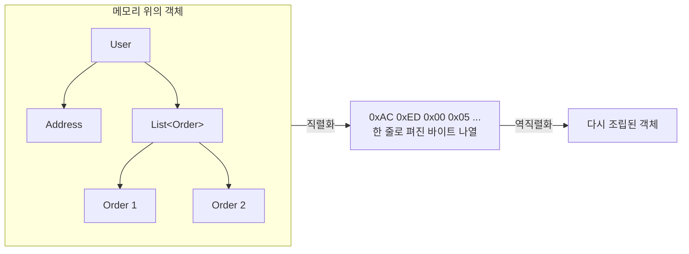
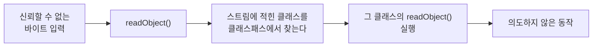

---

title: "자바 직렬화, 그리고 쓰지 말라는 말을 듣고 이유를 찾아본 기록"
date: 2022-08-29
categories: [Java, Serialization]
tags: [Java, Serialization, Deserialization, Security]
layout: post
toc: true
math: true
mermaid: true

---

## 참고자료

- [Java 17 - Serializable Javadoc](https://docs.oracle.com/en/java/javase/17/docs/api/java.base/java/io/serializable.html)
- [Java Object Serialization Specification](https://docs.oracle.com/en/java/javase/17/docs/specs/serialization/index.html)
- [JEP 290: Filter Incoming Serialization Data](https://openjdk.org/jeps/290)
- [JEP 415: Context-Specific Deserialization Filters](https://openjdk.org/jeps/415)
- [OWASP - Deserialization Cheat Sheet](https://cheatsheetseries.owasp.org/cheatsheets/Deserialization_Cheat_Sheet.html)
- [Oracle - Secure Coding Guidelines, Serialization](https://www.oracle.com/java/technologies/javase/seccodeguide.html)

---

## 배경

직렬화를 처음 봤을 때 설명 한 줄에 막혔다.

> 직렬화는 객체를 static stream of bytes로 변환하는 것이다.

여기서 `static`을 JVM의 static 영역으로 읽었다. 그러면 이상해진다. **JVM 메모리에 담는 건데 프로그램이 끝나면 사라질 텐데, 왜 영속화라고 부르는가?**

이 오해를 푸는 데 시간이 좀 걸렸고, 풀고 나니 다른 질문이 이어졌다.

- 객체 내용을 그냥 파일에 쓰면 안 되는가? 왜 직렬화라는 절차가 따로 있는가?
- JPA도 객체를 DB에 저장하는데, 그건 직렬화인가?
- 쓰지 말라는 말을 자주 보는데 정확히 무엇이 문제인가?

하나씩 확인한 기록이다.

---

## 1. static을 잘못 읽었다

먼저 오해부터 푼다.

여기서 `static`은 **JVM의 static 영역**이 아니라 **"정적인", "고정된"** 이라는 형용사다. "static stream of bytes"는 "고정된 바이트의 연속"이라는 뜻이다.

객체는 메모리 여기저기에 흩어진 참조들의 그물이다. 이걸 **처음부터 끝까지 순서대로 읽을 수 있는 바이트 나열로 펴는 것**이 직렬화다. 이름의 "직렬"이 그 뜻이다.



그래서 **직렬화 자체는 어디에 저장하는 행위가 아니다.** 저장 가능한 형태로 바꾸는 것까지가 직렬화이고, 그 바이트를 파일에 쓸지 네트워크로 보낼지 캐시에 넣을지는 그다음 문제다.

영속화라고 부르는 이유도 여기 있다. 직렬화 자체가 영속화가 아니라 **영속화를 가능하게 하는 단계**다.

---

## 2. 그냥 파일에 쓰면 안 되는가

두 번째 질문이다.

문자열이나 숫자는 파일에 바로 쓸 수 있다.

```java
String name = "찰리";
fos.write(name.getBytes(StandardCharsets.UTF_8));
```

**그런데 객체는 그렇게 못 쓴다.** 객체가 무엇으로 이루어져 있는지 파일 입출력 쪽은 모르기 때문이다.

객체 하나를 저장하려면 이런 것들이 정해져야 한다.

- 어떤 필드가 있고 각각 어떤 타입인가
- 필드가 다른 객체를 가리키면 그 객체도 함께 저장할 것인가
- 두 필드가 같은 객체를 가리키면 두 번 저장할 것인가 한 번만 저장할 것인가
- 순환 참조가 있으면 어떻게 할 것인가
- 나중에 읽을 때 어떤 클래스로 복원할 것인가

**자바 직렬화는 이 규칙들을 정해놓은 것이다.** 명세가 바이트 형식과 처리 순서를 규정한다.

직접 확인해볼 수 있다.

```java
public class User implements Serializable {
    private String name;
    private int age;

    public User(String name, int age) {
        this.name = name;
        this.age = age;
    }
}
```

```java
try (FileOutputStream fos = new FileOutputStream("user.ser");
     ObjectOutputStream oos = new ObjectOutputStream(fos)) {
    oos.writeObject(new User("찰리", 31));
}
```

만들어진 파일을 열어보면 이렇게 시작한다.

```
AC ED 00 05 73 72 00 04 55 73 65 72 ...
└──┬──┘ └┬┘ └┬┘ └───┬───┘ └────┬────┘
 매직넘버 버전 객체  클래스이름   "User"
                    길이(4)
```

앞의 `AC ED`가 자바 직렬화 스트림임을 나타내는 표시이고, 그 뒤로 클래스 이름과 필드 정보가 이어진다. **클래스 구조 정보가 데이터와 함께 들어간다는 점이 중요하다.** 4장에서 이게 문제가 된다.

### 2.1 코드로 보기

```java
// 직렬화
ByteArrayOutputStream baos = new ByteArrayOutputStream();
try (ObjectOutputStream oos = new ObjectOutputStream(baos)) {
    oos.writeObject(new User("찰리", 31));
}
byte[] serialized = baos.toByteArray();

// 역직렬화
try (ObjectInputStream ois = new ObjectInputStream(new ByteArrayInputStream(serialized))) {
    User user = (User) ois.readObject();
}
```

`Serializable`을 구현하지 않은 클래스를 직렬화하려 하면 `NotSerializableException`이 난다.

`Serializable`에는 메서드가 하나도 없다. **"이 클래스는 직렬화해도 된다"는 표시만 하는 인터페이스**이고, 이런 것을 마커 인터페이스라고 부른다.

---

## 3. JPA는 직렬화인가

세 번째 질문이다. 아니다. **둘은 다른 일을 한다.**

| | 자바 직렬화 | JPA |
|---|---|---|
| 무엇으로 바꾸는가 | 자바 전용 바이트 형식 | SQL과 테이블의 행 |
| 읽을 수 있는 대상 | 자바뿐 | 어떤 언어든, 사람도 |
| 클래스 구조 정보 | 포함된다 | 포함되지 않는다 |
| 대상 | 객체 그래프 전체 | 매핑한 컬럼만 |

JPA는 객체를 바이트로 펴지 않는다. **필드를 컬럼에 대응시켜 SQL을 만든다.** 그래서 저장된 결과를 다른 언어에서도 읽을 수 있고, 사람이 조회해서 볼 수도 있다.

그럼 JPA 명세가 엔티티에 `Serializable` 구현을 요구하는 것은 왜인가. 확인해보니 조건부였다.

> 엔티티 인스턴스가 분리된 객체로서 값으로 전달되어야 한다면(예를 들어 원격 인터페이스를 통해), 그 엔티티 클래스는 Serializable 인터페이스를 구현해야 한다.

**"원격 인터페이스로 넘길 거면"이라는 조건이 붙어 있다.** 지금은 그렇게 쓰는 경우가 드물다.

실무에서는 붙이지 않는 경우가 많고, 표준이니 붙여두는 것도 선택지다. 다만 **엔티티에 `Serializable`을 붙이면 4장의 문제들이 엔티티에도 따라온다**는 점은 알고 붙이는 편이 낫다.

---

## 4. 쓰지 말라는 이유

네 번째 질문이다. 이유가 여럿인데, 심각한 순서로 정리했다.

### 4.1 역직렬화가 임의 코드 실행으로 이어질 수 있다

가장 큰 이유다.

`readObject()`는 단순히 필드를 채우는 것이 아니다. **객체를 만들면서 그 클래스에 정의된 `readObject` 메서드를 호출한다.** 클래스가 이 메서드를 재정의해두었으면 그 코드가 실행된다.

그래서 역직렬화는 **생성자를 거치지 않고 객체를 만들면서, 동시에 코드를 실행하는** 통로가 된다.



여기서 처음에 오해했던 것을 바로잡는다. **바이트 배열의 값 몇 개를 임의로 바꾸는 것이 공격이 아니다.** 그렇게 하면 대부분 형식이 깨져서 예외가 난다.

실제 공격은 **클래스패스에 이미 있는 클래스들을 조합**해서 한다. 각각은 정상적인 라이브러리 클래스인데, `readObject`가 호출될 때의 동작을 이어 붙이면 명령 실행까지 갈 수 있는 경로가 만들어진다. 이런 조합을 가젯 체인이라고 부른다.

**공격자가 자기 클래스를 심을 필요가 없다는 점이 요점이다.** 널리 쓰이는 라이브러리에 이런 조합이 존재했던 사례들이 있고, 그래서 그 라이브러리를 쓰는 애플리케이션이 전부 영향을 받았다.

방어책이 나중에 추가됐다.

```java
// 역직렬화할 수 있는 클래스를 화이트리스트로 제한한다
ObjectInputFilter filter = ObjectInputFilter.Config.createFilter(
        "com.example.dto.*;java.base/*;!*");
ois.setObjectInputFilter(filter);
```

`!*`가 "나머지는 전부 거부"라는 뜻이다. 명시한 것만 허용한다.

**하지만 가장 확실한 방어는 신뢰할 수 없는 입력을 역직렬화하지 않는 것**이다. 필터는 차선책이다.

### 4.2 클래스 구조가 데이터 형식이 된다

2장에서 본 대로 직렬화 결과에 클래스 정보가 들어간다. 그래서 **클래스를 고치면 예전에 저장한 데이터를 못 읽을 수 있다.**

이걸 판정하는 것이 `serialVersionUID`다.

```java
public class User implements Serializable {
    private static final long serialVersionUID = 1L;
    // ...
}
```

이 값을 명시하지 않으면 **컴파일러가 클래스 구조에서 자동으로 계산한다.** 필드를 하나 추가하거나 메서드 시그니처를 바꾸면 값이 달라지고, 예전 데이터를 읽을 때 `InvalidClassException`이 난다.

**컴파일러 구현에 따라서도 값이 달라질 수 있다.** 같은 소스를 다른 환경에서 컴파일했는데 못 읽는 상황이 생긴다.

그래서 `serialVersionUID`를 명시하라고 권하는데, 명시하면 또 다른 문제가 생긴다. **구조가 실제로 바뀌었는데도 같은 값이면 읽기는 되고 값이 이상하게 들어간다.** 호환이 안 되는 변경을 조용히 통과시킨다.

결국 **클래스 구조 변경이 데이터 호환성 문제가 되는 구조** 자체가 부담이다.

### 4.3 캡슐화가 무너진다

직렬화는 `private` 필드까지 전부 내보낸다. 그래서 **필드 이름과 구조가 사실상 공개 API가 된다.**

내부 구현을 리팩터링하려고 필드를 바꾸면 직렬화 호환성이 깨진다. `private`이니까 자유롭게 바꿔도 된다는 전제가 성립하지 않는다.

### 4.4 생성자를 건너뛴다

역직렬화는 생성자를 호출하지 않고 객체를 만든다. **그래서 생성자에 넣어둔 검증이 통과되지 않는다.**

```java
public class Age implements Serializable {
    private final int value;

    public Age(int value) {
        if (value < 0) {
            throw new IllegalArgumentException("나이는 음수일 수 없다");
        }
        this.value = value;
    }
}
```

이 클래스를 역직렬화하면 **값이 음수인 객체가 만들어질 수 있다.** 생성자를 안 거치기 때문이다. 불변식을 지키려면 `readObject`에서 검증을 다시 해야 한다.

### 4.5 싱글턴이 깨진다

싱글턴 객체를 직렬화했다가 역직렬화하면 **새 인스턴스가 만들어진다.** 유일성이 깨진다.

`readResolve` 메서드로 막을 수 있다.

```java
public class Singleton implements Serializable {
    private static final Singleton INSTANCE = new Singleton();

    private Object readResolve() {
        return INSTANCE;   // 역직렬화 결과 대신 이걸 돌려준다
    }
}
```

싱글턴을 `enum`으로 만들면 이 문제가 애초에 없다. 열거형은 직렬화 처리 방식이 달라서 유일성이 유지된다.

---

## 5. 그럼 무엇을 쓰는가

용도별로 대안이 있다.

| 용도 | 대안 |
|---|---|
| API 응답, 설정 파일 | JSON |
| 서비스 간 통신, 성능이 중요 | Protocol Buffers, Avro |
| 캐시 저장 | JSON 또는 바이너리 형식 (`Serializable` 대신) |
| DB 저장 | JPA 등 ORM |

이들의 공통점이 있다. **직렬화 형식이 클래스 구조와 분리되어 있다.**

JSON은 필드 이름과 값만 담는다. 클래스 이름이 없으므로 역직렬화할 때 **내가 정한 타입으로만** 읽는다. 4.1절의 공격 경로가 구조적으로 막힌다.

Protocol Buffers는 스키마를 따로 정의한다. 그래서 필드를 추가해도 예전 데이터를 읽을 수 있고, 어느 언어에서든 읽을 수 있다.

**JSON을 쓸 때도 주의할 것이 하나 있다.** 일부 JSON 라이브러리에는 "타입 정보를 함께 저장하고 그것으로 클래스를 결정하는" 기능이 있다. 이걸 켜고 신뢰할 수 없는 입력을 처리하면 자바 직렬화와 같은 문제가 생긴다. 기본값으로 꺼져 있는 경우가 대부분이고, 켜야 할 이유가 없으면 켜지 않는다.

### 5.1 그래도 자바 직렬화를 써야 한다면

기존 시스템 때문에 어쩔 수 없는 경우가 있다. 그때 지킬 것들이다.

**신뢰할 수 없는 입력은 역직렬화하지 않는다.** 이게 첫 번째이고 나머지는 그다음이다.

**역직렬화 필터를 건다.** 4.1절의 화이트리스트 방식이다. JDK 17 이상에서는 컨텍스트별 필터도 쓸 수 있다.

**`serialVersionUID`를 명시한다.** 그리고 클래스를 바꿀 때 호환성을 의식적으로 판단한다.

**내보내면 안 되는 필드에 `transient`를 붙인다.** 비밀번호, 토큰, 캐시된 파생값 등이다.

```java
public class Session implements Serializable {
    private String userId;
    private transient String accessToken;   // 직렬화에서 제외
}
```

**`readObject`에서 불변식을 다시 검증한다.** 4.4절 때문이다.

---

## 정리하며

처음 던진 질문들에 대한 답이다.

**"static stream of bytes"의 static은 무엇인가.** JVM의 static 영역이 아니라 "고정된"이라는 형용사다. 흩어진 객체 그래프를 처음부터 끝까지 읽을 수 있는 바이트 나열로 편다는 뜻이다.

**객체를 그냥 파일에 쓰면 안 되는가.** 객체가 무엇으로 이루어져 있는지, 참조를 따라갈지, 순환을 어떻게 처리할지가 정해져야 한다. 직렬화는 그 규칙을 정해놓은 것이다.

**JPA는 직렬화인가.** 아니다. JPA는 필드를 컬럼에 대응시켜 SQL을 만든다. 결과를 다른 언어에서도 읽을 수 있다는 점이 자바 직렬화와 결정적으로 다르다.

**왜 쓰지 말라고 하는가.** 가장 큰 이유는 역직렬화가 임의 코드 실행으로 이어질 수 있다는 것이다. 클래스패스에 있는 정상 클래스들을 조합해서 만드는 공격이라 자기 클래스를 심을 필요도 없다. 그 밖에도 클래스 구조가 데이터 형식이 되고, 캡슐화가 무너지고, 생성자 검증을 건너뛴다.

정리하고 나서 남은 기준은 **"이 형식이 클래스 구조를 담고 있는가"** 였다. 담고 있으면 읽는 쪽이 스트림의 지시대로 클래스를 만들게 되고, 그 지점이 공격 표면이 된다. JSON과 Protocol Buffers가 안전한 이유도 여기서 나온다.
