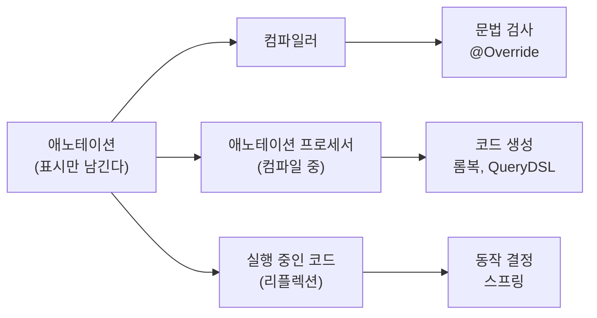
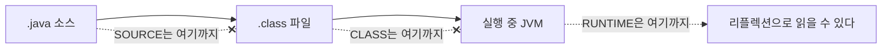
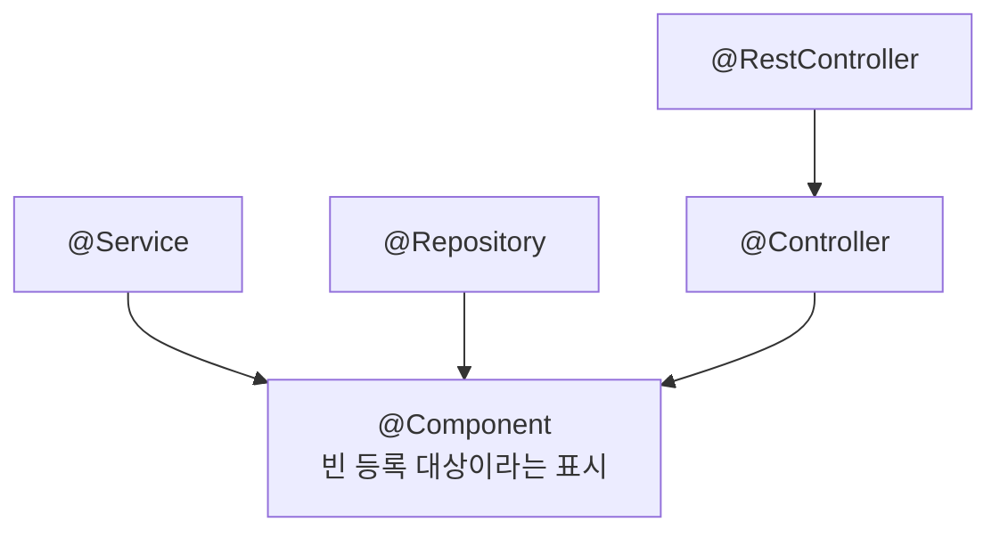

---

title: "애노테이션은 주석인데 어떻게 코드 동작을 바꾸는가"
date: 2022-09-06
categories: [Java, Spring]
tags: [Java, Annotation, Reflection, Spring, MetaAnnotation]
layout: post
toc: true
math: true
mermaid: true

---

## 참고자료

- [The Java Tutorials - Annotations](https://docs.oracle.com/javase/tutorial/java/annotations/index.html)
- [JLS SE 17 - 9.6 Annotation Interfaces](https://docs.oracle.com/javase/specs/jls/se17/html/jls-9.html#jls-9.6)
- [java.lang.annotation 패키지 Javadoc](https://docs.oracle.com/en/java/javase/17/docs/api/java.base/java/lang/annotation/package-summary.html)
- [Spring Framework - Classpath Scanning and Managed Components](https://docs.spring.io/spring-framework/reference/core/beans/classpath-scanning.html)
- [Spring Framework - @AliasFor Javadoc](https://docs.spring.io/spring-framework/docs/current/javadoc-api/org/springframework/core/annotation/AliasFor.html)

---

## 배경

애노테이션을 처음 봤을 때 이름이 헷갈렸다. Annotation은 사전에서 "주석"이라고 나오는데, 주석이면 코드에 영향을 주면 안 되는 것 아닌가.

그런데 `@Override`를 잘못 붙이면 컴파일이 안 되고, `@Service`를 붙이면 빈으로 등록되고, `@Transactional`을 붙이면 트랜잭션이 걸린다. 명백히 동작이 바뀐다.

정리하면서 확인하고 싶었던 것들이다.

- 주석인데 왜 동작이 바뀌는가? 누가 이걸 읽는가?
- `@Retention`이 뭘 정하는 것이길래 이걸 안 붙이면 애노테이션이 안 먹는가?
- `@Service`, `@Controller`, `@Repository`는 정의가 거의 같은데 왜 나눠져 있는가?
- 애노테이션을 직접 만들면 그것도 동작하게 만들 수 있는가?

명세와 스프링 소스를 보면서 확인했다.

---

## 1. 애노테이션이 무엇인가

### 1.1 정의

자바 공식 튜토리얼이 애노테이션을 이렇게 정의한다. 프로그램 자체의 일부가 아닌 **프로그램에 관한 데이터를 제공하는 메타데이터의 한 형태**이고, **애노테이션이 붙은 코드의 동작에 직접적인 영향을 주지 않는다.**

여기서 "직접적인 영향을 주지 않는다"가 첫 질문의 답을 담고 있다. **애노테이션 자체는 아무것도 하지 않는다.** 표시만 남긴다.

그 표시를 **누군가 읽고 무언가를 할 때** 동작이 바뀐다. 그 누군가가 세 부류다.



**애노테이션은 명령이 아니라 약속이다.** "이런 표시를 붙일 테니 네가 읽고 처리해라"라는 것이고, 읽는 쪽이 없으면 아무 일도 안 일어난다.

### 1.2 일반 주석과 다른 점

`//`나 `/* */`로 쓴 주석은 컴파일 결과물에 남지 않는다. 컴파일러가 버린다.

애노테이션은 **문법의 일부**다. 그래서 컴파일러가 검사하고, 설정에 따라 클래스 파일에 남고, 실행 중에 읽을 수도 있다.

### 1.3 왜 나왔는가

설정을 어디에 둘 것인가의 역사다.

**예전에는 XML에 뒀다.** 자바 코드와 설정 파일이 따로 있었고, 코드를 고치면 XML도 함께 고쳐야 했다.

문제는 **둘이 어긋나도 컴파일러가 모른다는 것**이었다. 클래스 이름을 바꿨는데 XML의 문자열을 안 고치면 실행할 때가 되어서야 알게 된다.

Javadoc이 나온 것도 같은 이유다. 코드 설명 문서를 따로 관리하니 코드와 문서의 버전이 어긋났고, 그래서 코드 안에 넣기로 했다.

**설정을 코드 안으로 가져오면 컴파일러가 검사할 수 있다.** 클래스 이름을 바꾸면 IDE가 애노테이션이 붙은 자리도 함께 바꿔준다. 이것이 애노테이션이 자리 잡은 이유다.

다만 맞바꿈이 있다. **설정이 코드에 흩어진다.** XML은 한 파일을 열면 전체 설정이 보이는데, 애노테이션은 여기저기 흩어져 있어서 전체를 조망하기 어렵다.

---

## 2. 애노테이션은 어떻게 생겼는가

### 2.1 정의하는 법

`@interface`로 선언한다.

```java
public @interface MyAnnotation {
    int id();
    String name() default "unknown";
    String[] roles() default {};
}
```

**인터페이스 선언과 비슷하지만 메서드가 아니라 속성이다.** 괄호가 붙어 있어서 메서드처럼 보이는데, 실제로는 애노테이션에 붙일 값의 이름과 타입을 정하는 것이다.

`default`를 주면 그 속성을 생략할 수 있다.

속성에 쓸 수 있는 타입이 제한되어 있다. 기본형, `String`, `Class`, 열거형, 다른 애노테이션, 그리고 이들의 배열까지다. 임의의 객체는 못 쓴다.

### 2.2 붙이는 법

속성 개수에 따라 세 가지 모양이 나온다.

```java
// 속성 없음
@MyMarker
public class SomeClass { }

// 속성 하나. 이름이 value면 이름을 생략할 수 있다
@MyAnnotation(1009)

// 속성 여럿
@MyAnnotation(id = 1009, name = "diger", roles = {"admin", "user"})
```

**`value`라는 이름이 특별하다.** 속성이 `value` 하나뿐이거나 나머지에 전부 기본값이 있으면 `@MyAnnotation(1009)`처럼 이름 없이 값만 쓸 수 있다. `@RequestMapping("/users")`가 이 규칙 덕분에 짧게 쓰이는 것이다.

속성이 없는 애노테이션을 **마커 애노테이션**이라고 부른다. `@Override`가 그렇다. 값이 필요 없고 "이것이 재정의다"라는 표시만 하면 되기 때문이다.

---

## 3. 표준 애노테이션

자바가 기본으로 제공하는 것들이다. 대부분 컴파일러에게 보내는 신호다.

| 애노테이션 | 무엇을 하는가 |
|---|---|
| `@Override` | 상위 타입의 메서드를 재정의한다는 표시. 재정의가 아니면 컴파일 에러 |
| `@Deprecated` | 더 이상 쓰지 말라는 표시. 쓰면 경고 |
| `@SuppressWarnings` | 지정한 경고를 표시하지 말라는 지시 |
| `@SafeVarargs` | 제네릭 가변인자를 안전하게 쓴다는 선언 |
| `@FunctionalInterface` | 추상 메서드가 하나뿐인 인터페이스라는 표시. 아니면 컴파일 에러 |

**`@Override`가 애노테이션의 성격을 잘 보여준다.** 이걸 안 붙여도 재정의는 동작한다. 붙이면 컴파일러가 "정말 재정의가 맞는지" 검사해준다.

메서드 이름에 오타를 내면 재정의가 아니라 새 메서드가 되는데, 이건 문법적으로 문제가 없어서 컴파일이 된다. 실행할 때 원래 메서드가 호출되면서 이상하게 동작한다. `@Override`가 이걸 컴파일 시점에 잡아준다.

**`@FunctionalInterface`도 같은 성격이다.** 안 붙여도 람다로 쓸 수 있다. 붙이면 나중에 누가 메서드를 하나 더 추가할 때 컴파일 에러가 나면서 막아준다.

---

## 4. 메타 애노테이션

**애노테이션에 붙이는 애노테이션**이다. 내가 만든 애노테이션이 어떻게 취급될지를 정한다.

### 4.1 @Retention

두 번째 질문의 답이다. **이 애노테이션이 언제까지 살아남을지**를 정한다.



| 값 | 어디까지 남는가 | 쓰는 곳 |
|---|---|---|
| `SOURCE` | 컴파일 전까지 | 롬복, `@Override` |
| `CLASS` | 클래스 파일까지. 실행 중에는 못 읽는다 | 바이트코드 도구 |
| `RUNTIME` | 실행 중에도 읽을 수 있다 | 스프링, JPA |

**기본값이 `CLASS`다.** 아무것도 안 붙이면 클래스 파일에는 남지만 리플렉션으로는 못 읽는다.

여기서 "애노테이션을 만들었는데 안 먹는다"는 상황이 나온다. 스프링이나 직접 만든 코드가 리플렉션으로 읽으려면 반드시 `RUNTIME`이어야 한다.

```java
@Retention(RetentionPolicy.RUNTIME)   // 이게 없으면 리플렉션으로 못 읽는다
public @interface RequireRole {
    String value();
}
```

`SOURCE`가 쓰이는 이유도 짚어둔다. 롬복의 `@Getter`는 컴파일 시점에 코드를 생성하고 나면 역할이 끝난다. 클래스 파일에 남길 이유가 없으므로 `SOURCE`다.

### 4.2 @Target

**어디에 붙일 수 있는지**를 제한한다.

| 값 | 붙일 수 있는 곳 |
|---|---|
| `TYPE` | 클래스, 인터페이스, 열거형, 애노테이션 |
| `FIELD` | 필드 |
| `METHOD` | 메서드 |
| `PARAMETER` | 메서드 매개변수 |
| `CONSTRUCTOR` | 생성자 |
| `LOCAL_VARIABLE` | 지역 변수 |
| `ANNOTATION_TYPE` | 애노테이션 (메타 애노테이션용) |
| `PACKAGE` | 패키지 |
| `TYPE_PARAMETER` | 제네릭 타입 매개변수 |
| `TYPE_USE` | 타입이 쓰이는 모든 자리 |

**안 붙이면 대부분의 자리에 붙일 수 있게 된다.** 그래서 명시하는 편이 낫다. 클래스에만 의미가 있는 애노테이션을 필드에 붙이는 실수를 컴파일러가 막아준다.

여러 개를 함께 지정할 수 있다.

```java
@Target({ElementType.TYPE, ElementType.METHOD})
```

### 4.3 나머지

**`@Documented`** 는 Javadoc에 이 애노테이션을 표시하라는 뜻이다.

**`@Inherited`** 는 상속을 허용한다. 부모 클래스에 붙은 애노테이션을 자식 클래스에서도 조회할 수 있게 한다. **클래스에만 적용되고 인터페이스나 메서드에는 적용되지 않는다.**

**`@Repeatable`** 은 같은 애노테이션을 여러 번 붙일 수 있게 한다. 자바 8부터다.

```java
@Schedule(day = "MON")
@Schedule(day = "WED")
public void run() { }
```

---

## 5. 누가 애노테이션을 읽는가

1.1절의 세 부류를 하나씩 본다.

### 5.1 컴파일러

`@Override`, `@FunctionalInterface` 같은 것들이다. 컴파일러가 표시를 보고 규칙을 검사한다.

### 5.2 애노테이션 프로세서

**컴파일 도중에 끼어들어 코드를 생성하는 프로그램**이다. 롬복과 QueryDSL이 이 방식으로 동작한다.

빌드 설정에서 이 구분이 드러난다.

```gradle
dependencies {
    compileOnly 'org.projectlombok:lombok'
    annotationProcessor 'org.projectlombok:lombok'
}
```

두 줄이 있는 이유가 있다.

**`compileOnly`** 는 컴파일할 때만 클래스패스에 두고 최종 산출물에는 안 넣는다. `@Getter` 같은 애노테이션이 `SOURCE`라서 실행 시점에 필요 없기 때문이다.

**`annotationProcessor`** 는 컴파일 도중 돌릴 프로세서를 지정한다. 이걸 안 넣으면 애노테이션이 붙어 있어도 코드가 생성되지 않는다.

**둘 다 필요하다는 점**이 처음에 헷갈렸다. 하나는 "이 애노테이션 이름을 알아야 한다", 다른 하나는 "이 애노테이션을 보고 코드를 만들 프로그램을 돌려라"이다.

### 5.3 리플렉션

실행 중에 읽는 방식이다. 스프링이 이걸 쓴다.

```java
Class<?> clazz = SomeService.class;

// 클래스에 붙은 애노테이션 읽기
if (clazz.isAnnotationPresent(Service.class)) {
    Service annotation = clazz.getAnnotation(Service.class);
    String beanName = annotation.value();
}

// 메서드에 붙은 애노테이션 읽기
for (Method method : clazz.getDeclaredMethods()) {
    RequireRole role = method.getAnnotation(RequireRole.class);
    if (role != null) {
        System.out.println(method.getName() + "는 " + role.value() + " 권한이 필요하다");
    }
}
```

**여기서 `@Retention(RUNTIME)`이 필요한 이유가 드러난다.** 클래스 파일에 애노테이션 정보가 남아 있지 않으면 `getAnnotation`이 `null`을 돌려준다.

---

## 6. 스프링의 스테레오타입 애노테이션

세 번째 질문이다. `@Controller`, `@Service`, `@Repository`의 정의를 보면 거의 같다.

```java
@Target(ElementType.TYPE)
@Retention(RetentionPolicy.RUNTIME)
@Documented
@Component
public @interface Service {

    @AliasFor(annotation = Component.class)
    String value() default "";
}
```

```java
@Target(ElementType.TYPE)
@Retention(RetentionPolicy.RUNTIME)
@Documented
@Component
public @interface Controller {

    @AliasFor(annotation = Component.class)
    String value() default "";
}
```

**`@Repository`도 같은 모양이다.** 그럼 왜 나눴는가.

### 6.1 합성 애노테이션

세 애노테이션 모두 `@Component`가 붙어 있다. 이것을 **합성 애노테이션(composed annotation)** 이라고 부른다.



스프링의 컴포넌트 스캔은 `@Component`가 붙어 있는지를 본다. 그런데 **직접 붙어 있는지만 보는 것이 아니라 메타 애노테이션까지 따라 올라간다.**

그래서 `@Service`를 붙이면 그 안의 `@Component` 때문에 빈으로 등록된다.

### 6.2 그럼 왜 나눴는가

이유가 셋이다.

**의도를 드러낸다.** 클래스 이름만 봐서는 그 클래스가 어느 계층에 속하는지 알기 어렵다. 애노테이션이 그것을 선언한다.

**계층별로 다른 처리를 붙일 수 있다.** `@Repository`가 실제로 그렇다. 스프링이 이 애노테이션이 붙은 클래스에 예외 변환 후처리를 적용한다. 구현체마다 다른 데이터 접근 예외를 스프링의 `DataAccessException` 계층으로 바꿔준다.

**AOP 대상을 계층으로 지정할 수 있다.** 서비스 계층 전체에 로깅을 걸고 싶을 때 애노테이션으로 잡을 수 있다.

```java
@Pointcut("@within(org.springframework.stereotype.Service)")
public void serviceLayer() { }
```

**`@Controller`와 `@Service`는 실제 동작 차이가 거의 없다.** `@Controller`는 스프링 MVC가 핸들러를 찾을 때 쓰이므로 기능적 의미가 있지만, `@Service`는 사실상 표시에 가깝다. 그래도 의도를 드러내는 것만으로 값어치가 있다.

### 6.3 @AliasFor

```java
@AliasFor(annotation = Component.class)
String value() default "";
```

**이 애노테이션의 `value`가 `@Component`의 `value`와 같은 것임을 선언한다.** 그래서 `@Service("userService")`라고 쓰면 그 이름이 `@Component`의 값으로 전달되어 빈 이름이 된다.

이게 없으면 두 값이 별개가 되어서, `@Service`에 이름을 줘도 빈 이름에 반영되지 않는다.

**참고로 이건 스프링이 만든 기능이지 자바 표준이 아니다.** 자바의 애노테이션에는 상속이나 별칭 개념이 없어서, 스프링이 리플렉션으로 메타 애노테이션을 훑으면서 직접 구현한 것이다.

---

## 7. 직접 만들어 쓰기

네 번째 질문이다. 만들 수 있고, **읽어서 처리하는 코드를 함께 만들어야** 한다.

### 7.1 정의

```java
@Target(ElementType.METHOD)
@Retention(RetentionPolicy.RUNTIME)   // 실행 중에 읽어야 하므로 필수
public @interface RequireRole {
    String value();
}
```

### 7.2 읽는 쪽

메서드 실행 전에 검사하려면 인터셉터나 AOP를 쓴다.

```java
@Component
public class RoleCheckInterceptor implements HandlerInterceptor {

    @Override
    public boolean preHandle(HttpServletRequest request, HttpServletResponse response, Object handler) {
        if (!(handler instanceof HandlerMethod handlerMethod)) {
            return true;
        }

        RequireRole annotation = handlerMethod.getMethodAnnotation(RequireRole.class);
        if (annotation == null) {
            return true;   // 애노테이션이 없으면 통과
        }

        String required = annotation.value();
        if (!currentUserHasRole(request, required)) {
            response.setStatus(HttpServletResponse.SC_FORBIDDEN);
            return false;
        }
        return true;
    }
}
```

**여기가 "누가 읽는가"에 해당하는 부분이다.** 이 인터셉터를 등록하지 않으면 애노테이션을 아무리 붙여도 아무 일도 안 일어난다.

### 7.3 합성 애노테이션 만들기

여러 애노테이션을 하나로 묶을 수도 있다.

```java
@Target(ElementType.TYPE)
@Retention(RetentionPolicy.RUNTIME)
@Service
@Transactional(readOnly = true)
public @interface QueryService {
}
```

이 하나를 붙이면 빈 등록과 읽기 전용 트랜잭션이 함께 적용된다. **반복해서 함께 쓰이는 조합이 있으면 묶어두는 편이 낫다.**

다만 주의할 점이 있다. **묶어두면 무엇이 적용되는지가 한눈에 안 보인다.** 이름을 잘 지어서 무엇이 들어 있는지 짐작되게 해야 한다.

### 7.4 흔히 걸리는 것들

**`@Retention`을 빠뜨린다.** 기본값이 `CLASS`라 리플렉션으로 못 읽는다. 가장 흔한 실수다.

**애노테이션은 붙였는데 읽는 쪽이 없다.** 인터셉터를 등록하지 않았거나 AOP 대상 범위 밖이다.

**프록시를 안 거쳐서 안 먹는다.** 같은 클래스 안에서 호출하면 AOP 기반 애노테이션이 동작하지 않는다. 자세한 것은 [프록시에 관한 글](/posts/Reflection-DynamicProxy-CGLIB-AOP/)에 정리해두었다.

**메타 애노테이션이 안 따라온다.** 자바 표준 리플렉션인 `getAnnotation`은 메타 애노테이션을 따라가지 않는다. 스프링에서는 `AnnotatedElementUtils.findMergedAnnotation`을 써야 합성 애노테이션까지 찾는다.

```java
// 표준 리플렉션. @Service에 붙은 @Component를 못 찾는다
clazz.getAnnotation(Component.class);   // null

// 스프링 유틸. 메타 애노테이션까지 따라간다
AnnotatedElementUtils.findMergedAnnotation(clazz, Component.class);   // 찾는다
```

---

## 정리하며

처음 던진 질문들에 대한 답이다.

**주석인데 왜 동작이 바뀌는가.** 애노테이션 자체는 표시만 남긴다. 그 표시를 읽고 무언가 하는 쪽이 따로 있다. 컴파일러, 애노테이션 프로세서, 리플렉션 세 부류이고, 읽는 쪽이 없으면 아무 일도 일어나지 않는다.

**`@Retention`이 무엇을 정하는가.** 이 애노테이션이 어디까지 살아남을지를 정한다. 기본값이 `CLASS`라 클래스 파일에는 남지만 리플렉션으로는 못 읽는다. 스프링처럼 실행 중에 읽는 쪽이 있으면 반드시 `RUNTIME`이어야 한다.

**`@Service`와 `@Controller`는 왜 나눠져 있는가.** 정의는 거의 같고 둘 다 `@Component`를 메타 애노테이션으로 갖는다. 나눈 이유는 의도를 드러내고, 계층별로 다른 처리를 붙일 수 있고, AOP 대상을 계층으로 지정할 수 있기 때문이다. `@Repository`는 실제로 예외 변환이라는 추가 동작을 갖는다.

**직접 만들면 동작하게 할 수 있는가.** 만들 수 있다. 다만 **애노테이션 정의와 그것을 읽어 처리하는 코드가 한 쌍**이다. 정의만 하고 읽는 쪽을 안 만들면 붙여도 아무 일이 없다.

정리하고 나서 남은 감각은 **애노테이션이 명령이 아니라 계약**이라는 것이었다. 붙이는 쪽과 읽는 쪽이 그 이름을 공유하기로 약속한 것이고, 한쪽이 없으면 성립하지 않는다. 애노테이션이 안 먹을 때 확인할 것도 결국 "읽는 쪽이 있는가"와 "읽을 수 있는 상태인가" 둘이다.
