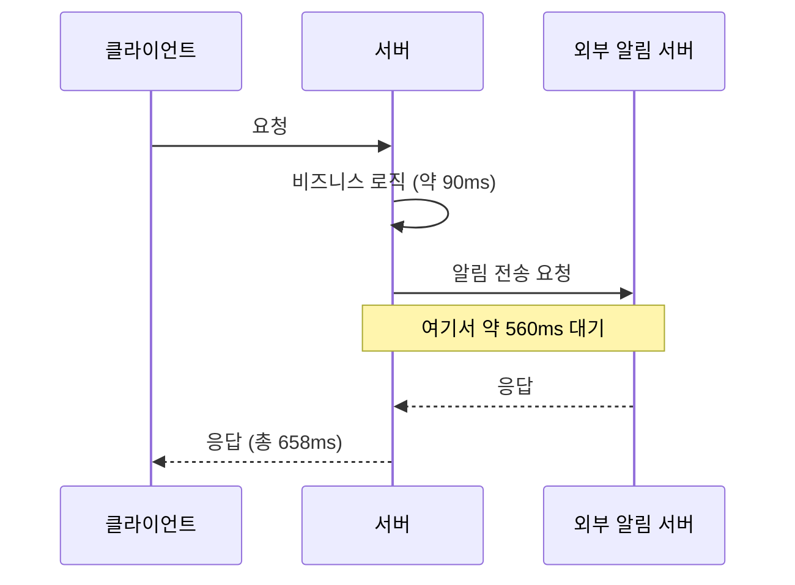
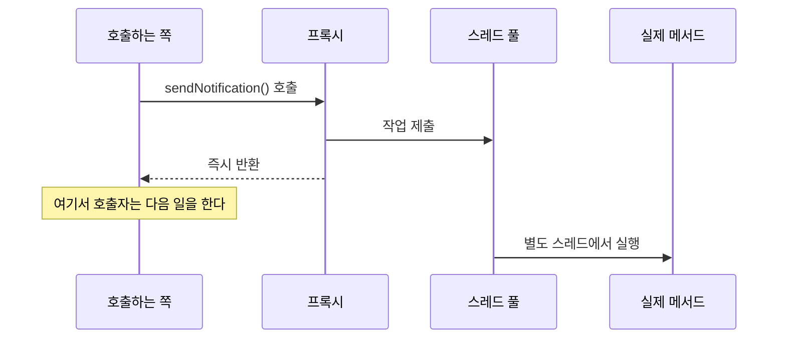
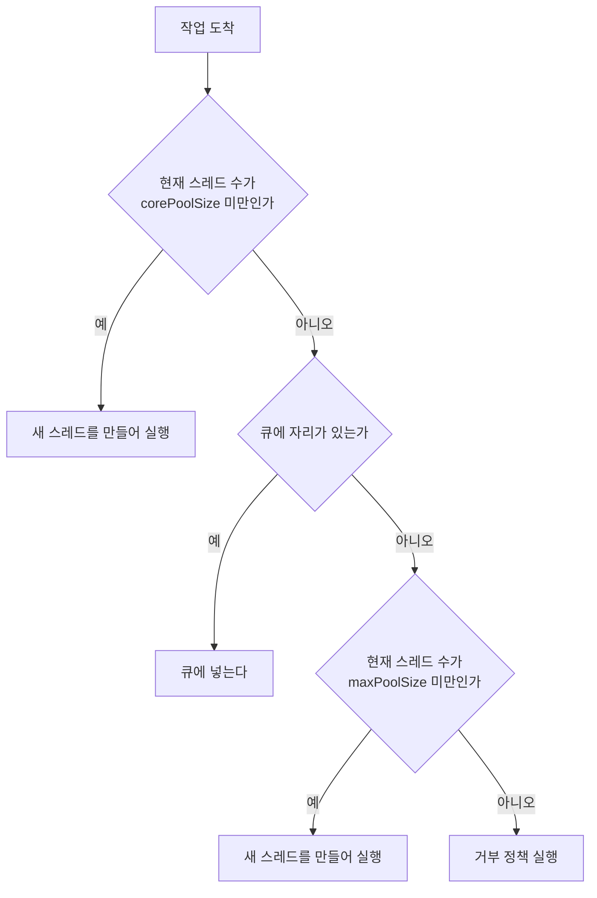
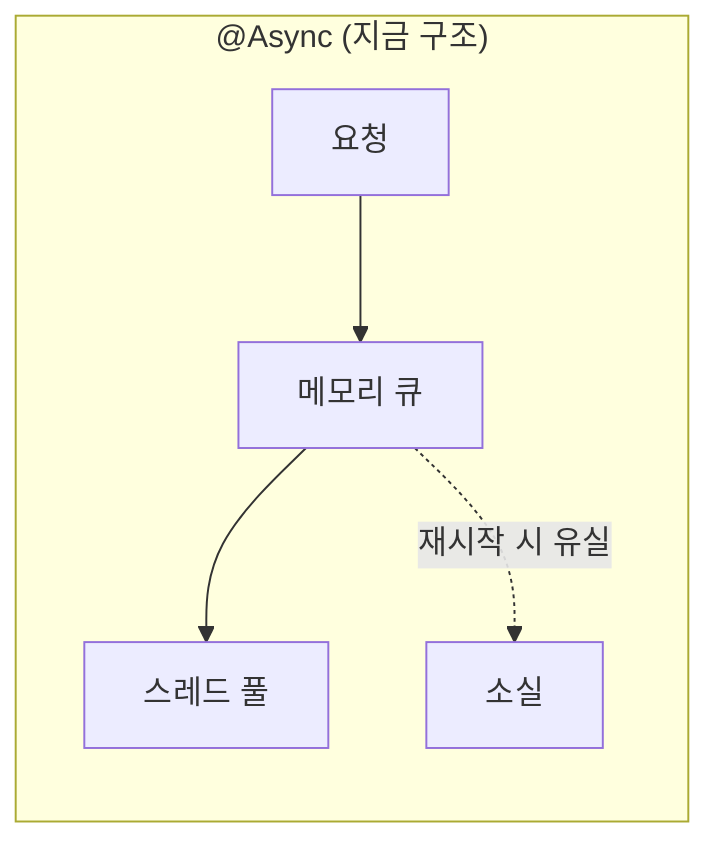
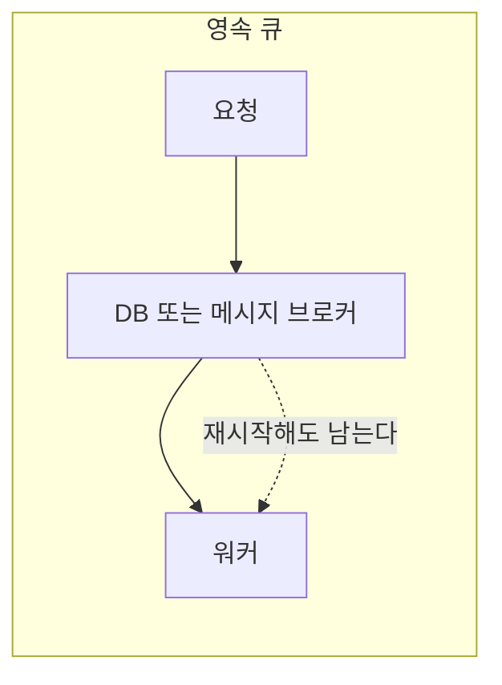

---

title: "외부 서버 호출로 응답이 658ms가 됐고, @Async로 122ms로 줄인 과정"
date: 2022-09-21
categories: [Spring, Java]
tags: [Spring, Async, ThreadPool, TaskExecutor, Concurrency]
layout: post
toc: true
math: true
mermaid: true

---

## 참고자료

- [Spring Framework - Task Execution and Scheduling](https://docs.spring.io/spring-framework/reference/integration/scheduling.html)
- [Spring Framework - @Async Javadoc](https://docs.spring.io/spring-framework/docs/current/javadoc-api/org/springframework/scheduling/annotation/Async.html)
- [Spring Boot - Task Execution and Scheduling](https://docs.spring.io/spring-boot/reference/features/task-execution-and-scheduling.html)
- [ThreadPoolExecutor Javadoc](https://docs.oracle.com/en/java/javase/17/docs/api/java.base/java/util/concurrent/threadpoolexecutor.html)

---

## 배경

푸시 알림을 보내려고 외부 서버를 호출하는 로직을 추가했더니 응답 시간이 100ms 아래에서 **658ms**로 뛰었다. 클라이언트가 그만큼 기다리게 됐다.

알림 전송 결과를 응답에 담을 이유가 없었으므로 비동기로 돌리기로 했는데, 붙이면서 정리가 안 된 것들이 있었다.

- `@Async`를 붙이면 정확히 무슨 일이 일어나는가? 스레드는 누가 만드는가?
- 스레드 풀 설정값들이 어떤 순서로 쓰이는가? 요청이 몰리면 어떻게 되는가?
- 비동기 메서드는 반환값이 없어야 한다고 하는데 정말인가?
- 비동기로 던진 요청이 실패하면 어떻게 되는가?

붙이고 나서 하나씩 확인한 기록이다.

---

## 1. 무엇이 문제였나



**클라이언트는 알림이 갔는지 안 갔는지를 기다릴 이유가 없다.** 알림은 실패해도 본 작업은 성공한 것이고, 사용자에게 알려줄 내용도 아니다.

그런데 코드가 동기라서 외부 서버 응답을 받을 때까지 요청 스레드가 묶여 있었다.

---

## 2. @Async가 하는 일

첫 번째 질문이다.

### 2.1 프록시가 가로챈다

`@Async`는 AOP로 동작한다. 그 메서드를 직접 부르는 것이 아니라 **스프링이 만든 프록시가 호출을 가로채서 스레드 풀에 넘긴다.**



**호출한 쪽은 제출만 하고 바로 돌아온다.** 실제 실행은 풀의 다른 스레드가 한다.

### 2.2 스레드는 미리 만들어져 있다

"새 스레드를 만든다"는 설명을 봤는데 정확하지 않다. **매번 만들면 그 비용이 커서 비동기로 얻는 이득이 상쇄된다.**

스레드 풀이 미리 스레드를 만들어두고 재사용한다. 그래서 스레드 풀 설정이 중요해진다.

### 2.3 켜는 방법

```java
@Configuration
@EnableAsync
public class AsyncConfig implements AsyncConfigurer {

    @Override
    public Executor getAsyncExecutor() {
        ThreadPoolTaskExecutor executor = new ThreadPoolTaskExecutor();
        executor.setCorePoolSize(3);
        executor.setMaxPoolSize(30);
        executor.setQueueCapacity(90);
        executor.setThreadNamePrefix("notify-async-");
        executor.initialize();
        return executor;
    }
}
```

```java
@Async
public void sendNotification(Long userId, String message) {
    notificationClient.send(userId, message);
}
```

**`@EnableAsync`가 없으면 애노테이션이 무시된다.** 아무 일도 안 일어나고 그냥 동기로 실행된다. 에러도 안 난다.

**`setThreadNamePrefix`를 지정하는 것**을 권한다. 스레드 덤프나 로그에서 어느 풀의 스레드인지 바로 구분된다.

`AsyncConfigurer`를 구현하는 대신 `Executor` 빈을 등록해도 된다. 여러 개를 두고 메서드마다 골라 쓸 수도 있다.

```java
@Async("notificationExecutor")
public void sendNotification(...) { ... }
```

**풀을 나누는 것이 실무에서 중요하다.** 하나의 풀을 여러 용도가 공유하면, 느린 작업이 풀을 다 차지해서 빠른 작업까지 밀린다.

---

## 3. 스레드 풀이 동작하는 순서

두 번째 질문이다. 여기가 처음에 헷갈렸던 부분이다.

설정값이 셋이다.

| 값 | 의미 |
|---|---|
| `corePoolSize` | 평소에 유지하는 스레드 수 |
| `queueCapacity` | 대기 큐의 크기 |
| `maxPoolSize` | 최대 스레드 수 |

**작업이 들어왔을 때의 순서가 정해져 있다.**



**직관과 다른 부분이 있다.** "스레드를 최대까지 늘린 다음 큐에 쌓는다"고 생각하기 쉬운데, 실제로는 **큐를 먼저 채우고 그다음에 스레드를 늘린다.**

이게 실제 동작에 미치는 영향이 크다.

예를 들어 `corePoolSize=3`, `queueCapacity=90`, `maxPoolSize=30`이면, 동시 요청이 50개 와도 **스레드는 3개만 돈다.** 나머지 47개는 큐에서 기다린다. 스레드가 30개까지 늘어나려면 큐 90개가 먼저 다 차야 한다.

**그래서 큐를 너무 크게 잡으면 스레드가 안 늘어난다.** 처리량을 늘리려고 `maxPoolSize`를 키웠는데 효과가 없다면 이것 때문이다.

### 3.1 기본값을 그대로 쓰면 안 되는 이유

`ThreadPoolTaskExecutor`의 클래스 기본값이 이렇다.

```java
private int corePoolSize = 1;
private int maxPoolSize = Integer.MAX_VALUE;
private int queueCapacity = Integer.MAX_VALUE;
private int keepAliveSeconds = 60;
```

**`queueCapacity`가 사실상 무한이므로 스레드가 절대 늘어나지 않는다.** 큐가 찰 일이 없기 때문이다. 결과적으로 스레드 1개가 모든 작업을 순차 처리한다.

그리고 **큐가 무한이면 메모리도 무한히 쌓인다.** 처리 속도보다 유입이 빠르면 큐가 계속 커지다가 메모리가 터진다.

스프링 부트를 쓰면 자동 설정이 다른 기본값을 준다. 그래도 **용도에 맞춰 명시하는 편이 안전하다.**

### 3.2 큐가 차면

`maxPoolSize`까지 늘어나고도 큐가 가득 차면 **거부 정책**이 동작한다. 기본값은 `AbortPolicy`이고 `RejectedExecutionException`을 던진다.

```java
executor.setRejectedExecutionHandler(new ThreadPoolExecutor.CallerRunsPolicy());
```

`CallerRunsPolicy`는 **호출한 스레드가 직접 실행한다.** 비동기가 아니게 되지만 작업이 버려지지는 않는다. 그리고 호출자가 그 작업을 하는 동안 새 작업을 못 받으므로 자연스럽게 유입 속도가 늦춰진다.

이 정책들을 정리하면 이렇다.

| 정책 | 동작 | 언제 쓰는가 |
|---|---|---|
| `AbortPolicy` (기본) | 예외를 던진다 | 실패를 알아야 할 때 |
| `CallerRunsPolicy` | 호출 스레드가 실행 | 작업을 잃으면 안 될 때 |
| `DiscardPolicy` | 조용히 버린다 | 잃어도 되는 작업 |
| `DiscardOldestPolicy` | 큐의 가장 오래된 것을 버리고 넣는다 | 최신 것이 더 중요할 때 |

**알림처럼 잃어도 되는 작업**이면 조용히 버리는 것도 선택지다. 다만 버려진 사실은 로그로 남겨야 한다.

### 3.3 늘어난 스레드는 유지되는가

아니다. `keepAliveSeconds` 동안 놀고 있으면 종료된다. 기본 60초다.

**`corePoolSize`만큼은 유지된다.** 그 아래로는 안 줄어든다. 다만 이것도 설정으로 바꿀 수 있다.

```java
executor.setAllowCoreThreadTimeOut(true);   // core 스레드도 정리 대상에 포함
```

---

## 4. 반환값이 없어야 하는가

세 번째 질문이다. 처음에 이렇게 정리했다가 잘못 알고 있었던 부분이다.

**"반환값이 있으면 그것을 기다려야 하므로 비동기가 안 된다"는 설명은 틀렸다.**

실제 규칙은 이렇다. `@Async` 메서드의 반환 타입은 다음 중 하나여야 한다.

| 반환 타입 | 동작 |
|---|---|
| `void` | 결과를 안 받는다 |
| `Future<T>` | 나중에 결과를 받을 수 있다 |
| `CompletableFuture<T>` | 위와 같고 조합이 편하다 |
| **그 밖의 타입** | **항상 `null`이 반환된다** |

마지막 줄이 요점이다. 반환 타입을 `String`으로 쓰면 **블로킹되는 것이 아니라 `null`이 돌아온다.** 그리고 아무 경고가 없다.

```java
// 위험: 항상 null이 반환된다
@Async
public String getResult() {
    return "done";
}

// 올바름
@Async
public CompletableFuture<String> getResult() {
    return CompletableFuture.completedFuture("done");
}
```

**결과가 필요하면 `CompletableFuture`를 쓴다.**

```java
@Async
public CompletableFuture<UserInfo> fetchUser(Long id) {
    return CompletableFuture.completedFuture(userClient.get(id));
}

// 호출하는 쪽에서 여러 개를 병렬로
CompletableFuture<UserInfo> user = service.fetchUser(1L);
CompletableFuture<OrderInfo> order = service.fetchOrder(1L);

CompletableFuture.allOf(user, order).join();
```

이 경우 `join()`에서 블로킹되지만, **두 호출이 순차가 아니라 병렬로 진행된 뒤**에 기다리는 것이므로 이득이 있다.

---

## 5. 실패하면 어떻게 되는가

네 번째 질문이다. 처음에 이 부분을 미해결로 남겼는데, 정리해보니 답이 갈린다.

### 5.1 반환 타입에 따라 다르다

**`void`를 반환하면 예외가 그냥 사라진다.** 호출한 쪽은 이미 반환됐으므로 예외를 받을 방법이 없다.

그래서 별도 핸들러가 필요하다.

```java
@Configuration
@EnableAsync
public class AsyncConfig implements AsyncConfigurer {

    @Override
    public Executor getAsyncExecutor() { /* ... */ }

    @Override
    public AsyncUncaughtExceptionHandler getAsyncUncaughtExceptionHandler() {
        return (ex, method, params) ->
                log.error("비동기 메서드 실패: {}, 인자={}", method.getName(), params, ex);
    }
}
```

**이걸 등록하지 않으면 예외가 로그에도 안 남을 수 있다.** 알림이 안 갔는데 아무도 모르는 상황이 된다.

**`Future`를 반환하면** 예외가 그 안에 담긴다. `get()`을 부를 때 `ExecutionException`으로 나온다.

### 5.2 재시도

일시적인 실패라면 재시도가 답이다.

```java
@Async
@Retryable(
        retryFor = {RestClientException.class},
        maxAttempts = 3,
        backoff = @Backoff(delay = 1000, multiplier = 2))
public void sendNotification(Long userId, String message) {
    notificationClient.send(userId, message);
}

@Recover
public void recover(RestClientException e, Long userId, String message) {
    log.error("알림 전송 최종 실패: userId={}", userId, e);
    failedNotificationRepository.save(new FailedNotification(userId, message));
}
```

**지수 백오프를 쓰는 이유**가 있다. 외부 서버가 과부하라서 실패한 것이라면 즉시 재시도가 부하를 더한다. 간격을 늘려가면서 회복할 시간을 준다.

**`@Recover`가 중요하다.** 재시도를 다 쓰고도 실패했을 때 무엇을 할지를 정한다. 여기서 아무것도 안 하면 결국 조용히 사라진다.

### 5.3 그래도 남는 한계

정리하면서 알게 된 것이 있다. **`@Async`로 던진 작업은 프로세스가 죽으면 사라진다.**

큐는 메모리에 있으므로, 배포로 애플리케이션이 재시작되면 대기 중이던 작업이 전부 없어진다. 재시도 중이던 것도 마찬가지다.

그래서 **"반드시 처리되어야 하는 작업"에는 `@Async`가 맞지 않는다.** 그런 경우에는 작업을 먼저 DB나 메시지 큐에 저장하고, 별도 워커가 그것을 꺼내 처리하는 구조가 필요하다.





**알림은 잃어도 되는 작업이라고 판단**해서 `@Async`로 두었다. 결제나 정산이었다면 다른 선택을 했을 것이다.

---

## 6. 그 밖에 걸린 것들

### 6.1 같은 클래스 안에서 호출하면 동작하지 않는다

`@Async`는 프록시로 동작한다. 그런데 **같은 클래스의 다른 메서드를 직접 부르면 프록시를 안 거친다.**

```java
@Service
public class OrderService {

    public void createOrder(Order order) {
        save(order);
        sendNotification(order);   // 프록시를 안 거친다. 동기로 실행된다
    }

    @Async
    public void sendNotification(Order order) { ... }
}
```

이유는 간단하다. 프록시는 **바깥에서 들어오는 호출**을 가로챈다. 객체 내부에서 `this.sendNotification()`을 부르면 프록시를 통과하지 않는다.

해결은 **클래스를 분리하는 것**이다.

```java
@Service
@RequiredArgsConstructor
public class OrderService {

    private final NotificationService notificationService;   // 별도 빈

    public void createOrder(Order order) {
        save(order);
        notificationService.sendNotification(order);   // 프록시를 거친다
    }
}
```

같은 이유로 **`private` 메서드에는 `@Async`가 동작하지 않는다.** 프록시가 재정의할 수 없기 때문이다.

### 6.2 트랜잭션이 전파되지 않는다

이게 실무에서 가장 위험한 지점이다.

```java
@Transactional
public void createOrder(Order order) {
    orderRepository.save(order);
    notificationService.sendAsync(order);   // 별도 스레드
    // 여기서 예외가 나면 order는 롤백된다
    // 그런데 알림은 이미 나갔을 수 있다
}
```

**트랜잭션은 스레드에 묶여 있다.** 비동기 메서드는 다른 스레드에서 돌므로 호출자의 트랜잭션에 참여하지 않는다.

그 결과 **아직 커밋되지 않은 데이터를 비동기 메서드가 조회하면 못 찾는다.** 방금 저장한 주문을 비동기로 조회하려 하면 없다고 나온다.

해결책이 둘이다.

**커밋 이후에 실행되게 한다.**

```java
@TransactionalEventListener(phase = TransactionPhase.AFTER_COMMIT)
@Async
public void handleOrderCreated(OrderCreatedEvent event) {
    notificationClient.send(event.orderId());
}
```

**필요한 데이터를 전부 인자로 넘긴다.** 비동기 메서드가 DB를 다시 조회하지 않게 한다.

앞의 방식이 더 안전하다. **트랜잭션이 롤백되면 이벤트도 발행되지 않으므로**, "실패한 주문에 대해 알림이 나가는" 상황이 원천적으로 막힌다.

### 6.3 SecurityContext가 전파되지 않는다

인증 정보가 `ThreadLocal`에 있으므로 비동기 메서드에서는 `null`이다. 필요하면 전파 설정을 따로 해야 한다.

```java
SecurityContextHolder.setStrategyName(SecurityContextHolder.MODE_INHERITABLETHREADLOCAL);
```

**다만 스레드 풀에서는 이것도 안전하지 않다.** 스레드가 재사용되므로 이전 요청의 컨텍스트가 남을 수 있다. `DelegatingSecurityContextAsyncTaskExecutor`로 감싸는 편이 맞다.

---

## 7. 결과

설정을 적용하고 다시 측정했다.

| | 적용 전 | 적용 후 |
|---|---|---|
| 응답 시간 | 658ms | 122ms |

외부 서버 호출 시간이 응답 경로에서 빠졌기 때문이다.

**주의할 것은 이게 "빨라진" 것이 아니라는 점이다.** 알림 전송에 걸리는 시간은 그대로다. 다만 클라이언트가 그것을 기다리지 않게 됐을 뿐이다.

그래서 이 최적화가 통하는 조건이 정해져 있다. **결과를 응답에 포함할 필요가 없고, 실패해도 본 작업이 성공한 것으로 볼 수 있는 작업**이어야 한다.

---

## 정리하며

처음 던진 질문들에 대한 답이다.

**`@Async`를 붙이면 무슨 일이 일어나는가.** 프록시가 호출을 가로채서 스레드 풀에 작업을 제출하고 즉시 반환한다. 스레드는 매번 만드는 것이 아니라 풀이 미리 만들어둔 것을 쓴다.

**설정값이 어떤 순서로 쓰이는가.** core 스레드를 먼저 채우고, 그다음 **큐를 채우고**, 큐가 다 차면 max까지 스레드를 늘린다. 큐를 먼저 채운다는 점이 직관과 다르고, 큐를 크게 잡으면 스레드가 안 늘어난다.

**반환값이 없어야 하는가.** 아니다. `void`, `Future`, `CompletableFuture`가 허용된다. 다만 그 밖의 타입을 쓰면 블로킹되는 것이 아니라 **항상 `null`이 반환되고** 경고도 없다.

**실패하면 어떻게 되는가.** `void`면 예외가 사라지므로 `AsyncUncaughtExceptionHandler`를 반드시 등록해야 한다. 그리고 프로세스가 죽으면 대기 중이던 작업이 통째로 사라지므로, 반드시 처리되어야 하는 작업에는 영속 큐가 필요하다.

정리하고 나서 가장 조심하게 된 것은 **트랜잭션과 인증 정보가 스레드에 묶여 있다는 사실**이었다. 비동기로 넘기는 순간 그 둘이 함께 넘어가지 않는다. 이걸 모르고 쓰면 커밋 전 데이터를 조회하거나 인증 정보가 비어 있는 상황을 만난다.
