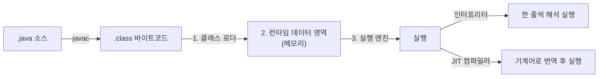
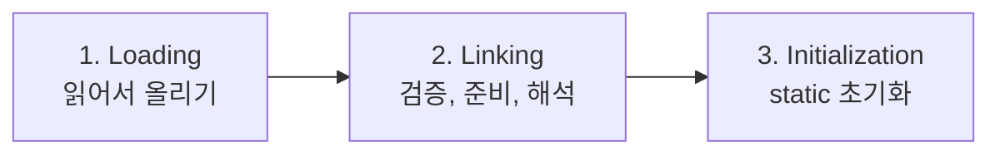
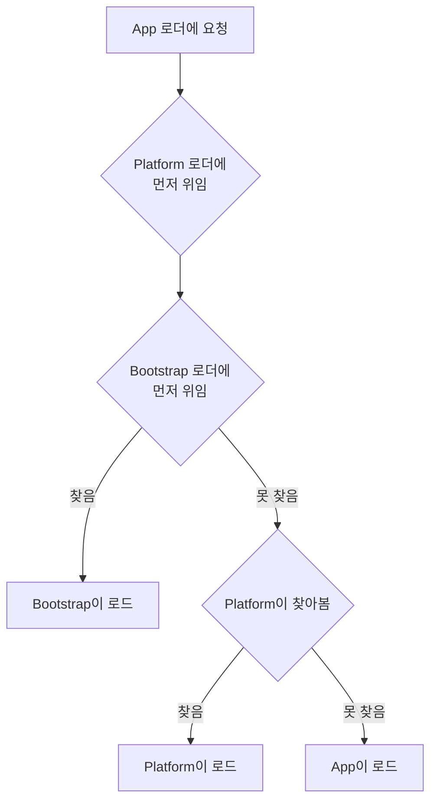
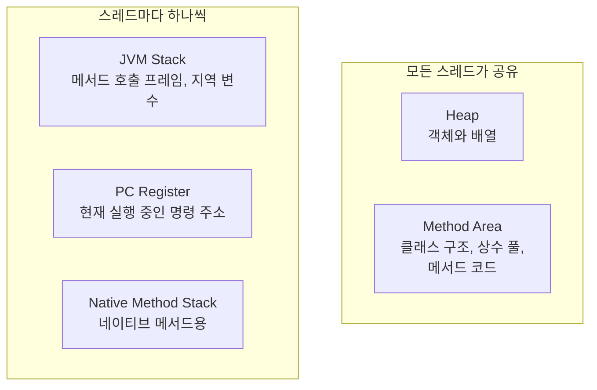
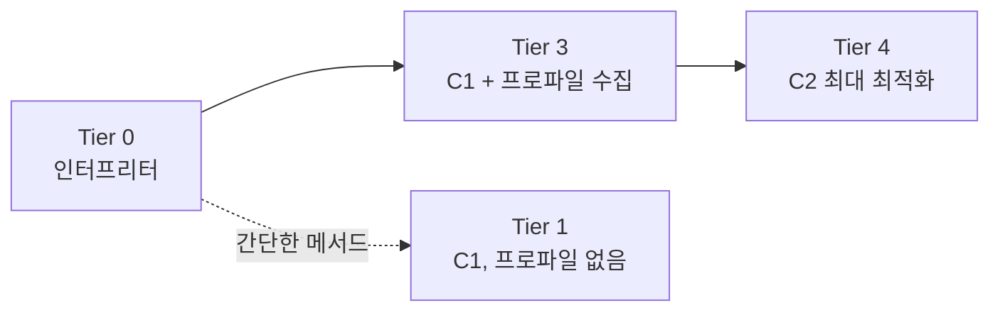
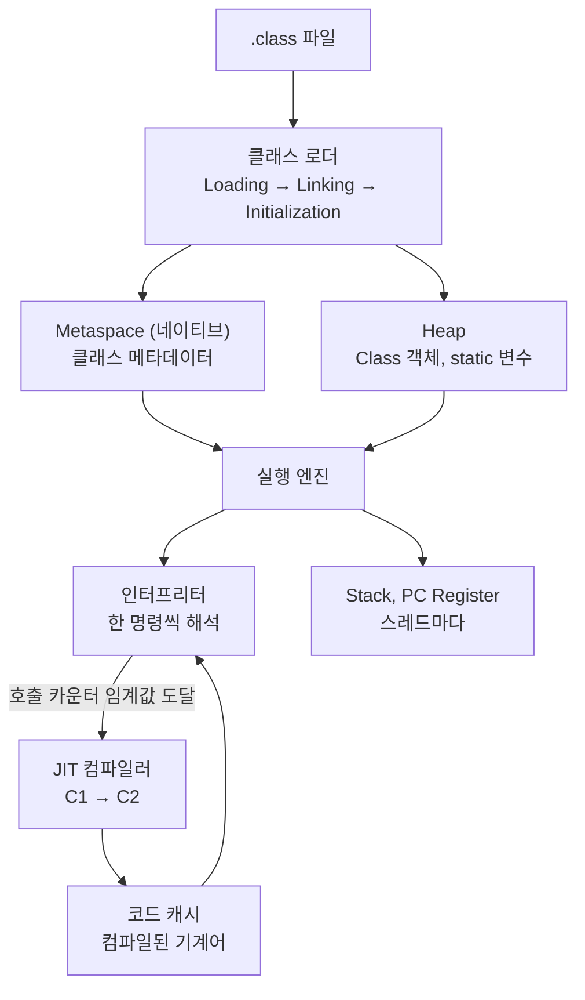

---

title: "JVM이 클래스를 읽어 기계어로 만들기까지 (클래스 로더, 메모리 구조, JIT)"
date: 2022-10-10
categories: [Java, JVM]
tags: [JVM, ClassLoader, Memory, Metaspace, JIT, HotSpot]
layout: post
toc: true
math: true
mermaid: true

---

## 참고자료

- [JVM 명세 SE 17 - 2장 The Structure of the Java Virtual Machine](https://docs.oracle.com/javase/specs/jvms/se17/html/jvms-2.html)
- [JVM 명세 SE 17 - 5장 Loading, Linking, and Initializing](https://docs.oracle.com/javase/specs/jvms/se17/html/jvms-5.html)
- [ClassLoader Javadoc (Java 17)](https://docs.oracle.com/en/java/javase/17/docs/api/java.base/java/lang/ClassLoader.html)
- [JEP 122: Remove the Permanent Generation](https://openjdk.org/jeps/122)
- [JEP 261: Module System](https://openjdk.org/jeps/261)
- [java 명령 레퍼런스 (Java 17)](https://docs.oracle.com/en/java/javase/17/docs/specs/man/java.html)

---

## 배경

`java -jar app.jar`를 치면 애플리케이션이 뜬다. 그 사이에 무슨 일이 일어나는지 몰라도 개발은 된다. 그런데 몇 가지가 계속 걸렸다.

- `.class` 파일이 어떻게 메모리로 들어오는가? 클래스 로더가 셋이라는데 왜 셋인가?
- `static` 변수는 어디에 저장되는가? Method Area라는 설명을 봤는데, 그 Method Area는 어디에 있는가?
- Java는 인터프리터 언어인가 컴파일 언어인가? JIT는 그중 어디에 해당하는가?
- 처음에는 느리다가 한참 뒤에 빨라지는 현상은 왜 생기는가?

명세와 Javadoc을 읽으면서 하나씩 확인했다. 확인하는 과정에서 **Java 8과 Java 9 이후가 상당히 다르다**는 것도 알게 됐는데, 그 차이를 모르고 옛날 자료를 보면 계속 어긋난다.

---

## 0. 전체 그림

먼저 이 글에서 다룰 세 단계를 놓고 시작한다.



용어 하나를 먼저 바로잡는다. **"Java 코드는 JVM에 의해 바이트코드로 컴파일된다"는 설명을 자주 보는데 틀렸다.** 소스를 바이트코드로 바꾸는 것은 `javac`이고, JVM은 그 바이트코드를 실행한다. JVM은 컴파일 시점에 관여하지 않는다.

---

## 1. 클래스 로더

### 1.1 무엇을 하는가

`.class` 파일을 읽어 JVM 메모리에 올리는 하위 시스템이다. 하는 일이 세 단계다.



JVM 명세 5장이 이 순서를 규정한다.

### 1.2 로딩

`.class` 파일의 바이너리 데이터를 읽어 클래스 구조 정보를 메모리에 저장한다. 저장되는 것이 세 가지다.

1. 로드된 클래스와 그 상위 클래스들
2. 이 파일이 클래스인지 인터페이스인지 열거형인지
3. 접근 제어자, 필드 정보, 메서드 정보

그리고 로딩이 끝나면 **힙에 `Class` 타입 객체를 하나 만든다.** 그 클래스를 코드에서 다룰 수 있게 하는 대표 객체다. `getClass()`나 `MyClass.class`로 얻는 것이 이 객체다.

### 1.3 클래스 로더가 셋인 이유

여기가 Java 8과 9 이후가 갈리는 첫 지점이다.

**Java 8까지**의 구성이다.

| 로더 | 어디서 읽는가 |
|---|---|
| Bootstrap | `jre/lib/rt.jar` 등 핵심 라이브러리 |
| Extension | `jre/lib/ext` 디렉터리 |
| Application | 애플리케이션 클래스패스 |

**Java 9 이후**는 모듈 시스템이 도입되면서 바뀌었다.

| 로더 | 어디서 읽는가 |
|---|---|
| Bootstrap | 핵심 모듈. `rt.jar`은 사라졌고 모듈 이미지에서 읽는다 |
| **Platform** | 나머지 플랫폼 모듈. `jre/lib/ext` 디렉터리 자체가 없어졌다 |
| Application | 애플리케이션 클래스패스와 모듈패스 |

이 차이를 모르고 옛날 글을 보면 "Extension 로더가 `jre/lib/ext`를 읽는다"는 설명을 그대로 믿게 되는데, 지금은 그 디렉터리도 그 로더 이름도 없다.

직접 확인할 수 있다.

```java
public class App {

    public static void main(String[] args) {
        ClassLoader classLoader = App.class.getClassLoader();
        System.out.println("classLoader = " + classLoader);
        System.out.println("parent = " + classLoader.getParent());
        System.out.println("parent.parent = " + classLoader.getParent().getParent());
    }
}
```

Java 17에서 실행하면 이렇게 나온다.

```
classLoader = jdk.internal.loader.ClassLoaders$AppClassLoader@251a69d7
parent = jdk.internal.loader.ClassLoaders$PlatformClassLoader@7cd84586
parent.parent = null
```

**마지막이 `null`인 것이 헷갈리는 지점이다.** 부트스트랩 로더가 없다는 뜻이 아니다. 부트스트랩 로더는 자바가 아니라 네이티브 코드로 구현되어 있어서 자바 객체로 표현할 수 없고, 그래서 `null`로 나타낸다. Javadoc이 이 규약을 명시한다.

### 1.4 왜 계층으로 나눴는가

**위임 모델(delegation model)** 때문이다. 클래스를 로드해달라는 요청이 오면 로더는 **먼저 부모에게 물어보고**, 부모가 못 찾을 때만 자기가 찾는다.



이 순서가 **보안 장치**다. 누군가 `java.lang.String`이라는 클래스를 만들어 클래스패스에 넣어도, 요청이 부트스트랩까지 올라가서 진짜 `String`이 먼저 로드된다. 위조 클래스가 표준 클래스를 밀어낼 수 없다.

### 1.5 링킹

세 단계로 나뉜다.

**검증(Verification).** 바이트코드가 올바른 형식인지, 유효한 컴파일러가 만든 것인지 확인한다. 실패하면 `VerifyError`가 난다. 이 단계 덕분에 손으로 조작한 바이트코드가 JVM을 망가뜨리는 것을 막는다.

**준비(Preparation).** 클래스 변수에 메모리를 할당하고 **기본값**으로 초기화한다. 여기서 기본값이란 `int`는 0, 참조 타입은 `null`이다. 내가 쓴 초기값은 아직 안 들어간다.

```java
static int count = 10;
// Preparation 단계: count = 0
// Initialization 단계: count = 10
```

**해석(Resolution).** 상수 풀의 심볼릭 참조를 실제 참조로 바꾼다. `"java/lang/String"`이라는 이름을 실제 메모리 위치로 연결하는 것이다.

### 1.6 초기화

`static` 변수에 내가 쓴 값이 들어가고 `static` 블록이 실행된다. **부모 클래스가 먼저** 초기화된다.

여기서 알아둘 것이 하나 있다. 초기화는 **처음 능동적으로 사용할 때** 일어난다. 클래스를 로드했다고 바로 초기화되는 것이 아니다. `new`로 인스턴스를 만들거나, `static` 멤버에 접근하거나, 리플렉션으로 부를 때 일어난다.

```java
class Config {
    static { System.out.println("Config 초기화됨"); }
    static final String NAME = "app";   // 컴파일 타임 상수
    static int counter = 0;
}

// 이건 초기화를 유발하지 않는다.
// NAME이 컴파일 타임 상수라 컴파일러가 값을 직접 박아 넣기 때문이다.
System.out.println(Config.NAME);

// 이건 초기화를 유발한다.
System.out.println(Config.counter);
```

이 차이 때문에 "static 블록이 왜 안 도는가"라는 상황이 생긴다.

---

## 2. 런타임 데이터 영역

### 2.1 명세가 정한 것과 구현이 정한 것

두 번째 질문에 답하려면 이 구분을 먼저 해야 한다.

**JVM 명세는 "이런 영역이 있어야 한다"만 정하고, 그것을 실제로 어디에 어떻게 만들지는 구현체가 정한다.** 그래서 "Method Area가 어디 있는가"의 답이 JVM 구현마다 다르고, 같은 HotSpot에서도 버전마다 다르다.

명세가 정한 영역은 다섯이다.



### 2.2 힙

객체와 배열이 저장되는 곳이다. 모든 스레드가 공유하고, GC의 대상이다.

HotSpot의 세대별 GC는 힙을 이렇게 나눈다.


이 구조의 전제가 **약한 세대 가설(weak generational hypothesis)** 이다. 대부분의 객체는 만들어지고 얼마 안 되어 죽는다는 관찰이다. 그래서 새 객체가 모이는 영역만 자주 훑으면 적은 비용으로 많은 쓰레기를 치울 수 있다.

Eden에서 살아남으면 Survivor로 가고, Survivor를 여러 번 오가며 살아남으면 Old로 승격된다. 이 "여러 번"의 기준을 나이 임계값이라고 하고 `-XX:MaxTenuringThreshold`로 조정한다.

### 2.3 static 변수는 어디에 있는가

두 번째 질문의 답이다. 그리고 여기가 Java 8 전후가 갈리는 두 번째 지점이다.

**Java 7까지**는 Permanent Generation(PermGen)이라는 영역이 힙 안에 있었고, 클래스 메타데이터와 `static` 변수가 거기 있었다.

PermGen에는 문제가 있었다. **크기가 JVM 시작 시 고정된다.** 클래스를 동적으로 많이 로드하는 애플리케이션은 `OutOfMemoryError: PermGen space`를 만났고, 크기를 늘리려면 재시작해야 했다.

**Java 8에서 PermGen이 제거됐다.** [JEP 122](https://openjdk.org/jeps/122)가 그 작업이다. 그리고 내용물이 두 곳으로 나뉘어 갔다.

| 무엇 | Java 7까지 | Java 8부터 |
|---|---|---|
| 클래스 메타데이터 | PermGen (힙 안) | **Metaspace (네이티브 메모리)** |
| `static` 변수 | PermGen | **힙 (해당 클래스의 `Class` 객체 안)** |
| 문자열 상수 풀 | PermGen (Java 6까지) | 힙 (Java 7부터) |

**그래서 "static 변수는 Method Area에 있다"는 설명은 절반만 맞다.** 명세 수준에서는 Method Area가 클래스 변수를 담는다고 볼 수 있지만, HotSpot 8 이상의 실제 구현에서 그 값은 힙의 `Class` 객체 안에 있다. 힙에 있으므로 GC 대상이기도 하다. 클래스가 언로드되면 그 `static` 변수도 회수된다.

Metaspace가 네이티브 메모리로 나간 것이 실무에서 갖는 의미가 있다. **컨테이너 메모리 한도를 잡을 때 힙만 계산하면 안 된다.** `-Xmx`로 힙을 2Gi로 잡아도 Metaspace, 스레드 스택, 코드 캐시, 네이티브 버퍼가 그 위에 얹힌다.

```bash
# Metaspace 상한을 명시하지 않으면 네이티브 메모리를 계속 먹을 수 있다
java -XX:MaxMetaspaceSize=256m -Xmx2g -jar app.jar

# 실제로 어디에 얼마나 쓰는지 본다
java -XX:NativeMemoryTracking=summary -jar app.jar
jcmd <pid> VM.native_memory summary
```

### 2.4 스택, PC 레지스터, 네이티브 메서드 스택

셋 다 **스레드마다 하나씩** 있다. 공유되지 않으므로 동기화가 필요 없다.

**JVM Stack.** 메서드를 호출할 때마다 프레임이 하나 쌓인다. 프레임 안에 지역 변수와 피연산자 스택이 들어간다. 메서드가 끝나면 프레임이 사라진다. 재귀가 너무 깊으면 여기가 넘쳐서 `StackOverflowError`가 난다.

**PC Register.** 지금 실행 중인 JVM 명령의 주소를 담는다. 스레드가 번갈아 실행되므로 각자 어디까지 했는지 기억해야 한다.

**Native Method Stack.** C나 C++로 작성된 네이티브 메서드를 실행할 때 쓰는 스택이다.

### 2.5 힙 크기가 늘어날 때

`-Xms`(초기 크기)와 `-Xmx`(최대 크기)를 다르게 주면 힙이 필요에 따라 늘어난다. 한 번에 최대치까지 가지 않고 점진적으로 확장한다.

**확장할 때 GC와 함께 Stop-The-World가 발생한다.** 그리고 힙이 커지면 GC가 훑어야 할 범위도 넓어지므로 GC 시간이 늘어날 수 있다.

그래서 운영 환경에서는 **`-Xms`와 `-Xmx`를 같게 잡는 관행**이 있다. 확장으로 인한 멈춤을 없애고, 처음부터 필요한 만큼 잡아두는 것이다.

컨테이너에서는 다른 선택지도 있다. 고정된 절대값 대신 **컨테이너 메모리 한도에 비례**하도록 잡는 방식이다.

```
# 고정값. 컨테이너 한도를 바꾸면 이 값도 같이 고쳐야 한다
-Xmx4g

# 비례. 컨테이너 한도의 75%를 힙으로 쓴다
-XX:MaxRAMPercentage=75.0
```

후자를 쓰면 컨테이너 메모리 한도만 조정해도 힙이 따라간다. 매니페스트 한 곳만 고치면 되므로 실수가 줄어든다.

---

## 3. 실행 엔진과 JIT

### 3.1 Java는 인터프리터 언어인가 컴파일 언어인가

세 번째 질문이다. 답은 **둘 다**이고, 그래서 두 단계로 나눠 봐야 한다.

**첫 번째 컴파일.** `javac`가 소스를 바이트코드로 바꾼다. 이건 실행 전에 일어난다.

**두 번째 단계.** JVM이 그 바이트코드를 실행한다. 여기서 두 방식이 함께 쓰인다.

| 방식 | 하는 일 | 장점 | 단점 |
|---|---|---|---|
| 인터프리터 | 바이트코드를 한 명령씩 해석해 실행 | 즉시 시작 가능 | 같은 코드를 반복 실행해도 매번 해석 |
| JIT 컴파일러 | 바이트코드를 기계어로 번역해두고 그것을 실행 | 반복 실행이 빠름 | 번역 자체에 시간과 자원이 든다 |

JIT는 Just-In-Time의 줄임말이다. 미리 다 번역해두는 것(AOT, Ahead-Of-Time)이 아니라 **실행 도중 필요한 시점에** 번역한다는 뜻이다.

**모든 코드를 JIT로 번역하지 않는 이유**가 여기 있다. 한 번만 실행되는 코드를 번역하면 번역 비용이 실행 이득보다 크다. 그래서 자주 실행되는 것만 골라 번역한다.

### 3.2 무엇을 번역할지 어떻게 고르는가

**호출 횟수와 반복 횟수를 센다.** 메서드가 호출될 때마다 카운터를 올리고, 임계값을 넘으면 컴파일 대상으로 넣는다. 메서드 안의 루프도 따로 세는데, 한 번 호출되고 그 안에서 오래 도는 경우를 잡기 위해서다.

여기서 자주 헷갈리는 부분을 짚는다. **JVM 구현마다 방식이 다르다.**

| | HotSpot (OpenJDK, Oracle JDK) | Eclipse OpenJ9 (구 IBM J9) |
|---|---|---|
| 카운터 방향 | 호출할 때마다 **증가**, 임계값 도달 시 컴파일 | 호출할 때마다 **감소**, 0 도달 시 컴파일 |
| 최적화 단계 이름 | Tier 0~4 (계층형 컴파일) | Cold, Warm, Hot, VeryHot, Scorching |

인터넷 자료에 "카운트를 감소시켜 0이 되면 컴파일한다", "Cold, Warm, Hot, VeryHot, Scorching 단계가 있다"는 설명이 자주 보이는데 **이건 OpenJ9 기준**이다. 우리가 대부분 쓰는 HotSpot과는 다르다. IBM 문서를 보고 정리한 글이 그대로 퍼진 것으로 보인다.

### 3.3 HotSpot의 계층형 컴파일

HotSpot에는 컴파일러가 두 개 있다.

**C1 (클라이언트 컴파일러).** 빨리 컴파일하고 최적화는 가볍게 한다. 시작 시간이 중요할 때 유리하다.

**C2 (서버 컴파일러).** 컴파일이 느린 대신 최적화를 깊게 한다. 오래 도는 코드에 유리하다.

**계층형 컴파일(tiered compilation)** 은 이 둘을 함께 쓴다. 처음에는 인터프리터로 시작하고, 좀 돌면 C1으로 빠르게 컴파일해서 성능을 올리면서 프로파일 정보를 모으고, 정말 자주 도는 것만 C2로 다시 컴파일한다.



Java 8부터 계층형 컴파일이 기본으로 켜져 있다.

**네 번째 질문의 답이 여기 있다.** 애플리케이션이 처음에는 느리다가 한참 뒤에 빨라지는 이유가 이 과정 때문이다. 초반에는 인터프리터로 돌고, 시간이 지나면서 자주 쓰이는 경로가 C1을 거쳐 C2까지 올라간다. 이걸 워밍업(warm-up)이라고 부른다.

실무에서 이게 중요해지는 지점이 있다.

**성능 측정을 시작 직후에 하면 안 된다.** 워밍업 전 숫자는 실제 운영 성능이 아니다. 벤치마크 도구들이 워밍업 구간을 따로 두는 이유다.

**컨테이너를 자주 재시작하면 워밍업을 매번 다시 한다.** 롤링 업데이트 직후 응답이 느린 것이 이 때문일 수 있다. readiness probe가 이 구간을 고려하지 않으면, 아직 느린 파드로 트래픽이 들어간다.

```bash
# 어떤 메서드가 컴파일됐는지 본다
java -XX:+PrintCompilation -jar app.jar

# 계층형 컴파일 끄기 (비교 측정용, 운영에서는 쓰지 않는다)
java -XX:-TieredCompilation -jar app.jar
```

### 3.4 JIT가 하는 최적화

번역만 하는 것이 아니라 그 과정에서 코드를 고친다. 대표적인 것 몇 가지다.

**인라이닝(inlining).** 작은 메서드의 본문을 호출하는 쪽에 통째로 넣는다. 호출 비용이 사라지고, 더 중요하게는 **그 뒤의 최적화가 가능해진다.** 메서드 경계가 없어지면 앞뒤 코드를 함께 놓고 최적화할 수 있기 때문이다.

**탈출 분석(escape analysis).** 객체가 만들어진 메서드 밖으로 나가지 않는다고 판단되면, 힙에 만들지 않고 스택에 두거나 아예 필드로 흩어놓는다. 그러면 GC 대상이 되지 않는다.

**단형성 인라인 캐시.** 인터페이스 호출 지점에 실제로 한 종류의 구현체만 온다면, 가상 호출을 직접 호출로 바꾼다. 여러 종류가 오면 이 최적화를 포기한다.

마지막 것이 실무에서 성능 차이로 드러나는 경우가 있다. 같은 코드인데 한 종류의 구현체만 쓰는 곳에서는 빠르고 여러 종류가 섞이는 곳에서는 느린 현상이 여기서 나온다.

**역최적화(deoptimization)** 도 알아둘 만하다. JIT는 "지금까지 관찰한 바로는 이렇더라"는 가정 위에서 최적화한다. 그 가정이 깨지면 컴파일된 코드를 버리고 인터프리터로 되돌아간다. 그래서 오래 잘 돌던 애플리케이션이 새로운 입력 패턴을 만나 갑자기 느려지는 일이 있다.

### 3.5 코드 캐시

컴파일된 기계어가 저장되는 곳이다. 힙이 아니라 별도 영역이고, 크기가 정해져 있다.

**여기가 차면 JIT 컴파일이 멈춘다.** 그러면 애플리케이션이 인터프리터로 되돌아가면서 눈에 띄게 느려진다. 로그에 경고가 나온다.

```
CodeCache is full. Compiler has been disabled.
```

클래스를 아주 많이 로드하거나 동적 프록시를 대량으로 만드는 애플리케이션에서 볼 수 있다.

```bash
java -XX:ReservedCodeCacheSize=256m -jar app.jar
```

---

## 4. 세 단계를 이어서 보기

지금까지 본 것을 한 번에 놓으면 이렇다.



---

## 5. 실무에서 이 지식이 쓰인 지점

### 클래스를 못 찾는다는 에러

`ClassNotFoundException`과 `NoClassDefFoundError`가 다르다는 것이 1장의 3단계에서 나온다.

**`ClassNotFoundException`** 은 로딩 단계에서 클래스 파일 자체를 못 찾은 것이다. 보통 리플렉션으로 이름을 문자열로 넘겼는데 그런 클래스가 없을 때 난다.

**`NoClassDefFoundError`** 는 컴파일 시점에는 있었는데 실행 시점에 없거나, **초기화에 실패한 클래스를 다시 쓰려 할 때** 난다. 두 번째 경우가 헷갈린다. 첫 실패의 원인은 다른 예외인데 그건 로그 위쪽에 있고, 이후 시도에서는 `NoClassDefFoundError`만 반복해서 찍힌다. **원인을 찾으려면 로그의 맨 처음 예외를 봐야 한다.**

### 컨테이너 메모리를 잡을 때

2.3절 그대로다. JVM이 쓰는 메모리는 힙만이 아니다.

```
컨테이너 메모리 한도
 = 힙 (-Xmx)
 + Metaspace
 + 스레드 수 × 스레드 스택 크기
 + 코드 캐시
 + GC가 쓰는 자료구조
 + 네이티브 버퍼 (다이렉트 버퍼, 압축 등)
```

힙만 보고 한도를 잡으면 힙에 여유가 있는데도 컨테이너가 종료된다. 이 경우 JVM 안에서는 `OutOfMemoryError`가 안 나고, 컨테이너 런타임이 프로세스를 죽인다. 애플리케이션 로그에 아무것도 안 남으므로 원인을 찾기 어렵다.

증상으로 구분하는 법은 이렇다.

| 증상 | 원인 |
|---|---|
| `java.lang.OutOfMemoryError: Java heap space` | 힙 부족. `-Xmx`를 올리거나 누수를 찾는다 |
| `OutOfMemoryError: Metaspace` | 클래스 메타데이터 초과. `-XX:MaxMetaspaceSize`를 보거나 클래스 누수를 찾는다 |
| 로그 없이 컨테이너 종료, 종료 코드 137 | 컨테이너 메모리 한도 초과. 힙 밖 영역이 원인일 수 있다 |

### 힙 덤프를 남길 자리를 확보하기

메모리 문제를 조사하려면 힙 덤프가 필요한데, 문제가 터진 뒤에 뜨는 것이 아니라 **미리 옵션을 걸어둬야** 나온다.

```
-XX:+HeapDumpOnOutOfMemoryError
-XX:HeapDumpPath=/app/heapdumps/
-XX:+ExitOnOutOfMemoryError
```

컨테이너에서 이걸 쓸 때 걸리는 것이 있다. **덤프 파일 크기가 힙 크기만큼 나온다.** 힙이 4Gi면 덤프도 그 정도다. 이걸 업무용 볼륨에 쓰면 덤프가 쌓여 그 볼륨이 차고, 원래 그 볼륨을 쓰던 기능까지 함께 멈춘다.

그래서 덤프 경로를 **별도 볼륨으로 분리하고 크기 상한을 건다.** 상한을 넘으면 그 파드만 정리되고 다른 기능은 영향을 안 받는다.

`-XX:+ExitOnOutOfMemoryError`를 함께 거는 이유도 있다. 이게 없으면 `OutOfMemoryError`가 난 뒤에도 프로세스가 살아서 일부 요청만 실패하는 상태가 이어진다. 죽어야 컨테이너 오케스트레이터가 알아채고 다시 띄운다.

---

## 정리하며

처음 던진 질문들에 대한 답이다.

**`.class` 파일이 어떻게 메모리로 들어오는가.** 클래스 로더가 로딩, 링킹, 초기화 세 단계로 처리한다. 로더가 계층으로 나뉜 것은 위임 모델로 표준 클래스가 위조 클래스에 밀리지 않게 하기 위해서다. Java 9부터 Extension 로더가 Platform 로더로 바뀌었고 `jre/lib/ext`와 `rt.jar`은 사라졌다.

**`static` 변수는 어디에 있는가.** Java 8부터 힙에 있다. 그 클래스의 `Class` 객체 안이다. 클래스 메타데이터는 힙 밖 네이티브 메모리인 Metaspace로 갔다. Java 7까지의 PermGen 설명은 지금 구조와 맞지 않는다.

**Java는 인터프리터 언어인가 컴파일 언어인가.** `javac`가 소스를 바이트코드로 컴파일하고, JVM이 그 바이트코드를 인터프리터와 JIT를 함께 써서 실행한다. 어느 한쪽이 아니다.

**처음에 느리다가 나중에 빨라지는 이유.** 계층형 컴파일 때문이다. 인터프리터로 시작해서 C1을 거쳐 자주 쓰이는 경로만 C2로 올라간다. 그래서 시작 직후의 성능 측정값은 운영 성능이 아니고, 재시작이 잦으면 이 구간을 매번 다시 지난다.

정리하면서 가장 크게 바뀐 것은 **"명세가 정한 것과 구현이 정한 것을 구분해야 한다"** 는 감각이었다. Method Area는 명세의 개념이고 Metaspace는 HotSpot의 구현이다. 이걸 섞으면 자바 버전이 다른 자료를 볼 때마다 어긋난다.
