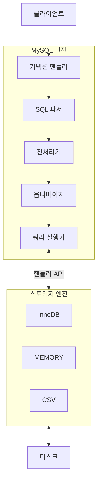
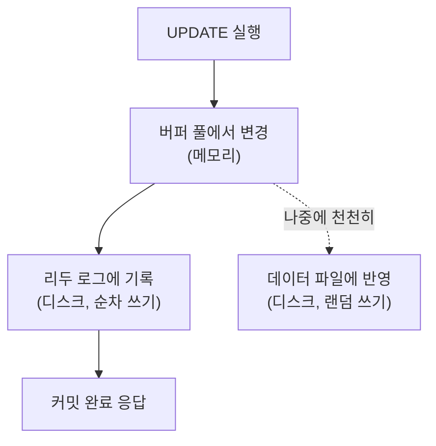
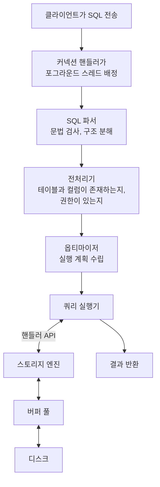

---

title: "MySQL 엔진 아키텍처, 읽으면서 남았던 질문들까지"
date: 2022-12-10
categories: [Database, MySQL]
tags: [MySQL, InnoDB, StorageEngine, Architecture, Thread, BufferPool]
layout: post
toc: true
math: true
mermaid: true

---

## 참고자료

- [MySQL 8.0 - Alternative Storage Engines](https://dev.mysql.com/doc/refman/8.0/en/storage-engines.html)
- [MySQL 8.0 - InnoDB Architecture](https://dev.mysql.com/doc/refman/8.0/en/innodb-architecture.html)
- [MySQL 8.0 - InnoDB Buffer Pool](https://dev.mysql.com/doc/refman/8.0/en/innodb-buffer-pool.html)
- [MySQL 8.0 - Connection Interfaces](https://dev.mysql.com/doc/refman/8.0/en/connection-interfaces.html)
- [MySQL 8.0 - Server System Variables](https://dev.mysql.com/doc/refman/8.0/en/server-system-variables.html)
- [MySQL 8.0 - Optimizing Memory Use](https://dev.mysql.com/doc/refman/8.0/en/optimizing-memory.html)

---

## 배경

MySQL을 쓰면서 정작 그 안에서 무슨 일이 일어나는지는 모르고 있었다. 구조를 훑으면서 정리했는데, 읽는 도중에 답이 안 나오는 질문이 몇 개 생겼다.

- 스토리지 엔진을 고를 수 있다는데, 지금도 고를 일이 있는가? MyISAM과 InnoDB를 나눠둔 이유가 무엇인가?
- 커넥션 풀을 열면 그만큼 MySQL 쪽에도 스레드가 생기는가?
- 쓰기가 지연될 수 있다는데 그러면 데이터가 유실될 수 있는 것 아닌가?
- 메모리 설정이 여러 개인데 무엇이 서버 전체이고 무엇이 연결마다인가?

구조를 먼저 정리하고 이 질문들에 답을 붙였다.

---

## 1. 두 개의 층

MySQL 서버는 크게 두 부분으로 나뉜다.



**MySQL 엔진**은 SQL을 해석하고 최적화하고 실행 계획을 만든다. 두뇌에 해당한다.

**스토리지 엔진**은 실제로 디스크에서 데이터를 읽고 쓴다. 손발에 해당한다.

이 분리가 MySQL의 특징이다. **MySQL 엔진은 하나뿐이지만 스토리지 엔진은 여러 개를 함께 쓸 수 있다.** 테이블마다 다른 엔진을 지정할 수 있다.

```sql
CREATE TABLE test_table (fd1 INT, fd2 INT) ENGINE = InnoDB;
```

### 1.1 핸들러 API

두 층이 대화하는 규약이다. MySQL 엔진이 "이 조건에 맞는 행을 가져와라", "이 행을 저장해라"라고 요청하면 스토리지 엔진이 처리한다.

**MySQL 엔진은 데이터가 실제로 어떻게 저장되는지 모른다.** 그래서 어떤 스토리지 엔진을 쓰든 SQL 처리 과정은 같고, 데이터를 읽고 쓰는 부분만 달라진다.

`GROUP BY`나 `ORDER BY` 같은 복잡한 처리는 MySQL 엔진의 쿼리 실행기가 한다. 스토리지 엔진은 행을 주고받을 뿐이다.

**여기서 실무에 쓰이는 관점이 나온다.** 실행 계획을 볼 때 "이 작업이 어느 층에서 처리되는가"를 구분해야 한다. 스토리지 엔진이 100만 건을 넘겨주고 MySQL 엔진이 그중 10건을 골라내는 것과, 스토리지 엔진이 10건만 찾아서 넘기는 것은 성능이 완전히 다르다. 인덱스를 붙이는 이유가 후자로 만들기 위해서다.

---

## 2. 스토리지 엔진을 지금도 고를 일이 있는가

첫 번째 질문이다. 정리하면서 확인해보니 **사실상 없다.**

MySQL 5.5부터 InnoDB가 기본 엔진이 됐고, MySQL 8.0에서는 시스템 테이블까지 InnoDB로 옮겨졌다. MyISAM은 여전히 존재하지만 새 테이블에 쓸 이유가 거의 없다.

두 엔진의 차이를 보면 왜 그런지 분명해진다.

| | InnoDB | MyISAM |
|---|---|---|
| 트랜잭션 | 지원 | **없음** |
| 잠금 단위 | 행 | **테이블** |
| 외래 키 | 지원 | 없음 |
| 장애 복구 | 리두 로그로 자동 복구 | **수동 복구** |
| 쓰기 버퍼링 | 있음 | 없음 |

**트랜잭션이 없다는 것이 결정적이다.** MyISAM에서는 여러 문장 중간에 오류가 나도 앞의 변경이 그대로 남는다. 부분적으로만 반영된 상태가 되고 되돌릴 방법이 없다.

**잠금 단위도 크다.** 테이블 단위로 잠그므로 한 행을 수정하는 동안 그 테이블 전체가 막힌다. 동시 쓰기가 있는 환경에서는 쓸 수 없다.

그럼 왜 나눠뒀는가. **역사적 이유**다. InnoDB는 원래 외부 회사가 만든 것을 나중에 통합한 것이고, MyISAM이 그전의 기본이었다. 지금 남아 있는 것은 호환성 때문이다.

플러그인 구조 자체는 여전히 의미가 있다. 특수한 용도의 엔진이 있고, 직접 만들 수도 있다.

| 엔진 | 용도 |
|---|---|
| InnoDB | 기본. 특별한 이유가 없으면 이것 |
| MEMORY | 메모리에만 두는 임시 테이블. 재시작하면 사라진다 |
| CSV | CSV 파일을 테이블처럼 다룬다. 데이터 교환용 |
| ARCHIVE | 압축 저장. 조회가 드문 로그 보관용 |

---

## 3. 스레딩 구조

MySQL 서버는 프로세스가 아니라 **스레드** 기반이다. 스레드는 크게 둘로 나뉜다.

### 3.1 포그라운드 스레드

클라이언트 연결마다 하나씩 붙어서 그 연결의 쿼리를 처리한다. 사용자 스레드라고도 부른다.

연결이 끊기면 그 스레드는 **스레드 캐시**로 돌아간다. 다음 연결이 오면 새로 만들지 않고 캐시에서 꺼내 쓴다. 스레드 생성 비용을 아끼기 위해서다.

캐시에 이미 충분히 쌓여 있으면 캐시에 넣지 않고 종료시킨다. 그 기준이 `thread_cache_size`다.

```sql
SHOW VARIABLES LIKE 'thread_cache_size';
SHOW STATUS LIKE 'Threads_%';
```

`Threads_created`가 계속 늘어나면 스레드 캐시가 부족하다는 신호다. 연결이 자주 끊기고 다시 붙는 환경에서 확인해볼 값이다.

### 3.2 커넥션 풀과의 관계

두 번째 질문이다. **커넥션 풀 크기만큼 MySQL 쪽에 스레드가 생긴다.**

풀이 연결을 미리 맺어두고 유지하므로, 애플리케이션이 놀고 있어도 그 연결에 대응하는 스레드는 MySQL에 존재한다.

여기서 처음에 잘못 알고 있던 것을 바로잡는다. **스프링 부트의 기본 커넥션 풀 크기는 200이 아니라 10이다.** HikariCP의 `maximumPoolSize` 기본값이 10이고, 200은 다른 설정이나 오래된 자료의 값과 섞인 것으로 보인다.

```yaml
spring:
  datasource:
    hikari:
      maximum-pool-size: 10   # 기본값
```

그리고 이 값을 크게 잡는 것이 좋은 것도 아니다. **애플리케이션 인스턴스가 여러 대면 그만큼 곱해진다.** 인스턴스 10대가 풀 크기 50이면 MySQL은 500개 연결을 받아야 한다.

MySQL 쪽 상한은 `max_connections`다.

```sql
SHOW VARIABLES LIKE 'max_connections';
SHOW STATUS LIKE 'Threads_connected';
SHOW STATUS LIKE 'Max_used_connections';   -- 지금까지의 최댓값
```

`Max_used_connections`가 `max_connections`에 근접하면 곧 연결 거부가 난다. 이 지표를 모니터링에 넣어두는 편이 좋다.

풀 크기를 정할 때의 기준도 하나 있다. **연결이 많다고 처리량이 늘지 않는다.** DB가 동시에 처리할 수 있는 양은 CPU 코어 수와 디스크에 달려 있고, 그보다 많은 연결은 대기만 늘린다. 오히려 컨텍스트 스위칭 비용으로 전체가 느려진다.

### 3.3 백그라운드 스레드

InnoDB 내부에서 도는 스레드들이다.

| 하는 일 | 왜 필요한가 |
|---|---|
| 리두 로그를 디스크에 기록 | 장애 시 복구의 근거 |
| 버퍼 풀의 변경분을 디스크에 반영 | 메모리의 변경을 실제 파일에 쓴다 |
| 데이터를 버퍼 풀로 미리 읽어옴 | 곧 필요할 것을 앞당겨 읽는다 |
| 언두 로그 정리 | 더 이상 필요 없는 이전 버전 제거 |
| 잠금과 교착 상태 감시 | 교착이 생기면 한쪽을 롤백시킨다 |

읽기와 쓰기 스레드 개수를 조정할 수 있다.

```sql
SHOW VARIABLES LIKE 'innodb_read_io_threads';
SHOW VARIABLES LIKE 'innodb_write_io_threads';
```

**읽기는 대체로 포그라운드 스레드가 직접 처리하므로 많이 늘릴 필요가 없다.** 쓰기는 백그라운드가 대량으로 처리하므로 디스크 성능에 맞춰 조정할 여지가 있다.

---

## 4. 쓰기가 지연되면 데이터가 유실되는가

세 번째 질문이다. 이게 정리하면서 제일 궁금했던 부분이다.

### 4.1 쓰기는 버퍼링된다

InnoDB는 데이터를 바꿀 때 디스크에 바로 쓰지 않는다. **메모리의 버퍼 풀에서 고치고, 실제 데이터 파일 반영은 나중에 한다.**

디스크 쓰기는 느리기 때문이다. 매번 기다리면 처리량이 나오지 않는다.

**읽기는 지연될 수 없다.** 지금 필요한 데이터를 나중에 주는 것은 말이 안 된다. 그래서 읽기는 버퍼 풀에 없으면 즉시 디스크에서 읽어온다.

### 4.2 그런데 왜 유실되지 않는가

여기가 답이다. **데이터 파일에 쓰기 전에 리두 로그에 먼저 기록하기 때문이다.**



**커밋 시점에 반드시 디스크에 남는 것은 리두 로그다.** 데이터 파일 반영이 안 됐어도, 장애 후 재시작할 때 리두 로그를 다시 적용하면 커밋된 내용이 복원된다.

리두 로그가 데이터 파일보다 빠른 이유가 있다. **리두 로그는 순차 쓰기이고 데이터 파일 반영은 랜덤 쓰기다.** 순차 쓰기가 훨씬 빠르므로, 빠른 쪽을 먼저 확정하고 느린 쪽을 미룬다.

이 방식을 WAL(Write-Ahead Logging)이라고 부른다.

### 4.3 그래서 이 설정이 중요하다

리두 로그를 언제 디스크에 확정할지를 정하는 값이 있다.

```sql
SHOW VARIABLES LIKE 'innodb_flush_log_at_trx_commit';
```

| 값 | 동작 | 장애 시 |
|---|---|---|
| `1` (기본) | 커밋마다 디스크에 확정 | 유실 없음 |
| `2` | 커밋마다 OS 버퍼까지만 | OS가 죽으면 최대 1초 유실 |
| `0` | 1초마다 확정 | MySQL이 죽어도 최대 1초 유실 |

**기본값 1이 유실 없음을 보장하는 유일한 값이다.** 나머지는 성능을 얻는 대신 마지막 1초를 잃을 수 있다.

MyISAM에는 이 구조가 없다. 쓰기 버퍼링도 없고 리두 로그도 없어서, **중간에 죽으면 그 상태로 남는다.** 2장에서 본 "수동 복구"가 이 뜻이다.

---

## 5. 메모리 구조

네 번째 질문이다. 설정값이 어느 범위인지가 헷갈렸는데, 두 종류로 나누면 정리된다.

### 5.1 글로벌 영역

**서버 전체에서 하나만 할당된다.** 연결이 몇 개든 상관없다.

| 영역 | 하는 일 |
|---|---|
| InnoDB 버퍼 풀 | 데이터와 인덱스를 메모리에 캐시 |
| InnoDB 리두 로그 버퍼 | 리두 로그를 모아뒀다 쓴다 |
| 적응형 해시 인덱스 | 자주 찾는 값에 해시 인덱스를 자동 생성 |
| 테이블 캐시 | 열린 테이블 정보 |

**버퍼 풀이 가장 중요하다.** 여기에 데이터가 있으면 디스크를 안 읽어도 된다.

```sql
SHOW VARIABLES LIKE 'innodb_buffer_pool_size';

-- 적중률 확인
SHOW STATUS LIKE 'Innodb_buffer_pool_read%';
```

`Innodb_buffer_pool_reads`(디스크에서 읽은 횟수)를 `Innodb_buffer_pool_read_requests`(전체 요청)로 나누면 디스크를 얼마나 읽었는지 나온다. 이 비율이 높으면 버퍼 풀이 작은 것이다.

전용 DB 서버라면 물리 메모리의 상당 부분을 버퍼 풀에 준다. 다만 **다른 영역과 OS도 메모리가 필요하므로 전부를 줄 수는 없다.**

### 5.2 로컬 영역

**연결마다 따로 할당된다.** 세션 메모리 영역이라고도 부른다.

| 영역 | 하는 일 |
|---|---|
| 정렬 버퍼 | `ORDER BY` 처리 |
| 조인 버퍼 | 인덱스를 못 쓰는 조인 처리 |
| 읽기 버퍼 | 순차 읽기 |
| 네트워크 버퍼 | 클라이언트와 주고받는 데이터 |

**여기가 함정이 되는 지점이다.** 이 값들은 연결마다 잡히므로 **연결 수를 곱해야 실제 사용량이 나온다.**

```
정렬 버퍼 4MB × 연결 500개 = 2GB
```

정렬 버퍼를 넉넉히 잡았다가 연결이 많아지면서 메모리가 터지는 경우가 여기서 나온다. **글로벌 값을 늘리는 것과 로컬 값을 늘리는 것은 위험도가 다르다.**

그리고 이 버퍼들은 필요할 때만 할당된다. 정렬이 없는 쿼리는 정렬 버퍼를 안 쓴다. 그래서 설정값 곱하기 연결 수는 최악의 경우이지 평소 사용량은 아니다.

### 5.3 실제 사용량 확인

```sql
-- 연결 수와 주요 버퍼 설정
SELECT
  @@max_connections AS max_conn,
  @@innodb_buffer_pool_size / 1024 / 1024 AS buffer_pool_mb,
  @@sort_buffer_size / 1024 AS sort_buffer_kb,
  @@join_buffer_size / 1024 AS join_buffer_kb;

-- 메모리를 많이 쓰는 곳 확인 (performance_schema 활성화 필요)
SELECT event_name, current_alloc
FROM sys.memory_global_by_current_bytes
LIMIT 10;
```

---

## 6. 쿼리가 처리되는 순서

지금까지 본 것을 이어 붙이면 이렇다.



각 단계에서 문제가 날 수 있는 지점이 다르다.

| 단계 | 여기서 나는 문제 |
|---|---|
| 파서 | 문법 오류 |
| 전처리기 | 없는 테이블이나 컬럼, 권한 부족 |
| 옵티마이저 | 나쁜 실행 계획. 인덱스를 안 타는 원인이 대체로 여기 |
| 실행기 | 정렬과 조인이 비싸게 처리됨 |
| 스토리지 엔진 | 잠금 대기, 디스크 읽기 과다 |

**느린 쿼리를 볼 때 어느 단계가 문제인지부터 좁히면 접근이 빨라진다.** 실행 계획으로 옵티마이저 판단을 보고, 상태 변수로 스토리지 엔진 쪽을 본다.

---

## 정리하며

처음 던진 질문들에 대한 답이다.

**스토리지 엔진을 지금도 고를 일이 있는가.** 사실상 없다. InnoDB가 기본이고 MySQL 8.0에서는 시스템 테이블까지 InnoDB로 옮겨졌다. MyISAM은 트랜잭션이 없고 테이블 단위로 잠그며 자동 복구가 안 되므로 새 테이블에 쓸 이유가 없다. 나눠져 있는 것은 역사적 이유다.

**커넥션 풀만큼 MySQL에도 스레드가 생기는가.** 그렇다. 그리고 애플리케이션 인스턴스 수만큼 곱해진다. 스프링 부트의 기본 풀 크기는 200이 아니라 10이고, 크게 잡는다고 처리량이 늘지도 않는다.

**쓰기가 지연되면 유실되는가.** 아니다. 데이터 파일 반영은 미루지만 리두 로그는 커밋 시점에 디스크에 확정한다. 장애 후 재시작할 때 그 로그로 복원한다. 다만 `innodb_flush_log_at_trx_commit`을 1이 아닌 값으로 바꾸면 마지막 1초를 잃을 수 있다.

**메모리 설정은 어느 범위인가.** 버퍼 풀 같은 글로벌 영역은 서버 전체에서 하나이고, 정렬 버퍼 같은 로컬 영역은 연결마다 할당된다. 후자를 늘릴 때는 연결 수를 곱해서 봐야 한다.

정리하고 나서 남은 관점은 **"이 작업이 MySQL 엔진에서 처리되는가 스토리지 엔진에서 처리되는가"** 였다. 이 구분이 되면 실행 계획을 읽을 때 어디를 고쳐야 하는지가 보인다.
