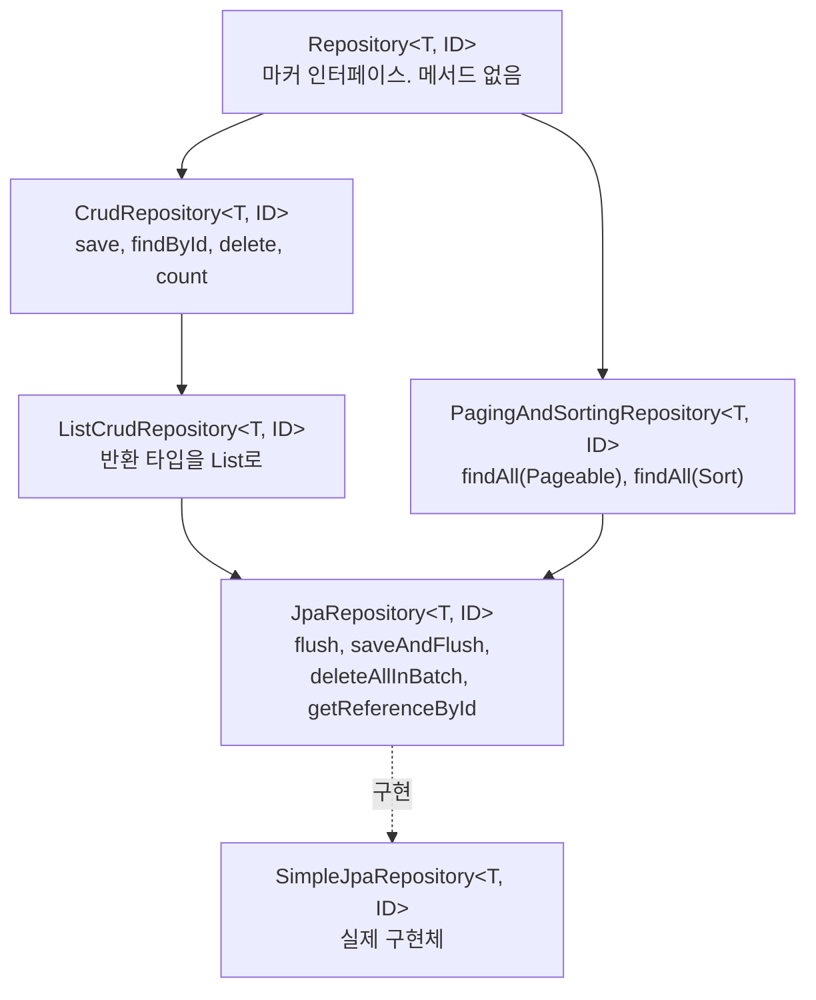
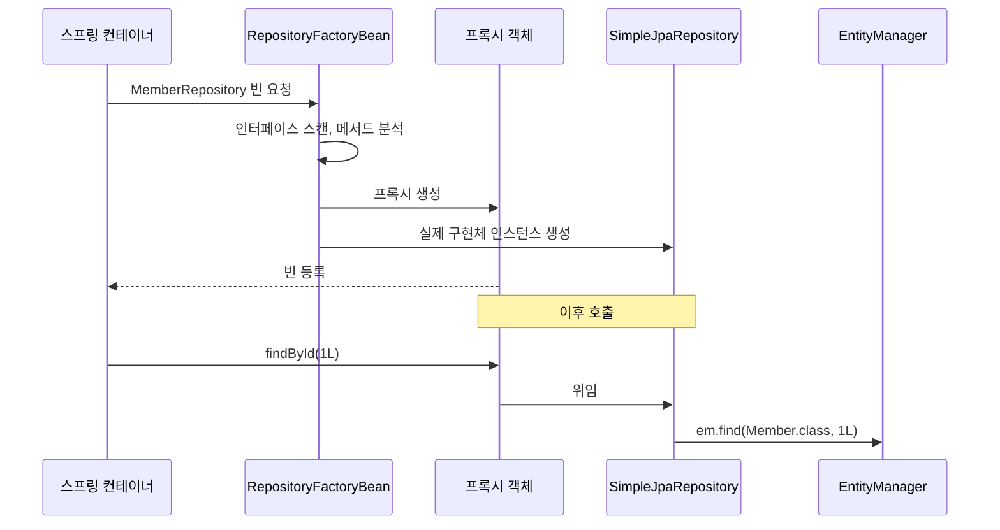
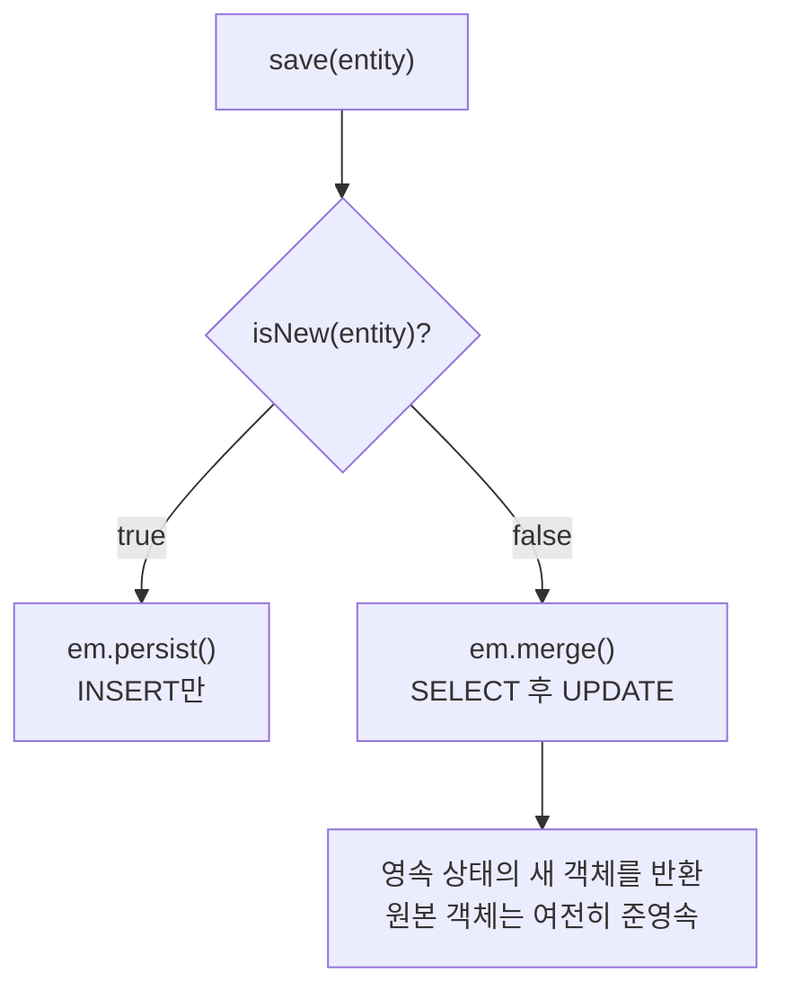
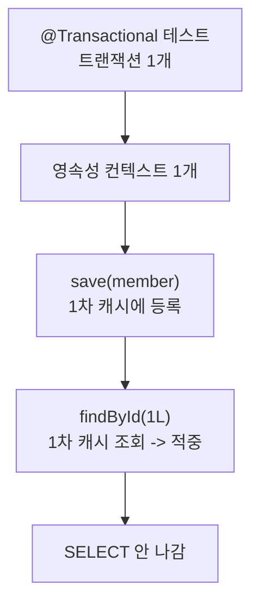

---

title: "인터페이스만 만들었는데 쿼리가 나가는 이유, Spring Data JPA 구현체 따라가기"
author: Diger
date: 2023-01-03
categories: [Java, Spring, JPA]
tags: [SpringDataJPA, JPA, Repository, Proxy, SimpleJpaRepository]
layout: post
toc: true
math: true
mermaid: true

---

## 참고자료

- [Spring Data JPA Reference - Working with Spring Data Repositories](https://docs.spring.io/spring-data/jpa/reference/repositories/core-concepts.html)
- [Spring Data Commons - Repository 인터페이스 Javadoc](https://docs.spring.io/spring-data/commons/docs/current/api/org/springframework/data/repository/Repository.html)
- [Spring Data JPA - SimpleJpaRepository 소스](https://github.com/spring-projects/spring-data-jpa/blob/main/spring-data-jpa/src/main/java/org/springframework/data/jpa/repository/support/SimpleJpaRepository.java)
- [Spring Data Commons - Persistable Javadoc](https://docs.spring.io/spring-data/commons/docs/current/api/org/springframework/data/domain/Persistable.html)
- [Jakarta Persistence Spec - EntityManager](https://jakarta.ee/specifications/persistence/3.1/apidocs/jakarta.persistence/jakarta/persistence/entitymanager)

---

## 배경

Spring Data JPA를 처음 썼을 때 가장 이상했던 것은 **인터페이스만 만들었는데 동작한다**는 것이었다.

```java
public interface MemberRepository extends JpaRepository<Member, Long> {
}
```

구현 클래스가 없다. `new`도 안 했다. 그런데 `memberRepository.findById(1L)`을 부르면 SELECT 쿼리가 나간다.

정리하면서 확인하고 싶었던 것들이다.

- 구현체가 없는데 누가 이 인터페이스를 실행하는가?
- `JpaRepository` 밑에 인터페이스가 여러 겹 있는데 왜 이렇게 나눴는가?
- `save()`를 불렀는데 왜 SELECT가 먼저 나가는 경우가 있는가?
- ID를 직접 지정하는 엔티티에서 `save()`가 이상하게 동작하는 이유는 무엇인가?

소스를 직접 따라가면서 확인했다.

---

## 1. 인터페이스 계층 구조

### 1.1 JpaRepository부터 거슬러 올라가기

`JpaRepository`가 어디에 있고 무엇을 상속하는지부터 본다.

```java
package org.springframework.data.jpa.repository;

@NoRepositoryBean
public interface JpaRepository<T, ID>
        extends ListCrudRepository<T, ID>,
                ListPagingAndSortingRepository<T, ID>,
                QueryByExampleExecutor<T> {

    void flush();
    <S extends T> S saveAndFlush(S entity);
    void deleteAllInBatch(Iterable<T> entities);
    T getReferenceById(ID id);
    // ...
}
```

`@NoRepositoryBean`이 붙어 있다. **이 인터페이스 자체는 빈으로 만들지 말라는 표시**다. 이게 없으면 스프링이 `JpaRepository` 자체를 리포지토리로 착각하고 프록시를 만들려다 실패한다.

계층은 이렇게 생겼다.



### 1.2 왜 이렇게 잘게 나눴는가

최상위 `Repository`에는 **메서드가 하나도 없다.** 스프링 데이터가 "이건 리포지토리다"라고 알아보기 위한 표시일 뿐이고, 이런 인터페이스를 마커 인터페이스라고 부른다.

아래로 갈수록 기능이 늘어난다. 여기서 얻는 것이 있다. **필요한 만큼만 상속하면 그 인터페이스에 없는 메서드는 노출되지 않는다.**

조회만 하는 리포지토리를 만들 때 `JpaRepository`를 상속하면 `deleteAll()`이 함께 열린다. 누군가 실수로 부를 수 있다. 이럴 때는 `Repository`를 직접 상속하고 필요한 메서드만 직접 선언하면 된다.

```java
public interface MemberQueryRepository extends Repository<Member, Long> {
    Optional<Member> findById(Long id);
    List<Member> findByTeamName(String name);
    // delete 계열은 아예 없다
}
```

`JpaRepository`가 가장 아래에 있고 JPA 전용 기능이 여기 들어간다. **편한 대신 JPA에 묶인다.** 데이터 접근 기술을 바꿀 가능성이 있으면 상위 인터페이스를 쓰는 편이 낫다.

### 1.3 버전에 따라 달라진 부분

과거 스프링 데이터 2.x에서는 `PagingAndSortingRepository`가 `CrudRepository`를 상속했다. 페이징을 쓰려면 CRUD가 통째로 딸려왔다.

**3.0에서 이 상속이 끊겼다.** 지금은 둘 다 `Repository`를 직접 상속하는 형제 관계다. 페이징만 필요한데 CRUD 전부를 열지 않아도 되게 하려는 변경이다.

`ListCrudRepository`, `ListPagingAndSortingRepository`도 3.0에서 추가됐다. `CrudRepository`의 `findAll()`이 `Iterable<T>`를 돌려주는 것이 불편했기 때문에, 같은 메서드를 `List<T>`로 돌려주는 인터페이스를 따로 만든 것이다.

---

## 2. 구현체는 누가 만드는가

첫 질문의 답이다.

### 2.1 프록시가 만들어진다

스프링 데이터는 애플리케이션이 뜰 때 `Repository`를 상속한 인터페이스를 전부 찾는다. 그리고 각각에 대해 **런타임 프록시 객체를 만들어서 빈으로 등록한다.**



프록시가 메서드 호출을 받으면 **셋 중 하나로 보낸다.**

`findById`, `save`처럼 `CrudRepository` 계열에 정의된 메서드는 `SimpleJpaRepository`로 보낸다.

`findByTeamName`처럼 이름으로 규칙을 만든 메서드는 **메서드 이름을 파싱해서 JPQL을 만든 다음** 실행한다.

`@Query`가 붙은 메서드는 그 문자열을 그대로 쓴다.

### 2.2 왜 프록시인가

인터페이스밖에 없는데 객체를 만들려면 방법이 하나뿐이다. 실행 중에 그 인터페이스를 구현하는 객체를 만들어내는 것이다. 자바 표준 `java.lang.reflect.Proxy`가 이 일을 한다.

이 부분을 더 파고든 내용은 [리플렉션과 동적 프록시에 관한 글](/posts/Reflection-DynamicProxy-CGLIB-AOP/)에 정리해뒀다.

---

## 3. SimpleJpaRepository 안을 열어보기

실제 구현체다. 생각보다 단순하다.

```java
@Repository
@Transactional(readOnly = true)
public class SimpleJpaRepository<T, ID> implements JpaRepositoryImplementation<T, ID> {

    private final JpaEntityInformation<T, ?> entityInformation;
    private final EntityManager em;

    @Override
    public Optional<T> findById(ID id) {

        Assert.notNull(id, ID_MUST_NOT_BE_NULL);

        Class<T> domainType = getDomainClass();

        if (metadata == null) {
            return Optional.ofNullable(em.find(domainType, id));
        }

        LockModeType type = metadata.getLockModeType();
        Map<String, Object> hints = new HashMap<>();
        getQueryHints().withFetchGraphs(em).forEach(hints::put);

        return Optional.ofNullable(
                type == null ? em.find(domainType, id, hints)
                             : em.find(domainType, id, type, hints));
    }
}
```

**결국 `EntityManager`를 부르는 것이 전부다.** Spring Data JPA는 JPA를 대체하는 것이 아니라 JPA 위에 얇게 덮은 층이다.

클래스에 붙은 두 애노테이션이 중요하다.

### 3.1 @Repository

두 가지를 한다.

컴포넌트 스캔 대상이 된다. `@Component`를 메타 애노테이션으로 갖기 때문이다.

**하부 기술의 예외를 스프링 예외로 바꿔준다.** 이게 더 중요하다.

JPA는 `PersistenceException`을, JDBC는 `SQLException`을 던진다. 서로 다른 예외다. 서비스 계층이 이걸 직접 잡으면 데이터 접근 기술을 바꿀 때 서비스 코드도 함께 고쳐야 한다.

`@Repository`가 붙어 있으면 스프링이 후처리기를 붙여서 이 예외들을 `DataAccessException` 계층으로 바꾼다. 서비스 계층은 `DataAccessException`만 알면 되고, 밑단이 JPA에서 JDBC로 바뀌어도 손댈 것이 없다.

### 3.2 @Transactional(readOnly = true)

클래스 전체에 읽기 전용 트랜잭션이 걸려 있다. **그래서 서비스 계층에서 `@Transactional`을 안 붙여도 리포지토리 메서드 하나하나는 트랜잭션 안에서 돈다.**

쓰기 메서드는 개별로 덮어쓴다.

```java
@Transactional
@Override
public <S extends T> S save(S entity) { ... }
```

`readOnly = true`가 무엇을 하는지 짚어둔다. 하이버네이트가 이걸 보면 **플러시 모드를 MANUAL로 바꾼다.** 자동 플러시가 일어나지 않으니 변경 감지(dirty checking)를 위한 스냅샷 비교도 건너뛴다. 조회만 하는 경로에서 불필요한 작업이 빠지는 것이다.

여기서 오해하기 쉬운 것이 있다. **`readOnly = true`는 쓰기를 막는 장치가 아니다.** 네이티브 쿼리로 UPDATE를 날리면 그대로 나간다. DB 레벨의 읽기 전용이 아니라 하이버네이트 레벨의 최적화 힌트에 가깝다.

---

## 4. save()가 SELECT를 먼저 날리는 경우

세 번째 질문이다.

### 4.1 persist와 merge의 갈림길

```java
@Transactional
@Override
public <S extends T> S save(S entity) {

    Assert.notNull(entity, "Entity must not be null.");

    if (entityInformation.isNew(entity)) {
        em.persist(entity);
        return entity;
    } else {
        return em.merge(entity);
    }
}
```

**새 엔티티면 `persist`, 아니면 `merge`다.**

`merge`가 문제를 일으킨다. `merge`는 "이 엔티티의 현재 상태를 DB 상태에 덮어쓴다"는 동작이라서, **먼저 DB에서 해당 행을 읽어와야 한다.** 그래서 SELECT가 나간다.



`merge`에는 또 하나 함정이 있다. **넘긴 객체가 영속 상태가 되는 것이 아니라, 새로 만들어진 복사본이 영속 상태가 된다.** 반환값을 안 받고 원본을 계속 쓰면 변경이 반영되지 않는다.

```java
Item item = new Item("A");
itemRepository.save(item);
item.setName("B");    // 반영 안 됨. item은 여전히 준영속이다

Item managed = itemRepository.save(item);
managed.setName("B"); // 이건 반영된다
```

### 4.2 merge를 쓰지 말아야 하는 이유

`merge`가 필요한 상황은 하나다. **엔티티가 영속성 컨텍스트에서 떨어져 나갔다가(준영속) 다시 붙어야 할 때**다. 세션 종료 후 화면에서 넘어온 객체를 다시 붙이는 경우 정도다.

이미 영속 상태인 엔티티의 값을 바꾸는 데에는 `save()`가 필요 없다. **트랜잭션 안에서 값만 바꾸면 변경 감지가 알아서 UPDATE를 만든다.**

```java
@Transactional
public void updateName(Long id, String name) {
    Member member = memberRepository.findById(id).orElseThrow();
    member.setName(name);   // save() 호출 불필요
}
```

---

## 5. 새로운 엔티티를 어떻게 구별하는가

네 번째 질문이다. `isNew()`가 무엇을 보는지가 문제의 뿌리다.

### 5.1 기본 전략

식별자만 본다.

식별자가 객체 타입이면 `null`인지 본다. `null`이면 새 엔티티다.

식별자가 기본 타입이면 `0`인지 본다. `0`이면 새 엔티티다.

`@GeneratedValue`를 쓰면 이 전략이 잘 맞는다. `new Member(...)` 직후에는 ID가 아직 `null`이고, `persist` 시점에 채워지기 때문이다.

```java
@Entity
public class Item {

    @Id @GeneratedValue
    private Long id;
}
```

### 5.2 ID를 직접 지정하면 깨진다

```java
@Entity
public class Item {

    @Id
    private String uuid;
}

Item item = new Item("A");
itemRepository.save(item);
```

**`uuid`에 이미 값이 들어 있으므로 `isNew()`가 `false`를 돌려준다.** 새 엔티티인데 `merge`가 호출되고, 없는 행을 찾느라 SELECT가 나간 뒤 INSERT가 이어진다. 쿼리가 하나 더 나가고, 앞서 말한 복사본 문제까지 따라온다.

### 5.3 Persistable로 직접 판단하기

`Persistable<ID>` 인터페이스를 구현하면 `isNew()` 판단을 직접 정할 수 있다. 이 인터페이스가 요구하는 메서드는 둘이다.

```java
public interface Persistable<ID> {
    @Nullable ID getId();
    boolean isNew();
}
```

**메서드 이름은 `getId()`다.** 필드 이름이 `uuid`여도 이 메서드 이름은 바뀌지 않는다.

```java
@Entity
public class Item implements Persistable<String> {

    @Id
    private String uuid;

    @Override
    public String getId() {
        return uuid;
    }

    @Override
    public boolean isNew() {
        return ???;   // 무엇을 봐야 하는가
    }
}
```

문제는 **무엇을 보고 판단할지**다. 식별자는 이미 채워져 있으니 쓸 수 없다.

### 5.4 생성 시각으로 판단하기

JPA Auditing이 채워주는 생성 시각을 쓰는 방법이 널리 쓰인다.

```java
@Entity
@EntityListeners(AuditingEntityListener.class)
public class Item implements Persistable<String> {

    @Id
    private String uuid;

    @CreatedDate
    private LocalDateTime createdDate;

    @Override
    public String getId() {
        return uuid;
    }

    @Override
    public boolean isNew() {
        return createdDate == null;
    }
}
```

**왜 이게 되는지가 핵심이다.** `@CreatedDate`는 `persist` 직전에 `AuditingEntityListener`가 채운다. 그러니까 아직 저장된 적 없는 객체는 `createdDate`가 `null`이고, DB에서 읽어온 객체는 값이 들어 있다.

`@EnableJpaAuditing`을 설정 클래스에 붙여야 리스너가 동작한다. 이걸 빠뜨리면 `createdDate`가 영원히 `null`이라 항상 새 엔티티로 판단되고, 수정할 때 INSERT가 나가면서 키 중복으로 터진다.

---

## 6. 저장한 엔티티를 다시 조회했는데 쿼리가 안 나간 이유

작업하다가 마주친 상황이다. 테스트에서 `save()`를 부른 뒤 다시 조회했는데 SELECT가 안 나갔다.

```java
@SpringBootTest
@Transactional
class MemberRepositoryTest {

    @Autowired MemberRepository memberRepository;

    @BeforeEach
    void init() {
        memberRepository.save(new Member("Diger Kim"));
    }

    @Test
    void findAfterSave() {
        Member found = memberRepository.findById(1L).orElseThrow();
        // SELECT 쿼리가 나가지 않는다
    }
}
```

**테스트 클래스에 붙은 `@Transactional` 때문이다.**

트랜잭션 하나에 영속성 컨텍스트 하나가 붙는다. `@BeforeEach`와 `@Test`가 같은 트랜잭션 안에서 돌기 때문에 **영속성 컨텍스트도 하나로 이어진다.**

`save()`가 `persist`를 부르면 엔티티가 1차 캐시에 올라간다. 그 다음 `findById`는 DB에 가기 전에 1차 캐시를 먼저 뒤지고, 거기 있으면 **그대로 돌려주고 끝난다.** 쿼리를 날릴 이유가 없다.



여기서 짚어둘 것이 있다. **이 동작 때문에 테스트가 실제 동작을 검증하지 못할 수 있다.** 실서비스에서는 요청마다 트랜잭션이 나뉘므로 1차 캐시가 유지되지 않고, 테스트에서는 안 나가던 쿼리가 실제로는 나간다.

실제 쿼리 흐름을 확인하려면 중간에 `em.flush()`와 `em.clear()`로 영속성 컨텍스트를 비워주면 된다.

```java
@Test
void findAfterSave() {
    em.flush();
    em.clear();     // 1차 캐시를 비운다

    Member found = memberRepository.findById(1L).orElseThrow();
    // 이제 SELECT가 나간다
}
```

---

## 정리하며

처음 던진 질문들에 대한 답이다.

**구현체가 없는데 누가 실행하는가.** 스프링 데이터가 애플리케이션 시작 시점에 `Repository`를 상속한 인터페이스를 찾아서 런타임 프록시를 만들어 빈으로 등록한다. 프록시는 호출을 받아 `SimpleJpaRepository`로 위임하거나, 메서드 이름을 파싱해 JPQL을 만들거나, `@Query`의 문자열을 실행한다.

**인터페이스를 왜 여러 겹으로 나눴는가.** 필요한 만큼만 상속해서 노출되는 메서드를 줄이기 위해서다. 최상위 `Repository`는 메서드가 없는 마커이고 아래로 갈수록 기능이 붙는다. 스프링 데이터 3.0에서 `PagingAndSortingRepository`가 `CrudRepository` 상속을 끊은 것도 같은 방향의 변경이다.

**`save()`에서 SELECT가 먼저 나가는 이유.** `isNew()`가 `false`면 `merge`가 호출되고, `merge`는 DB 상태 위에 덮어쓰는 동작이라 먼저 읽어와야 한다. 이미 영속 상태인 엔티티를 고칠 때는 `save()`를 부를 필요 없이 값만 바꾸면 변경 감지가 처리한다.

**ID를 직접 지정하면 왜 이상해지는가.** 기본 `isNew()`가 식별자만 보기 때문이다. UUID처럼 애플리케이션이 값을 미리 넣으면 새 엔티티도 기존 엔티티로 판단된다. `Persistable<ID>`를 구현해서 `@CreatedDate`가 `null`인지로 판단하게 하면 해결된다.

따라가고 나서 남은 감각은 **Spring Data JPA가 마법이 아니라는 것**이었다. 프록시가 인터페이스를 구현해주고, 그 안은 `EntityManager` 호출이다. 이상한 쿼리가 나가면 `SimpleJpaRepository`부터 열어보면 대개 답이 나온다.
