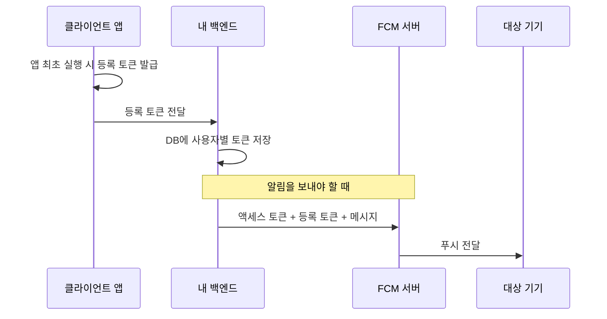
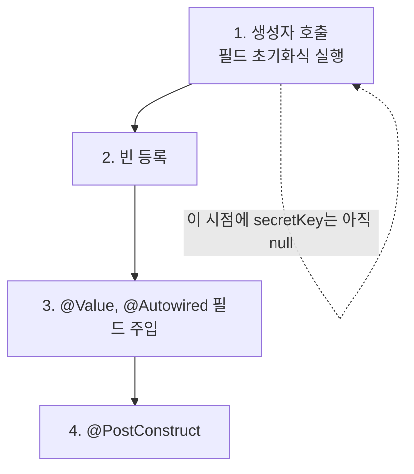
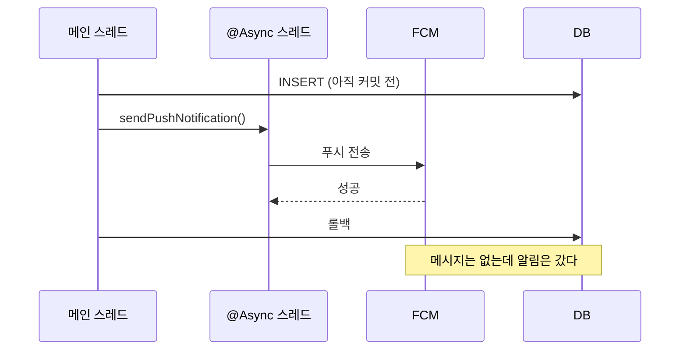

---

title: "Spring Boot에 FCM 붙이면서 밟은 지뢰들"
date: 2023-02-22
categories: [Spring, Java]
tags: [FCM, PushNotification, Spring, Firebase, Async]
layout: post
toc: true
math: true
mermaid: true

---

## 참고자료

- [Firebase Cloud Messaging 개요](https://firebase.google.com/docs/cloud-messaging)
- [FCM 등록 토큰 관리 모범 사례](https://firebase.google.com/docs/cloud-messaging/manage-tokens)
- [FCM HTTP v1 API 참조](https://firebase.google.com/docs/reference/fcm/rest/v1/projects.messages)
- [Firebase Admin SDK 설정](https://firebase.google.com/docs/admin/setup)
- [Spring Framework - @Value Javadoc](https://docs.spring.io/spring-framework/docs/current/javadoc-api/org/springframework/beans/factory/annotation/Value.html)

---

## 배경

푸시 알림을 붙여야 했다. 안드로이드와 iOS 양쪽에 보내야 하니 FCM을 쓰기로 했다.

문서를 보고 그대로 따라 쓴 코드가 처음에는 돌지 않았다. 원인을 하나씩 찾다 보니 **FCM 자체보다 스프링 쪽 오해가 더 컸다.**

정리하면서 확인하고 싶었던 것들이다.

- FCM에 요청을 보내는 주체는 서버인가 클라이언트인가?
- 토큰이라고 부르는 것이 두 종류인데 무엇이 다른가?
- `@Value`로 주입받은 값을 다른 필드 초기화에 쓰면 왜 `null`인가?
- 푸시를 트랜잭션 안에서 보내면 무슨 문제가 생기는가?

---

## 1. FCM이 무엇인가

Firebase Cloud Messaging은 웹, 안드로이드, iOS에 메시지를 보내주는 서비스다. 무료로 쓸 수 있다.

문서에 있는 구조도가 한눈에 안 들어와서 흐름만 다시 그렸다.



여기서 처음 헷갈렸던 것이 첫 질문이다. **FCM에 요청을 보내는 것은 백엔드다.** 클라이언트는 자기 등록 토큰을 백엔드에 넘겨줄 뿐이다.

클라이언트가 직접 FCM에 보내려면 서비스 계정 키를 앱에 넣어야 하는데, 그러면 앱을 뜯은 사람이 그 키로 아무에게나 푸시를 보낼 수 있다. 서버 쪽에 두는 것이 유일한 선택지다.

### 1.1 메시지가 어떻게 생겼는가

HTTP v1 API 기준으로 이렇게 생겼다.

```json
{
    "message": {
        "token": "bk3RNwTe3H0:CI2k_HHwgIpoDKCIZvvDMExUdFQ3P1...",
        "notification": {
            "title": "Portugal vs. Denmark",
            "body": "great match!"
        }
    }
}
```

`token`이 **받을 기기를 가리키는 등록 토큰**이고, `notification`이 화면에 뜰 제목과 내용이다.

---

## 2. 토큰이라는 말이 두 번 나온다

두 번째 질문이다. FCM을 다루다 보면 토큰이라는 단어가 서로 다른 두 가지를 가리킨다.

| 이름 | 누가 만드는가 | 무엇을 가리키는가 | 수명 |
|---|---|---|---|
| 등록 토큰 (registration token) | 클라이언트의 FCM SDK | "이 기기의 이 앱 설치본" | 길지만 바뀔 수 있다 |
| 액세스 토큰 (access token) | 서버가 서비스 계정 키로 발급 | "이 요청을 보낸 서버" | 짧다 (1시간) |

**등록 토큰은 수신자 주소이고, 액세스 토큰은 발신자 신분증이다.** 둘을 섞어 쓰면 아무것도 동작하지 않는다.

액세스 토큰은 Admin SDK를 쓰면 알아서 발급하고 갱신해준다. 직접 만들 일이 없다.

### 2.1 등록 토큰을 관리하는 방법

공식문서가 권하는 내용을 정리하면 이렇다.

**등록 토큰은 서버가 저장하고 관리한다.** 사용자별로 활성 토큰 목록을 유지하는 것이 서버의 몫이다.

**토큰에 타임스탬프를 같이 저장한다.** 이 값은 SDK가 주지 않으므로 직접 붙여야 한다. 오래된 토큰을 걸러내려면 언제 갱신됐는지를 알아야 하기 때문이다.

**토큰이 바뀌는 상황이 있다.** 앱을 새 기기에서 복원했을 때, 앱을 지웠다 다시 깔았을 때, 앱 데이터를 지웠을 때다. 이때 클라이언트가 새 토큰을 받아 서버에 다시 올려야 한다.

**응답이 무효한 토큰이라고 알려주면 지운다.** 그리고 만료 가능성도 함께 고려해야 한다. 오래된 토큰이 쌓이면 무의미한 요청만 늘어난다.

---

## 3. 붙이는 순서

### 3.1 서비스 계정 키 준비

Firebase 콘솔에서 서비스 계정 키를 받으면 이렇게 생긴 JSON이 나온다.

```json
{
  "type": "service_account",
  "project_id": "...",
  "private_key_id": "...",
  "private_key": "...",
  "client_email": "...",
  "client_id": "..."
}
```

**이 파일은 절대 저장소에 올리면 안 된다.** `private_key`가 그대로 들어 있어서, 이걸 얻은 사람은 프로젝트의 모든 사용자에게 푸시를 보낼 수 있다. 당시에는 `resources` 아래에 두고 `.gitignore`로 막았는데, 지금 다시 한다면 환경 변수나 시크릿 저장소에서 읽게 만들 것이다.

설정 값은 프로파일로 나눠뒀다.

```yaml
fcm:
  key: firebase_key.json
  project-id: my-project-id
```

```yaml
spring:
  profiles:
    include:
      - jpa
      - jwt
      - aws
      - fcm
```

### 3.2 의존성

```groovy
dependencies {
    implementation 'com.google.firebase:firebase-admin:6.8.1'
}
```

당시에 쓴 버전이 6.8.1이다. **지금 새로 붙인다면 9.x를 쓰는 것이 맞다.** 뒤에서 다룰 `sendMulticast`가 그 사이에 대체됐다.

### 3.3 FirebaseApp 빈 등록

```java
@Configuration
public class FcmConfig {

    @Value("${fcm.key}")
    private String secretKey;

    @Value("${fcm.project-id}")
    private String projectId;

    @Bean
    public FirebaseApp firebaseApp() {
        final ClassPathResource resource = new ClassPathResource(secretKey);
        try (InputStream stream = resource.getInputStream()) {
            final FirebaseOptions firebaseOptions = FirebaseOptions.builder()
                .setCredentials(GoogleCredentials.fromStream(stream))
                .setProjectId(projectId)
                .build();
            return FirebaseApp.initializeApp(firebaseOptions);
        } catch (IOException e) {
            throw new RuntimeException(e);
        }
    }
}
```

`FirebaseApp.initializeApp()`은 **같은 이름으로 두 번 부르면 예외를 던진다.** 빈으로 한 번만 만들어서 주입받아 쓰는 이유다.

---

## 4. 첫 번째 지뢰, @Value 필드로 다른 필드를 초기화하기

세 번째 질문이다. 처음 쓴 서비스 코드가 이랬다.

```java
@Service
@RequiredArgsConstructor
public class FcmPushService {

    @Value("${fcm.key}")
    private String secretKey;

    @Value("${fcm.project-id}")
    private String projectId;

    private final String CONFIG_PATH = secretKey;
    private final String SEND_URL =
        "https://fcm.googleapis.com/v1/projects/" + projectId + "/messages:send";
}
```

**`CONFIG_PATH`가 `null`이고, `SEND_URL`은 `.../projects/null/messages:send`가 된다.**

### 4.1 왜 그런가

객체가 만들어지는 순서 때문이다.



**필드 초기화식은 생성자 안에서 실행된다.** 그런데 `@Value`는 객체가 만들어진 다음에 리플렉션으로 값을 꽂아 넣는 방식이다. 순서가 반대다.

그러니 `private final String CONFIG_PATH = secretKey;`가 실행되는 시점의 `secretKey`는 아직 `null`이고, `final`이라 나중에 바뀌지도 않는다.

### 4.2 어떻게 고치는가

셋 중 하나다.

**생성자 파라미터로 받는다.** 가장 명확하다.

```java
@Service
public class FcmPushService {

    private final String sendUrl;

    public FcmPushService(@Value("${fcm.project-id}") String projectId) {
        this.sendUrl = "https://fcm.googleapis.com/v1/projects/"
                        + projectId + "/messages:send";
    }
}
```

**`@PostConstruct`에서 조립한다.** 주입이 끝난 뒤에 불리므로 값이 들어 있다.

**`@ConfigurationProperties`로 묶는다.** 설정 값이 여러 개면 이쪽이 낫다.

```java
@ConfigurationProperties(prefix = "fcm")
public record FcmProperties(String key, String projectId) {
}
```

### 4.3 그런데 이 코드는 애초에 필요 없었다

고치고 나서야 알았는데, **`SEND_URL`과 액세스 토큰 발급 코드는 아예 쓰이지 않는다.**

```java
private String getAccessToken() throws IOException {
    GoogleCredentials googleCredentials = GoogleCredentials.fromStream(
        new ClassPathResource(CONFIG_PATH).getInputStream()).createScoped(List.of(AUTH_URL));
    googleCredentials.refreshIfExpired();
    return googleCredentials.getAccessToken().getTokenValue();
}
```

REST API를 직접 호출할 때 필요한 것들인데, Admin SDK의 `FirebaseMessaging`을 쓰기로 했으면 **SDK가 인증과 URL을 전부 처리한다.**

문서 여러 개를 섞어 보다가 REST 방식 예제와 SDK 방식 예제를 함께 옮겨 온 것이 원인이었다. 둘 중 하나만 골라야 한다.

| 방식 | 쓰는 것 | 언제 |
|---|---|---|
| Admin SDK | `FirebaseMessaging` | 자바 서버라면 기본 선택 |
| REST 직접 호출 | `getAccessToken()` + HTTP 클라이언트 | SDK가 없는 언어이거나 SDK가 막힌 환경 |

---

## 5. 두 번째 지뢰, 예외를 흐름 제어로 쓰기

처음 쓴 전송 메서드다.

```java
@Async
public void sendPushNotification(FcmMessage fcmMessage) {
    try {
        extractUserTokenByPushAlarmAllowed(fcmMessage.getUser());
    } catch (NullPointerException exception) {
        return;
    }
    MulticastMessage multicastMessage = MulticastMessage.builder()
        .setNotification(new Notification(fcmMessage.getTitle(), fcmMessage.getBody()))
        .addAllTokens(
            Collections.singletonList(extractUserTokenByPushAlarmAllowed(fcmMessage.getUser())))
        .build();
    ...
}

private String extractUserTokenByPushAlarmAllowed(User user) {
    if (user.getPushAlarmStatus()) {
        return user.getFcmToken();
    }
    return null;
}
```

문제가 셋 있다.

**`extractUserTokenByPushAlarmAllowed`는 `null`을 반환할 뿐 예외를 던지지 않는다.** `try` 블록이 잡으려는 `NullPointerException`은 여기서 발생하지 않는다. 알림을 끈 사용자여도 `null`을 그대로 들고 다음 줄로 넘어간다.

**같은 메서드를 두 번 부른다.** 한 번 불러서 변수에 담으면 될 일이다.

**`user.getPushAlarmStatus()`가 `Boolean`이면 여기서 진짜 NPE가 난다.** `null`인 `Boolean`을 `if`에 넣으면 언박싱하다가 터진다. 정작 이 예외는 `@Async` 스레드에서 발생하므로 호출한 쪽으로 전달되지도 않는다.

고치면 이렇다.

```java
@Async
public void sendPushNotification(FcmMessage fcmMessage) {
    String token = extractTokenIfAllowed(fcmMessage.getUser());
    if (token == null) {
        return;
    }

    Message message = Message.builder()
        .setToken(token)
        .setNotification(Notification.builder()
            .setTitle(fcmMessage.getTitle())
            .setBody(fcmMessage.getBody())
            .build())
        .build();

    try {
        FirebaseMessaging.getInstance(firebaseApp).send(message);
    } catch (FirebaseMessagingException e) {
        log.warn("푸시 전송 실패. userId={}", fcmMessage.getUser().getId(), e);
    }
}

private String extractTokenIfAllowed(User user) {
    return Boolean.TRUE.equals(user.getPushAlarmStatus()) ? user.getFcmToken() : null;
}
```

토큰이 하나뿐이면 `MulticastMessage`가 아니라 `Message`를 쓰면 된다. `Boolean.TRUE.equals(...)`로 비교하면 `null`이 와도 터지지 않는다.

**예외를 다시 던지지 않고 로그만 남긴 것도 의도적이다.** `@Async` 스레드에서 던진 예외는 호출한 쪽이 받지 못하고 조용히 사라진다. 던져봐야 아무도 못 보므로 로그로 남기는 편이 낫다.

### 5.1 sendMulticast는 대체됐다

당시 코드가 쓴 `sendMulticast`는 **firebase-admin 9.x에서 `sendEachForMulticast`로 대체됐다.** 여러 대상에 보내야 한다면 이쪽을 쓴다.

---

## 6. 세 번째 지뢰, 트랜잭션 안에서 푸시 보내기

네 번째 질문이다. 호출부가 이랬다.

```java
@Transactional
public String executeSendNoteContent(
    Note note, String message, Long senderId, Long receiverId) {

    User sender = userServiceUtility.loadUserById(senderId);
    User receiver = userServiceUtility.loadUserById(receiverId);

    saveNoteContentByText(note, message, sender, receiver);
    note.updateRecentContent(message);
    note.updateUserUnreadCountBySendMessage(sender);

    fcmPushService.sendPushNotification(new FcmMessage(receiver, fixedPushAlarmTitle, message));
    return message;
}
```

**푸시 전송이 트랜잭션 커밋 전에 일어난다.**

`@Async`가 붙어 있으니 별도 스레드로 넘어가고, 그 스레드는 트랜잭션과 무관하게 바로 전송한다. 반면 DB 쓰기는 아직 커밋되지 않았다.



메시지 저장이 실패해도 **알림은 이미 나갔다.** 사용자가 알림을 누르고 들어왔는데 그 메시지가 없다.

### 6.1 커밋 이후로 미루기

`TransactionalEventListener`를 쓰면 커밋된 다음에 실행할 수 있다.

```java
@Transactional
public String executeSendNoteContent(...) {
    // ... 저장 로직
    eventPublisher.publishEvent(new NoteSentEvent(receiver, message));
    return message;
}
```

```java
@Component
@RequiredArgsConstructor
public class NoteSentEventHandler {

    private final FcmPushService fcmPushService;

    @Async
    @TransactionalEventListener(phase = TransactionPhase.AFTER_COMMIT)
    public void handle(NoteSentEvent event) {
        fcmPushService.sendPushNotification(
            new FcmMessage(event.receiver(), TITLE, event.message()));
    }
}
```

**`AFTER_COMMIT`이 기본값이다.** 커밋이 끝난 뒤에만 리스너가 불린다. 롤백되면 아예 실행되지 않는다.

`@Async`를 함께 붙인 이유가 있다. `@TransactionalEventListener`만 쓰면 커밋 이후이긴 하지만 **여전히 같은 스레드에서 동기로 실행된다.** FCM 응답을 기다리느라 요청이 늘어질 수 있어서 비동기로 넘긴다.

### 6.2 @Async 자체의 함정

`@Async`는 스프링 AOP 프록시로 동작한다. **같은 클래스 안에서 자기 메서드를 부르면 프록시를 안 거치기 때문에 그냥 동기로 실행된다.**

스레드 풀도 확인해야 한다. 아무 설정도 안 하면 스프링 부트가 만들어주는 기본 실행기가 쓰이는데, 큐가 무한이라 처리가 밀려도 눈에 안 띄고 메모리만 쌓인다. 이 부분은 [`@Async` 동작에 관한 글](/posts/AsyncAnnotation/)에 따로 정리해뒀다.

---

## 7. 여기까지 붙인 결과

iOS 에뮬레이터에서 등록 토큰을 받아 DB에 직접 넣고, 위 API를 호출했을 때 알림이 도착하는 것까지 확인했다.

남은 것은 클라이언트가 토큰을 발급받아 서버에 올리는 경로와, 토큰이 무효해졌을 때 지우는 경로다. 이 둘은 클라이언트와 함께 정해야 해서 아직 손대지 못했다.

---

## 정리하며

처음 던진 질문들에 대한 답이다.

**FCM에 요청을 보내는 주체는 백엔드다.** 클라이언트는 자기 등록 토큰을 넘길 뿐이다. 서비스 계정 키를 앱에 넣으면 누구나 푸시를 보낼 수 있게 되므로 선택지가 없다.

**토큰이 두 종류다.** 등록 토큰은 받을 기기를 가리키는 수신자 주소이고, 액세스 토큰은 요청을 보낸 서버를 증명하는 발신자 신분증이다. Admin SDK를 쓰면 액세스 토큰은 직접 다룰 일이 없다.

**`@Value` 필드로 다른 필드를 초기화하면 `null`이다.** 필드 초기화식은 생성자 안에서 실행되고 `@Value` 주입은 그 뒤에 일어나기 때문이다. 생성자 파라미터로 받거나 `@PostConstruct`에서 조립해야 한다.

**트랜잭션 안에서 푸시를 보내면 롤백돼도 알림이 나간다.** `@TransactionalEventListener`의 `AFTER_COMMIT`으로 미루면 커밋된 경우에만 실행된다.

붙이고 나서 남은 감각은 **외부로 나가는 호출은 되돌릴 수 없다는 것**이었다. DB는 롤백되지만 이미 나간 푸시는 회수할 방법이 없다. 트랜잭션 경계 밖으로 밀어내는 것이 선택이 아니라 기본이라고 보게 됐다.
