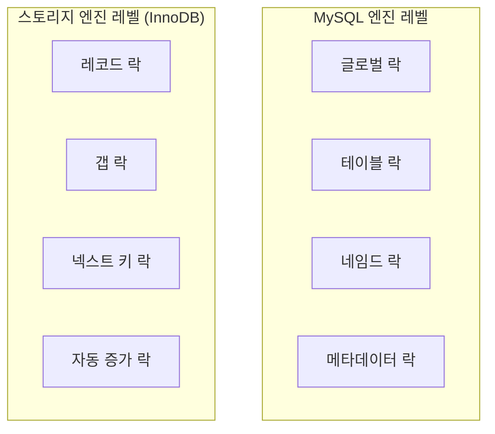
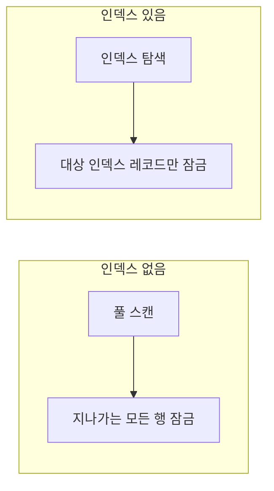
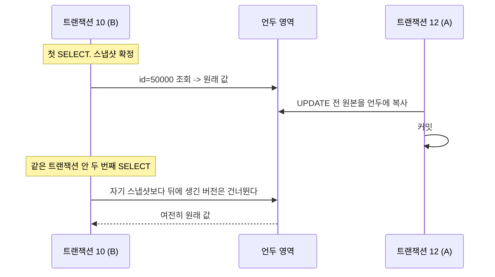

---

title: "트랜잭션과 락, 그리고 격리 수준이 실제로 무엇을 막아주는가"
date: 2023-05-02
categories: [Database, MySQL]
tags: [MySQL, Transaction, Lock, IsolationLevel, InnoDB, MVCC]
layout: post
toc: true
math: true
mermaid: true

---

## 참고자료

- [MySQL 8.0 Reference - InnoDB Locking](https://dev.mysql.com/doc/refman/8.0/en/innodb-locking.html)
- [MySQL 8.0 Reference - Transaction Isolation Levels](https://dev.mysql.com/doc/refman/8.0/en/innodb-transaction-isolation-levels.html)
- [MySQL 8.0 Reference - InnoDB Multi-Versioning](https://dev.mysql.com/doc/refman/8.0/en/innodb-multi-versioning.html)
- [MySQL 8.0 Reference - Phantom Rows](https://dev.mysql.com/doc/refman/8.0/en/innodb-next-key-locking.html)
- [MySQL 8.0 Reference - AUTO_INCREMENT Handling in InnoDB](https://dev.mysql.com/doc/refman/8.0/en/innodb-auto-increment-handling.html)
- [MySQL 8.0 Reference - Metadata Locking](https://dev.mysql.com/doc/refman/8.0/en/metadata-locking.html)

---

## 배경

트랜잭션과 락을 같은 것으로 뭉뚱그려 알고 있었다. "동시성 문제를 막아주는 것" 정도로만.

그런데 격리 수준을 바꿔도 어떤 문제는 그대로 남고, 어떤 락은 격리 수준과 무관하게 걸린다. 두 개념이 하나가 아니라는 뜻이다.

정리하면서 확인하고 싶었던 것들이다.

- 트랜잭션과 락은 각각 무엇을 보장하는가?
- InnoDB는 레코드를 잠근다는데 왜 인덱스 이야기가 나오는가?
- MySQL 기본 격리 수준이 `REPEATABLE READ`인데, 팬텀 리드가 발생한다는 말과 발생하지 않는다는 말이 둘 다 보인다. 무엇이 맞는가?
- 격리 수준을 올리면 락이 늘어나는가?

---

## 1. 트랜잭션과 락의 차이란?

첫 질문이다.

**트랜잭션은 작업의 완전성을 보장한다.** 여러 작업을 전부 반영하거나, 하나도 반영하지 않고 원래대로 되돌리거나 둘 중 하나로 만든다. 시간 축에서 "이 묶음을 쪼개지 않겠다"는 약속이다.

**락은 동시성을 제어한다.** 여러 커넥션이 같은 데이터를 동시에 만지려 할 때 순서를 세운다. 공간 축에서 "이건 지금 내가 쓰고 있다"는 표시다.

락이 없으면 어떻게 되는지 보면 차이가 분명해진다. 회원 정보 레코드 하나를 두 커넥션이 동시에 바꾸려 하면, **어느 쪽 변경이 최종적으로 남는지 아무도 보장할 수 없다.** 두 변경이 서로를 덮어쓸 수도 있고, 반씩 섞일 수도 있다.

락은 이 요청을 줄 세워서 하나씩 처리하게 만든다.

**격리 수준은 이 둘 사이에 있다.** 한 트랜잭션이 진행 중인 작업을 다른 트랜잭션에게 얼마나 보여줄지를 정하는 눈금이다.

---

## 2. 엔진별 트랜잭션 지원 여부

`AUTO_COMMIT`이 켜진 상태에서, 여러 행을 넣는 도중 오류가 나면 엔진마다 결과가 다르다.

| 엔진 | 오류 발생 시 | 결과 |
|---|---|---|
| InnoDB | 롤백 수행 | 아무것도 남지 않는다 |
| MyISAM | 롤백 없음 | 오류 직전까지 넣은 행이 남는다 |
| MEMORY | 롤백 없음 | 오류 직전까지 넣은 행이 남는다 |

**MyISAM과 MEMORY는 트랜잭션을 지원하지 않는다.** 그래서 작업이 중간에 실패하면 반쯤 반영된 상태가 그대로 남는다. 이걸 부분 갱신(partial update)이라고 부른다.

이 상태가 위험한 이유는 **애플리케이션이 실패했다고 알고 있는데 데이터는 일부 들어가 있다**는 점이다. 재시도하면 중복이 쌓이고, 안 하면 누락이 남는다. 어느 쪽이든 복구를 사람이 해야 한다.

---

## 3. 트랜잭션 범위를 최소화해야 하는 이유

트랜잭션을 어디서 시작하고 어디서 끝낼지가 성능에 직접 영향을 준다.

게시글 등록 흐름을 예로 든다.


문제가 두 가지다.

**커넥션을 너무 오래 잡고 있게 된다.** 커넥션 풀은 유한하다. 한 요청이 파일 저장과 메일 발송까지 붙들고 있으면, 그동안 다른 요청은 커넥션을 못 받고 대기한다. 트래픽이 조금만 늘어도 풀이 고갈된다.

**외부 통신이 DB 트랜잭션과 엮인다.** 메일 서버가 응답하지 않으면 그 시간만큼 트랜잭션이 길어지고, 잠긴 레코드도 그만큼 오래 잠겨 있다. 반대로 커밋이 실패하면 이미 나간 메일은 회수할 수 없다.

**메일 발송, 파일 전송, 외부 API 호출은 트랜잭션 밖으로 빼야 한다.** 되돌릴 수 없는 작업을 되돌릴 수 있는 작업과 묶으면, 둘 다 되돌릴 수 없게 된다.

---

## 4. 락의 종류

MySQL의 락은 두 층으로 나뉜다.



**MySQL 엔진 레벨**은 스토리지 엔진을 제외한 나머지 부분이 거는 락이다. 엔진을 무엇으로 바꿔도 동일하게 적용된다.

**스토리지 엔진 레벨**은 InnoDB가 자기 안에서 거는 락이다. 여기가 InnoDB의 동시성 처리 능력을 결정한다.

### 4.1 글로벌 락

`FLUSH TABLES WITH READ LOCK`으로 얻는다. **MySQL 서버 전체에 걸린다.** 대상 테이블이나 DB가 달라도 상관없다.

이 락이 잡혀 있는 동안 SELECT를 제외한 대부분의 DDL, DML이 대기한다. 백업 도구가 일관된 스냅샷을 얻으려고 쓰는 것이 대표적이다.

**범위가 너무 넓어서 서비스 중에는 쓰기 어렵다.** MySQL 8.0에는 더 가벼운 대안으로 `LOCK INSTANCE FOR BACKUP`이 생겼다. 백업 중에도 DML은 허용하고 DDL만 막는다.

### 4.2 테이블 락

테이블 하나 단위로 걸린다. `LOCK TABLES`로 명시적으로 걸 수도 있고 엔진이 알아서 걸기도 한다.

**MyISAM이나 MEMORY 테이블은 데이터를 바꾸는 쿼리마다 묵시적 테이블 락이 걸린다.** 그래서 쓰기가 몰리면 그대로 줄을 선다.

**InnoDB는 다르다.** 레코드 단위 잠금이 있으니 DML마다 테이블을 통째로 잠글 이유가 없다. 대신 의도 락(intention lock)이라는 것을 테이블에 건다. "이 테이블 안 어딘가의 행을 잠글 것"이라는 표시다. 의도 락끼리는 서로 충돌하지 않아서 동시성을 해치지 않고, 나중에 누군가 테이블 전체를 잠그려 할 때 빠르게 충돌을 감지하는 데 쓰인다.

InnoDB에서 테이블 전체가 잠기는 것은 주로 DDL을 실행할 때다.

### 4.3 네임드 락

임의의 문자열에 락을 건다. `GET_LOCK('문자열', 타임아웃)`으로 얻는다.

**테이블이나 행과 아무 관계가 없다.** 그냥 이름 하나를 놓고 "이 이름을 잡은 사람은 나 하나"라는 상태를 만드는 것이다.

여러 대의 웹 서버가 같은 배치를 중복 실행하지 않게 막을 때처럼, DB를 공유 자원으로 삼아 분산 락을 흉내 낼 때 쓴다.

### 4.4 메타데이터 락

테이블이나 뷰의 이름, 구조를 바꿀 때 자동으로 걸린다. 명시적으로 거는 수단은 없다.

**이 락 때문에 겪는 흔한 사고가 있다.** 오래 도는 트랜잭션이 어떤 테이블을 조회하고 있으면 그 테이블에 읽기 메타데이터 락이 걸려 있다. 이때 `ALTER TABLE`을 실행하면 쓰기 메타데이터 락을 얻으려고 대기한다.

문제는 **대기 중인 ALTER 뒤에 들어오는 모든 쿼리가 함께 대기한다는 것**이다. 조회 하나 때문에 테이블 전체가 멈춘다. `SHOW PROCESSLIST`에서 `Waiting for table metadata lock`이 보이면 이 상황이다.

---

## 5. InnoDB의 락이 인덱스를 잠그는 이유

두 번째 질문이다.

### 5.1 레코드 락은 인덱스 레코드를 잠근다

InnoDB의 레코드 락은 **행 자체가 아니라 인덱스 레코드를 잠근다.**

이게 왜 중요한지는 인덱스 없는 컬럼으로 UPDATE를 날려보면 안다.

```sql
-- age 컬럼에 인덱스가 없다
UPDATE member SET grade = 'VIP' WHERE age = 30;
```

**조건에 맞는 행이 한 건이어도 테이블의 모든 행이 잠긴다.**

이유는 이렇다. 인덱스가 없으면 InnoDB는 테이블을 처음부터 끝까지 훑는다. 훑으면서 만나는 행을 전부 잠근다. 조건에 안 맞는 행은 나중에 풀어주지만, **훑는 동안에는 잡혀 있다.** 그 사이 다른 트랜잭션은 아무 행도 못 만진다.

인덱스가 있으면 인덱스를 타고 해당 행만 찾아가므로 그 행의 인덱스 레코드만 잠근다.



**"인덱스는 조회 성능을 위한 것"이라고만 알고 있으면 이 부분을 놓친다.** 잘못 설계된 인덱스는 쓰기 동시성까지 무너뜨린다.

### 5.2 갭 락

**레코드 자체가 아니라 레코드와 레코드 사이의 빈 공간을 잠근다.**

`id`가 10, 20인 두 행이 있다고 하면, 10과 20 사이가 갭이다. 이 갭을 잠그면 `id = 15`인 행을 새로 넣을 수 없다.

**존재하지 않는 것을 잠근다**는 점이 낯설다. 하지만 목적을 보면 이해된다. 팬텀 리드를 막으려면 "지금 없는 행이 나중에 생기는 것"을 막아야 하고, 그러려면 행이 들어올 자리를 미리 막아야 한다.

### 5.3 넥스트 키 락

**레코드 락과 갭 락을 합친 것**이다. 인덱스 레코드 하나와 그 앞쪽 갭을 함께 잠근다.

InnoDB의 `REPEATABLE READ`에서 범위 조건으로 잠금 읽기를 하면 기본적으로 이 락이 걸린다.

### 5.4 자동 증가 락

`AUTO_INCREMENT` 컬럼이 있는 테이블에 INSERT가 몰릴 때, 번호를 중복 없이 나눠주기 위한 락이다.

**여기는 예전 설명이 그대로 도는 곳이라 짚어둔다.** 옛날에는 INSERT마다 테이블 수준 락이 걸렸지만, `innodb_autoinc_lock_mode` 설정이 생기면서 달라졌다.

| 모드 | 이름 | 동작 |
|---|---|---|
| 0 | traditional | 모든 INSERT에서 테이블 락. 문장이 끝나야 해제 |
| 1 | consecutive | 행 수를 미리 아는 단순 INSERT는 가벼운 뮤텍스. 나머지는 테이블 락 |
| 2 | interleaved | 항상 가벼운 뮤텍스. 번호 할당 직후 해제 |

**MySQL 8.0의 기본값은 2다.** 5.7까지는 1이었다. 그래서 8.0에서는 일반적인 INSERT가 테이블 락 때문에 밀리는 일이 없다.

모드 2에는 대가가 있다. **번호가 연속하지 않을 수 있다.** 여러 세션이 번갈아 번호를 받으므로 한 문장이 만든 행의 ID가 띄엄띄엄해진다. 8.0에서 기본값이 2로 바뀐 배경에는 복제 방식이 행 기반으로 옮겨가면서 번호 순서에 의존할 이유가 줄었다는 사정이 있다.

---

## 6. 격리 수준

여러 트랜잭션이 동시에 돌 때, 다른 트랜잭션의 작업을 얼마나 보여줄지를 정한다. 네 단계다.

| 수준 | 더티 리드 | 반복 불가능 읽기 | 팬텀 리드 |
|---|---|---|---|
| READ UNCOMMITTED | 발생 | 발생 | 발생 |
| READ COMMITTED | 없음 | 발생 | 발생 |
| REPEATABLE READ | 없음 | 없음 | InnoDB에서는 없음 |
| SERIALIZABLE | 없음 | 없음 | 없음 |

### 6.1 READ UNCOMMITTED

**커밋되지 않은 변경까지 보인다.**

1. A가 `INSERT INTO user VALUES("KIM", 50000)`을 날린다. 아직 커밋 안 함
2. B가 `SELECT * FROM user WHERE id = 50000`으로 그 행을 읽는다
3. B가 그 데이터로 다른 작업을 진행한다
4. A가 롤백한다

**B는 존재한 적 없는 데이터로 작업한 셈이 된다.** 이걸 더티 리드라고 부른다.

더티 리드는 이 수준에서만 발생한다. 그리고 이 수준을 쓸 이유는 거의 없다.

### 6.2 READ COMMITTED

**커밋된 것만 보인다.**

1. A가 `UPDATE user SET first_name = 'SHIN' WHERE id = 50000`을 날린다. 아직 커밋 안 함
2. B가 `SELECT * FROM user WHERE id = 50000`을 날린다
3. B는 변경 전 값을 본다

여기서 B가 변경 전 값을 어떻게 보는지가 중요하다. **언두 로그를 읽는다.**

InnoDB는 행을 바꾸기 전에 원래 값을 언두 영역에 복사해둔다. 롤백에 대비한 것인데, 다른 트랜잭션의 읽기도 이 복사본을 가져다 쓴다. 이 구조를 MVCC(다중 버전 동시성 제어)라고 부른다.

**MVCC 덕분에 읽기가 쓰기를 기다리지 않는다.** 쓰기 중인 행이어도 읽는 쪽은 언두에 있는 이전 버전을 보면 되니까 락 없이 진행한다.

그런데 이 수준에는 다른 문제가 있다.

1. A가 `SELECT * FROM user WHERE id = 50000`을 날려 한 건을 얻는다. 트랜잭션 유지 중
2. B가 그 행을 지우거나 조건 밖으로 바꾸고 커밋한다
3. A가 같은 트랜잭션 안에서 같은 쿼리를 다시 날린다. 아무것도 안 나온다

**같은 트랜잭션 안에서 같은 쿼리가 다른 결과를 냈다.** 이걸 반복 불가능 읽기(non-repeatable read)라고 한다.

`READ COMMITTED`는 **읽을 때마다 그 시점의 최신 커밋 상태를 스냅샷으로 잡는다.** 그래서 트랜잭션이 진행되는 동안 세상이 계속 바뀐다.

이게 문제가 되는 대표적인 경우가 집계다. 같은 트랜잭션에서 합계를 두 번 구했는데 값이 다르면, 그 사이에 넣은 검증 로직이 전부 무의미해진다.

### 6.3 REPEATABLE READ

MySQL InnoDB의 기본값이다.

**차이는 스냅샷을 언제 잡느냐 하나다.** `READ COMMITTED`가 쿼리마다 새로 잡는 반면, `REPEATABLE READ`는 **트랜잭션의 첫 읽기 시점에 한 번 잡고 끝까지 그걸 쓴다.**

동작을 보면 이렇다.



모든 InnoDB 트랜잭션은 고유 번호를 갖고, 언두에 쌓인 각 버전에도 그 번호가 붙어 있다. 트랜잭션 10은 **자기 번호보다 뒤에 만들어진 버전을 무시하고** 언두를 거슬러 올라가 자기 시점의 버전을 찾는다.

그래서 누가 중간에 바꾸고 커밋해도 B가 보는 값은 변하지 않는다.

### 6.4 팬텀 리드, 그리고 세 번째 질문

교과서적인 설명은 `REPEATABLE READ`에서 팬텀 리드가 발생한다고 한다. 시나리오는 이렇다.

1. B가 `SELECT * FROM user WHERE id >= 50000 FOR UPDATE`를 날린다. 한 건 조회됨
2. A가 `INSERT INTO user VALUES(50001, 'KIM')`을 넣고 커밋한다
3. B가 같은 트랜잭션에서 같은 쿼리를 다시 날린다. 두 건 조회됨

없던 행이 나타났다. 이걸 팬텀 리드라고 한다.

**여기서 `FOR UPDATE`가 결정적이다.** 잠금 읽기는 MVCC 스냅샷을 쓸 수 없다. 잠그려면 진짜 행이 있어야 하는데 언두에 있는 과거 버전에는 락을 걸 방법이 없기 때문이다. 그래서 잠금 읽기는 **현재 최신 상태를 직접 읽는다.** 그 결과 다른 트랜잭션이 새로 넣은 행이 보인다.

**그런데 InnoDB는 이 상황도 막는다.** 넥스트 키 락 때문이다.

1번에서 `id >= 50000` 범위로 잠금 읽기를 하면, InnoDB는 조회된 행뿐 아니라 **그 범위에 해당하는 갭까지 잠근다.** 50001이 들어올 자리가 이미 잠겨 있으므로 2번의 INSERT가 대기한다. 3번 시점에 새 행은 존재하지 않는다.

정리하면 이렇다.

| 읽기 종류 | 무엇을 읽는가 | 팬텀 |
|---|---|---|
| 일반 SELECT | MVCC 스냅샷 | 스냅샷이 고정이라 발생하지 않음 |
| SELECT ... FOR UPDATE / LOCK IN SHARE MODE | 최신 상태 | 넥스트 키 락이 갭을 막아 발생하지 않음 |

**두 경로가 서로 다른 방식으로 같은 결론에 도달한다.** 일반 읽기는 과거를 고정해서, 잠금 읽기는 미래를 막아서 팬텀을 없앤다.

그래서 "표준 `REPEATABLE READ`에서는 팬텀이 발생하지만 InnoDB에서는 발생하지 않는다"가 정확한 서술이다. 두 진술이 모순처럼 보였던 것은 표준과 구현을 섞어 읽었기 때문이었다.

다만 완전히 없는 것은 아니다. **같은 트랜잭션 안에서 일반 읽기를 하다가 UPDATE나 잠금 읽기를 섞으면** 그 시점에 최신 상태를 보게 되면서 앞뒤가 안 맞는 결과가 나올 수 있다. 한 트랜잭션 안에서 읽기 방식을 섞지 않는 것이 안전하다.

### 6.5 바이너리 로그와 격리 수준

`REPEATABLE READ`가 기본값인 데에는 복제 사정도 있다.

**문장 기반 복제를 쓰면 `READ COMMITTED`에서 원본과 복제본의 데이터가 달라질 수 있다.** 소스에서 실행된 순서와 바이너리 로그에 기록되는 순서가 어긋날 수 있기 때문이다. 갭 락이 이 순서를 보장해주는데 `READ COMMITTED`는 갭 락을 대부분 쓰지 않는다.

행 기반 복제를 쓰면 결과 자체가 기록되므로 이 문제가 없다. 그래서 `READ COMMITTED`로 낮추려면 `binlog_format`을 `ROW`로 두는 것이 전제다.

### 6.6 SERIALIZABLE

가장 엄격하다. **일반 SELECT까지 잠금 읽기로 바뀐다.**

InnoDB는 이 수준에서 모든 평범한 SELECT를 `LOCK IN SHARE MODE`처럼 처리한다. 읽기만 해도 공유 락이 걸리므로, 다른 트랜잭션이 그 행을 쓰려면 기다려야 한다.

정합성은 완벽하지만 **동시성이 급격히 떨어진다.** 읽기끼리는 공유 락이라 충돌하지 않지만, 읽기와 쓰기가 섞이면 계속 부딪힌다.

---

## 7. 격리 수준을 올리면 락이 늘어나는가

네 번째 질문이다. 답은 절반만 그렇다.

**`READ UNCOMMITTED`부터 `REPEATABLE READ`까지는 락이 늘어나는 것이 아니라 MVCC의 스냅샷 기준이 달라지는 것이다.** 일반 SELECT는 어느 수준에서도 락을 걸지 않는다.

락이 실제로 늘어나는 구간은 둘이다.

**`REPEATABLE READ`의 잠금 읽기.** 넥스트 키 락으로 갭까지 잠근다. `READ COMMITTED`는 갭 락을 거의 쓰지 않으므로 이 차이가 있다.

**`SERIALIZABLE`.** 일반 읽기까지 락을 건다. 여기서 성격이 완전히 달라진다.

그래서 "격리 수준을 낮추면 빨라진다"는 말도 절반만 맞다. `REPEATABLE READ`에서 `READ COMMITTED`로 낮추면 갭 락이 줄어 INSERT 경합이 완화되는 효과는 실제로 있다. 대신 같은 트랜잭션 안에서 값이 바뀔 수 있다는 것을 받아들여야 한다.

---

## 정리하며

처음 던진 질문들에 대한 답이다.

**트랜잭션과 락은 무엇을 보장하는가.** 트랜잭션은 작업 묶음이 쪼개지지 않도록 보장하고, 락은 동시에 접근하는 순서를 정한다. 격리 수준은 진행 중인 작업을 서로에게 얼마나 보여줄지의 눈금이다.

**왜 인덱스 이야기가 나오는가.** InnoDB의 레코드 락은 인덱스 레코드를 잠근다. 조건 컬럼에 인덱스가 없으면 풀 스캔하면서 지나가는 행을 전부 잠그므로, 한 건을 고치려다 테이블 전체가 멈춘다. 인덱스는 조회 성능만의 문제가 아니다.

**팬텀 리드는 발생하는가.** 표준 `REPEATABLE READ`에서는 발생하지만 InnoDB에서는 발생하지 않는다. 일반 읽기는 MVCC 스냅샷을 고정해서 막고, 잠금 읽기는 넥스트 키 락으로 새 행이 들어올 자리를 미리 잠가서 막는다.

**격리 수준을 올리면 락이 늘어나는가.** `REPEATABLE READ`까지는 락이 아니라 스냅샷 기준이 달라지는 것이고, 실제로 락이 늘어나는 곳은 잠금 읽기의 갭 락과 `SERIALIZABLE`의 읽기 락이다.

정리하고 나서 가장 크게 바뀐 인식은 **읽기가 쓰기를 기다리지 않는다는 것**이었다. MVCC 없이 격리 수준을 생각하면 "정합성을 올리면 느려진다"로만 보이는데, 실제로는 대부분의 읽기가 락과 무관하게 진행된다. 그래서 락 경합을 볼 때는 격리 수준보다 **어떤 인덱스를 타고 어디까지 잠갔는지**를 먼저 봐야 한다.
