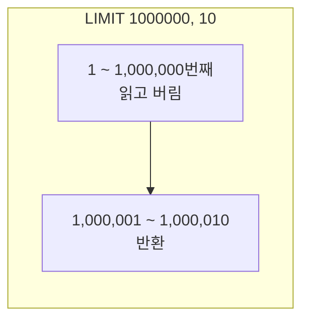
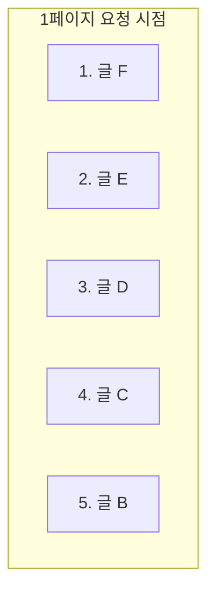
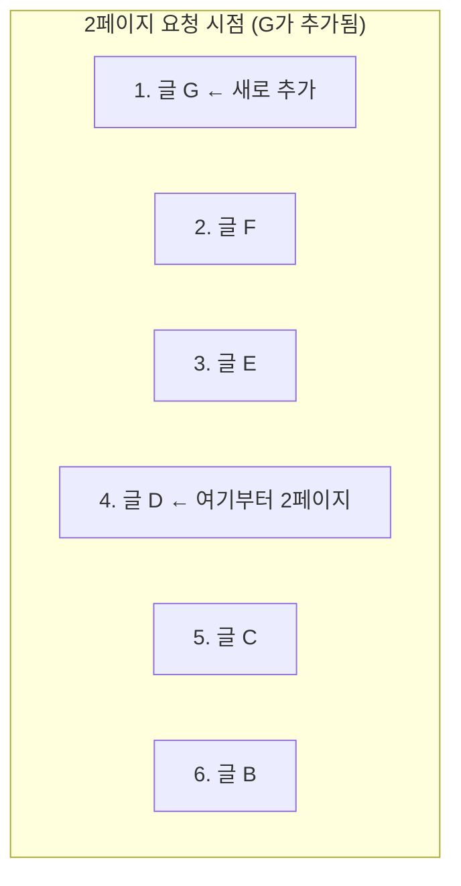
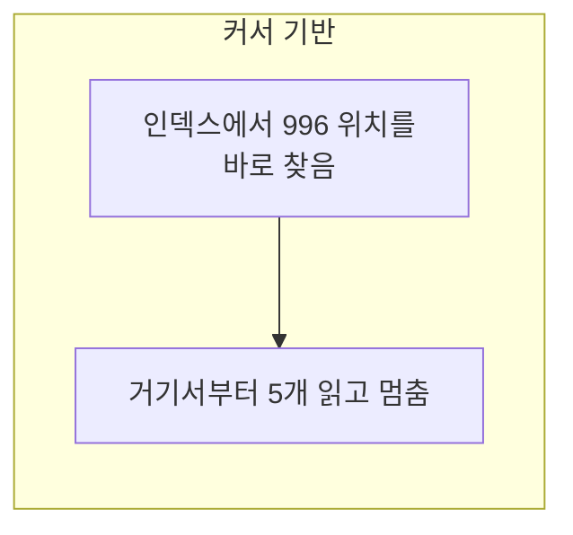

---

title: "오프셋 페이징이 뒤로 갈수록 느려지는 이유와 커서 기반으로 바꾼 과정"
date: 2023-05-03
categories: [Database, MySQL]
tags: [MySQL, Paging, Cursor, Offset, QueryDSL, Performance]
layout: post
toc: true
math: true
mermaid: true

---

## 참고자료

- [MySQL 8.0 - LIMIT Query Optimization](https://dev.mysql.com/doc/refman/8.0/en/limit-optimization.html)
- [MySQL 8.0 - INSERT ... ON DUPLICATE KEY UPDATE](https://dev.mysql.com/doc/refman/8.0/en/insert-on-duplicate.html)
- [MySQL 8.0 - AUTO_INCREMENT Handling in InnoDB](https://dev.mysql.com/doc/refman/8.0/en/innodb-auto-increment-handling.html)
- [MySQL 8.0 - EXPLAIN Statement](https://dev.mysql.com/doc/refman/8.0/en/explain.html)

---

## 배경

목록 API를 `LIMIT offset, size`로 만들어 두었다. 페이지가 뒤로 갈수록 느려진다는 얘기를 듣고 확인해보니 실제로 그랬다.

그런데 몇 가지가 정리가 안 됐다.

- 왜 뒤로 갈수록 느려지는가? `LIMIT 10`이면 10개만 읽는 것 아닌가?
- 성능 말고 다른 문제도 있다고 하는데, 정확히 어떤 상황에서 데이터가 중복되거나 사라지는가?
- 커서 기반은 무엇이 다른가? 정렬 기준이 유일하지 않으면 어떻게 되는가?

하나씩 확인하면서 정리했다.

---

## 1. 오프셋 페이징이 뒤로 갈수록 느려지는 이유

### 1.1 `LIMIT`이 실제로 하는 일

첫 번째 질문이다. `LIMIT 10`이면 10개만 읽을 것 같은데 그렇지 않다.

```sql
SELECT * FROM employees ORDER BY id LIMIT 1000000, 10;
```

이 쿼리는 **1,000,010건을 읽고 앞의 1,000,000건을 버린다.** 그리고 남은 10건을 돌려준다.

건너뛰는 것도 읽어야 알 수 있기 때문이다. **오프셋은 "여기서부터 시작"이라고 위치를 지정하는 것이 아니라 "앞에서부터 이만큼 버려라"라는 지시다.**



그래서 오프셋이 커질수록 버리는 양이 늘어나고 그만큼 느려진다. 페이지 크기는 그대로인데 시간만 늘어난다.

### 1.2 정렬과 그룹화가 붙으면

`ORDER BY`나 `GROUP BY`가 붙으면 상황이 더 나빠진다.

```sql
SELECT * FROM employees GROUP BY first_name LIMIT 0, 10;
```

**`LIMIT`은 마지막에 적용된다.** 그룹화를 다 끝낸 뒤에 앞의 10개를 자른다. 10개만 필요해도 전체를 그룹화해야 한다.

```sql
SELECT * FROM employees ORDER BY first_name LIMIT 0, 10;
```

정렬도 마찬가지다. 정렬을 끝내야 어느 것이 앞의 10개인지 알 수 있다.

**다만 정렬 컬럼에 인덱스가 있으면 다르다.** 인덱스가 이미 정렬되어 있으므로 앞에서부터 10개만 읽고 멈출 수 있다. 그래서 정렬 기준 컬럼에 인덱스가 있는지가 큰 차이를 만든다.

### 1.3 확인하는 법

`EXPLAIN`으로 확인한다.

```sql
EXPLAIN SELECT * FROM posts ORDER BY id DESC LIMIT 1000000, 10;
```

`Extra` 컬럼에 `Using filesort`가 있으면 인덱스 정렬을 못 쓰고 별도로 정렬한 것이다. 오프셋이 큰 상황에서 이게 나오면 확실히 느리다.

---

## 2. 데이터가 중복되거나 사라지는 상황

두 번째 질문이다. 처음 이 글을 쓸 때는 시나리오를 정확히 이해하지 못해서 넘겼는데, 정리하고 나니 명확했다.

### 2.1 중복되는 경우

최신순 목록에서 1페이지를 본 뒤, 2페이지를 요청하기 전에 **새 글이 하나 등록**되면 이렇게 된다.



1페이지에서 `F, E, D`를 받았다고 하자. 여기서 새 글 `G`가 등록된다.



2페이지는 `LIMIT 3, 3`이므로 4~6번째, 즉 `D, C, B`를 준다.

**`D`가 1페이지에도 나왔고 2페이지에도 나온다.** 새 글이 앞에 끼면서 전체가 한 칸씩 밀렸기 때문이다.

### 2.2 사라지는 경우

반대로 **글이 삭제되면** 데이터가 건너뛰어진다.

1페이지에서 `F, E, D`를 받은 뒤 `E`가 삭제되면 목록은 `F, D, C, B, A`가 된다. 2페이지는 4~6번째인 `B, A`를 준다.

**`C`가 어느 페이지에도 안 나온다.** 앞의 글이 사라지면서 전체가 한 칸씩 당겨졌기 때문이다.

### 2.3 왜 이런 일이 생기는가

**오프셋이 "몇 번째"라는 상대적 위치를 가리키기 때문이다.** 그 위치가 무엇을 가리키는지는 그 시점의 전체 목록에 달려 있고, 목록이 바뀌면 같은 숫자가 다른 것을 가리킨다.

무한 스크롤처럼 사용자가 계속 아래로 내려가는 화면에서 이 문제가 두드러진다. 같은 글이 두 번 보이거나 어떤 글이 아예 안 보인다.

---

## 3. 커서 기반 페이징

### 3.1 기본 발상

**"몇 번째"가 아니라 "무엇 다음"으로 요청한다.**

클라이언트가 마지막으로 받은 항목의 식별자를 다음 요청에 실어 보내고, 서버는 그것보다 뒤에 있는 것을 준다.

```sql
-- 첫 페이지
SELECT id, title FROM products ORDER BY id DESC LIMIT 5;
-- 결과의 마지막 id가 996이었다고 하자

-- 다음 페이지
SELECT id, title FROM products WHERE id < 996 ORDER BY id DESC LIMIT 5;
```

두 번째 쿼리는 **인덱스에서 996을 찾아간 뒤 거기서부터 5개를 읽고 멈춘다.** 앞의 것들을 읽고 버리지 않는다.



**오프셋이 아무리 뒤로 가도 읽는 양이 일정하다.** 이게 성능 차이의 이유다.

그리고 2장의 문제도 사라진다. `id < 996`은 새 글이 추가되든 삭제되든 항상 같은 것을 가리킨다. **절대적인 기준이기 때문이다.**

### 3.2 정렬 기준이 유일하지 않으면

세 번째 질문이다. 여기가 커서 페이징의 진짜 어려운 부분이다.

생성일시로 정렬한다고 하자.

```sql
SELECT * FROM posts WHERE created_at < '2023-05-03 10:00:00' ORDER BY created_at DESC LIMIT 5;
```

**같은 시각에 만들어진 글이 여러 개면 문제가 생긴다.** 경계에 걸친 글들이 누락되거나 중복된다.

`created_at`이 같은 글이 3개인데 그중 1개까지만 페이지에 들어갔다면, 다음 요청에서 `created_at < 그 시각`으로 조회하므로 **나머지 2개가 건너뛰어진다.**

해결은 **유일한 값을 보조 기준으로 함께 쓰는 것**이다.

```sql
SELECT * FROM posts
WHERE (created_at < '2023-05-03 10:00:00')
   OR (created_at = '2023-05-03 10:00:00' AND id < 1234)
ORDER BY created_at DESC, id DESC
LIMIT 5;
```

읽는 법은 이렇다. **시각이 더 이른 것은 전부 포함하고, 시각이 같으면 id가 작은 것만 포함한다.**

MySQL은 튜플 비교를 지원하므로 더 짧게 쓸 수도 있다.

```sql
SELECT * FROM posts
WHERE (created_at, id) < ('2023-05-03 10:00:00', 1234)
ORDER BY created_at DESC, id DESC
LIMIT 5;
```

**그리고 인덱스도 그 순서로 만들어야 한다.**

```sql
ALTER TABLE posts ADD INDEX idx_posts_created_id (created_at, id);
```

인덱스 순서가 정렬 순서와 맞지 않으면 별도 정렬이 발생해서 커서 페이징의 이점이 사라진다.

### 3.3 QueryDSL로

```java
@Override
public List<Post> findByCursor(Long cursorId, LocalDateTime cursorCreatedAt, int size) {
    QPost post = QPost.post;

    return queryFactory
            .selectFrom(post)
            .join(post.user).fetchJoin()
            .where(cursorCondition(post, cursorId, cursorCreatedAt))
            .orderBy(post.createdAt.desc(), post.id.desc())
            .limit(size)
            .fetch();
}

private BooleanExpression cursorCondition(QPost post, Long cursorId, LocalDateTime cursorCreatedAt) {
    if (cursorId == null || cursorCreatedAt == null) {
        return null;   // 첫 페이지는 조건 없음
    }
    return post.createdAt.lt(cursorCreatedAt)
            .or(post.createdAt.eq(cursorCreatedAt).and(post.id.lt(cursorId)));
}
```

**`null`을 반환하면 QueryDSL이 그 조건을 무시한다.** 첫 페이지를 별도 메서드로 만들지 않아도 되는 이유다.

반환 타입도 짚어둔다. 커서 페이징에서는 `Page`를 쓰기 어렵다.

`Page`는 전체 개수와 전체 페이지 수를 담는데, **전체 개수를 세려면 `COUNT` 쿼리가 따로 나가고 그 쿼리는 결국 전체를 훑는다.** 오프셋을 없앤 이득이 사라진다.

그래서 커서 페이징은 보통 이런 응답을 쓴다.

```java
public record CursorPage<T>(
        List<T> content,
        Long nextCursorId,
        LocalDateTime nextCursorCreatedAt,
        boolean hasNext
) { }
```

`hasNext`는 **요청한 크기보다 하나 더 조회해서** 판단한다.

```java
List<Post> rows = repository.findByCursor(cursorId, cursorCreatedAt, size + 1);
boolean hasNext = rows.size() > size;
List<Post> content = hasNext ? rows.subList(0, size) : rows;
```

---

## 4. 무엇을 쓸 것인가

둘 다 쓸 자리가 있다.

| | 오프셋 기반 | 커서 기반 |
|---|---|---|
| 뒤 페이지 성능 | 나빠진다 | 일정하다 |
| 중복과 누락 | 발생한다 | 발생하지 않는다 |
| 특정 페이지로 점프 | 가능 | **불가** |
| 전체 페이지 수 표시 | 가능 | 어렵다 |
| 정렬 기준 변경 | 자유롭다 | 인덱스 설계가 따라와야 한다 |
| 구현 난이도 | 낮다 | 중간 |

**커서 기반이 못 하는 것이 명확하다.** "5페이지로 이동"이 안 된다. 앞의 커서를 모르기 때문이다.

그래서 기준을 이렇게 잡았다.

**무한 스크롤이나 더보기 버튼이면 커서 기반.** 사용자가 순차적으로만 내려가므로 페이지 점프가 필요 없고, 중복과 누락이 바로 눈에 띈다.

**페이지 번호가 보이는 목록이면 오프셋 기반.** 관리자 화면처럼 특정 페이지로 바로 가는 요구가 있고, 데이터 양이 크지 않으면 오프셋의 단점이 문제 되지 않는다.

**데이터가 많은데 페이지 번호도 필요하면** 뒤 페이지 접근을 제한하는 방법도 있다. 검색 결과를 100페이지까지만 보여주는 서비스들이 이 방식이다.

---

## 5. 함께 정리한 것들

이 문제를 보면서 함께 확인한 것들이다.

### 5.1 `ON DUPLICATE KEY UPDATE`

INSERT 하려는 값이 유니크 제약에 걸리면 대신 UPDATE를 수행한다.

```sql
INSERT INTO stats (post_id, view_count) VALUES (1, 1)
ON DUPLICATE KEY UPDATE view_count = view_count + 1;
```

조회수처럼 "있으면 증가, 없으면 생성"인 경우에 쓴다. 조회 후 분기하는 것보다 한 번에 처리되고, **읽고 판단하고 쓰는 사이의 경쟁 상태도 없다.**

JPA에서는 영속성 컨텍스트와 변경 감지가 있어서 이 구문을 직접 쓸 일이 적다. 다만 **JPA도 조회를 먼저 하므로 동시 요청에서는 둘 다 "없다"고 판단할 수 있다.** 이런 경우에는 네이티브 쿼리로 이 구문을 쓰는 편이 안전하다.

### 5.2 `AUTO_INCREMENT`

정리하면서 헷갈렸던 것 하나를 확인했다. **롤백해도 값이 되돌아가지 않는다.**

트랜잭션이 롤백돼도 이미 발급된 번호는 재사용되지 않는다. 그래서 ID에 구멍이 생긴다.

이유는 **트랜잭션과 무관하게 관리되기 때문**이다. 되돌린다면 그 번호를 기다리는 다른 트랜잭션을 막아야 하고, 그러면 동시 삽입이 직렬화된다.

저장 엔진마다 관리 방식이 다르다는 점도 확인했다. MyISAM은 별도 파일에, InnoDB는 테이블 메타데이터에 보관한다. MySQL 8.0부터 InnoDB의 다음 값이 재시작 후에도 유지되는데, 그 이전 버전에서는 재시작 시 현재 최댓값 + 1로 다시 계산됐다.

**그래서 ID가 연속적일 것이라고 가정하면 안 된다.** 커서 페이징에서 `id BETWEEN`으로 범위를 잡으면 구멍만큼 적게 나온다. 커서는 항상 부등호 비교로 쓴다.

### 5.3 `EXPLAIN`

실행 계획을 보는 명령이다. 옵티마이저가 어떤 순서로 테이블에 접근하고 어떤 인덱스를 쓸지 알려준다.

```sql
EXPLAIN SELECT ... ;
EXPLAIN ANALYZE SELECT ... ;   -- 실제로 실행해서 걸린 시간까지
```

읽는 법은 [인덱스 글](/posts/DB-Index/)에 정리해두었다.

---

## 정리하며

처음 던진 질문들에 대한 답이다.

**왜 뒤로 갈수록 느려지는가.** 오프셋은 "여기서 시작"이 아니라 "앞에서부터 이만큼 버려라"이기 때문이다. 버리는 것도 읽어야 하므로 오프셋만큼 읽는 양이 늘어난다.

**어떤 상황에서 중복되거나 사라지는가.** 페이지를 넘기는 사이에 앞쪽 데이터가 추가되면 전체가 밀려서 같은 항목이 두 번 나오고, 삭제되면 당겨져서 어떤 항목이 건너뛰어진다. 오프셋이 상대적 위치이기 때문이다.

**커서 기반은 무엇이 다른가.** "몇 번째"가 아니라 "무엇 다음"으로 요청한다. 절대적인 기준이라 목록이 바뀌어도 같은 것을 가리키고, 인덱스에서 시작점을 바로 찾으므로 읽는 양이 일정하다.

**정렬 기준이 유일하지 않으면.** 유일한 값을 보조 기준으로 함께 써야 한다. 그러지 않으면 경계에 걸친 항목들이 누락된다. 그리고 인덱스도 그 정렬 순서와 맞춰야 이점이 유지된다.

처음에 커서 페이징을 "거창한 것"으로 생각했는데 정리하고 나니 발상 자체는 단순했다. **어려운 부분은 커서 자체가 아니라 정렬 기준을 유일하게 만드는 것과 그에 맞는 인덱스를 설계하는 쪽**이었다.
