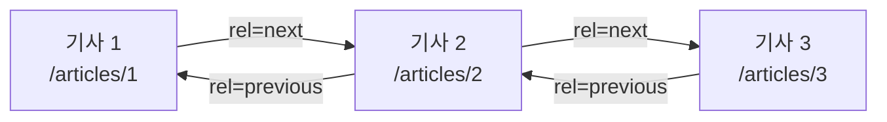

---

title: "그런 REST API로 괜찮은가, 그리고 URI 설계"
date: 2023-05-23
categories: [Web, API]
tags: [REST, HTTP, URI, APIDesign, HATEOAS]
layout: post
toc: true
math: true
mermaid: true

---

## 참고자료

- [Roy Fielding 박사논문 5장 - Representational State Transfer](https://ics.uci.edu/~fielding/pubs/dissertation/rest_arch_style.htm)
- [Roy Fielding - REST APIs must be hypertext-driven](https://roy.gbiv.com/untangled/2008/rest-apis-must-be-hypertext-driven)
- [RFC 9110 - HTTP Semantics](https://www.rfc-editor.org/rfc/rfc9110.html)
- [RFC 8288 - Web Linking](https://www.rfc-editor.org/rfc/rfc8288.html)
- [RFC 7386 - JSON Merge Patch](https://www.rfc-editor.org/rfc/rfc7386.html)
- [RFC 6902 - JSON Patch](https://www.rfc-editor.org/rfc/rfc6902.html)
- [Microsoft - RESTful web API design](https://learn.microsoft.com/en-us/azure/architecture/best-practices/api-design)
- [이응준 - 그런 REST API로 괜찮은가](https://www.youtube.com/watch?v=RP_f5dMoHFc)

---

## 배경

REST API를 만든다고 하면서 실제로 한 것은 URL을 명사로 쓰고 HTTP 메서드를 나눈 것이 전부였다.

그런데 REST를 만든 사람이 "그건 REST가 아니다"라고 못 박은 글을 읽고 나서 뭔가 크게 빠뜨렸다는 것을 알았다.

정리하면서 확인하고 싶었던 것들이다.

- REST의 제약조건 중에 우리가 안 지키고 있는 것은 무엇인가?
- 그걸 안 지키면 실제로 무엇을 잃는가?
- 안 지키면서 REST API라고 불러도 되는가?
- PATCH로 필드를 지우려면 어떻게 보내야 하는가?

---

## 1. REST가 무엇인가

REST는 아키텍처 스타일이다. 아키텍처 스타일이란 **제약조건의 집합**이다.

Roy Fielding이 자기 박사논문에서 웹이 어떤 제약을 지켜서 그만큼 커질 수 있었는지를 정리한 것이 REST다. 그러니까 REST는 "잘 만드는 법"이 아니라 **"웹이 이미 지키고 있는 것들"의 이름**이다.

제약조건은 여섯 개다.

| 제약조건 | 내용 |
|---|---|
| client-server | 클라이언트와 서버가 분리되어 있다 |
| stateless | 서버가 클라이언트 상태를 들고 있지 않는다 |
| cache | 응답을 캐시할 수 있어야 한다 |
| layered system | 중간 계층을 둘 수 있다 |
| code-on-demand | 서버가 실행 코드를 내려줄 수 있다 (선택 사항) |
| uniform interface | 인터페이스가 일관돼야 한다 |

**HTTP로 API를 만들면 위에서 다섯 개는 대체로 자동으로 지켜진다.** 문제는 마지막 하나다.

---

## 2. Uniform Interface란?

이 제약조건 하나가 다시 네 개로 나뉜다.

| 하위 제약 | 내용 | 보통 지키는가 |
|---|---|---|
| 리소스 식별 | 리소스를 URI로 식별한다 | 지킨다 |
| 표현을 통한 조작 | 표현(HTTP 메서드 + 본문)으로 리소스를 다룬다 | 지킨다 |
| 자기 서술적 메시지 | 메시지가 스스로를 설명한다 | 안 지킨다 |
| HATEOAS | 애플리케이션 상태 전이가 하이퍼링크로 이뤄진다 | 안 지킨다 |

첫 질문의 답이 여기 있다. **안 지키는 것은 뒤의 두 개다.**

### 2.1 자기 서술적 메시지

메시지만 보고 그 메시지를 해석할 수 있어야 한다는 뜻이다.

요청 쪽부터 본다.

```text
GET / HTTP/1.1
```

이 메시지는 자기 서술적이지 않다. **어디로 가는 요청인지 알 수 없기 때문이다.**

```text
GET / HTTP/1.1
Host: www.example.org
```

`Host` 헤더가 붙으니 목적지가 드러난다. 이제 메시지 하나만 봐도 해석된다.

응답 쪽도 같다.

```text
HTTP/1.1 200 OK

[ {"op": "remove", "path": "/a/b/c"} ]
```

이 응답은 자기 서술적이지 않다. **본문이 어떤 문법으로 쓰였는지 모른다.**

```text
HTTP/1.1 200 OK
Content-Type: application/json

[ {"op": "remove", "path": "/a/b/c"} ]
```

`Content-Type`이 붙어서 JSON이라는 것은 알게 됐다. **그런데 여전히 부족하다.**

`op`와 `path`가 무슨 뜻인지 이 메시지만 봐서는 모른다. 이걸 알려면 별도 명세를 찾아봐야 하고, 그 순간 메시지는 스스로를 설명하지 못한 것이 된다.

**여기서 자기 서술적 메시지의 기준이 얼마나 높은지 드러난다.** `Content-Type: application/json`은 "이건 JSON이다"까지만 말해준다. 그 JSON 안의 필드가 무슨 의미인지는 말해주지 않는다.

### 2.2 HATEOAS

애플리케이션의 상태 전이가 **하이퍼링크로** 이뤄져야 한다는 뜻이다.



클라이언트가 `/articles/2`를 받으면 **그 응답 안에 다음에 갈 수 있는 곳이 링크로 들어 있다.** 클라이언트가 URL 규칙을 미리 알고 조립하는 것이 아니라, 서버가 준 링크를 따라간다.

```text
HTTP/1.1 200 OK
Content-Type: application/json
Link: </articles/1>; rel="previous",
      </articles/3>; rel="next"

{
    "title": "두 번째 기사",
    "content": "두 번째 기사의 내용"
}
```

`Link` 헤더는 RFC 8288에 표준으로 정의돼 있다. 응답 본문 형식을 바꾸지 않고도 링크를 얹을 수 있는 방법이다.

**웹 브라우저가 하는 일이 정확히 이것이다.** 사용자는 URL 규칙을 외우지 않는다. 화면에 나온 링크를 클릭할 뿐이다. 사이트가 URL 구조를 바꿔도 사용자는 아무것도 안 고쳐도 된다.

---

## 3. 안 지키면 무엇을 잃는가

두 번째 질문이다. 한 문장으로 답하면 **클라이언트와 서버가 독립적으로 진화할 능력**을 잃는다.

### 3.1 자기 서술적 메시지가 지켜주는 것

**메시지 형식이 바뀌어도 상대가 해석할 수 있다.**

메시지가 스스로를 설명하면 받는 쪽은 "이 메시지가 어떻게 생겼는지" 미리 알고 있을 필요가 없다. 서버가 응답 형식을 바꿔도 클라이언트는 메시지에 적힌 대로 해석하면 된다.

반대로 자기 서술적이지 않으면 **클라이언트 코드 안에 서버의 응답 구조가 박힌다.** 서버가 필드 하나를 바꾸면 클라이언트를 함께 배포해야 한다.

### 3.2 HATEOAS가 지켜주는 것

**전이할 곳을 실행 시점에 정할 수 있다.**

클라이언트가 URL을 조립하면 그 규칙이 클라이언트 코드에 박힌다. 서버가 `/articles/2`를 `/posts/2`로 바꾸는 순간 클라이언트가 깨진다.

링크를 따라가게 하면 **서버가 링크를 바꾸는 것만으로 경로가 바뀐다.** 클라이언트는 배포할 필요가 없다.

### 3.3 그럼 언제 필요한가

여기가 핵심이다. **클라이언트를 내가 통제할 수 있으면 이 능력이 필요 없다.**

사내 시스템이라 서버와 클라이언트를 같이 배포한다면, 서버를 바꿀 때 클라이언트도 같이 바꾸면 그만이다. 독립적으로 진화할 이유가 없다.

반대로 **누가 쓰는지 모르는 공개 API**라면 이야기가 다르다. 필드 하나를 바꿨는데 어디선가 서비스가 멈춘다.

REST가 웹의 제약조건에서 나온 이유가 여기 있다. 웹은 **서버가 브라우저를 통제할 수 없는 환경**이다.

---

## 4. 그래서 REST API라고 불러도 되는가

세 번째 질문이다.

REST를 만든 사람의 답은 분명하다. **하이퍼텍스트로 구동되지 않으면 REST API가 아니다.** 2008년 글에서 직접 못을 박았다.

그러니 선택지는 셋이다.

1. REST API를 제대로 구현하고 REST API라고 부른다
2. 구현을 포기하고 HTTP API라고 부른다
3. REST API가 아닌데 REST API라고 부른다

**현실은 대부분 3번이다.** 그리고 이걸 두고 시적 허용이라고 부르기도 한다.

개인적으로는 이렇게 정리했다. **용어는 이미 굳었으니 REST API라고 불러도 소통에 문제가 없다.** 다만 "우리 API는 REST를 지킨다"고 말할 때, 무엇을 지키고 무엇을 안 지키는지는 알고 있어야 한다.

---

## 5. 그래도 지키려면

### 5.1 자기 서술적 메시지, 방법 1

미디어 타입을 직접 정의한다. 문서를 만들고, 각 필드의 의미를 정의하고, IANA에 등록한다.

```text
Content-Type: application/vnd.example.todo+json
```

**정석이지만 번거롭다.** API 하나 만들자고 미디어 타입을 등록하는 일은 잘 일어나지 않는다.

### 5.2 자기 서술적 메시지, 방법 2

프로파일 링크를 붙인다.

```text
GET /todos HTTP/1.1
Host: example.org

HTTP/1.1 200 OK
Content-Type: application/json
Link: <https://example.org/docs/todos>; rel="profile"

[
    {"id": 1, "title": "Meow"},
    {"id": 2, "title": "Boom"}
]
```

각 필드의 의미를 적어둔 문서를 `rel="profile"`로 가리킨다. 미디어 타입 등록보다 훨씬 가볍다.

**대신 콘텐츠 협상을 할 수 없다.** 미디어 타입은 `Accept` 헤더로 골라 받을 수 있지만, 프로파일은 `Content-Type`이 아니라 별도 헤더라서 협상 대상이 아니다.

### 5.3 HATEOAS, 방법 1

각 항목에 링크를 넣는다.

```text
HTTP/1.1 200 OK
Content-Type: application/json
Link: <https://example.org/docs/todos>; rel="profile"

[
    {"link": "https://example.org/todos/1", "id": 1, "title": "Meow"},
    {"link": "https://example.org/todos/2", "id": 2, "title": "Boom"}
]
```

본문 안에 링크를 넣는 방식이다. 구현이 쉽지만 **응답 형식을 바꿔야 한다.**

### 5.4 HATEOAS, 방법 2

`Link` 헤더를 쓴다. 응답 본문은 그대로 두고 헤더에만 링크를 얹는다.

```text
HTTP/1.1 201 Created
Location: /todos/1
Link: </todos>; rel="collection"
```

생성 응답에서 새 리소스의 위치를 `Location`으로, 그것이 속한 컬렉션을 `Link`로 알려준다.

**본문을 건드리지 않아도 되는 것이 장점**이라 기존 API에 얹기 좋다.

---

## 6. URI와 메서드 설계

여기부터는 REST 여부와 별개로, HTTP를 제대로 쓰는 이야기다.

### 6.1 리소스 중심으로 URI를 짓는다

동작이 아니라 **대상**을 URI로 표현한다.

| 나쁨 | 좋음 |
|---|---|
| `/getCustomer?id=1` | `GET /customers/1` |
| `/createOrder` | `POST /orders` |
| `/deleteCustomer/1` | `DELETE /customers/1` |

동작은 메서드가 표현한다. URI에 동사를 넣으면 메서드가 하는 일을 URI가 중복해서 말하게 된다.

### 6.2 메서드별 의미

| 메서드 | 하는 일 | 안전한가 | 멱등한가 |
|---|---|---|---|
| GET | 리소스를 가져온다 | 그렇다 | 그렇다 |
| POST | 리소스를 만든다. 그 외 처리에도 쓴다 | 아니다 | 아니다 |
| PUT | 리소스를 통째로 바꾸거나 만든다 | 아니다 | 그렇다 |
| PATCH | 리소스를 부분적으로 고친다 | 아니다 | 설계하기 나름 |
| DELETE | 리소스를 지운다 | 아니다 | 그렇다 |

**안전하다(safe)는 것은 서버 상태를 바꾸지 않는다는 뜻**이고, **멱등하다(idempotent)는 것은 같은 요청을 여러 번 보내도 결과가 한 번 보낸 것과 같다는 뜻**이다.

RFC 9110이 정의하는 내용이다. 이 성질이 실제로 왜 중요한지 짚어둔다.

**네트워크는 응답을 잃어버린다.** 요청은 도착했는데 응답이 오다가 끊기면 클라이언트는 성공했는지 모른다. 이때 재시도해도 되는지가 멱등성으로 갈린다.

`PUT /customers/1`은 몇 번을 보내도 그 고객이 같은 값이 된다. 안심하고 재시도한다.

`POST /orders`는 보낼 때마다 주문이 하나씩 생긴다. 재시도하면 중복 주문이 생긴다.

**PATCH의 멱등성은 본문에 달렸다.** `{"color": "green"}`처럼 값을 지정하면 여러 번 보내도 결과가 같으니 멱등하다. 반면 `{"op": "increment", "path": "/count"}` 같은 형태면 보낼 때마다 값이 늘어난다. RFC가 PATCH를 멱등하지 않다고 규정한 것은 **이런 본문도 가능하기 때문**이지, PATCH가 항상 비멱등이라는 뜻은 아니다.

### 6.3 리소스별 메서드 조합

| 리소스 | POST | GET | PUT | DELETE |
|---|---|---|---|---|
| `/customers` | 고객 생성 | 고객 목록 조회 | 고객 일괄 수정 | 전체 삭제 |
| `/customers/1` | 보통 미지원 | 고객 1 조회 | 고객 1 수정 또는 생성 | 고객 1 삭제 |
| `/customers/1/orders` | 고객 1의 주문 생성 | 고객 1의 주문 목록 | 주문 일괄 수정 | 주문 전체 삭제 |

**컬렉션에 대한 PUT과 DELETE는 표에 있지만 실제로 열어두는 경우는 드물다.** `DELETE /customers` 한 번에 전체 고객이 지워지는 API를 만들 이유가 없다. 표는 문법적으로 가능한 조합을 보여주는 것이지 전부 구현하라는 뜻이 아니다.

### 6.4 상태 코드

**GET**

| 상황 | 코드 |
|---|---|
| 조회 성공 | 200 |
| 리소스가 없음 | 404 |
| 본문 없이 성공 | 204 |

여기서 자주 틀리는 것이 있다. **목록 조회에서 결과가 0건이면 404나 204가 아니라 200에 빈 배열이다.**

`/customers?name=없는이름`이 404를 주면 클라이언트는 "그 검색 엔드포인트 자체가 없다"와 구분할 수 없다. **컬렉션은 존재하고, 그 안이 비어 있을 뿐이다.**

404를 쓰는 것은 `/customers/999`처럼 **특정 리소스 하나를 지목했는데 없을 때**다.

**POST**

| 상황 | 코드 |
|---|---|
| 리소스 생성 성공 | 201 + `Location` 헤더 |
| 생성이 아닌 처리 성공 | 200 + 본문 |
| 요청 데이터가 잘못됨 | 400 |

201을 줄 때 **생성된 리소스의 URI를 `Location` 헤더에 담는다.** 이것도 HATEOAS의 일종이다. 클라이언트가 URL을 조립하지 않고 서버가 알려준 곳으로 간다.

**PUT**

| 상황 | 코드 |
|---|---|
| 새로 만들었음 | 201 |
| 기존 것을 고쳤음 | 200 또는 204 |
| 다른 변경과 충돌 | 409 |

409는 **충돌이 있을 때만** 쓴다. 검증 실패는 400이나 422다. 두 상황을 409로 뭉치면 클라이언트가 재시도 여부를 판단할 수 없다.

**DELETE**

| 상황 | 코드 |
|---|---|
| 삭제 성공 | 204 |
| 대상이 없음 | 404 |

**멱등성을 생각하면 404가 애매해진다.** 같은 DELETE를 두 번 보내면 두 번째는 대상이 없으니 404다. 결과 상태는 같은데(그 리소스가 없다) 응답 코드가 다르다.

그래서 **두 번째 이후도 204를 주는 설계**를 택하기도 한다. "지워달라"는 요청의 목표가 "없는 상태"라면, 이미 없으면 목표는 달성된 것이다. 어느 쪽이든 문서에 명시하면 된다.

### 6.5 PATCH로 필드를 지우려면

네 번째 질문이다. 여기서 흔히 틀린다.

기존 리소스가 이렇다고 하자.

```json
{
    "name": "diger",
    "category": "widget",
    "color": "blue",
    "price": 1000
}
```

`color`와 `price`를 바꾸고 싶으면 이렇게 보낸다.

```json
{
    "color": "green",
    "price": 10000
}
```

여기까지는 맞다. **문제는 `name`과 `category`를 지우고 싶을 때다.**

위처럼 보내면 `name`과 `category`는 **지워지지 않고 그대로 남는다.** JSON Merge Patch에서 언급하지 않은 필드는 "건드리지 마라"는 뜻이기 때문이다.

지우려면 **명시적으로 `null`을 보내야 한다.**

```json
{
    "name": null,
    "category": null,
    "color": "green",
    "price": 10000
}
```

RFC 7386이 정한 규칙이다. `null`은 "이 필드를 제거하라"는 신호로 해석된다.

**여기서 따라오는 제약이 하나 있다.** 값 자체를 `null`로 설정하는 것과 필드를 제거하는 것을 구분할 수 없다. `price`를 `null`로 두고 싶어도 merge patch에서는 제거가 된다.

이 구분이 필요하면 JSON Patch(RFC 6902)를 쓴다.

```json
[
    { "op": "remove", "path": "/name" },
    { "op": "replace", "path": "/color", "value": "green" }
]
```

동작을 명시적으로 나열하는 방식이다. 앞에서 자기 서술적 메시지 예시로 나왔던 `{"op": "remove", "path": "..."}`가 바로 이것이다.

| 형식 | Content-Type | 특징 |
|---|---|---|
| JSON Merge Patch | `application/merge-patch+json` | 쓰기 쉽다. null로 제거. null 값 설정 불가 |
| JSON Patch | `application/json-patch+json` | 동작이 명시적. 배열 조작 가능. 장황하다 |

**둘 중 무엇을 쓰는지 `Content-Type`으로 알려야 한다.** `application/json`만 보내면 서버가 어떤 규칙으로 해석할지 알 수 없다. 이게 자기 서술적 메시지 이야기와 그대로 이어진다.

### 6.6 경로 변수와 쿼리 파라미터

```text
GET /orders/1?limit=25&offset=50
```

문법적으로는 이렇게도 쓸 수 있다.

```text
GET /orders?id=1&limit=25&offset=50
```

**하지만 앞쪽이 맞다.**

경로는 **무엇을 가리키는지**를 나타내고, 쿼리는 **그것을 어떻게 걸러낼지**를 나타낸다.

`/orders/1`은 주문 1이라는 리소스를 가리킨다. 이 리소스는 그 자체로 존재하고, 고유한 주소를 갖는다. 캐시도 이 주소를 기준으로 동작한다.

`?limit=25&offset=50`은 그 리소스를 어떻게 잘라서 볼지에 대한 부가 정보다.

**식별자를 쿼리로 넘기면 리소스에 고유 주소가 없어진다.** `?id=1&limit=25`와 `?limit=25&id=1`은 같은 것을 가리키지만 캐시에는 서로 다른 키로 잡힌다.

---

## 정리하며

처음 던진 질문들에 대한 답이다.

**안 지키고 있는 제약조건은 무엇인가.** Uniform Interface의 네 항목 중 자기 서술적 메시지와 HATEOAS다. 리소스를 URI로 식별하고 메서드로 행위를 나누는 것은 대부분 지키고 있다.

**안 지키면 무엇을 잃는가.** 클라이언트와 서버가 독립적으로 진화할 능력이다. 서버 응답 구조가 클라이언트 코드에 박히고, URL 조립 규칙도 마찬가지다. 서버를 바꾸면 클라이언트를 함께 배포해야 한다.

**REST API라고 불러도 되는가.** 만든 사람 기준으로는 아니다. 다만 용어가 이미 굳었으니 소통에는 문제가 없다. 중요한 것은 무엇을 안 지키고 있는지 아는 것이다. 그리고 클라이언트를 내가 통제할 수 있는 환경이라면 애초에 필요 없는 능력이기도 하다.

**PATCH로 필드를 지우려면.** JSON Merge Patch에서는 해당 필드에 `null`을 명시해야 한다. 빼고 보내면 지워지지 않고 그대로 남는다. 값을 `null`로 두는 것과 제거를 구분해야 하면 JSON Patch를 쓴다.

정리하고 나서 남은 감각은 **REST가 API 설계 규칙이 아니라 웹의 설명이었다**는 것이다. 웹처럼 아무나 붙는 환경이면 지킬 값어치가 있고, 클라이언트를 내가 다 아는 환경이면 대부분 과하다. 그 판단을 하려면 무엇을 위한 제약인지부터 알아야 했다.
