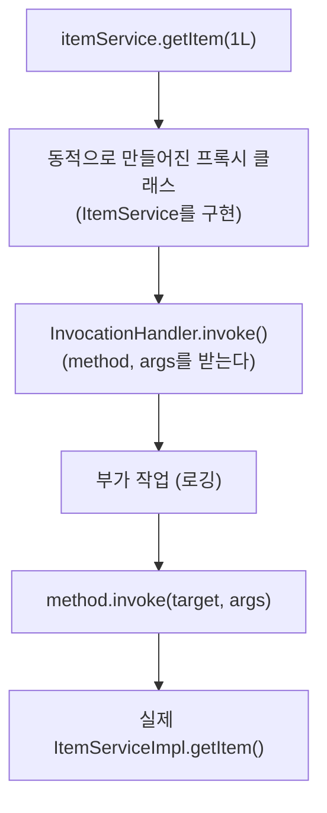
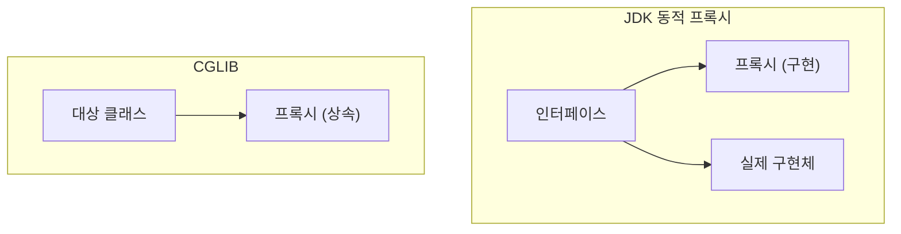
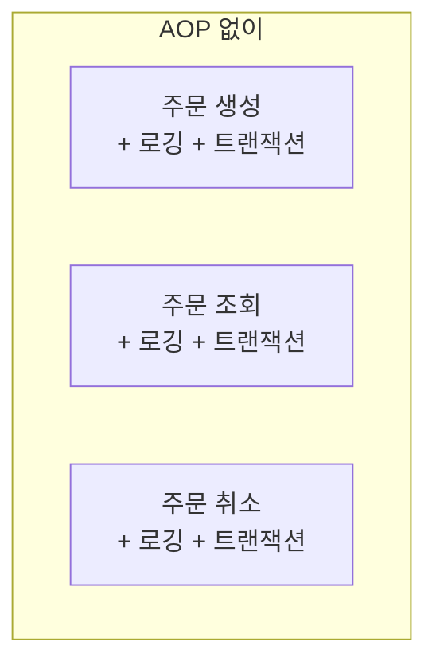
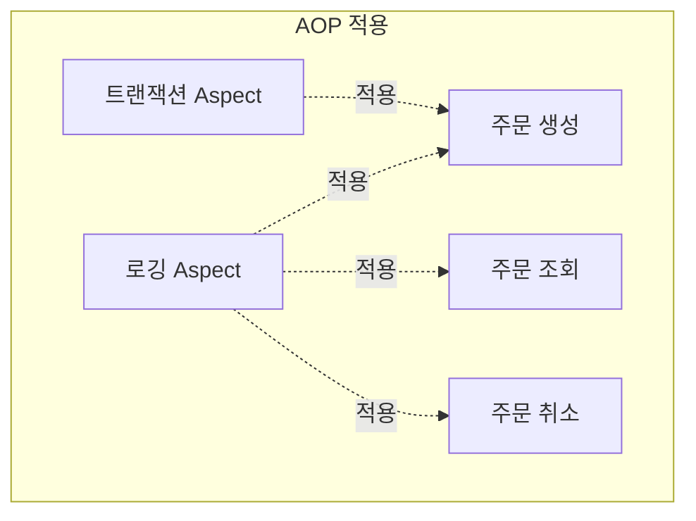
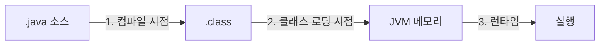
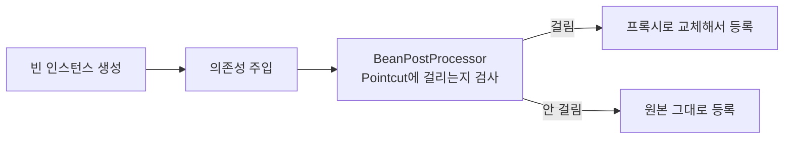
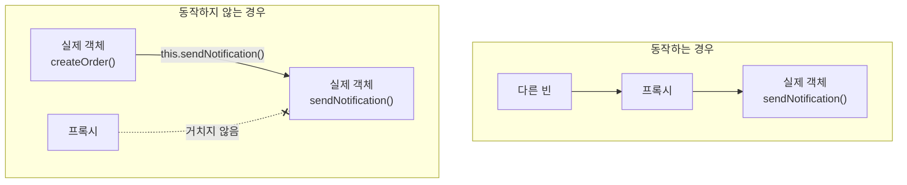
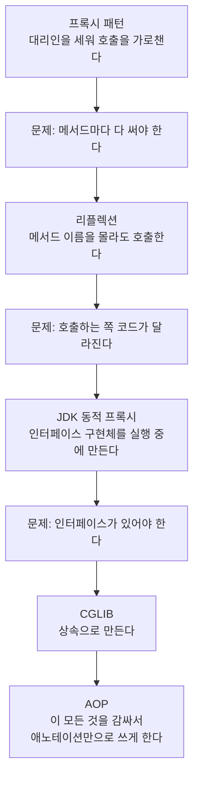

---

title: "스프링은 왜 프록시를 쓰는가 (리플렉션, JDK 동적 프록시, CGLIB, AOP)"
date: 2023-08-15
categories: [Java, Spring]
tags: [Reflection, DynamicProxy, CGLIB, AOP, Proxy, Spring]
layout: post
toc: true
math: true
mermaid: true

---

## 참고자료

- [java.lang.reflect.Proxy Javadoc](https://docs.oracle.com/en/java/javase/17/docs/api/java.base/java/lang/reflect/proxy.html)
- [java.lang.reflect.InvocationHandler Javadoc](https://docs.oracle.com/en/java/javase/17/docs/api/java.base/java/lang/reflect/invocationhandler.html)
- [Spring Framework - Aspect Oriented Programming](https://docs.spring.io/spring-framework/reference/core/aop.html)
- [Spring Framework - Proxying Mechanisms](https://docs.spring.io/spring-framework/reference/core/aop/proxying.html)
- [Spring Framework - Spring AOP APIs](https://docs.spring.io/spring-framework/reference/core/aop-api.html)
- [cglib](https://github.com/cglib/cglib)
- [AspectJ Programming Guide](https://eclipse.dev/aspectj/doc/latest/progguide/index.html)

---

## 배경

`@Transactional`을 붙이면 트랜잭션이 걸리고, `@Async`를 붙이면 비동기로 돈다. 애노테이션 하나로 동작이 바뀌는 것이 계속 이상했다.

찾아보니 프록시라는 말이 나왔는데, 거기서 또 막혔다.

- 프록시가 정확히 무엇을 하는 것인가?
- 리플렉션, JDK 동적 프록시, CGLIB가 다 나오는데 각각 무슨 관계인가?
- 스프링은 왜 프록시로 AOP를 만들었는가? 다른 방법은 없었는가?
- 같은 클래스 안에서 부르면 애노테이션이 안 먹는다는데 왜인가?

아래에서 위로 쌓아 올리면서 확인했다. 프록시 패턴에서 시작해서 마지막 질문까지 간다.

---

## 1. 프록시 패턴

### 1.1 무엇인가

실제 객체 앞에 대리인을 세워서, **호출을 가로채 부가 작업을 하고 실제 객체에 넘기는** 구조다.


**호출하는 쪽은 프록시인지 실제 객체인지 모른다.** 둘이 같은 타입이기 때문이다.

### 1.2 손으로 만들면

```kotlin
interface ItemService {
    fun getItem(itemId: Long): Item
}

// 실제 구현
class ItemServiceImpl(
    private val itemRepository: ItemRepository
) : ItemService {

    override fun getItem(itemId: Long): Item {
        return itemRepository.findById(itemId)
            ?: throw ItemNotFoundException("아이템을 찾을 수 없다: $itemId")
    }
}

// 프록시. 같은 인터페이스를 구현한다
class LoggingItemServiceProxy(
    private val target: ItemService
) : ItemService {

    private val log = LoggerFactory.getLogger(javaClass)

    override fun getItem(itemId: Long): Item {
        log.info("getItem 시작: itemId={}", itemId)
        val result = target.getItem(itemId)      // 실제 객체에 위임
        log.info("getItem 종료")
        return result
    }
}
```

컨트롤러는 `ItemService` 타입으로 받으므로 어느 쪽이 들어오든 코드가 같다.

```kotlin
@RestController
class ItemController(
    private val itemService: ItemService   // 프록시가 주입되어도 모른다
) {
    @GetMapping("/items/{itemId}")
    fun getItem(@PathVariable itemId: Long): ItemResponse {
        val item = itemService.getItem(itemId)
        return ItemResponse(item.id, item.name)
    }
}
```

**얻는 것이 두 가지다.** 실제 구현을 안 고치고 기능을 더할 수 있고, 부가 기능이 한 곳에 모인다.

### 1.3 그런데 이 방식의 한계

메서드가 열 개면 프록시에도 열 개를 다 써야 한다. 로깅 한 줄을 넣으려고 열 개의 메서드를 그대로 옮겨 적고 그 사이에 로그를 끼운다.

**서비스가 스무 개면 프록시도 스무 개**를 만들어야 한다.

여기서 자연스럽게 나오는 요구가 이것이다. **"메서드 이름을 몰라도 호출을 가로챌 수 있으면 좋겠다."** 그것을 가능하게 하는 것이 리플렉션이다.

---

## 2. 리플렉션

### 2.1 무엇인가

**실행 중에 클래스와 메서드의 정보를 읽고, 그 정보로 메서드를 호출하는** 기능이다.

보통은 컴파일 시점에 어떤 메서드를 부를지가 코드에 적혀 있다. 리플렉션은 그것을 **문자열로 지정해서 실행 시점에 정한다.**

```kotlin
val method = itemRepository.javaClass.getMethod("findById", Long::class.java)
val result = method.invoke(itemRepository, 1L)
```

`"findById"`라는 문자열로 메서드를 찾아 호출한다. 컴파일러는 이 문자열이 실제 메서드 이름인지 검사하지 않는다.

### 2.2 그래서 무엇이 가능해지는가

메서드 이름을 미리 몰라도 호출할 수 있으므로, **어떤 메서드가 오든 똑같이 처리하는 코드**를 쓸 수 있다.

```kotlin
fun invokeWithLog(target: Any, methodName: String, vararg args: Any?): Any? {
    val paramTypes = args.map { it!!.javaClass }.toTypedArray()
    val method = target.javaClass.getMethod(methodName, *paramTypes)

    println("$methodName 시작")
    val result = method.invoke(target, *args)
    println("$methodName 종료")
    return result
}
```

이 함수 하나가 어떤 메서드에 대해서든 로그를 남긴다. 1.3절의 반복이 사라진다.

### 2.3 대가

**컴파일 시점 검사가 사라진다.** 메서드 이름을 틀리면 컴파일은 되고 실행할 때 `NoSuchMethodException`이 난다. 이름을 바꾸는 리팩터링을 하면 IDE가 이 문자열은 안 고쳐준다.

**느리다.** 매번 클래스 메타정보를 조회하고 접근 검사를 한다. 직접 호출보다 오버헤드가 있다.

**접근 제어를 우회할 수 있다.** `setAccessible(true)`로 `private` 멤버에도 접근할 수 있다. 편리한 만큼 캡슐화를 깬다.

그래서 **애플리케이션 로직에서 리플렉션을 직접 쓰는 것은 권하지 않는다.** 프레임워크가 내부에서 쓰는 기술이다.

---

## 3. JDK 동적 프록시

### 3.1 무엇을 해결하는가

리플렉션으로 호출은 가로챌 수 있게 됐는데, 여전히 문제가 있다. **호출하는 쪽에서 `invokeWithLog("getItem", 1L)`처럼 불러야 한다.** 원래대로 `itemService.getItem(1L)`이라고 쓰고 싶다.

JDK 동적 프록시가 이걸 해준다. **실행 중에 인터페이스를 구현하는 클래스를 만들어준다.**

```kotlin
class LoggingHandler(
    private val target: Any          // 실제 객체를 갖고 있어야 한다
) : InvocationHandler {

    override fun invoke(proxy: Any, method: Method, args: Array<out Any>?): Any? {
        println("${method.name} 시작")
        val result = method.invoke(target, *(args ?: emptyArray()))   // target에 위임
        println("${method.name} 종료")
        return result
    }
}
```

```kotlin
val real: ItemService = ItemServiceImpl(itemRepository)

val proxy = Proxy.newProxyInstance(
    ItemService::class.java.classLoader,
    arrayOf(ItemService::class.java),
    LoggingHandler(real)
) as ItemService

proxy.getItem(1L)   // 평범한 메서드 호출처럼 쓴다
```

**여기서 처음에 틀렸던 부분을 짚어둔다.** `method.invoke()`의 첫 인자를 `proxy`로 넘기면 안 된다.

```kotlin
method.invoke(proxy, ...)    // 무한 재귀. StackOverflowError
method.invoke(target, ...)   // 올바름
```

`proxy`에 대고 호출하면 그 호출이 다시 `InvocationHandler.invoke()`로 들어온다. 그래서 핸들러가 **실제 객체에 대한 참조를 갖고 있어야 한다.**

### 3.2 어떻게 동작하는가



**클래스를 실행 중에 만든다는 점이 요점이다.** 컴파일 시점에는 존재하지 않던 클래스가 메모리에 생긴다.

인터페이스의 모든 메서드가 자동으로 구현되고, 그 구현이 전부 `InvocationHandler.invoke()`로 흘러간다. **메서드가 몇 개든 핸들러 하나면 된다.**

### 3.3 제약

**인터페이스가 있어야 한다.** `Proxy.newProxyInstance`의 인자로 인터페이스 배열을 넘기고, 만들어진 프록시는 그 인터페이스를 구현한다.

구체 클래스만 있으면 이 방식을 못 쓴다. 그 자리를 채우는 것이 CGLIB다.

---

## 4. CGLIB

### 4.1 무엇이 다른가

**상속으로 프록시를 만든다.** 대상 클래스를 상속한 하위 클래스를 실행 중에 만들고, 메서드를 재정의해서 가로챈다.



**인터페이스가 필요 없다는 것**이 가장 큰 차이다.

### 4.2 따라오는 제약

상속으로 만들기 때문에 **상속할 수 없는 것은 프록시를 못 만든다.**

| 대상 | 왜 안 되는가 |
|---|---|
| `final` 클래스 | 상속할 수 없다 |
| `final` 메서드 | 재정의할 수 없다 |
| `private` 메서드 | 하위 클래스에서 보이지 않는다 |
| `static` 메서드 | 재정의 대상이 아니다 |

**코틀린에서 이게 자주 문제가 된다.** 코틀린 클래스와 메서드는 기본이 `final`이다. 그래서 프록시를 만들려면 `open`을 붙이거나 컴파일러 플러그인을 써야 한다.

```kotlin
// 이대로면 CGLIB 프록시를 못 만든다
@Service
class ItemService { ... }

// open을 붙이거나
@Service
open class ItemService {
    open fun getItem(id: Long) { ... }
}
```

스프링 부트의 코틀린 지원에는 `kotlin-spring` 플러그인이 포함되어 있어서, 스프링 애노테이션이 붙은 클래스를 자동으로 `open`으로 만든다. 그래서 평소에는 신경 쓸 일이 없다가, **직접 만든 애노테이션에 프록시를 걸 때 이 문제를 만난다.**

### 4.3 스프링은 무엇을 쓰는가

스프링 부트 2.0부터 **기본이 CGLIB다.**

그전에는 인터페이스가 있으면 JDK 동적 프록시, 없으면 CGLIB를 썼다. 바뀐 이유가 있다.

**인터페이스에 없는 메서드를 못 부르는 문제**가 있었다. JDK 동적 프록시로 만든 프록시는 인터페이스 타입으로만 캐스팅되므로, 구체 클래스에만 있는 메서드를 부를 수 없다.

**그리고 인터페이스가 하나뿐인 구현체가 많았다.** 프록시를 위해 인터페이스를 만드는 관행이 생겼는데, 그건 인터페이스의 원래 목적이 아니다.

```java
// 예전 방식으로 되돌리려면
@EnableAspectJAutoProxy(proxyTargetClass = false)
```

```yaml
spring:
  aop:
    proxy-target-class: false   # 기본값은 true (CGLIB)
```

---

## 5. AOP

### 5.1 무엇인가

**핵심 기능과 부가 기능을 분리해서, 부가 기능을 한 곳에서 관리하는 방법**이다. Aspect Oriented Programming, 관점 지향 프로그래밍이라고 부른다.

로깅, 트랜잭션, 권한 검사 같은 것들은 여러 메서드에 흩어져 반복된다. 이런 것을 **횡단 관심사(cross-cutting concern)** 라고 하고, AOP가 다루는 대상이다.





### 5.2 용어

문서를 읽으려면 이 단어들을 알아야 한다.

| 용어 | 뜻 |
|---|---|
| **Aspect** | 부가 기능과 그것을 어디에 적용할지를 묶은 것 |
| **Advice** | 부가 기능 자체. 실제 코드 |
| **JoinPoint** | 부가 기능을 끼울 수 있는 지점. 스프링 AOP에서는 메서드 실행 시점 |
| **Pointcut** | JoinPoint 중 실제로 적용할 곳을 고르는 조건 |
| **Target** | 부가 기능이 적용되는 실제 객체 |
| **Weaving** | 부가 기능을 실제 코드에 엮어 넣는 작업 |

**Advice와 Pointcut의 관계**가 핵심이다. "무엇을 할 것인가"(Advice)와 "어디에 할 것인가"(Pointcut)를 나눠두면, 같은 부가 기능을 여러 곳에 적용하거나 적용 범위만 바꿀 수 있다.

```java
@Aspect
@Component
public class LoggingAspect {

    // Pointcut: 어디에 적용할 것인가
    @Pointcut("execution(* com.example.service..*(..))")
    public void serviceLayer() { }

    // Advice: 무엇을 할 것인가
    @Around("serviceLayer()")
    public Object logExecution(ProceedingJoinPoint joinPoint) throws Throwable {
        String name = joinPoint.getSignature().toShortString();
        long start = System.currentTimeMillis();

        try {
            return joinPoint.proceed();   // 실제 메서드 실행
        } finally {
            log.info("{} 완료, {}ms", name, System.currentTimeMillis() - start);
        }
    }
}
```

`joinPoint.proceed()`가 3.1절의 `method.invoke(target, args)`에 해당한다. **이걸 안 부르면 실제 메서드가 실행되지 않는다.**

Advice의 종류도 정리해둔다.

| 종류 | 언제 실행되는가 |
|---|---|
| `@Before` | 대상 메서드 전 |
| `@AfterReturning` | 정상 반환 후 |
| `@AfterThrowing` | 예외가 던져진 후 |
| `@After` | 성공이든 실패든 후 |
| `@Around` | 전후 모두. `proceed()`로 직접 실행 시점을 정한다 |

**`@Around`가 가장 강력하다.** 실행 여부와 인자, 반환값까지 바꿀 수 있다. 대신 `proceed()`를 빠뜨리면 대상 메서드가 아예 안 돈다.

### 5.3 언제 엮는가

세 번째 질문이다. 부가 기능을 실제 코드에 엮는 시점이 셋이다.



**컴파일 시점.** AspectJ 전용 컴파일러가 `.class`를 만들 때 부가 코드를 넣는다. 성능이 가장 좋다. 대신 별도 컴파일러가 필요하고 빌드 구성이 복잡해진다.

**클래스 로딩 시점.** 클래스가 JVM에 올라갈 때 바이트코드를 고친다. `-javaagent` 옵션으로 에이전트를 지정해야 한다. 실행 옵션을 건드려야 하는 것이 부담이다.

**런타임.** 프록시 객체를 만들어 끼운다. 별도 도구가 필요 없고 스프링 컨테이너만 있으면 된다.

**스프링은 세 번째를 골랐다.** 이유가 명확하다.

- 별도 컴파일러나 실행 옵션이 필요 없다
- 스프링이 이미 빈 생성을 관리하므로 그 시점에 프록시로 바꿔치기하기 쉽다
- 순수 자바만으로 구현된다

대가는 **적용 범위가 좁다는 것**이다. 프록시로 하는 이상 메서드 호출만 가로챌 수 있다. 필드 접근이나 생성자 호출은 못 잡는다. AspectJ는 그것까지 가능하다.

### 5.4 언제 프록시로 바꿔치기하는가

스프링이 빈을 만든 뒤 초기화하는 과정에 **후처리기(BeanPostProcessor)** 가 끼어든다. 여기서 대상을 검사하고 필요하면 프록시로 교체한다.



**그래서 컨테이너에 등록된 것이 프록시다.** 다른 빈이 주입받는 것도 프록시이고, 그렇기 때문에 애노테이션이 동작한다.

확인해볼 수 있다.

```java
@Service
public class SomeService {
    public void check() {
        System.out.println(this.getClass().getName());
        // 프록시라면 SomeService$$SpringCGLIB$$0 같은 이름이 나온다
    }
}
```

---

## 6. 같은 클래스 안에서 부르면 왜 안 되는가

네 번째 질문이다. 지금까지 쌓은 것으로 답이 나온다.

```java
@Service
public class OrderService {

    public void createOrder(Order order) {
        save(order);
        sendNotification(order);   // @Async가 동작하지 않는다
    }

    @Async
    public void sendNotification(Order order) { ... }
}
```

### 6.1 이유

**프록시는 바깥에서 들어오는 호출만 가로챈다.**



`createOrder()` 안에서 `sendNotification()`을 부르면 그것은 `this.sendNotification()`이다. **`this`는 프록시가 아니라 실제 객체다.** 프록시를 거치지 않으므로 부가 기능이 적용되지 않는다.

`@Transactional`, `@Async`, `@Cacheable`이 전부 같은 방식으로 동작하므로 **전부 같은 문제를 갖는다.**

### 6.2 해결

**클래스를 나누는 것**이 가장 깔끔하다.

```java
@Service
@RequiredArgsConstructor
public class OrderService {

    private final NotificationService notificationService;   // 다른 빈

    public void createOrder(Order order) {
        save(order);
        notificationService.sendNotification(order);   // 프록시를 거친다
    }
}
```

**자기 자신을 주입받는 방법**도 있다.

```java
@Service
public class OrderService {

    @Lazy
    private final OrderService self;   // 프록시가 주입된다

    public void createOrder(Order order) {
        save(order);
        self.sendNotification(order);
    }
}
```

`@Lazy`가 필요한 이유는 순환 참조 때문이다. 다만 **이 방식은 코드를 읽는 사람이 왜 자기를 주입받는지 알기 어렵다.** 클래스를 나누는 편이 낫다.

### 6.3 같은 이유로 생기는 다른 제약

**`private` 메서드에는 안 먹는다.** CGLIB가 상속으로 프록시를 만드는데 `private` 메서드는 재정의할 수 없다.

**`final` 메서드에도 안 먹는다.** 같은 이유다.

**`static` 메서드에도 안 먹는다.** 인스턴스 메서드가 아니므로 프록시가 개입할 자리가 없다.

**생성자 안에서 부르면 안 먹는다.** 아직 프록시가 만들어지기 전이다.

이 네 가지가 전부 **"프록시가 개입할 수 있는가"** 하나에서 나온다. 원리를 알면 개별 규칙을 외울 필요가 없다.

---

## 7. 전체를 이어서



각 단계가 앞 단계의 한계에서 나왔다. **AOP를 쓸 때 프록시를 직접 다루지 않지만, 프록시로 만들어졌기 때문에 생기는 제약은 그대로 남는다.** 6장의 제약들이 그것이다.

---

## 정리하며

처음 던진 질문들에 대한 답이다.

**프록시가 무엇을 하는가.** 실제 객체 앞에 서서 호출을 가로채고, 부가 작업을 한 뒤 실제 객체에 넘긴다. 호출하는 쪽은 프록시인지 모른다.

**리플렉션, JDK 동적 프록시, CGLIB의 관계.** 리플렉션은 메서드 이름을 몰라도 호출할 수 있게 한다. JDK 동적 프록시는 리플렉션을 써서 인터페이스 구현체를 실행 중에 만든다. CGLIB는 인터페이스 없이 상속으로 같은 일을 한다. 뒤로 갈수록 앞의 한계를 푼다.

**스프링은 왜 프록시로 AOP를 만들었는가.** 부가 기능을 엮는 시점이 셋인데, 컴파일 시점은 전용 컴파일러가 필요하고 클래스 로딩 시점은 실행 옵션을 건드려야 한다. 런타임 프록시는 별도 도구 없이 스프링 컨테이너만으로 되고, 이미 빈 생성을 관리하고 있으므로 그 시점에 교체하기 쉽다. 대가는 메서드 호출만 가로챌 수 있다는 것이다.

**같은 클래스 안에서 부르면 왜 안 되는가.** 프록시는 바깥에서 들어오는 호출만 가로챈다. `this.method()`는 프록시를 거치지 않는다. `private`, `final`, `static`, 생성자 안 호출에서 안 먹는 것도 전부 "프록시가 개입할 수 있는가" 하나에서 나온다.

정리하고 나서 남은 것은 **"이 편리함이 무엇 위에 세워져 있는가"** 였다. 애노테이션 하나로 동작이 바뀌는 것이 마법처럼 보이지만, 그 아래는 실행 중에 만들어진 프록시 객체다. 그리고 그 사실을 알아야 안 먹는 상황을 이해할 수 있다.
