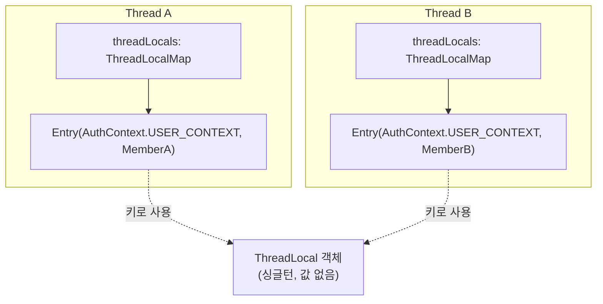
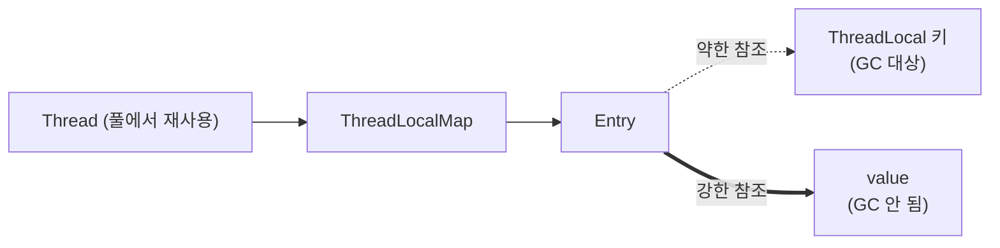
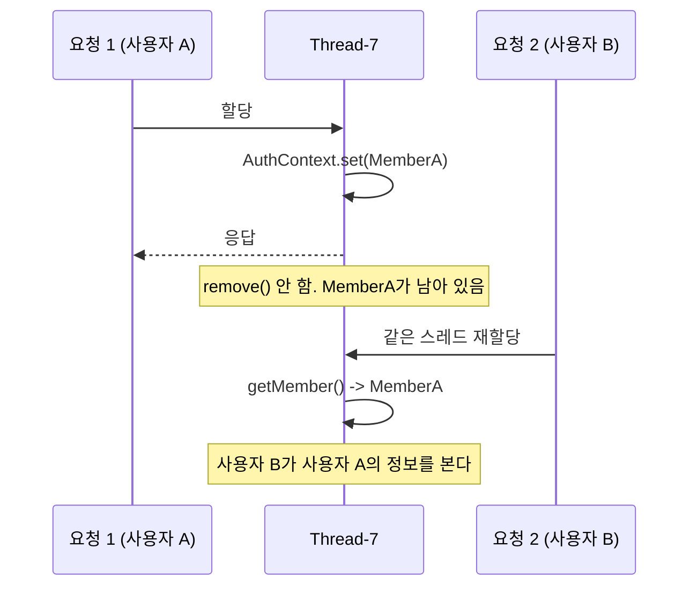

---

title: "인증 정보를 어디에 둘 것인가, AOP와 ThreadLocal 내부 뜯어보기"
date: 2023-09-21
categories: [Spring, Java]
tags: [AOP, ThreadLocal, Interceptor, Authentication, Kotlin]
layout: post
toc: true
math: true
mermaid: true

---

## 참고자료

- [Java SE 17 - ThreadLocal Javadoc](https://docs.oracle.com/en/java/javase/17/docs/api/java.base/java/lang/ThreadLocal.html)
- [OpenJDK - ThreadLocal.java 소스](https://github.com/openjdk/jdk/blob/master/src/java.base/share/classes/java/lang/ThreadLocal.java)
- [Spring Framework - TransactionSynchronizationManager Javadoc](https://docs.spring.io/spring-framework/docs/current/javadoc-api/org/springframework/transaction/support/TransactionSynchronizationManager.html)
- [Spring Framework - RequestContextHolder Javadoc](https://docs.spring.io/spring-framework/docs/current/javadoc-api/org/springframework/web/context/request/RequestContextHolder.html)
- [Spring Security - Authentication Architecture](https://docs.spring.io/spring-security/reference/servlet/authentication/architecture.html)

---

## 배경

컨트롤러마다 인증 정보를 꺼내는 코드가 똑같이 반복되고 있었다.

```kotlin
@GetMapping("/news")
fun getNews(@RequestHeader("Authorization") token: String): NewsResponse {
    val memberId = resolveToken(token)
    val member = memberRepository.findByUniqueId(memberId) ?: throw ...
    // 여기서부터 진짜 로직
}
```

컨트롤러가 할 일이 아니라고 생각해서 분리하기로 했다. 방법을 찾다가 스프링 시큐리티가 `SecurityContextHolder`로 하는 방식이 눈에 들어왔고, 그 안이 `ThreadLocal`이라는 것을 알게 됐다.

정리하면서 확인하고 싶었던 것들이다.

- `ThreadLocal`은 어떻게 스레드마다 다른 값을 갖는가?
- `ThreadLocal`에 담아두면 컨트롤러, 서비스, 리포지토리 어디서든 꺼낼 수 있는데 그 원리가 무엇인가?
- 다 쓰고 나서 지워야 한다는데 안 지우면 정확히 무슨 일이 벌어지는가?
- 이 방식으로 만든 인증은 토큰 기반인가 세션 기반인가?

---

## 1. 만든 것

애노테이션 하나로 인증을 걸 수 있게 만들었다.

### 1.1 애노테이션

```kotlin
@Target(AnnotationTarget.FUNCTION)
@Retention(AnnotationRetention.RUNTIME)
annotation class Auth
```

`AnnotationRetention.RUNTIME`이 필요하다. AOP가 실행 중에 리플렉션으로 읽어야 하기 때문이다.

### 1.2 저장소

```kotlin
object AuthContext {

    private val USER_CONTEXT: ThreadLocal<Member> = ThreadLocal()

    fun set(member: Member) = USER_CONTEXT.set(member)

    fun getMember(): Member = USER_CONTEXT.get()
        ?: throw ShortsBaseException.from(
            shortsErrorCode = ShortsErrorCode.E401_UNAUTHORIZED,
            resultErrorMessage = "인증 정보를 찾을 수 없습니다.",
        )

    fun clear() = USER_CONTEXT.remove()
}
```

`object`로 만들었으니 싱글턴이다. **싱글턴인데 스레드마다 다른 값을 갖는다**는 것이 `ThreadLocal`의 성질이고, 이게 뒤에서 볼 내용의 핵심이다.

### 1.3 애스펙트

```kotlin
@Aspect
@Component
class AuthAspect(
    private val httpServletRequest: HttpServletRequest,
    private val memberRepository: MemberRepository,
) {

    @Around("@annotation($SHORTS_PACKAGE)")
    fun memberId(pjp: ProceedingJoinPoint): Any? {
        val memberId = resolveToken(httpServletRequest)
            ?: throw ShortsBaseException.from(
                shortsErrorCode = ShortsErrorCode.E401_UNAUTHORIZED,
                resultErrorMessage = "Request Header에 인증 정보가 존재하지 않습니다.",
            )

        val member = memberRepository.findByUniqueId(memberId)
            ?: throw ShortsBaseException.from(
                shortsErrorCode = ShortsErrorCode.E404_NOT_FOUND,
                resultErrorMessage = "존재하지 않는 유저입니다.",
            )

        AuthContext.set(member)
        try {
            return pjp.proceed(pjp.args)
        } finally {
            AuthContext.clear()
        }
    }

    private fun resolveToken(request: HttpServletRequest): String? {
        val bearerToken = request.getHeader(AUTHORIZATION)
        return if (StringUtils.hasText(bearerToken) && bearerToken.startsWith(PREFIX_BEARER)) {
            bearerToken.substring(PREFIX_BEARER.length)
        } else {
            null
        }
    }

    companion object {
        private const val AUTHORIZATION = "Authorization"
        private const val PREFIX_BEARER = "Bearer "
        private const val SHORTS_PACKAGE = "com.mashup.shorts.common.aop.Auth"
    }
}
```

**처음 작성했을 때 빠뜨렸던 것이 `try`와 `finally`다.** 왜 이게 없으면 안 되는지는 3절에서 다룬다.

반환 타입도 처음에는 `Any`로 썼는데 `Any?`가 맞다. `pjp.proceed()`는 `void` 메서드에서 `null`을 돌려주기 때문이다. 코틀린에서 `Any`로 받으면 그 순간 NPE가 난다.

### 1.4 싱글턴에 HttpServletRequest를 주입한 것

`@Aspect`는 싱글턴 빈인데 요청마다 달라지는 `HttpServletRequest`를 생성자로 받고 있다. 처음에는 이게 왜 되는지 몰랐다.

**스프링이 실제 요청 객체가 아니라 프록시를 주입하기 때문이다.** 이 프록시는 메서드가 호출될 때마다 현재 스레드에 묶인 요청을 찾아 넘긴다. 그리고 그 "현재 스레드에 묶인 요청"을 들고 있는 것이 `RequestContextHolder`이고, 그 안이 또 `ThreadLocal`이다.

**결국 같은 구조가 두 겹으로 쌓여 있는 것**이다.

### 1.5 사용

```kotlin
@Auth
@GetMapping("/news")
fun getNews(): NewsResponse {
    val member = AuthContext.getMember()   // 파라미터로 안 받아도 된다
    // ...
}
```

서비스 계층에서도 그대로 꺼낼 수 있다. 파라미터로 넘길 필요가 없다.

---

## 2. ThreadLocal 내부 뜯어보기

첫 질문과 두 번째 질문의 답이 여기 있다.

### 2.1 get()부터

```java
public T get() {
    Thread t = Thread.currentThread();
    ThreadLocalMap map = getMap(t);
    if (map != null) {
        ThreadLocalMap.Entry e = map.getEntry(this);
        if (e != null) {
            @SuppressWarnings("unchecked")
            T result = (T)e.value;
            return result;
        }
    }
    return setInitialValue();
}
```

첫 줄이 전부를 설명한다. **`Thread.currentThread()`로 지금 실행 중인 스레드를 가져온다.**

그리고 그 스레드에서 맵을 꺼낸다.

```java
ThreadLocalMap getMap(Thread t) {
    return t.threadLocals;
}
```

**`threadLocals`는 `Thread` 객체의 인스턴스 필드다.**

여기가 핵심이다. 값을 담고 있는 것은 `ThreadLocal` 객체가 아니라 **스레드 객체 자신**이다.



**`ThreadLocal` 객체는 값을 담고 있지 않다. 맵의 키일 뿐이다.**

그래서 `AuthContext`가 싱글턴이어도 문제가 없다. 스레드 A가 `get()`을 부르면 A의 맵에서 찾고, 스레드 B가 부르면 B의 맵에서 찾는다. **같은 키로 서로 다른 맵을 뒤진다.**

### 2.2 set()

```java
public void set(T value) {
    Thread t = Thread.currentThread();
    ThreadLocalMap map = getMap(t);
    if (map != null) {
        map.set(this, value);
    } else {
        createMap(t, value);
    }
}
```

같은 구조다. 현재 스레드를 가져오고, 그 스레드의 맵에 넣는다. 맵이 없으면 만든다.

```java
void createMap(Thread t, T firstValue) {
    t.threadLocals = new ThreadLocalMap(this, firstValue);
}
```

**스레드 객체의 필드에 직접 대입한다.** 맵은 처음 `set()`을 부를 때 만들어진다.

### 2.3 ThreadLocalMap의 생성자

```java
ThreadLocalMap(ThreadLocal<?> firstKey, Object firstValue) {
    table = new Entry[INITIAL_CAPACITY];
    int i = firstKey.threadLocalHashCode & (INITIAL_CAPACITY - 1);
    table[i] = new Entry(firstKey, firstValue);
    size = 1;
    setThreshold(INITIAL_CAPACITY);
}
```

한 줄씩 본다.

**`table = new Entry[INITIAL_CAPACITY]`**

`INITIAL_CAPACITY`는 16이다. `HashMap`처럼 배열을 쓰는 해시 테이블이다.

**`firstKey.threadLocalHashCode & (INITIAL_CAPACITY - 1)`**

이 비트 연산이 무엇을 하는지 짚어둔다. `16 - 1`은 이진수로 `1111`이다. 어떤 수와 `1111`을 AND 하면 **하위 4비트만 남는다.**

```text
    threadLocalHashCode : 1011 0110 1001 0111
  & (16 - 1)            : 0000 0000 0000 1111
  ------------------------------------------
                        : 0000 0000 0000 0111  =  7
```

결과는 항상 0에서 15 사이다. **`% 16`과 같은 결과를 내면서 훨씬 빠르다.** 배열 크기가 2의 거듭제곱이어야 성립하는 최적화이고, `HashMap`도 같은 방식을 쓴다.

**충돌을 막는 것은 이 연산이 아니다.** 충돌을 줄이는 것은 해시값을 만드는 쪽이다.

```java
private final int threadLocalHashCode = nextHashCode();
private static AtomicInteger nextHashCode = new AtomicInteger();
private static final int HASH_INCREMENT = 0x61c88647;

private static int nextHashCode() {
    return nextHashCode.getAndAdd(HASH_INCREMENT);
}
```

**`ThreadLocal` 객체가 만들어질 때마다 `0x61c88647`씩 더한 값을 해시로 쓴다.**

이 숫자는 황금비에서 나왔다. 이 값을 계속 더해가면서 하위 몇 비트만 잘라내면, **결과가 배열 전체에 고르게 흩어진다.** 순차적으로 1씩 더하면 한쪽에 몰리는데, 이 상수를 쓰면 그런 편중이 생기지 않는다.

**`setThreshold(INITIAL_CAPACITY)`**

```java
private void setThreshold(int len) {
    threshold = len * 2 / 3;
}
```

엔트리가 배열 크기의 3분의 2를 넘으면 배열을 늘린다. `HashMap`의 부하율이 0.75인 것과 같은 개념이다.

### 2.4 Entry가 WeakReference인 이유

```java
static class Entry extends WeakReference<ThreadLocal<?>> {
    Object value;

    Entry(ThreadLocal<?> k, Object v) {
        super(k);
        value = v;
    }
}
```

**키를 약한 참조로 들고 있다.**

이유가 있다. 맵은 스레드 객체에 붙어 있고, 스레드는 풀에서 오래 살아남는다. 만약 키를 강하게 참조하면, `ThreadLocal` 객체를 아무도 안 쓰게 된 뒤에도 맵이 붙잡고 있어서 회수되지 않는다.

약한 참조면 다른 곳에서 참조가 사라지는 순간 GC가 가져간다. 그러면 엔트리의 키가 `null`이 되고, `ThreadLocalMap`은 다음에 `set()`이나 `get()`을 할 때 이런 엔트리를 정리한다.

**그런데 값은 강한 참조다.** 여기서 문제가 생긴다.



키가 회수돼서 `null`이 돼도 **값은 그대로 남아 있다.** 그 엔트리를 정리하는 것은 다음번 맵 조작이 일어날 때인데, 그런 일이 없으면 계속 남는다.

**그래서 `remove()`가 필요하다.** 자동 정리에 기대면 안 된다.

---

## 3. 안 지우면 무슨 일이 벌어지는가

세 번째 질문이다. 그리고 앞에서 `finally`를 넣은 이유다.

### 3.1 스레드는 재사용된다

톰캣은 요청마다 스레드를 새로 만들지 않는다. **스레드 풀에서 꺼내 쓰고 반납한다.**



**인증 정보가 남아 있는 상태로 다음 요청이 들어온다.**

`@Auth`가 붙은 API라면 `set()`이 덮어쓰니까 문제가 안 드러난다. 그런데 **`@Auth`가 없는 API에서 실수로 `getMember()`를 부르면** 이전 사용자의 정보가 나온다.

인증이 안 된 요청이 인증된 것처럼 동작하고, 그것도 남의 계정으로 동작한다. **버그가 아니라 보안 사고다.**

### 3.2 두 번째 문제, 메모리

값이 강한 참조로 남아 있으므로 그 객체가 회수되지 않는다.

`Member` 하나면 작지만, 여기에 연관 엔티티가 물려 있으면 딸려 온다. 스레드 풀 크기만큼 곱해진다. 톰캣 기본값이 200이면 200개가 계속 살아 있는다.

**애플리케이션을 재배포해도 안 없어지는 경우가 있다.** 웹 애플리케이션 클래스로더가 이 참조 때문에 회수되지 않으면 클래스로더 누수가 된다.

### 3.3 그래서 finally

```kotlin
AuthContext.set(member)
try {
    return pjp.proceed(pjp.args)
} finally {
    AuthContext.clear()
}
```

**예외가 나도 반드시 지워야 하므로 `finally`여야 한다.** `proceed()` 뒤에 `clear()`를 쓰면 예외가 났을 때 건너뛴다.

### 3.4 인터셉터로 하면

AOP 대신 인터셉터를 쓰면 `afterCompletion`이 그 자리를 대신한다.

```kotlin
override fun afterCompletion(
    request: HttpServletRequest,
    response: HttpServletResponse,
    handler: Any,
    ex: Exception?,
) {
    AuthContext.clear()
}
```

`afterCompletion`은 **예외가 났든 안 났든 항상 불린다.** 뷰 렌더링까지 끝난 뒤에 실행되므로 정리 작업을 두기에 적합하다.

인증처럼 요청 전체에 걸리는 관심사는 애초에 인터셉터 쪽이 자연스럽다. AOP는 특정 메서드를 지목하는 데 강하고, 인터셉터는 요청 단위 처리에 강하다.

---

## 4. ThreadLocal을 쓰는 곳들

### 4.1 스프링 시큐리티

`SecurityContextHolder`가 `ThreadLocal`을 쓴다. 기본 전략이 `ThreadLocalSecurityContextHolderStrategy`다.

```kotlin
val authentication = SecurityContextHolder.getContext().authentication
```

컨트롤러든 서비스든 어디서든 이렇게 꺼낼 수 있는 이유가 지금까지 본 구조다.

**스프링 시큐리티도 요청이 끝나면 지운다.** `SecurityContextPersistenceFilter`(최신 버전에서는 `SecurityContextHolderFilter`)가 `finally`에서 `clearContext()`를 부른다. 앞에서 직접 만든 것과 같은 이유다.

### 4.2 트랜잭션 동기화

`TransactionSynchronizationManager`가 `ThreadLocal`로 커넥션을 들고 있다.

트랜잭션을 유지하려면 **시작부터 끝까지 같은 커넥션을 써야 한다.** 방법은 두 가지다.

메서드마다 `Connection`을 파라미터로 넘긴다. 동작은 하지만 서비스 계층 시그니처가 전부 오염된다.

`ThreadLocal`에 담아둔다. 파라미터가 사라진다.

스프링은 후자를 택했다.

```java
public abstract class TransactionSynchronizationManager {
    private static final ThreadLocal<Map<Object, Object>> resources =
            new NamedThreadLocal<>("Transactional resources");
    // ...
}
```

**여기서 예전에 잘못 이해했던 것을 바로잡아 둔다.** "여러 스레드가 커넥션을 공유한다"고 알고 있었는데 정반대다.

`ThreadLocal`은 **스레드 사이에 공유하지 않기 위한 도구**다. 커넥션이 스레드에 묶여 있으므로, 다른 스레드는 그 커넥션에 접근할 수 없다.

**그래서 `@Async`나 별도 스레드로 넘어가면 트랜잭션이 따라가지 않는다.** 새 스레드에는 그 커넥션이 없다. 트랜잭션 안에서 비동기 작업을 띄우면 같은 트랜잭션에 참여할 거라고 기대하기 쉬운데, 실제로는 별개의 트랜잭션이 시작되거나 아예 없다.

### 4.3 RequestContextHolder

```java
public abstract class RequestContextHolder {

    private static final ThreadLocal<RequestAttributes> requestAttributesHolder =
            new NamedThreadLocal<>("Request attributes");

    private static final ThreadLocal<RequestAttributes> inheritableRequestAttributesHolder =
            new NamedInheritableThreadLocal<>("Request context");
}
```

**현재 요청을 어느 계층에서든 꺼낼 수 있게 해준다.** 앞에서 `@Aspect`에 `HttpServletRequest`를 주입할 수 있었던 것도 이것 덕분이다.

두 개가 있는 것이 눈에 띈다. `InheritableThreadLocal`은 **자식 스레드를 만들 때 부모의 값을 복사해준다.**

여기도 오해하기 쉬운 부분이다. **"여러 스레드가 공유한다"가 아니라 "스레드를 만드는 시점에 복사한다"이다.**

이 차이가 실무에서 문제를 만든다. **스레드 풀에서는 제대로 동작하지 않는다.** 풀의 스레드는 요청마다 새로 만들어지지 않으므로, 처음 만들어질 때 딸려온 값이 그대로 굳어 있다. 그래서 스프링은 기본적으로 상속을 끄고, 필요하면 명시적으로 켜게 해뒀다.

---

## 5. 이 인증 방식은 무엇인가

네 번째 질문이다.

만든 방식을 정리하면 이렇다. **서버가 UUID를 발급하고, DB에 저장하고, 클라이언트는 그것을 매 요청 헤더에 실어 보낸다.**

토큰 기반과 세션 기반의 갈림길은 **서버가 상태를 들고 있느냐**다.

| 기준 | 이 방식 | 판정 |
|---|---|---|
| 식별자를 서버가 발급하는가 | 그렇다 | 세션 쪽 |
| 식별자 자체에 정보가 담겨 있는가 | 아니다. 조회 키일 뿐 | 세션 쪽 |
| 서버가 상태를 들고 있는가 | 그렇다. DB에 있다 | 세션 쪽 |
| 무효화가 즉시 되는가 | 그렇다. DB에서 지우면 끝 | 세션 쪽 |
| 저장 위치 | 메모리가 아니라 DB | 통상적인 세션과 다름 |

**세션 기반이다.** 저장 위치가 메모리가 아니라는 것만 다르다.

그리고 이건 흠이 아니다. 서버를 여러 대로 늘리면 메모리 세션은 서버마다 따로 놀게 되므로, 어차피 외부 저장소로 빼야 한다. 스프링 세션이 Redis나 JDBC를 쓰는 것도 같은 이유다.

**JWT와의 차이는 여기서 갈린다.**

JWT는 토큰 안에 정보가 들어 있고 서명으로 검증한다. 서버가 아무것도 저장하지 않아도 되니 확장이 쉽다. **대신 발급한 토큰을 만료 전에 무효화할 방법이 없다.** 탈취를 알아채도 만료를 기다려야 한다. 이걸 해결하려고 차단 목록을 두면, 결국 서버가 상태를 갖게 되어 애초의 장점이 사라진다.

이 방식은 반대다. **매 요청마다 DB를 한 번 조회해야 하지만, 지우면 그 즉시 무효가 된다.**

### 5.1 탈취되면

UUID가 탈취되면 그 자체로 인증이 된다. 뺏어간 쪽과 원래 사용자를 구분할 수 없다.

**사후 조치는 DB에서 해당 UUID를 지우는 것**이고, 이건 앞에서 본 대로 즉시 반영된다.

문제는 **탈취를 어떻게 알아채느냐**다. 서버가 볼 수 있는 신호들이 있다.

같은 UUID가 짧은 시간에 지리적으로 먼 곳에서 쓰이는 경우다. 서울에서 요청이 오고 5분 뒤 다른 대륙에서 오면 물리적으로 불가능하다.

평소와 다른 요청 패턴이 잡히는 경우다. 갑자기 요청 빈도가 뛰거나, 한 번도 안 쓰던 API를 연달아 호출한다.

**다만 이건 전부 탐지이지 예방이 아니다.** 예방 쪽은 다른 층에서 해야 한다.

HTTPS로만 통신해서 중간에서 못 보게 한다. 이게 안 되면 나머지는 의미가 없다.

브라우저라면 `HttpOnly` 쿠키에 담아서 스크립트가 못 읽게 한다. 로컬 스토리지에 두면 XSS 한 번에 통째로 털린다.

유효 기간을 짧게 두고 갱신하게 한다. 탈취되더라도 쓸 수 있는 시간이 줄어든다.

---

## 정리하며

처음 던진 질문들에 대한 답이다.

**`ThreadLocal`이 어떻게 스레드마다 다른 값을 갖는가.** 값을 담고 있는 것은 `ThreadLocal` 객체가 아니라 `Thread` 객체다. 각 스레드가 `threadLocals`라는 필드에 자기 맵을 들고 있고, `ThreadLocal` 객체는 그 맵의 키 역할만 한다. 그래서 싱글턴이어도 스레드마다 다른 값이 나온다.

**어느 계층에서든 꺼낼 수 있는 이유.** 한 요청은 한 스레드가 끝까지 처리하고, 값이 그 스레드에 붙어 있기 때문이다. 컨트롤러에서 넣은 값을 리포지토리에서 꺼낼 수 있는 것은 둘이 같은 스레드에서 실행되기 때문이다. 반대로 스레드가 바뀌면 값이 따라가지 않는다.

**안 지우면 무슨 일이 벌어지는가.** 스레드 풀이 스레드를 재사용하므로 다음 요청이 이전 요청의 값을 보게 된다. 인증 정보라면 남의 계정으로 동작하는 보안 사고다. `Entry`가 값을 강한 참조로 들고 있어서 메모리도 회수되지 않는다. 그래서 `finally`에서 반드시 `remove()`를 불러야 한다.

**이 인증 방식은 무엇인가.** 세션 기반이다. 서버가 식별자를 발급하고 상태를 들고 있으며, 지우면 즉시 무효가 된다. 저장 위치가 메모리가 아니라 DB라는 것만 통상적인 세션과 다르고, 서버를 늘릴 생각이라면 오히려 그쪽이 맞다.

뜯어보고 나서 가장 크게 바뀐 생각은 **`ThreadLocal`이 공유를 위한 도구가 아니라 격리를 위한 도구**라는 것이었다. 스레드 사이에 값을 나누는 것이 아니라 스레드마다 값을 가두는 것이다. 그래서 스레드가 바뀌는 순간 전부 무너지고, 스레드가 재사용되는 순간 정리가 필수가 된다. 이 두 가지가 `ThreadLocal`을 쓸 때 늘 확인해야 할 지점이었다.
