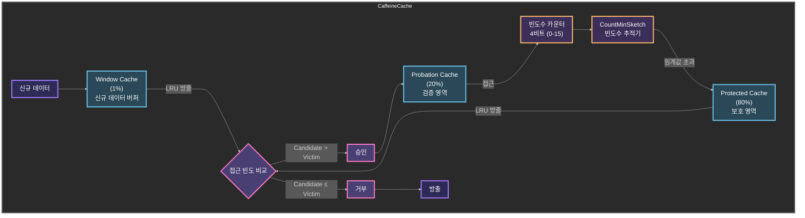
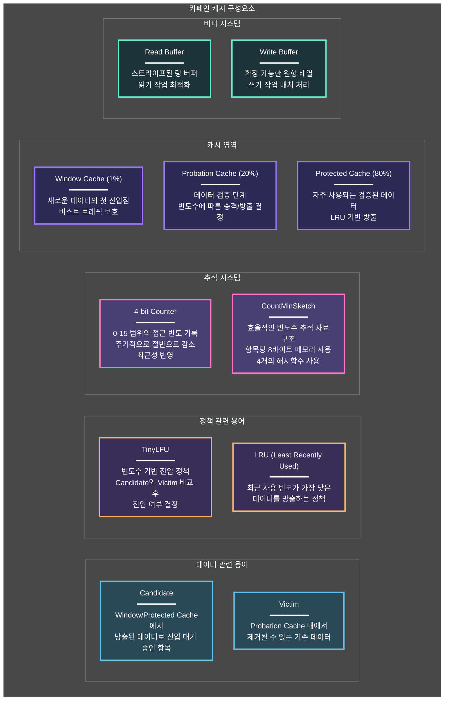

---

title: Caffeine Cache란 무엇이고 왜 빠르게 동작하는가?
date: 2023-09-21
categories: [SUWIKI, CaffeineCache, LocalCache]
tags: [SUWIKI, CaffeineCache, LocalCache]
layout: post
toc: true
math: true
mermaid: true

---

# 참고자료

[CaffeineCache-1](https://www.sobyte.net/post/2022-04/caffeine/)

[CaffeineCache-2](https://medium.com/naverfinancial/%EB%8B%88%EB%93%A4%EC%9D%B4-caffeine-%EB%A7%9B%EC%9D%84-%EC%95%8C%EC%95%84-f02f868a6192)

[eTag](https://yozm.wishket.com/magazine/detail/1772/)

---

# Caffeine Cache 내부 구현 분석

```java
package com.github.benmanes.caffeine.cache;

public final class Caffeine<K, V> {
  // === Static Constants ===
  // 통계 카운터 제공자 (기본값: ConcurrentStatsCounter)
  static final Supplier<StatsCounter> ENABLED_STATS_COUNTER_SUPPLIER = ConcurrentStatsCounter::new;
  // 로깅을 위한 시스템 로거
  static final System.Logger logger = System.getLogger(Caffeine.class.getName());
  // 해시맵 기본 로드 팩터 (0.75)
  static final double DEFAULT_LOAD_FACTOR = 0.75F;
  // 설정되지 않음을 나타내는 상수들
  static final int UNSET_INT = -1;
  static final int DEFAULT_INITIAL_CAPACITY = 16; // 기본 초기 용량
  static final int DEFAULT_EXPIRATION_NANOS = 0; // 기본 만료 시간 (나노초)
  static final int DEFAULT_REFRESH_NANOS = 0; // 기본 리프레시 시간

  // === Instance Variables ===
  boolean strictParsing = true; // 설정 엄격 검사 여부 (CaffeineSpec 파싱 시)
  boolean interner; // WeakInterner 사용 여부 (Key 중복 제거)
  long maximumSize = -1L; // 최대 엔트리 수 (-1: 미설정)
  long maximumWeight = -1L; // 가중치 기반 최대 크기 (-1: 미설정)
  int initialCapacity = -1; // 초기 용량 (기본값 16)
  long expireAfterWriteNanos = -1L; // 쓰기 후 만료 시간 (나노초)
  long expireAfterAccessNanos = -1L; // 접근 후 만료 시간
  long refreshAfterWriteNanos = -1L; // 쓰기 후 리프레시 시간
  @Nullable RemovalListener<? super K, ? super V> evictionListener; // 축출 리스너
  @Nullable RemovalListener<? super K, ? super V> removalListener; // 제거 리스너
  @Nullable Supplier<StatsCounter> statsCounterSupplier; // 통계 카운터 제공자
  @Nullable Weigher<? super K, ? super V> weigher; // 엔트리 가중치 계산기
  @Nullable Expiry<? super K, ? super V> expiry; // 사용자 정의 만료 정책
  @Nullable Scheduler scheduler; // 스케줄러 (예: 리프레시용)
  @Nullable Executor executor; // 비동기 작업 실행자 (기본: ForkJoinPool)
  @Nullable Ticker ticker; // 시간 측정기 (기본: 시스템 티커)
  @Nullable Strength keyStrength; // Key 참조 강도 (Strong/Weak/Soft)
  @Nullable Strength valueStrength; // Value 참조 강도

  // === 생성자 ===
  private Caffeine() {} // 외부 생성을 막고 newBuilder()로 생성

  // === 유틸리티 메서드 ===
  // 인자 검증 (조건 불만족 시 IllegalArgumentException)
  @FormatMethod
  static void requireArgument(boolean expression, String template, Object... args) { ... }
  static void requireArgument(boolean expression) { ... }

  // 상태 검증 (조건 불만족 시 IllegalStateException)
  static void requireState(boolean expression) { ... }
  @FormatMethod
  static void requireState(boolean expression, String template, Object... args) { ... }

  // === 설정 메서드 ===
  // 초기 용량 설정 (해시 테이블 버킷 수)
  @CanIgnoreReturnValue
  public Caffeine<K, V> initialCapacity(@NonNegative int initialCapacity) {
    requireState(this.initialCapacity == -1, "initial capacity already set");
    requireArgument(initialCapacity >= 0, "음수 용량 불가");
    this.initialCapacity = initialCapacity;
    return this;
  }

  // 비동기 작업 실행자 설정 (기본: ForkJoinPool.commonPool())
  @CanIgnoreReturnValue
  public Caffeine<K, V> executor(Executor executor) { ... }

  // 스케줄러 설정 (주기적 유지관리 작업용)
  @CanIgnoreReturnValue
  public Caffeine<K, V> scheduler(Scheduler scheduler) { ... }

  // 최대 엔트리 수 설정 (가중치 미사용 시)
  @CanIgnoreReturnValue
  public Caffeine<K, V> maximumSize(@NonNegative long maximumSize) {
    requireState(this.maximumSize == -1L, "maximumSize already set");
    requireState(this.maximumWeight == -1L, "maximumWeight와 충돌");
    requireState(this.weigher == null, "weigher와 충돌");
    this.maximumSize = maximumSize;
    return this;
  }

  // 가중치 기반 최대 크기 설정 (weigher 필수)
  @CanIgnoreReturnValue
  public Caffeine<K, V> maximumWeight(@NonNegative long maximumWeight) { ... }

  // 엔트리 가중치 계산기 설정 (maximumWeight 필요)
  @CanIgnoreReturnValue
  public <K1 extends K, V1 extends V> Caffeine<K1, V1> weigher(Weigher<? super K1, ? super V1> weigher) { ... }

  // Key Weak 참조 설정 (GC에 의해 수집 가능)
  @CanIgnoreReturnValue
  public Caffeine<K, V> weakKeys() {
    requireState(this.keyStrength == null, "keyStrength already set");
    this.keyStrength = Strength.WEAK;
    return this;
  }

  // Value Weak/Soft 참조 설정
  @CanIgnoreReturnValue
  public Caffeine<K, V> weakValues() { ... } // GC 수집 가능
  
  @CanIgnoreReturnValue
  public Caffeine<K, V> softValues() { ... } // 메모리 부족 시 수집

  // 만료 시간 설정 (쓰기/접근 후)
  @CanIgnoreReturnValue
  public Caffeine<K, V> expireAfterWrite(Duration duration) { ... }
  
  @CanIgnoreReturnValue
  public Caffeine<K, V> expireAfterWrite(@NonNegative long duration, TimeUnit unit) {
    requireState(this.expireAfterWriteNanos == -1L, "already set");
    this.expireAfterWriteNanos = unit.toNanos(duration); // 나노초 변환 저장
    return this;
  }

  // 사용자 정의 만료 정책 (Expiry 구현체)
  @CanIgnoreReturnValue
  public <K1 extends K, V1 extends V> Caffeine<K1, V1> expireAfter(Expiry<? super K1, ? super V1> expiry) { ... }

  // 리프레시 간격 설정 (주기적 재로딩)
  @CanIgnoreReturnValue
  public Caffeine<K, V> refreshAfterWrite(@NonNegative long duration, TimeUnit unit) { ... }

  // 시간 측정기 설정 (테스트용 Mock 가능)
  @CanIgnoreReturnValue
  public Caffeine<K, V> ticker(Ticker ticker) { ... }

  // 리스너 설정 (엔트리 제거/축출 시 콜백)
  @CanIgnoreReturnValue
  public <K1 extends K, V1 extends V> Caffeine<K1, V1> evictionListener(RemovalListener<? super K1, ? super V1> listener) { ... }
  
  @CanIgnoreReturnValue
  public <K1 extends K, V1 extends V> Caffeine<K1, V1> removalListener(RemovalListener<? super K1, ? super V1> listener) { ... }

  // 통계 기록 활성화 (히트율, 누락률 등)
  @CanIgnoreReturnValue
  public Caffeine<K, V> recordStats() { ... }

  // === 빌드 메서드 ===
  // 수동 캐시 생성 (CacheLoader 없음)
  public <K1 extends K, V1 extends V> Cache<K1, V1> build() {
    requireWeightWithWeigher(); // 가중치 검증
    requireNonLoadingCache(); // 로딩 캐시 전용 설정 검증
    return isBounded()
      ? new BoundedLocalCache.BoundedLocalManualCache(this)
      : new UnboundedLocalCache.UnboundedLocalManualCache(this);
  }

  // 로딩 캐시 생성 (CacheLoader 제공)
  public <K1 extends K, V1 extends V> LoadingCache<K1, V1> build(CacheLoader<? super K1, V1> loader) { ... }

  // 비동기 캐시 생성 (AsyncCache)
  public <K1 extends K, V1 extends V> AsyncCache<K1, V1> buildAsync() { ... }

  // 비동기 로딩 캐시 생성 (AsyncCacheLoader 제공)
  public <K1 extends K, V1 extends V> AsyncLoadingCache<K1, V1> buildAsync(AsyncCacheLoader<? super K1, V1> loader) { ... }

  // === 내부 검증 메서드 ===
  // 가중치 관련 설정 일관성 검증
  void requireWeightWithWeigher() {
    if (weigher != null && maximumWeight == -1L) {
      throw new IllegalStateException("Weigher requires maximumWeight");
    }
  }

  // 리프레시 설정 검증 (LoadingCache 전용)
  void requireNonLoadingCache() {
    if (refreshAfterWriteNanos != -1L) {
      throw new IllegalStateException("refreshAfterWrite requires LoadingCache");
    }
  }

  // === 기타 지원 메서드 ===
  // Duration을 나노초로 안전 변환 (오버플로우 대비)
  static long saturatedToNanos(Duration duration) { ... }

  // 설정 정보 문자열 표현
  @Override
  public String toString() { ... }

  // 참조 강도 열거형 (Strong, Weak, Soft)
  enum Strength {
    WEAK,  // 약한 참조: GC가 즉시 수집
    SOFT;   // 소프트 참조: 메모리 부족 시 수집
  }
}
```

---

# Caffeine Cache 구조






Caffeine Cache는 ConcurrentHashMap을 사용하여 캐시를 관리한다.

## 저장 계층 (Storage Layer)
ConcurrentHashMap (CHM): 실제 캐시 데이터를 저장하는 동시성 해시맵

### Window Cache (1%)
- 모든 신규 데이터의 첫 진입점
- 버스트 트래픽으로부터 Main Cache 보호
- LRU 정책으로 공간 확보
- 방출 데이터는 TinyLFU 정책으로 Probation으로 이동 시도

### Probation Cache (20%)
- 새로운 데이터의 유용성 검증 공간
- TinyLFU 정책으로 데이터 관리
- 자주 접근되는 데이터는 Protected로 승격

### Protected Cache (80%)
- 자주 사용되는 데이터 보관
- LRU 정책으로 공간 확보
- 방출 데이터는 TinyLFU로 Probation 이동 시도

## 버퍼 시스템 (Buffer System)

### 읽기 버퍼 (Read Buffer)
- Striped Ring Buffer: 스레드별 분리된 원형 버퍼로 읽기 작업 처리
- Read Cache: 읽기 작업 임시 저장소

### 쓰기 버퍼 (Write Buffer)
- Circular Array Buffer: 확장 가능한 원형 배열로 쓰기 작업 처리
- Write Cache: 쓰기 작업 임시 저장소

## 정책 시스템 (Policy System)
- TinyLFU Policy: 캐시 진입/방출 결정 정책
- LRU Policy: 최근 사용 기반 방출 정책
- CountMinSketch: 데이터 접근 빈도 추적기
- Timer Wheel: 캐시 항목 만료 시간 관리자

## 유지보수 시스템 (Maintenance System)
- Entry Expiration (항목 만료): 만료된 캐시 항목 관리
- Entry Eviction (항목 방출): 캐시 공간 확보를 위한 방출 처리
- Cleanup Task (정리 작업): 주기적인 캐시 정리 작업 수행

## 데이터 흐름
1. 새 데이터 → Window Cache 진입
2. Window Cache에서 LRU로 오래된 항목 방출 → TinyLFU 정책 평가
3. TinyLFU 승인 시 → Probation Cache 이동
4. 자주 접근되는 데이터 → Protected Cache 승격
5. Protected Cache 방출 데이터 → TinyLFU 재평가

## TinyLFU 정책

- 4-bit CountMinSketch 사용 (엔트리당 8바이트)
- 빈도수가 5회 미만인 데이터는 캐시 오염 방지를 위해 거부
- 동일 빈도수일 경우 기존 데이터 보호 (안정성)
- 약 1%의 무작위 승인으로 HashDoS 공격 방지

### Candidate (진입 후보)
- **정의**
  - Window Cache나 Protected Cache에서 LRU 정책으로 방출된 데이터
- **목적지** 
  - Probation Cache로 진입을 시도하는 데이터
- **상태**
  - TinyLFU 정책의 평가를 기다리는 상태
  - Probation Cache의 Victim과 접근 빈도를 비교하여 진입 여부가 결정됨
- **처리 결과**
  - 빈도수가 높으면: Probation Cache 진입
  - 빈도수가 낮으면: 최종 방출 (캐시에서 제거)

### Victim (제거 대상)
- **정의**
  - 새로운 Candidate를 위해 제거될 수 있는 Probation Cache 내의 데이터
- **위치**
  - Probation Cache 내에 존재
  - LRU 정책에 따라 가장 오래된 데이터가 Victim으로 선정
- **역할**
  - Candidate와 접근 빈도를 비교하는 기준점 역할
  - Cache 공간 확보를 위한 제거 대상
- **처리 결과**
  - 빈도수가 높으면: Probation Cache에 유지
  - 빈도수가 낮으면: Candidate와 교체되어 방출

### 판단 규칙

- Candidate 접근 횟수 > Victim 접근 횟수
  - Victim 제거, Candidate 진입

- Candidate 접근 횟수 < Victim 접근 횟수
  - Candidate 제거, Victim 유지

- Candidate 접근 횟수 = Victim 접근 횟수
  - Candidate 제거 (기존 데이터 보호)

- Candidate 접근 횟수 < 5
  - Candidate 제거 (캐시 오염 방지)

- 적용 시점
  - Window Cache 방출 데이터의 Probation 진입 시
  - Protected Cache 방출 데이터의 Probation 진입 시

### 왜 LRU와 LFU를 섞어서 쓰는건가?

우선 Window 캐시에서 용량이 다 찼을 때 LRU를 하는데 이는 새로 들어온 데이터가 바로 내보내지지 않도록 하기 위함이다. 만약 LFU를 썼다면 새로운 캐시는 들어오자마자 방출후보이기 때문이다.

그래서 Window Cache에서 가장 오래 살아남은 캐시를 Tiny LFU 알고리즘으로 기존 Probation 영역에 있는 데이터와 비교해서 대체되던지 제거되던지 결정한다.

그리고 Protected Cache에서도 LRU를 활용하는데 가장 오래 참조되지 않은 보호영역에 있는 데이터를 Probation으로 강등시키거나 제거할 때 사용된다.

---

## 실제 코드로 적용해보기

### 사용 사례에 맞는 캐시 정책 적용

```kotlin
@Configuration
@EnableCaching
class CacheConfig {
  @Bean
  fun cacheManager(): CacheManager {
    val cacheManager = SimpleCacheManager()
    val caches: MutableList<CaffeineCache> = ArrayList()

    // 각 용도별 캐시를 생성하고 리스트에 추가
    caches.add(buildStaticDataCache())    // 정적 데이터용 (코드, 카테고리 등)
    caches.add(buildFrequentDataCache())  // 자주 조회되는 데이터용 (상품, 게시글 등)
    caches.add(buildRealtimeDataCache())  // 실시간성 데이터용 (재고, 좌석 등)
    caches.add(buildLargeDataCache())     // 대용량 데이터용 (검색 결과 등)

    cacheManager.setCaches(caches)
    return cacheManager
  }

  /**
   * 정적 데이터용 캐시 구성
   */
  private fun buildStaticDataCache(): CaffeineCache {
    return CaffeineCache(
      "staticDataCache",
      Caffeine.newBuilder()
        .initialCapacity(100)    // 캐시 초기 키-값 항목(엔트리)의 개수
        .maximumSize(1000)       // 캐시 최대 키-값 항목(엔트리)의 개수
        .expireAfterWrite(Duration.ofHours(24))  // 마지막 쓰기 후 24시간 뒤 만료
        .recordStats()           // 캐시 사용 통계 수집 활성화
        .build()
    )
  }

  /**
   * 자주 조회되는 데이터용 캐시 구성
   */
  private fun buildFrequentDataCache(): CaffeineCache {
    return CaffeineCache(
      "frequentDataCache",
      Caffeine.newBuilder()
        .initialCapacity(500)    // 캐시 초기 키-값 항목(엔트리)의 개수
        .maximumSize(5000)       // 캐시 최대 키-값 항목(엔트리)의 개수
        .expireAfterWrite(Duration.ofMinutes(30))    // 데이터 작성/수정 후 30분 뒤 만료
        .expireAfterAccess(Duration.ofMinutes(15))   // 마지막 접근 후 15분 동안 미사용시 만료
        .recordStats()
        .build()
    )
  }

  /**
   * 실시간성 데이터용 캐시 구성
   */
  private fun buildRealtimeDataCache(): CaffeineCache {
    return CaffeineCache(
      "realtimeDataCache",
      Caffeine.newBuilder()
        .initialCapacity(100) // 캐시 초기 키-값 항목(엔트리)의 개수
        .maximumSize(1000) // 캐시 최대 키-값 항목(엔트리)의 개수
        .expireAfterWrite(Duration.ofSeconds(30))  // 30초 후 만료 (실시간성 보장)
        .weakValues()    // 메모리 압박시 GC 대상이 되도록 약한 참조 사용
        .recordStats()
        .build()
    )
  }

  /**
   * 대용량 데이터용 캐시 구성
   */
  private fun buildLargeDataCache(): CaffeineCache {
    return CaffeineCache(
      "largeDataCache",
      Caffeine.newBuilder()
        .initialCapacity(200) // 캐시 초기 키-값 항목(엔트리)의 개수
        .maximumSize(2000) // 캐시 최대 키-값 항목(엔트리)의 개수
        .expireAfterWrite(Duration.ofMinutes(10))  // 10분 후 만료
        .softValues()    // 메모리 부족 상황에서만 GC 대상이 되는 소프트 참조 사용
        .recordStats()
        .build()
    )
  }

  /**
   * 캐시 모니터링을 위한 메트릭 수집
   */
  @Component
  class CacheMonitor(private val cacheManager: CacheManager) {
    @Scheduled(fixedRate = 60000) // 1분마다 실행
    fun monitorCache() {
      val cacheNames = cacheManager.cacheNames

      cacheNames.forEach(Consumer { cacheName: String? ->
        val cache = cacheManager.getCache(cacheName!!)
        if (cache is CaffeineCache) {
          val nativeCache = cache.nativeCache

          val stats = nativeCache.stats()

          log.info(
            """
              Cache '{}' Statistics:
              ================================
              Hit Count: {}
              Miss Count: {}
              Hit Rate: {}%
              Eviction Count: {}
              ================================
              
              """.trimIndent(),
            cacheName,
            stats.hitCount(),
            stats.missCount(),
            String.format("%.2f", stats.hitRate() * 100),
            stats.evictionCount()
          )
        }
      })
    }
  }

  // 스케줄러 활성화를 위한 설정
  @Configuration
  @EnableScheduling
  inner class SchedulingConfig

  private companion object {
    private val log = LoggerFactory.getLogger(CacheConfig::class.java)
  }
}

```

### 사용사례에 맞는 캐시 사용

```kotlin
@Service
class ProductService {

  /**
   * 정적 데이터 캐시 사용 예시 (카테고리 정보)
   */
  @Cacheable(cacheNames = ["staticDataCache"], key = "'category:' + #categoryId")
  fun getCategory(categoryId: Long): Category {
    return categoryRepository.findById(categoryId)
      .orElseThrow { CategoryNotFoundException(categoryId) }
  }

  /**
   * 자주 조회되는 데이터 캐시 사용 예시 (상품 기본 정보)
   */
  @Cacheable(
    cacheNames = ["frequentDataCache"],
  key = "'product:' + #productId",
  unless = "#result == null"
    )
  fun getProduct(productId: Long): Product {
    return productRepository.findById(productId)
      .orElseThrow { ProductNotFoundException(productId) }
  }

  /**
   * 실시간성 데이터 캐시 사용 예시 (재고 정보)
   */
  @Cacheable(
    cacheNames = ["realtimeDataCache"],
  key = "'stock:' + #productId"
    )
  fun getProductStock(productId: Long): Int {
    return stockRepository.getCurrentStock(productId)
  }

  /**
   * 대용량 데이터 캐시 사용 예시 (검색 결과)
   */
  @Cacheable(
    cacheNames = ["largeDataCache"],
  key = "'search:' + #keyword + ':page:' + #page"
    )
  fun searchProducts(keyword: String, page: Int): Page<Product> {
    return productRepository.search(keyword, PageRequest.of(page, 20))
  }

  /**
   * 캐시 업데이트 예시
   */
  @CachePut(
    cacheNames = ["frequentDataCache"],
  key = "'product:' + #result.id"
    )
  fun updateProduct(product: Product): Product {
    return productRepository.save(product)
  }

  /**
   * 캐시 삭제 예시
   */
  @CacheEvict(
    cacheNames = ["frequentDataCache", "realtimeDataCache"],
  key = "'product:' + #productId"
    )
  fun deleteProduct(productId: Long) {
    productRepository.deleteById(productId)
  }

  /**
   * 여러 캐시 동시 사용 예시
   */
  @Caching(
    cacheable = [
  Cacheable(cacheNames = ["frequentDataCache"], key = "'product:' + #productId"),
  Cacheable(cacheNames = ["realtimeDataCache"], key = "'stock:' + #productId")
        ]
          )
  fun getProductWithStock(productId: Long): ProductWithStock {
    val product = productRepository.findById(productId)
      .orElseThrow { ProductNotFoundException(productId) }
    val stock = stockRepository.getCurrentStock(productId)
    return ProductWithStock(product, stock)
  }
}
```

---

## Local Cache - Ehcache vs Caffeine 성능 비교

[벤치마크 결과](https://github.com/ben-manes/caffeine/wiki/Benchmarks)

캐시 성능 비교 (Server 환경, 초당 작업 수)

### 1. Read Only (100% 읽기)

8스레드 환경:

- Caffeine: 181,703,298 ops/s
- Ehcache2: 11,252,172 ops/s
- Ehcache3: 11,415,248 ops/s

16스레드 환경:

- Caffeine: 382,355,194 ops/s
- Ehcache2: 20,750,543 ops/s
- Ehcache3: 17,611,169 ops/s

### 2. Mixed (75% 읽기, 25% 쓰기)

8스레드 환경:

-  Caffeine: 144,193,725 ops/s
-  Ehcache2: 9,472,810 ops/s
-  Ehcache3: 10,958,697 ops/s

16스레드 환경:

- Caffeine: 279,440,749 ops/s
- Ehcache2: 8,471,016 ops/s
- Ehcache3: 17,302,523 ops/s

### 3. Write Only (100% 쓰기)

8스레드 환경:

- Caffeine: 55,281,751 ops/s
- Ehcache2: 4,205,936 ops/s
- Ehcache3: 10,051,020 ops/s

16스레드 환경:

- Caffeine: 48,295,360 ops/s
- Ehcache2: 4,697,745 ops/s
- Ehcache3: 13,939,317 ops/s

위 벤치마크 결과를 본다면 압도적으로 카페인 캐시가 성능이 좋게 나온다.

성능이 좋다고 무조건 쓰는게 좋은 것은 아니므로 기존 환경을 잘 고려하여 선택하면 될 것 같다.

---

## 성능 개선 측정은 어떻게 했는지?

포스트맨으로 측정했다. 최근에 JMeter, nGrinder등 성능 측정, 모니터링 툴을 알게되어 이러한 도구들을 쓸 수도 있을 것 같다.

---

## 캐시가 효과가 있는지는 어떻게 아는지?

```java
@Component
@RequiredArgsConstructor
@Slf4j
public class CacheStaticsLogger {

    private final CacheManager cacheManager;

    public void getCachesStats(String cacheKeys) {
        CaffeineCache cache = (CaffeineCache) cacheManager.getCache(cacheKeys);
        CacheStats stats = Objects.requireNonNull(cache).getNativeCache().stats();

        log.info("Cache hit count: " + stats.hitCount());
        log.info("Cache miss count: " + stats.missCount());
    }
}
```

위와 같은 CacheStats 객체를 통해 캐시 히트와 캐시 미스의 대한 지표를 얻을 수 있다.

이 객체를 활용, 로그를 모니터링을 함으로써 캐시가 히트됐을 때의 응답속도를 측정하면 근거가 될 것으로 본다.

---

## 캐시의 TTL은 어떻게 지정할까?

캐시 히트율을 통계로 추출하여 캐시 TTL을 조정해가며 적절한 타협점을 찾는게 좋을 것 같다.

---

## 캐시 TTL을 짧게 가져갔을 때와 길게 가져갔을 때의 장/단점은 어떤게 있을까?

- `TTL을 짧게 가져간다면`
    - 캐싱된 데이터가 가장 최근에 업데이트된 데이터에 빠르게 반영될 수 있는 장점이 있다.
    - 하지만 자주 변하지 않는 데이터라면 캐시를 교체하는 리소스가 빈번하게 발생할 수 있다는 단점이 있다.

- `TTL을 길게 가져간다면`
    - 캐시를 교체하는 주기가 길어지기 때문에 캐싱된 데이터를 변경없이 오랫동안 제공할 수 있는 장점이 있다.
    - 하지만 캐시가 교체되어야할 시점에 적절하게 교체되지 못하여 변경 전의 데이터를 장기간 제공하는 상황이 발생할 수 있다는 단점이 있따.

---

## 해당 캐시가 가장 최신의 데이터임을 판별하는 방법은?

캐시에 `메타데이터`를 넣으면 어떨까?

- 캐시 데이터에 해당 캐시의 버전을 표기할 수 있는 메타데이터를 통해 클라이언트와 버전 싱크를 맞추면 해결할 수 있을 것으로 생각한다.

- 클라이언트는 응답 받은 데이터의 캐시 정보에 대한 메타데이터를 확인하고 이전에 받은 데이터의 버전과 일치한다면 최신 버전으로 간주하고
    - 만약 버전이 변경되었다면 새로운 캐시를 받아 반영하는 방식을 적용한다면 될 것 같다.

### 캐시 신선도를 활용하기 위한 eTag 활용하기

위에서 언급한 방법을 실제 코드로 적용한 바는 아래와 같다.


```java
@Configuration
public class ETagConfig {

    @Bean
    public ShallowEtagHeaderFilter shallowEtagHeaderFilter() {
        FilterRegistrationBean<ShallowEtagHeaderFilter> filterFilterRegistrationBean = new FilterRegistrationBean<>(
            new ShallowEtagHeaderFilter()
        );

        filterFilterRegistrationBean.addUrlPatterns("/lecture/all");
        filterFilterRegistrationBean.setName("etagFilter");
        return new ShallowEtagHeaderFilter();
    }

}
```

위와 같이 ETag를 추가하면, 응답에 `ETag`라는 헤더 네임을 가진 `MD5 Payload`가 생성된다.

이 정보를 바탕으로 클라이언트가 `if-None-Match`라는 이전에 응답 받았던 요청 헤더에 `MD5 Payload`를 넣고 요청하게되면 캐시의 변동사항이 있는지 확인할 수 있게 된다.

이전에 받은 캐시 내용을 그대로 사용해도 된다면 HTTP Status 304을 내리게 되는데 클라이언트는 이 상태 코드를 보고 데이터를 사용하면 된다.
