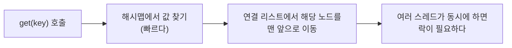
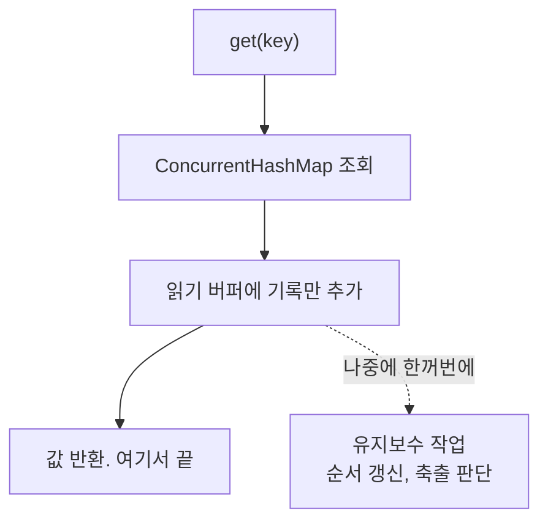
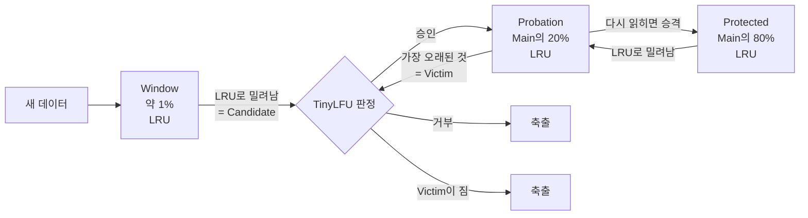
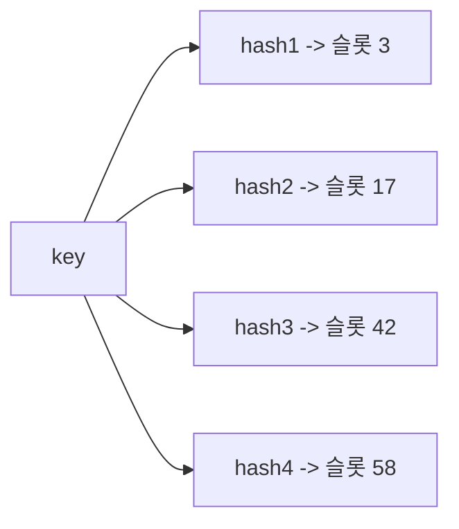
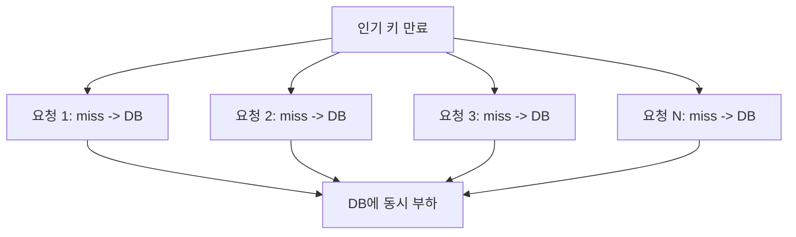
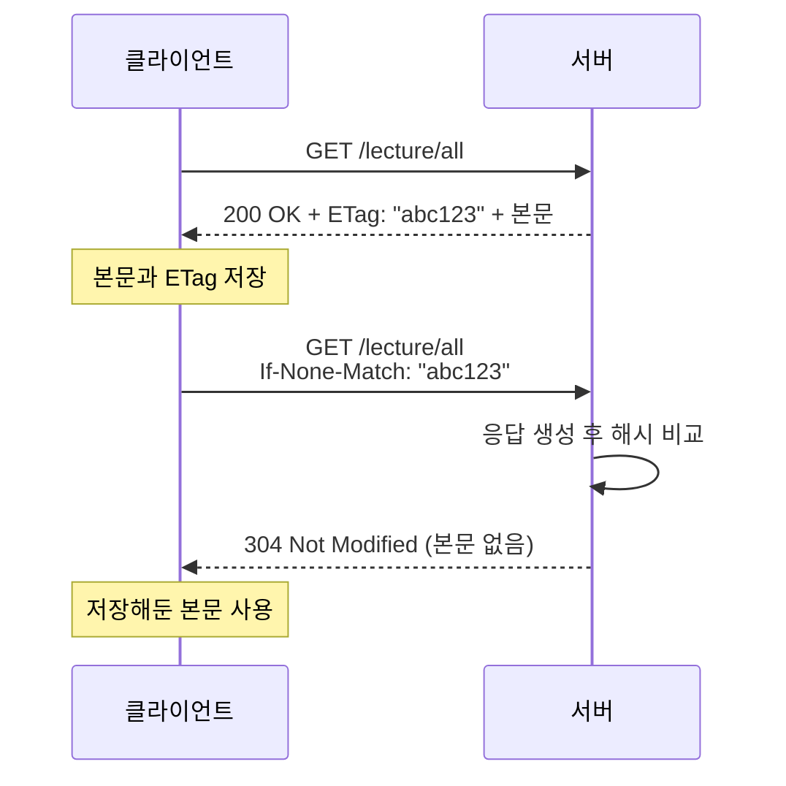

---

title: "Caffeine Cache는 왜 빠른가, W-TinyLFU 내부 뜯어보기"
date: 2023-09-21
categories: [Java, Cache]
tags: [CaffeineCache, LocalCache, TinyLFU, WindowTinyLFU, Eviction, Spring]
layout: post
toc: true
math: true
mermaid: true

---

## 참고자료

- [Caffeine Wiki - Design](https://github.com/ben-manes/caffeine/wiki/Design)
- [Caffeine Wiki - Efficiency](https://github.com/ben-manes/caffeine/wiki/Efficiency)
- [Caffeine Wiki - Benchmarks](https://github.com/ben-manes/caffeine/wiki/Benchmarks)
- [TinyLFU 논문 - A Highly Efficient Cache Admission Policy](https://arxiv.org/abs/1512.00727)
- [Caffeine - FrequencySketch 소스](https://github.com/ben-manes/caffeine/blob/master/caffeine/src/main/java/com/github/benmanes/caffeine/cache/FrequencySketch.java)
- [Spring Framework - Cache Abstraction](https://docs.spring.io/spring-framework/reference/integration/cache.html)
- [RFC 9110 - ETag](https://www.rfc-editor.org/rfc/rfc9110.html#name-etag)

---

## 배경

조회가 몰리는 API에 로컬 캐시를 붙이기로 하고 Caffeine을 골랐다. 벤치마크에서 다른 라이브러리보다 열 배 넘게 빠르다는 숫자를 봤기 때문이다.

그런데 붙이고 나니 궁금한 것이 남았다. **캐시는 결국 해시맵인데 어떻게 그만큼 차이가 나는가.**

정리하면서 확인하고 싶었던 것들이다.

- 캐시를 읽기만 해도 순서 정보를 갱신해야 하는데, 그러면 락이 걸릴 텐데 어떻게 빠른가?
- LRU와 LFU 중 하나를 고르는 것이 아니라 섞어 쓴다는데 왜 그런가?
- 빈도를 세려면 항목마다 카운터가 필요할 텐데 메모리를 얼마나 쓰는가?
- 캐시가 효과가 있는지는 무엇으로 판단하는가?

---

## 1. 캐시가 느려지는 지점

캐시의 자료구조 자체는 해시맵이다. Caffeine도 `ConcurrentHashMap`을 쓴다.

**문제는 조회가 아니라 그 뒤에 따라오는 일이다.**

LRU 캐시를 예로 든다. 항목 하나를 읽으면 "가장 최근에 쓴 것"이라는 표시를 갱신해야 한다. 보통 연결 리스트를 두고 그 항목을 맨 앞으로 옮긴다.


```mermaid
flowchart LR
    A["get(key) 호출"] --> B["해시맵에서 값 찾기<br/>(빠르다)"]
    B --> C["연결 리스트에서 해당 노드를<br/>맨 앞으로 이동"]
    C --> D["여러 스레드가 동시에 하면<br/>락이 필요하다"]
```

**여기서 읽기가 쓰기가 된다.** 값을 읽었을 뿐인데 자료구조를 고쳐야 하고, 여러 스레드가 동시에 읽으면 그 리스트를 두고 경쟁한다.

읽기 비중이 높은 캐시일수록 이 경쟁이 심해진다. 캐시를 붙였는데 오히려 느려지는 상황도 여기서 나온다.

**Caffeine이 푼 문제가 이것이다.**

---

## 2. 버퍼로 읽기와 쓰기를 분리하기

첫 질문의 답이다.

### 2.1 읽으면 기록만 남긴다

Caffeine은 `get()`을 할 때 자료구조를 바로 고치지 않는다. **"이 키를 읽었다"는 기록을 버퍼에 남기고 끝낸다.**


```mermaid
flowchart TB
    G["get(key)"] --> H["ConcurrentHashMap 조회"]
    H --> R["읽기 버퍼에 기록만 추가"]
    R --> V["값 반환. 여기서 끝"]
    R -.나중에 한꺼번에.-> M["유지보수 작업<br/>순서 갱신, 축출 판단"]
```

버퍼에 쌓인 기록은 나중에 한꺼번에 처리한다. **읽기 경로에서 락을 잡지 않는다는 뜻이다.**

### 2.2 읽기 버퍼는 스레드마다 나뉘어 있다

버퍼 하나를 여러 스레드가 같이 쓰면 결국 거기서 경쟁이 생긴다. 그래서 Caffeine은 **버퍼를 여러 개로 쪼개고 스레드를 나눠 배정한다.**

스레드 해시로 어느 버퍼에 쓸지 정하므로, 서로 다른 스레드는 대체로 다른 버퍼를 건드린다.

**버퍼가 가득 차면 기록을 그냥 버린다.** 순서 정보가 조금 부정확해지는 대가로 읽기가 절대 막히지 않게 한 것이다.

이 맞바꿈이 성립하는 이유가 있다. **캐시는 정확할 필요가 없다.** 어떤 항목을 조금 늦게 내보내거나 조금 일찍 내보내도 결과는 여전히 맞다. 성능이 떨어질 뿐이다.

### 2.3 쓰기 버퍼는 잃어버리면 안 된다

쓰기는 다르다. `put()` 기록을 버리면 캐시에 값이 안 들어간다.

그래서 쓰기 버퍼는 **가득 차면 늘어난다.** 읽기 버퍼와 정반대 선택이다.

| | 읽기 버퍼 | 쓰기 버퍼 |
|---|---|---|
| 구조 | 스레드별로 나뉜 링 버퍼 | 확장 가능한 원형 배열 |
| 가득 차면 | 기록을 버린다 | 배열을 늘린다 |
| 이유 | 읽기가 막히면 안 된다 | 쓰기를 잃으면 안 된다 |

### 2.4 유지보수는 언제 도는가

버퍼에 쌓인 것을 처리하는 작업을 유지보수(maintenance)라고 부른다.

**별도 스레드를 계속 돌리지 않는다.** 어떤 요청이 캐시를 건드릴 때 "지금 정리할 때가 됐다" 싶으면 그 요청이 정리를 맡는다. 정리는 한 번에 한 스레드만 수행하고, 나머지는 그냥 지나간다.

전용 스레드를 두지 않으니 유휴 상태에서 자원을 쓰지 않고, 정리 때문에 요청이 막히지도 않는다.

---

## 3. LRU와 LFU를 섞는 이유

두 번째 질문이다. 각각이 무엇에 약한지 보면 답이 나온다.

### 3.1 LRU가 약한 것

**LRU(Least Recently Used)는 가장 오래 안 쓴 것을 내보낸다.**

한 번씩만 읽히는 데이터가 잔뜩 들어오면 무너진다. 배치 작업이 테이블 전체를 훑는 상황을 생각하면 된다.

이 데이터들은 다시 안 읽히는데, **LRU 입장에서는 방금 읽은 것이라 가장 최신이다.** 그래서 정작 자주 쓰이던 데이터가 밀려나 버린다. 이걸 캐시 오염이라고 부른다.

### 3.2 LFU가 약한 것

**LFU(Least Frequently Used)는 가장 적게 쓰인 것을 내보낸다.**

새로 들어온 데이터가 불리하다. **들어오자마자 빈도가 0이니 바로 축출 후보가 된다.** 앞으로 자주 쓰일 데이터여도 기회를 못 얻는다.

반대 방향의 문제도 있다. 예전에 많이 쓰였지만 지금은 안 쓰이는 데이터가 높은 빈도를 유지한 채 자리를 차지한다.

### 3.3 Caffeine의 구성

Caffeine은 캐시를 세 구역으로 나눈다.


```mermaid
flowchart LR
    NEW["새 데이터"] --> W["Window<br/>약 1%<br/>LRU"]
    W -->|"LRU로 밀려남<br/>= Candidate"| T{"TinyLFU 판정"}
    T -->|승인| P["Probation<br/>Main의 20%<br/>LRU"]
    T -->|거부| OUT1["축출"]
    P -->|"다시 읽히면 승격"| PR["Protected<br/>Main의 80%<br/>LRU"]
    PR -->|"LRU로 밀려남"| P
    P -->|"가장 오래된 것<br/>= Victim"| T
    T -->|"Victim이 짐"| OUT2["축출"]
```

**Window가 LRU인 이유가 3.2의 문제를 푼다.** 새 데이터는 무조건 여기로 들어오고, 빈도와 무관하게 일단 자리를 얻는다. 여기서 버티는 동안 다시 읽히면 빈도가 쌓인다.

**Window에서 밀려날 때 TinyLFU가 판정한다.** 여기서 3.1의 문제를 푼다. 한 번씩만 읽히는 데이터는 빈도가 낮아서 Main으로 못 들어간다. 캐시 오염이 Window 안에서 멈춘다.

**Main이 Probation과 Protected로 나뉜 이유도 있다.** Probation에 들어온 것이 다시 읽히면 Protected로 승격된다. 검증을 한 번 더 거치는 셈이라, 운 좋게 한 번 통과한 데이터가 바로 좋은 자리를 차지하지 못한다.

### 3.4 비율은 고정이 아니다

Window가 1퍼센트, Main이 99퍼센트로 시작하지만 **Caffeine은 이 비율을 실행 중에 조정한다.**

적중률을 관찰하면서 Window를 키웠다 줄였다 하며 어느 쪽이 나은지 찾아간다. 워크로드가 최신성 위주면 Window가 커지고, 빈도 위주면 Main이 커진다.

**하나의 정책으로 모든 워크로드를 커버할 수 없다는 인정**이고, 이 적응 동작이 Caffeine의 적중률이 높은 큰 이유다.

### 3.5 판정 규칙

Window나 Protected에서 밀려난 항목을 Candidate, Probation에서 가장 오래된 항목을 Victim이라고 부른다. 둘의 빈도를 비교한다.

소스의 `admit()` 메서드가 이렇게 생겼다.

```java
static final int ADMIT_HASHDOS_THRESHOLD = 6;

boolean admit(Object candidateKeyRef, Object victimKeyRef) {
    int candidateFreq = frequencySketch().frequency(candidateKeyRef);
    int victimFreq = frequencySketch().frequency(victimKeyRef);
    if (candidateFreq > victimFreq) {
        return true;
    } else if (candidateFreq >= ADMIT_HASHDOS_THRESHOLD) {
        int random = ThreadLocalRandom.current().nextInt();
        return ((random & 127) == 0);
    }
    return false;
}
```

| 조건 | 결과 | 이유 |
|---|---|---|
| Candidate 빈도 > Victim 빈도 | 승인 | 더 자주 쓰이는 쪽을 남긴다 |
| Candidate 빈도 < 6 | 거부 | 근거가 부족한 데이터를 막는다 |
| 그 외 | 128분의 1 확률로 승인 | 공격 방어 |

**같은 빈도면 기존 데이터가 이긴다.** `>`이지 `>=`가 아니기 때문이다. 확신이 없으면 이미 있는 것을 지키는 쪽이다.

**마지막 무작위 승인이 왜 있는지가 재미있다.**

빈도만으로 판정하면 공격이 가능하다. 공격자가 캐시에 있는 키를 알아내서 그 빈도를 계속 올려두면, **정상적인 새 데이터가 영원히 못 들어온다.** 캐시가 오래된 데이터로 굳어버린다.

128번에 한 번은 빈도와 무관하게 통과시켜서 이 고착을 푼다. 확률이 낮아서 평소 적중률에는 거의 영향이 없다.

**임계값이 6인 것에도 이유가 있다.** 카운터 최댓값이 15이고 감쇠할 때 절반으로 줄어 7이 된다. 그 아래 구간을 "아직 근거가 부족한 후보"로 보고 무작위 승인 대상에서 아예 빼는 것이다.

---

## 4. 빈도를 어떻게 세는가

세 번째 질문이다. **모든 키에 카운터를 두면 캐시에 없는 항목의 빈도까지 기억해야 해서 메모리가 감당이 안 된다.**

Caffeine은 CountMinSketch라는 자료구조를 쓴다.

### 4.1 원리

키마다 자리를 주는 것이 아니라, **해시 함수 네 개로 네 자리를 정하고 거기에 각각 1씩 더한다.**


```mermaid
flowchart LR
    K["key"] --> H1["hash1 -> 슬롯 3"]
    K --> H2["hash2 -> 슬롯 17"]
    K --> H3["hash3 -> 슬롯 42"]
    K --> H4["hash4 -> 슬롯 58"]
```

빈도를 물어보면 그 네 자리를 읽어서 **가장 작은 값을 답한다.**

**최솟값을 쓰는 이유가 있다.** 다른 키와 자리가 겹치면 그 값은 실제보다 커진다. 겹침은 값을 부풀리기만 할 뿐 줄이지 못하므로, 네 개 중 가장 작은 것이 실제 값에 가장 가깝다.

**과대평가는 있어도 과소평가는 없다**는 성질이 여기서 나온다.

### 4.2 얼마나 쓰는가

카운터 하나가 **4비트**다. 최대 15까지 센다.

`long` 하나가 64비트이므로 카운터 16개가 들어간다. 테이블 크기를 최대 항목 수에 맞추므로 **항목 하나당 8바이트** 정도가 든다.

항목이 10만 개인 캐시라면 빈도 추적에 800킬로바이트를 쓴다. 값 자체를 저장하는 비용에 비하면 무시할 만한 수준이다.

### 4.3 4비트로 충분한가

최대 15까지밖에 못 센다. 그래도 되는 이유가 둘이다.

**판정은 상대 비교다.** Candidate와 Victim 중 누가 더 큰지만 알면 되지 절대값이 필요 없다.

**주기적으로 절반으로 줄인다.** 전체 카운터 합이 일정 수를 넘으면 모든 값을 반으로 나눈다.

이 감쇠 동작이 3.2에서 말한 LFU의 두 번째 문제를 푼다. **예전에 많이 쓰였던 데이터의 빈도가 시간이 지나면 낮아진다.** 지금 자주 쓰이는 것이 이기게 된다.

구현도 영리하다. 모든 카운터를 하나씩 도는 대신 비트 연산으로 처리한다.

```java
table[i] = (table[i] >>> 1) & RESET_MASK;
```

`long` 하나에 들어 있는 카운터 16개가 **한 번의 시프트로 전부 절반이 된다.**

---

## 5. 스프링에 붙이기

### 5.1 용도별로 캐시를 나눈다

캐시 하나에 모든 것을 넣으면 만료 정책을 데이터 성격에 맞출 수 없다. 용도별로 나눠서 만들었다.

```kotlin
@Configuration
@EnableCaching
class CacheConfig {

    @Bean
    fun cacheManager(): CacheManager = SimpleCacheManager().apply {
        setCaches(
            listOf(
                buildStaticDataCache(),     // 코드, 카테고리처럼 거의 안 바뀌는 것
                buildFrequentDataCache(),   // 상품, 게시글처럼 자주 읽는 것
                buildRealtimeDataCache(),   // 재고, 좌석처럼 최신성이 중요한 것
                buildLargeDataCache(),      // 검색 결과처럼 덩치가 큰 것
            )
        )
    }

    private fun buildStaticDataCache() = CaffeineCache(
        "staticDataCache",
        Caffeine.newBuilder()
            .initialCapacity(100)
            .maximumSize(1000)
            .expireAfterWrite(Duration.ofHours(24))
            .recordStats()
            .build(),
    )

    private fun buildFrequentDataCache() = CaffeineCache(
        "frequentDataCache",
        Caffeine.newBuilder()
            .initialCapacity(500)
            .maximumSize(5000)
            .expireAfterWrite(Duration.ofMinutes(30))
            .expireAfterAccess(Duration.ofMinutes(15))
            .recordStats()
            .build(),
    )

    private fun buildRealtimeDataCache() = CaffeineCache(
        "realtimeDataCache",
        Caffeine.newBuilder()
            .initialCapacity(100)
            .maximumSize(1000)
            .expireAfterWrite(Duration.ofSeconds(30))
            .recordStats()
            .build(),
    )

    private fun buildLargeDataCache() = CaffeineCache(
        "largeDataCache",
        Caffeine.newBuilder()
            .initialCapacity(200)
            .maximumSize(2000)
            .expireAfterWrite(Duration.ofMinutes(10))
            .recordStats()
            .build(),
    )
}
```

### 5.2 설정값이 각각 무엇인가

**`initialCapacity`** 는 항목 개수가 아니라 **내부 해시 테이블의 초기 크기**다. 이걸 미리 잡아두면 항목이 늘어날 때 테이블을 다시 만드는 일이 줄어든다.

**`maximumSize`** 는 최대 항목 수다. 여기서 W-TinyLFU가 실제로 동작하기 시작한다.

**`expireAfterWrite`** 와 **`expireAfterAccess`** 의 차이가 중요하다.

| 설정 | 기준 | 언제 쓰는가 |
|---|---|---|
| `expireAfterWrite` | 쓴 시점부터 | 데이터가 얼마나 오래되면 못 믿을지 |
| `expireAfterAccess` | 마지막으로 읽은 시점부터 | 안 쓰이는 것을 치우고 싶을 때 |

**`expireAfterAccess`만 두면 위험하다.** 계속 읽히는 항목은 영원히 안 없어져서, 원본이 바뀌어도 낡은 값이 남는다. 최신성이 필요하면 `expireAfterWrite`를 반드시 함께 둔다.

**`recordStats()`** 를 켜야 적중률을 볼 수 있다. 약간의 비용이 들지만, **이걸 안 켜면 캐시가 효과가 있는지 알 방법이 없다.**

### 5.3 weakValues와 softValues는 쓰지 않았다

처음에는 실시간 캐시에 `weakValues()`, 대용량 캐시에 `softValues()`를 넣었다가 뺐다.

**`weakValues()`** 는 그 값을 가리키는 강한 참조가 없어지는 순간 GC 대상이 된다. 캐시에 넣은 값은 대개 아무도 따로 안 들고 있으므로 **다음 GC에서 바로 사라진다.** 캐시로서 동작하지 않는다.

**`softValues()`** 는 메모리가 부족할 때만 회수되므로 그럴듯해 보인다. 하지만 GC가 이 참조를 판단하는 비용이 있고, 회수 시점이 예측되지 않아서 **응답 시간이 튀는 원인**이 된다. 메모리 압박이 걱정이면 `maximumSize`나 `maximumWeight`로 명시적으로 제한하는 편이 낫다.

**둘 다 공통으로 걸리는 것이 하나 더 있다.** 이 설정을 켜면 값 비교가 `equals()`가 아니라 참조 비교로 바뀐다. `@CachePut`처럼 값 동등성을 기대하는 코드가 예상과 다르게 동작할 수 있다.

### 5.4 사용하는 쪽

```kotlin
@Service
class ProductService(
    private val categoryRepository: CategoryRepository,
    private val productRepository: ProductRepository,
    private val stockRepository: StockRepository,
) {

    @Cacheable(cacheNames = ["staticDataCache"], key = "'category:' + #categoryId")
    fun getCategory(categoryId: Long): Category =
        categoryRepository.findById(categoryId)
            .orElseThrow { CategoryNotFoundException(categoryId) }

    @Cacheable(cacheNames = ["frequentDataCache"], key = "'product:' + #productId")
    fun getProduct(productId: Long): Product =
        productRepository.findById(productId)
            .orElseThrow { ProductNotFoundException(productId) }

    @Cacheable(cacheNames = ["realtimeDataCache"], key = "'stock:' + #productId")
    fun getProductStock(productId: Long): Int =
        stockRepository.getCurrentStock(productId)

    @CachePut(cacheNames = ["frequentDataCache"], key = "'product:' + #result.id")
    fun updateProduct(product: Product): Product =
        productRepository.save(product)

    @Caching(
        evict = [
            CacheEvict(cacheNames = ["frequentDataCache"], key = "'product:' + #productId"),
            CacheEvict(cacheNames = ["realtimeDataCache"], key = "'stock:' + #productId"),
        ]
    )
    fun deleteProduct(productId: Long) {
        productRepository.deleteById(productId)
    }
}
```

### 5.5 여기서 밟았던 것들

**키 접두사를 붙이는 이유가 있다.** 한 캐시에 여러 종류를 넣으면 `1L`이라는 키가 상품 1인지 카테고리 1인지 구분이 안 된다. 접두사가 그 충돌을 막는다.

**축출할 때 캐시마다 키가 다르다는 것을 놓치기 쉽다.** 처음에는 이렇게 썼다.

```kotlin
@CacheEvict(
    cacheNames = ["frequentDataCache", "realtimeDataCache"],
    key = "'product:' + #productId",
)
fun deleteProduct(productId: Long) { ... }
```

캐시 두 개에 **같은 키 표현식이 적용된다.** 그런데 재고는 `'stock:' + productId`로 저장했으므로 그 항목은 지워지지 않는다. 상품은 사라졌는데 재고는 캐시에 남아 있다.

캐시마다 키가 다르면 `@Caching`으로 나눠서 지정해야 한다.

**`@Caching(cacheable = [...])`으로 여러 캐시를 묶는 것도 처음에 잘못 썼다.**

```kotlin
@Caching(
    cacheable = [
        Cacheable(cacheNames = ["frequentDataCache"], key = "'product:' + #productId"),
        Cacheable(cacheNames = ["realtimeDataCache"], key = "'stock:' + #productId"),
    ]
)
fun getProductWithStock(productId: Long): ProductWithStock { ... }
```

동작을 보면 **두 캐시 모두에 `ProductWithStock` 객체가 저장된다.** `'stock:1'` 키에 재고(`Int`)가 아니라 `ProductWithStock`이 들어간다. 그러면 `getProductStock()`이 그 키를 조회했을 때 타입이 안 맞아서 터진다.

**`@Caching`의 `cacheable`은 "같은 값을 여러 키로 찾을 수 있게" 할 때 쓰는 것**이지, 서로 다른 값을 각각 캐싱하는 용도가 아니다.

**프록시를 안 거치면 캐시가 안 걸린다.** 같은 클래스 안에서 `getProduct()`를 직접 부르면 `@Cacheable`이 동작하지 않는다. 스프링 AOP가 프록시 기반이기 때문이다. [프록시에 관한 글](/posts/Reflection-DynamicProxy-CGLIB-AOP/)에 정리한 것과 같은 문제다.

### 5.6 캐시 스탬피드

캐시가 만료되는 순간 같은 키에 요청이 몰리면 **전부 DB로 간다.**


```mermaid
flowchart TB
    E["인기 키 만료"] --> R1["요청 1: miss -> DB"]
    E --> R2["요청 2: miss -> DB"]
    E --> R3["요청 3: miss -> DB"]
    E --> RN["요청 N: miss -> DB"]
    R1 & R2 & R3 & RN --> D["DB에 동시 부하"]
```

캐시를 붙였는데 특정 순간에만 DB가 튀는 현상이 이것이다.

**Caffeine의 `LoadingCache`가 이걸 막아준다.** 같은 키에 대해 한 스레드만 적재하고 나머지는 결과를 기다린다.

```kotlin
private val productCache: LoadingCache<Long, Product> = Caffeine.newBuilder()
    .maximumSize(5000)
    .expireAfterWrite(Duration.ofMinutes(30))
    .recordStats()
    .build { productId -> productRepository.findById(productId).orElseThrow() }
```

**`@Cacheable`만으로는 이 보장을 못 받는다.** 스프링의 `CaffeineCacheManager`에 `setCacheLoader()`로 로더를 등록하거나, `sync = true`를 주면 스프링이 락을 잡아준다.

```kotlin
@Cacheable(cacheNames = ["frequentDataCache"], key = "'product:' + #productId", sync = true)
fun getProduct(productId: Long): Product = ...
```

**`refreshAfterWrite`를 함께 쓰는 방법도 있다.** 만료 대신 갱신을 예약해두면, 기한이 지난 뒤 첫 요청은 예전 값을 즉시 받고 갱신은 뒤에서 일어난다. 아무도 기다리지 않는다.

---

## 6. 얼마나 빠른가

공식 벤치마크의 초당 처리량이다. 8스레드와 16스레드 환경을 옮겨 적었다.

**읽기 전용 (100% read)**

| 라이브러리 | 8스레드 | 16스레드 |
|---|---|---|
| Caffeine | 181,703,298 | 382,355,194 |
| Ehcache2 | 11,252,172 | 20,750,543 |
| Ehcache3 | 11,415,248 | 17,611,169 |

**혼합 (75% read, 25% write)**

| 라이브러리 | 8스레드 | 16스레드 |
|---|---|---|
| Caffeine | 144,193,725 | 279,440,749 |
| Ehcache2 | 9,472,810 | 8,471,016 |
| Ehcache3 | 10,958,697 | 17,302,523 |

**쓰기 전용 (100% write)**

| 라이브러리 | 8스레드 | 16스레드 |
|---|---|---|
| Caffeine | 55,281,751 | 48,295,360 |
| Ehcache2 | 4,205,936 | 4,697,745 |
| Ehcache3 | 10,051,020 | 13,939,317 |

**주목할 것은 절대값이 아니라 스레드를 늘렸을 때의 기울기다.**

읽기 전용에서 Caffeine은 8스레드에서 16스레드로 갈 때 2배 넘게 늘어난다. Ehcache3은 오히려 줄었다. **락 경합이 있으면 스레드를 늘려도 처리량이 안 따라온다.**

2절에서 본 버퍼 구조가 이 차이를 만든다.

쓰기 전용에서는 Caffeine도 스레드를 늘릴 때 처리량이 줄었다. 쓰기는 결국 공유 자료구조를 고쳐야 하므로 경합을 완전히 없앨 수 없다는 뜻이다.

**빠르다고 무조건 옳은 선택은 아니다.** 이건 로컬 캐시이므로 서버가 여러 대면 각자 다른 값을 갖는다. 서버 간에 값이 같아야 하면 Redis 같은 원격 캐시가 필요하고, 그때는 네트워크 왕복이 들어가므로 이 숫자는 의미가 없어진다.

---

## 7. 캐시가 효과가 있는지 판단하기

네 번째 질문이다.

### 7.1 적중률 보기

`recordStats()`를 켰으면 통계를 읽을 수 있다.

```kotlin
@Component
class CacheMonitor(private val cacheManager: CacheManager) {

    @Scheduled(fixedRate = 60_000)
    fun monitorCache() {
        cacheManager.cacheNames.forEach { name ->
            val cache = cacheManager.getCache(name) as? CaffeineCache ?: return@forEach
            val stats = cache.nativeCache.stats()

            log.info(
                "cache={} hit={} miss={} hitRate={} eviction={} avgLoadPenalty={}ms",
                name,
                stats.hitCount(),
                stats.missCount(),
                String.format("%.2f%%", stats.hitRate() * 100),
                stats.evictionCount(),
                String.format("%.2f", stats.averageLoadPenalty() / 1_000_000.0),
            )
        }
    }

    companion object {
        private val log = LoggerFactory.getLogger(CacheMonitor::class.java)
    }
}
```

각 값이 무엇을 말해주는지 짚어둔다.

| 지표 | 낮거나 높을 때의 해석 |
|---|---|
| `hitRate` | 낮으면 캐시가 일을 안 하고 있다. 키 설계나 TTL을 의심 |
| `evictionCount` | 높으면 `maximumSize`가 작다 |
| `missCount` 대비 `loadCount` | 적재 비용이 실제로 얼마나 발생하는지 |
| `averageLoadPenalty` | 미스 한 번의 비용. 이게 작으면 캐시할 값어치가 없다 |

**적중률과 축출 수를 함께 봐야 한다.** 적중률이 낮은데 축출도 적으면 크기 문제가 아니라 키가 잘못 설계된 것이다. 둘 다 높으면 크기를 늘리면 개선된다.

**`averageLoadPenalty`가 판단의 출발점이다.** 원본 조회가 이미 1밀리초 안에 끝난다면 캐시를 붙여도 얻을 것이 별로 없다. 캐시는 공짜가 아니고 무효화라는 새 문제를 들여온다.

### 7.2 부하 테스트

당시에는 포스트맨으로 응답 시간을 재는 정도만 했다. **한 번씩 눌러보는 것으로는 캐시 효과를 제대로 못 잰다.**

캐시는 부하가 있어야 의미가 드러난다. 동시 요청이 없으면 락 경합도, 적중률도 실제와 다르다. JMeter나 nGrinder로 부하를 주고 재는 것이 맞다.

측정할 때 확인해야 할 것들이 있다. **워밍업 구간을 빼야 한다.** 캐시가 비어 있는 초기 구간은 전부 미스라서 평균을 끌어내린다.

**평균 응답 시간보다 백분위를 봐야 한다.** 평균은 적중률이 높으면 좋아 보이지만, 미스가 난 소수 요청의 지연은 그대로 남는다. p99를 봐야 한다.

### 7.3 TTL 정하기

정답이 없다. 데이터 성격에 따라 갈린다.

**짧게 잡으면** 최신 데이터가 빨리 반영된다. 대신 미스가 늘어나서 원본 부하가 커지고, 자주 안 바뀌는 데이터라면 헛수고다.

**길게 잡으면** 적중률이 올라간다. 대신 원본이 바뀐 뒤에도 낡은 값을 오래 내보낸다.

**출발점은 "이 데이터가 얼마나 낡아도 되는가"다.** 상품 카테고리는 하루쯤 낡아도 되지만 재고는 몇 초도 곤란하다.

그다음에 적중률을 보면서 조정한다. **TTL을 늘렸는데 적중률이 안 오르면 접근 패턴 자체가 흩어져 있다는 뜻**이고, 그러면 캐시 자체를 다시 생각해야 한다.

### 7.4 클라이언트 쪽 캐시 신선도

서버 캐시와 별개로 **클라이언트가 받은 데이터가 최신인지** 확인하는 방법이 있다. ETag다.

응답에 내용을 요약한 값을 `ETag` 헤더로 붙여 보낸다. 클라이언트는 다음 요청에 `If-None-Match`로 그 값을 실어 보내고, 서버는 내용이 안 바뀌었으면 본문 없이 `304 Not Modified`만 돌려준다.


```mermaid
sequenceDiagram
    participant C as 클라이언트
    participant S as 서버

    C->>S: GET /lecture/all
    S-->>C: 200 OK + ETag: "abc123" + 본문
    Note over C: 본문과 ETag 저장
    C->>S: GET /lecture/all<br/>If-None-Match: "abc123"
    S->>S: 응답 생성 후 해시 비교
    S-->>C: 304 Not Modified (본문 없음)
    Note over C: 저장해둔 본문 사용
```

스프링에 붙이는 코드다.

```java
@Configuration
public class ETagConfig {

    @Bean
    public FilterRegistrationBean<ShallowEtagHeaderFilter> shallowEtagHeaderFilter() {
        FilterRegistrationBean<ShallowEtagHeaderFilter> registration =
            new FilterRegistrationBean<>(new ShallowEtagHeaderFilter());
        registration.addUrlPatterns("/lecture/all");
        registration.setName("etagFilter");
        return registration;
    }
}
```

**처음 썼던 코드에 버그가 있었다.** `FilterRegistrationBean`을 만들어놓고 정작 반환은 `new ShallowEtagHeaderFilter()`를 하고 있었다.

```java
// 잘못된 코드
FilterRegistrationBean<ShallowEtagHeaderFilter> registration = ...;
registration.addUrlPatterns("/lecture/all");
return new ShallowEtagHeaderFilter();   // 등록 정보가 버려진다
```

이러면 URL 패턴이 무시되고 **모든 요청에 필터가 걸린다.** 등록 정보를 담은 객체를 반환해야 한다.

**이름에 붙은 shallow가 무엇을 뜻하는지도 중요하다.** 이 필터는 응답 본문을 다 만든 뒤에 해시를 계산해서 비교한다. **서버가 하는 일은 줄어들지 않는다.** DB도 조회하고 JSON 직렬화도 다 한다. 아끼는 것은 네트워크 전송량뿐이다.

응답이 크고 자주 안 바뀌는 API에는 값어치가 있지만, 서버 부하를 줄이려는 목적이면 맞지 않는다. 그건 앞에서 본 서버 캐시가 할 일이다.

---

## 정리하며

처음 던진 질문들에 대한 답이다.

**읽기만 해도 순서를 갱신해야 하는데 어떻게 빠른가.** 읽을 때 자료구조를 바로 고치지 않고 버퍼에 기록만 남긴다. 읽기 버퍼는 스레드별로 쪼개져 있어서 경쟁이 적고, 가득 차면 기록을 버려서 읽기가 절대 막히지 않는다. 캐시는 조금 부정확해도 결과가 틀리지 않는다는 점을 이용한 맞바꿈이다.

**LRU와 LFU를 왜 섞는가.** LRU는 한 번씩만 읽히는 데이터에 오염되고, LFU는 새 데이터에 기회를 안 준다. Window를 LRU로 두어 새 데이터가 일단 자리를 얻게 하고, Main으로 들어갈 때 빈도로 걸러서 오염을 막는다. 두 정책이 서로의 약점을 덮는다.

**빈도 추적에 메모리를 얼마나 쓰는가.** 항목마다 카운터를 두지 않고 CountMinSketch로 4비트 카운터를 공유한다. 항목당 8바이트 정도이고, 주기적으로 전체를 절반으로 줄여서 오래된 빈도가 굳지 않게 한다.

**캐시가 효과가 있는지 어떻게 아는가.** `recordStats()`를 켜고 적중률, 축출 수, 평균 적재 시간을 함께 본다. 적중률만 봐서는 크기 문제인지 키 설계 문제인지 구분이 안 된다. 그리고 평균 적재 시간이 애초에 작으면 캐시를 붙일 값어치가 없다.

뜯어보고 나서 남은 감각은 **캐시가 정확할 필요가 없다는 전제가 얼마나 많은 것을 가능하게 하는가**였다. 읽기 기록을 버려도 되고, 빈도를 대충 세도 되고, 축출을 늦게 해도 된다. 이 여유가 없었으면 락을 잡아야 했을 자리마다 Caffeine은 다른 선택을 하고 있었다.
