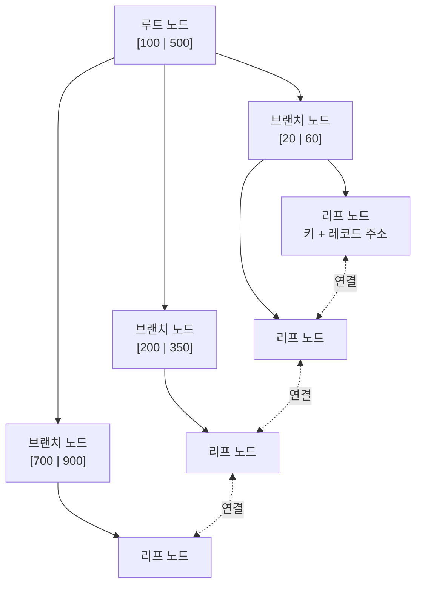
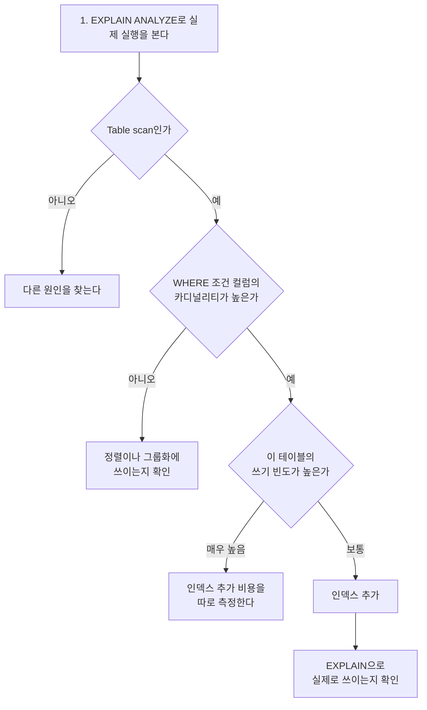

---

title: "150만 건 테이블의 BETWEEN 조회가 느려서 인덱스를 붙인 과정"
date: 2023-09-21
categories: [Database, MySQL]
tags: [MySQL, Index, BTree, ExplainAnalyze, JPA, Performance]
layout: post
toc: true
math: true
mermaid: true

---

## 참고자료

- [MySQL 8.0 - Optimization and Indexes](https://dev.mysql.com/doc/refman/8.0/en/optimization-indexes.html)
- [MySQL 8.0 - EXPLAIN ANALYZE](https://dev.mysql.com/doc/refman/8.0/en/explain.html#explain-analyze)
- [MySQL 8.0 - Comparison of B-Tree and Hash Indexes](https://dev.mysql.com/doc/refman/8.0/en/index-btree-hash.html)
- [MySQL 8.0 - Multiple-Column Indexes](https://dev.mysql.com/doc/refman/8.0/en/multiple-column-indexes.html)
- [Jakarta Persistence - @Table](https://jakarta.ee/specifications/persistence/3.1/apidocs/jakarta.persistence/jakarta/persistence/table)

---

## 배경

뉴스 테이블에 레코드가 약 150만 건 쌓였고, 매시간 800~1200건이 더 들어온다. 특정 시간대의 기사를 조회하는 기능이 12초 넘게 걸리기 시작했다.

인덱스를 붙이면 될 것 같은데, 그냥 붙이기 전에 확인하고 싶은 것들이 있었다.

- 왜 느린지를 어떻게 확인하는가? 감으로 붙이면 안 될 것 같았다.
- `EXPLAIN ANALYZE` 출력에 숫자가 여러 개 나오는데 각각 무슨 뜻인가?
- 인덱스를 붙이면 뭐가 나빠지는가? 공짜는 아닐 텐데.
- 어느 컬럼에 붙여야 하는가? 여러 개면 순서는?

확인한 순서대로 정리했다.

---

## 1. 느린 지점 찾기

### 1.1 문제의 쿼리

```sql
SELECT *
FROM news
WHERE created_at BETWEEN '2023-07-07 10:00:00' AND '2023-07-07 11:00:00'
  AND title LIKE '%검색어%';
```

시간 범위로 자르고 제목에 특정 단어가 들어간 기사를 찾는다.

### 1.2 EXPLAIN ANALYZE로 실제 실행을 본다

`EXPLAIN`은 옵티마이저의 **계획**을 보여주고, `EXPLAIN ANALYZE`는 쿼리를 **실제로 실행해서** 걸린 시간을 함께 보여준다.

```sql
EXPLAIN ANALYZE
SELECT *
FROM news
WHERE created_at BETWEEN '2023-07-07 10:00:00' AND '2023-07-07 11:00:00'
  AND title LIKE '%검색어%';
```

결과다.

```text
Table scan on news
  (cost=83282.06 rows=242017)
  (actual time=5.829..19139.414 rows=305977 loops=1)
```

### 1.3 이 숫자들을 어떻게 읽는가

두 번째 질문이다. **처음에 이걸 잘못 읽어서 한참 헤맸다.**

```
(cost=83282.06 rows=242017) (actual time=5.829..19139.414 rows=305977 loops=1)
 └────┬────┘  └────┬────┘   └─────────┬─────────┘ └─────┬─────┘ └───┬───┘
   추정 비용    추정 행 수        실제 시간(ms)         실제 행 수    반복 횟수
```

| 항목 | 의미 |
|---|---|
| `cost` | 옵티마이저가 계산한 상대적 비용. 단위가 없고 계획끼리 비교하는 용도다 |
| `rows` (앞) | 옵티마이저가 **추정한** 행 수 |
| `actual time=A..B` | **A는 첫 행이 나오기까지, B는 마지막 행이 나오기까지** 걸린 시간. 단위는 **밀리초** |
| `rows` (뒤) | 실제로 나온 행 수 |
| `loops` | 이 단계가 몇 번 반복됐는지 |

**`actual time=5.829..19139.414`를 "5.8초에서 19139초"로 읽으면 안 된다.** 두 가지가 틀렸다.

첫째, **단위가 밀리초다.** 19139.414ms는 약 19초다.

둘째, **범위가 아니라 두 시점이다.** 최소와 최대가 아니라 "첫 행까지 5.829ms, 마지막 행까지 19139.414ms"라는 뜻이다.

그리고 `loops`가 1보다 크면 **표시된 시간은 1회 평균**이다. 전체 시간을 알려면 곱해야 한다.

### 1.4 무엇이 문제인가

`Table scan on news`가 문제다. **테이블 전체를 읽고 있다.**

추정 행 수 242017과 실제 행 수 305977이 크게 어긋난 것도 눈에 띈다. 통계 정보가 실제와 맞지 않다는 신호다.

---

## 2. 인덱스가 무엇인가

붙이기 전에 무엇을 붙이는지부터 정리했다.

### 2.1 B-Tree

MySQL InnoDB의 기본 인덱스 구조다. 이름의 B는 Balanced를 뜻한다. **어느 값을 찾든 뿌리에서 잎까지의 깊이가 같다.**



각 노드는 페이지 단위로 저장되고 InnoDB의 기본 페이지 크기는 16KB다.

**두 가지 성질이 중요하다.**

**정렬되어 있다.** 그래서 특정 값을 찾을 때 이진 탐색처럼 범위를 절반씩 좁힐 수 있다. 150만 건이어도 몇 번만 내려가면 닿는다.

**리프 노드끼리 연결되어 있다.** 그래서 범위 조회가 빠르다. 시작점을 찾은 뒤 옆으로 훑으면 된다. 이번 문제의 `BETWEEN`이 여기 해당한다.

해시 인덱스와 비교하면 차이가 분명해진다.

| | B-Tree | Hash |
|---|---|---|
| 정확히 일치 (`=`) | 가능 | 가능, 더 빠름 |
| 범위 조회 (`BETWEEN`, `>`) | **가능** | 불가 |
| 정렬 (`ORDER BY`) | 가능 | 불가 |
| 앞부분 일치 (`LIKE 'abc%'`) | 가능 | 불가 |

InnoDB에서 명시적으로 만드는 인덱스는 B-Tree다.

### 2.2 삽입 비용

**리프 노드가 꽉 차면 분리된다.** 노드를 둘로 쪼개고 그 사실을 상위 노드에 반영하는데, 상위도 꽉 차 있으면 그 위로 전파된다. 최악의 경우 루트까지 올라가면서 트리의 높이가 한 단계 늘어난다.

그래서 **인덱스는 읽기를 빠르게 하는 대신 쓰기를 느리게 한다.** 세 번째 질문의 답 중 하나다.

여기서 "B-Tree가 LinkedList와 유사하다"는 설명을 본 적이 있는데 정확하지 않다. 리프 노드끼리 연결되어 있다는 점만 비슷하고, 탐색 구조는 완전히 다르다. LinkedList는 처음부터 순회해야 하지만 B-Tree는 뿌리에서 내려가면서 범위를 좁힌다.

---

## 3. 인덱스 붙이기

### 3.1 DB에 생성

```sql
ALTER TABLE news ADD INDEX idx_news_created_at (created_at);
```

**150만 건 테이블에서는 시간이 걸린다.** 기존 데이터를 전부 읽어 트리를 만들어야 하기 때문이다.

MySQL 8.0에서는 대부분의 인덱스 추가가 온라인으로 처리되어 그동안 읽기와 쓰기가 가능하지만, 부하가 올라가므로 트래픽이 적은 시간에 하는 편이 낫다.

```sql
-- 만들어졌는지 확인
SHOW INDEX FROM news;
```

### 3.2 JPA 쪽에도 매핑

```kotlin
@Table(
    name = "news",
    indexes = [
        Index(name = "idx_news_created_at", columnList = "created_at")
    ]
)
@Entity
class News { /* ... */ }
```

**주의할 점이 있다.** 이 선언은 JPA가 스키마를 자동 생성할 때만 실제로 인덱스를 만든다. 운영 환경에서는 `ddl-auto`를 꺼두는 것이 보통이므로, 이 선언만으로는 아무 일도 일어나지 않는다.

그럼 왜 쓰는가. **문서 역할**이다. 이 엔티티가 어떤 인덱스를 전제로 동작하는지가 코드에 남는다. 실제 생성은 마이그레이션 스크립트로 하고, 선언은 여기 남기는 방식으로 썼다.

### 3.3 결과

```text
Index range scan on news using idx_news_created_at
  (cost=2088.81 rows=2027)
  (actual time=2.678..57.552 rows=2027 loops=1)
```

1.3절의 읽는 법을 적용하면 이렇다.

| | 인덱스 전 | 인덱스 후 |
|---|---|---|
| 접근 방식 | `Table scan` | `Index range scan` |
| 마지막 행까지 | 약 19,139ms | 약 58ms |
| 읽은 행 수 | 305,977 | 2,027 |

**시간이 약 19초에서 약 0.06초로 줄었다.** 처음에 이걸 "50% 개선"이라고 계산했는데 잘못 읽은 것이었다. 실제로는 300배 넘게 빨라졌다.

읽은 행 수가 305,977에서 2,027로 준 것이 그 이유다. 전체를 훑는 대신 인덱스로 필요한 범위만 찾아갔다.

---

## 4. 인덱스가 공짜가 아닌 이유

세 번째 질문이다. 네 가지 대가가 있다.

### 4.1 쓰기가 느려진다

2.2절 그대로다. 레코드를 넣을 때마다 그 테이블의 **모든 인덱스**를 갱신해야 한다. 인덱스가 다섯 개면 다섯 번 갱신한다.

이번 테이블은 매시간 800~1200건이 들어온다. 초당 0.3건 정도라 인덱스 하나 추가가 문제 되는 수준은 아니었다. **쓰기 부하가 높은 테이블이었다면 판단이 달랐을 것이다.**

### 4.2 저장 공간을 쓴다

인덱스도 디스크에 저장된다. 대략 원본 데이터의 10~20% 정도를 추가로 쓴다고 보면 된다. 컬럼 길이와 카디널리티에 따라 달라진다.

### 4.3 옵티마이저가 안 쓸 수도 있다

인덱스를 만들어도 옵티마이저가 **전체 스캔이 더 빠르다고 판단하면** 안 쓴다.

조회 대상이 테이블의 상당 부분을 차지할 때 그렇다. 인덱스로 찾아간 뒤 실제 레코드를 읽으러 다시 가는 비용이, 그냥 순차로 읽는 것보다 클 수 있기 때문이다.

**만들었는데 안 쓰이는 인덱스가 최악이다.** 쓰기는 느려지고 공간은 쓰는데 읽기는 안 빨라진다.

```sql
-- 실제로 쓰이는지 확인한다
EXPLAIN SELECT ... ;
```

`type` 컬럼이 `ALL`이면 전체 스캔이고, `range`나 `ref`면 인덱스를 쓴 것이다.

### 4.4 안 쓰이는 인덱스가 쌓인다

시간이 지나면서 쿼리는 바뀌는데 인덱스는 남는다. MySQL 8.0에서는 사용 통계를 볼 수 있다.

```sql
SELECT object_schema, object_name, index_name
FROM performance_schema.table_io_waits_summary_by_index_usage
WHERE index_name IS NOT NULL
  AND count_star = 0
  AND object_schema NOT IN ('mysql', 'performance_schema')
ORDER BY object_schema, object_name;
```

`count_star = 0`이면 서버가 뜬 이후로 한 번도 안 쓰인 인덱스다.

---

## 5. 어느 컬럼에 붙일 것인가

네 번째 질문이다.

### 5.1 카디널리티

**카디널리티(cardinality)** 는 그 컬럼의 값이 얼마나 다양한지를 나타낸다. 유니크한 값의 개수라고 보면 된다.

| 컬럼 | 카디널리티 | 인덱스 효과 |
|---|---|---|
| 주민번호, UUID | 매우 높음 | 좋다 |
| 이메일 | 높음 | 좋다 |
| 생성 일시 | 높음 | 좋다 |
| 상태 코드 (5종) | 낮음 | 제한적 |
| 성별 (2종) | 매우 낮음 | 거의 없다 |

**카디널리티가 낮으면 인덱스를 타도 걸러지는 양이 적다.** 성별로 인덱스를 만들어도 절반이 남으므로, 그럴 바에는 전체 스캔이 낫다고 옵티마이저가 판단한다.

`created_at`은 초 단위까지 다르므로 카디널리티가 높다. 그래서 이번 경우에 효과가 컸다.

**다만 카디널리티가 낮아도 쓸 이유가 있다.** 정렬이나 그룹화에 쓰이면 인덱스의 정렬된 성질이 도움이 된다. 인덱스는 검색에만 쓰이는 것이 아니다.

### 5.2 복합 인덱스의 순서

여러 컬럼을 묶어 인덱스를 만들 때 **순서가 결정적으로 중요하다.**

```sql
ALTER TABLE news ADD INDEX idx_status_created (status, created_at);
```

B-Tree는 앞 컬럼부터 정렬한다. 그래서 이 인덱스는 이렇게 쓰인다.

| 조회 조건 | 인덱스를 쓰는가 |
|---|---|
| `WHERE status = 'A'` | 쓴다 |
| `WHERE status = 'A' AND created_at > ...` | 쓴다 (가장 좋음) |
| `WHERE created_at > ...` | **안 쓴다** |

**앞 컬럼 없이 뒤 컬럼만으로는 못 쓴다.** 전화번호부가 성으로 먼저 정렬되어 있으면 이름만으로는 찾을 수 없는 것과 같다. 이것을 왼쪽 접두사 규칙이라고 부른다.

그래서 순서를 정하는 기준은 이렇다.

1. **등호 조건으로 쓰이는 컬럼을 앞에** 둔다. 범위 조건 뒤의 컬럼은 인덱스 정렬을 활용하지 못한다.
2. 등호 조건이 여럿이면 **카디널리티가 높은 것을 앞에** 둔다. 먼저 많이 걸러진다.
3. 마지막에 범위 조건 컬럼을 둔다.

```sql
-- status는 등호, created_at은 범위
WHERE status = 'PUBLISHED' AND created_at BETWEEN ... AND ...

-- 그래서 순서는 (status, created_at)
```

### 5.3 이번 쿼리에 남은 문제

인덱스를 붙여서 19초가 0.06초가 됐지만, 사실 쿼리에 조건이 하나 더 있었다.

```sql
AND title LIKE '%검색어%'
```

**앞에 `%`가 붙은 `LIKE`는 인덱스를 쓸 수 없다.** B-Tree는 앞에서부터 정렬되어 있으므로 시작 문자를 모르면 어디를 봐야 할지 정할 수 없다.

지금은 `created_at` 인덱스로 2,027건까지 줄인 뒤 그 안에서 `title`을 하나씩 확인한다. 2,027건이면 감당되지만 시간 범위가 넓어지면 다시 느려진다.

이 부분까지 해결하려면 전문 검색이 필요하다. MySQL의 전문 검색 인덱스를 쓰거나, 검색 엔진을 따로 두는 방법이 있다. **당장 필요한 수준을 넘어서므로 여기서는 인덱스까지만 적용하고, 조건을 기록해두었다.**

---

## 6. 정리한 판단 절차

이번 일을 겪고 나서 인덱스를 검토할 때의 순서를 이렇게 정리했다.



**마지막 단계를 빠뜨리면 안 된다.** 만들었다고 쓰이는 것이 아니다.

---

## 정리하며

처음 던진 질문들에 대한 답이다.

**왜 느린지 어떻게 확인하는가.** `EXPLAIN ANALYZE`로 실제 실행 결과를 본다. `Table scan`이 나오면 전체를 읽고 있다는 뜻이다.

**출력의 숫자를 어떻게 읽는가.** `actual time=A..B`는 A가 첫 행까지, B가 마지막 행까지 걸린 시간이고 **단위는 밀리초**다. 최소와 최대가 아니다. `loops`가 1보다 크면 표시된 값은 1회 평균이므로 곱해야 전체 시간이 나온다.

**인덱스를 붙이면 뭐가 나빠지는가.** 쓰기가 느려지고, 저장 공간을 쓰고, 옵티마이저가 안 쓸 수도 있고, 안 쓰이는 채로 쌓인다. 그래서 만든 뒤에 실제로 쓰이는지 확인하는 단계가 필요하다.

**어느 컬럼에 어떤 순서로 붙이는가.** 카디널리티가 높은 컬럼에 붙인다. 복합 인덱스는 등호 조건 컬럼을 앞에, 범위 조건 컬럼을 뒤에 둔다. 앞 컬럼 없이 뒤 컬럼만으로는 인덱스를 못 쓴다.

이번에 가장 크게 배운 것은 **측정값을 잘못 읽으면 개선 폭도 잘못 판단하게 된다**는 것이었다. 처음에는 "50% 개선"이라고 봤는데 실제로는 300배였다. 숫자의 단위와 의미를 먼저 확인하고 나서 판단해야 한다.
