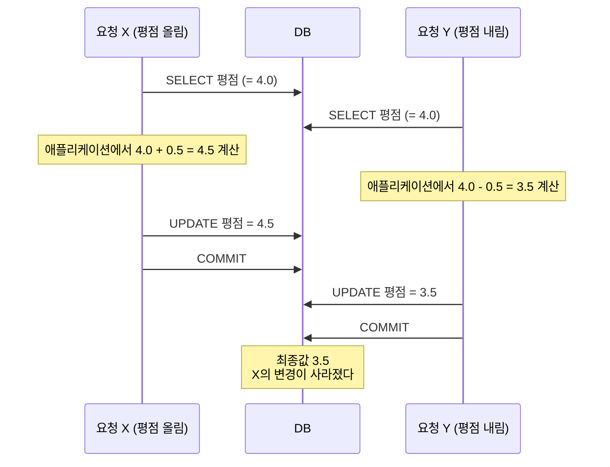
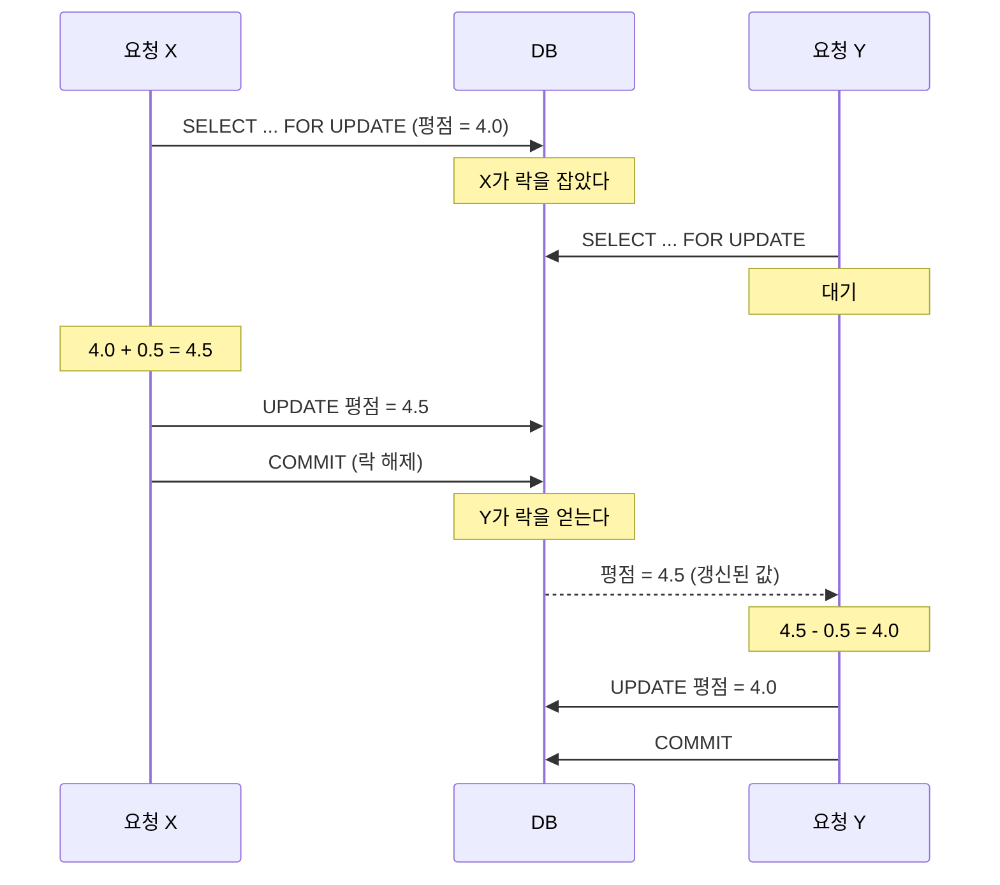

---

title: "동시에 들어온 요청이 서로를 덮어썼다, 비관적 락으로 막은 과정"
date: 2023-09-21
categories: [Database, JPA]
tags: [Lock, PessimisticLock, OptimisticLock, JPA, MySQL, Concurrency]
layout: post
toc: true
math: true
mermaid: true

---

## 참고자료

- [MySQL 8.0 - Locking Reads](https://dev.mysql.com/doc/refman/8.0/en/innodb-locking-reads.html)
- [MySQL 8.0 - Transaction Isolation Levels](https://dev.mysql.com/doc/refman/8.0/en/innodb-transaction-isolation-levels.html)
- [Jakarta Persistence - LockModeType](https://jakarta.ee/specifications/persistence/3.1/apidocs/jakarta.persistence/jakarta/persistence/lockmodetype)
- [Spring Data JPA - Locking](https://docs.spring.io/spring-data/jpa/reference/jpa/locking.html)

---

## 배경

강의 평가 기능에서 값이 이상하게 저장되는 문제가 있었다. 평점을 올리는 요청과 내리는 요청이 거의 동시에 들어오면 한쪽이 사라졌다.

원인을 찾고 나서 선택할 것이 생겼다.

- 낙관적 락과 비관적 락 중 무엇을 쓸 것인가?
- 비관적 락에도 종류가 있다는데 어느 것인가?
- 락을 안 쓰고 푸는 방법은 없는가?
- 락을 걸면 성능이 떨어질 텐데 어디까지 감수할 것인가?

정리하면서 판단한 과정을 남긴다.

트랜잭션 격리 수준과 MySQL의 락 종류 전반은 [트랜잭션과 잠금](/posts/Transaction-Lock/)에 따로 정리해두었고, 여기서는 애플리케이션에서 어떻게 골랐는지를 다룬다.

---

## 1. 무슨 일이 일어났는가

### 1.1 갱신 손실

두 요청이 같은 레코드를 이렇게 처리했다.



**둘 다 4.0을 읽었다는 것이 문제다.** 각자 자기가 읽은 값을 기준으로 계산하고 그 결과를 썼으므로, 나중에 쓴 쪽이 먼저 쓴 쪽을 덮었다.

이것을 **갱신 손실(lost update)** 이라고 부른다.

### 1.2 격리 수준으로는 안 막힌다

처음에는 격리 수준을 올리면 되는 줄 알았다. 그렇지 않았다.

MySQL의 기본 격리 수준인 `REPEATABLE READ`에서도 이 문제가 난다. 이 격리 수준이 보장하는 것은 **한 트랜잭션 안에서 같은 조회가 같은 결과를 준다**는 것이지, 내가 읽은 값이 커밋할 때까지 그대로라는 뜻이 아니다.

그래서 "읽고, 계산하고, 쓴다"는 패턴에서는 격리 수준과 별개로 대책이 필요하다.

---

## 2. 두 가지 접근

### 2.1 낙관적 락

**충돌이 잘 안 난다고 가정한다.** 락을 걸지 않고 일단 진행한 다음, 커밋할 때 그 사이에 누가 바꿨는지 확인한다.

구현은 보통 버전 컬럼으로 한다.

```java
@Entity
public class Lecture {

    @Id
    private Long id;

    private Double rating;

    @Version
    private Long version;   // 이 필드가 낙관적 락을 만든다
}
```

JPA가 `@Version` 필드를 보고 UPDATE 문에 조건을 붙인다.

```sql
UPDATE lecture SET rating = 4.5, version = 6
WHERE id = 1 AND version = 5;
```

**`version = 5` 조건이 핵심이다.** 그 사이에 다른 트랜잭션이 커밋했으면 버전이 6이 되어 있으므로 이 UPDATE가 0건을 갱신한다. JPA는 이걸 감지해서 `OptimisticLockException`을 던진다.

| | 내용 |
|---|---|
| 장점 | 실제 락을 걸지 않으므로 대기가 없다. 읽기가 많은 경우 성능이 좋다 |
| 단점 | 충돌 시 예외가 나므로 **재시도 로직을 직접 만들어야 한다** |

### 2.2 비관적 락

**충돌이 난다고 가정한다.** 읽을 때부터 락을 걸어서 다른 트랜잭션이 못 건드리게 한다.

```java
public interface LectureRepository extends JpaRepository<Lecture, Long> {

    @Lock(LockModeType.PESSIMISTIC_WRITE)
    @Query("select l from Lecture l where l.id = :id")
    Optional<Lecture> findByIdForUpdate(@Param("id") Long id);
}
```

이러면 JPA가 `SELECT ... FOR UPDATE` 쿼리를 보낸다.



**Y가 대기한 뒤 갱신된 값을 읽는 것**이 요점이다. 그래서 X의 변경이 사라지지 않는다.

| | 내용 |
|---|---|
| 장점 | 충돌 자체가 발생하지 않는다. 재시도 로직이 필요 없다 |
| 단점 | 대기가 생긴다. 락 경합이 심하면 처리량이 떨어진다 |

---

## 3. 왜 비관적 락을 골랐는가

첫 번째 질문의 답이다. 세 가지를 놓고 판단했다.

**데이터의 성격.** 평점은 사용자가 서비스에 들어오면 바로 보이는 값이다. 잘못된 값이 보이는 것이 성능보다 나쁘다고 봤다.

**충돌 빈도.** 인기 강의는 여러 명이 동시에 평가를 남긴다. 낙관적 락이 전제하는 "충돌이 드물다"는 조건이 이 데이터에는 안 맞았다.

**구현 비용.** 낙관적 락을 쓰려면 예외를 잡아 재시도하는 로직이 필요하다. 몇 번 재시도할지, 재시도 사이에 얼마나 기다릴지, 계속 실패하면 어떻게 할지를 다 정해야 한다. 대상 로직이 하나뿐이라 그 비용을 들일 이유가 없었다.

정리하면 **충돌이 잦고, 정확성이 중요하고, 대상 범위가 좁을 때** 비관적 락이 맞다. 반대 조건이면 낙관적 락이 낫다.

| 판단 기준 | 낙관적 락 | 비관적 락 |
|---|---|---|
| 충돌 빈도 | 낮다 | 높다 |
| 읽기 대 쓰기 비율 | 읽기가 많다 | 쓰기가 많다 |
| 재시도 허용 | 가능 | 어렵다 |
| 대기 허용 | 어렵다 | 가능 |
| 적용 범위 | 넓다 | 좁게 유지 |

---

## 4. 어느 종류의 비관적 락인가

두 번째 질문이다. 락에도 종류가 있다.

### 4.1 공유 락과 배타 락

| | 공유 락 (Shared, S) | 배타 락 (Exclusive, X) |
|---|---|---|
| 다른 트랜잭션의 읽기 | 가능 | 불가 (`FOR SHARE`, `FOR UPDATE` 기준) |
| 다른 트랜잭션의 쓰기 | 불가 | 불가 |
| SQL | `SELECT ... FOR SHARE` | `SELECT ... FOR UPDATE` |
| JPA | `PESSIMISTIC_READ` | `PESSIMISTIC_WRITE` |

**"배타"를 "베타"로 쓰는 경우가 흔한데 잘못된 표기다.** Exclusive의 번역어이고, 배타적으로 점유한다는 뜻이다.

여기서 하나 짚어둘 것이 있다. 배타 락이 걸려 있어도 **락을 요구하지 않는 일반 `SELECT`는 읽을 수 있다.** InnoDB의 일반 조회는 MVCC로 스냅샷을 읽기 때문에 락과 무관하다. 막히는 것은 `FOR UPDATE`나 `FOR SHARE`처럼 락을 요구하는 읽기와 쓰기다.

### 4.2 무엇을 골랐는가

`PESSIMISTIC_WRITE`, 즉 배타 락을 썼다.

이유는 명확하다. **읽고 계산해서 쓸 것이므로, 내가 읽는 동안 남이 그 값을 읽어서도 안 된다.** 공유 락을 쓰면 두 트랜잭션이 모두 읽을 수 있고, 그러면 1.1절의 상황이 그대로 재현된다.

```java
@Lock(LockModeType.PESSIMISTIC_WRITE)
```

JPA의 락 모드를 정리하면 이렇다.

| 모드 | 하는 일 |
|---|---|
| `OPTIMISTIC` | 읽은 엔티티의 버전을 커밋 시점에 확인 |
| `OPTIMISTIC_FORCE_INCREMENT` | 위와 같고 버전을 무조건 올린다 |
| `PESSIMISTIC_READ` | 공유 락 |
| `PESSIMISTIC_WRITE` | 배타 락 |
| `PESSIMISTIC_FORCE_INCREMENT` | 배타 락 + 버전 증가 |

---

## 5. 붙이면서 걸렸던 것들

### 5.1 트랜잭션 안에 있어야 한다

`@Lock`은 트랜잭션 밖에서는 의미가 없다. 락은 트랜잭션이 끝날 때 풀리는데, 트랜잭션이 없으면 쿼리 직후에 바로 풀린다.

```java
@Transactional   // 이게 없으면 락이 유지되지 않는다
public void updateRating(Long lectureId, double delta) {
    Lecture lecture = lectureRepository.findByIdForUpdate(lectureId)
            .orElseThrow();
    lecture.addRating(delta);
}
```

### 5.2 락 대기 시간

기본 설정에서 락을 기다리다 시간이 지나면 예외가 난다. MySQL의 `innodb_lock_wait_timeout`이 그 값이고 기본 50초다.

**50초는 웹 요청 기준으로 매우 길다.** 그 사이에 요청 스레드와 커넥션이 묶여 있으므로, 락 경합이 몰리면 커넥션 풀이 먼저 고갈된다.

그래서 대기 시간을 짧게 잡았다.

```java
@Lock(LockModeType.PESSIMISTIC_WRITE)
@QueryHints({@QueryHint(name = "jakarta.persistence.lock.timeout", value = "3000")})
Optional<Lecture> findByIdForUpdate(@Param("id") Long id);
```

**짧게 잡으면 실패가 늘어난다.** 대신 실패가 빨리 나므로 스레드와 커넥션이 빨리 돌아온다. 사용자에게는 "잠시 후 다시 시도해달라"고 답하는 편이, 50초 기다렸다가 타임아웃 나는 것보다 낫다고 봤다.

### 5.3 락을 잡는 순서

여러 레코드에 락을 거는 경우 **순서를 고정하지 않으면 교착 상태가 난다.**

```
트랜잭션 A: 1번 락 → 2번 락 요청 (B가 잡고 있어 대기)
트랜잭션 B: 2번 락 → 1번 락 요청 (A가 잡고 있어 대기)
```

서로를 기다리며 영원히 안 끝난다. InnoDB가 이걸 감지해서 한쪽을 롤백시키지만, 애초에 **항상 같은 순서로 잡는 것**이 대책이다. 예를 들어 항상 ID 오름차순으로 잡는다.

### 5.4 범위를 좁게 유지하기

락을 잡은 채로 하는 일이 많을수록 다른 요청이 오래 기다린다. 그래서 **락 구간 안에는 DB 작업만** 둔다.

```java
// 나쁜 예: 락을 잡은 채로 외부 호출
@Transactional
public void updateRating(Long lectureId, double delta) {
    Lecture lecture = lectureRepository.findByIdForUpdate(lectureId).orElseThrow();
    lecture.addRating(delta);
    notificationClient.notify(lectureId);   // 외부 서버가 느리면 락이 그만큼 유지된다
}
```

외부 호출은 트랜잭션 밖으로 빼거나 커밋 이후로 미룬다.

---

## 6. 락 없이 푸는 방법

세 번째 질문이다. 두 가지를 검토했다.

### 6.1 계산을 DB에서 하기

애초에 "읽고 계산해서 쓴다"가 문제였다. 계산을 DB에서 하면 이 패턴이 사라진다.

```sql
UPDATE lecture SET rating = rating + 0.5 WHERE id = 1;
```

이 문장은 읽기와 쓰기가 하나의 원자적 연산이다. **DB가 알아서 레코드에 락을 걸고 처리한다.** 애플리케이션이 락을 명시할 필요가 없다.

**단순 증감이면 이쪽이 가장 간단하다.** 다만 계산에 조건이 붙거나 여러 값을 참조해야 하면 쓰기 어렵다. 이번 경우는 평점 계산에 기존 평가 수와 총합이 함께 필요해서 이 방법만으로는 부족했다.

### 6.2 요청을 줄 세우기

같은 대상에 대한 요청을 큐에 넣고 순서대로 처리하는 방법도 생각했다. 결국 안 썼는데, 검토하면서 정리된 것을 남긴다.

**장점.** DB 락 경합이 사라진다. 처리 순서가 명확해진다.

**대가.** 그런데 이건 락을 없앤 것이 아니라 **락을 애플리케이션 쪽으로 옮긴 것**이다. 큐 하나를 순차 처리하면 그 큐가 병목이 된다.

그리고 새 문제가 생긴다. 요청이 비동기가 되므로 사용자에게 즉시 결과를 못 준다. 처리 중 실패하면 사용자가 그걸 어떻게 아는지도 정해야 한다. 큐 자체의 가용성도 챙겨야 한다.

**대상 로직 하나 때문에 이만큼 늘리는 것은 과했다.** 락 경합이 실제로 문제가 되는 규모가 된 다음에 검토할 일이라고 판단했다.

---

## 7. 성능이 문제가 되면

네 번째 질문이다. 실제로 문제가 되지는 않았지만 대응 방향을 정해두었다.

**락 구간 줄이기.** 5.4절 그대로다. 가장 먼저 볼 것이다.

**락 대상 좁히기.** 인덱스가 없는 컬럼으로 조회하면서 락을 걸면 훨씬 넓은 범위가 잠긴다. 인덱스를 타는지 확인한다.

**읽기와 쓰기 분리.** 조회는 락을 요구하지 않는 일반 `SELECT`로 처리한다. 4.1절에서 본 대로 그것은 락과 무관하게 읽힌다.

**캐시.** 자주 읽히고 드물게 바뀌는 값이면 캐시가 답이 된다. 다만 평점은 계속 바뀌는 값이라 이 조건에 안 맞았다. **캐시는 잘 안 바뀌는 데이터에서만 효과가 있고**, 자주 바뀌는 값을 캐시하면 정합성 문제가 생긴다.

---

## 정리하며

처음 던진 질문들에 대한 답이다.

**낙관적 락과 비관적 락 중 무엇인가.** 충돌이 잦고, 정확성이 중요하고, 대상 범위가 좁으면 비관적 락이다. 반대 조건이면 낙관적 락이고, 그때는 재시도 로직이 함께 필요하다.

**비관적 락 중 어느 것인가.** 읽고 계산해서 쓸 것이므로 배타 락이다. 공유 락을 쓰면 두 트랜잭션이 모두 읽을 수 있어서 원래 문제가 그대로 남는다.

**락 없이 푸는 방법은 없는가.** 단순 증감이면 계산을 DB에서 하면 된다. 요청을 큐로 줄 세우는 방법도 있지만, 그건 락을 없앤 것이 아니라 애플리케이션으로 옮긴 것이고 비동기가 되면서 새 문제가 따라온다.

**성능은 어디까지 감수하는가.** 락 대기 시간을 짧게 잡아서 빨리 실패하게 했다. 오래 기다렸다 실패하는 것보다 빨리 실패하고 커넥션을 돌려주는 편이 전체에는 낫다고 봤다.

돌아보면 가장 중요했던 판단은 **"이 문제에 얼마나 큰 해결책을 쓸 것인가"** 였다. 큐를 도입하는 것도, 낙관적 락에 재시도를 붙이는 것도 가능했지만 로직 하나를 고치는 데 필요한 규모가 아니었다.
