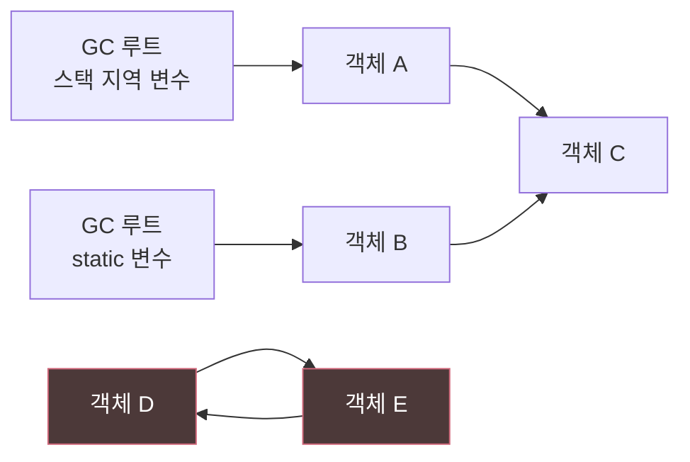
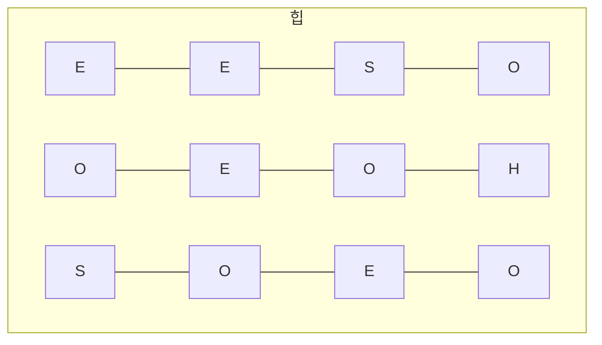
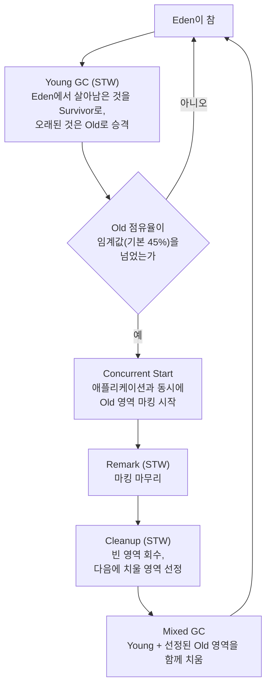

---

title: "Garbage Collector와 GC 로그 읽기"
date: 2023-10-10
categories: [Java, JVM]
tags: [JVM, GC, G1GC, ZGC, GCLog, STW]
layout: post
toc: true
math: true
mermaid: true

---

## 참고자료

- [Java 17 GC 튜닝 가이드 - Introduction](https://docs.oracle.com/en/java/javase/17/gctuning/introduction-garbage-collection-tuning.html)
- [Java 17 GC 튜닝 가이드 - G1 Garbage Collector](https://docs.oracle.com/en/java/javase/17/gctuning/garbage-first-g1-garbage-collector1.html)
- [Java 17 GC 튜닝 가이드 - G1 튜닝](https://docs.oracle.com/en/java/javase/17/gctuning/garbage-first-garbage-collector-tuning.html)
- [Java 17 GC 튜닝 가이드 - Z Garbage Collector](https://docs.oracle.com/en/java/javase/17/gctuning/z-garbage-collector.html)
- [Java 17 GC 튜닝 가이드 - Ergonomics](https://docs.oracle.com/en/java/javase/17/gctuning/ergonomics.html)
- [JEP 158: Unified JVM Logging](https://openjdk.org/jeps/158)
- [java 명령 레퍼런스 (Java 17)](https://docs.oracle.com/en/java/javase/17/docs/specs/man/java.html)

---

## 배경

GC는 알아서 도는 것이라 평소에는 신경 쓸 일이 없다. 그런데 응답 시간이 튀거나 컨테이너가 죽기 시작하면 여기부터 봐야 한다.

그때 답이 안 나오는 질문들이 있었다.

- GC가 정확히 무엇을 기준으로 "쓰지 않는 객체"라고 판단하는가? 참조 카운트를 세는가?
- Minor GC와 Major GC, Full GC는 어떻게 다른가? 섞어 쓰는 글이 많다.
- G1GC가 기본값이 된 이유가 무엇인가? 이전 것들과 뭐가 다른가?
- GC 로그를 켰는데 무슨 뜻인지 모르겠다. 어디를 봐야 문제인지 알 수 있는가?
- `System.gc()`를 부르면 GC가 도는가?

이전 글에서 [JVM의 메모리 구조](/posts/JVM-Internals/)를 정리했으므로, 여기서는 그 힙을 누가 어떻게 치우는지를 본다.

---

## 1. GC가 무엇을 지우는가

### 1.1 도달 가능성

첫 질문의 답이다. **참조 카운트를 세지 않는다.** 도달 가능성(reachability)으로 판단한다.

**GC 루트(GC root)** 라고 부르는 시작점들이 있다. 거기서부터 참조를 따라갈 수 있는 객체는 살아 있는 것으로 보고, 따라갈 수 없는 객체는 쓰레기로 본다.

GC 루트가 되는 것들이다.

- 실행 중인 스레드의 스택에 있는 지역 변수와 매개변수
- `static` 변수
- JNI 참조
- 실행 중인 스레드 객체 자체


```mermaid
flowchart LR
    R1["GC 루트<br/>스택 지역 변수"] --> A["객체 A"]
    R2["GC 루트<br/>static 변수"] --> B["객체 B"]
    A --> C["객체 C"]
    B --> C
    D["객체 D"] --> E["객체 E"]
    E --> D
    style D fill:#4c3939,stroke:#cf6679,color:#fff
    style E fill:#4c3939,stroke:#cf6679,color:#fff
```

**D와 E가 요점이다.** 서로를 참조하고 있으므로 참조 카운트는 각각 1이다. 참조 카운트 방식이었다면 절대 회수되지 않는다. 그런데 GC 루트에서 도달할 수 없으므로 도달 가능성 방식에서는 둘 다 쓰레기다.

서로 참조하는 객체 묶음이 통째로 고립된 것을 **고립된 섬(island of isolation)** 이라고 부른다. 도달 가능성 방식이 순환 참조를 자연스럽게 처리하는 이유다.

```java
public class Main {
    public static void main(String[] args) {
        Integer i = Integer.valueOf(4);
        i = null;   // 이 시점에 그 Integer 객체는 도달 불가능해진다
    }
}
```

### 1.2 GC가 하는 일의 순서

대부분의 GC는 이 순서로 동작한다.


```mermaid
flowchart LR
    M["1. Mark<br/>루트에서 도달 가능한 것 표시"] --> S["2. Sweep<br/>표시 안 된 것 회수"]
    S --> C["3. Compact<br/>남은 것을 한쪽으로 모음"]
```

**압축(compact)이 왜 필요한가.** 회수만 하면 메모리에 구멍이 뚫린다. 전체 여유 공간은 충분한데 연속된 공간이 없어서 큰 객체를 못 만드는 상황이 생긴다. 이것을 단편화(fragmentation)라고 하고, 압축은 살아남은 객체를 한쪽으로 몰아 연속된 빈 공간을 만든다.

압축에는 비용이 든다. 객체를 옮기면 그 객체를 가리키던 참조도 전부 고쳐야 한다. 그리고 **옮기는 동안 애플리케이션이 그 객체를 만지면 안 되므로 멈춰야 한다.**

### 1.3 Stop-The-World

**STW(Stop-The-World)** 는 GC 작업을 위해 애플리케이션 스레드를 전부 멈추는 것이다.

왜 필요한가. 애플리케이션이 계속 도는 동안 참조 관계가 바뀌면, 방금 살아 있다고 표시한 객체가 그 사이에 죽거나 그 반대가 될 수 있다. 정확성을 보장하려면 어느 시점에는 멈춰야 한다.

**GC 알고리즘의 역사는 이 멈춤을 줄여온 역사**다. 뒤에 나오는 컬렉터들의 차이가 대부분 여기서 나온다.

---

## 2. Minor, Major, Full

두 번째 질문이다. 용어가 섞여 쓰이는데 기준을 정하면 이렇다.

| 이름 | 대상 | 특징 |
|---|---|---|
| Minor GC (Young GC) | Young Generation만 | 자주 일어나고 빠르다 |
| Major GC | Old Generation | 드물게 일어나고 느리다 |
| Full GC | 힙 전체 + Metaspace | 가장 느리다. 대부분 긴 STW를 동반한다 |

**Major GC와 Full GC를 구분 없이 쓰는 자료가 많다.** 컬렉터마다 의미가 조금씩 다르기 때문이다. G1에서는 Old 영역만 따로 치우는 동작이 없고 Young과 Old를 섞어 치우는 Mixed GC가 있어서, "Major GC"라는 말이 잘 안 맞는다.

실무에서 중요한 것은 **Full GC가 떴는지**다. Full GC는 대체로 다른 방법으로 공간을 확보하지 못했을 때의 마지막 수단이고, 그래서 이게 반복되면 뭔가 잘못된 것이다.

---

## 3. 컬렉터들

### 3.1 Serial

단일 스레드로 모든 GC 작업을 한다. 스레드 간 조율 비용이 없어서 단순하고, 코어가 하나뿐이거나 힙이 아주 작은 환경에 맞는다.

```
-XX:+UseSerialGC
```

컨테이너에서 의도치 않게 이게 선택되는 경우가 있다. **JVM은 사용 가능한 CPU와 메모리를 보고 컬렉터를 자동으로 고르는데**, 컨테이너 CPU 한도가 낮으면 Serial이 선택된다. 뒤에 나올 GC 로그의 첫 줄에서 확인할 수 있다.

### 3.2 Parallel

Serial과 같은 알고리즘을 여러 스레드로 돌린다. STW가 있지만 그 시간이 짧아진다. **처리량(throughput)** 을 우선하는 선택이다.

```
-XX:+UseParallelGC
```

응답 시간보다 전체 처리량이 중요한 배치 작업에 맞는다.

### 3.3 G1

Java 9부터 기본값이다. 세 번째 질문의 답이 여기 있다.

**힙을 세대로 크게 나누는 대신 작은 영역(region)들로 잘게 나눈다.**


```mermaid
flowchart TB
    subgraph H["힙"]
        direction LR
        E1["E"] --- E2["E"] --- S1["S"] --- O1["O"]
        O2["O"] --- E3["E"] --- O3["O"] --- H1["H"]
        S2["S"] --- O4["O"] --- E4["E"] --- O5["O"]
    end
```

각 영역은 그때그때 역할이 정해진다.

| 영역 종류 | 무엇을 담는가 |
|---|---|
| Eden (E) | 새로 만들어진 객체 |
| Survivor (S) | Minor GC에서 살아남은 객체 |
| Old (O) | 오래 살아남은 객체 |
| Humongous (H) | 영역 크기의 50% 이상인 큰 객체 |

**영역으로 나눈 것이 왜 이득인가.** 전체를 한 번에 치우지 않고 **쓰레기가 많은 영역부터 골라서** 치울 수 있다. 이름의 Garbage-First가 그 뜻이다. 정해진 시간 안에 최대한 많은 쓰레기를 치우는 것을 목표로 삼는다.

그래서 G1은 **목표 멈춤 시간을 지정할 수 있다.**

```
-XX:MaxGCPauseMillis=200    # 기본값 200ms
```

이것은 목표이지 보장이 아니다. G1은 이 시간 안에 끝낼 수 있을 만큼만 영역을 골라 치운다.

#### G1의 동작 주기


```mermaid
flowchart TB
    S["Eden이 참"] --> Y["Young GC (STW)<br/>Eden에서 살아남은 것을 Survivor로,<br/>오래된 것은 Old로 승격"]
    Y --> C{"Old 점유율이<br/>임계값(기본 45%)을<br/>넘었는가"}
    C -->|"아니오"| S
    C -->|"예"| CS["Concurrent Start<br/>애플리케이션과 동시에<br/>Old 영역 마킹 시작"]
    CS --> RM["Remark (STW)<br/>마킹 마무리"]
    RM --> CU["Cleanup (STW)<br/>빈 영역 회수,<br/>다음에 치울 영역 선정"]
    CU --> MX["Mixed GC<br/>Young + 선정된 Old 영역을 함께 치움"]
    MX --> S
```

용어 몇 개를 풀어둔다.

**IHOP(Initiating Heap Occupancy Percent).** Old 영역 점유율이 이 값을 넘으면 동시 마킹을 시작한다. 기본 45%다. 너무 높게 잡으면 마킹이 끝나기 전에 힙이 차서 Full GC가 나고, 너무 낮게 잡으면 불필요한 마킹이 자주 돈다.

**동시 마킹(concurrent marking).** 애플리케이션을 멈추지 않고 도달 가능한 객체를 표시하는 작업이다. 멈추지 않으므로 표시하는 동안 참조가 바뀔 수 있는데, 이걸 처리하는 방식이 SATB다.

**SATB(Snapshot-At-The-Beginning).** 마킹 시작 시점의 상태를 기준으로 삼고, 그 뒤에 바뀌는 참조는 따로 기록해두었다가 나중에 반영한다. 시작 시점에 살아 있던 것은 이번 주기에서 회수하지 않는다. 안전한 쪽으로 판단하는 것이다.

**Remembered Set.** 다른 영역에서 이 영역을 가리키는 참조 목록이다. 영역 하나만 치우려면 그 영역을 누가 가리키고 있는지 알아야 하는데, 전체를 훑지 않고 이 목록만 보면 된다. 영역별 수집이 가능한 이유가 이것이다.

**Humongous 객체.** 영역 크기의 절반을 넘는 객체는 연속된 여러 영역에 걸쳐 저장된다. 이런 객체는 Young을 거치지 않고 바로 Old에 들어가고, 회수도 특별하게 처리된다. **큰 배열을 자주 만드는 코드가 있으면 이 영역이 늘어나면서 Full GC를 유발할 수 있다.**

#### 주요 옵션

| 옵션 | 의미 | 기본값 |
|---|---|---|
| `-XX:G1HeapRegionSize` | 영역 크기 | 힙 크기에 따라 자동 (1MB~32MB) |
| `-XX:MaxGCPauseMillis` | 목표 멈춤 시간 | 200ms |
| `-XX:InitiatingHeapOccupancyPercent` | 동시 마킹 시작 임계값 | 45 |
| `-XX:G1NewSizePercent` | Young 최소 비율 | 5 |
| `-XX:G1MaxNewSizePercent` | Young 최대 비율 | 60 |
| `-XX:G1HeapWastePercent` | Mixed GC를 멈출 낭비 비율 | 5 |

**Young 크기를 직접 고정하지 않는 것**이 G1의 전제다. `-Xmn`으로 Young 크기를 고정하면 G1이 목표 멈춤 시간에 맞춰 조절할 여지가 사라진다. 공식 튜닝 가이드도 이를 권하지 않는다.

#### Evacuation Failure

G1은 살아남은 객체를 다른 영역으로 **복사**해서 치운다. 그런데 복사할 빈 영역이 부족하면 실패한다. 이것을 Evacuation Failure라고 하고, 이때 G1은 Full GC로 넘어간다.

로그에서 `to-space exhausted`가 보이면 이 상황이다. 대응은 힙을 늘리거나, IHOP을 낮춰 마킹을 더 일찍 시작하거나, 큰 객체 할당을 줄이는 것이다.

### 3.4 ZGC

Java 11에 실험적으로 들어왔고 Java 15부터 정식이다. **멈춤 시간을 힙 크기와 무관하게 유지하는 것**이 목표다.

멈춤 시간이 밀리초 단위로 짧고, 힙이 커져도 그 시간이 늘어나지 않는다. 대신 처리량을 일부 내준다.

```
-XX:+UseZGC
```

응답 시간이 중요하고 힙이 큰 경우에 고른다. 반대로 배치처럼 처리량이 중요하면 Parallel이나 G1이 낫다.

### 3.5 무엇을 고를 것인가

| 상황 | 선택 |
|---|---|
| 힙이 작고 코어가 하나 | Serial |
| 처리량이 중요하고 멈춤 시간은 상관없음 | Parallel |
| 일반적인 서버 애플리케이션 | G1 (기본값) |
| 힙이 크고 응답 시간이 중요 | ZGC |

**기본값을 바꾸기 전에 측정부터 한다.** GC 옵션을 바꿔서 좋아졌다고 말하려면 바꾸기 전 숫자가 있어야 한다. 다음 장이 그 숫자를 얻는 방법이다.

---

## 4. GC 로그 읽기

### 4.1 로그 켜기

Java 9부터 통합 로깅 체계로 바뀌었다. 예전의 `-XX:+PrintGCDetails` 계열 옵션은 `-Xlog`로 대체됐다.

```bash
java -Xlog:gc*:file=gc.log:time,tags:filecount=5,filesize=10m -jar app.jar
```

옵션을 나눠서 보면 이렇다.

| 부분 | 의미 |
|---|---|
| `gc*` | `gc`로 시작하는 모든 태그를 남긴다 |
| `file=gc.log` | 파일로 출력 |
| `time,tags` | 각 줄에 시각과 태그를 붙인다 |
| `filecount=5,filesize=10m` | 10MB씩 5개까지 회전 |

**파일 회전을 반드시 넣는다.** 안 넣으면 GC 로그가 계속 커져서 디스크를 채운다.

컨테이너에서는 로그 경로를 별도 볼륨으로 빼거나 표준 출력으로 내보내는 편이 낫다.

### 4.2 시작 부분

애플리케이션이 뜰 때 나오는 부분이다. 여기만 봐도 알 수 있는 것이 많다.

```text
[2024-03-15T08:27:48.454+0000][gc] Using Serial
[2024-03-15T08:27:48.454+0000][gc,init] Version: 17.0.10+8-LTS (release)
[2024-03-15T08:27:48.454+0000][gc,init] CPUs: 1 total, 1 available
[2024-03-15T08:27:48.454+0000][gc,init] Memory: 949M
[2024-03-15T08:27:48.454+0000][gc,init] Heap Min Capacity: 8M
[2024-03-15T08:27:48.454+0000][gc,init] Heap Initial Capacity: 16M
[2024-03-15T08:27:48.454+0000][gc,init] Heap Max Capacity: 238M
[2024-03-15T08:27:48.454+0000][gc,init] Compressed Oops: Enabled (32-bit)
[2024-03-15T08:27:48.454+0000][gc,init] Large Page Support: Disabled
[2024-03-15T08:27:48.454+0000][gc,init] NUMA Support: Disabled
[2024-03-15T08:27:48.454+0000][gc,init] Pre-touch: Disabled
```

**`Using Serial`이 첫 번째로 확인할 것이다.** 서버 애플리케이션인데 Serial이 선택됐다면 대체로 의도한 것이 아니다. 3.1절에서 본 대로 JVM이 가용 CPU와 메모리를 보고 고르기 때문이다.

`CPUs: 1 total, 1 available`과 `Memory: 949M`이 그 근거다. 컨테이너 CPU 한도가 낮게 잡혀서 JVM이 이 환경을 작은 머신으로 판단했다.

**여기서 실무 문제가 하나 나온다.** 컨테이너에 CPU limit을 걸면 JVM이 그 값을 보고 GC 스레드 수와 컬렉터 선택을 정한다. 그래서 CPU limit을 낮게 잡는 것이 GC 동작까지 바꾼다.

```bash
# JVM이 인식한 값 확인
java -XX:+PrintFlagsFinal -version | grep -E "UseG1GC|UseSerialGC|ParallelGCThreads|MaxHeapSize"
```

나머지 줄들도 짚어둔다.

**`Compressed Oops: Enabled`.** Oops는 객체 참조를 뜻한다. 힙이 32GB 미만이면 참조를 64비트 대신 32비트로 압축해 메모리를 아낀다. 힙을 32GB 근처로 잡으면 이 압축이 꺼져서, **힙을 늘렸는데 오히려 담을 수 있는 객체가 줄어드는** 역전이 생긴다. 32GB를 넘길 거면 훨씬 크게 잡아야 이득이 난다.

**`Pre-touch: Disabled`.** 켜면 JVM 시작 시 힙 페이지를 미리 만져서 실제 메모리에 올린다. 시작이 느려지는 대신 실행 중 페이지 폴트로 인한 지연이 줄어든다.

**`Heap Min/Initial/Max`.** 이전 글에서 본 대로 Initial과 Max를 같게 잡으면 확장으로 인한 멈춤이 없어진다.

### 4.3 GC 이벤트

```text
[2024-03-15T08:27:48.702+0000][gc,start    ] GC(0) Pause Young (Allocation Failure)
[2024-03-15T08:27:48.704+0000][gc,heap     ] GC(0) DefNew: 3882K(4928K)->512K(4928K) Eden: 3882K(4416K)->0K(4416K) From: 0K(512K)->512K(512K)
[2024-03-15T08:27:48.704+0000][gc,heap     ] GC(0) Tenured: 0K(10944K)->568K(10944K)
[2024-03-15T08:27:48.704+0000][gc,metaspace] GC(0) Metaspace: 868K(960K)->868K(960K)
[2024-03-15T08:27:48.704+0000][gc          ] GC(0) Pause Young (Allocation Failure) 3M->1M(15M) 2.428ms
[2024-03-15T08:27:48.704+0000][gc,cpu      ] GC(0) User=0.00s Sys=0.00s Real=0.00s
```

한 줄의 구조가 이렇다.

```
[발생 시각] [태그] GC(번호) 내용
```

`GC(0)`의 `0`이 GC 주기 번호다. 같은 번호가 붙은 줄들이 하나의 GC 이벤트를 이룬다.

**요약 줄이 가장 중요하다.**

```
GC(0) Pause Young (Allocation Failure) 3M->1M(15M) 2.428ms
      └────────┬────────┘└──────┬─────┘ └──┬──┘└─┬─┘ └──┬───┘
        GC 종류와 원인          GC 전   GC 후 전체힙  걸린 시간
```

읽는 법이다.

- `Pause Young`: Young 영역만 치운 STW GC
- `Allocation Failure`: 객체를 할당하려는데 공간이 없어서 촉발됨. 정상적인 이유다
- `3M->1M(15M)`: 전체 힙 사용량이 3MB에서 1MB로 줄었고, 전체 힙 크기는 15MB
- `2.428ms`: 이 GC가 걸린 시간

`gc,heap` 줄은 영역별 상세다.

```
Eden: 3882K(4416K)->0K(4416K)    Eden이 비워졌다 (정상)
From: 0K(512K)->512K(512K)       살아남은 것이 Survivor로 갔다
Tenured: 0K(10944K)->568K(10944K) 일부가 Old로 승격됐다
```

`gc,cpu` 줄의 세 숫자도 짚어둔다.

| 값 | 의미 |
|---|---|
| `User` | GC 스레드가 사용자 모드에서 쓴 CPU 시간 총합 |
| `Sys` | 커널 모드에서 쓴 CPU 시간 |
| `Real` | 실제 경과 시간. **이것이 STW 시간이다** |

**`Real`이 `User`보다 크면 뭔가 이상하다.** GC 스레드가 CPU를 못 받고 기다렸다는 뜻이다. 컨테이너 CPU throttling이나 다른 프로세스와의 경합을 의심한다. 반대로 `User`가 `Real`보다 훨씬 크면 여러 GC 스레드가 병렬로 돈 것이라 정상이다.

### 4.4 무엇을 보면 문제인가

로그에서 확인할 지점을 정리하면 이렇다.

**GC 후에도 힙이 안 줄어드는가.**

```
GC(50) Pause Full 900M->880M(1024M) 3200ms
```

Full GC를 했는데 20MB밖에 못 줄였다. 살아 있는 객체가 그만큼 많다는 뜻이고, 메모리 누수이거나 힙이 부족한 것이다. 이 패턴이 반복되면 곧 `OutOfMemoryError`가 난다.

**Full GC가 반복되는가.** Full GC는 마지막 수단이다. 몇 분에 한 번씩 뜨면 정상이 아니다.

**멈춤 시간이 목표를 크게 넘는가.** G1에 200ms를 지정했는데 로그에 2초짜리가 계속 나오면 목표를 못 지키고 있는 것이다.

**`to-space exhausted`가 보이는가.** 3.3절의 Evacuation Failure다.

**Humongous 할당이 잦은가.** `gc,heap` 태그에서 humongous 영역 수가 계속 늘어나면 큰 객체 할당을 의심한다.

**GC 빈도가 갑자기 늘었는가.** 배포 직후에 그렇다면 새 코드가 객체를 더 많이 만드는 것이다.

### 4.5 로그 말고 볼 것

로그는 사후 분석용이다. 실시간으로는 다른 도구를 쓴다.

```bash
# GC 통계 (1초마다 10번)
jstat -gc <pid> 1000 10

# 힙 사용량 요약
jcmd <pid> GC.heap_info

# 클래스별 인스턴스 수 (누수 후보 찾기)
jcmd <pid> GC.class_histogram | head -20

# 힙 덤프 (분석 도구로 열어본다)
jcmd <pid> GC.heap_dump /tmp/heap.hprof
```

`GC.class_histogram`이 누수를 좁힐 때 유용하다. 시간을 두고 두 번 찍어서 늘어난 클래스를 보면 후보가 나온다.

운영 환경에서는 이걸 메트릭으로 뽑아 대시보드에 올려두는 편이 낫다. JVM은 GC 관련 지표를 표준으로 노출하므로 수집기가 그대로 가져갈 수 있다.

| 지표 | 무엇을 보는가 |
|---|---|
| GC 소요 시간의 합 | 시간당 GC에 쓴 시간. 급증하면 이상 |
| GC 실행 횟수 | 빈도 변화 |
| 힙 사용량 / 힙 최대값 | 사용률 추이 |
| GC 후 Old 영역 사용량 | 이 값이 계속 올라가면 누수 신호 |

**마지막 것이 누수 탐지에 제일 직접적이다.** GC를 하고 나서도 Old 영역이 회복되지 않고 우상향하면 회수되지 않는 객체가 쌓이고 있는 것이다.

---

## 5. System.gc()

마지막 질문이다.

**부른다고 GC가 도는 것이 아니다.** 이 메서드는 "GC를 하면 좋겠다"는 **요청**이고, JVM은 무시할 수 있다. Javadoc도 이를 제안(suggests)이라고 표현한다.

```java
System.gc();
Runtime.getRuntime().gc();   // 위와 사실상 같다
```

그리고 **운영 코드에서 부르면 안 된다.** 이유가 둘이다.

**대부분 Full GC를 유발한다.** 컬렉터가 알아서 최적 시점에 하려던 것을 강제로 지금 하게 만들고, 그것도 가장 비싼 방식으로 한다.

**실제로 무시될 수도 있다.** `-XX:+DisableExplicitGC` 옵션이 걸려 있으면 아무 일도 안 일어난다. 그래서 이 호출에 의존하는 코드는 환경에 따라 다르게 동작한다.

애플리케이션 서버에서 이 옵션을 걸어두는 관행이 있는 것도 이 때문이다. 라이브러리 어딘가가 `System.gc()`를 부르면서 예측 못 한 Full GC를 유발하는 것을 막는다.

`finalize()`도 함께 짚어둔다. 객체가 회수되기 직전에 호출되는 메서드인데, **Java 9에서 폐기 예정으로 표시됐고 Java 18에서 기본 비활성화됐다.** 호출 시점이 보장되지 않고 아예 안 불릴 수도 있어서 자원 정리에 쓸 수 없다. 자원 정리는 `try-with-resources`와 `AutoCloseable`을 쓴다.

---

## 6. 힙 크기를 정할 때

### Young과 Old의 비율

Young을 크게 잡으면 Minor GC가 덜 자주 일어나지만 한 번에 걸리는 시간이 늘어난다. Old를 크게 잡으면 승격된 객체를 더 오래 담을 수 있지만 Young이 좁아져 Minor GC가 잦아진다.

공식 가이드가 권하는 순서는 이렇다.

1. 먼저 최대 힙 크기를 정한다. **시스템 물리 메모리보다 작아야 한다.** 넘으면 스와핑이 일어나고, 스와핑 중에 GC가 돌면 멈춤 시간이 극단적으로 길어진다.
2. Old 영역이 살아 있는 데이터 전부와 여유(10~20% 이상)를 담을 만큼은 확보한다.
3. 남는 만큼을 Young에 준다.

G1을 쓴다면 3.3절에서 말한 대로 Young 크기를 직접 고정하지 않는다. 목표 멈춤 시간만 주고 나머지는 맡긴다.

### 컨테이너에서

이전 글에서 본 내용이 여기서 다시 나온다. **컨테이너 메모리 한도는 힙보다 커야 한다.** Metaspace, 스레드 스택, 코드 캐시, GC 자료구조가 힙 밖에 있다.

```
# 컨테이너 한도에 비례해서 힙을 잡는다
-XX:MaxRAMPercentage=75.0
```

그리고 **스와핑을 아예 막는 것**이 중요하다. GC가 스왑된 페이지를 만지면 멈춤 시간이 몇 초 단위로 늘어난다. 노드에서 스왑을 끄는 것이 기본이다.

실제로 스왑과 GC가 겹쳐 응답 시간이 튀는 사고를 겪고 나서, 노드 스왑 비활성화와 컨테이너 메모리 한도 설계를 함께 정리했다.

---

## 정리하며

처음 던진 질문들에 대한 답이다.

**GC는 무엇을 기준으로 판단하는가.** 참조 카운트가 아니라 도달 가능성이다. GC 루트에서 참조를 따라갈 수 있으면 살아 있는 것으로 본다. 그래서 서로 참조하는 고립된 객체 묶음도 회수된다.

**Minor, Major, Full의 차이.** 대상 영역이 다르다. Young만이면 Minor, Old를 포함하면 Major, 힙 전체와 Metaspace까지면 Full이다. G1에서는 Old만 따로 치우지 않고 Mixed GC로 섞어 치우므로 Major라는 말이 잘 안 맞는다.

**G1이 기본값이 된 이유.** 힙을 작은 영역들로 나눠서 쓰레기가 많은 곳부터 골라 치울 수 있고, 그래서 목표 멈춤 시간을 지정할 수 있기 때문이다. 힙이 커져도 한 번에 치우는 양을 조절할 수 있다.

**GC 로그에서 어디를 봐야 하는가.** 시작 부분에서 어떤 컬렉터가 선택됐는지, 그리고 각 이벤트의 요약 줄에서 GC 전후 힙 사용량과 걸린 시간을 본다. GC 후에도 힙이 안 줄어드는 패턴, Full GC 반복, 목표를 크게 넘는 멈춤 시간이 문제 신호다.

**`System.gc()`를 부르면 GC가 도는가.** 요청일 뿐이고 무시될 수 있다. 그리고 부르면 대체로 Full GC가 나므로 운영 코드에서는 쓰지 않는다.

정리하면서 가장 크게 바뀐 감각은 **GC 설정이 컨테이너 설정과 분리되지 않는다**는 것이었다. CPU 한도가 컬렉터 선택을 바꾸고, 메모리 한도가 힙 밖 영역까지 감당해야 하고, 스왑 설정이 멈춤 시간을 좌우한다. JVM 옵션만 따로 튜닝해서는 답이 안 나온다.
