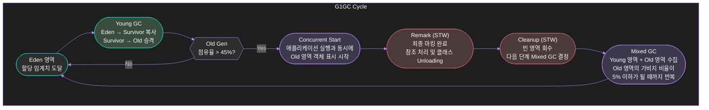

---

title: Garbage Collector 톺아보기
date: 2023-10-10
categories: [Garbage-Collector]
tags: [Garbage-Collector]
layout: post
toc: true
math: true
mermaid: true

---

[Oracle G1GC](https://docs.oracle.com/en/java/javase/17/gctuning/garbage-first-g1-garbage-collector1.html#GUID-98E80C82-24D8-41D4-BC39-B2583F04F1FF)

[Weekly Java: 트래픽이 많이 몰리는 이벤트가 예정되어 있을 때, Young Gen과 Old Gen의 비율 고민하기](https://sigridjin.medium.com/weekly-java-%ED%8A%B8%EB%9E%98%ED%94%BD%EC%9D%B4-%EB%A7%8E%EC%9D%B4-%EB%AA%B0%EB%A6%AC%EB%8A%94-%EC%9D%B4%EB%B2%A4%ED%8A%B8%EA%B0%80-%EC%98%88%EC%A0%95%EB%90%98%EC%96%B4-%EC%9E%88%EC%9D%84-%EB%95%8C-young-gen%EA%B3%BC-old-gen%EC%9D%98-%EB%B9%84%EC%9C%A8-%EA%B3%A0%EB%AF%BC%ED%95%98%EA%B8%B0-3adfeca388af)

[Jdk-17 Specification](https://blogs.oracle.com/javamagazine/post/java-jdk-17-generally-available)

[JDK-17 GC Tuning Guide](https://docs.oracle.com/en/java/javase/17/gctuning/ergonomics.html#GUID-DA88B6A6-AF89-4423-95A6-BBCBD9FAE781)

[DZone](https://dzone.com/articles/jvm-architecture-explained)

[Oracle UnderStanding GC](https://blogs.oracle.com/javamagazine/post/understanding-garbage-collectors)

[Oracle GC Tuning Document](https://docs.oracle.com/en/java/javase/17/gctuning/garbage-first-garbage-collector-tuning.html)

---

# JVM Garbage Collector

Java 코드는 JVM 에 의해 ByteCode로 컴파일된다. Java 프로그램이 JVM 에서 실행될 때 객체는 Heap에 저장되고 일부 객체들은 더 이상 힙에 존재할 필요가 없어질 때가 오게 된다. 이때 Garbage Collector가 사용되지 않는 객체들을 찾아 제거한다.

Garbage Collector 은 Heap 영역을 살펴보고 사용 중인 객체와 사용하지 않는 객체를 식별한다. 이 중 사용하지 않는 객체에 해당되는 요소들은 삭제한다.

사용 중인 객체는 포인터가 유지되고 있지만 사용 중이지 않은 객체는 어떤 부분에서도 포인터가 존재하지 않는다.

---

# JVM 메모리 구성과 GC의 기본 개념

## JVM 힙 영역의 구분


### Young Generation
새로 생성된 객체는 Young Generation 에서 시작한다. 모든 객체가 시작되는 1개의 Eden 공간과 Garbage Collector Cycle 에서 살아남은 후 Eden 공간에서 살아남은 객체들이 이동하는 공간인 2개의 Survivor 공간이 있다.

### Old Generation
수명이 긴 객체는 Young Generation 에서 Old Generation 으로 이동된다. Old Generation 에서 Garbage Collected 가 되었을 때, 가장 우선순위가 높게 처리되는 공간이다.

### Permanent Generation (Metaspace)
클래스 및 메서드와 같은 메타데이터가 저장되는 장소이다.

추가적으로, `Java 8 에 들어오면서, Permanent Generation 이 사라지고 Metaspace 영역이 생겼다.`

`Permanent Generation` 은 `JVM 에 의해서 Heap 영역의 메모리 크기가 강제되던 영역`이였다.

하지만 `Metaspace 가 Native 메모리 영역`에 배치되면서, `운영체제가 자동으로 그 크기를 조절`할 수 있게 되고, `Heap 에서 사용할 수 있는 메모리의 크기가 늘어나게 됐다.`

---

# GC의 핵심 개념

## Unreachable Objects - 도달 할 수 없는 객체
객체에 관한 참조가 포함되어 있지 않으면 객체에 도달 할 수 없다 라고 한다.

```java
public class Main {
    public static void main(String[] args) {
        Integer i = new Integer(4);
        i = null;
    }
}
```

위 코드를 보면, `Integer 4`를 대입했을 때는, 참조가 가능하지만 null 을 할당한 순간, 메모리를 참조할 수 없기 때문에 Unreachable 하다고 보는 것이다.

## Eligibility for Garbage Collector - GC 자격
위 코드를 보면, `Integer 4`를 위한 공간을 할당해 줬지만 `i = null` 이라는 구문 이후 에는 그 공간이 쓸모 없게 되는 것이다. 이 공간을 GC에 적합하다고 한다.

## GC 상태

### Minor/Incremental
Young Generation 에서 객체가 제거 되었다는 것을 말하는 유형이다.

### Major/Full
Minor Garbage Collector 에서 살아남은 객체를 Old 로 옮긴다. Old 에서는 GC 대상이 덜 자주 발생하게 된다.

---

# GC - Serial Collector (첫 등장 - JDK 1)

Serial Collector는 단일 스레드를 사용하여 모든 가비지 수집 작업을 수행하여 스레드 간 통신 오버헤드가 없기 때문에 상대적으로 효율적이다.

다중 프로세서 하드웨어를 활용할 수 없기 때문에 단일 프로세서 시스템에 가장 적합하며 특정 하드웨어 및 운영 체제 구성에서 기본적으로 선택되거나 `-XX:+UseSerialGC`옵션을 사용하여 명시적으로 활성화할 수 있다.

---

# GC - Parallel Collector (첫 등장 - JDK 6)

Parallel Collector는 Throughput Collector 라고도 하며 Serial Collctor와 유사하다.

Serial Collector와 Parallel Collector의 주요 차이점은 Parallel Collector에는 가비지 수집 속도를 높이는 데 사용되는 여러 스레드가 있다는 것이다.

Parallel Collector는 다중 프로세서 또는 다중 스레드 하드웨어에서 실행되는 중대형 데이터 세트가 있는 애플리케이션을 위한 것으로 `-XX:+UseParallelGC.`옵션을 사용하여 활성화할 수 있다.

---

# GC - Garbage-First (G1) Garbage Collector (첫 등장 - JDK 7)

현재 LTS 17 버전의 기본 값으로 지정되어있다.

하드웨어가 발전되면서 Java 애플리케이션에 사용할 수 있는 메모리의 크기도 점차 커져갔다. 큰 힙 메모리에서 짧은 GC 시간을 보장하는데 그 목적을 둔다.

주요 특징
- 대규모 힙 메모리(수십 GB 이상)를 효율적으로 관리
- Stop-the-World 시간을 최소화 (기본 목표 200ms)
- 전체 힙의 50% 이상이 라이브 데이터인 경우에 최적화
- 높은 처리량과 짧은 지연 시간의 균형을 목표

## G1GC - 메모리 구조

JVM 힙은 2048개의 Region으로 나뉠 수 있으며, 각 Region의 크기는 1MB ~ 32MB 사이로 지정될 수 있다. (-XX:G1HeapRegionSize로 설정)

```mermaid
%%{
  init: {
    'theme': 'dark',
    'themeVariables': {
      'primaryColor': '#bb86fc',
      'primaryTextColor': '#fff',
      'primaryBorderColor': '#9965f4',
      'lineColor': '#bb86fc',
      'secondaryColor': '#03dac6',
      'tertiaryColor': '#cf6679'
    }
  }
}%%
graph TB
    subgraph JVM 힙 메모리 구조
        A[힙 메모리<br>최대 2048개 Region<br>Region 크기: 1MB - 32MB]
    end

    subgraph Region 종류
        B([Eden Region<br>새로 생성된 객체 할당])
        C([Survivor Region<br>GC 후 살아남은 Young 객체])
        D([Old Region<br>오래 생존한 객체들])
        E([Humongous Region<br>Region 크기 50% 이상의 객체])
    end

    subgraph 메모리 구조
        R1(E) --- R2(E) --- R3(E) --- R4(E)
        R1 --- R5(S) --- R6(O) --- R7(O)
        R2 --- R6
        R3 --- R7
        R4 --- R8(E)
        R5 --- R9(S) --- R10(O) --- R11(H)
        R6 --- R10
        R7 --- R11
        R8 --- R12(E)
        R9 --- R13(O) --- R14(O) --- R15(O)
        R10 --- R14
        R11 --- R15
        R13 --- R16(E)
        R14 --- R16
        R15 --- R16

        classDef eden fill:#394c3d,stroke:#03dac6
        classDef survivor fill:#3d4c39,stroke:#03dac6
        classDef old fill:#4c3939,stroke:#cf6679
        classDef humongous fill:#3d394c,stroke:#bb86fc

        class R1,R2,R3,R4,R8,R12,R16 eden
        class R5,R9 survivor
        class R6,R7,R10,R13,R14,R15 old
        class R11 humongous
    end

    style A fill:#2d2d2d,stroke:#bb86fc
    style B fill:#394c3d,stroke:#03dac6
    style C fill:#3d4c39,stroke:#03dac6
    style D fill:#4c3939,stroke:#cf6679
    style E fill:#3d394c,stroke:#bb86fc
```



## G1GC - 각 Region의 의미

- Eden Region: 새로 생성된 객체 저장
- Survivor Region: Minor GC에서 살아남은 객체 저장
- Old Region: 오래 생존한 객체 저장
- Humongous Region: 큰 객체(Region 크기의 50% 이상) 저장

## G1GC - 동작 방식



## G1GC - Young-Only Phase

### 1-1. Young-Only Phase : Eden Region이 가득 차면 Young GC 발생
Eden Region의 살아있는 객체를 Survivor Region으로 복사하고 오래 살아남은 객체는 Old Region으로 승격한다. 비워진 Eden Region은 재사용 가능한 상태가 된다.

### 1-2. Old Generation 점유율 모니터링

IHOP(Initiating Heap Occupancy) 임계값(기본 45%) 체크하여

- 초과 시 Concurrent Marking 단계로 진입한다.
- 미만 시 Young-Only 단계 계속 유지한다.

---

### 2. Young-Only Phase : Concurrent Start(Marking)

Old Generation의 객체들의 도달성을 판단하는 단계이다.

### 2-1. SATB(Snapshot-At-The-Beginning) 알고리즘 사용

마킹 시작 시점의 객체 스냅샷 생성한 후 마킹 도중 변경되는 참조 정보는 SATB 큐에 기록한다.

### 2-2. 동시 마킹 작업

애플리케이션 실행과 병행하여 처리한다. Remember Set을 통해 Region 간의 참조 관계를 추적한다. Young GC는 이 단계에서도 계속 발생 가능하다.

---

### 3. Young-Only Phase : Remark (Stop The World가 발생한다.)

마킹 작업을 완료하고 실제 회수 대상을 확정하는 단계이다.

### 3-1. 마킹 완료 작업

SATB 큐에 남은 참조를 처리하고 최종적인 객체 도달성 분석 완료한다.

### 3-2. 글로벌 참조 처리

모든 Region의 Remember Set을 갱신하고 참조 관계 최종 확정한다.

### 3-3. 클래스 Unloading

더 이상 사용되지 않는 클래스의 메타데이터를 제거하고 Metaspace 영역을 정리한다.

### 3-4. 회수 대상 분석

Region별 Live Object 비율 계산하고 회수 우선순위 결정을 위한 데이터를 수집한다.

---

### 4. Young-Only Phase : Clean Up (Stop The World가 발생한다.)

수집된 정보를 바탕으로 실제 회수 계획을 수립한다.

### 4-1. 빈 Region 회수

살아있는 객체가 전혀 없는 Region 즉시 회수, Free Region 리스트에 추가

### 4-2. Mixed GC(Minor/Major GC) 계획 수립

Region의 Live Object 비율과 GC 효율성 고려하여 Collection Set 후보 Region 선정하며 GC 예상 시간을 계산한다.

그리고 이전 단계들에서 계산한 공간을 실제로 정리할 것인지 결정하고 실행하며 Mixed GC 수행 여부를 결정한다.

---

## G1GC - Space-Reclamation Phase

이전 과정에서 계산했던 Old Generation의 영역 중 여유 공간이 있다면 공간을 회수한다. (Mixed GC(Minor/Major GC))

이 과정은 다음과 같은 특징을 가진다.
- Young Region과 선택된 Old Region의 라이브 객체를 새로운 Region으로 복사
- G1HeapWastePercent(기본값 5%) 이하로 남을 때까지 반복
- 복사할 공간이 부족한 경우 Evacuation Failure가 발생할 수 있음

### 주요 동작 과정

Mixed Collection을 수행한다.

- Young Generation 전체와 Old Generation의 일부 Region을 대상으로 수행한다.
- 이전 Marking 단계에서 선정된 Collection Set의 Old Region들을 처리한다.

### 종료 조건

- 더 이상의 Old Region 복사가 충분한 공간 확보에 효과적이지 않다고 판단될 때
- G1HeapWastePercent 임계값에 도달했을 때

### 페이즈 종료 후

Space-Reclamation Phase가 종료되면 다시 Young-Only Phase로 돌아가는 것으로 전체 GC 사이클이 새로 시작된다.

### GC과정 중 비상 상황 처리

Liveness 정보 수집 중 메모리 부족 발생 시 다른 컬렉터들처럼 Stop-The-World Full GC를 수행하며 전체 힙에 대해 in-place 컴팩션을 진행한다.

### 주요 튜닝 매개변수

- -XX:G1HeapRegionSize: Region 크기 설정 (1MB-32MB)
- -XX:MaxGCPauseMillis: 최대 GC 중지 시간 목표 (기본값 200ms)
- -XX:G1NewSizePercent: Young 세대 최소 비율 (기본값 5%)
- -XX:G1MaxNewSizePercent: Young 세대 최대 비율 (기본값 60%)
- -XX:InitiatingHeapOccupancyPercent: IHOP 초기값 (기본값 45%)

---

# ZGC (첫 등장 - JDK 11)

ZGC(Z Garbage Collector)는 Stop-The-World가 가장 짧은 확장 가능한 Garbage Collector다.

ZGC는 애플리케이션 스레드 실행을 중단하지 않고 비용이 많이 드는 모든 작업을 동시에 수행한다.

ZGC는 몇 밀리초의 Stop-The-World을 가지지만 이로 인해 일부 처리량이 희생됩니다. 적은 시간의 Stop-The-World 필요한 애플리케이션을 위한 것입니다.

Stop-The-World 지속시간은 사용 중인 힙 크기와 무관하며. ZGC는 8MB에서 16TB까지의 힙 크기를 지원한다. `-XX:+UseZGC`

---

# GC 적용 시 고려사항

## Young Generation
- 먼저 JVM에 제공할 수 있는 최대 힙 크기를 결정한다.
    - 그런 다음 최적의 설정을 찾기 위해 Young Generation 규모에 대한 성능 지표를 구성한다.

- 과도한 페이지 오류 및 스래싱을 방지하려면 최대 힙 크기는 항상 시스템에 설치된 메모리 양보다 작아야한다.

- 총 힙 크기가 고정된 경우 Young Generation 크기를 늘리려면 Old Generation 크기를 줄여야 한다.
    - 특정 시간에 애플리케이션에서 사용하는 모든 라이브 데이터와 일정량의 여유 공간(10~20% 이상)을 보유할 수 있을 만큼 이전 세대를 충분히 크게 유지해야한다.

## Old Generation
- 되도록 Yong Generation에 많은 공간을 할당하는 것이 좋다.

---

# GC 관련 유용한 Java 코드 예제

## GC 대상으로 만드는 방법
1. 참조 변수를 Null 할당이 가능하도록 한다.
2. 참조 변수를 재할당 한다.
3. 메서드 내에 객체를 생성한다.
4. Isolation Island 를 활용한다.

## JVM 에 GC 를 실행시키도록 하는 방법
1. `System.gc()` 메서드를 사용하여 JVM 에 GC 를 실행하도록 하는 Static 메서드를 실행 시킨다.
2. `Runtime.getRuntime().gc()` 메서드를 사용하여 GC 를 요청할 수 있다.

또한 `System.gc()` 는 `Runtime.getRuntime().gc()` 와 사실상 동일한 요청이다.

## GC 실행 예제 코드
```java
class Person {
    private String name;
    private static int count = 0;

    public Person(String name) {
        this.name = name;
        count++;
        System.out.println("생성된 Person 객체 수: " + count);
    }

    // finalize는 Java 9부터 deprecated 되었지만, GC 동작을 보여주기 위해 사용
    @Override
    protected void finalize() {
        count--;
        System.out.println(name + " 객체가 제거됨");
        System.out.println("남은 Person 객체 수: " + count);
    }
}

public class GCExample {
    public static void main(String[] args) {
        // 객체 생성
        Person p1 = new Person("Kim");
        Person p2 = new Person("Lee");

        // GC 대상 만들기
        p1 = null;  // Kim 객체는 이제 접근 불가능

        // GC 실행 요청
        System.gc();

        // GC 완료 대기
        System.runFinalization();

        System.out.println("프로그램 종료");
    }
}
```

