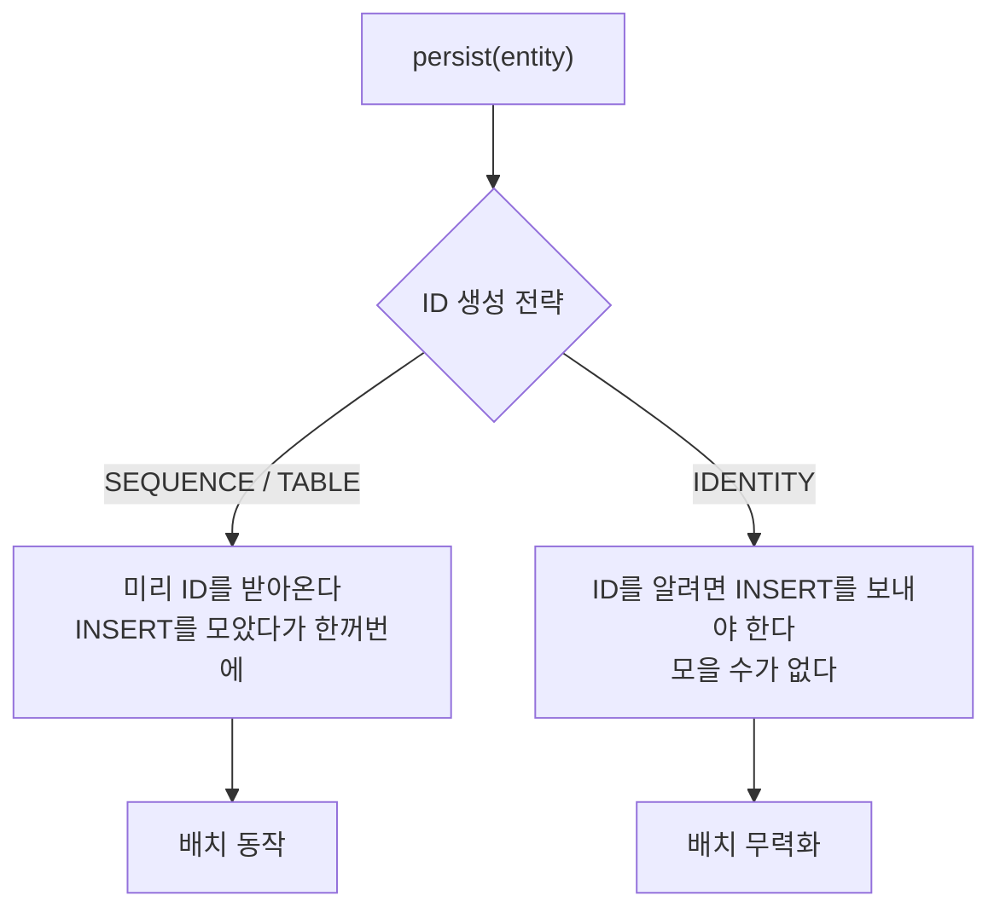
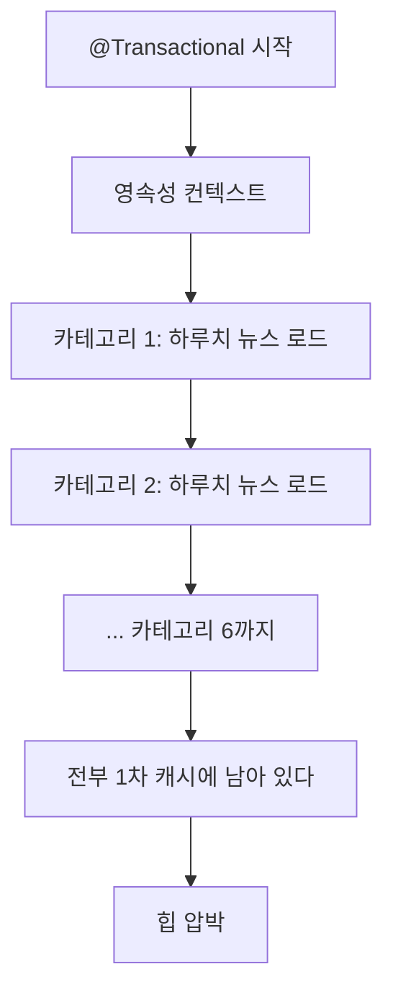

---

title: "크롤러가 커넥션을 말리고 힙을 터뜨렸던 이야기"
date: 2023-11-21
categories: [Java, Database]
tags: [ConnectionLeak, OOM, HikariCP, JdbcTemplate, BulkInsert, G1GC]
layout: post
toc: true
math: true
mermaid: true

---

## 참고자료

- [HikariCP 저장소](https://github.com/brettwooldridge/HikariCP)
- [Hibernate User Guide - Batching](https://docs.jboss.org/hibernate/orm/6.2/userguide/html_single/Hibernate_User_Guide.html#batch)
- [MySQL 8.0 Reference - LAST_INSERT_ID()](https://dev.mysql.com/doc/refman/8.0/en/information-functions.html#function_last-insert-id)
- [MySQL 8.0 Reference - AUTO_INCREMENT Handling in InnoDB](https://dev.mysql.com/doc/refman/8.0/en/innodb-auto-increment-handling.html)
- [Java 17 GC Tuning Guide - Ergonomics](https://docs.oracle.com/en/java/javase/17/gctuning/ergonomics.html)
- [java 명령어 옵션 문서](https://docs.oracle.com/en/java/javase/17/docs/specs/man/java.html)
- [Spring Retry - @Retryable Javadoc](https://docs.spring.io/spring-retry/docs/api/current/org/springframework/retry/annotation/Retryable.html)

---

## 배경

한 시간에 한 번 뉴스를 긁어와서 저장하는 크롤러를 만들었다. 한 번 돌 때 800개에서 1500개쯤 들어온다.

**두 가지가 계속 터졌다.** 어느 시간대에는 데이터가 아예 안 들어가 있었고 로그에 커넥션을 못 얻었다는 메시지가 있었다. 다른 날에는 힙이 부족하다고 죽어 있었다.

당시에 붙였던 대응은 벌크 삽입, 100개 단위 분할, 그리고 서버 스펙 올리기였다. 마지막이 마음에 걸렸다. 코드로 더 할 수 있는 것이 있었을 것 같았는데 그때는 못 찾았다.

지금 다시 코드를 보면서 정리한다.

정리하면서 확인하고 싶었던 것들이다.

- 커넥션이 부족했던 진짜 이유는 무엇이었는가?
- `saveAll()`은 왜 기대만큼 안 빨랐는가?
- 100개씩 나눠 넣었는데 왜 메모리가 크게 안 줄었는가?
- 서버 스펙을 올렸는데도 왜 계속 터졌는가?

---

## 1. 문제의 코드

전체를 다 옮기면 길어서 뼈대만 옮긴다.

```kotlin
@Component
class CrawlerCore(
    private val crawlerBase: CrawlerBase,
    private val categoryRepository: CategoryRepository,
    private val newsRepository: NewsRepository,
    private val newsBulkInsertRepository: NewsBulkInsertRepository,
    private val keywordExtractor: KeywordExtractor,
) {

    @Retryable(value = [Exception::class], maxAttempts = 3)
    @Transactional(rollbackFor = [Exception::class])
    @Scheduled(cron = "0 0 * * * *")
    internal fun executeCrawling() {
        val crawledDateTime = LocalDateTime.now()

        for (categoryPair in categoryToUrl) {          // 카테고리 6개
            val category = categoryRepository.findByName(categoryPair.key)

            val headLineLinks = crawlerBase.extractMoreHeadLineLinks(...)
            val crawledNewsCards = crawlerBase.extractNewsCardBundle(...)   // 여기서 크롤링

            val persistenceNewsBundle = newsRepository.findAllByCategoryAndCreatedAtBetween(...)

            crawledNewsCards.map { crawledNewsCard ->
                // 중복 판별, 벌크 삽입, 키워드 추출
                val lastNews = newsRepository.findTopByOrderByIdDesc()
                val newNewsLastIndex = newsBulkInsertRepository.bulkInsert(...)
                val extractedKeywords = keywordExtractor.extractKeywordV2(
                    newsRepository.findById(newNewsLastIndex!!.toLong()).get().content
                )
                // ...
            }
            Thread.sleep(1000)
        }
        // ...
    }
}
```

크롤링 부분은 이렇게 생겼다.

```kotlin
for (link in allHeadLineNewsLinks) {
    val moreDoc = Jsoup.connect(link).get()
    // ...
    for (htmlLink in crawledHtmlLinks) {
        Thread.sleep(100)                            // 차단 방지
        val detailDoc = Jsoup.connect(detailLink).get()
        // 제목, 본문, 이미지 추출
    }
}
```

---

## 2. 커넥션이 부족했던 이유

첫 질문이다. **당시 진단이 정확하지 않았다.**

### 2.1 당시 진단

"데이터 개수만큼 커넥션을 맺고 끊으니까 800개에서 1500개의 커넥션이 필요하다"고 봤다.

그래서 벌크 삽입으로 바꾸면 커넥션을 하나만 쓰게 될 거라고 생각했다.

### 2.2 다시 보면

**메서드에 `@Transactional`이 붙어 있다.**

스프링의 트랜잭션은 시작할 때 커넥션 하나를 얻어서 스레드에 묶어두고, 끝날 때까지 그 하나만 쓴다. 안에서 리포지토리를 몇 번 부르든 커넥션은 하나다. [`ThreadLocal`에 관한 글](/posts/Aop-ThreadLocal/)에 정리한 `TransactionSynchronizationManager`가 그 일을 한다.

그러니까 **커넥션 개수가 문제가 아니라 점유 시간이 문제였다.**

시간을 세보면 이렇다.

| 구간 | 소요 시간 |
|---|---|
| 기사 하나당 `Thread.sleep(100)` | 0.1초 |
| 기사 하나당 HTTP 요청 | 0.1초에서 1초 |
| 기사 1500개 | 최소 150초, 실제로는 수백 초 |
| 카테고리 간 `Thread.sleep(1000)` | 6초 |

```mermaid
gantt
    title 트랜잭션 하나가 붙잡고 있는 시간
    dateFormat X
    axisFormat %s
    section 커넥션 점유
    트랜잭션 시작 :milestone, 0, 0
    HTTP 크롤링 + sleep (수백 초) :active, 0, 400
    DB 삽입 (수 초) :420, 430
    커밋 :milestone, 430, 430
```



**커넥션 하나가 수백 초 동안 아무 일도 안 하면서 잡혀 있다.** 그동안 HTTP 요청을 처리하는 다른 스레드들이 남은 커넥션을 나눠 쓴다.

HikariCP 기본 풀 크기는 10이고 `connectionTimeout` 기본값은 30초다. 크롤링이 도는 동안 풀에 여유가 없으면 **다른 요청들이 30초를 기다리다 예외를 받고 롤백된다.** 로그에서 본 것이 이 상황이었을 가능성이 크다.

### 2.3 진짜 고쳤어야 할 것

**외부 통신을 트랜잭션 밖으로 빼는 것**이다. [트랜잭션과 락에 관한 글](/posts/Transaction-Lock/)에 적은 원칙과 같다.

```kotlin
@Scheduled(cron = "0 0 * * * *")
fun executeCrawling() {
    for (categoryPair in categoryToUrl) {
        // 트랜잭션 밖: 크롤링
        val crawled = crawlerBase.extractNewsCardBundle(...)

        // 트랜잭션 안: 저장만
        newsPersister.persist(crawled, category, crawledDateTime)
    }
}

@Service
class NewsPersister(...) {

    @Transactional
    fun persist(crawled: List<News>, category: Category, at: LocalDateTime) {
        // DB 작업만 여기서
    }
}
```

이렇게 하면 **커넥션을 잡는 시간이 수백 초에서 수 초로 줄어든다.**

벌크 삽입도 물론 도움이 됐다. 다만 그것만으로는 크롤링 시간 동안의 점유를 못 없앤다.

**여기서 `@Transactional`이 클래스를 나눠야 동작한다는 점도 짚어둔다.** 같은 클래스 안에서 부르면 프록시를 안 거쳐서 트랜잭션이 안 걸린다.

### 2.4 확인했어야 할 것

당시에 이런 설정을 켰으면 훨씬 빨리 찾았을 것이다.

```yaml
spring:
  datasource:
    hikari:
      leak-detection-threshold: 60000   # 60초 넘게 안 돌려주면 스택 트레이스를 찍는다
      maximum-pool-size: 10
      connection-timeout: 30000
```

`leak-detection-threshold`를 켜두면 **커넥션을 오래 붙잡고 있는 지점의 스택 트레이스를 로그에 찍어준다.** 어느 코드가 범인인지 바로 나온다.

---

## 3. 벌크 삽입으로 옮기기

### 3.1 saveAll()로는 부족했다

두 번째 질문이다. 반복문 안에서 `save()`를 부르는 것과 `saveAll()`을 부르는 것을 재봤다.

| 방식 | 소요 시간 |
|---|---|
| 반복문 + `save()` | 6134ms |
| `saveAll()` | 4736ms |
| `JdbcTemplate.batchUpdate()` | 2952ms |

**`saveAll()`이 기대만큼 안 빨랐다.** 구현을 보면 이유가 나온다.

```java
@Transactional
@Override
public <S extends T> List<S> saveAll(Iterable<S> entities) {
    List<S> result = new ArrayList<>();
    for (S entity : entities) {
        result.add(save(entity));   // 하나씩 부른다
    }
    return result;
}
```

**트랜잭션을 하나로 묶어줄 뿐 안에서는 `save()`를 하나씩 부른다.** 커밋 횟수가 줄어드는 만큼만 빨라진다.

### 3.2 그런데 진짜 이유는 따로 있었다

그때는 여기까지만 봤는데, **더 큰 이유가 있었다.**

하이버네이트에는 JDBC 배치라는 기능이 있다. 여러 INSERT를 모아서 한 번에 보내는 것이다. 설정으로 켠다.

```yaml
spring:
  jpa:
    properties:
      hibernate:
        jdbc:
          batch_size: 100
        order_inserts: true
        order_updates: true
```

**그런데 기본키 생성 전략이 `IDENTITY`면 이게 동작하지 않는다.**

`IDENTITY`는 DB의 AUTO_INCREMENT에 ID 생성을 맡기는 방식이다. 하이버네이트는 엔티티를 영속 상태로 만들 때 그 식별자를 알아야 하는데, **`IDENTITY`에서는 INSERT를 실제로 보내야만 ID를 알 수 있다.**



**모을 수가 없으니 배치가 무력화된다.** `batch_size`를 아무리 크게 잡아도 INSERT가 하나씩 나간다.

MySQL 쪽 설정도 하나 더 있다. 접속 URL에 이 옵션이 없으면 JDBC 드라이버가 배치를 여러 문장으로 그냥 보낸다.

```text
jdbc:mysql://host:3306/db?rewriteBatchedStatements=true
```

이걸 켜야 **여러 INSERT가 `INSERT INTO ... VALUES (...), (...), (...)` 한 문장으로 다시 쓰인다.**

즉 `saveAll()`이 느렸던 이유는 셋이다. 안에서 하나씩 부르고, `IDENTITY`라서 배치가 안 되고, 드라이버 옵션도 없었다.

### 3.3 JdbcTemplate으로 직접 넣기

```kotlin
@Repository
class NewsBulkInsertRepository(
    private val jdbcTemplate: JdbcTemplate,
) {

    fun bulkInsert(newsBundle: List<News>, crawledDateTime: LocalDateTime) {
        val sql = """
            INSERT INTO news (title, content, news_link, press, thumbnail_image_url,
                              type, written_date_time, crawled_count, category_id,
                              created_at, modified_at)
            VALUES (?, ?, ?, ?, ?, ?, ?, ?, ?, ?, ?)
        """.trimIndent()

        jdbcTemplate.batchUpdate(sql, object : BatchPreparedStatementSetter {
            override fun setValues(ps: PreparedStatement, i: Int) {
                val news = newsBundle[i]
                ps.setString(1, news.title)
                ps.setString(2, news.content)
                // ...
            }

            override fun getBatchSize(): Int = newsBundle.size
        })
    }
}
```

**JPA를 안 쓰니까 영속성 컨텍스트도 안 거치고, 하이버네이트가 만드는 쿼리도 안 거친다.** 그래서 빨랐다.

### 3.4 대신 생긴 문제, 그리고 그 해법이 잘못됐던 점

JPA를 안 쓰니 **삽입된 행의 ID를 모른다.** 뉴스 카드가 어떤 뉴스들을 묶은 것인지 기록해야 하는데 ID가 필요했다.

당시에 이렇게 해결했다.

```kotlin
// 삽입 전 마지막 ID
val lastNews = newsRepository.findTopByOrderByIdDesc()
var currentLastNewsIndex = if (lastNews != null) lastNews.id + 1 else 1L

// 삽입 후 마지막 ID
val newNewsLastIndex = newsBulkInsertRepository.bulkInsert(...)

// 둘 사이의 모든 수가 방금 넣은 것들의 ID
val range = (currentLastNewsIndex..newNewsLastIndex)
```

```kotlin
return jdbcTemplate.queryForObject("SELECT LAST_INSERT_ID()", Long::class.java)
```

**이 방식에 문제가 셋 있다.**

**`LAST_INSERT_ID()`는 마지막 ID가 아니다.** 여러 행을 한 문장으로 넣으면 **첫 번째 행의 ID**를 돌려준다. 문서에 그렇게 적혀 있다. `batchUpdate`가 문장을 어떻게 보내는지에 따라 값이 달라지므로, 이 값을 "마지막 ID"로 쓰면 상황에 따라 틀린다.

**ID가 연속이라는 보장이 없다.** InnoDB의 `innodb_autoinc_lock_mode` 기본값이 MySQL 8.0에서 2다. 여러 세션이 번갈아 번호를 받으므로 **한 번에 넣은 행들의 ID가 띄엄띄엄해질 수 있다.** 롤백이 나도 그 번호는 버려진다. [트랜잭션과 락에 관한 글](/posts/Transaction-Lock/)에 정리한 내용이다.

**동시에 다른 곳에서 넣으면 남의 ID가 섞인다.** "삽입 전 마지막 ID"와 "삽입 후 마지막 ID" 사이에 다른 트랜잭션이 넣은 행이 들어올 수 있다.

지금이라면 생성된 키를 직접 받아온다.

```kotlin
jdbcTemplate.execute { conn ->
    conn.prepareStatement(sql, Statement.RETURN_GENERATED_KEYS).use { ps ->
        newsBundle.forEach { news ->
            // 바인딩
            ps.addBatch()
        }
        ps.executeBatch()

        val ids = mutableListOf<Long>()
        ps.generatedKeys.use { rs ->
            while (rs.next()) ids.add(rs.getLong(1))
        }
        ids
    }
}
```

**아니면 애초에 ID를 애플리케이션이 만드는 방법도 있다.** UUID나 스노플레이크 방식으로 미리 정하면 삽입 전에 이미 알고 있으므로 이 문제가 통째로 사라진다.

### 3.5 벌크 삽입의 대가

한 번에 많이 넣으면 좋기만 한 것은 아니다.

**트랜잭션이 커진다.** 중간에 실패하면 되돌릴 것이 많고, 롤백 자체에도 시간이 걸린다.

**언두 로그가 쌓인다.** 롤백에 대비해 원본을 보관해야 하므로 그만큼 공간을 쓴다.

**락을 오래 잡는다.** 대량 삽입 중에는 자동 증가 관련 자원과 페이지 락을 계속 건드린다.

**그래서 적당한 크기로 나누는 것이 맞다.** 수백에서 수천 건 단위로 끊고, 각 덩어리를 별도 트랜잭션으로 커밋한다.

**다만 나누면 원자성이 사라진다.** 3번째 덩어리에서 실패하면 1, 2번은 이미 들어가 있다. 이건 감수하거나, 재실행해도 안전하도록 만들어야 한다. 뉴스 링크에 유니크 인덱스를 걸고 `INSERT IGNORE`나 `ON DUPLICATE KEY UPDATE`를 쓰면 여러 번 돌려도 같은 결과가 된다.

---

## 4. 힙이 터진 이유

### 4.1 서버와 JVM 기본값

당시 서버는 CPU 2코어, 메모리 2GB였다. JVM 옵션은 아무것도 안 줬다.

JVM은 옵션이 없으면 **머신 사양을 보고 알아서 정한다.** 이걸 ergonomics라고 부른다.

| 항목 | 규칙 | 2GB 머신에서 |
|---|---|---|
| 초기 힙 | 물리 메모리의 1/64 | 약 32MB |
| 최대 힙 | 물리 메모리의 1/4 | 약 512MB |

**최대 힙이 512MB였다.** 당시에 1GB로 적어뒀는데 다시 계산해보니 틀렸다.

GC 선택도 같은 방식으로 정해진다. **CPU가 2개 이상이고 메모리가 약 1792MB 이상이면 G1GC, 아니면 SerialGC**다. 2코어 2GB면 경계에 걸쳐 있어서, 컨테이너나 하이퍼바이저가 보고하는 실제 가용 메모리에 따라 갈린다.

이건 `-XX:+PrintFlagsFinal`로 확인할 수 있다.

```bash
java -XX:+PrintFlagsFinal -version | grep -E "MaxHeapSize|InitialHeapSize|UseG1GC|UseSerialGC"
```

**옵션을 안 주면 JVM이 무엇을 골랐는지 모르는 채로 돌게 된다.** 이걸 먼저 확인했어야 했다.

### 4.2 100개씩 나눴는데 왜 안 줄었나

세 번째 질문이다. 당시에 이렇게 고쳤다.

```kotlin
if (persistenceTargetNewsCards.size >= 100) {
    newsCardBulkInsertRepository.bulkInsert(persistenceTargetNewsCards, crawledDateTime)
    persistenceTargetNewsCards.clear()
}
```

메모리가 조금 줄긴 했는데 크게 줄지는 않았다. **이유가 셋이다.**

**첫째, 트랜잭션이 하나다.** 메서드 전체에 `@Transactional`이 걸려 있으니 `bulkInsert`를 100개 단위로 불러도 **커밋은 맨 끝에 한 번만 일어난다.** 리스트를 비웠어도 DB 쪽에서는 아무것도 확정되지 않았고, 언두 로그도 계속 쌓인다.

**둘째, 영속성 컨텍스트가 계속 자란다.** 이게 더 컸을 것이다.

```kotlin
val persistenceNewsBundle = newsRepository.findAllByCategoryAndCreatedAtBetween(...)  // 하루치 뉴스
val lastNews = newsRepository.findTopByOrderByIdDesc()
val content = newsRepository.findById(newNewsLastIndex).get().content
```

**JPA로 조회한 엔티티는 전부 영속성 컨텍스트에 남는다.** 트랜잭션이 끝날 때까지 회수되지 않는다.

`findAllByCategoryAndCreatedAtBetween`은 카테고리별로 하루치를 통째로 가져온다. 뉴스 하나에 본문이 통째로 들어 있으니 객체 하나가 작지 않다. **카테고리 6개를 돌면 그게 다 쌓인다.**



리스트를 `clear()` 해도 **영속성 컨텍스트가 따로 참조를 들고 있으므로 회수되지 않는다.** GC 대상이 안 된다.

**셋째, 크롤링 결과 전체를 메모리에 들고 있다.** `extractNewsCardBundle`이 그 카테고리의 기사를 전부 리스트로 만들어 돌려준다. 본문 전체가 문자열로 들어 있다.

### 4.3 그럼 어떻게 했어야 하나

**트랜잭션을 잘라야 한다.** 카테고리 하나, 또는 덩어리 하나를 별도 트랜잭션으로 커밋하면 그때마다 영속성 컨텍스트가 비워진다.

```kotlin
@Scheduled(cron = "0 0 * * * *")
fun executeCrawling() {
    for (categoryPair in categoryToUrl) {
        val crawled = crawlerBase.extractNewsCardBundle(...)   // 트랜잭션 밖

        crawled.chunked(100).forEach { chunk ->
            newsPersister.persistChunk(chunk, category, crawledDateTime)   // 각각 별도 트랜잭션
        }
    }
}
```

**한 트랜잭션 안에서 처리해야 한다면 명시적으로 비운다.**

```kotlin
if (count % 100 == 0) {
    entityManager.flush()
    entityManager.clear()   // 1차 캐시를 비운다
}
```

**조회 자체를 줄이는 방법도 있다.** 중복 판별을 위해 하루치를 다 가져올 필요가 없다. 링크에 유니크 인덱스를 걸고 DB에 맡기면 된다.

```sql
ALTER TABLE news ADD UNIQUE INDEX uk_news_link (news_link);
```

```sql
INSERT INTO news (...) VALUES (...)
ON DUPLICATE KEY UPDATE crawled_count = crawled_count + 1;
```

**이러면 하루치를 메모리에 올릴 이유가 사라진다.**

중복 판별 코드에도 문제가 있었다.

```kotlin
private fun isAlreadySavedNews(crawledNews: News, persistenceNewsBundle: List<News>): News? {
    for (persistenceNews in persistenceNewsBundle) {
        if (crawledNews.title in persistenceNews.title && ...) {
            return persistenceNews
        }
    }
    return null
}
```

**코틀린에서 `String in String`은 부분 문자열 포함 검사다.** 같은지를 보려면 `==`여야 한다. 제목이 다른 제목에 포함되기만 해도 같은 기사로 판정된다.

그리고 **크롤링한 1500건 × 저장된 1500건이면 비교가 225만 번**이다. 문자열 포함 검사라서 한 번의 비교도 싸지 않다. 링크를 키로 하는 `Map`을 쓰거나 DB에 맡겼어야 했다.

### 4.4 왜 스펙을 올려도 터졌나

네 번째 질문이다. 2GB에서 4GB로 올렸는데도 이런 로그가 계속 나왔다.

```text
Exception in thread "HikariPool-1 housekeeper" java.lang.OutOfMemoryError: Java heap space
Exception in thread "Catalina-utility-2" java.lang.OutOfMemoryError: Java heap space
```

**최대 힙이 여전히 물리 메모리의 4분의 1이었기 때문이다.** 4GB로 올렸으니 1GB가 됐지만 크롤러가 요구하는 것은 2GB 근처였다.

**물리 메모리를 늘려도 JVM이 그걸 자동으로 다 쓰지 않는다.** 이 관계를 몰라서 스펙만 올리고 끝냈다가 다시 터진 것이다.

그래서 옵션을 직접 줬다.

```bash
nohup java -server \
  -Xms1g -Xmx2560m \
  -XX:+UseG1GC \
  -XX:+HeapDumpOnOutOfMemoryError -XX:HeapDumpPath=/path/to/dumps \
  -Xlog:gc*:file=gclog/gc.log:time,tags:filecount=5,filesize=10m \
  -jar -Dspring.profiles.active=dev app.jar > nohup.out 2>&1 &
```

각각이 무엇인지 짚어둔다.

**`-Xms1g -Xmx2560m`** 은 초기 힙 1GB, 최대 힙 2560MB다.

**`-Xms`와 `-Xmx`를 같게 두는 것을 권하는 경우가 많다.** 힙을 늘리고 줄이는 것 자체가 비용이고, 어차피 최대까지 쓸 거라면 처음부터 잡아두는 편이 낫기 때문이다.

**4GB 머신에 최대 힙 2560MB가 안전한 값은 아니다.** JVM이 쓰는 메모리는 힙만이 아니다.

| 영역 | 대략 |
|---|---|
| 힙 | 2560MB |
| 메타스페이스 | 수백 MB |
| 스레드 스택 | 스레드당 1MB. 톰캣 200개면 200MB |
| 코드 캐시 | 수십에서 수백 MB |
| 다이렉트 버퍼 | NIO 사용량에 따라 |

**다 더하면 4GB에 육박한다.** 그러면 커널이 프로세스를 죽인다. 힙은 안 터졌는데 프로세스가 사라지는 상황이 되고, 이건 힙 덤프도 안 남아서 더 찾기 어렵다.

**`-XX:+UseG1GC`** 로 G1을 명시했다. 힙이 크면 SerialGC의 정지 시간이 길어진다. 자세한 것은 [GC에 관한 글](/posts/JVM-GC/)에 정리했다.

**`-XX:+HeapDumpOnOutOfMemoryError`** 가 가장 값어치 있는 옵션이었다. OOM이 나는 순간 힙을 파일로 덤프한다. 이걸 열어서 무엇이 메모리를 차지하고 있는지 보면 **추측 없이 원인을 찾을 수 있다.**

당시에 이 옵션을 처음부터 켜뒀다면 4.2절의 영속성 컨텍스트 문제를 바로 봤을 것이다.

**`-Xlog:gc*`** 로 GC 로그를 남긴다. 회수 후에도 사용량이 안 줄어들면 누수를 의심할 수 있다.

원래 명령에 있던 `-XX:+DisableExplicitGC`는 뺐다. `System.gc()` 호출을 무시하게 만드는 옵션인데, **NIO 다이렉트 버퍼는 `System.gc()`에 기대는 부분이 있어서** 함부로 끄면 다른 문제가 생길 수 있다.

---

## 5. 실패하면 데이터가 사라지던 문제

크롤러가 중간에 실패하면 **그 시간대 데이터를 영영 못 얻었다.**

외부 사이트를 긁는 일이라 같은 코드가 될 때도 있고 안 될 때도 있다. 네트워크 문제로 보이는 예외가 잦았다.

### 5.1 @Retryable

```kotlin
@Retryable(value = [Exception::class], maxAttempts = 3)
@Transactional(rollbackFor = [Exception::class])
@Scheduled(cron = "0 0 * * * *")
internal fun executeCrawling() { ... }
```

`value`가 어떤 예외에 재시도할지, `maxAttempts`가 몇 번까지 할지다. 직접 쓰면 이렇게 되는 코드를 애노테이션이 대신한다.

```kotlin
var attempt = 0
while (true) {
    try {
        crawlingExecute()
        break
    } catch (e: IOException) {
        if (++attempt >= 3) throw e
        log.info { "재시도 $attempt" }
    }
}
```

### 5.2 여기서도 걸리는 것들

**모든 예외에 재시도하면 안 된다.** `value = [Exception::class]`는 너무 넓다.

`NullPointerException`이나 파싱 실패는 다시 해도 똑같이 실패한다. **세 번 실패하는 데 시간만 쓴다.** 네트워크 예외로 좁히는 것이 맞다.

```kotlin
@Retryable(
    retryFor = [IOException::class, SocketTimeoutException::class],
    maxAttempts = 3,
    backoff = Backoff(delay = 5000, multiplier = 2.0),
)
```

**`backoff`가 없으면 곧바로 다시 시도한다.** 상대 서버가 부하로 막고 있는 상황이면 연달아 때리는 셈이라 상황을 악화시킨다. 위처럼 두면 5초, 10초로 간격을 벌린다.

**애노테이션 순서에 따라 동작이 달라진다.** 재시도가 트랜잭션 바깥에 있어야 시도마다 새 트랜잭션이 시작된다. 안쪽에 있으면 **이미 롤백 표시가 붙은 트랜잭션 안에서 재시도하게 되어** 무엇을 해도 커밋이 안 된다. 이건 실제로 어떻게 적용됐는지 확인이 필요한 부분이고, 확실히 하려면 재시도할 메서드와 트랜잭션 메서드를 분리하는 것이 안전하다.

**`@Recover`의 로그에도 문제가 있었다.**

```kotlin
log.error { "ExceptionStackTrace : ${exception.stackTrace}" }
```

`stackTrace`는 배열이라 이렇게 찍으면 `[Ljava.lang.StackTraceElement;@1a2b3c` 같은 것이 남는다. 정작 필요한 스택은 안 나온다.

```kotlin
log.error(exception) { "크롤링 3회 시도 후 실패" }
```

**예외 객체를 로거에 넘겨야** 스택이 제대로 찍힌다.

### 5.3 그리고 발견한 다른 버그

키워드 랭킹을 만드는 코드다.

```kotlin
val sortedKeywords = keywordsCountingPair.toList().sortedByDescending { it.second }

for (rank: Int in 0..9) {
    keywordRanking.append(sortedKeywords[rank]).append(", ")
}
```

**키워드가 10개보다 적으면 `IndexOutOfBoundsException`이 난다.** 크롤링이 일부만 성공한 날에 이게 터지면, 앞에서 다 긁어온 것이 전부 롤백된다.

```kotlin
val ranking = keywordsCountingPair.entries
    .sortedByDescending { it.value }
    .take(10)
    .joinToString(", ") { it.key }
```

`take(10)`은 10개보다 적으면 있는 만큼만 준다.

---

## 정리하며

처음 던진 질문들에 대한 답이다.

**커넥션이 부족했던 진짜 이유.** 개수가 아니라 점유 시간이었다. 메서드 전체에 `@Transactional`이 걸려 있어서 커넥션 하나가 크롤링 내내 잡혀 있었다. HTTP 요청과 `Thread.sleep`이 전부 트랜잭션 안에 들어가 있었으므로, 외부 통신을 트랜잭션 밖으로 빼는 것이 맞는 해법이었다. `leak-detection-threshold`를 켰으면 바로 찾았을 것이다.

**`saveAll()`이 왜 안 빨랐나.** 안에서 `save()`를 하나씩 부르는 것이 첫째 이유이고, 더 큰 이유는 기본키 전략이 `IDENTITY`라 하이버네이트의 JDBC 배치가 아예 동작하지 않았다는 것이다. MySQL 드라이버의 `rewriteBatchedStatements` 옵션도 없었다.

**100개씩 나눴는데 왜 메모리가 안 줄었나.** 트랜잭션이 하나여서 커밋이 맨 끝에 한 번만 일어났고, JPA로 조회한 엔티티가 전부 영속성 컨텍스트에 남아 있었다. 리스트를 비워도 영속성 컨텍스트가 참조를 들고 있으니 회수되지 않는다. 트랜잭션을 잘라 커밋하거나 `entityManager.clear()`를 불러야 했다.

**스펙을 올렸는데 왜 계속 터졌나.** JVM의 최대 힙 기본값이 물리 메모리의 4분의 1이라서, 4GB로 올려도 힙은 1GB였다. 물리 메모리를 늘려도 JVM이 자동으로 다 쓰지 않는다. `-Xmx`를 명시해야 한다.

돌아보고 나서 가장 아쉬운 것은 **측정 없이 고쳤다는 점**이다. 커넥션이 부족하다는 로그를 보고 "많이 쓰나 보다"라고 짐작했고, 힙이 터지니까 "많이 들고 있나 보다"라고 짐작했다. `leak-detection-threshold`나 힙 덤프는 이미 있던 기능인데 몰라서 안 썼다. 마지막에 스케일업으로 넘어간 것도 결국 **어디가 문제인지 몰랐기 때문**이었다.
