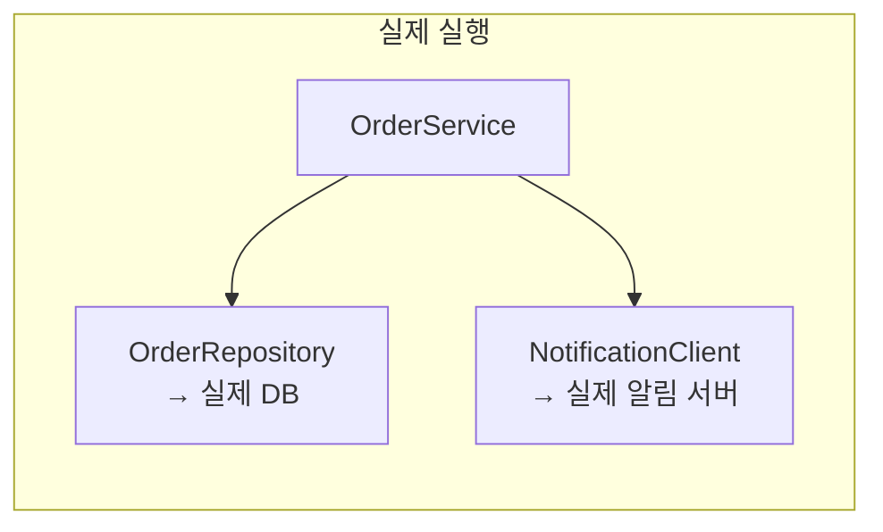
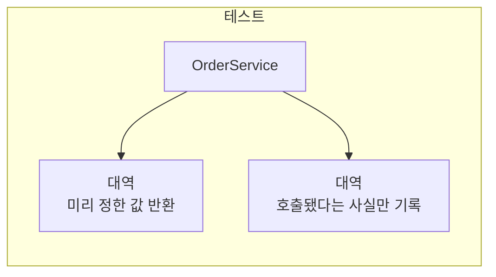
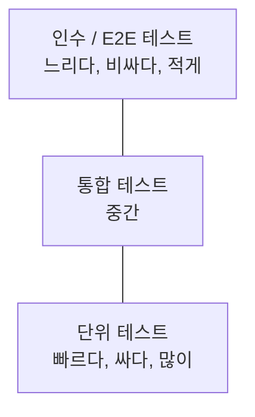

---

title: "테스트 대역과 테스트 피라미드, 그리고 운영 중인 서비스에 테스트를 붙인 과정"
date: 2023-11-24
categories: [Test, Java]
tags: [Test, TestDouble, TestPyramid, Mockito, JUnit, Spring]
layout: post
toc: true
math: true
mermaid: true

---

## 참고자료

- [Martin Fowler - Test Double](https://martinfowler.com/bliki/TestDouble.html)
- [Martin Fowler - Test Pyramid](https://martinfowler.com/bliki/TestPyramid.html)
- [Martin Fowler - The Practical Test Pyramid](https://martinfowler.com/articles/practical-test-pyramid.html)
- [JUnit 5 User Guide](https://junit.org/junit5/docs/current/user-guide/)
- [Mockito](https://site.mockito.org/)
- [Spring Framework - @MockitoBean](https://docs.spring.io/spring-framework/reference/testing/annotations/integration-spring/annotation-mockitobean.html)

---

## 배경

운영 중인 서비스에 테스트가 하나도 없었다. 배포하고 나서 Postman으로 하나씩 눌러보는 것이 검증의 전부였고, 그래서 예상 못 한 버그가 계속 나왔다.

테스트를 붙이기로 하고 나서 막힌 지점들이 있었다.

- Mock, Stub, Spy, Fake, Dummy가 다 나오는데 무엇이 무엇인지 헷갈린다. 자료마다 분류가 다르다.
- 단위 테스트를 많이 쓰라는데, 이미 돌고 있는 서비스에서는 무엇부터 써야 하는가?
- `@Mock`, `@MockBean`, `@Spy`, `@InjectMocks`는 각각 언제 쓰는가?
- 테스트를 붙이면 개발이 느려지지 않는가?

용어부터 정리하고, 실제로 붙이면서 정한 것들을 뒤에 붙였다.

---

## 1. 테스트 대역이 왜 필요한가

### 1.1 문제

주문 생성 로직이 이렇다고 하자.

```java
public void createOrder(boolean isNotify) {
    List<Order> existing = orderRepository.findOrderList();
    if (!existing.isEmpty()) {
        throw new OrderDuplicateException();
    }
    orderRepository.createOrder();
    if (isNotify) {
        notificationClient.notifyToMobile();
    }
}
```

이 메서드 하나를 테스트하려면 무엇이 필요한가.

- 데이터베이스 연결
- 테스트 조건에 맞는 데이터 준비
- 알림 서버 연결
- 테스트 후 데이터 원복

**정작 검증하고 싶은 것은 "이미 주문이 있으면 예외를 던지는가"인데**, 그 하나를 확인하려고 준비할 것이 네 가지다. 그리고 알림 서버가 내려가 있으면 로직과 무관하게 테스트가 실패한다.

### 1.2 대역

그래서 **실제 객체 대신 테스트용 가짜 객체**를 넣는다. 이것을 테스트 대역(test double)이라고 부른다. 영화의 스턴트 대역에서 온 말이다.

용어 두 개를 먼저 정한다.

- **SUT(System Under Test)**: 지금 테스트하려는 대상. 위 예에서 `OrderService`
- **DOC(Depended On Component)**: SUT가 의존하는 것. 위 예에서 `OrderRepository`, `NotificationClient`

테스트 대역은 DOC 자리에 들어가서 실제 것처럼 행동한다.





---

## 2. 다섯 가지 대역

마틴 파울러가 분류한 다섯 가지를 기준으로 삼는다. 자료마다 분류가 조금씩 다른 이유는 이 구분이 개념적인 것이고 도구가 그대로 나누지 않기 때문이다.

### 2.1 Dummy

**자리만 채우는 객체.** 전달은 해야 하는데 실제로 쓰이지는 않는다.

```java
class Service {
    static final String OUTPUT = "something";

    String format(Dependency dependency) {
        return OUTPUT;   // dependency를 안 쓴다
    }
}

@Test
void format_인자를_쓰지_않는다() {
    String result = new Service().format(null);   // null이 더미
    assertThat(result).isEqualTo(Service.OUTPUT);
}
```

`null`을 넘기는 것도 더미다. 다만 실제로는 `null` 검사가 있는 경우가 많아서 빈 객체를 만들어 넘기는 편이 안전하다.

### 2.2 Fake

**실제로 동작하지만 운영에는 못 쓰는 구현.** 대표적인 것이 메모리 저장소다.

```java
interface UserRepository {
    User findById(Long userId);
    void save(User user);
}

// 운영용
class JdbcUserRepository implements UserRepository { /* 실제 DB */ }

// 테스트용 Fake
class InMemoryUserRepository implements UserRepository {

    private final Map<Long, User> store = new HashMap<>();

    @Override
    public User findById(Long userId) {
        return store.get(userId);
    }

    @Override
    public void save(User user) {
        store.put(user.getId(), user);
    }
}
```

**Fake는 진짜로 동작한다는 점이 다른 대역과 다르다.** 저장하면 조회된다. 그래서 여러 단계를 거치는 시나리오를 테스트할 때 유용하다. Mock으로 하려면 단계마다 반환값을 일일이 지정해야 하는데, Fake는 그냥 동작한다.

대신 Fake 자체가 코드라서 버그가 있을 수 있다. Fake도 테스트가 필요해지는 상황이 생긴다.

### 2.3 Stub

**미리 정해둔 값을 반환하는 객체.** 상태 검증에 쓴다.

```java
class UserServiceStub implements UserService {
    @Override
    public String getUuid(User user) {
        return "0000-000-000-00001";   // 항상 이 값
    }
}
```

Fake와의 차이는 **로직이 없다는 것**이다. 무엇을 넣든 정해진 값이 나온다.

### 2.4 Spy

**실제 객체를 쓰되 호출 기록을 남기거나 일부만 대체하는 것.**

```java
interface Logger {
    void log(String message);
}

class SpyLogger implements Logger {

    private final List<String> messages = new ArrayList<>();

    @Override
    public void log(String message) {
        messages.add(message);   // 기록만 남긴다
    }

    List<String> getMessages() {
        return messages;
    }
}
```

이렇게 하면 "로그가 호출됐는가", "몇 번 호출됐는가", "무슨 내용으로 호출됐는가"를 확인할 수 있다.

### 2.5 Mock

**어떤 호출이 일어나야 하는지를 미리 정해두고, 그대로 됐는지 검증하는 객체.** 행위 검증에 쓴다.

Stub과 Mock의 차이가 헷갈리는데, **무엇을 검증하는가**로 나뉜다.

| | Stub | Mock |
|---|---|---|
| 목적 | 상태 검증 | 행위 검증 |
| 확인하는 것 | 결과값이 기대와 같은가 | 이 메서드가 호출됐는가 |
| 실패 판정 위치 | `assert` 문 | 대역 자체 |

```java
// Stub: 반환값을 정해두고 결과를 확인한다
when(userRepository.findById(1L)).thenReturn(new User("김"));
String name = userService.getName(1L);
assertThat(name).isEqualTo("김");        // 여기서 검증

// Mock: 호출됐는지를 확인한다
orderService.createOrder(true);
verify(notificationClient, times(1)).notifyToMobile();   // 여기서 검증
```

### 2.6 정리

| 대역 | 한 줄로 | 언제 쓰는가 |
|---|---|---|
| Dummy | 자리만 채운다 | 인자로 넘겨야 하지만 안 쓰일 때 |
| Fake | 간단하게 진짜로 동작한다 | 여러 단계 시나리오를 테스트할 때 |
| Stub | 정해진 값을 돌려준다 | 반환값이 필요할 때 |
| Spy | 실제 동작에 기록을 더한다 | 일부만 대체하고 싶을 때 |
| Mock | 호출됐는지를 검증한다 | 부수 효과가 일어났는지 확인할 때 |

**실무에서는 이 다섯을 엄밀히 구분해서 쓰지 않는다.** Mockito 같은 도구는 하나의 객체로 Stub 역할과 Mock 역할을 함께 한다. 그래도 구분을 알아두면 "지금 나는 상태를 보는가 행위를 보는가"를 의식하게 되고, 그게 테스트 설계에 영향을 준다.

---

## 3. Mockito로 쓰기

### 3.1 가장 기본

```java
@Test
void createOrder_알림이_발송된다() {
    // 준비
    OrderRepository orderRepository = Mockito.mock(OrderRepository.class);
    NotificationClient notificationClient = Mockito.mock(NotificationClient.class);
    OrderService orderService = new OrderService(orderRepository, notificationClient);

    // 준비: 반환값 지정 (Stub 역할)
    when(orderRepository.findOrderList()).thenReturn(Collections.emptyList());

    // 실행
    orderService.createOrder(true);

    // 검증: 호출 확인 (Mock 역할)
    verify(orderRepository, times(1)).createOrder();
    verify(notificationClient, times(1)).notifyToMobile();
}
```

### 3.2 애노테이션으로 줄이기

```java
@ExtendWith(MockitoExtension.class)
class OrderServiceTest {

    @Mock
    private OrderRepository orderRepository;

    @Mock
    private NotificationClient notificationClient;

    @InjectMocks
    private OrderService orderService;

    @Test
    void createOrder_알림이_발송된다() {
        when(orderRepository.findOrderList()).thenReturn(Collections.emptyList());

        orderService.createOrder(true);

        verify(orderRepository, times(1)).createOrder();
        verify(notificationClient, times(1)).notifyToMobile();
    }
}
```

세 가지를 짚는다.

**`@ExtendWith(MockitoExtension.class)`가 없으면 애노테이션이 동작하지 않는다.** `@Mock`이 붙은 필드가 `null`인 채로 남아서 `NullPointerException`이 난다. 가장 흔한 실수다.

**`@InjectMocks`는 `@Mock`으로 만든 것들을 대상 객체에 주입한다.** 생성자 주입을 우선 시도하고, 안 되면 세터나 필드 주입을 시도한다.

**Stub을 지정하지 않은 메서드도 호출할 수 있다.** Mockito의 기본 동작이 타입에 맞는 기본값을 돌려주는 것이기 때문이다. `void`면 아무것도 안 하고, 객체를 반환하는 메서드면 `null`, `int`면 `0`, 컬렉션이면 빈 컬렉션을 돌려준다.

마지막 것이 함정이 되기도 한다. **Stub을 빠뜨렸는데 `null`이 반환되어 엉뚱한 곳에서 `NullPointerException`이 나면** 원인을 찾기 어렵다.

### 3.3 Spy

객체 전체가 아니라 **일부 메서드만** 대체하고 싶을 때 쓴다.

```java
@ExtendWith(MockitoExtension.class)
class OrderServiceTest {

    @Spy
    private OrderRepository orderRepository;   // 나머지는 실제 동작

    @InjectMocks
    private OrderService orderService;

    @Test
    void createOrder_저장만_대체한다() {
        // createOrder만 아무 일도 안 하게 만든다
        doNothing().when(orderRepository).createOrder();

        orderService.createOrder(true);

        verify(orderRepository, times(1)).createOrder();
    }
}
```

Spy에서 주의할 것이 있다. **`when(...).thenReturn(...)` 형태를 쓰면 실제 메서드가 한 번 호출된다.** `when()`의 인자를 평가하려면 그 메서드를 불러야 하기 때문이다. DB에 접근하는 메서드라면 그 접근이 실제로 일어난다.

그래서 Spy에서는 `doReturn(...).when(spy).method()` 형태를 쓴다. 이 형태는 메서드를 실제로 부르지 않는다.

```java
// 위험: 실제 메서드가 한 번 실행된다
when(spy.findOrderList()).thenReturn(emptyList());

// 안전: 실제 메서드가 실행되지 않는다
doReturn(emptyList()).when(spy).findOrderList();
```

### 3.4 스프링 컨텍스트에서

`@SpringBootTest`는 애플리케이션 컨텍스트를 전부 띄운다. 그래서 실제 빈이 주입되고, 1.1절의 문제가 그대로 돌아온다.

컨텍스트 안의 특정 빈만 대역으로 바꾸려면 별도 애노테이션을 쓴다.

```java
@SpringBootTest
class OrderServiceIntegrationTest {

    @MockitoBean
    private NotificationClient notificationClient;   // 이것만 대역으로 교체

    @Autowired
    private OrderService orderService;

    @Test
    void createOrder_외부_알림만_대체한다() {
        orderService.createOrder(true);

        verify(notificationClient, times(1)).notifyToMobile();
    }
}
```

**애노테이션 이름이 바뀌었다.** 예전에는 `@MockBean`을 썼는데 스프링 부트 3.4에서 폐기 예정으로 표시됐고, 스프링 프레임워크 6.2의 `@MockitoBean`이 그 자리를 대신한다. `@SpyBean`도 `@MockitoSpyBean`으로 바뀌었다.

세 애노테이션의 차이를 정리하면 이렇다.

| 애노테이션 | 무엇을 대체하는가 | 함께 쓰는 것 |
|---|---|---|
| `@Mock` | 순수 자바 객체 | `@ExtendWith(MockitoExtension.class)`, `@InjectMocks` |
| `@Spy` | 순수 자바 객체 (일부만) | 위와 같음 |
| `@MockitoBean` | 스프링 컨텍스트의 빈 | `@SpringBootTest` 등 |

**컨텍스트 캐시에 관한 주의사항**이 하나 있다. 스프링은 테스트 클래스들이 같은 설정을 쓰면 컨텍스트를 재사용한다. 그런데 `@MockitoBean`을 쓰면 컨텍스트 구성이 달라지므로 **새 컨텍스트가 만들어진다.** 대역 조합이 제각각인 테스트 클래스가 많아지면 컨텍스트가 그만큼 여러 번 뜨고, 전체 테스트 시간이 크게 늘어난다.

그래서 통합 테스트에서 대역을 쓸 때는 조합을 몇 가지로 표준화하는 편이 낫다.

---

## 4. 테스트 피라미드

### 4.1 왜 피라미드인가

자동화 테스트를 UI 조작으로 하는 방식이 오래 쓰였다. 만들기 쉽고 실제 사용자 경로를 그대로 확인할 수 있다는 장점이 있다.

문제는 비용이다. UI 테스트는 **느리고, 잘 깨지고, 깨졌을 때 원인을 찾기 어렵다.** 화면 요소 하나가 바뀌면 테스트가 실패하는데 그게 진짜 버그인지 테스트가 낡은 건지 매번 확인해야 한다.

그래서 **아래로 갈수록 많이, 위로 갈수록 적게** 두는 형태를 권한다.



### 4.2 각 층

**단위 테스트.** 하나의 클래스나 메서드를 다른 것과 분리해서 검증한다. 빠르다. 실패하면 어디가 문제인지 바로 안다.

```java
@Test
@DisplayName("이미 주문이 있으면 중복 예외를 던진다")
void createOrder_중복이면_예외() {
    when(orderRepository.findOrderList()).thenReturn(List.of(new Order()));

    assertThatThrownBy(() -> orderService.createOrder(false))
            .isInstanceOf(OrderDuplicateException.class);
}
```

**통합 테스트.** 여러 구성 요소가 함께 동작하는 것을 확인한다. DB 연결, HTTP 호출, 캐시처럼 경계를 넘는 부분이 대상이다.

```java
@SpringBootTest
@Transactional
class OrderRepositoryTest {

    @Autowired
    private OrderRepository orderRepository;

    @Test
    @DisplayName("저장한 주문이 조회된다")
    void save_then_find() {
        orderRepository.createOrder();

        assertThat(orderRepository.findOrderList()).hasSize(1);
    }
}
```

**인수 테스트.** 사용자 시나리오를 API 수준에서 확인한다.

```java
@SpringBootTest(webEnvironment = WebEnvironment.RANDOM_PORT)
@AutoConfigureMockMvc
class OrderAcceptanceTest {

    @Autowired
    private MockMvc mockMvc;

    @Test
    @DisplayName("주문 생성 요청이 200을 반환한다")
    void createOrder() throws Exception {
        mockMvc.perform(post("/orders")
                        .header(HttpHeaders.AUTHORIZATION, jwt)
                        .contentType(MediaType.APPLICATION_JSON)
                        .content(objectMapper.writeValueAsString(request)))
                .andExpect(status().isOk())
                .andExpect(jsonPath("$.code").value(200))
                .andDo(print());
    }
}
```

### 4.3 피라미드를 그대로 따를 것인가

이 부분에서 판단이 필요했다. 원칙은 단위 테스트를 많이 쓰라는 것인데, **이미 돌고 있는 서비스에 뒤늦게 테스트를 붙이는 상황에서는 순서가 달랐다.**

이유가 셋이다.

**이미 난 버그를 빨리 잡아야 했다.** 단위 테스트를 아래부터 쌓으면 시간이 오래 걸린다. 그동안 버그는 계속 난다.

**테스트가 없는 코드는 단위 테스트를 붙이기 어려운 구조인 경우가 많다.** 의존이 생성자로 안 들어오고 메서드 안에서 직접 만들어지면 대역을 끼울 자리가 없다. 이걸 고치려면 코드를 바꿔야 하는데, 테스트가 없는 상태에서 코드를 바꾸는 것은 위험하다.

**어디가 깨지는지를 먼저 알아야 했다.** 개별 메서드가 맞게 도는지보다 "이 시나리오가 끝까지 도는가"가 급했다.

그래서 **통합 테스트부터 붙였다.** 사용자 시나리오 하나가 처음부터 끝까지 도는지 확인하는 테스트를 먼저 만들고, 그것이 안전망이 된 뒤에 아래로 내려가면서 단위 테스트를 채웠다.

마틴 파울러의 실전 편에도 비슷한 취지의 말이 나온다. 피라미드는 비율의 원칙이지 작성 순서의 규칙이 아니다.

### 4.4 통합 테스트를 쓰기 쉽게 만들기

통합 테스트부터 쓰기로 했으니, 그걸 쓰는 비용을 낮춰야 했다. 매번 데이터를 준비하고 정리하는 코드를 반복해서 쓰면 아무도 테스트를 안 쓴다.

그래서 **공통 베이스 클래스**를 만들었다.

```java
@SpringBootTest(webEnvironment = WebEnvironment.RANDOM_PORT)
@AutoConfigureMockMvc
abstract class IntegrationTestBase {

    @Autowired
    protected MockMvc mockMvc;

    @Autowired
    protected ObjectMapper objectMapper;

    @Autowired
    private DataSource dataSource;

    @BeforeEach
    void setUpDatabase() {
        // 스키마 초기화와 기준 데이터 삽입
        executeSqlScript("classpath:test-schema.sql");
        executeSqlScript("classpath:test-fixture.sql");
    }

    @AfterEach
    void cleanUpDatabase() {
        executeSqlScript("classpath:test-cleanup.sql");
    }

    protected String loginAndGetToken(String userId) {
        // 시나리오마다 반복되는 로그인 절차
    }
}
```

이렇게 해두면 실제 테스트는 짧아진다.

```java
class OrderScenarioTest extends IntegrationTestBase {

    @Test
    @DisplayName("주문 후 조회하면 방금 만든 주문이 나온다")
    void createAndList() throws Exception {
        String token = loginAndGetToken("user1");

        mockMvc.perform(post("/orders").header(AUTHORIZATION, token) /* ... */)
                .andExpect(status().isOk());

        mockMvc.perform(get("/orders").header(AUTHORIZATION, token))
                .andExpect(jsonPath("$.data.length()").value(1));
    }
}
```

**테스트를 붙이면 개발이 느려지지 않는가**에 대한 답이 여기 있다. 처음 템플릿을 만드는 데는 시간이 든다. 그 뒤로는 테스트 하나 추가하는 비용이 크게 줄었고, Postman으로 매번 확인하던 시간이 사라진 것이 더 컸다.

### 4.5 데이터 정리 방식

통합 테스트에서 데이터를 어떻게 원복할 것인가도 정해야 했다. 선택지가 셋이다.

| 방식 | 장점 | 단점 |
|---|---|---|
| `@Transactional`로 롤백 | 빠르고 간단 | 실제 커밋 동작을 검증 못 한다. 별도 스레드에서 도는 코드는 롤백 안 된다 |
| 테스트마다 테이블 비우기 | 실제 커밋을 검증한다 | 느리다. 테이블 순서(외래 키)를 신경 써야 한다 |
| 테스트마다 컨테이너 새로 띄우기 | 완전히 격리된다 | 가장 느리다 |

**`@Transactional` 롤백을 기본으로 쓰되 예외를 뒀다.** 트랜잭션 경계 자체를 검증하는 테스트, 비동기로 도는 코드가 있는 테스트는 롤백이 안 통하므로 테이블 정리 방식으로 갔다.

`@Transactional`의 함정 하나를 짚어둔다. **테스트에 `@Transactional`을 걸면 테스트 메서드 전체가 하나의 트랜잭션이 된다.** 그래서 서비스 메서드가 트랜잭션을 새로 시작하는지, 기존 것에 참여하는지 같은 동작이 실제와 달라진다. 트랜잭션 전파를 검증하려는 테스트에서 이걸 쓰면 검증이 무의미해진다.

---

## 5. 무엇을 테스트할 것인가

테스트를 붙이면서 제일 자주 한 판단이 이것이었다. 전부 다 쓸 수는 없다.

**우선순위를 이렇게 잡았다.**

1. **이미 버그가 났던 곳.** 재현 테스트를 먼저 만들고 고친다. 같은 버그가 다시 나는 것을 막는다.
2. **조건 분기가 많은 곳.** 분기가 많으면 사람이 다 확인하기 어렵다.
3. **돈이나 권한이 걸린 곳.** 틀렸을 때 비용이 크다.
4. **외부와 붙는 경계.** 계약이 바뀌면 조용히 깨진다.

**반대로 안 쓴 것들도 있다.**

**단순 위임만 하는 메서드.** 컨트롤러가 서비스를 그대로 부르기만 하면 테스트할 로직이 없다. 대역을 만들어 "호출됐는지" 확인하는 테스트는 코드를 그대로 옮겨 적는 것에 가깝다.

**게터와 세터.** 프레임워크가 만드는 코드를 검증할 이유가 없다.

**구현 세부사항.** "이 메서드가 저 메서드를 부르는가"를 검증하면 리팩터링할 때마다 테스트가 깨진다. 겉으로 드러나는 동작을 검증하는 편이 낫다.

마지막 항목이 실제로 자주 문제가 됐다. `verify()`를 많이 쓸수록 테스트가 구현에 묶인다. 그래서 **가능하면 상태 검증(반환값 확인)을 먼저 고려하고, 부수 효과라서 상태로 확인할 수 없을 때만 행위 검증을 썼다.**

---

## 정리하며

처음 던진 질문들에 대한 답이다.

**대역 다섯 가지는 무엇이 다른가.** Dummy는 자리만 채우고, Fake는 간단하게 진짜로 동작하고, Stub은 정해진 값을 돌려주고, Spy는 실제 동작에 기록을 더하고, Mock은 호출됐는지를 검증한다. Stub과 Mock의 차이는 상태를 보는가 행위를 보는가다.

**이미 돌고 있는 서비스에서 무엇부터 쓰는가.** 피라미드의 비율은 목표이지 작성 순서가 아니다. 테스트가 없는 코드는 대역을 끼울 자리가 없는 경우가 많으므로, 시나리오 통합 테스트로 안전망을 먼저 만들고 그 뒤에 아래로 내려갔다.

**애노테이션은 각각 언제 쓰는가.** `@Mock`과 `@Spy`는 순수 자바 객체용이고 `@ExtendWith(MockitoExtension.class)`가 함께 있어야 한다. 스프링 컨텍스트의 빈을 바꾸려면 `@MockitoBean`을 쓴다. 예전의 `@MockBean`은 폐기 예정이다.

**테스트를 붙이면 개발이 느려지는가.** 템플릿을 만드는 초기 비용은 있다. 그 뒤로는 테스트 하나 추가하는 비용이 낮아지고, 매번 손으로 확인하던 시간이 사라진다.

돌아보면 가장 도움이 된 것은 도구 사용법이 아니라 **"지금 나는 상태를 보는가 행위를 보는가"** 를 매번 묻는 습관이었다. 이 질문이 정해지면 어떤 대역을 쓸지, 무엇을 검증할지가 따라 정해진다.
