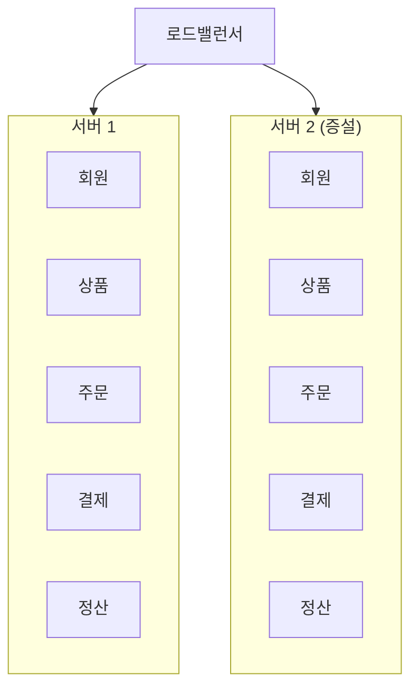
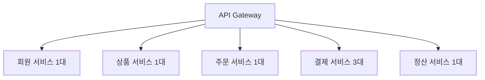
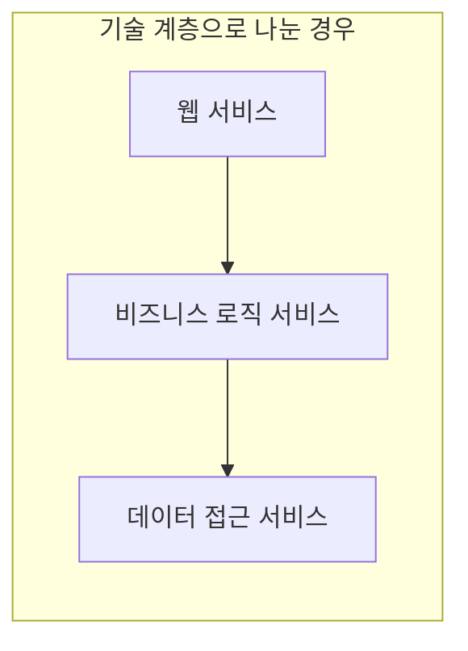
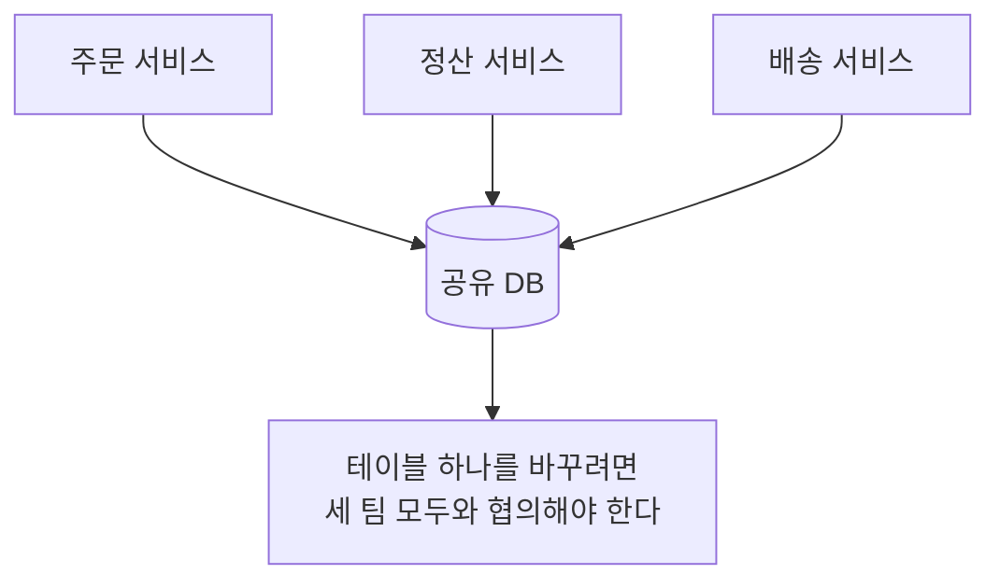
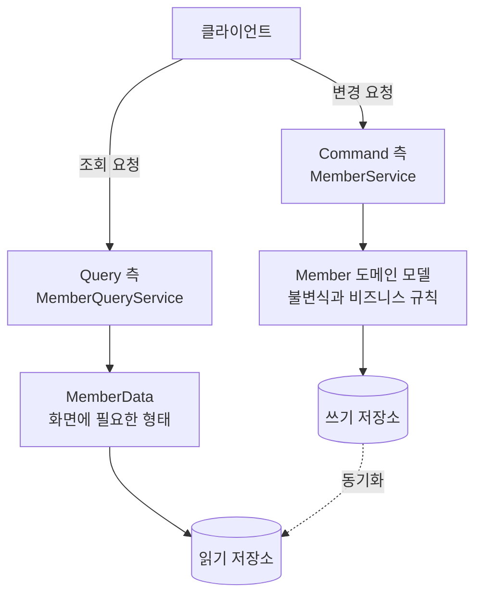
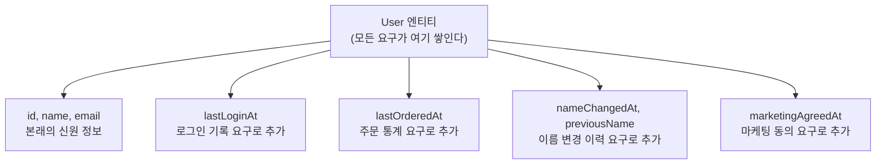
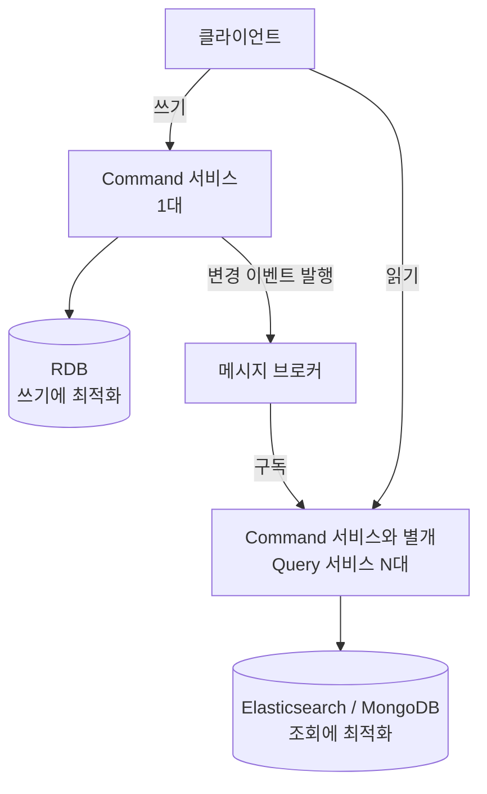
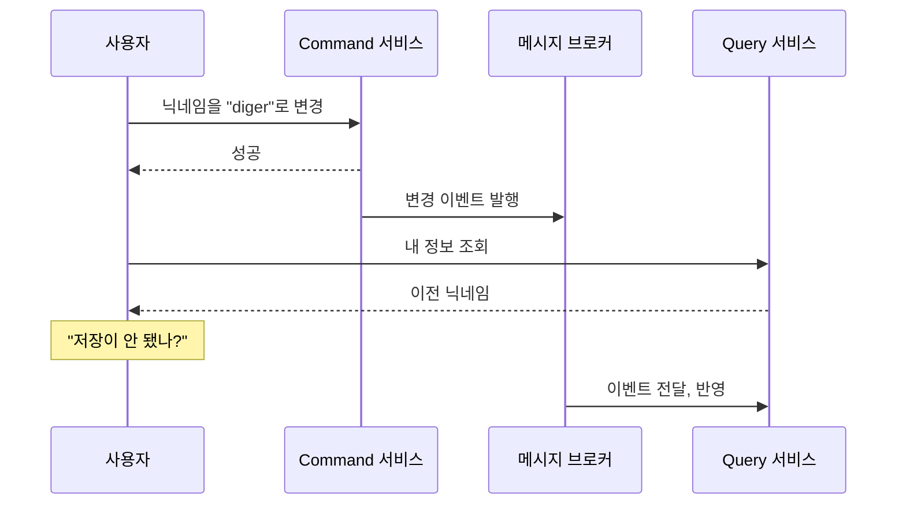
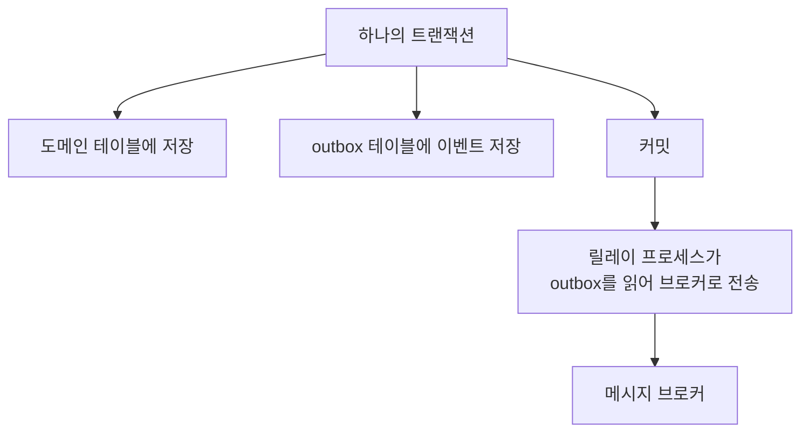

---

title: "유연한 시스템은 무엇을 유연하게 만드는가, 마이크로서비스와 CQRS 자문자답"
date: 2023-12-29
categories: [Architecture]
tags: [MSA, CQRS, EventDriven, Monolith, Architecture, DDD]
layout: post
toc: true
math: true
mermaid: true

---

## 참고자료

- [Martin Fowler - Microservices](https://martinfowler.com/articles/microservices.html)
- [Martin Fowler - MicroservicePremium](https://martinfowler.com/bliki/MicroservicePremium.html)
- [Martin Fowler - MonolithFirst](https://martinfowler.com/bliki/MonolithFirst.html)
- [Martin Fowler - CQRS](https://martinfowler.com/bliki/CQRS.html)
- [Microsoft Architecture Center - CQRS pattern](https://learn.microsoft.com/en-us/azure/architecture/patterns/cqrs)
- [microservices.io - Saga pattern](https://microservices.io/patterns/data/saga.html)
- [우아한형제들 - 마이크로서비스 아키텍처 강의](https://www.youtube.com/watch?v=3pybGLmTREw)

---

## 배경

마이크로서비스는 늘 "확장에 유리하다"는 말과 함께 나온다. 그런데 무엇이 어떻게 유리해지는지가 손에 안 잡혔다.

CQRS도 마찬가지였다. 읽기와 쓰기를 나눈다는 것까지는 알겠는데, **왜 나누면 좋아지는지**가 설명이 안 됐다.

정리하면서 확인하고 싶었던 것들이다.

- 서버를 나누면 정확히 무엇이 절약되는가?
- 마이크로서비스의 원칙 중에 실제로 지키기 어려운 것은 무엇인가?
- CQRS에서 읽기 모델과 쓰기 모델이 다른 것이 왜 이득인가?
- 나눠서 잃는 것은 무엇인가?

---

## 1. 서버를 나누면 무엇이 절약되는가

첫 질문이다.

### 1.1 모놀리식을 늘릴 때

기능이 다섯 개인 서버가 있다고 하자. 결제 요청이 폭증했다.



**결제 요청만 늘었는데 회원, 상품, 주문, 정산까지 통째로 복제된다.**

늘려야 할 것은 결제 처리 능력인데, 자원은 다섯 배 분량으로 들어간다.

### 1.2 서비스를 나눠서 늘릴 때



**부하가 걸린 것만 늘린다.**

이게 첫 질문의 답이다. 절약되는 것은 **필요 없는 부분에 들어가던 자원**이다.

### 1.3 그런데 비용이 늘어난다

여기서 자주 빠뜨리는 부분이 있다. **총 비용은 대체로 마이크로서비스 쪽이 더 든다.**

늘어나는 항목이 이렇다.

| 항목 | 모놀리식 | 마이크로서비스 |
|---|---|---|
| 배포 대상 | 1개 | 서비스 수만큼 |
| 서비스 간 호출 | 메서드 호출 | 네트워크 호출 |
| 장애 지점 | 서버 | 서버 + 네트워크 + 각 서비스 |
| 데이터 정합성 | 트랜잭션 하나 | 분산 트랜잭션 또는 결과적 일관성 |
| 관측성 | 로그 하나 | 분산 추적 필요 |
| 운영 인력 | 적음 | 많음 |

**메서드 호출이 네트워크 호출로 바뀐다는 것 하나가 많은 것을 끌고 온다.** 타임아웃을 정해야 하고, 실패하면 재시도할지 정해야 하고, 상대가 죽었을 때 연쇄로 무너지지 않게 막아야 한다.

Martin Fowler가 "마이크로서비스 프리미엄"이라고 부르는 것이 이 비용이다. **시스템이 충분히 복잡해서 그 비용을 상쇄할 만할 때만 이득**이라는 주장이다.

같은 사람이 "모놀리스 먼저"라는 글도 썼다. 처음부터 마이크로서비스로 시작하면 **경계를 잘못 그을 확률이 높다.** 도메인을 아직 모르는 상태에서 그은 선은 대개 틀리고, 서비스 경계를 잘못 그으면 되돌리는 비용이 코드 안의 모듈 경계를 고치는 것보다 훨씬 크다.

그러니 정확히 말하면 **자원을 아끼려고 나누는 것이 아니라, 필요한 곳에만 자원을 쓸 수 있게 되는 대신 다른 비용을 지불하는 것**이다.

---

## 2. 마이크로서비스의 원칙 여섯 가지

### 2.1 독립적으로 배포할 수 있어야 한다

**가장 중요하고, 나머지 다섯 개가 이걸 위해 존재한다고 봐도 된다.**

다른 서비스를 건드리지 않고 하나만 배포할 수 있어야 한다.

이게 안 되면 나눈 의미가 없다. **A를 배포할 때 B도 같이 배포해야 한다면, 배포 단위 기준으로는 여전히 하나의 시스템**이다. 오히려 네트워크 호출이 끼어든 만큼 더 나빠진 상태다.

그러려면 서비스 사이의 계약이 안정돼야 한다. API 명세를 함부로 깨면 안 되고, 바꿔야 한다면 **이전 버전과 새 버전이 함께 도는 기간**을 둬야 한다.

### 2.2 비즈니스 도메인을 중심으로 나눈다

**기술 계층이 아니라 도메인으로 경계를 긋는다.**

기술 계층으로 나누면 이렇게 된다.



**글쓰기 기능 하나를 추가하려면 셋 다 고쳐야 한다.** 배포도 셋 다 해야 하니 2.1이 깨진다.

도메인으로 나누면 한 기능이 한 서비스 안에서 끝난다.

기능 하나가 열 개 서비스에 걸쳐 있다고 생각해보면 비용이 명확해진다. 열 개와 통신하는 코드를 써야 하고, 열 개 팀과 이야기해야 하고, 호출 순서를 정해야 하고, 중간에 실패했을 때 어디까지 되돌릴지 정해야 한다.

**여러 서비스에 걸친 변경을 최소화하는 것이 목표**이고, 도메인 경계가 그 도구다.

### 2.3 자신의 상태를 가진다

**DB를 공유하지 않는다.**

다른 서비스의 데이터가 필요하면 그 서비스의 API로 요청한다. DB에 직접 붙지 않는다.

이유가 있다. **DB를 공유하면 테이블 구조가 계약이 된다.**



컬럼 하나를 못 바꾼다. 누가 그 컬럼을 읽고 있는지 알 수 없기 때문이다. **그러면 2.1의 독립 배포가 무너진다.**

API로만 접근하게 하면 **내부 구현을 숨길 수 있다.** 테이블을 통째로 바꿔도 API가 같으면 아무도 모른다.

### 2.4 다룰 수 있는 만큼만 나눈다

크기 이야기가 자주 나온다. James Lewis가 "내 머리가 이해할 수 있을 정도"라고 표현했다.

**그런데 이 기준은 사람마다 다르다.** 그 서비스를 오래 만진 사람과 새로 들어온 사람이 다르고, 스타트업과 대기업이 다르다.

그래서 크기보다 이 두 가지를 보는 편이 낫다.

**몇 개나 감당할 수 있는가.** 서비스가 늘어나면 복잡도가 서비스 수의 제곱에 가깝게 늘어난다. 배포 파이프라인, 모니터링, 장애 대응을 전부 곱해야 한다.

**경계를 명확히 그을 수 있는가.** 서비스끼리 서로 부르는 관계가 실타래처럼 얽히면 나눈 의미가 없다.

### 2.5 유연함에는 값이 있다

**지금 비용을 들여서 나중의 선택지를 사는 것**이 마이크로서비스다.

여기서 선택지란 하드웨어가 아니라 "나중에 이 부분만 바꿀 수 있는 여지"다.

**아직 안 일어난 일에 선택지를 너무 많이 사면 과잉 설계**다. 쓰지도 않을 유연함에 복잡도를 지불한 것이다.

그래서 점진적으로 옮기는 것이 권해진다. 모놀리스로 시작해서 **경계가 명확해지고 실제로 아픈 곳이 생긴 부분부터** 떼어낸다.

### 2.6 조직 구조와 맞춘다

**아키텍처는 조직 구조를 따라간다.** 콘웨이의 법칙이다.

프론트 팀, 백엔드 팀, DB 팀으로 나뉜 조직에서 도메인별 마이크로서비스를 만들면, **기능 하나를 만들 때마다 세 팀이 협의해야 한다.** 구조와 조직이 어긋나 있기 때문이다.

고객 팀, 구매 팀처럼 도메인으로 팀을 나누고 각 팀에 필요한 역할을 다 넣으면, 그 팀 안에서 기능이 완결된다.

**두 번째 질문의 답이 여기 있다.** 여섯 개 중 실제로 지키기 어려운 것은 2.3과 2.6이다.

2.3은 기술적으로 어렵다기보다 **당장 편한 길이 있어서** 안 지켜진다. 다른 서비스 테이블을 직접 읽으면 되는데 굳이 API를 만들 이유를 못 느낀다. 그러다 어느새 아무도 스키마를 못 바꾸는 상태가 된다.

2.6은 **개발팀이 정할 수 있는 일이 아니어서** 어렵다. 조직 개편은 다른 층위의 결정이다. 그래서 조직은 그대로인 채 아키텍처만 나누는 경우가 많고, 그러면 협의 비용만 늘어난다.

---

## 3. CQRS

세 번째 질문이다. 명령(Command)과 조회(Query)를 나누는 것이다.

### 3.1 무엇을 나누는가

**명령**은 데이터를 바꾸는 행위다. 주문 취소, 배송 완료 같은 것.

**조회**는 데이터를 읽는 행위다. 주문 목록 보기 같은 것.

CQRS는 책임 분리라는 개념에서 나왔다. **책임이란 구성 요소의 역할**이고, 여기서 구성 요소는 클래스, 함수, 모듈, 서버, DB까지 무엇이든 될 수 있다.



**나누는 층은 상황에 따라 다르다.** 클래스만 나눌 수도 있고, DB까지 나눌 수도 있다. 중요한 것은 바꾸는 쪽과 읽는 쪽을 분리한다는 것 자체다.

### 3.2 왜 나누면 좋은가

하나의 모델로 둘 다 하려고 하면 무슨 일이 생기는지 보면 답이 나온다.



**요구가 하나 늘 때마다 컬럼이 붙는다.** 각각은 합당해 보이지만 쌓이면 이 객체가 무엇인지 흐려진다.

문제가 두 갈래로 나타난다.

**조회할 때 안 쓰는 것까지 딸려 온다.** 사용자 이름만 보여주면 되는 화면인데 이력과 통계 컬럼까지 전부 읽어온다.

**바꿀 때 지켜야 할 규칙이 뒤섞인다.** "이름을 바꾸면 이전 이름을 남긴다"는 규칙과 "마지막 로그인 시각을 기록한다"는 동작이 같은 객체에 있으면, 어느 것이 도메인 규칙이고 어느 것이 부수적인 기록인지 구분이 안 된다.

**두 요구가 서로 다른 방향을 원하기 때문**이다.

| | 명령 쪽이 원하는 것 | 조회 쪽이 원하는 것 |
|---|---|---|
| 형태 | 규칙을 지킬 수 있는 최소 단위 | 화면에 바로 뿌릴 수 있는 형태 |
| 정규화 | 정규화가 유리 | 비정규화가 유리 |
| 대상 | 하나의 대상 | 여러 대상을 조인한 결과 |
| 빈도 | 상대적으로 적다 | 압도적으로 많다 |

하나의 모델로는 둘 다 만족시킬 수 없다.

### 3.3 코드로 보면

명령 모델은 평소에 쓰던 엔티티 그대로다.

```kotlin
@Table(name = "user")
@Entity
class UserEntity(

    @Id
    @GeneratedValue(strategy = GenerationType.IDENTITY)
    val id: Long = 0L,

    @Column(name = "oauth_token_payload", length = 255)
    var oauthTokenPayload: String?,

    @Column(name = "fcm_token_payload", length = 255)
    var fcmTokenPayload: String?,

    @Embedded
    var nickname: Nickname,

) : BaseEntity()
```

조회 모델은 **화면 하나에 하나씩** 만든다.

```kotlin
class UserRetrieveModel(
    val id: Long,
    val nickname: Nickname,
)

class UserPostRetrieveModel(
    val userId: Long,
    val userNickname: Nickname,
    val postId: Long,
    val postTitle: String,
    val postContent: String,
)

class UserOrderRetrieveModel(
    val userId: Long,
    val userNickname: Nickname,
    val orderId: Long,
    val orderStoreId: Long,
    val orderStoreName: String,
    val orderDateTime: LocalDateTime,
)
```

**이미 조인된 상태로 만들어져 있다.** 조회할 때 다시 조립하지 않아도 된다.

**조회 모델은 엔티티가 아니어도 된다는 점이 중요하다.** 불변식을 지킬 필요가 없으니 그냥 데이터 뭉치다. 그래서 화면이 바뀌면 그 모델만 고치면 되고 도메인 모델은 안 건드린다.

### 3.4 저장소까지 나누기

여기서 더 나아가면 저장소를 나눈다.



**쓰기는 관계형 DB를 쓴다.** 제약 조건, 트랜잭션, 정규화가 필요하기 때문이다.

**읽기는 조회에 유리한 저장소를 쓴다.** Elasticsearch나 MongoDB처럼 비정규화된 문서를 그대로 내주는 쪽이 빠르다.

**조회 서비스만 늘릴 수 있다는 것**이 1절에서 본 이야기와 이어진다. 읽기가 압도적으로 많으니 그쪽만 늘리면 된다.

### 3.5 그러면 두 저장소가 어긋난다

쓰기 저장소가 바뀌면 읽기 저장소도 따라 바뀌어야 한다.

쓰기 서비스가 저장하면서 **무슨 일이 일어났는지를 이벤트로 발행한다.** 조회 서비스가 그걸 구독해서 자기 저장소를 갱신한다.

**즉시 일치하지는 않는다.** 이벤트가 전달되고 반영되는 사이에 간격이 있다. 다만 시간이 지나면 결국 일치한다. 이걸 결과적 일관성이라고 부른다.

---

## 4. 나눠서 잃는 것

네 번째 질문이다. 여기가 CQRS 설명에서 가장 자주 빠지는 부분이다.

### 4.1 자기가 쓴 것을 못 읽는다

가장 먼저 부딪히는 문제다.



**저장하고 바로 조회하면 예전 값이 나온다.** 사용자 입장에서는 저장이 실패한 것으로 보인다.

대응 방법이 몇 가지 있다.

**쓰기 응답에 결과를 담아 보낸다.** 화면을 다시 그리지 않고 그 값을 쓴다. 가장 간단하고 대부분의 경우에 충분하다.

**본인 조회는 쓰기 저장소에서 한다.** 남의 데이터는 조회 저장소, 자기 데이터는 쓰기 저장소를 보게 한다.

**반영될 때까지 기다린다.** 이벤트 순번을 클라이언트가 들고 있다가 그 이후 데이터가 올 때까지 재시도한다. 복잡도가 확 올라간다.

### 4.2 코드가 두 벌이 된다

같은 데이터에 대해 쓰기 모델과 읽기 모델을 각각 관리한다. **화면이 늘 때마다 조회 모델도 는다.**

동기화 코드도 따로 필요하다. 이벤트를 발행하고, 구독하고, 실패하면 재처리하는 부분이 전부 새로 생긴다.

**이 비용을 감당할 만한지가 도입 기준이다.** 읽기와 쓰기의 부하 차이가 크지 않거나, 조회 요구가 단순하면 안 나누는 편이 낫다.

### 4.3 이벤트를 잃어버릴 수 있다

쓰기 저장소에 저장하는 것과 이벤트를 발행하는 것은 **다른 시스템에 대한 두 개의 쓰기**다. 하나가 성공하고 하나가 실패할 수 있다.

DB에는 저장됐는데 이벤트 발행이 실패하면 **조회 저장소가 영원히 못 따라간다.**

이걸 막는 방법 중 하나가 아웃박스 패턴이다. **이벤트를 같은 DB의 테이블에 함께 저장한다.** 그러면 한 트랜잭션 안에서 둘 다 커밋되거나 둘 다 롤백된다. 별도 프로세스가 그 테이블을 읽어 브로커로 보낸다.



### 4.4 CQRS와 이벤트 소싱을 섞어서 알기 쉽다

**둘은 별개다.** CQRS는 읽기와 쓰기를 나누는 것이고, 이벤트 소싱은 상태 대신 변경 이력을 저장하는 것이다.

CQRS만 쓰면서 쓰기 저장소에는 평범하게 현재 상태를 저장해도 된다. 오히려 그쪽이 흔하다.

**같이 쓰면 잘 맞는 것은 사실이다.** 이벤트 소싱은 현재 상태를 저장하지 않으니 조회가 어려운데, CQRS의 읽기 모델이 그 자리를 채운다. 그래서 자주 함께 언급되지만 하나를 하려고 다른 하나를 반드시 해야 하는 것은 아니다.

---

## 정리하며

처음 던진 질문들에 대한 답이다.

**서버를 나누면 무엇이 절약되는가.** 필요 없는 부분에 들어가던 자원이다. 모놀리식은 결제만 늘리고 싶어도 전부를 복제해야 하지만, 나눠두면 결제만 늘린다. 다만 총 비용은 대체로 늘어난다. 메서드 호출이 네트워크 호출로 바뀌면서 타임아웃, 재시도, 분산 추적, 분산 트랜잭션이 전부 따라온다.

**실제로 지키기 어려운 원칙.** DB를 공유하지 않는 것과 조직 구조를 맞추는 것이다. 앞의 것은 당장 남의 테이블을 읽는 편이 편해서 안 지켜지고, 뒤의 것은 개발팀이 정할 수 있는 일이 아니라서 안 지켜진다. 둘 중 하나만 깨져도 독립 배포가 무너진다.

**읽기 모델과 쓰기 모델이 다른 것이 왜 이득인가.** 두 쪽이 원하는 형태가 반대이기 때문이다. 쓰기는 규칙을 지킬 수 있는 최소 단위와 정규화를 원하고, 읽기는 화면에 바로 뿌릴 수 있는 비정규화된 형태를 원한다. 하나의 모델로 둘 다 맞추려 하면 요구가 늘 때마다 컬럼이 붙고 그 객체가 무엇인지 흐려진다.

**나눠서 잃는 것.** 자기가 방금 쓴 것을 바로 못 읽고, 모델과 동기화 코드가 두 벌이 되고, 저장과 이벤트 발행이 어긋나면 조회 저장소가 영원히 못 따라갈 수 있다.

정리하고 나서 남은 감각은 **분리가 공짜가 아니라는 것**이었다. 마이크로서비스도 CQRS도 "나누면 좋아진다"가 아니라 "이 비용을 내고 이 능력을 산다"에 가까웠다. 그러니 판단의 출발점은 "지금 무엇이 아픈가"이고, 아픈 데가 없으면 나눌 이유도 없었다.
