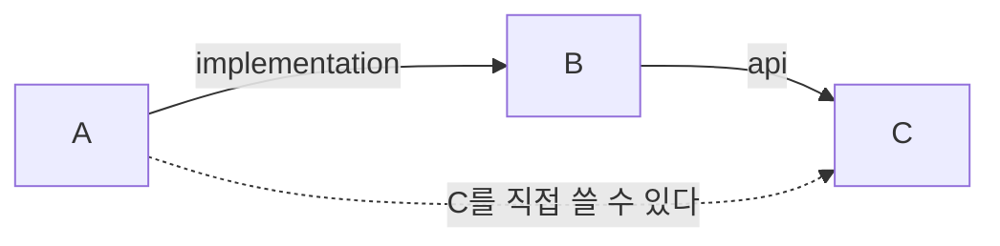
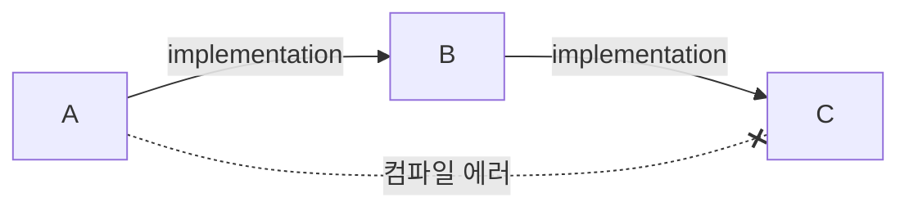
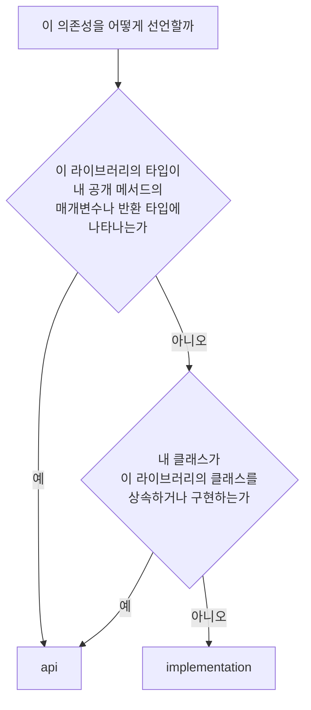

---

title: "Gradle의 api와 implementation은 무엇이 다른가"
date: 2023-12-30
categories: [Gradle, Java]
tags: [Gradle, Dependency, Build, Multimodule]
layout: post
toc: true
math: true
mermaid: true

---

## 참고자료

- [Gradle - The Java Library Plugin](https://docs.gradle.org/current/userguide/java_library_plugin.html)
- [Gradle - Declaring Dependencies](https://docs.gradle.org/current/userguide/declaring_dependencies.html)
- [Gradle - Incremental Build](https://docs.gradle.org/current/userguide/incremental_build.html)

---

## 배경

멀티 모듈 프로젝트에서 의존성을 선언하는데 `api`와 `implementation`이 둘 다 나왔다. 둘 다 동작하는 것 같아서 아무거나 썼는데, 나중에 컴파일 에러가 나면서 차이를 알게 됐다.

정리하면서 확인하고 싶었던 것들이다.

- 정확히 무엇이 다른가?
- `api`가 더 편해 보이는데 왜 `implementation`을 권하는가?
- 무엇을 기준으로 고르는가?

공식 문서를 보면서 정리했다.

---

## 1. 두 개의 클래스패스

먼저 이 구분부터 해야 나머지가 정리된다.

Gradle은 의존성을 **컴파일 시점**과 **런타임 시점**으로 나눠 관리한다.

| | 언제 필요한가 |
|---|---|
| 컴파일 클래스패스 | 소스를 컴파일할 때 |
| 런타임 클래스패스 | 애플리케이션을 실행할 때 |

두 시점에 필요한 것이 다르다. 예를 들어 인터페이스만 참조하는 코드는 컴파일할 때 그 인터페이스가 필요하고, 실행할 때는 구현체도 필요하다.

**`api`와 `implementation`의 차이가 여기서 나온다.** 둘 다 이 모듈을 컴파일하고 실행하는 데는 똑같이 쓰인다. 다른 것은 **이 모듈을 쓰는 다른 모듈에게 어디까지 노출되는가**다.

---

## 2. 차이

A가 B를 쓰고, B가 C를 쓰는 상황으로 본다.

### 2.1 api

```gradle
// B의 build.gradle
dependencies {
    api project(':C')
}
```

```gradle
// A의 build.gradle
dependencies {
    implementation project(':B')
}
```

이러면 **A에서 C의 클래스를 직접 쓸 수 있다.** B가 `api`로 선언했으므로 C가 B를 쓰는 쪽까지 전파된다.



### 2.2 implementation

```gradle
// B의 build.gradle
dependencies {
    implementation project(':C')
}
```

이러면 **A에서 C의 클래스를 쓰려고 하면 컴파일 에러가 난다.**



C가 B의 **내부 구현**이라고 선언한 것이기 때문이다. B는 C를 쓰지만, 그 사실을 밖에 알리지 않는다.

**실행 시점에는 C가 클래스패스에 있다.** B가 동작하려면 필요하기 때문이다. 막히는 것은 컴파일 시점의 참조뿐이다.

### 2.3 표로

| | `api` | `implementation` |
|---|---|---|
| 이 모듈의 컴파일 | 가능 | 가능 |
| 이 모듈의 실행 | 가능 | 가능 |
| 쓰는 쪽의 컴파일 | **노출됨** | 노출 안 됨 |
| 쓰는 쪽의 실행 | 클래스패스에 있음 | 클래스패스에 있음 |

---

## 3. 왜 implementation을 권하는가

두 번째 질문이다. `api`가 편해 보이는데 기본값으로 권하지 않는 이유가 둘이다.

### 3.1 다시 빌드하는 범위가 달라진다

Gradle은 바뀐 것만 다시 빌드한다. 그 판단 범위가 두 방식에서 다르다.

**`api`로 연결되어 있으면** C가 바뀔 때 B도 A도 다시 컴파일해야 한다. C의 클래스가 A의 컴파일 클래스패스에 들어 있기 때문이다.

**`implementation`으로 연결되어 있으면** C가 바뀌어도 B만 다시 컴파일하면 된다. A는 C를 모르므로 영향을 받지 않는다.


모듈이 몇 개 안 되면 차이가 안 느껴진다. **모듈이 수십 개인 프로젝트에서는 이 차이가 빌드 시간을 크게 가른다.**

정확히 말하면 여기에 한 가지가 더 붙는다. `implementation`이어도 **B의 공개 API 시그니처가 바뀌면** A는 다시 컴파일된다. 바뀌지 않으면 B의 내부만 고친 것으로 보고 A를 건너뛴다.

### 3.2 의존 관계가 흐려진다

`api`를 쓰면 A가 C를 직접 쓸 수 있게 된다. **그런데 A의 `build.gradle`에는 C가 안 적혀 있다.**

시간이 지나면 A 코드 여기저기서 C를 쓰게 되는데, A는 자기가 C에 의존한다는 사실을 선언한 적이 없다. 나중에 B가 C를 `implementation`으로 바꾸거나 아예 다른 것으로 교체하면 **A가 통째로 깨진다.**

**의존한다면 직접 선언해야 한다**는 것이 원칙이고, `implementation`이 그것을 강제한다.

---

## 4. 그럼 언제 api를 쓰는가

세 번째 질문이다. 안 쓰는 것이 아니라, 쓸 자리가 정해져 있다.

기준은 하나다. **그 타입이 이 모듈의 공개 API 시그니처에 나타나는가.**

### 4.1 api가 필요한 경우

```java
// B 모듈
public class OrderService {
    // 반환 타입이 C 모듈의 클래스다
    public com.example.c.OrderResult process(Order order) { ... }
}
```

A가 `process()`를 호출하려면 반환 타입인 `OrderResult`를 알아야 한다. **모르면 컴파일이 안 된다.**

이 경우 B는 C를 `api`로 선언해야 한다. 안 하면 A가 이 메서드를 못 쓴다.

같은 이유로 이런 경우들도 `api`가 필요하다.

- 공개 메서드의 **매개변수 타입**
- 공개 메서드의 **반환 타입**
- 공개 필드의 타입
- 상속하는 클래스나 구현하는 인터페이스
- 공개 메서드가 던지는 예외 타입

### 4.2 implementation이면 되는 경우

```java
// B 모듈
public class OrderService {

    // C 모듈의 클래스를 내부에서만 쓴다
    private final com.example.c.Validator validator = new com.example.c.Validator();

    public boolean process(Order order) {   // 반환 타입에 C가 없다
        return validator.check(order);
    }
}
```

`Validator`는 B 안에서만 쓰이고 밖으로 나가지 않는다. A는 이 클래스를 알 필요가 없다.

**JSON 라이브러리, 로깅 라이브러리, 유틸리티 같은 것들이 대체로 여기 해당한다.**

### 4.3 판단 흐름



**애매하면 `implementation`으로 시작한다.** 필요하면 컴파일 에러가 나면서 알려준다. 반대 방향은 알려주지 않는다.

---

## 5. 알아둘 것들

### 5.1 java-library 플러그인이 필요하다

`api` 설정은 `java` 플러그인에는 없다. `java-library` 플러그인을 적용해야 쓸 수 있다.

```gradle
plugins {
    id 'java-library'
}
```

애플리케이션 모듈에는 `java` 플러그인만 써도 된다. 그 모듈을 다른 모듈이 참조하지 않으므로 `api`를 쓸 일이 없다.

### 5.2 compile은 제거됐다

예전에는 `compile`이라는 설정이 있었다. `api`처럼 전파되는 방식이었고, Gradle 7에서 제거됐다.

오래된 자료에서 `compile`을 보면 지금은 `api` 또는 `implementation`으로 바꿔 읽으면 된다. 대부분의 경우 `implementation`이 맞는 대응이다.

### 5.3 다른 설정들

자주 쓰는 것들이다.

| 설정 | 언제 쓰는가 |
|---|---|
| `implementation` | 이 모듈 안에서만 쓴다 |
| `api` | 공개 API에 나타난다 |
| `compileOnly` | 컴파일할 때만 필요하고 실행할 때는 없어도 된다 |
| `runtimeOnly` | 실행할 때만 필요하다 |
| `annotationProcessor` | 애노테이션 처리기 |
| `testImplementation` | 테스트 코드에서만 쓴다 |

`compileOnly`가 쓰이는 대표적인 경우가 롬복이다. 컴파일 시점에 코드를 생성하고 나면 실행 시점에는 필요 없다.

`runtimeOnly`는 JDBC 드라이버가 대표적이다. 코드에서 드라이버 클래스를 직접 참조하지 않으므로 컴파일에는 필요 없지만, 실행할 때는 클래스패스에 있어야 한다.

### 5.4 현재 상태 확인하기

어떤 의존성이 어디서 왔는지 볼 수 있다.

```bash
# 컴파일 클래스패스에 들어 있는 것
./gradlew :moduleA:dependencies --configuration compileClasspath

# 런타임 클래스패스
./gradlew :moduleA:dependencies --configuration runtimeClasspath

# 특정 라이브러리가 왜 들어왔는지
./gradlew :moduleA:dependencyInsight --dependency jackson-databind --configuration compileClasspath
```

`dependencyInsight`가 유용하다. **의도하지 않은 라이브러리가 컴파일 클래스패스에 있으면** 어느 모듈이 `api`로 노출했는지 여기서 나온다.

---

## 정리하며

처음 던진 질문들에 대한 답이다.

**무엇이 다른가.** 이 모듈을 컴파일하고 실행하는 데는 똑같다. 다른 것은 이 모듈을 쓰는 쪽의 컴파일 클래스패스에 전파되는지 여부다. `api`는 전파되고 `implementation`은 안 된다.

**왜 `implementation`을 권하는가.** 다시 빌드하는 범위가 좁아지고, 의존 관계가 선언에 그대로 드러난다. `api`로 전파된 것을 쓰면 자기 `build.gradle`에 없는 것에 의존하게 되고, 중간 모듈이 그 의존을 바꾸는 순간 깨진다.

**무엇을 기준으로 고르는가.** 그 타입이 이 모듈의 공개 메서드 시그니처에 나타나면 `api`, 내부에서만 쓰면 `implementation`이다. 애매하면 `implementation`으로 시작한다. 필요하면 컴파일 에러가 알려주지만 반대는 알려주지 않는다.
