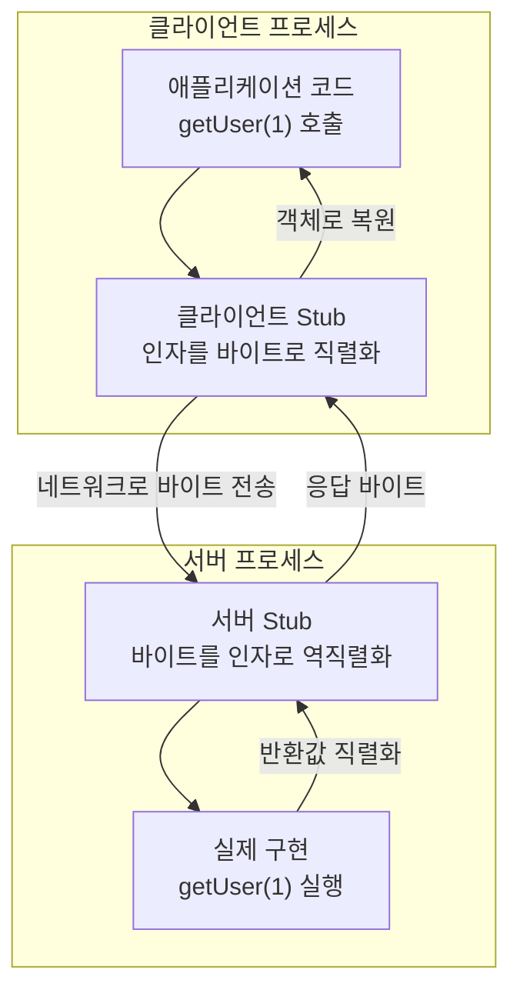
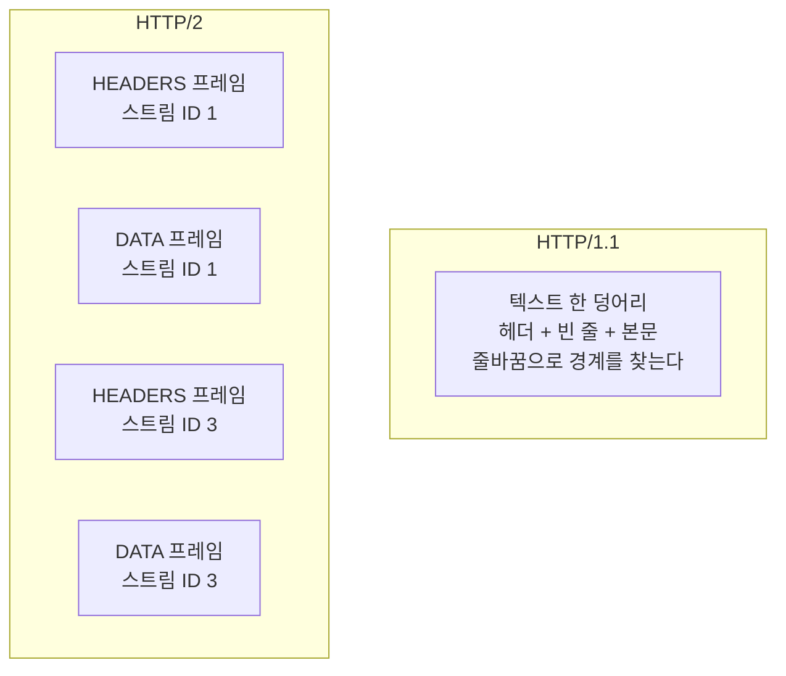

---

title: "서비스 사이 통신을 gRPC로 바꾸면서 알아본 것들"
date: 2024-02-10
categories: [gRPC]
tags: [gRPC, ProtocolBuffers, HTTP2, RPC, MSA, Spring]
layout: post
toc: true
math: true
mermaid: true

---

## 참고자료

- [gRPC 공식문서 - Introduction](https://grpc.io/docs/what-is-grpc/introduction/)
- [gRPC 공식문서 - Core concepts](https://grpc.io/docs/what-is-grpc/core-concepts/)
- [Protocol Buffers - Encoding](https://protobuf.dev/programming-guides/encoding/)
- [Protocol Buffers - Language Guide (proto3)](https://protobuf.dev/programming-guides/proto3/)
- [RFC 9113 - HTTP/2](https://www.rfc-editor.org/rfc/rfc9113.html)
- [RFC 7541 - HPACK: Header Compression for HTTP/2](https://www.rfc-editor.org/rfc/rfc7541.html)
- [grpc-spring-boot-starter](https://github.com/grpc-ecosystem/grpc-spring)

---

## 배경

서비스를 여러 개로 나누고 나니 서로를 부를 일이 계속 생겼다. 처음에는 전부 HTTP와 JSON으로 붙였다.

동작은 했는데 걸리는 것들이 있었다. **응답 형식이 문서에만 있고 코드에는 없어서**, 한쪽이 필드 이름을 바꾸면 상대는 배포하고 나서야 알았다. 그리고 서비스 하나를 부르는 데 여러 번 왕복하는 경로에서는 직렬화 비용이 눈에 띄었다.

gRPC로 바꾸기로 하고 조사한 내용을 정리한다.

정리하면서 확인하고 싶었던 것들이다.

- RPC는 결국 네트워크 호출인데 왜 함수 호출처럼 쓸 수 있는가?
- Protobuf가 JSON보다 작다는데 무엇을 줄인 것인가?
- gRPC는 왜 HTTP/2를 요구하는가?
- 바꾸면 무엇을 얻고 무엇을 포기하는가?

---

# gRPC 등장 배경

구글에서 개발한 프레임워크이다. PB(Protocol Buffer, 프로토콜 버퍼)기반 Serizlaizer에 HTTP/2를 결합한 RPC 프레임워크이다.

## IPC (Inter Process Communication 프로세스 간 통신)

운영체제에는 IPC기법이 있다. 이 방식으로 서로 다른 서버간의 프로세스끼리 통신을 하며 정보를 교환할 수 있다.

IPC 기법에는 소켓, 공유 메모리, PIPE, 메시지 큐 등 여러가지 기법이있다.

그 중 소켓 통신은 E2E를 직접 연결하여 데이터를 스트리밍하며 받는 형태로 통신하기 때문에 통신간에 발생하는 예외처리, 주고받아야할 데이터가 방대해질 때의 후처리가 매우 어렵기 때문에 확장성 측면의 불편함이 있다.

## RPC (Remote Procedure Call 원격 프로시저 호출)

이러한 IPC의 단점을 조금 더 완화하고자 RPC기법이 등장했다.

RPC는 네트워크 상으로 연결된 원격 서버의 함수를 호출 할 수 있도록 해서 네트워크 통신을 위한 작업을 고려하지 않도록할 수 있고 통신이나 call 방식에 신경쓰지 않고 원격지의 자원을 사용할 수 있다.

RPC에는 `Stub`이라는 주요 개념이 등장한다. `Stub`이란 Client와 Server간의 데이터를 각 환경에 맞게 변환해주는 것이다.

만약 `Stub`이 없다면

- Client와 Server는 전혀 다른 메모리 공간을 사용하고 있기 때문에 Client측 에서 가리키던 포인터가 Server측으로 넘어가게 되면서 전혀 다른 곳을 가리키게된다.
- Client는 리틀 엔디안 형식을 사용하지만 Server측은 빅 엔디안 형식을 사용한다는 경우 의도와 다르게 동작할 것이다.

이러한 이유들로 각 데이터들은 `Stub`을 거쳐 Packet의 형태로 전달된다.



**호출하는 쪽 코드에서는 그냥 메서드를 부른 것처럼 보인다.** 네트워크가 오가는 것을 Stub이 감춘다.

---

# gRPC - ProtoBuf (Protocol Buffer, 프로토콜 버퍼)

Google에서 개발한 구조화된 데이터를 직렬화(Serialization)하는 기법이다. 직렬화란, 데이터 표현을 바이트 단위로 변환하는 작업으로 아래 그림처럼 같은 정보를 저장해도

**TEXT기반인 JSON**의 경우 `82Byte`가 소요되는데 **직렬화 된 Protocol Buffer**는 필드 번호, 필드 유형 등을 1Byte로 받아서 식별하고, 주어진 length 만큼만 읽도록 하여 `33Byte`만 필요하게 된다.

같은 데이터를 두 방식으로 표현하면 이렇게 갈린다.

| | 담는 것 | 크기 |
|---|---|---|
| JSON | `{"id":1,"name":"diger","email":"a@b.com"}` 처럼 **필드 이름 문자열이 그대로 들어간다** | 82바이트 |
| Protobuf | 필드 이름 대신 **번호 1, 2, 3**과 값만 들어간다 | 33바이트 |

**차이의 대부분은 필드 이름이다.** JSON은 `"name"`이라는 네 글자와 따옴표, 콜론을 매번 실어 보낸다. Protobuf는 그 자리에 번호 하나만 넣는다.

이게 가능한 이유는 **양쪽이 `.proto` 파일을 미리 공유하고 있기 때문**이다. 2번 필드가 이름이라는 것을 이미 알고 있으니 이름을 보낼 이유가 없다.

**그래서 `.proto` 파일이 계약이 된다.** 필드 번호를 함부로 바꾸면 같은 바이트가 다른 뜻으로 읽힌다.

## ProtoBuf - Base 128 Varint

[Protobuf-guide](https://protobuf.dev/programming-guides/encoding/)에 따르면 프로토버퍼는 기본 인코딩 기법으로 Base 128 Varints라는 인코딩 형식을 사용하여 데이터를 압축적으로 표현할 수 있다.

Varint는 하나 이상의 바이트를 사용해서 가변 길이의 정수를 인코딩(직렬화)하는 방식으로 1~10Byte의 길이를 가지고 그 크기는 인코딩하려는 값에 따라 달라진다.

숫자가 더 적을수록 적은 수의 바이트를 사용한다.

마지막 바이트를 제외한 Varint에는 최상위 비트(most significant bit, MSB)가 설정되어 있고, 이는 앞으로 바이트가 더 있음을 나타낸다.

Varint 인코딩 방식은 다음과 같다.

각 바이트의 최상위 비트는 `Continuation bit`이며, 이는 현재 바이트 다음에 더 이어질 바이트가 있는지를 나타낸다. 그래서 1이면 숫자를 표현하기 위한 바이트가 뒤에 더 있음을, 0이면 숫자의 끝을 의미한다. 이 bit를 제외한 나머지 7비트는 실제 정수를 표현하기 위한 데이터이다.

예를 들어, 숫자 `300`을 Varint로 인코딩하면 두 바이트가 필요하다.

### Decimal -> Varint

```text
300 (10진수)
  ↓ 이진수로
        1 0010 1100          (9비트)
  ↓ 14비트가 되도록 앞을 0으로 채운다
  00 0001 0010 1100
  ↓ 7비트씩 끊는다 (앞이 상위, 뒤가 하위)
  0000010 | 0101100
  ↓ 리틀 엔디언이므로 하위 7비트를 먼저 보낸다
  0101100 | 0000010
  ↓ 각 덩어리 앞에 continuation 비트를 붙인다
  1 0101100   0 0000010
  └┬┘         └┬┘
  뒤에 더 있음  여기서 끝
  ↓
  10101100 00000010   (2바이트)
```

1. 숫자 `300`을 이진수로 바꾸면 `100101100`이 된다. 이 숫자를 Varint로 인코딩하려면 7비트 단위로 쪼개야 한다.
  2. `100101100`은 9비트이므로, 앞에 `0`으로 Padding하여 14비트로 만든다. 따라서 `00000100101100`이 된다.
3. 이제 이를 7비트 단위로 나누면 `0000010` `0101100`이 된다. (varint는 little-endian 방식을 사용하므로, 작은 단위의 바이트부터 읽어야 한다.)
4. Varint 인코딩에서는 각 7비트 덩어리 앞에 `Continuation` 비트를 추가한다.
  5. 첫 번째 7비트는 다음에 또 다른 바이트가 온다는 뜻으로 `1`을 붙이고, 두 번째 7비트는 더 이상 바이트가 없다는 뜻으로 `0`을 붙인다. 그래서 `10101100 00000010`이 된다.

### Varint -> Decimal

```text
10101100 00000010   (받은 2바이트)
  ↓ 각 바이트의 최상위 비트(continuation)를 떼어낸다
  1|0101100  →  0101100   (continuation 1, 뒤에 더 있음)
  0|0000010  →  0000010   (continuation 0, 여기서 끝)
  ↓ 리틀 엔디언이므로 순서를 뒤집어 이어 붙인다
  0000010 0101100
  ↓ 하나의 이진수로 읽는다
  00000100101100 = 100101100
  ↓ 10진수로
  300
```

1. `10101100 00000010`를 다시 10진수로 변환하면,
  2. `10101100`은 최상위 비트를 제외하고 나머지를 이진수로 해석하면 `0101100` 즉, `44`이다.
  3. `00000010`은 최상위 비트를 제외하고 나머지를 이진수로 해석하면 `0000010` 즉, `2`이다.
4. 이 두 숫자를 그냥 더하면 안 된다. 각 바이트에서 떼어낸 7비트를 이어 붙여야 하고, 리틀 엔디언이므로 **순서를 뒤집어서** 붙인다. 그래서 `0000010` + `0101100` = `00000100101100`이 된다.
5. 이 이진수의 앞쪽 0을 떼면 `100101100`이고, 10진수로 바꾸면 300이다.

자릿수를 세어보면 확인된다. 7비트 두 덩어리이므로 이어 붙인 결과는 14비트여야 한다. 계산 도중에 자릿수가 안 맞으면 어딘가에서 비트를 흘린 것이다.

**같은 계산을 곱셈으로 해도 된다.** 하위 덩어리가 44, 상위 덩어리가 2이므로 `44 + 2 × 128 = 300`이다. 상위 덩어리마다 128의 거듭제곱을 곱한다.

위와 같은 직렬화 방식으로 원래 일반적으로 정수를 표현하기 위해 4Byte를 사용하던 직렬화 방식을 2Byte를 사용하도록 최적화 하는 것이 Base 128 Varint 방식이된다.

---

## ProtoBuf - Message Buffer

직렬화 후 메시지는 Key-Value로 구성된 이진 데이터 스트림이 된다. 이 구조는 서로 다른 필드를 구분하기 위해 구분 기호가 필요하지 않는다.

Optional 필드의 경우, 메시지에 필드가 없을 때 최종 메시지 버퍼에 포함되지 않는다. 이로인해 메시지 자체의 크기를 절약할 수 있다.

### Key

Key는 특정 필드를 식별하는 데 사용된다. 압축을 풀 때 클라이언트는 구조체 객체를 생성하고 Protobuf는 데이터 스트림에서 데이터를 읽고 역직렬화한다. 키를 기반으로 해당 값을 구조체의 적절한 필드에 일치시킬 수 있다.

Key는 필드 번호와 자료형(Wire Type)으로 구성된다. 바이트의 하위 3비트는 자료형(Wire Type)을 나타내고 나머지 비트는 필드 번호를 나타낸다.

```text
   바이트 하나를 비트로 펼치면

   0 0 0 0 1 0 1 0
   └─────┬───┘ └┬┘
    필드 번호 1  Wire Type 2
                (길이가 앞에 붙는 타입)
```

**하위 3비트를 Wire Type에 쓰는 이유**가 있다. Wire Type은 종류가 몇 개뿐이라 3비트면 충분하다. 남는 비트를 전부 필드 번호에 주면 **번호 15까지는 Key가 1바이트로 끝난다.**

`.proto`를 설계할 때 **자주 쓰는 필드에 1부터 15까지의 번호를 주라는 권고**가 여기서 나온다. 16번부터는 Key가 2바이트가 된다.

| Wire Type | 값 | 담는 것 |
|---|---|---|
| VARINT | 0 | int32, int64, bool, enum |
| I64 | 1 | fixed64, double |
| LEN | 2 | string, bytes, 내장 메시지, 반복 필드 |
| I32 | 5 | fixed32, float |

---

# gRPC - HTTP/2

위에서 알아본 직렬화 기법으로 만들어진 Binary Data는 gRPC에서 클라이언트와 서버 간에 HTTP/2.0 프로토콜로 전송된다.

HTTP/2.0에는 멀티플렉싱, 헤더 압축, 서버 푸시 등 몇 가지 주요 기능이 도입되었다.

## 멀티플렉싱

멀티플렉싱은 단일 연결을 통해 여러 요청과 응답을 전송할 수 있어 지연 시간을 줄이고 전반적인 성능을 향상시킨다.

## 헤더 압축

헤더 압축은 헤더 필드 인덱싱과 정적 또는 동적 테이블을 사용한 헤더 필드 표현이라는 두 가지 주요 기술을 적용하여 헤더 전송의 오버헤드를 줄여 효율성을 더욱 향상시키며 HPACK이라고도 한다.

## 서버 푸시

서버 푸시는 서버가 클라이언트의 요청없이도 클라이언트에 리소스를 전송할 수 있도록하여 추가적인 요청이 필요하지 않도록 해준다.

## 바이너리 기반 데이터 전송

HTTP/1.1은 일반적으로 TEXT로 데이터를 표현하여 전송한다. 하지만 HTTP/2.0부터는 데이터를 Binary Frame으로 표현하여 전송하므로 통신 간 용량이 감소되었다.



**프레임으로 쪼갠 것이 멀티플렉싱을 가능하게 한다.**

HTTP/1.1은 한 연결에서 요청을 하나씩 처리한다. 앞 응답이 끝나야 다음이 시작되므로, 앞에 느린 요청이 있으면 뒤가 전부 막힌다.

HTTP/2는 **각 프레임에 스트림 ID가 붙어 있어서** 여러 요청의 프레임이 섞여 흘러도 받는 쪽이 다시 조립할 수 있다. 순서가 뒤바뀌어도 된다.

**텍스트를 그대로 두고는 이걸 할 수 없다.** 어디가 경계인지 알려면 끝까지 읽어야 하기 때문이다. 프레임에는 길이가 앞에 적혀 있어서 그만큼만 읽으면 된다.

---

## HTTP Versioning

| 버전 | 나온 해 | 전송 방식 | 한 연결에서 |
|---|---|---|---|
| HTTP/1.0 | 1996 | 텍스트 | 요청 하나마다 연결을 새로 맺는다 |
| HTTP/1.1 | 1997 | 텍스트 | 연결을 재사용하지만 요청은 하나씩 |
| HTTP/2 | 2015 | 바이너리 프레임 | 여러 요청을 섞어서 동시에 |
| HTTP/3 | 2022 | 바이너리 (QUIC 위) | 여러 요청을 동시에, TCP 대신 UDP |

**gRPC는 HTTP/2를 요구한다.** 스트리밍과 멀티플렉싱이 HTTP/2의 기능이기 때문이다.

이게 실무에서 제약이 된다. **중간에 HTTP/1.1만 아는 프록시나 로드밸런서가 있으면 gRPC가 안 통한다.** 브라우저에서 gRPC를 직접 못 쓰는 것도 같은 이유이고, 그래서 gRPC-Web이라는 별도 방식이 있다.

### HTTP/1.1

"Hello, World!" 라는 응답 메시지를 HTTP/1.1로 전송한다면, 일반적으로 우리가 주고받는 형태의 TEXT기반의 데이터를 사용한다.

```http request

HTTP/1.1 200 OK\r\n
Date: Mon, 27 Jul 2009 12:28:53 GMT\r\n
Server: Apache\r\n
Last-Modified: Wed, 22 Jul 2009 19:15:56 GMT\r\n
Content-Length: 13\r\n
Content-Type: text/plain\r\n
Connection: Closed\r\n
\r\n
Hello, World!

```

### HTTP/2

"Hello, World!" 라는 응답 메시지를 HTTP/2로 전송한다면, 요청과 응답은 바이너리로 인코딩된다.

```http request
+------------------------------------+
| Length (24)                        |
+------------------------------------+----------------+
| Type (8) | Flags (8)               |
+-+----------------------------------+----------------+
| R | Stream Identifier (31)        |
+=+==================================+===============+
| Frame Payload (0...)            ...
+------------------------------------+
```

## 왜 gRPC는 HTTP/2를 채택했는가?

바이너리 프로토콜과 양방향 스트리밍 방식 덕분에 HTTP/2.0의 성능과 효율성은 HTTP/1.1과 HTTPS보다 훨씬 뛰어나다.

또한 HTTP/3.0은 UDP 위에 구축된 QUIC 전송 프로토콜을 사용하여 향상된 안정성, 낮은 지연 시간, 더 나은 혼잡 제어 기능을 제공한다.

HTTP/3.0은 가장 좋은 성능을 제공할 수 있으나 프로토콜의 성숙도, 사용 가능한 구현, 기존 인프라 및 도구와의 호환성 등 여러 고려사항으로 인해 아직 gRPC에 적용된 사항이 아니게되었다.

결론적으로, 효율을 더 높일 수 있는 HTTP/2.0을 채택했으나 더 좋은 효율성을 기대할 수 있는 HTTP/3.0은 아직 불안정하다고 판단했기 때문에 HTTP/2.0을 사용한다. 추후 많은 증명과 고찰이 담긴다면 이 기반 프로토콜 역시 변경될 여지가 있다.

---

# gRPC 사용법 [Java/Spring Boot]

## gRPC Interface

gRPC로 E2E 통신을 하기 위해서는 상호간이 알고 있는 Protobuf를 정의해야한다. 이를 인터페이스라고 지칭한다.

우선 Java/Spring 기반의 프로젝트에서 사용할 예정이라면 아래와 같은 의존성을 추가해야한다.

```groovy
buildscript {
    ext {
        protobufVersion = '3.14.0'
        protobufPluginVersion = '0.9.4'
        grpcVersion = '1.60.0'
    }
}

plugins {

    ...

    id 'com.google.protobuf' version "${protobufPluginVersion}"

    ...
}
dependencies {

    ...

    implementation "io.grpc:grpc-protobuf:${grpcVersion}"
    implementation "io.grpc:grpc-stub:${grpcVersion}"

    ...
}

protobuf {
    protoc {
        artifact = "com.google.protobuf:protoc:${protobufVersion}"
    }
    plugins {
        grpc {
            artifact = "io.grpc:protoc-gen-grpc-java:${grpcVersion}"
        }
    }
    generateProtoTasks.generatedFilesBaseDir = 'src/generated'
    generateProtoTasks {
        all()*.plugins {
            grpc {}
        }
    }
}
```

위 의존성을 땡겨받은 후에 아래와 같은 형식으로 패키징을 잡는다.

```text
src
└── main
    ├── kotlin
    │   └── org/palette/...
    └── proto                 ← 여기에 .proto 파일을 둔다
        └── passport.proto
```

**디렉터리 이름이 `proto`여야 한다.** 프로토콜 버퍼 그레이들 플러그인이 기본으로 `src/main/proto`를 찾는다. 다른 곳에 두려면 소스 집합을 따로 지정해야 한다.

빌드하면 생성된 클래스가 `build/generated/source/proto/main/` 아래에 만들어지고, 그것을 소스 집합에 자동으로 추가한다. 그래서 IDE에서 생성된 클래스가 안 보이면 빌드를 한 번 돌린 뒤 프로젝트를 다시 읽으면 된다.

그리고 데이터를 주고받을 DTO성격의 Protobuf를 정의하고 공통 모듈이든 각 E2E에든 알고 있게 해야한다.

```protobuf
syntax = "proto3";

option java_multiple_files = true;
option java_package = "org.palette.grpc";

message GPassport {
  int64 id = 1;
  string email = 2;
  string nickname = 3;
  string username = 4;
  string role = 5;
  bool isActivated = 6;
  string accessedAt = 7;
  string createdAt = 8;
  string deletedAt = 9;
  string integrityKey = 10;
}
```

이렇게 셋팅하면 우선 인터페이스 정의는 끝났다. 이제 Client, Server측에서 이 Protobuf를 사용하는 예시를 보자.

## gRPC Client

우선 아래와 같이 build.gradle(.kts)에 공통모듈 의존성을 추가하고

### build.gradle(.kts)

```groovy
dependencies {
    // Common Module
    implementation(project(":common-module"))

    // gRPC
    implementation("net.devh:grpc-spring-boot-starter:2.15.0.RELEASE")
}
```

`implementation("net.devh:grpc-spring-boot-starter:2.15.0.RELEASE")`이 의존성이 SpringBoot MVC에서 gRPC를 다룰 수 있도록 도와주는 라이브러리 의존성이다. 클라이언트/서버 의존성에 추가하는 것이 좋다.

해당 라이브러리의 자세한 내용은 [이 링크에 있다.](https://github.com/grpc-ecosystem/grpc-spring)

그 후, settings.gradle(.kts)에 공통 모듈을 프로젝트에 포함시켜야한다. 아래 구문은 프로젝트 구조에 따라 구문은 달라질 수 있고 다른 모듈을 참조하는 방법은 이 포스팅 주제에 벗어나므로 부연설명하지 않는다.

### settings.gradle(.kts)

```groovy
rootProject.name = "easel-notification-service"

include(":common-module")
findProject(":common-module")?.projectDir = file("../common-module")
```

### gRPCConfig

```java
import jakarta.annotation.PostConstruct;
import net.devh.boot.grpc.common.util.GrpcUtils;
import net.devh.boot.grpc.server.config.GrpcServerProperties;
import org.springframework.beans.factory.annotation.Qualifier;
import org.springframework.boot.context.properties.EnableConfigurationProperties;
import org.springframework.cloud.netflix.eureka.serviceregistry.EurekaRegistration;
import org.springframework.context.annotation.Configuration;

@Configuration(proxyBeanMethods = false)
@EnableConfigurationProperties
public class GrpcConfig {
    private final EurekaRegistration eurekaRegistration;
    private final GrpcServerProperties grpcProperties;

    public GrpcConfig(@Qualifier("eurekaRegistration") EurekaRegistration eurekaRegistration, GrpcServerProperties grpcProperties) {
        this.eurekaRegistration = eurekaRegistration;
        this.grpcProperties = grpcProperties;
    }

    @PostConstruct
    public void init() {
        final int port = grpcProperties.getPort();
        eurekaRegistration.getInstanceConfig().getMetadataMap()
                .put(GrpcUtils.CLOUD_DISCOVERY_METADATA_PORT, Integer.toString(port));
    }
}
```

위와 같은 gRPC Config로 Service Discovery와 연계하여 MSA환경에서 gRPC 통신 시 Service Discovery에게 통신을 하기 위한 서비스의 주소/포트를 획득하고 로드밸런싱을 위임한다.

### gRPC Client

우선 아래와 같이 어떤 gRPC의 서버를 사용할 것인지 grpc.client 속성에 정의한다. 아래 코드는 Discovery Service를 통해 gRPC 서버를 등록했다.

```yml
grpc:
    server:
        port: 11009
    client:
        social-service:
            address: 'discovery:///SOCIAL-SERVICE'
            enableKeepAlive: true
            keepAliveWithoutCalls: true
            negotiationType: plaintext
```

```java
import io.grpc.StatusRuntimeException;
import net.devh.boot.grpc.client.inject.GrpcClient;
import org.palette.easelnotificationservice.exception.BaseException;
import org.palette.easelnotificationservice.exception.ExceptionType;
import org.palette.grpc.GFollowerIdsRequest;
import org.palette.grpc.GFollowerIdsResponse;
import org.palette.grpc.GSocialServiceGrpc;
import org.springframework.stereotype.Component;

@Component
public class GrpcSocialClient {

    @GrpcClient("social-service")
    private GSocialServiceGrpc.GSocialServiceBlockingStub gSocialServiceBlockingStub;

    public GFollowerIdsResponse getPaintWriterFollowersIds(final Long writerId) {
        try {
            return gSocialServiceBlockingStub.getFollowerIds(
                GFollowerIdsRequest.newBuilder()
                    .setUserId(writerId)
                    .build());
        } catch (final StatusRuntimeException e) {
            throw new BaseException(ExceptionType.NOTIFICATION_500_000001);
        }
    }
}
```

위와 같이 gRPC클라이언트의 로직을 작성하면 사용하는 것은 끝난다. 이전에 정의한 Protobuf에 맞게 메서드 및 매개변수를 빌드해주면 되고 `Stub`을 통해 실제 요청을 날리도록 작성하는 구문이다.

### gRPC Server

우선 아래와 같이 어떤 gRPC 서버를 어떤 포트로 개방할 것인지 grpc.server 속성에 정의한다.

```yml
grpc:
    server:
        port: 11002
```

```java
import io.grpc.stub.StreamObserver;
import lombok.RequiredArgsConstructor;
import net.devh.boot.grpc.server.service.GrpcService;
import org.palette.easelsocialservice.persistence.domain.User;
import org.palette.easelsocialservice.service.UserService;
import org.palette.grpc.*;


@GrpcService
@RequiredArgsConstructor
public class GrpcServer extends GSocialServiceGrpc.GSocialServiceImplBase {
    private final UserService userService;

    @Override
    public void createUser(
            final GCreateUserRequest request,
            final StreamObserver<GCreateUserResponse> responseStreamObserver) {
        userService.createUser(convertToUser(request));
        GCreateUserResponse response = GCreateUserResponse.newBuilder().setIsSuccess(true).build();
        responseStreamObserver.onNext(response);
        responseStreamObserver.onCompleted();
    }
}
```

gRPC 서버 역할을 하는 코드에는 `xxx.yyyServiceImplBase`이라는 클래스를 상속받아 이에 해당하는 메서드를 구현해주면 서버 코드가 완성된다.

이 때도 역시 gRPC 인터페이스에서 정의한 Protobuf기반으로 작성하면 된다.

---

## 정리하며

처음 던진 질문들에 대한 답이다.

**왜 함수 호출처럼 쓸 수 있는가.** Stub이 중간에서 감추기 때문이다. 부르는 쪽 코드에서는 메서드를 호출하지만, Stub이 인자를 바이트로 바꿔 보내고 응답 바이트를 객체로 되돌린다. **감춰지는 것이 있다는 점이 중요하다.** 네트워크는 실패하고 지연되므로, 로컬 호출과 같은 감각으로 짜면 타임아웃과 재시도를 빠뜨리게 된다.

**Protobuf가 무엇을 줄였는가.** 필드 이름이다. JSON은 `"name"`이라는 문자열을 값마다 함께 실어 보내는데, Protobuf는 그 자리에 번호 하나만 넣는다. 양쪽이 `.proto` 파일을 공유하고 있어서 2번이 무엇인지 이미 알기 때문이다.

**그래서 `.proto`가 계약이 된다.** 이게 처음에 겪던 문제의 답이기도 했다. 응답 형식이 문서가 아니라 코드로 존재하고, 양쪽이 같은 파일에서 코드를 생성하므로 **어긋나면 컴파일이 안 된다.**

대신 규칙이 생긴다. **필드 번호는 한 번 쓰면 바꾸면 안 된다.** 같은 바이트가 다른 뜻으로 읽히기 때문이다. 필드를 지울 때도 번호를 재사용하지 말고 `reserved`로 막아야 한다.

**왜 HTTP/2를 요구하는가.** 스트리밍과 멀티플렉싱이 HTTP/2의 기능이기 때문이다. HTTP/1.1은 한 연결에서 요청을 하나씩 처리하므로 양방향 스트리밍을 표현할 방법이 없다.

이게 실무 제약이 된다. **중간에 HTTP/1.1만 아는 프록시나 로드밸런서가 있으면 통하지 않는다.** 브라우저에서 직접 못 쓰는 것도 같은 이유라서 gRPC-Web이라는 별도 방식이 있다.

**무엇을 얻고 무엇을 포기하는가.**

얻는 것은 **타입 계약, 작은 페이로드, 코드 생성, 스트리밍**이다. 특히 코드 생성 덕분에 클라이언트를 손으로 안 짜도 된다.

포기하는 것도 분명하다. **`curl`로 찔러볼 수 없다.** 바이너리라서 눈으로 못 읽고, 문제가 생기면 별도 도구가 필요하다. 로그에 요청 본문을 남기는 것도 그대로는 안 된다.

**빌드 과정도 무거워진다.** `.proto`에서 코드를 생성하는 단계가 붙고, 그 파일을 서비스 사이에 공유하는 방법도 정해야 한다. 저장소를 따로 두거나 서브모듈로 묶는 등의 결정이 필요하다.

그래서 판단 기준을 이렇게 잡았다. **서비스 사이의 내부 통신은 gRPC, 밖으로 열리는 API는 HTTP와 JSON**이다. 내부는 양쪽을 내가 통제하므로 계약을 강제할 수 있고, 밖은 누가 쓸지 모르므로 아무 도구로나 찔러볼 수 있어야 한다.

바꾸고 나서 가장 크게 남은 것은 **계약이 코드가 됐다는 점**이었다. 문서로 관리하던 것이 컴파일 대상이 되니, 어긋나는 것을 배포 전에 알게 됐다.