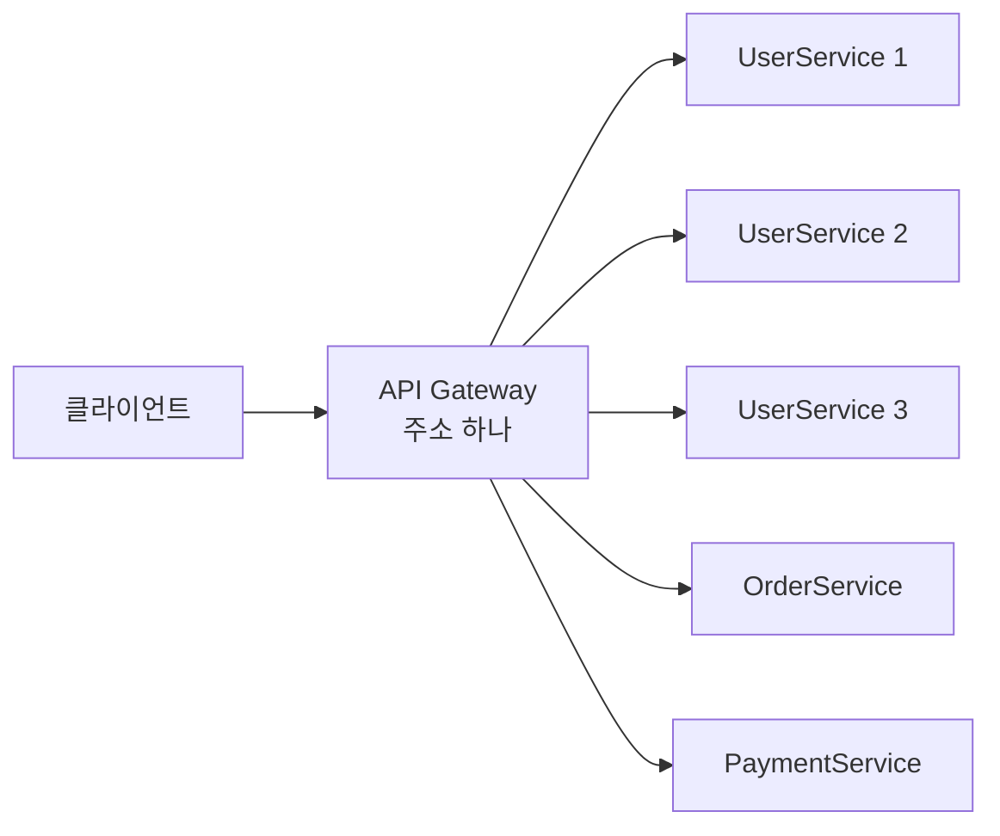
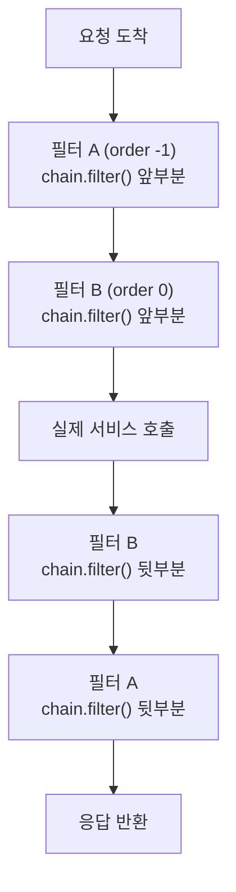

---

title: "Spring Cloud Gateway 공식문서 전수 정리"
date: 2024-02-11
categories: [Spring, Gateway]
tags: [SpringCloudGateway, APIGateway, WebFlux, Filter, Routing]
layout: post
toc: true
math: true
mermaid: true

---

## 참고자료

- [Spring Cloud Gateway Reference](https://docs.spring.io/spring-cloud-gateway/reference/)
- [Route Predicate Factories](https://docs.spring.io/spring-cloud-gateway/reference/spring-cloud-gateway-server-webflux/request-predicates-factories.html)
- [GatewayFilter Factories](https://docs.spring.io/spring-cloud-gateway/reference/spring-cloud-gateway-server-webflux/gatewayfilter-factories.html)
- [Global Filters](https://docs.spring.io/spring-cloud-gateway/reference/spring-cloud-gateway-server-webflux/global-filters.html)
- [Actuator API](https://docs.spring.io/spring-cloud-gateway/reference/spring-cloud-gateway-server-webflux/actuator-api.html)
- [CORS Configuration](https://docs.spring.io/spring-cloud-gateway/reference/spring-cloud-gateway-server-webflux/cors-configuration.html)

이 글은 Spring Cloud 2023.0.x 기준으로 정리했다. **4.2 이후로는 설정 키가 `spring.cloud.gateway.server.webflux.*` 아래로 옮겨졌으므로**, 최신 버전을 쓴다면 공식문서에서 키 이름을 확인해야 한다.

---

## 배경

마이크로서비스를 나눠놓고 나니 **클라이언트가 어디로 요청해야 하는지**가 문제가 됐다.

서비스마다 주소가 다르고, 인스턴스가 늘어나면 주소도 늘어난다. 클라이언트가 그걸 다 알고 있어야 한다면 서비스를 나눈 대가만 지불하고 이득은 못 얻는 셈이다.

정리하면서 확인하고 싶었던 것들이다.

- 게이트웨이가 없으면 정확히 무엇이 곤란한가?
- Route, Predicate, Filter는 각각 무엇을 맡는가?
- 필터의 실행 순서는 어떻게 정해지는가?
- 게이트웨이 자체가 단일 장애점이 되지는 않는가?

공식문서를 처음부터 끝까지 따라가면서 정리했다.

---

## 1. API Gateway가 왜 필요한가

첫 질문이다.

마이크로서비스는 서비스마다 인스턴스를 여러 대 띄워서 확장한다. 여기서 문제가 생긴다.

**클라이언트가 인스턴스 주소를 알아야 한다.** UserService가 세 대로 늘어나면 그 세 대의 주소를 알아야 하고, 어느 것을 부를지도 정해야 한다.

자동 확장 환경에서는 이게 성립하지 않는다. **10분마다 인스턴스가 하나씩 늘어나는 상황이면 10분마다 클라이언트를 고쳐서 배포해야 한다.**

게이트웨이가 앞에 서면 클라이언트는 게이트웨이 주소 하나만 알면 된다.



**뒤에서 몇 대가 뜨고 지는지 클라이언트는 모른다.**

라우팅만 하는 것도 아니다. 요청이 각 서비스에 닿기 전에 공통으로 처리할 것들을 여기서 한다.

| 역할 | 왜 게이트웨이에서 하는가 |
|---|---|
| 인증 | 서비스마다 인증을 구현하면 중복이고 빠뜨리기 쉽다 |
| 라우팅 | 클라이언트가 주소를 알 필요가 없어진다 |
| 요청 속도 제한 | 서비스에 닿기 전에 막는 것이 싸다 |
| 모니터링 | 모든 요청이 지나가므로 전체를 볼 수 있다 |
| 보안 헤더 | 응답마다 붙일 헤더를 한 곳에서 관리한다 |

### 1.1 그런데 단일 장애점이 되지 않는가

네 번째 질문을 여기서 먼저 답해둔다. **된다.**

모든 요청이 게이트웨이를 지나가므로 게이트웨이가 죽으면 전부 멈춘다. 그래서 다뤄야 할 것들이 있다.

**게이트웨이 자체를 여러 대 띄운다.** 앞에 로드밸런서를 둔다. 게이트웨이는 상태를 안 갖도록 만들어야 이게 가능하다.

**게이트웨이에 로직을 넣지 않는다.** 여기에 비즈니스 로직이 들어가기 시작하면 배포가 잦아지고, 배포가 잦으면 장애 확률이 올라간다. 게이트웨이는 통과시키는 일만 해야 한다.

**타임아웃과 서킷 브레이커를 건다.** 뒤쪽 서비스 하나가 느려졌을 때 게이트웨이의 처리 자원이 거기 묶이면, 멀쩡한 서비스로 가는 요청까지 못 받는다. 뒤에서 다루는 `CircuitBreaker` 필터가 이 문제를 위한 것이다.

---

## 2. Spring Cloud Gateway 주요 요소

- Route
- Predicate
- Filter

용어를 알아보기 전, API Gateway의 주소는 `http://localhost:8000`이라고 가정한다.

---

## 3. Route

인스턴스 고유 식별자(ID), 목적지 인스턴스의 실제 주소를 통해 Gateway가 요청을 목적지로 라우팅해준다.

즉, 이 설정을 통해 클라이언트가 인스턴스 고유 식별자에 요청을 보내면 목적지 인스턴스에 라우팅을 해주는 것이다.

일반적인 Spring Cloud Gateway에서 Route설정을 하기 위해선

- 인스턴스 id
- 인스턴스 실제 uri,
- 인스턴스에 도달하기 위한 조건인 predicate
- 요청을 라우팅 하기 전 filter

를 등록한다.

```yaml
spring:
  cloud:
    gateway:
      routes: # 라우팅 설정 등록
        - id: ...
          uri: ...
          predicates:
            - ...
          filters:
            - ...
```

---

## 4. Predicate

Spring Cloud Gateway에서는 Java8에 도입된 Predicate를 사용한다.

Predicate는 Argument를 받아 boolean 값을 반환하는 함수형 인터페이스이다.

요청한 URI의 문자열 패턴을 살펴 본 후 어떤 인스턴스로 라우팅할지 판단하기 위한 요소로 볼 수 있다.

```yaml
spring:
  cloud:
    gateway:
      routes:
        - id: ...
          uri: ...
          predicates: # 클라이언트가 http://localhost:8000/api/auth/~~~ 로 요청했다면 이 라우팅 설정이 적용된다.
            - Path=/api/auth/**
          filters:
            - ...
```

---

### 4.1 기본 제공 Predicate Factory 11가지

#### 1,2,3 : Time After/Before/Between 판별

```yaml
spring:
  cloud:
    gateway:
      routes:
      - id: after_route
        uri: https://example.org
        predicates:
        - After=2024-02-10T17:42:47.789-07:00[America/Denver]
```

위 Predicate는 해당 시간 이전의 요청을 라우팅 uri로 보낸다는 의미이다.

```yaml
spring:
  cloud:
    gateway:
      routes:
      - id: after_route
        uri: https://example.org
        predicates:
        - Before=2024-02-10T17:42:47.789-07:00[America/Denver]
```

위 Predicate는 해당 시간 이후의 요청을 라우팅 uri로 보낸다는 의미이다.

```yaml
spring:
  cloud:
    gateway:
      routes:
      - id: between_route
        uri: https://example.org
        predicates:
        - Between=2017-01-20T17:42:47.789-07:00[America/Denver], 2017-01-21T17:42:47.789-07:00[America/Denver]
```

위 Predicate는 해당 시간 사이대의 요청을 라우팅 uri로 보낸다는 의미이다.

#### 4,5 : Cookie, Header 판별

```yaml
spring:
  cloud:
    gateway:
      routes:
      - id: cookie_route
        uri: https://example.org
        predicates:
        - Cookie=chocolate, ch.p
```

위 Predicate는 요청 쿠키를 확인하여 **쿠키 이름**이 `chocolate`인 내용이 있다면 그 값이 **정규식**에 해당하는 `ch.p`에 해당하는지 확인한다.

즉, 쿠키 이름과 해당 쿠키의 값이 정규식에 해당하는지 확인하는 내용이다.

```yaml
spring:
  cloud:
    gateway:
      routes:
      - id: header_route
        uri: https://example.org
        predicates:
        - Header=X-Request-Id, \d+
```

위 Predicate는 요청 Header를 확인하여 **Header 이름**이 `X-Request-Id`인 내용이 있다면 그 값이 **정규식**에 해당하는 `\d+`에 해당하는지 확인한다.

#### 6. Method 판별

```yaml
spring:
  cloud:
    gateway:
      routes:
      - id: method_route
        uri: https://example.org
        predicates:
        - Method=GET,POST
```

위 Predicate는 요청 Method를 확인하여 Predicate조건에 부합하는지 확인하는 것이다.

#### 7,8 : HOST, Path, Query 판별

```yaml
spring:
  cloud:
    gateway:
      routes:
      - id: host_route
        uri: https://example.org
        predicates:
        - Host=**.somehost.org, **.anotherhost.org
```

위 Predicate는 요청 HOST를 확인하여 Predicate조건에 부합하는지 확인하는 것이다.

이를 활용하면 **서브 도메인**에 대한 요청을 Predicate로 다룰 수도 있다.

그리고 `ServerWebExchange.getAttributes()`구문으로 요청한 서브도메인이 어떤 것인지에 대한 내용도 확인할 수 있다.

그 서브도메인 값은 `ServerWebExchangeUtils.URI_TEMPLATE_VARIABLES_ATTRIBUTE`이라는 변수에 담겨있다.

```yaml
spring:
  cloud:
    gateway:
      routes:
      - id: path_route
        uri: https://example.org
        predicates:
        - Path=/red/{segment}, /blue/{segment}
```

위 Predicate는 요청 Path를 확인하여 Predicate조건에 부합하는지 확인하는 것이다.

그리고 `ServerWebExchange.getAttributes()`구문으로 요청한 Path가 어떤 것인지에 대한 내용도 확인할 수 있다.

그 경로의 값은 `ServerWebExchangeUtils.URI_TEMPLATE_VARIABLES_ATTRIBUTE`이라는 변수에 담겨있다.

#### 9. Query

```yaml
spring:
  cloud:
    gateway:
      routes:
      - id: query_route
        uri: https://example.org
        predicates:
        - Query=red, gree.
```

위 Predicate는 요청 QueryParameter를 확인하여 Predicate조건에 부합하는지 확인하는 것이다. 조건에는 정규식을 포함할 수 있다.

`red`라는 Query Parameter를 가진 내용이 있거나

`gree`로 시작하는 Query Parameter를 가진 내용이 있으면 Predicate는 참이된다.

#### 10. 원격 요청 주소 판별

```yaml
spring:
  cloud:
    gateway:
      routes:
      - id: remoteaddr_route
        uri: https://example.org
        predicates:
        - RemoteAddr=192.168.1.1/24
```

위 Predicate는 요청 클라이언트의 주소를 확인하여 Predicate조건에 부합하는지 확인하는 것이다. 요청 주소를 그룹화하기 위해 CIDR를 적용할 수 있다.

그런데 만약 Gateway앞단에 프록시 서버가 있게 된다면 이 `RemoteAddr`은 실제 클라이언트 IP 주소와는 일치하지 않을 수 있다.

이 때 원격 주소가 어떻게 해석되는지를 수정하기 위해 CustomRemoteAddressResolver를 설정할 수 있다.

Spring Cloud Gateway는 `XForwardedRemoteAddressResolver`를 가지고 있으며, 이는 `X-Forwarded-For`Header를 바라본다.

`XForwardedRemoteAddressResolver`는 두 개의 Static 생성자를 가지고 있다.

- XForwardedRemoteAddressResolver::trustAll
  - X-Forwarded-For Header에서 발견된 첫 번째 IP 주소를 사용하는 RemoteAddressResolver를 반환한다.
    - 악의적인 클라이언트가 X-Forwarded-For의 초기 값을 설정하여 스푸핑(야매)을 시도할 수 있다.

- XForwardedRemoteAddressResolver::maxTrustedIndex
  - Spring Cloud Gateway 앞에 실행되는 신뢰할 수 있는 프록시에 대한 인덱스를 사용한다.
  - 예를 들어, Spring Cloud Gateway가 HAProxy를 통해서만 접근 가능하다면, 값으로 1을 사용해야 한다.
    - 두 번의 프록시가 필요하다면, 값으로 2를 사용해야 한다.

만약 X-Forwarded-For: 0.0.0.1, 0.0.0.2, 0.0.0.3 일 때

- maxTrustedIndex: [Integer.MIN_VALUE, 0] -> 초기화 중 IllegalArgumentException 발생 (유효하지 않음)
- maxTrustedIndex: 1 -> 결과: 0.0.0.3
- maxTrustedIndex: 2 -> 결과: 0.0.0.2
- maxTrustedIndex: 3 -> 결과: 0.0.0.1
- maxTrustedIndex: [4, Integer.MAX_VALUE] -> 결과: 0.0.0.1

#### 11. 가중치 그룹 판별

```yaml
spring:
  cloud:
    gateway:
      routes:
      - id: weight_high
        uri: https://weighthigh.org
        predicates:
        - Weight=group1, 8
      - id: weight_low
        uri: https://weightlow.org
        predicates:
        - Weight=group1, 2
```

위 Predicate는 Weight라는 가중치 그룹을 만들어서 **트래픽의 %로 분산**시킬 수 있는 구문이다.

위 예시에서는 80%의 트래픽이 `weight_high`라는 id에 할당되고, 20%를 `weight_low`라는 id에 할당한다.

---

## 5. Filter

위에서 살펴본 Predicate에 해당하는 요청에 대해 필터를 둘 수 있다.

일반적으로는 들어온 요청에 대한 URI주소를 다시 작성하여 실제 마이크로서비스의 URI로 보낼 수 있다.

```yaml
spring:
  cloud:
    gateway:
      routes:
        - id: ...
          uri: ...
          predicates:
            - ...
          filters:
            - RewritePath=/api/auth/?(?<segment>.*), /$\{segment}
```

라우팅 될 인스턴스가 AuthService이고 주소가 `http://localhost:10001`라고 한다면

위 설정은 클라이언트가 `http://localhost:8000/api/auth`로 요청했다면

실제 요청은 `http://localhost:10001`로 라우팅 해주는 것이고, 요청한 URI 내용 모두 그대로 이어 붙인다는 의미이다.

- `http://localhost:8000/api/auth?testArgument=1` (클라이언트가 요청한 URL)
  - `http://localhost:10001?testArgument=1` (게이트웨이를 통해 라우팅된 URL)

- `http://localhost:8000/api/auth/testPathVariable` (클라이언트가 요청한 URL)
  - `http://localhost:10001/testPathVariable` (게이트웨이를 통해 라우팅된 URL)

---

### 5.1 기본 제공 Filter Factory 30가지

#### 1. Header 추가

```yaml
spring:
  cloud:
    gateway:
      routes:
      - id: add_request_header_route
        uri: https://example.org
        predicates:
        - Path=/red/{segment}
        filters:
        - AddRequestHeader=X-Request-Red, Blue-{segment}
```

Predicate에 해당하는 요청이라면, `X-Request-Red`라는 Header에 `Blue-{segment}`라는 값을 추가하여 라우팅을 적용할 수 있다.

#### 2. QueryParameter 추가

```yaml
spring:
  cloud:
    gateway:
      routes:
      - id: add_request_parameter_route
        uri: https://example.org
        predicates:
        - Host: {segment}.myhost.org
        filters:
        - AddRequestParameter=foo, bar-{segment}
```

Predicate에 해당하는 요청이라면, `foo`라는 QueryParameter에 `bar-{segment}`라는 값을 추가하여 라우팅을 적용할 수 있다.

#### 3. 응답 Header 추가

```yaml
spring:
  cloud:
    gateway:
      routes:
      - id: add_response_header_route
        uri: https://example.org
        filters:
        - AddResponseHeader=X-Response-Red, Blue
```

응답 Header에 `X-Response-Red`라는 이름을 갖고 `Blue`라는 값을 추가할 수 있다.

#### 4. 중복 응답 Header 제거

```yaml
spring:
  cloud:
    gateway:
      routes:
      - id: dedupe_response_header_route
        uri: https://example.org
        filters:
        - DedupeResponseHeader=Access-Control-Allow-Credentials Access-Control-Allow-Origin
```

응답 Header에 `Access-Control-Allow-Credentials`, `Access-Control-Allow-Origin`의 이름을 가진 중복 응답을 제거한다.

보통 API Gateway 뒷단의 마이크로서비스들이 CORS설정을 추가하는 등의 동일한 Header 조작을 수행할 때 사용된다.

#### 5. 서킷브레이커 적용

API Gateway는 서킷브레이커와 궁합이 좋다. 여기서 서킷 브레이커를 적용하여 Fault Tolerance를 마련할 수 있다.

```yaml
spring:
  cloud:
    gateway:
      routes:
      - id: ingredients
        uri: lb://ingredients
        predicates:
        - Path=//ingredients/**
        filters:
        - name: CircuitBreaker
          args:
            name: fetchIngredients
            fallbackUri: forward:/fallback
      - id: ingredients-fallback
        uri: http://localhost:9994
        predicates:
        - Path=/fallback
```

요청 URL 서비스에 서킷 브레이커를 적용하여 서킷 브레이커에 의해 접근이 차단되었을 때 라우팅 될 fallback주소를 명시할 수 있다.

#### 6. Fallback Header 적용

```yaml
spring:
  cloud:
    gateway:
      routes:
      - id: ingredients
        uri: lb://ingredients
        predicates:
        - Path=//ingredients/**
        filters:
        - name: CircuitBreaker
          args:
            name: fetchIngredients
            fallbackUri: forward:/fallback
      - id: ingredients-fallback
        uri: http://localhost:9994
        predicates:
        - Path=/fallback
        filters:
        - name: FallbackHeaders
          args:
            executionExceptionTypeHeaderName: Test-Header
```

FallbackUri로 전달되는 요청의 Header에 추가하는 기능이다.

서킷브레이커에 전달할 수 있는 Header의 속성은 아래와 같다.

- executionExceptionTypeHeaderName ("Execution-Exception-Type")
- executionExceptionMessageHeaderName ("Execution-Exception-Message")
- rootCauseExceptionTypeHeaderName ("Root-Cause-Exception-Type")
- rootCauseExceptionMessageHeaderName ("Root-Cause-Exception-Message")

#### 7. Request Header 매핑

```yaml
spring:
  cloud:
    gateway:
      routes:
      - id: map_request_header_route
        uri: https://example.org
        filters:
        - MapRequestHeader=Blue, X-Request-Red
```

요청 Header에 `X-Request-Red`라는 값이 있다면 `Blue`라는 Header 이름으로 값을 매핑시켜 라우팅을 적용한다.

#### 8. Request URI Prefix 적용

```yaml
spring:
  cloud:
    gateway:
      routes:
      - id: prefixpath_route
        uri: https://example.org
        filters:
        - PrefixPath=/mypath
```

모든 요청의 경로에 `/mypath`라는 접두사가 붙는다. 즉, `https://example.org/hello`라고 요청한다면 `https://example.org/mypath/hello`로 라우팅이 적용된다.

#### 9. PreserveHostHeader (요청 Header를 클라가 보낸것으로? 서버가 지정한 것으로?)

```yaml
spring:
  cloud:
    gateway:
      routes:
      - id: preserve_host_route
        uri: https://example.org
        filters:
        - PreserveHostHeader
```

요청이 프록시 또는 로드 밸런서를 통해 전달될 때 원래의 호스트 Header를 유지하는 역할이다. 특정 백엔드 서비스가 호스트 Header에 따라 다르게 동작하는 경우 사용할 수 있다.

위 설정은 클라이언트 측에서 보낸 Header를 그대로 사용하겠다는 의미이다.

#### 10. 요청 제한 (RateLimiter)

```yaml
spring:
  cloud:
    gateway:
      routes:
      - id: request_rate_limiter_route
        uri: http://example.org
        filters:
        - name: RequestRateLimiter
          args:
            redis-rate-limiter.replenishRate: 10
            redis-rate-limiter.burstCapacity: 20
        predicates:
        - Path=/api/**
```

RequestRateLimiter는 특정 요청의 비율을 제한하는 데 사용된다.

이 필터는 Redis 또는 Bucket4j와 같은 RateLimiting 구현을 사용하여 사용자가 설정한 요청 빈도를 초과하지 않도록한다.

위 설정에서 `replenishRate`는 토큰이 재충전되는 속도를, `burstCapacity`는 토큰 버킷의 최대 용량을 의미한다.

따라서 위 설정은 `초당 최대 10개`의 요청을 허용하며, 버스트 요청을 처리할 수 있도록 `20개까지의 용량`을 가진다.

#### 11. 리다이렉션

```yaml
spring:
  cloud:
    gateway:
      routes:
      - id: prefixpath_route
        uri: https://example.org
        filters:
        - RedirectTo=302, https://acme.org
```

`https://example.org`로 요청이 오면 `https://acme.org`로 리다이렉트한다.

#### 12. 요청 Header 제거

```yaml
spring:
  cloud:
    gateway:
      routes:
      - id: removerequestheader_route
        uri: https://example.org
        filters:
        - RemoveRequestHeader=X-Request-Foo
```

`X-Request-Foo`에 해당하는 Header를 지운 후 라우팅을 적용한다.

#### 13. Response Header 제거

```yaml
spring:
  cloud:
    gateway:
      routes:
      - id: removeresponseheader_route
        uri: https://example.org
        filters:
        - RemoveResponseHeader=X-Response-Foo
```

`X-Response-Foo`에 해당하는 Header를 지운다.

#### 14. 요청 QueryParameter 제거

```yaml
spring:
  cloud:
    gateway:
      routes:
      - id: removerequestparameter_route
        uri: https://example.org
        filters:
        - RemoveRequestParameter=red
```

`red`에 해당하는 QueryParameter를 지운 후 라우팅을 적용한다.

#### 15. 요청 경로 재작성

```yaml
spring:
  cloud:
    gateway:
      routes:
      - id: rewritepath_route
        uri: https://example.org
        predicates:
        - Path=/red/**
        filters:
        - RewritePath=/red(?<segment>/?.*), $\{segment}
```

`https://localhost:8000/red/**`로 들어온 요청을 `https://example.org/**`로 라우팅을 적용한다.

++ YAML 문법에의해 따라 `$`를 표기하려면 `$\`로 대체해야 한다.

#### 16. Response 발원지 경로 재작성

응답이 어떤 서버로부터 왔는지에 대한 정보를 재작성할 수 있다.

```yaml
spring:
  cloud:
    gateway:
      routes:
      - id: rewritelocationresponseheader_route
        uri: http://example.org
        filters:
        - RewriteLocationResponseHeader=AS_IN_REQUEST, Location, ,
```

예를 들면 [POST]`api.example.com/some/object/name`요청에 대해 Location Response Header 값인

- object-service.prod.example.net/v2/some/object/id가
- api.example.com/some/object/id로 재작성된다.

이 때 `stripVersionMode`라는 파라미터 지정할 수 있다. (NEVER_STRIP, AS_IN_REQUEST (기본값), ALWAYS_STRIP)

- `NEVER_STRIP`: 원래 요청 경로에 **버전이 없더라도 버전은 제거되지 않는다.**
- `AS_IN_REQUEST`: 원래 요청 경로에 **버전이 없는 경우에만 버전이 제거**된다.
- `ALWAYS_STRIP`: 원래 요청 경로에 **버전이 포함되어 있더라도 버전은 항상 제거**된다.

#### 17. Response Header 재작성

`Header name`, `regexp`, `replacement`를 매개변수로 받아 Response Header를 재작성한다.

```yaml
spring:
  cloud:
    gateway:
      routes:
      - id: rewriteresponseheader_route
        uri: https://example.org
        filters:
        - RewriteResponseHeader=X-Response-Red, , password=[^&]+, password=***
```

위 예시는 `X-Response-Red`라는 Response Header 값을 ` password=[^&]+`로 정규식 검사한뒤 `password=***`로 대체한다.

#### 18. 세션 저장 (마이크로서비스 간 세션 공유)

WebSession::save 작업을 강제로 수행하도록 한 후 라우팅을 적용한다.

```yaml
spring:
  cloud:
    gateway:
      routes:
      - id: save_session
        uri: https://example.org
        predicates:
        - Path=/foo/**
        filters:
        - SaveSession
```

Spring Security와 Spring Session을 통합하고 다른 마이크로서비스간 인증/인가가 수행되었음을 보장하려는 경우에 이 기능은 필수이다.

#### 19. 보안 Header 추가

```yaml
spring:
    cloud:
      gateway:
        filter:
          secure-headers:
            disable=x-frame-options,strict-transport-security

```

요청/응답 간 [다음 보안 Header들](https://blog.appcanary.com/2017/http-security-headers.html)이 추가 된다.

- X-Xss-Protection:1 (mode=block)
- Strict-Transport-Security (max-age=631138519)
- X-Frame-Options (DENY)
- X-Content-Type-Options (nosniff)
- Referrer-Policy (no-referrer)
- Content-Security-Policy (default-src 'self' https:; font-src 'self' https: data:; img-src 'self' https: data:; object-src 'none'; script-src https:; style-src 'self' https: 'unsafe-inline')
- X-Download-Options (noopen)
- X-Permitted-Cross-Domain-Policies (none)

#### 20. Request Path 셋팅

```yaml
spring:
  cloud:
    gateway:
      routes:
      - id: setpath_route
        uri: https://example.org
        predicates:
        - Path=/red/{segment}
        filters:
        - SetPath=/{segment}
```

- SetPath
  - 이 필터는 경로 템플릿 매개변수를 받아 요청 경로를 조작한다. 템플릿화된 경로 세그먼트를 허용하여 요청 경로를 변경할 수 있다.
- RewritePath
  - 이 필터는 경로의 일부를 다른 값으로 대체할 수 있게 해주는 정규 표현식(regex) 매개변수를 받아 좀 더 복잡한 경로 변형을 할 수 있다.

#### 21. Request Header 셋팅

```yaml
spring:
  cloud:
    gateway:
      routes:
      - id: setrequestheader_route
        uri: https://example.org
        filters:
        - SetRequestHeader=X-Request-Red, Blue
```

요청 헤더에 `X-Request-Red`로 들어온 값을 Blue로 대체한다.

#### 22. Response Header 셋팅

```yaml
spring:
  cloud:
    gateway:
      routes:
      - id: setresponseheader_route
        uri: https://example.org
        filters:
        - SetResponseHeader=X-Response-Red, Blue
```

응답 헤더의 `X-Response-Red`값을 Blue로 대체한다.

#### 23. Response Status 셋팅

```yaml
spring:
  cloud:
    gateway:
      routes:
      - id: setstatusstring_route
        uri: https://example.org
        filters:
        - SetStatus=BAD_REQUEST
      - id: setstatusint_route
        uri: https://example.org
        filters:
        - SetStatus=401
```

응답 상태 코드를 조작할 수 있다. 정수 값 `401`, `404` 등을 넣거나 `NOT_FOUND`와 같은 문자열로 표기할 수 있다.

```yaml
spring:
  cloud:
    gateway:
      set-status:
        original-status-header-name: original-http-status
```

위와 같이 원래의 응답 코드를 헤더에 따로 담을 수도 있다.

#### 24. Request Path StripPrefix 적용

이 필터는 parts라는 하나의 매개변수를 받는다. 요청 경로에 제거할 부분의 수를 나타낸다.

```yaml
spring:
  cloud:
    gateway:
      routes:
      - id: nameRoot
        uri: https://nameservice
        predicates:
        - Path=/name/**
        filters:
        - StripPrefix=2
```

/name/foo/bar라는 요청 경로가 있다면, `StripPrefix=2`옵션은 `/name/foo 부분을 제거`하고, `/bar`로 요청 경로를 변경한다.

#### 25. Retry

```yaml
spring:
  cloud:
    gateway:
      routes:
      - id: retry_test
        uri: http://localhost:8080/flakey
        predicates:
        - Host=*.retry.com
        filters:
        - name: Retry
          args:
            retries: 3
            statuses: BAD_GATEWAY
            methods: GET,POST
            backoff:
              firstBackoff: 10ms
              maxBackoff: 50ms
              factor: 2
              basedOnPreviousValue: false
```

최대 재시도 횟수, 응답 Status Code + Method, backoff를 매개변수로 이 조건들에 부합한다면 재시도를 할 수 있도록 한다.

#### 26. Request Size Set

```yaml
spring:
  cloud:
    gateway:
      routes:
      - id: request_size_route
        uri: http://localhost:8080/upload
        predicates:
        - Path=/upload
        filters:
        - name: RequestSize
          args:
            maxSize: 5000000
```

요청 데이터의 크기를 제한할 수 있다.

#### 27. Request Host Set

```yaml
spring:
  cloud:
    gateway:
      routes:
      - id: set_request_host_header_route
        uri: http://localhost:8080/headers
        predicates:
        - Path=/headers
        filters:
        - name: SetRequestHost
          args:
            host: example.org
```

요청을 허용할 호스트를 지정할 수 있다.

#### 28. Modify Request Body

```java
@Bean
public RouteLocator routes(RouteLocatorBuilder builder) {
    return builder.routes()
        .route("rewrite_request_obj", r -> r.host("*.rewriterequestobj.org")
            .filters(f -> f.prefixPath("/httpbin")
                .modifyRequestBody(String.class, Hello.class, MediaType.APPLICATION_JSON_VALUE,
                    (exchange, s) -> return Mono.just(new Hello(s.toUpperCase())))).uri(uri))
        .build();
}

static class Hello {
    String message;

    public Hello() { }

    public Hello(String message) {
        this.message = message;
    }

    public String getMessage() {
        return message;
    }

    public void setMessage(String message) {
        this.message = message;
    }
}
```

요청 받은 JSON Body를 Class로 역직렬화하여 요청 본문을 조작할 수 있다.

#### 29. Modify Response Body

```java
@Bean
public RouteLocator routes(RouteLocatorBuilder builder) {
    return builder.routes()
        .route("rewrite_response_upper", r -> r.host("*.rewriteresponseupper.org")
            .filters(f -> f.prefixPath("/httpbin")
                .modifyResponseBody(String.class, String.class,
                    (exchange, s) -> Mono.just(s.toUpperCase()))).uri(uri)
        .build();
}
```

응답할 Body를 조작할 수 있다.

#### 30. Default Filters (모든 route 설정에 필터를 적용하기)

```yaml
spring:
  cloud:
    gateway:
      default-filters:
      - AddResponseHeader=X-Response-Default-Red, Default-Blue
      - PrefixPath=/httpbin
```

---

## 6. 필터 실행 순서

```java
@Bean
public GlobalFilter customFilter() {
    return new CustomGlobalFilter();
}

public class CustomGlobalFilter implements GlobalFilter, Ordered {

    @Override
    public Mono<Void> filter(ServerWebExchange exchange, GatewayFilterChain chain) {
        log.info("custom global filter");
        return chain.filter(exchange);
    }

    @Override
    public int getOrder() {
        return -1;
    }
}
```

세 번째 질문의 답이다. **`Ordered`를 구현해서 `getOrder()`가 돌려주는 숫자로 정한다. 숫자가 작을수록 먼저 실행된다.**

여기서 알아둬야 할 것이 있다. **게이트웨이 필터는 요청과 응답 양쪽을 지나간다.**



`chain.filter(exchange)`를 부르기 전 코드가 요청 처리(pre)이고, 그 뒤에 이어 붙인 코드가 응답 처리(post)다.

**응답 쪽은 순서가 뒤집힌다.** 요청은 order가 작은 것부터, 응답은 큰 것부터 지나간다.

```java
@Override
public Mono<Void> filter(ServerWebExchange exchange, GatewayFilterChain chain) {
    log.info("pre: 요청이 서비스로 가기 전");

    return chain.filter(exchange).then(Mono.fromRunnable(() -> {
        log.info("post: 응답이 클라이언트로 가기 전");
    }));
}
```

**post 부분을 `then(...)`으로 붙이는 이유가 여기 있다.** Spring Cloud Gateway는 WebFlux 기반이라 `chain.filter()`가 즉시 결과를 돌려주지 않고 `Mono`를 돌려준다. 그 뒤에 실행할 것을 `then`으로 이어 붙여야 응답 시점에 실행된다.

`chain.filter()` 다음 줄에 그냥 코드를 쓰면 **응답을 기다리지 않고 바로 실행된다.** 서블릿 기반 필터처럼 생각하면 여기서 틀린다.

## 7. 지표 수집

`spring-boot-starter-actuator`의존성을 추가하면

```yaml
spring:
  cloud:
    gateway:
      metrics:
        enabled: true   # 기본값이 true다
```

`/actuator/metrics/gateway.requests`에서 라우팅 지표를 볼 수 있다.

지표의 속성은 아래와 같다.

- `routeId`
  - 라우팅 ID
- `routeUri`
  - 라우팅 된 주소
- `outcome`
  - 실제 HTTP 응답 Status
- `status`
  - 클라이언트에 반환된 HTTP Status
- `httpStatusCode`
  - 클라이언트에 반환된 HTTP Status
- `httpMethod`
  - 요청 메서드

---

## 8. 타임아웃

아래와 같이 모든 라우팅에 타임아웃을 적용할 수 있다.

```yaml
spring:
  cloud:
    gateway:
      httpclient:
        connect-timeout: 1000
        response-timeout: 5s
```

- `connect-timeout`은 **milliseconds**단위이다.
- `response-timeout`은 **java.time.Duration**으로 변환될 수 있는 단위이다.

또한 각 라우팅마다 다르게 설정하고 싶다면 아래와 같이 작성할 수 있다.

```yaml
spring:
  cloud:
    gateway:
      routes:
        - id: per_route_timeouts
          uri: https://example.org
          predicates:
            - name: Path
              args:
                pattern: /delay/{timeout}
          metadata:
            response-timeout: 200   # 밀리초
            connect-timeout: 200    # 밀리초
```

라우팅별 설정은 `metadata` 아래에 두고 **둘 다 밀리초 단위**다. 전역 설정의 `response-timeout`이 `Duration`을 받는 것과 다르다.

---

## 9. CORS

아래와 같이 모든 라우팅에 CORS를 허용하는 구문을 만들 수 있다.

```yaml
spring:
  cloud:
    gateway:
      globalcors:
        cors-configurations:
          '[/**]':
            allowedOrigins: "https://docs.spring.io"
            allowedMethods:
            - GET
```

## 10. Actuator로 라우팅 상태 보기

```yaml
management:
  endpoint:
    gateway:
      enabled: true      # 기본값
  endpoints:
    web:
      exposure:
        include: gateway
```

**`endpoint`와 `endpoints`가 다른 키다.** 개별 엔드포인트를 켜는 것은 `endpoint`, 웹으로 노출할 목록을 정하는 것은 `endpoints`다. 여기를 헷갈리면 설정을 다 넣었는데 경로가 안 열린다.

위 설정으로 액추에이터를 활성화 시킨 후 Endpoint로 접속하여 모니터링을 할 수 있다.

/actuator/gateway를 기본 경로로 가진다.

| ID                              | HTTP Method | 설명                                    |
|---------------------------------|-------------|---------------------------------------|
| /actuator/gateway/globalfilters | GET         | Route에 적용된 Global Filter 목록 표시        |
| /actuator/gateway/routefilters  | GET         | 특정 Route에 적용된 GatewayFilter 팩토리 목록 표시 |
| /actuator/gateway/refresh       | POST        | Route 캐시 제거                           |
| /actuator/gateway/routes        | GET         | 게이트웨이에 정의된 Route 목록을 표시               |
| /actuator/gateway/routes/{id}   | GET         | 특정 Route에 대한 정보를 표시                   |
| /actuator/gateway/routes/{id}   | POST        | 게이트웨이에 새로운 Route를 추가                  |
| /actuator/gateway/routes/{id}   | DELETE      | 게이트웨이에서 기존 Route를 제거                  |

---

## 11. Predicate 직접 만들기

```java
public class MyRoutePredicateFactory extends AbstractRoutePredicateFactory<HeaderRoutePredicateFactory.Config> {

    public MyRoutePredicateFactory() {
        super(Config.class);
    }

    @Override
    public Predicate<ServerWebExchange> apply(Config config) {
        return exchange -> {
            ServerHttpRequest request = exchange.getRequest();

            /*
            이 부분에서 Predicate 조건 분기문 둥 커스텀 내용 만들기
             */

            return matches(config, request);
        };
    }

    public static class Config {}

}
```

---

## 12. PreFilter 직접 만들기

공식문서에 따르면 커스텀 필터를 만들 때 그 네이밍은 `~~~GatewayFilterFactory`로 끝나야한다.

`GatewayFilterFactory` 접미사가 없는 이름의 게이트웨이 필터를 만들고 yml파일에서 참조할 수 있긴하지만 이렇게 참조할 수 있는 방법은 향후 릴리스에서 제거될 수 있다.

```java
public class PreGatewayFilterFactory extends AbstractGatewayFilterFactory<PreGatewayFilterFactory.Config> {

    public PreGatewayFilterFactory() {
        super(Config.class);
    }

    @Override
    public GatewayFilter apply(Config config) {
        return (exchange, chain) -> {
            ServerHttpRequest.Builder builder = exchange.getRequest().mutate();

            /*
            이곳에 요청값 조작 등 처음에 수행될 필터 내용 작성
             */

            return chain.filter(exchange.mutate().request(builder.build()).build());
        };
    }

    public static class Config {}

}
```

---

## 13. PostFilter 직접 만들기

공식문서에 따르면 커스텀 필터를 만들 때 그 네이밍은 `~~~GatewayFilterFactory`로 끝나야한다.

`GatewayFilterFactory` 접미사가 없는 이름의 게이트웨이 필터를 만들고 yml파일에서 참조할 수 있긴하지만 이렇게 참조할 수 있는 방법은 향후 릴리스에서 제거될 수 있다.

```java
public class PostGatewayFilterFactory extends AbstractGatewayFilterFactory<PostGatewayFilterFactory.Config> {

    public PostGatewayFilterFactory() {
        super(Config.class);
    }

    @Override
    public GatewayFilter apply(Config config) {
        return (exchange, chain) -> {
            return chain.filter(exchange).then(Mono.fromRunnable(() -> {
                ServerHttpResponse response = exchange.getResponse();

                /*
                    이곳에 응답값 조작 등 마지막에 수행될 필터 내용 작성
                 */
            }));
        };
    }

    public static class Config {}

}
```

---

## 14. Global Filter 직접 만들기

`Custom Global Filter`를 작성하려면 `GlobalFilter 인터페이스를 구현`해야한다. 이 필터는 모든 요청에 적용된다.

```java
@Bean
public GlobalFilter customGlobalFilter() {
    return (exchange, chain) -> exchange.getPrincipal()
        .map(Principal::getName)
        .defaultIfEmpty("Default User")
        .map(userName -> {
            exchange.getRequest().mutate().header("CUSTOM-REQUEST-HEADER", userName).build();
            return exchange;
        })
        .flatMap(chain::filter);
}

@Bean
public GlobalFilter customGlobalPostFilter() {
    return (exchange, chain) -> chain.filter(exchange)
        .then(Mono.just(exchange))
        .map(serverWebExchange -> {
            serverWebExchange.getResponse().getHeaders().set("CUSTOM-RESPONSE-HEADER",
                HttpStatus.OK.equals(serverWebExchange.getResponse().getStatusCode()) ? "It worked": "It did not work");
          return serverWebExchange;
        })
        .then();
}
```

---

## 15. 전체 설정 예시

### build.gradle(.kts) 의존성 추가

```groovy
extra["springCloudVersion"] = "2023.0.0"

dependencies {
    implementation("org.springframework.cloud:spring-cloud-starter-netflix-eureka-client")
    implementation("org.springframework.cloud:spring-cloud-starter-gateway")
}

dependencyManagement {
    imports {
        mavenBom("org.springframework.cloud:spring-cloud-dependencies:${property("springCloudVersion")}")
    }
}
```

추가적으로, Service Discovery와 궁합이 좋기 때문에 이를 활용하여 라우팅에 도움을 받는 것이 좋다.

### rootApplication

```java
@SpringBootApplication
@EnableDiscoveryClient
public class GatewayServiceApplication {

    public static void main(String[] args) {
        SpringApplication.run(GatewayServiceApplication.class, args);
    }
}
```

위와 같이 루트에 ServiceDiscovery에 등록하기 위한 `@EnableDiscoveryClient` 애노테이션을 달면 셋팅은 끝난다.

---

### application.yml

```yaml
server:
  port: 8000

spring:
  application:
    name: gateway-service

  main:
    web-application-type: reactive

  cloud:
    gateway:
      globalcors:
        cors-configurations:
          '[/**]':
            allowedOrigins: [ "http://localhost:5173", "http://127.0.0.1:5173" ]
            allow-credentials: true
            allowedHeaders: '*'
            allowedMethods:
              - PUT
              - GET
              - POST
              - DELETE
              - OPTIONS
      routes:
        - id: AUTH-SERVICE
          uri: lb://AUTH-SERVICE
          predicates:
            - Path=/api/auth/**
          filters:
            - RewritePath=/api/auth/?(?<segment>.*), /$\{segment}

        - id: USER-SERVICE
          uri: lb://USER-SERVICE
          predicates:
            - Path=/api/users/,
              /api/users/verify-email,
              /api/users/verify-username,
              /api/users/temporary-join,
              /api/users/join,
              /api/users/web-logout,
              /api/users/profile,
              /api/users/{id},
              /api/users/me
          filters:
            - RewritePath=/api/users/(?<segment>/?.*), /$\{segment}

        - id: TIMELINE-SERVICE
          uri: lb://TIMELINE-SERVICE
          predicates:
            - Path=/api/timeline/**
          filters:
            - RewritePath=/api/timeline/?(?<segment>.*), /$\{segment}

        - id: SOCIAL-SERVICE
          uri: lb://SOCIAL-SERVICE
          predicates:
            - Path=/api/paints/**,
              /api/users/{id}/following,
              /api/users/{id}/follower,
              /api/users/{id}/verified_follower,
              /api/users/{id}/following,
              /api/users/{id}/following,
              /api/users/{id}/paint,
              /api/users/{id}/reply,
              /api/users/{id}/media,
              /api/users/{id}/like,
              /api/users/{id}/like/{paintId},
              /api/users/{id}/repaint,
              /api/users/{id}/repaint/{sourcePaintId}

        - id: TRENDS-SERVICE
          uri: lb://TRENDS-SERVICE
          predicates:
            - Path=/api/trends/**
          filters:
            - RewritePath=/api/trends/?(?<segment>.*), /$\{segment}

        - id: SEARCH-SERVICE
          uri: lb://SEARCH-SERVICE
          predicates:
            - Path=/api/search/**
          filters:
            - RewritePath=/api/search/?(?<segment>.*), /$\{segment}

        - id: DM-SERVICE
          uri: lb://DM-SERVICE
          predicates:
            - Path=/api/dm/**
          filters:
            - RewritePath=/api/dm/?(?<segment>.*), /$\{segment}

        - id: NOTIFICATION-SERVICE
          uri: lb://NOTIFICATION-SERVICE
          predicates:
            - Path=/api/notification/**
          filters:
            - RewritePath=/api/notification/?(?<segment>.*), /$\{segment}

      default-filters:
        - name: AuthorizationGatewayFilterFactory
          args:
            baseMessage: Gateway Authorization Filter
            preLogger: true
            postLogger: true

eureka:
  instance:
    hostname: localhost
  client:
    fetch-registry: true
    register-with-eureka: true
    service-url:
      defaultZone: http://host.docker.internal:8761/eureka

```

`uri: lb://AUTH-SERVICE`에서 `lb`가 로드밸런서를 뜻한다. **실제 주소가 아니라 서비스 이름을 쓰면 유레카에서 등록된 인스턴스 목록을 받아 그중 하나로 보낸다.** 인스턴스가 늘고 줄어도 설정을 안 고쳐도 되는 것이 이 부분 덕분이다.

`spring.main.web-application-type: reactive`도 짚어둔다. **Spring Cloud Gateway는 WebFlux 위에서 동작하므로 서블릿 기반으로 뜨면 안 된다.**

의존성에 `spring-boot-starter-web`이 함께 들어가 있으면 스프링 부트가 서블릿 쪽을 골라버리고, 게이트웨이가 라우팅을 아예 못 한다. **이 설정을 넣는 것보다 `spring-boot-starter-web`을 안 넣는 것이 근본적인 해결이다.**

---

## 정리하며

처음 던진 질문들에 대한 답이다.

**게이트웨이가 없으면 무엇이 곤란한가.** 클라이언트가 모든 서비스의 인스턴스 주소를 알아야 한다. 자동 확장 환경에서는 주소가 계속 바뀌므로 그때마다 클라이언트를 고쳐 배포해야 한다. 인증이나 속도 제한 같은 공통 처리도 서비스마다 중복 구현하게 된다.

**Route, Predicate, Filter가 각각 맡는 것.** Route는 "어디로 보낼지"를 담는 묶음이고, Predicate는 "이 요청이 이 Route에 해당하는가"를 판단하는 조건이며, Filter는 요청과 응답을 지나가면서 손보는 부분이다. 셋이 한 세트로 하나의 라우팅 규칙을 이룬다.

**필터 실행 순서.** `Ordered`의 `getOrder()` 값이 작을수록 먼저 실행된다. 요청 방향은 작은 것부터, 응답 방향은 큰 것부터 지나간다. WebFlux 기반이라 응답 시점 처리는 `chain.filter()` 다음 줄이 아니라 `then(...)`으로 이어 붙여야 한다.

**단일 장애점이 되지 않는가.** 된다. 게이트웨이를 상태 없이 만들어 여러 대로 띄우고, 여기에 비즈니스 로직을 넣지 않고, 뒤쪽 서비스에 타임아웃과 서킷 브레이커를 걸어야 한다. 특히 뒤쪽 하나가 느려졌을 때 게이트웨이의 처리 자원이 거기 묶이면 멀쩡한 서비스로 가는 요청까지 막힌다.

문서를 전부 따라가고 나서 남은 감각은 **게이트웨이가 판단을 하는 곳이 아니라 규칙을 적용하는 곳**이라는 것이었다. Predicate와 Filter 팩토리가 이렇게 많은 이유도 "설정으로 표현할 수 있게" 만들려는 것이었고, 코드를 써야 할 것 같으면 대개 그건 뒤쪽 서비스가 할 일이었다.
