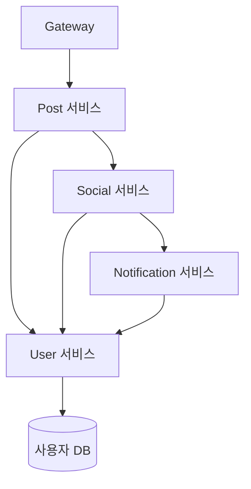
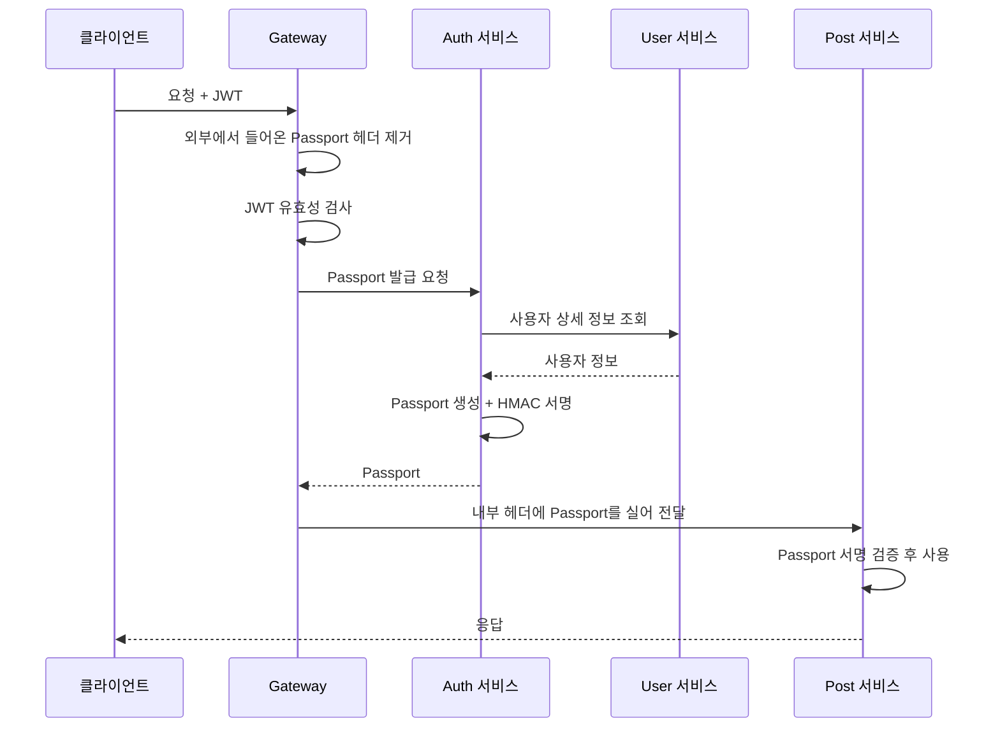

---

title: "MSA에서 사용자 정보를 어떻게 넘길 것인가, Passport 만들기"
date: 2024-02-15
categories: [Architecture, Security]
tags: [Passport, MSA, Authentication, Gateway, JWT, HMAC]
layout: post
toc: true
math: true
mermaid: true

---

## 참고자료

- [microservices.io - Access Token pattern](https://microservices.io/patterns/security/access-token.html)
- [RFC 2104 - HMAC: Keyed-Hashing for Message Authentication](https://www.rfc-editor.org/rfc/rfc2104.html)
- [FIPS 198-1 - The Keyed-Hash Message Authentication Code](https://csrc.nist.gov/pubs/fips/198-1/final)
- [RFC 7519 - JSON Web Token](https://www.rfc-editor.org/rfc/rfc7519.html)
- [javax.crypto.Mac Javadoc](https://docs.oracle.com/en/java/javase/17/docs/api/java.base/javax/crypto/Mac.html)
- [MessageDigest.isEqual Javadoc](https://docs.oracle.com/en/java/javase/17/docs/api/java.base/java/security/MessageDigest.html)

---

## 배경

게이트웨이와 서비스 디스커버리를 붙여서 마이크로서비스 환경을 만들었다. 클라이언트가 로그인하고 JWT를 받아 게이트웨이로 요청을 보내는 흐름이다.

여기서 막혔다. **요청 하나를 처리하는 데 여러 서비스가 관여하는데, 그 서비스들이 전부 "이 요청을 보낸 사람이 누구인지"를 알아야 한다.**

정리하면서 확인하고 싶었던 것들이다.

- 사용자 정보를 서비스마다 조회하면 무엇이 문제인가?
- JWT를 그대로 넘기면 안 되는가?
- 내부에서만 쓰는 토큰인데 왜 서명이 필요한가?
- 이 방식에서 잘못하면 무엇이 뚫리는가?

---

## 1. 사용자 정보를 어떻게 전달할 것인가

첫 질문이다. 방법이 세 가지 떠올랐다.

### 1.1 서비스마다 조회하기

각 서비스가 필요할 때마다 사용자 서비스에 물어본다.



**요청 하나에 사용자 서비스가 여러 번 불린다.** 서비스가 늘어날수록 곱해진다.

사용자 서비스가 전체 시스템의 병목이자 단일 장애점이 된다. **거기가 느려지면 아무것도 못 한다.**

### 1.2 요청마다 정보를 실어 보내기

서비스끼리 부를 때 헤더나 본문에 사용자 정보를 넣는다.

앞의 문제는 없어진다. 조회가 한 번이면 된다.

**대신 매 호출마다 같은 내용이 반복된다.** 사용자 정보가 커지면 요청도 무거워지고, 필드가 추가되면 서비스들의 요청 형식을 전부 고쳐야 한다.

### 1.3 하나의 토큰으로 묶기

두 번째 방법을 정리한 것이다. **사용자 정보를 하나의 토큰으로 만들어서 헤더 하나에 담아 넘긴다.**

이걸 Passport라고 부르기로 했다. 마이크로서비스 패턴에서는 access token 패턴이라는 이름으로 정리돼 있다.

---

## 2. JWT를 그대로 넘기면 안 되는가

두 번째 질문이다. 이미 클라이언트가 JWT를 들고 오는데 그걸 뒤로 넘기면 되지 않나 싶었다.

안 되는 이유가 몇 가지 있다.

**서비스마다 JWT를 검증해야 한다.** 서명 검증 코드와 비밀키가 모든 서비스에 들어간다. 키가 하나라도 새면 전체가 뚫리고, 키를 바꾸려면 전부 배포해야 한다.

**JWT에는 필요한 정보가 다 없다.** 토큰을 작게 유지하려면 식별자만 담는 것이 보통이다. 그러면 결국 1.1로 돌아간다.

**JWT는 밖에 노출되는 물건이다.** 클라이언트가 들고 다니고 네트워크를 지나다닌다. 여기에 내부에서만 필요한 정보를 넣으면 그게 다 노출된다.

**만료를 다루기 어려워진다.** JWT의 유효 기간은 클라이언트를 위한 것인데, 내부 호출이 그 기간에 묶이면 긴 작업 중에 토큰이 만료되는 상황이 생긴다.

**그래서 경계에서 한 번 바꾼다.** 게이트웨이가 JWT를 검증하고, 내부용 토큰을 새로 만들어 넣어준다.

| | JWT | Passport |
|---|---|---|
| 누가 들고 있는가 | 클라이언트 | 서비스 사이에서만 |
| 밖에 노출되는가 | 노출된다 | 절대 안 된다 |
| 담는 것 | 최소한의 식별자 | 서비스들이 필요로 하는 정보 |
| 검증하는 곳 | 게이트웨이 | 각 서비스 |

---

## 3. 발급 흐름



**두 번째 단계가 중요하다.** 클라이언트가 Passport 헤더를 직접 넣어 보낼 수 있으므로, 게이트웨이가 들어오는 요청에서 그 헤더를 무조건 지우고 자기가 만든 것으로 다시 채워야 한다. 4절에서 다시 다룬다.

발급을 Auth 서비스에 맡긴 것은 당시 구조 때문이었다. **게이트웨이가 직접 만들면 호출 하나를 줄일 수 있다.** 다만 그러려면 게이트웨이가 사용자 정보를 알아야 하므로 어느 쪽이 나은지는 상황에 따라 갈린다.

---

## 4. 왜 서명이 필요한가

세 번째 질문이다. **내부에서만 도는 토큰인데 서명이 왜 필요한가.**

내부라는 말이 안전하다는 뜻이 아니기 때문이다.

**서비스에 직접 닿을 수 있는 경로가 있다.** 서비스들이 같은 네트워크에 있으면 게이트웨이를 안 거치고도 부를 수 있다. 클러스터 안에 침입한 공격자나, 잘못 설정된 서비스가 그 경로를 쓴다.

**Passport 헤더를 직접 넣으면 그대로 통과한다.** 서명이 없으면 `{"id": 1, "role": "ADMIN"}` 같은 것을 만들어 넣기만 하면 된다. 검증할 방법이 없다.

**게이트웨이가 헤더를 안 지우면 밖에서도 넣을 수 있다.** 클라이언트가 Passport 헤더를 붙여 보내고 게이트웨이가 그걸 덮어쓰지 않으면 그대로 뒤로 전달된다.

**그래서 "누가 만든 것인가"를 확인할 수 있어야 한다.** 그게 서명이다.

### 4.1 HMAC

HMAC은 비밀키를 섞어서 해시를 만드는 방법이다. RFC 2104에 정의돼 있다.

**일반 해시로는 안 되는 이유부터 본다.** SHA-256만 쓰면 누구나 같은 값을 계산할 수 있다. 내용을 바꾸고 해시도 다시 계산하면 그만이다.

**비밀키를 아는 쪽만 만들 수 있어야 한다.** HMAC이 그 일을 한다.

```text
HMAC(K, m) = H( (K ⊕ opad) || H( (K ⊕ ipad) || m ) )
```

키를 두 번 섞어 해시를 두 번 돌린다. **키와 메시지를 그냥 이어 붙여 해시하는 방식에 있는 취약점을 피하려고** 이런 모양이 됐다.

이어 붙이기만 하면 길이 확장 공격이 가능하다. 원본 메시지를 몰라도 그 뒤에 내용을 덧붙인 새 메시지의 해시를 만들 수 있는 공격이다. HMAC의 이중 구조가 이걸 막는다.

**대칭키라는 점이 중요하다.** 만드는 쪽과 검증하는 쪽이 같은 키를 갖는다. 그래서 이 키를 아는 서비스는 Passport를 만들 수도 있다.

서비스가 많아지면 이게 부담이 된다. **그때는 비대칭키로 옮기는 것을 고려해야 한다.** 발급하는 곳만 개인키를 갖고, 검증하는 서비스들은 공개키만 갖게 하면 검증만 가능하고 발급은 못 한다.

---

## 5. 구현

### 5.1 Passport

```java
public record Passport(
        UserInfo userInfo,
        String integrityKey
) {
}
```

```java
public record UserInfo(
        Long id,
        String email,
        String nickname,
        String username,
        String role,
        Boolean isActivated,
        String accessedAt,
        String createdAt,
        String deletedAt
) {
}
```

`UserInfo`에는 서비스들이 공통으로 필요로 하는 필드를 모았다.

**여기 무엇을 넣을지가 설계의 핵심이다.** 너무 적으면 결국 사용자 서비스를 부르게 되고, 너무 많으면 요청이 무거워진다. 그리고 **한 번 넣으면 빼기 어렵다.** 어느 서비스가 그 필드를 쓰는지 알 수 없기 때문이다.

### 5.2 HMAC 인코더

```java
@RequiredArgsConstructor
public class HMACEncoder {

    private final String hmacAlgorithm;
    private final String passportSecretKey;

    protected String createHMACIntegrityKey(String userInfoString) {
        SecretKeySpec secretKeySpec = new SecretKeySpec(
                passportSecretKey.getBytes(StandardCharsets.UTF_8),
                hmacAlgorithm
        );
        try {
            Mac mac = Mac.getInstance(hmacAlgorithm);
            mac.init(secretKeySpec);
            return Base64.getEncoder()
                    .encodeToString(mac.doFinal(userInfoString.getBytes(StandardCharsets.UTF_8)));
        } catch (NoSuchAlgorithmException | InvalidKeyException e) {
            throw new IllegalStateException("HMAC 초기화 실패", e);
        }
    }
}
```

**`getBytes()`에 문자셋을 명시했다.** 인자 없이 부르면 JVM 기본 문자셋을 쓰는데, **서비스마다 기본값이 다르면 같은 문자열에서 다른 바이트가 나온다.** 그러면 발급한 쪽과 검증하는 쪽의 결과가 달라져서, 재현하기 어려운 검증 실패가 생긴다.

**`Mac` 객체는 스레드 안전하지 않다.** 필드로 두고 재사용하면 안 되고, 위처럼 매번 만들어야 한다.

### 5.3 발급

```java
@Component
@RequiredArgsConstructor
public class PassportGenerator {

    private final ObjectMapper objectMapper;
    private final HMACEncoder hmacEncoder;

    public String generatePassport(UserInfo userInfo) {
        try {
            String userInfoString = objectMapper.writeValueAsString(userInfo);
            String integrityKey = hmacEncoder.createHMACIntegrityKey(userInfoString);

            Passport passport = new Passport(userInfo, integrityKey);
            String passportString = objectMapper.writeValueAsString(passport);
            return Base64.getUrlEncoder()
                    .encodeToString(passportString.getBytes(StandardCharsets.UTF_8));
        } catch (JsonProcessingException e) {
            throw new BaseException(ExceptionType.COMMON_500_000002);
        }
    }
}
```

순서는 이렇다.

1. `UserInfo`를 JSON 문자열로 만든다
2. 그 문자열로 HMAC 서명을 만든다
3. `UserInfo`와 서명을 묶어 `Passport`로 만든다
4. `Passport`를 JSON으로 만들고 Base64로 인코딩한다

**Base64를 URL 안전 방식으로 바꿨다.** 기본 인코더가 만드는 `+`와 `/`는 HTTP 헤더나 URL에서 문제를 일으킬 수 있다.

**여기서 놓친 것이 있다.** JSON 직렬화 결과가 항상 같다는 보장이 없다. 잭슨 버전이나 설정이 바뀌면 필드 순서나 공백이 달라질 수 있고, **그러면 같은 `UserInfo`인데 서명이 달라진다.**

발급하는 쪽과 검증하는 쪽이 다른 서비스라면 이게 실제 문제가 된다. **정렬 규칙을 고정하거나, 서명 대상 문자열 자체를 Passport 안에 담아 보내는 편이 안전하다.**

### 5.4 검증

원래 썼던 코드에 문제가 많았다.

```java
public void validatePassport(String requestedPassport) {
    String encodedUserInfo;
    String integrityKey;

    try {
        String passportStr = new String(Base64.getDecoder().decode(requestedPassport));
        String userInfoString = objectMapper.readTree(passportStr).get(USER_INFO).toString();

        userInfoStringintegrityKey = hmacEncoder.createHMACIntegrityKey(userInfoString);
        requestedIntegrityKey = objectMapper.readTree(passportStr).get(INTEGRITY_KEY).asText();

        isEqualByRequestedPassport(requestedIntegrityKey, userInfoStringintegrityKey);
    } catch (Exception e) {
        throw new BaseException(ExceptionType.COMMON_500_000002);
    }
}
```

**선언하지 않은 변수를 쓰고 있어서 컴파일되지 않는다.** `encodedUserInfo`와 `integrityKey`는 선언만 하고 안 쓰며, `userInfoStringintegrityKey`와 `requestedIntegrityKey`는 선언 없이 쓴다.

그리고 **`catch (Exception e)`가 모든 것을 삼킨다.** 서명이 틀린 것인지, JSON이 깨진 것인지, 프로그래밍 실수인지 구분이 안 된다.

고치면 이렇다.

```java
@Component
@RequiredArgsConstructor
public class PassportValidator {

    private static final String USER_INFO = "userInfo";
    private static final String INTEGRITY_KEY = "integrityKey";

    private final ObjectMapper objectMapper;
    private final HMACEncoder hmacEncoder;

    public void validate(String decodedPassportJson) {
        JsonNode root;
        try {
            root = objectMapper.readTree(decodedPassportJson);
        } catch (JsonProcessingException e) {
            throw new BaseException(ExceptionType.INVALID_PASSPORT);
        }

        String userInfoString = root.get(USER_INFO).toString();
        String expected = hmacEncoder.createHMACIntegrityKey(userInfoString);
        String actual = root.get(INTEGRITY_KEY).asText();

        boolean matched = MessageDigest.isEqual(
                expected.getBytes(StandardCharsets.UTF_8),
                actual.getBytes(StandardCharsets.UTF_8)
        );

        if (!matched) {
            throw new BaseException(ExceptionType.INVALID_PASSPORT);
        }
    }
}
```

**비교를 `equals()`에서 `MessageDigest.isEqual()`로 바꿨다.**

이유가 있다. **`String.equals()`는 다른 문자가 나오는 즉시 멈춘다.** 첫 글자가 틀리면 빨리 끝나고, 앞부분이 맞으면 조금 더 오래 걸린다.

공격자가 응답 시간을 재면서 한 글자씩 맞춰가면 **서명 전체를 알아낼 수 있다.** 이걸 타이밍 공격이라고 한다.

`MessageDigest.isEqual()`은 **어느 위치에서 달라지든 끝까지 다 비교한다.** 그래서 시간에서 정보가 새지 않는다.

### 5.5 추출

원래 코드에 더 심각한 문제가 있었다.

```java
public Passport getPassportFromRequestHeader(HttpServletRequest request) {
    return objectMapper.readValue(
            new String(Base64.getDecoder().decode(request.getHeader("Authorization")), UTF_8),
            Passport.class
    );
}
```

**검증을 하지 않는다.** 헤더를 읽어서 디코딩하고 객체로 바꿀 뿐이다.

그런데 뒤에서 볼 애스펙트가 **이 메서드만 부른다.** `validatePassport`는 정의만 되어 있고 실제 흐름에서 안 불린다.

**서명을 만들어놓고 검증을 안 하는 상태**였다. 4절에서 본 공격이 그대로 통한다.

`Authorization` 헤더를 쓴 것도 문제다. **거기에는 클라이언트의 JWT가 들어 있다.** 게이트웨이가 덮어쓴다고 해도, 내부용 값과 외부용 값이 같은 이름을 쓰면 실수하기 쉽다.

`getUserInfoByPassport`에도 버그가 있었다.

```java
String passportString = new String(Base64.getDecoder().decode(passport.toString()));
```

**`passport.toString()`은 레코드의 문자열 표현이지 Base64가 아니다.** 디코딩하면 예외가 난다.

고치면 이렇다.

```java
@Component
@RequiredArgsConstructor
public class PassportExtractor {

    private static final String PASSPORT_HEADER = "X-Internal-Passport";

    private final ObjectMapper objectMapper;
    private final PassportValidator passportValidator;

    public Passport extract(HttpServletRequest request) {
        String encoded = request.getHeader(PASSPORT_HEADER);
        if (encoded == null) {
            throw new BaseException(ExceptionType.PASSPORT_NOT_FOUND);
        }

        String json;
        try {
            json = new String(Base64.getUrlDecoder().decode(encoded), StandardCharsets.UTF_8);
        } catch (IllegalArgumentException e) {
            throw new BaseException(ExceptionType.INVALID_PASSPORT);
        }

        passportValidator.validate(json);   // 반드시 검증한다

        try {
            return objectMapper.readValue(json, Passport.class);
        } catch (JsonProcessingException e) {
            throw new BaseException(ExceptionType.INVALID_PASSPORT);
        }
    }
}
```

**헤더 이름을 내부 전용으로 바꾸고, 검증을 추출 경로 안에 넣었다.** 검증을 별도 메서드로 두면 부르는 것을 잊을 수 있다. 지나갈 수 있는 경로 자체를 하나로 만드는 편이 안전하다.

---

## 6. 사용하는 쪽 편하게 만들기

서비스마다 `PassportExtractor`를 주입받아 부르는 것이 번거로웠다. 애스펙트로 뺐다.

### 6.1 애노테이션

```java
@Target(ElementType.METHOD)
@Retention(RetentionPolicy.RUNTIME)
public @interface InjectEaselAuthentication {
}
```

### 6.2 애스펙트

```java
@Aspect
@Component
@RequiredArgsConstructor
public class PassportAspect {

    private final HttpServletRequest httpServletRequest;
    private final PassportExtractor passportExtractor;

    @Around("@annotation(org.palette.aop.InjectEaselAuthentication)")
    public Object bindPassport(ProceedingJoinPoint pjp) throws Throwable {
        Passport passport = passportExtractor.extract(httpServletRequest);
        EaselAuthenticationContext.set(passport);
        try {
            return pjp.proceed(pjp.getArgs());
        } finally {
            EaselAuthenticationContext.clear();   // 반드시 지운다
        }
    }
}
```

### 6.3 컨텍스트

```java
public final class EaselAuthenticationContext {

    private static final ThreadLocal<Passport> CONTEXT = new ThreadLocal<>();

    private EaselAuthenticationContext() {
    }

    static void set(Passport passport) {
        CONTEXT.set(passport);
    }

    public static UserInfo getUserInfo() {
        Passport passport = CONTEXT.get();
        if (passport == null) {
            throw new BaseException(ExceptionType.PASSPORT_NOT_FOUND);
        }
        return passport.userInfo();
    }

    static void clear() {
        CONTEXT.remove();
    }
}
```

**`finally`에서 `remove()`를 부르는 것이 필수다.**

원래 코드에는 이게 없었다. 톰캣은 스레드를 재사용하므로 **다음 요청이 같은 스레드를 받으면 이전 사용자의 Passport가 그대로 남아 있다.**

`@InjectEaselAuthentication`이 붙은 API라면 덮어쓰니까 안 드러난다. **애노테이션이 없는 API에서 `getUserInfo()`를 부르면 남의 정보가 나온다.** 인증이 안 걸린 경로가 인증된 것처럼 동작하는 셈이다.

이 부분은 [`ThreadLocal`에 관한 글](/posts/Aop-ThreadLocal/)에 자세히 정리했다.

**`null` 검사를 넣은 것도 같은 이유다.** 원래 코드는 `CONTEXT.get().userInfo()`라서 애노테이션 없이 부르면 NPE가 났다. 무엇이 잘못됐는지 알 수 없는 예외보다 명시적인 예외가 낫다.

### 6.4 사용

```java
@InjectEaselAuthentication
@PostMapping
public ResponseEntity<PaintCreateResponse> create(
        @RequestBody PaintCreateRequest request
) {
    return ResponseEntity
            .status(HttpStatus.CREATED)
            .body(paintUsecase.createPaint(
                    EaselAuthenticationContext.getUserInfo().id(),
                    request
            ));
}
```

---

## 7. 남은 문제들

네 번째 질문이다. 지금 구조에서 아직 뚫릴 수 있는 곳들이다.

### 7.1 게이트웨이가 헤더를 안 지우면

**클라이언트가 `X-Internal-Passport` 헤더를 직접 붙여 보낼 수 있다.**

게이트웨이가 자기 것으로 덮어쓰면 괜찮지만, 인증이 필요 없는 경로를 지날 때는 덮어쓰지 않을 수 있다. 그러면 클라이언트가 넣은 값이 그대로 뒤로 간다.

서명 검증이 있으니 아무 값이나 만들지는 못한다. **다만 예전에 유효했던 Passport를 어디선가 얻었다면 그대로 쓸 수 있다.**

**들어오는 요청에서 이 헤더를 무조건 지우는 필터를 게이트웨이 맨 앞에 둬야 한다.**

```yaml
spring:
  cloud:
    gateway:
      default-filters:
        - RemoveRequestHeader=X-Internal-Passport
```

### 7.2 만료가 없다

Passport에 유효 기간이 없다. **한 번 발급된 것은 영원히 유효하다.**

로그에 남거나 어딘가에 캡처된 Passport를 나중에 그대로 쓸 수 있다.

발급 시각과 만료 시각을 넣고, 그것도 서명 대상에 포함해야 한다.

```java
public record Passport(
        UserInfo userInfo,
        Instant issuedAt,
        Instant expiresAt,
        String integrityKey
) {
}
```

**내부 호출은 보통 몇 초 안에 끝나므로 유효 기간을 짧게 잡아도 된다.** 30초에서 1분이면 충분하다.

### 7.3 어느 서비스에서 쓸 것인지 지정되지 않았다

Post 서비스로 가라고 만든 Passport를 Notification 서비스에도 쓸 수 있다.

한 서비스가 뚫렸을 때 **거기서 받은 Passport로 다른 서비스를 부를 수 있다는 뜻**이다.

JWT에는 이런 용도로 `aud`라는 항목이 있다. 같은 개념을 넣고 서비스별로 자기 이름이 맞는지 확인하게 하면 된다.

### 7.4 키를 모든 서비스가 갖고 있다

4.1에서 언급한 대칭키 문제다. **검증할 수 있다는 것은 만들 수도 있다는 뜻**이다.

서비스 하나가 뚫리면 그 키로 아무 사용자나 사칭할 수 있다.

**비대칭키로 옮기면 이 문제가 사라진다.** Auth 서비스만 개인키를 갖고 나머지는 공개키만 갖는다. 그러면 그 서비스들은 검증만 가능하다.

이건 결국 JWT가 하는 일과 같아진다. **직접 만들다 보면 표준이 왜 그 모양인지 알게 되는 부분**이었다.

### 7.5 정리

| 문제 | 대응 |
|---|---|
| 검증을 안 함 | 추출 경로 안에 검증을 포함 |
| 타이밍 공격 | `MessageDigest.isEqual()` |
| ThreadLocal 미정리 | `finally`에서 `remove()` |
| 외부 헤더 주입 | 게이트웨이에서 무조건 제거 |
| 만료 없음 | 짧은 유효 기간 추가 |
| 대상 서비스 미지정 | 대상 서비스 이름 추가 |
| 대칭키 공유 | 비대칭키로 전환 |

---

## 정리하며

처음 던진 질문들에 대한 답이다.

**서비스마다 조회하면 무엇이 문제인가.** 요청 하나에 사용자 서비스가 여러 번 불린다. 서비스가 늘어날수록 곱해지고, 사용자 서비스가 전체의 병목이자 단일 장애점이 된다.

**JWT를 그대로 넘기면 안 되는가.** 모든 서비스에 검증 코드와 비밀키가 퍼지고, JWT에 담긴 정보만으로는 부족해서 결국 조회를 하게 되며, 밖에 노출되는 물건이라 내부 정보를 담을 수 없다. 경계에서 한 번 바꿔주는 편이 맞다.

**내부 토큰인데 왜 서명이 필요한가.** 내부라는 말이 안전하다는 뜻이 아니기 때문이다. 게이트웨이를 안 거치고 서비스에 직접 닿을 수 있으면 Passport 헤더를 마음대로 만들어 넣을 수 있다. 서명은 "누가 만든 것인가"를 확인하는 수단이다.

**잘못하면 무엇이 뚫리는가.** 만들어놓고 검증을 안 하는 것이 가장 크다. 서명 비교를 `equals()`로 하면 응답 시간으로 서명을 알아낼 수 있고, `ThreadLocal`을 안 지우면 다음 요청이 남의 정보를 본다. 게이트웨이가 외부에서 들어온 헤더를 안 지우면 클라이언트가 직접 주입할 수 있다.

직접 만들어보고 나서 남은 감각은 **표준의 각 항목이 그 자리에 있는 이유**였다. 만료 시각, 대상, 발급자 같은 것들이 JWT에 왜 들어 있는지 몰랐는데, 직접 만들면서 하나씩 빠뜨리고 나니까 알게 됐다. 결국 필요한 것을 다 채우고 나면 이미 있는 표준과 비슷해진다.
