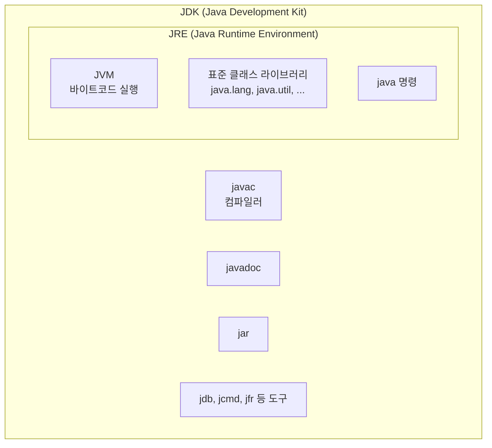
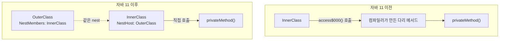
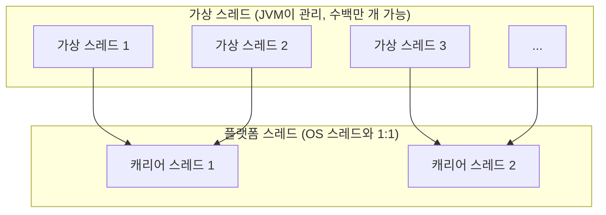

---

title: "JEP로 따라가는 Java LTS 버전별 변경점 (8, 11, 17, 21)"
date: 2024-03-16
categories: [Java]
tags: [Java8, Java11, Java17, Java21, JEP, LTS]
layout: post
toc: true
math: true
mermaid: true

---

## 참고자료

- [OpenJDK JEP 색인](https://openjdk.org/jeps/0)
- [JDK 8 릴리스 노트](https://www.oracle.com/java/technologies/javase/8-whats-new.html)
- [JDK 11 기능 목록](https://openjdk.org/projects/jdk/11/)
- [JDK 17 기능 목록](https://openjdk.org/projects/jdk/17/)
- [JDK 21 기능 목록](https://openjdk.org/projects/jdk/21/)
- [Oracle Java SE 지원 로드맵](https://www.oracle.com/java/technologies/java-se-support-roadmap.html)

---

## 배경

자바 8만 쓰다가 11로 올리게 됐는데, 무엇이 달라지는지 몰라서 불안했다. "람다가 들어왔다", "모듈이 생겼다" 정도만 알고 있었다.

블로그 요약글을 여럿 봤는데 서로 내용이 달랐다. 그래서 **JEP를 직접 읽어가면서 정리하기로 했다.**

JEP는 JDK Enhancement Proposal의 약자로, 자바에 무언가를 넣거나 뺄 때 그 근거와 설계를 적어두는 문서다. **"무엇이 바뀌었는지"가 아니라 "왜 바꿨는지"가 적혀 있어서** 이쪽을 읽는 편이 이해가 빨랐다.

정리하면서 확인하고 싶었던 것들이다.

- LTS라는 것이 정확히 무엇을 보장하는가?
- 버전을 올릴 때 실제로 깨질 수 있는 것은 무엇인가?
- 각 버전에서 실무에 바로 영향을 주는 변경은 어느 것인가?

---

## 1. 용어 정리

### 1.1 JRE와 JDK



**JRE는 실행에 필요한 것들의 묶음**이다. JVM, 표준 라이브러리, `java` 명령이 들어 있다.

**JDK는 JRE에 개발 도구를 더한 것**이다. 컴파일러인 `javac`, 문서 생성기 `javadoc`, 패키징 도구 `jar` 등이 함께 들어 있다.

**자바 11부터 JRE를 따로 배포하지 않는다.** 대신 `jlink`로 필요한 모듈만 골라 작은 런타임을 직접 만든다. 컨테이너 이미지를 줄이려고 이걸 쓰는 경우가 많다.

### 1.2 SE와 EE

**Java SE(Standard Edition)** 가 표준 자바다. 흔히 "자바 8", "자바 17"이라고 할 때 이걸 가리킨다.

**Java EE(Enterprise Edition)** 는 서버 개발용 명세를 SE 위에 얹은 것이다. 서블릿, JPA, JMS 같은 것들이 여기 들어 있다.

**지금은 Jakarta EE라는 이름으로 바뀌었다.** 오라클이 이클립스 재단에 넘기면서 상표 문제로 이름이 바뀌었고, 그 과정에서 **패키지 이름도 `javax.*`에서 `jakarta.*`로 바뀌었다.**

스프링 부트 3으로 올릴 때 임포트를 전부 고쳐야 했던 것이 이 때문이다. `javax.servlet.http.HttpServletRequest`가 `jakarta.servlet.http.HttpServletRequest`가 됐다.

### 1.3 LTS

첫 질문이다. LTS는 Long Term Support의 약자다.

자바는 **6개월마다 새 버전을 내고, 몇 년에 한 번씩 그중 하나를 LTS로 지정한다.**

| 구분 | 지원 기간 |
|---|---|
| 일반 버전 | 다음 버전이 나올 때까지 6개월 |
| LTS 버전 | 수년간 보안 패치 제공 |

LTS는 8, 11, 17, 21이다. 그다음이 25다.

**LTS가 보장하는 것은 보안 패치이지 기능 추가가 아니다.** 새 기능은 최신 버전에만 들어간다. 그래서 LTS를 쓴다는 것은 "안정성을 얻고 새 기능을 포기한다"는 선택이다.

**운영 환경에서 비LTS를 쓰기 어려운 이유가 여기 있다.** 6개월마다 올려야 하고, 안 올리면 보안 취약점이 나와도 패치를 못 받는다.

---

## 2. JDK 8

### [1. JEP 126 - 람다식/인터페이스 기본, 정적 메서드 추가](https://openjdk.org/jeps/126)

#### 명세 측

```java
public interface Vehicles {

    static String producer() {
        return "N&F Vehicles";
    }

    default String getOverview() {
        return "ATV made by " + producer();
    }

}
```

#### 사용 측

```java
public class Client {
    Vehicle vehicle = new VehicleImpl();
    String overview = vehicle.getOverview();
}
```

---

### 2. Static Method, Method 참조 방식 개선

```java
public class StaticMethodReference {

    static void main(String[] args) {
        // 기존 람다 표현식으로 정적 메서드 호출
        boolean oldFeature = list.stream().anyMatch(u -> User.isRealUser(u));

        // 새롭게 추가된 표현식
        boolean newFeature = list.stream().anyMatch(User::isRealUser);
    }
}
```

위와 같이 기존 Stream/Lambda 내에서 객체의 static메서드를 호출하는 부분을 람다를 표현식을 제거하여 사용할 수 있게 됐다.

```java
public class StaticMethodReference {

    static void main(String[] args) {
        User user = new User();

        // 인스턴스 메서드 호출
        boolean isLegalName = list.stream().anyMatch(user::isLegalName);

        // 생성자 호출
        Stream<User> stream = list.stream().map(User::new);
    }
}
```

또한 위와 같이 객체 자체의 메서드를 호출하는 구문도 `->`와 같은 람다 표현식을 제거하고 사용할 수 있게 됐다.

공식적인 문법 형태는 `ContainingClass::methodName`이다.

---

### 3. Optional<T>

Null을 다룰 수 있는 래퍼 객체인 Optional이 추가되었다.

```java
static void main(String[] args) {
    Optional<String> optional = Optional.empty();

    String str = "value";
    Optional<String> optional = Optional.of(str);

    Optional<String> optional = Optional.ofNullable(getStrin
```

#### Java 8 이전 Optional 기능을 대체할 구문

```java
static void main(String[] args) {
    // #1
    List<String> list = getList();
    List<String> listOpt = list != null ? list : new ArrayList<>();
    // #1

    // #2
    User user = getUser();
    if (user != null) {
        Address address = user.getAddress();
        if (address != null) {
            String street = address.getStreet();
            if (street != null) {
                return street;
            }
        }
    }
    return "not specified";
    // #2

    // #3
    String value = null;
    String result = "";
    try {
        result = value.toUpperCase();
    } catch (NullPointerException exception) {
        throw new CustomException();
    }
    
```

```java
static void main(String[] args) {
    // #1
    List<String> listOpt = getList().orElseGet(() -> new ArrayList<>());
    // #1

    // #2
    Optional<User> user = Optional.ofNullable(getUser());
    String result = user
        .map(User::getAddress)
        .map(Address::getStreet)
        .orElse("not specified");
    // #2

    // #3
    String value = null;
    Optional<String> valueOpt = Optional.ofNullable(value);
    String result = valueOpt.orElseThrow(CustomException::new).toUpperCase();
    /
```

---

### 4. Stream

#### 기본 사용법

```java
static void main(String[] args) {
    String[] arr = new String[]{"a", "b", "c"};
    Stream<String> stream = Arrays.stream(arr);
    stream = Stream.of("a", "b", 
```

#### 멀티 쓰레드 환경에서의 스트림 사용법

일반적인 `stream()`구문이 아닌 `parallelStream()`구문으로 멀티 쓰레드 환경에서 안전하게 스트림을 사용할 수 있다.

```java
static void main(String[] args) {
    list.parallelStream().forEach(element -> doWork(eleme
```

#### 스트림 주요 연산

스트림은 기본적으로 `선언`, `중간 연산`, `종단 연산` 이 세 가지로 나뉜다.

스트림이 제공하는 `중간 연산`을 잘 활용하면 반복문을 생성하지 않고도 컬렉션을 순회하는 등 코드의 가독성을 확보할 수 있다.

##### 스트림 중간 연산 - Iterating

```java
static void main(String[] args) {
    // 스트림 사용 전
    for (String string : list) {
        if (string.contains("a")) {
            return true;
        }
    }

    // 스트림 사용 후
    boolean isExist = list.stream().anyMatch(element -> element.contains("
```

##### 스트림 중간 연산 - Filtering

```java
static void main(String[] args) {
    List<String> list = new ArrayList<>();
    list.add("One");
    list.add("OneAndOnly");
    list.add("Derek");
    list.add("Change");
    list.add("factory");
    list.add("justBefore");
    list.add("Italy");
    list.add("Italy");
    list.add("Thursday");
    list.add("");
    list.add("");

    Stream<String> stream = list.stream().filter(element -> element.contains("
```

위와 같은 `filter`연산으로 조건절에 부합하는 내용만 뽑아오는 기능을 적용할 수 있다.

##### 스트림 종단 연산 - Mapping

```java
static void main(String[] args) {
    List<Detail> details = new ArrayList<>();
    details.add(new Detail());
    Stream<String> stream = details.stream()
        .flatMap(detail -> detail.getParts().strea
```

`flatMap`메서드를 사용하면 PARTS 필드의 모든 요소가 추출되어 새로운 결과 스트림에 추가된다.

`flatMap`메서드와 `map`메서드를 사용할 수 있는데 두 차이점은 아래와 같다.

```java
static void main(String[] args) {
    // map()
    List<List<String>> mapList = Arrays.asList(
        Arrays.asList("Java", "is"),
        Arrays.asList("super", "fun")
    );

    List<Stream<String>> mapListStreamMap = mapList.stream()
        .map(List::stream)
        .collect(Collectors.toList());
    System.out.println(mapListStreamMap);
    // 결과 : [java.util.stream.ReferencePipeline$Head@378bf509, java.util.stream.ReferencePipeline$Head@5fd0d5ae]

    // flatMap()
    List<List<String>> listOfLists = Arrays.asList(
        Arrays.asList("Java", "is"),
        Arrays.asList("super", "fun")
    );

    List<String> flatList = listOfLists.stream()
        .flatMap(List::stream)
        .collect(Collectors.toList());
    System.out.println(flatList);
    // 결과 : [Java, is, super,
```

`flatMap`은 중복된 스트림을 1차원으로 평면화 시키는 메서드이다.

`flatMap 내부의 Arrays::stream`은 **배열을 스트림으로 변환해주는 메서드 참조 표현**이다. `flatMap`을 사용하면 각각의 String 리스트를 스트림으로 만드는 것이 아니라, 한 단계 더 깊은 깊이의 모든 요소를 하나의 스트림으로 합친다.

##### 스트림 종단 연산 - Matching

```java
static void main(String[] args) {
    boolean isValid = list.stream().anyMatch(element -> element.contains("h")); // true
    boolean isValidOne = list.stream().allMatch(element -> element.contains("h")); // false
    boolean isValidTwo = list.stream().noneMatch(element -> element.contains("h")); // false

    Stream.empty().allMatch(Objects::nonNull); // true
    Stream.empty().anyMatch(Objects::nonNull); // 
```

---

## 3. JDK 11

[참고 자료 - OpenJDK 11 Official](https://openjdk.org/projects/jdk/11/)

### [1. JEP 181 - Nest 기반 접근 제어](https://openjdk.org/jeps/181)

내부 클래스가 바깥 클래스의 private 멤버에 접근하는 코드다.

```java
public class OuterClass {

    private static void privateMethod() {
        System.out.println("Private method in OuterClass");
    }

    public class InnerClass {
        public void show() {
            privateMethod();
        }
    }
}
```

**이 코드는 자바 11 이전에도 컴파일된다.** 여기서 자주 오해하는 부분이다.

문제는 **JVM 수준에서는 이 접근이 원래 허용되지 않는다**는 것이었다. 소스에서는 하나의 클래스처럼 보이지만, 컴파일하면 `OuterClass.class`와 `OuterClass$InnerClass.class`라는 **별개의 클래스 파일 두 개**가 나온다. 서로 다른 클래스니까 private 멤버에 접근할 수 없다.

컴파일러가 이걸 우회하고 있었다. **눈에 안 보이는 다리 메서드를 자동으로 만들어 넣는 방식**이다.

```java
// 컴파일러가 몰래 추가하던 것
static void access$000() {
    privateMethod();
}
```

`InnerClass`는 private 메서드가 아니라 이 다리 메서드를 부른다. 다리 메서드는 package-private이라 접근이 된다.

**이 방식에 문제가 있었다.**

원래 없던 메서드가 클래스 파일에 생기니 **리플렉션으로 보면 정체불명의 메서드가 보인다.** 그리고 이 메서드는 private이 아니므로, **같은 패키지의 다른 코드가 이걸 불러서 private 멤버에 우회 접근할 수 있다.**

JEP 181은 **클래스 파일에 nest라는 개념을 추가해서 이 우회를 없앴다.**

바깥 클래스에는 자기 nest에 누가 속하는지를 적은 `NestMembers` 속성이 붙고, 내부 클래스에는 자기 nest의 주인이 누구인지 적은 `NestHost` 속성이 붙는다. **JVM이 이 정보를 보고 같은 nest 안이면 private 접근을 허용한다.**



**소스 코드는 안 바뀌고 클래스 파일과 JVM 동작이 바뀐 것**이다. 그래서 "코드 변경 없이 적용된다"는 말이 맞다.

리플렉션에도 영향이 있다. **`setAccessible(true)` 없이도 같은 nest 안의 private 멤버에 접근할 수 있게 됐다.** `Class.getNestHost()`, `Class.getNestMembers()`로 확인할 수 있다.

여기서 함께 짚어둘 것이 있다. **`Inner Class`와 `Nested Class`는 다르다.** `static`이 없으면 내부(inner) 클래스이고 바깥 인스턴스 참조를 갖는다. `static`을 붙이면 중첩(nested) 클래스이고 그 참조가 없다. [코틀린 글](/posts/Kotlin-class-object/)에 이 차이를 정리해뒀다.

---

### [2. JEP 309 - Dynamic Class-File Constants](https://openjdk.org/jeps/309)

새로운 상수 풀 형식 `CONSTANT_Dynamic`을 지원한다.

새로운 형태의 클래스 파일 상수들의 생성 비용과 중단을 줄이면서 언어/컴파일러 구현자들에게 **더 넓은 표현성과 성능에 대한 옵션을 제공하기 위해 도입되었다.**

JVM내부의 동작 방식을 변경했으므로 예시 코드로 나타내긴 어렵지만 흐름을 나타내면 아래와 같다.

```text
// CONSTANT_Dynamic을 사용하여 정의된 동적 상수
dynamicConstant = bootstrapMethod();

// 이 상수는 첫 사용 시 bootstrapMethod를 통하여 그 값이 결정된다.
// bootstrapMethod는 사용자에 의해 정의될 수 있으며, 다양한 타입의 값을 동적으로 생성할 수 있다.
```

---

### [3. JEP 315 - Improve Aarch64 Intrinsics](https://openjdk.org/jeps/315)

- sin (sine trigonometric function)
- cos (cosine trigonometric function)
- log (logarithm of a number)

내부적으로 자바 라이브러리의 성능을 향상시키는 것을 목적으로 `Math.sin()`, `Math.cos()`, `Math.log()`와 같은 함수가 `AArch64 프로세서`에서 더 나은 성능을 낼 수 있게 됐다.

---

### [4. JEP 318 - Epsilon: A No-Op Garbage Collector (Experimental)](https://openjdk.org/jeps/318)

Epsilon이라는 새로운 가비지 수집기가 Java 11에서 실험판으로 열렸다. 메모리 할당은 처리하지만 실제 메모리 회수 메커니즘을 구현하지 않는 GC이다. 사용 가능한 Java 힙이 소진되면 JVM은 종료된다.

메모리를 할당하지만 실제로 가비지를 수집하지 않기 때문에 No-Op(작업 없음)라고 한다.

따라서 Epsilon은 메모리 부족 오류를 시뮬레이션하는 데 적용할 수 있다.

일반적인 프로덕션 Java 애플리케이션에 적합하지 않지만 유용할 수 있는 몇 가지 특정 사용 사례가 있다.

`성능 시험`, `메모리 부하 테스트`, `VM 인터페이스 테스트 및 수명이 매우 짧은 작업`

이 GC를 사용하려면

```shell
-XX:+UnlockExperimentalVMOptions -XX:+UseEpsilonGC
```

플래그를 사용하면 된다.

---

### [5. JEP 320 - Java EE, CORBA Modules 제거](https://openjdk.org/jeps/320)

`Java SE 6`에 `Java EE` 플랫폼을 위해 개발된 네 가지 기술 `JAX-WS`, `JAXB`, `JAF`, `Common Annotations`로 구성됐다.

이번 버전에서 이들을 제거하였다.

JAF, JAXB, JAX-WS와 같은 기술들은 더 이상 Java SE에 제공되지 않고 이를 필요로 하면 `Java EE` 버전을 사용해야 한다.

#### 제거 된 모듈

- java.se.ee
- java.activation (JAF)
- java.corba
- java.transaction
- java.xml.bind (JAXB)
- java.xml.ws (JAX-WS)
- java.xml.ws.annotation

---

### [6. JEP 321 - HTTP Client 표준화](https://openjdk.org/jeps/321)

JEP 321은 JDK 9에서 인큐베이팅(innovating) API로 도입됐고 JDK 10에서 업데이트된 HTTP Client API를 표준화한다.

또한 java.net.http 패키지에 기반한 표준화된 API를 제공하고, 인큐베이팅 API를 제거한다.

새 HTTP API는 전반적인 성능을 개선하고 HTTP/1.1 및 HTTP/2를 모두 지원한다.

사용 코드는 아래와 같다.

#### 동기 방식

```java
static void main(String[] args) {
    HttpClient httpClient = HttpClient.newBuilder()
        .version(HttpClient.Version.HTTP_2)
        .connectTimeout(Duration.ofSeconds(20))
        .build();

    HttpRequest httpRequest = HttpRequest.newBuilder()
        .GET()
        .uri(URI.create("http://localhost:" + port))
        .build();

    HttpResponse httpResponse = httpClient.send(httpRequest, HttpResponse.BodyHandlers.ofString());

    assertThat(httpResponse.body()).isEqualTo("Hello from the serve
```

#### 비동기 방식

```java
static void main(String[] args) {
    HttpClient httpClient = HttpClient.newBuilder()
        .version(HttpClient.Version.HTTP_2)
        .connectTimeout(Duration.ofSeconds(20))
        .build();

    HttpRequest httpRequest = HttpRequest.newBuilder()
        .GET()
        .uri(URI.create("http://localhost:" + port))
        .build();

    HttpResponse httpResponse = httpClient.sendAsync(request, HttpResponse.BodyHandlers.ofString())
        .thenApply(HttpResponse::body)
        .thenAccept(System.out::println)
        .join(); // 비동기 작업 완료
```

---

### 7. JEP 323 - Lambda 매개변수 지역 변수 문법 개선

람다 표현식의 형식 매개변수(formal parameters)를 선언할 때 var를 사용할 수 있게 하는 기능을 추가한다.

#### 기존 코드

```java
static void main(String[] args) {
    (BinaryOperator<Integer> bo) = (Integer x, Integer y) -> x
```

#### 적용 후 코드

```java
static void main(String[] args) {
    (BinaryOperator<Integer> bo) = (var x, var y) -> x
```

---

### [8. JEP 324 - Key Agreement with Curve25519 and Curve448](https://openjdk.org/jeps/324)

`RFC 7748`에 따라 `Curve25519`와 `Curve448`을 사용하여 `Key Agreement`를 구현한다. 기존 Diffie-Hellman (ECDH) 방식보다 효율적이고 안전한 키 합의 스킴을 제공한다.

---

### [9. JEP 327 - Unicode 10](https://openjdk.org/jeps/327)

유니코드 표준 버전 10.0을 지원한다.

```java
public class UnicodeExample {
    static void main(String[] args) {
        String newEmoji = "\uD83E\uDD84"; // 🦄유니콘 이모지

        System.out.println("유니코드 10의 새로운 이모지: " + newEmoji);

        int codePoint = newEmoji.codePointAt(newEmoji.offsetByCodePoints(0, 0));
        System.out.println("이모지의 코드 포인트: " + Integer.toHexString(codePoint));
    }
}

// 출력 결과
// 유니코드 10의 새로운 이모지: 🦄
// 이모지의 코드 포인트: 1f984
```

---

### [10. JEP 328 - Flight Recorder (JFR) 추가](https://openjdk.org/jeps/328)

HotSpot JVM 및 자바 애플리케이션의 낮은 오버헤드를 가진 데이터 수집 프레임워크가 추가됐다. 애플리케이션 및 JVM의 상세한 실행 정보를 실시간으로 수집하고 분석할 수 있는 도구이다.

주요 기능으로는 아래와 같다.

- 이벤트 생성 및 소비를 위한 API 제공
  - 개발자가 데이터를 이벤트 형태로 제공하고 소비할 수 있는 API를 제공한다.

- 버퍼 메커니즘 및 이진 데이터 형식 제공
  - 데이터 수집을 위한 효율적인 저장 및 전송 수단을 제공한다.

- 이벤트 구성 및 필터링 가능
  - 사용자의 요구에 따라 이벤트를 필터링하고 구성할 수 있다.

- OS, HotSpot JVM, JDK 라이브러리를 위한 이벤트 제공
  - 시스템 및 JVM 수준에서 발생하는 다양한 이벤트에 대한 정보를 제공한다.

위 모니터링 프레임워크를 사용하려면 Java 명령어에 아래와 같은 옵션을 주면 된다.

```shell
java -XX:+UnlockCommercialFeatures -XX:+FlightRecorder -XX:StartFlightRecording=duration=60s,filename=myrecording.jfr MyApp
```

다음은 JMC(Java Mission Control)을 통해 아래 코드에 대해 대시보드를 띄운 화면이다.

```java
package com.core.digerlaboratory.java11flightrecorder;

import java.util.ArrayList;
import java.util.List;

public class Main {

    static void main(String[] args) {
        List<Object> items = new ArrayList<>(1);
        try {
            while (true) {
                items.add(new Object());
            }
        } catch (OutOfMemoryError e) {
            System.out.println(e.getMessage());
        }
        assert items.size() > 0;
        try {
            Thread.sleep(1000);
        } catch (InterruptedException e) {
            System.out.println(e.getMessage());
        }
    }
}

```

실행하면 `.jfr` 파일이 만들어지고, 이 파일을 JDK Mission Control로 열면 기록된 이벤트를 볼 수 있다.

```bash
# 실행하면서 기록 시작
java -XX:StartFlightRecording=duration=60s,filename=recording.jfr -jar app.jar

# 이미 도는 프로세스에 붙여서 기록
jcmd <pid> JFR.start duration=60s filename=recording.jfr
jcmd <pid> JFR.dump filename=snapshot.jfr
jcmd <pid> JFR.stop

# 파일 내용을 텍스트로 확인
jfr summary recording.jfr
jfr print --events GarbageCollection recording.jfr
```

`jfr summary`를 돌리면 어떤 종류의 이벤트가 몇 건 기록됐는지가 나온다. GC, 스레드 상태, 객체 할당, 예외 발생, JIT 컴파일 같은 것들이 이벤트 단위로 남는다.

**운영 환경에서 켜둘 수 있다는 점이 요점이다.** 기본 설정의 오버헤드가 1퍼센트 남짓이라, 문제가 났을 때 기록을 시작하는 것이 아니라 항상 켜두고 필요할 때 덤프를 뜨는 방식으로 쓴다.

---

### [11. JEP 329 - ChaCha20, Poly1305 암호화 알고리즘 추가](https://openjdk.org/jeps/329)

```java
import java.security.InvalidAlgorithmParameterException;
import java.security.InvalidKeyException;
import java.security.NoSuchAlgorithmException;
import java.util.Arrays;
import javax.crypto.BadPaddingException;
import javax.crypto.Cipher;
import javax.crypto.IllegalBlockSizeException;
import javax.crypto.KeyGenerator;
import javax.crypto.NoSuchPaddingException;
import javax.crypto.SecretKey;
import javax.crypto.spec.ChaCha20ParameterSpec;

public class Main {

    static void main(String[] args)
        throws NoSuchAlgorithmException,
        NoSuchPaddingException,
        InvalidAlgorithmParameterException,
        InvalidKeyException,
        IllegalBlockSizeException,
        BadPaddingException
    {
        byte[] input = "ChaCha20 테스트 원본 텍스트".getBytes();

        // ChaCha20를 위한 키 생성
        KeyGenerator keyGen = KeyGenerator.getInstance("ChaCha20");
        keyGen.init(256);
        SecretKey key = keyGen.generateKey();

        // ChaCha20 파라미터 초기화 (nonce 값과 초기 카운터 값)
        byte[] nonce = new byte[12]; // 예제를 위한 0으로 초기화된 nonce
        int counter = 1;
        ChaCha20ParameterSpec paramSpec = new ChaCha20ParameterSpec(nonce, counter);

        // ChaCha20 Cipher 초기화 및 암호화
        Cipher cipher = Cipher.getInstance("ChaCha20");
        cipher.init(Cipher.ENCRYPT_MODE, key, paramSpec);
        byte[] cipherText = cipher.doFinal(input);

        System.out.println("cipherText = " + Arrays.toString(cipherText));

        cipher.init(Cipher.DECRYPT_MODE, key, paramSpec);
        byte[] decryptedText = cipher.doFinal(cipherText);

        System.out.println("원본 텍스트: " + new String(input));
        System.out.println("복호화된 텍스트: " + new String(decryptedText));
    }
}

// 출력 결과
// cipherText = [B@449b2d27
// 원본 텍스트: ChaCha20 테스트 원본 텍스트
// 복호화된 텍스트: ChaCha20 테스트 원본 텍스트
```

---

### [12. JEP 330 - Launch Single-File Source-Code Programs (Java 파일 실행의 간소화)](https://openjdk.org/jeps/330)

javac를 사용하여 Java 소스 파일을 컴파일할 필요없이 실행 가능해졌다.

이전 버전

```shell
$ javac HelloWorld.java
$ java HelloWorld
Hello Java 8!
```

신규 버전

```shell
$ java HelloWorld
Hello Java 11!
```

---

### [13. JEP 331 - Low-Overhead Heap Profiling](https://openjdk.org/jeps/331)

낮은 오버헤드로 Heap영역을 프로파일링 할 수 있는 도구가 추가됐다.

```shell
java -XX:+HeapDumpOnOutOfMemoryError -XX:StartFlightRecording=dumponexit=true,filename=myrecording.jfr,settings=profile -jar MyJavaApplication.jar
```

- -XX:+HeapDumpOnOutOfMemoryError
  - OutOfMemoryError가 발생했을 때 힙 덤프를 생성한다.
- -XX:StartFlightRecording=dumponexit=true,filename=myrecording.jfr,settings=profile -jar MyJavaApplication.jar
  - 애플리케이션 실행이 종료될 때까지 힙 프로파일링을 포함한 다양한 성능 데이터를 수집하여 myrecording.jfr 파일에 저장한다.

---

### [14. JEP 332 - Transport Layer Security (TLS) 1.3](https://openjdk.org/jeps/332)

TLS에 대한 개선이 이루어졌다.

- 이전 버전에 존재하던 보안 취약점을 해결하고, 더 강력한 암호화 알고리즘을 사용한다.
- 핸드셰이크 과정이 간소화되어, 더 빠른 연결 설정이 가능해졌다.

---

### [15. JEP 333 - ZGC 실험판 추가](https://openjdk.org/jeps/333)

ZGC가 실험버전으로 추가되었다. ZGC가 개선하고자 하는 목표는 아래와 같다.

- STW
  - 10ms를 초과하지 않는다.

- 힙 크기 대응
  - 몇백 MB부터 여러 TB에 이르는 다양한 크기의 힙을 처리할 수 있다.

- 애플리케이션 처리량 감소 제한
  - G1을 사용할 때와 비교하여 15% 이상의 애플리케이션 처리량 감소가 없다.

SPECjbb® 2015를 사용한 성능 측정 결과는 아래와 같다. 128G 힙을 사용하는 복합 모드에서 ZGC와 G1을 비교한 `처리량`에 대한 벤치마크 점수이다.

**(높을수록 좋음)**

| 구분            | ZGC   | G1    |
|---------------|-------|-------|
| max-jOPS      | 100%  | 91.2% |
| critical-jOPS | 76.1% | 54.7% |

SPECjbb® 2015를 사용한 성능 측정 결과는 아래와 같다. 128G 힙을 사용하는 복합 모드에서 ZGC와 G1을 비교한 `STW`에 대한 벤치마크 점수이다.

**(낮을수록 좋음)**

| 구분                 | ZGC                  | G1                      |
|--------------------|----------------------|-------------------------|
| avg                | 1.091ms (+/-0.215ms) | 156.806ms (+/-71.126ms) |
| 95th percentile    | 1.380ms              | 316.672ms               |
| 99th percentile    | 1.512ms              | 428.095ms               |
| 99.9th percentile  | 1.663ms              | 543.846ms               |
| 99.99th percentile | 1.681ms              | 543.846ms               |
| max                | 1.681ms              | 543.846ms               |

---

### [16. JEP 335 - Deprecate the Nashorn JavaScript Engine](https://openjdk.org/jeps/335)

Nashorn은 JDK 8에서 Rhino의 후속으로 도입되어 Java 애플리케이션에서 JavaScript를 실행할 수 있는 방법을 제공했다.

하지만, 시간이 흐르면서 GraalVM 같은 더 성능이 좋은 JavaScript 실행 환경이 등장했고 Nashorn을 유지 관리하고 최신 ECMAScript 사양과 호환되게 하는 것이 점점 어려워졌다.

따라서 Nashorn JavaScript 엔진과 관련된 API와 jjs 도구를 Java에서 `deprecated`한다.

---

### [17. JEP 336 - Deprecate the Pack200 Tools and API](https://openjdk.org/jeps/336)

Pack200 Tools와 API는 자바 애플리케이션의 패키징, 전송, 그리고 배포를 위한 디스크와 대역폭 요구사항을 줄이는 목적으로 Java SE 5.0에서 등장했다.

- 다운로드 속도 개선
  - 과거에는 인터넷 다운로드 속도가 느려 JDK 다운로드 시간이 문제가 되었지만, 시간이 지나면서 이 문제는 대부분 해결됐다.

- 모듈 시스템
  - Java 9에서 소개된 모듈 시스템(JEP 220)으로 인해, JAR 파일들은 더 이상 단일 아카이브로 패킹될 필요가 없어졌다.

- 기술 변화
  - 웹 기술과 네트워크 속도의 발전으로 인해 Pack200의 압축 기능은 더 이상 큰 이점을 제공하지 못하게 됐다.

즉, Pack200의 비효율성, 대역폭 문제의 개선, 그리고 모듈 시스템의 도입으로 인해 더 이상 필요하지 않게 되었다.

```java
java.util.jar.Pack200
java.util.jar.Pack200.Packer
java.util.jar.Pack200.Unpacker
```

따라서 위 경로에 해당하는 모듈을 `Deprecate`한다.

---

### 18. 공식문서 외의 추가된 내용 (Default Gc == G1, String Method, Collection.toArray())

#### 1. G1 GC가 기본 값으로 등록됨

LTS 기준 **JDK 8**까지는 **Parallel GC**가 **기본값**이었다.

JDK7에 첫 등장한 **G1 GC**가 **기본값**으로 등록된 버전이다.

하지만 막상 OpenJDK 11을 쓴다한들 OS에 종속적으로 GC가 선택된다. 예를들어 AWS EC2프리티어 스펙(1Core, Memory 1GB)에서는 SerialGC가 기본으로 적용된다.

---

#### 2. 문자열 메서드 추가

`isBlank`, `lines`, `strip`, `stripLeading`, `stripTrailing` 및 `repeat`와 같은 새로운 메서드들이 추가됨

---

#### 3. Collection.toArray()

Collection에 `toArray()`가 추가되어 List -> Array의 변환이 간편해졌다.

```java
static void main(String[] args) {
    List<String> sampleList = Arrays.asList("Java", "Kotlin");
    String[] sampleArray = sampleList.toArray(String[]::new);

    assertThat(sampleArray).containsExactly("Java", "Kotl
```

---

## 4. Java 17

### [1. JEP 306 - Default 엄격한 부동 소수점](https://openjdk.org/jeps/306)

`JEP 306`이전에는 strictfp 키워드를 사용하면 엄격한 부동 소수점 계산을 따르게 했다.

`JEP 306`이후로는 strictfp 키워드 없이도 모든 부동 소수점 연산은 항상 엄격한 부동 소수점을 적용할 수 있도록 개선되었다.

---

### [2. JEP 356 - 개선된 의사 난수 생성기](https://openjdk.org/jeps/356)

- 다양한 PRNG 알고리즘 사용이 용이하도록 개선
  - 애플리케이션에서 다양한 의사 난수 생성 알고리즘을 교환해 사용할 수 있도록 새로운 인터페이스 타입과 구현을 제공한다.

- 스트림 기반 프로그래밍 지원 강화
  - PRNG 객체의 스트림을 제공함으로써 스트림 기반 프로그래밍에 적합하도록 개선한다.

- 코드 중복 제거
  - 기존 PRNG 클래스에서 발생하는 코드 중복을 제거한다.

- java.util.Random 동작 보존
  - 기존 java.util.Random 클래스의 동작을 보존한다.

아래와 같은 코드로 랜덤 난수 생성기의 알고리즘을 모두 조회할 수 있다.

```java
import java.util.random.RandomGeneratorFactory;

public class Main {

    static void main(String[] args) {
        RandomGeneratorFactory.all()
            .map(factory -> String.format("%s: %s", factory.group(), factory.name()))
            .sorted()
            .forEach(System.out::println);
    }

    /* 출력 결과
    LXM: L32X64MixRandom
    LXM: L64X1024MixRandom
    LXM: L64X128MixRandom
    LXM: L64X128StarStarRandom
    LXM: L64X256MixRandom
    Legacy: Random
    Legacy: SecureRandom
    Legacy: SplittableRandom
    Xoroshiro: Xoroshiro128PlusPlus
    Xoshiro: Xoshiro256PlusPlus
    */
}
```

---

### [3. JEP 382 - macOS 렌더링 파이프라인 추가](https://openjdk.org/jeps/382)

macOS용 새로운 렌더링 파이프라인이 추가됐다. OpenGL API가 macOS 10.14에서 Apple에 의해 폐기됐고, Apple은 Metal이라는 더 나은 성능의 새로운 렌더링 파이프라인을 사용하기로 했다.

따라서 macOS의 Apple Metal API를 사용하여 Java 2D 내부 렌더링 파이프라인을 구현하여, 기존의 폐기된 Apple OpenGL API를 대체하는 것을 목적으로한다.

---

### [4. JEP 391 - macOS/AArch64 대응](https://openjdk.org/jeps/391)

애플(Apple)이 Macintosh 컴퓨터들의 아키텍처를 `x64`에서 `AArch64`로 전환하는 장기적 계획을 발표함에 따라 JDK를 macOS/AArch64에 대응하는 것을 목적으로 한다.

---

### [5. JEP 398 - Applet 공식 폐기](https://openjdk.org/jeps/398)

Applet API를 공식적으로 폐기한다.

이 API는 과거 웹 브라우저에서 자바 애플릿을 실행하는 데 사용되었지만, 현대의 웹 표준과 보안 우려로 인해 더 이상 사용되지 않게 되어 JDK 9부터 API가 `deprecated`로 표시되었다.

추후 버전에서 갑자기 사라질 여지가 있다.

---

### [6. JEP 403 - JDK 내부 API 캡슐화 강화](https://openjdk.org/jeps/403)

- 캡슐화 강화
  - 거의 모든 JDK 내부 API 및 구현 세부 사항의 캡슐화를 강화하여, 개발자가 실수로나 악의적으로 JDK 내부로 접근하는 것을 방지한다.

- 예외 처리
  - `sun.misc.Unsafe`와 같은 중요한 몇몇 내부 API는 여전히 접근 가능하도록 예외를 두어, 필수적으로 사용되어야 하는 경우에 대비한다.

---

### [7. JEP 406 - 개선된 Switch문 실험 버전 추가](https://openjdk.org/jeps/406)

case 라벨에 패턴을 허용하고 다양한 패턴, 각각에 대한 특정 동작과 함께 표현식을 테스트할 수 있게 한다.

```java
import java.io.BufferedReader;
import java.io.IOException;
import java.io.InputStreamReader;

public class Main {

    private static final BufferedReader bufferedReader = new BufferedReader(new InputStreamReader(System.in));

    static void main(String[] args) throws IOException {
        String day = bufferedReader.readLine();

        // Java 17 이전 버전
        switch (day) {
            case "MONDAY":
                System.out.println("월요일입니다.");
                break;
            case "TUESDAY":
                System.out.println("화요일입니다.");
                break;
            default:
                System.out.println("해당 요일을 찾을 수 없습니다.");
        }

        // Java 17 이후 버전 - 1
        switch (day) {
            case "MONDAY" -> System.out.println("월요일입니다.");
            case "TUESDAY" -> System.out.println("화요일입니다.");
            default -> System.out.println("해당 요일을 찾을 수 없습니다.");
        }


        // Java 17 이후 버전 - 2 (case문에 타입을 명시하여 분기처리할 수 있다.)
        Object obj = new Object();
        switch (obj) {
            case String s -> System.out.println("문자열: " + s);
            case Integer i -> System.out.println("정수: " + i);
            default -> System.out.println("다른 타입");
        }
    }
}
```

---

### [8. JEP 407 - Remote Method Invocation(RMI) 활성화 메커니즘 제거](https://openjdk.org/jeps/407)

RMI 활성화 기능은 시대에 뒤떨어지고 사용되지 않아 RMI 활성화하는 기능을 제거하고, 나머지 RMI 기능은 유지한다. 이로써 레거시 부분을 정리하여 Java 플랫폼을 최신 상태로 유지하도록 한다.

---

### [9. JEP 409 - Sealed Classes 추가](https://openjdk.org/jeps/409)

`sealed class`와 `sealed interface`는 다른 class나 interface가 이를 상속/구현 할 수 있는지를 제한한다.

타입 계층을 보다 정확하게 모델링할 수 있도록 하는 것이 목적이다.

사용 키워드는 `sealed`, `non-sealed`, `permits` 키워드이다.

- `sealed class`, `sealed interface`는 `permits`키워드로 함께, 이를 확장하거나 구현할 수 있는 다른 클래스나 인터페이스를 지정한다.

- `non-sealed class`나 `non-sealed interface`는 어떤 클래스나 인터페이스로부터도 확장되거나 구현될 수 있다.

#### 설계 목적

- Final 클래스
  - Final 클래스는 보안 상의 이유로 상속을 막거나, 불변성을 보장하고자 할 때 사용된다. 다른 클래스가 해당 클래스를 상속하거나 변경하지 못하도록 하여 의도한 동작을 보장한다.

- Sealed 클래스
  - Sealed 클래스는 클래스 계층 구조의 일부를 통제하고 특정 클래스나 인터페이스를 상속 또는 구현할 수 있는 클래스의 범위를 제한함으로써, 더 명확하고 제한된 클래스 계층을 구성할 수 있게된다.

#### UserCustomException.java (최상위 계층)

```java
// UserCustomException 클래스는 UserBadRequestException과 UserForbiddenException에 의해서만 상속될 수 있다.
public sealed class UserCustomException permits UserBadRequestException, UserForbiddenException {}
```

#### UserBadRequestException.java (두 번째 계층)

```java
// UserBadRequestException은 상속될 수 없는 final 클래스이다.
public final class UserBadRequestException extends UserCustomException {}
```

#### UserForbiddenException.java (두 번째 계층)

```java
// UserForbiddenException은 UserAuthortionException, UserNotFoundException에 의해서만 다시 상속될 수 있는 sealed 클래스이다.
public sealed class UserForbiddenException
    extends UserCustomException
    permits UserAuthorizationException, UserNotFoundException {

}
```

#### UserAuthorizationException.java (세 번째 계층)

```java
// UserAuthorizationException은 상속될 수 없는 final 클래스이다.
public final class UserAuthorizationException extends UserForbiddenException {}
```

#### UserNotFoundException.java (세 번째 계층)

```java
// UserNotFoundException은 상속될 수 없는 final 클래스이다.
public final class UserNotFoundException extends UserForbiddenException {}
```

---

#### 10. JEP 410 - 실험판 AOT, JIT 컴파일러 제거

Java 기반 사전시간(AOT) 및 실행시간(JIT) 컴파일러를 사용률이 낮고, 유지 보수 비용이 커 JDK 17에서 제거한다.

JIT 컴파일을 위해 외부에서 빌드한 컴파일러 버전을 계속 사용할 수 있도록 실험적인 Java 수준 JVM 컴파일러 인터페이스(JVMCI)는 유지한다.

---

### [11. JEP 411 - Security Manager 사용 중지 및 제거 예정](https://openjdk.org/jeps/411)

Java 언어 자체의 Security Manager가 사용되지 않아 제거 예정된다.

---

### [12. JEP 412 - Foreign Function & Memory API (Incubator)](https://openjdk.org/jeps/412)

Java Application이 Java Runtime 외부의 코드, 데이터와 상호작용할 수 있는 API를 도입한다.

`JVM 외부의 코드`인 **외부 함수**를 효율적으로 호출하고, `JVM이 관리하지 않는 Memory`인 **외부 Memory**에 안전하게 접근한다.

이 기능을 통한 API는 Java Application이 타언어의 라이브러리를 호출하고 외부 데이터를 처리할 수 있도록하며 JNI(Java Native Interface)의 단점과 위험성을 고려하지 않아도 된다.

이 기능의 목적은 아래와 같다.

- 외부 함수 호출
  - Java Application이 네이티브 코드를 직접 호출할 수 있게 한다.

- 외부 메모리 접근
  - JVM이 관리하지 않는 메모리에 대한 안전한 접근을 가능하게 한다.

- JNI 대체
  - 기존 JNI 방식의 대체 장치로 제안되어, 네이티브 코드와의 상호작용을 보다 안전하고 효율적으로 수행한다.

---

### [13. JEP 414 - Vector API (Second Incubator)](https://openjdk.org/jeps/414)

JEP 338에 이어 JDK 16에서 처음으로 인큐베이팅 API로 도입된 벡터 API를 개선한다.

---

### [14. JEP 415 - 컨텍스트별 역직렬화 필터 추가](https://openjdk.org/jeps/415)

컨텍스트별 및 동적으로 선택된 역직렬화 필터를 구성할 수 있는 방법을 제공한다. JVM 전역 필터 팩토리를 통해 실행될 때마다 각 역직렬화 작업에 대해 필터를 선택하는 방식으로 동작한다.


---

## 5. Java 21

여기부터는 실무에 영향이 큰 것들 위주로 골랐다.

### [1. JEP 444 - Virtual Threads](https://openjdk.org/jeps/444)

자바 21에서 가장 큰 변화다.

**기존 스레드는 운영체제 스레드와 1대 1로 묶여 있다.** 그래서 개수를 마음대로 늘릴 수 없다. 스레드 하나에 스택으로 메가바이트 단위 메모리가 들어가고, 문맥 교환 비용도 커널이 부담한다.

요청 하나에 스레드 하나를 붙이는 방식이 여기서 막힌다. 톰캣이 스레드 풀을 200개 정도로 두는 이유가 이것이다.

**그런데 그 스레드들은 대부분 기다리고 있다.** DB 응답을 기다리거나, 다른 서비스의 응답을 기다린다. 일을 안 하면서 자리만 차지한다.

이 문제를 피하려고 나온 것이 논블로킹 방식이었다. WebFlux가 그 예다. **처리량은 올라가지만 코드가 어려워진다.** 콜백이나 리액티브 연산자로 짜야 하고, 디버깅할 때 스택 트레이스가 흐름을 안 보여준다.

**가상 스레드는 세 번째 길이다.**



가상 스레드가 블로킹 작업을 만나면 **JVM이 그것을 캐리어 스레드에서 떼어내고 다른 가상 스레드를 올린다.** 운영체제 스레드는 놀지 않는다.

```java
try (var executor = Executors.newVirtualThreadPerTaskExecutor()) {
    IntStream.range(0, 10_000).forEach(i ->
        executor.submit(() -> {
            Thread.sleep(Duration.ofSeconds(1));   // 블로킹처럼 보이지만 캐리어를 놓아준다
            return i;
        })
    );
}
```

**코드는 평소대로 쓰면서 처리량을 얻는 것**이 이 기능의 핵심이다.

주의할 점이 있다. **`synchronized` 블록 안에서 블로킹하면 캐리어 스레드가 붙잡힌다.** 이걸 pinning이라고 부른다. 가상 스레드를 쓸 거면 `synchronized`를 `ReentrantLock`으로 바꾸는 것이 권해진다. (이 제약은 이후 버전에서 상당 부분 해소됐지만, 21 기준으로는 신경 써야 한다.)

**스레드 풀도 의미가 없어진다.** 가상 스레드는 만드는 비용이 싸므로 재사용할 이유가 없다. 작업마다 새로 만드는 것이 맞다.

그리고 **`ThreadLocal`을 조심해야 한다.** 스레드가 수백만 개면 `ThreadLocal`에 담긴 것도 그만큼 늘어난다. 이 자리를 대신하라고 나온 것이 JEP 446의 Scoped Values다.

### [2. JEP 439 - Generational ZGC](https://openjdk.org/jeps/439)

ZGC에 세대 개념이 들어갔다.

기존 ZGC는 정지 시간이 매우 짧은 대신 **모든 객체를 똑같이 취급했다.** 대부분의 객체가 금방 죽는다는 성질을 못 살렸다.

세대를 나누면 **젊은 객체만 자주 훑으면 되므로** 같은 정지 시간에 더 적은 자원을 쓴다.

`-XX:+UseZGC -XX:+ZGenerational`로 켠다. GC 이야기는 [따로 정리한 글](/posts/JVM-GC/)에 있다.

### [3. JEP 431 - Sequenced Collections](https://openjdk.org/jeps/431)

**순서가 있는 컬렉션에 공통 인터페이스가 생겼다.**

전에는 첫 요소를 얻는 방법이 컬렉션마다 달랐다.

| 타입 | 첫 요소 | 마지막 요소 |
|---|---|---|
| `List` | `list.get(0)` | `list.get(list.size() - 1)` |
| `Deque` | `deque.getFirst()` | `deque.getLast()` |
| `SortedSet` | `set.first()` | `set.last()` |
| `LinkedHashSet` | 반복자를 돌려야 함 | 전부 돌아야 함 |

이제 전부 같은 메서드로 된다.

```java
interface SequencedCollection<E> extends Collection<E> {
    SequencedCollection<E> reversed();
    void addFirst(E e);
    void addLast(E e);
    E getFirst();
    E getLast();
    E removeFirst();
    E removeLast();
}
```

`reversed()`가 특히 유용하다. **복사본이 아니라 뷰라서** 원본이 바뀌면 함께 바뀌고, 만드는 비용도 없다.

### [4. JEP 440, 441 - 레코드 패턴과 switch 패턴 매칭](https://openjdk.org/jeps/441)

자바 17에서 미리 보기였던 것들이 정식이 됐다.

```java
sealed interface Shape permits Circle, Rectangle {}
record Circle(double radius) implements Shape {}
record Rectangle(double width, double height) implements Shape {}

double area(Shape shape) {
    return switch (shape) {
        case Circle(double r) -> Math.PI * r * r;
        case Rectangle(double w, double h) -> w * h;
    };
}
```

**`case Circle(double r)`이 레코드 패턴이다.** 타입을 확인하면서 동시에 필드를 꺼낸다. 형변환과 게터 호출이 사라진다.

`default`가 없어도 되는 이유는 `Shape`가 `sealed`라서 컴파일러가 하위 타입 전부를 알기 때문이다. **나중에 `Triangle`을 추가하면 이 `switch`에서 컴파일 에러가 난다.** 처리를 빠뜨린 자리를 컴파일러가 찾아준다.

### [5. JEP 453 - Structured Concurrency (미리 보기)](https://openjdk.org/jeps/453)

여러 작업을 병렬로 돌릴 때 **그것들을 하나의 단위로 다루게 해준다.**

```java
try (var scope = new StructuredTaskScope.ShutdownOnFailure()) {
    Supplier<User> user = scope.fork(() -> findUser(id));
    Supplier<Order> order = scope.fork(() -> findOrder(id));

    scope.join();
    scope.throwIfFailed();

    return new Response(user.get(), order.get());
}
```

**하나가 실패하면 나머지가 자동으로 취소된다.** `ExecutorService`로 하면 실패한 것 외의 작업을 직접 취소해야 하고, 빠뜨리기 쉽다.

`try-with-resources`로 감싸는 것도 의도적이다. **블록을 벗어날 때 모든 하위 작업이 끝났음이 보장된다.** 스레드가 블록 밖으로 새지 않는다.

---

## 정리하며

처음 던진 질문들에 대한 답이다.

**LTS가 보장하는 것.** 수년간의 보안 패치다. 기능 추가가 아니다. 새 기능은 최신 버전에만 들어가므로, LTS를 쓴다는 것은 안정성을 얻고 새 기능을 포기하는 선택이다. 비LTS를 운영에 쓰면 6개월마다 올려야 하고, 안 올리면 패치를 못 받는다.

**버전을 올릴 때 실제로 깨지는 것.** 8에서 11로 갈 때는 제거된 모듈이 문제가 된다. JAXB, JAX-WS, CORBA 같은 것들이 JDK에서 빠졌으므로 의존성으로 따로 넣어야 한다. 11에서 17로 갈 때는 JDK 내부 API 접근이 막히는 것(JEP 403)이 가장 크다. 리플렉션으로 내부를 찔러보는 라이브러리가 있으면 거기서 터진다.

**실무에 바로 영향을 주는 변경.** 8에서는 람다와 스트림, 11에서는 표준 HTTP 클라이언트와 기본 GC가 G1으로 바뀐 것, 17에서는 sealed 클래스와 내부 API 캡슐화, 21에서는 가상 스레드다.

JEP를 직접 읽어보고 남은 감각은 **대부분의 변경에 "그래서 무엇이 불편했는지"가 먼저 적혀 있다**는 것이었다. 요약글은 "무엇이 생겼다"만 말해주는데, 원문에는 그 기능이 없던 시절에 사람들이 어떤 우회를 하고 있었는지가 나온다. JEP 181의 다리 메서드처럼, 그 우회를 알고 나면 기능의 모양이 왜 그런지도 설명이 됐다.