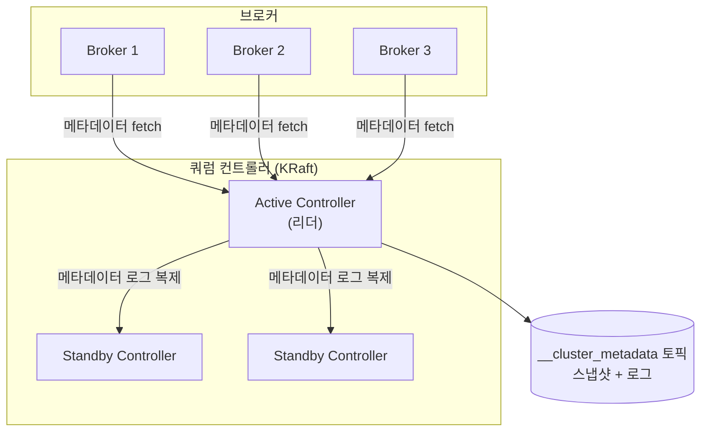
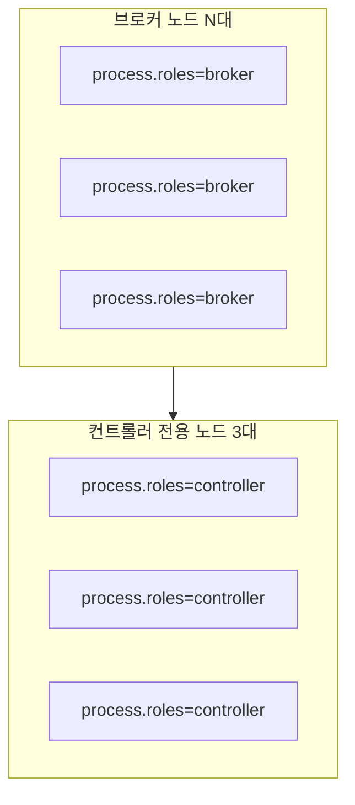
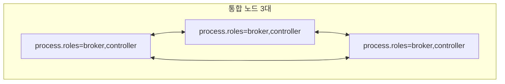

---

title: "Kafka에서 ZooKeeper를 걷어내기, KRaft 모드 정리"
date: 2024-04-23
categories: [Kafka, KRaft]
tags: [Kafka, KRaft]
layout: post
toc: true
math: true
mermaid: true

---

## 참고자료

- [Apache Kafka 공식문서](https://kafka.apache.org/documentation/#kraft)
- [CONFLUENT 공식문서](https://developer.confluent.io/learn/kraft/)
- [DEVOCEAN](https://devocean.sk.com/blog/techBoardDetail.do?ID=165737&boardType=techBlog)
- [Baeldung](https://www.baeldung.com/kafka-shift-from-zookeeper-to-kraft)
- [KRaft, Zookeeper기반으로 카프카 기동시키기](https://www.geuni.tech/ko/kafka/kafka_introduce_install_cluster/)

---

- KRaft(Kafka Raft Metadata mode) 배경 및 개요
- KRaft 동작 방식
- KRaft 구성 방식
  - 별도의 Controller를 사용하여 구축하기
  - Kraft와 Broker를 통합하기
- KRaft서버 권장 스펙
- 벤치마킹 (KRaft vs Zookeeper)
- Kafka 도입 전 고려해야할 사항
- KRaft를 적용하여 Kafka 기동시키기
- Controller Failover
- 정족수(Quorum)

---

## 배경

Kafka를 처음 세울 때 ZooKeeper를 같이 띄워야 한다는 것이 이상했다. **메시지 브로커를 쓰려는데 왜 별도의 코디네이터 클러스터가 필요한가.**

운영 대상이 하나 더 늘어난다는 뜻이고, 실제로 ZooKeeper 쪽 장애 때문에 Kafka가 멈추는 경우도 있다고 들었다.

KRaft가 그 의존을 없앤다고 해서 공식문서를 읽었다.

정리하면서 확인하고 싶었던 것들이다.

- ZooKeeper가 Kafka에서 정확히 무슨 일을 하고 있었는가?
- 그것을 Kafka 안으로 가져오면 무엇이 좋아지는가?
- 컨트롤러를 몇 대로 두어야 하고 왜 홀수여야 하는가?
- 옮길 때 무엇을 확인해야 하는가?

---

## KRaft(Kafka Raft Metadata mode)가 나온 이유

[KIP-500 카프카에서 주키퍼 의존성을 제거하는 방안이 제시됐다.](https://cwiki.apache.org/confluence/display/KAFKA/KIP-500%3A+Replace+ZooKeeper+with+a+Self-Managed+Metadata+Quorum)

위 링크의 내용을 요약하자면 KRaft는 Kakfa 자체에 메타데이터관리에 대한 책임을 통합하여 Kafka 아키텍처를 간소화한 것이다.

따라서 기존 방식인 `Zookeeper`를 이용하는 방식과 `KRaft`방식으로 카프카를 운용할 수 있다.

지금까지는 카프카 클러스터를 배포하기 위해 브로커 뿐만 아니라 ZooKeeper를 관리하고, 배포하고, 모니터링을 해야 했다. 이는 단순히 별도의 애플리케이션 운영 관리를 넘어서, 추가로 별도의 물리적 서버 자원의
할당까지 포함하고 있다.

또한 이 두 시스템은 서로 다른 설정과 운영 방식을 요구하기 때문에 복잡성이 증가한다는 불편함이 있었다. 이 문제를 개선하고자 KRaft모드가 도입됐다.

KRaft방식은 기존 Zookeeper Quorum, Redis Sentinel과 유사하게 Failover상황에서 Quorum을 진행하기위한 Quorum Controller를 사용한다. 이 Quorum
Controller가 가져다줄 수 있는 이점은 아래와 같다.

1. 적절한 수의 브로커로 크기가 조정되고 사용 사례의 처리량 및 대기 시간 요구 사항을 충족하도록 계산되는 클러스터를 의미하며 수백만 개의 파티션까지 확장할 수 있는 가능성이 있다.
2. 아키텍처 단순화로 모니터링, 관리의 편의성의 증대를 기대할 수 있다.
3. 전체 시스템에 대해 단일 보안 모델을 가질 수 있다.
4. 구성, 네트워킹 설정, 통신 프로토콜에 대한 통합 관리 모델 구축이 가능하다.
5. Kafka를 경량의 단일 프로세스로 기동시킬 수 있다.
6. 컨트롤러 장애 조치(Failover 처리)를 거의 즉각적으로 수행 가능하다. (이는 Failover 성능 벤치마크 지표로 알 수 있다.)

---

## KRaft 동작 방식



**브로커가 메타데이터를 직접 받아 로컬에 캐시한다는 점**이 주키퍼 방식과 가장 크게 다르다. 주키퍼 시절에는 컨트롤러가 브로커에게 변경을 밀어주는(push) 방식이었고, 브로커 수가 많아질수록 그 전파가 병목이 됐다.

쿼럼 컨트롤러는 KRaft프로토콜을 사용하여 브로커의 메타데이터가 쿼럼 전체에 복제되도록 한다.

쿼럼 컨트롤러는 이벤트 소스 저장소 모델을 사용하여 (각 브로커의 메타데이터를 저장하는 보관소) 상태를 저장한다.

이 상태를 저장하는 데 사용되는 이벤트 로그 (메타데이터 토픽)은 로그가 무한정으로 커지지 않도록 정기적인 스냅샷을 기록한다. (로그 컴팩션)

---

## KRaft 구성 방식

KRaft모드는 Zookeeper와 마찬가지로 여러 구성방식이 존재한다.

### 1. 별도의 Controller를 사용하여 구축하기



위와 같이 KRaft를 위한 컨트롤러 노드를 별도로 배치하여 높은 가용성과 안정성을 확보하는데 초점을 둘 수 있다. 이 방식으로 만약 브로커가 중단되더라도 KRaft는 장애 전파없이 정상적인 동작을 보장할 수
있다.

클러스터의 관리 효율성과 시스템 전체의 안정성을 더 우선시해야한다면 이 방식을 고려할 만하다.

### 2. KRaft와 Broker를 통합하기



**한 프로세스가 두 역할을 겸한다.** 그래서 브로커 쪽 부하가 컨트롤러 동작에 영향을 준다. 브로커가 대량 트래픽으로 GC를 길게 돌면 그 노드의 컨트롤러 응답도 함께 늦어진다.

위와 같이 컨트롤러와 브로커를 통합하여 사용할 수도 있다. 서버의 리소스가 한정적인 경우에는 이러한 방식으로 구축할 수 있지만 분리하여 사용하는 방식에 비해 안정성이 떨어지므로 권장되는 구성은 아닙니다.

라이브 환경이 아닌 개발환경에서는 이 구성이 적합할 수 있다.

---

## KRaft서버 권장 스펙

- CPU
  - CPU를 공유하는 경우 Dedicated CPU
- MEM
  - 최소 4GB
- DISK
  - 최소 SSD 64GB
- JVM
  - 최소 1GB

---

## 벤치마킹 (KRaft vs Zookeeper)

아파치 카프카 측이 공개한 벤치마크에서 KRaft 모드의 컨트롤러 장애 복구 시간이 크게 짧게 나온다. 파티션 수가 많아질수록 격차가 벌어진다.

차이가 나는 이유는 구조에 있다.

| | 주키퍼 방식 | KRaft |
|---|---|---|
| 메타데이터 위치 | 외부 주키퍼 앙상블 | 카프카 자체 로그 토픽 |
| 컨트롤러 교체 시 | 주키퍼에서 전체 메타데이터를 다시 읽어야 한다 | 대기 컨트롤러가 이미 로그를 따라가고 있다 |
| 소요 시간 | 파티션 수에 비례해 늘어난다 | 거의 일정하다 |

**대기 컨트롤러가 미리 로그를 복제해두고 있다는 것**이 핵심이다. 리더가 죽으면 이미 최신 상태를 가진 노드가 즉시 이어받는다. 주키퍼 방식은 새 컨트롤러가 처음부터 메타데이터를 읽어와야 했다.

구체적인 수치는 버전과 환경에 따라 달라지므로 [공식 문서](https://kafka.apache.org/documentation/#kraft)에서 확인하는 편이 낫다.

---

## Kafka 도입 전 고려해야할 사항

- 어떤 모드를 선택할 것인가?
- Zookeeper 혹은 KRaft를 사용할 때 어떤 구성을 가져갈 것인가?
  - Zookeeper : Zookeeper를 브로커로 사용할 하나의 노드에 통합하여 운용하기 vs Zookeeper를 서비스할 노드를 추가하기
  - KRaft : QuorumController를 브로커로 사용할 하나의 노드에 통합하여 운용하기 vs QuorumController를 서비스할 노드를 추가하기

---

## KRaft를 적용하여 Kafka 기동시키기

### 1. Kafka 설정

```shell
cd /usr/local/kafka_version

# log directory 생성
sudo mkdir -pv logs/kraft-combined-logs

# kraft config변경
sudo vim config/kraft/server.properties
```

### 2. Server 1

```shell
############################# Server Basics #############################
process.roles=broker,controller
node.id=1
controller.quorum.voters=1@${kafkaHostAddress1}:9093,2@${}kafkaHostAddress2}:9093,3@${kafkaHostAddress3}:9093

############################# Socket Server Settings #############################
listeners=PLAINTEXT://${kafkaHostAddress1}:9092,CONTROLLER://${kafkaHostAddress1}:9093
advertised.listeners=PLAINTEXT://${kafkaHostAddress1}:9092

############################# Log Basics #############################
log.dirs=/usr/local/kafka_version/logs/kraft-combined-logs
num.partitions=3

############################# Internal Topic Settings  #############################
offsets.topic.replication.factor=3
transaction.state.log.replication.factor=3
transaction.state.log.min.isr=3
```

### 3. Server 2

```shell
############################# Server Basics #############################
process.roles=broker,controller
node.id=2
controller.quorum.voters=1@${kafkaHostAddress1}:9093,2@${}kafkaHostAddress2}:9093,3@${kafkaHostAddress3}:9093

############################# Socket Server Settings #############################
listeners=PLAINTEXT://${kafkaHostAddress2}:9092,CONTROLLER://${kafkaHostAddress2}:9093
advertised.listeners=PLAINTEXT://${kafkaHostAddress2}:9092

############################# Log Basics #############################
log.dirs=/usr/local/kafka_version/logs/kraft-combined-logs
num.partitions=3

############################# Internal Topic Settings  #############################
offsets.topic.replication.factor=3
transaction.state.log.replication.factor=3
transaction.state.log.min.isr=3
```

### 4. Server 3

```shell
############################# Server Basics #############################
process.roles=broker,controller
node.id=3
controller.quorum.voters=1@${kafkaHostAddress3}:9093,2@${}kafkaHostAddress2}:9093,3@${kafkaHostAddress3}:9093

############################# Socket Server Settings #############################
listeners=PLAINTEXT://${kafkaHostAddress3}:9092,CONTROLLER://${kafkaHostAddress3}:9093
advertised.listeners=PLAINTEXT://${kafkaHostAddress3}:9092

############################# Log Basics #############################
log.dirs=/usr/local/kafka_version/logs/kraft-combined-logs
num.partitions=3

############################# Internal Topic Settings  #############################
offsets.topic.replication.factor=3
transaction.state.log.replication.factor=3
transaction.state.log.min.isr=3
```

위와 같은 설정으로 각 서버(노드)마다 Quorum Controller를 지정하여 추후 Failover 상황 발생 시에도 빠르게 회복할 수 있도록 구성할 수 있다.

### 5. 카프카 기동시키기

```shell
// 각 노드들에 설치된 카프카를 실행합니다.
sudo ./bin/kafka-server-start.sh -daemon ./config/kraft/server.properties

// 실행 후 로그를 확인합니다.
tail -f logs/server.log
```

### 6. 상태 확인하기

```shell
// 클러스터 상태를 확인합니다.
./bin/kafka-metadata-quorum.sh --bootstrap-server ${kafkaHostAddress1}:9092,${kafkaHostAddress2}:9092,${kafkaHostAddress3}:9092 describe --status

// 브로커들의 상태를 확인합니다.
./bin/kafka-metadata-quorum.sh --bootstrap-server ${kafkaHostAddress1}:9092,${kafkaHostAddress2}:9092,${kafkaHostAddress3}:9092 describe --replication
```

---

## 컨트롤러 리더가 불용상태가 되었을 때

- [Using Kafka-Leader-Election to Improve Scalability and Performance](https://developer.confluent.io/learn-more/podcasts/using-kafka-leader-election-to-improve-scalability-and-performance/)
- [Raft 알고리즘](https://seongjin.me/raft-consensus-algorithm/)
- [Raft 알고리즘 (논문 해설)](https://medium.com/rate-labs/raft-consensus-%EC%9D%B4%ED%95%B4-%EA%B0%80%EB%8A%A5%ED%95%9C-%ED%95%A9%EC%9D%98-%EC%95%8C%EA%B3%A0%EB%A6%AC%EC%A6%98%EC%9D%84-%EC%9C%84%ED%95%9C-%EC%97%AC%EC%A0%95-f7ecb9f450ab)

카프카는 한 컨트롤러가 다운되었을 때 Raft 알고리즘을 통해 리더를 재선출한다.

### Raft 용어

* **임기(Term)**: 정치 선거제에서의 "제1대", "제2대"와 같은 성격의 번호값이다.
  * 이 번호값은 새로운 선거가 시작된 시점부터 그 선거로 선출된 리더가 리더로서 기능하는 동안까지의시간을 대표한다.
* **선거 타임아웃(Election Timeout)**: 팔로워가 후보자로 변환되기까지 대기하는 시간이다.
  * 타임아웃은 모든 팔로워 및 후보자 노드에게 150~300ms 사이의각기 다른 임의의 값으로 주어집니다.
* **하트비트(Heartbeat)**: 리더가 모든 팔로워에게 주기적으로 발송하는 메시지다.
  * 이 메시지에는 클라이언트의 명령 전파를 위한 로그(log)가 포함되지 않고 오직 리더가 자신의 상태를 알리는(유지)하는 수단이다.

### Election 과정

1. 클러스터에 리더가 없는 상태에선 모든 노드가 팔로워 상태를 유지하며 각자에게 주어진 Election Timeout이 될 때까지 대기한다.
2. Election Timeout이 가장 먼저 끝난 노드가 후보자로 전환되고, 새로운 선거 임기(Term)가 시작된다.
3. 후보자 노드는 즉시 자신에게 한 표를 준 뒤 다른 노드들에게 투표 요청 메시지를 전송한다.
4. 투표 요청 메시지를 수신한 노드가 해당 임기 중에 아직 투표한 적이 없다면, 그 메시지의 발신처인 후보자에게 투표 메시지를 보낸 후 자신의 Election Timeout을 초기화한다.
  1. 이는 현재 투표 과정에 있는 후보자 노드(들) 외에 또다른 후보자가 출현하지 않도록 하는 장치다.
5. 전체 노드 수의 과반에 해당하는 응답을 얻은 노드는 해당 임기(Term)에 대한 새로운 리더로 선정된다.

새롭게 선출된 리더는 하트비트를 전송하고 팔로워는 이를 수신할 때마다 자신의 Election Timeout을 다시 초기화하며 팔로워 상태를 유지한다.

### 리더 노드에 문제가 생긴다면?

1. 팔로워 주어진 Election Timeout 이내에 리더로부터 어떠한 메시지도 받지 못한 팔로워 노드는 즉시 후보자로 전환된다. 이때 클러스터의 임기(Term) 번호가 1 증가하게 되며, 곧바로 새로운 리더
   선출이 시작된다.
2. 클러스터의 각 노드는 현재의 임기(Term) 번호를 저장해두고, 서로 메시지를 주고 받을 때마다 이 번호를 함께 포함시킵니다.
3. 문제가 생겼던 이전의 리더 노드가 복구되어 클러스터와 다시 연결되면, 이 노드는 클러스터가 공유하는 임기(Term) 번호를 자신의 번호와 비교한다.
4. 현재 클러스터의 임기(Term) 번호보다 자신의 번호가 낮은 것을 확인한 이전의 리더 노드는 팔로워로 전환된다.

### 누구도 과반을 얻지 못했다면?

4개 노드의 클러스터에서 우연히 2개의 후보자가 동시에 나타나서 각 2표씩 얻은 경우가 있을 수 있다.

1. 누구도 과반을 얻지 못한 경우에는 그대로 해당 임기를 종료하고 새 임기와 함께 재선거를 시작한다.
2. 이때 이전 선거처럼 동점자가 다시 나타나지 않도록, 뗏목 합의 알고리즘(Raft Consensus Algorithm)은 매 선거가 시작될 때마다 후보자 노드들의 Election Timeout 값을 랜덤하게
   재조정한다.
3. 만약 클러스터 안에 죽은 노드가 너무 많아서 어떤 노드도 과반의 득표를 얻을 수 없는 상황이라면 리더 선출이 불가능하다.

- Election Timeout 이 여러 노드에 랜덤하게 부여된다.
- 먼저 ElectionTimeout이 끝난 노드가 투표해달라고 요청한다.
- 투표를 하지 않은 노드들이 해당 후보자에게 투표한다.

---

## (번외) 브로커 리더가 불용상태가 되었을 때

### ISR(In-Sync-Replica)로 불용 상태를 해결하기

리더와 팔로워는 `ISR(In-Sync-Replica)`이라는 `논리적 그룹`으로 묶여있다. 해당 그룹의 리더가 불용상태로 되면 해당 그룹의 팔로워가 그 자리를 대체하기 위함이다.

즉, **ISR그룹에 속하지 않은 팔로워들은 현재 불용상태가 된 리더를 대체할 수 없다.**

`ISR`내의 팔로워들은 리더를 `Pull`하고 있고, 리더는 팔로워들이 메세지를 전달 받을 때까지 기다리게 된다. 이 과정에서 리플리케이션이 잘 동작하지 않은 팔로워는 리더로 승격할 수 없다.

만약 팔로워가 특정 주기의 시간만큼 복제 요청을 하지 않는다면 해당 팔로워를 ISR에서 추방한다.

- `replica.lag.max.messages`
  - follower들이 최대 몇 개까지 복제가 늦어져도 되는지 설정
- `replica.lag.time.max.ms`
  - follower들이 max message를 벗어났을 때 max message 보다 안쪽으로 들어올 때 까지 기다리는 최대 시간 설정

`ISR`내에서 모든 팔로워가 복제를 마치면 리더는 내부적으로 커밋되었다는 표시를 한다. 그리고 마지막 커밋 오프셋 위치는 `High WaterMark`라고 한다.

### 리더 에포크를 활용해서 더 멋지게 불용 상태를 해결하기

`리더 에포크(Leader Epoch)`는 파티션들이 복구 동작을 할 때 메세지의 일관성을 유지하기 위한 용도로 컨트롤러로부터 관리되는 `32bit` 숫자로 표현된다.

이 리더에포크 정보는 리플리케이션 프로토콜로 전파되고 새로운 리더가 변경된 후 변경된 리더에 대한 정보는 팔로워에게 전달된다.

리더에포크는 복구 동작 시에 하이워터마크를 대체하기도 한다.

### 시나리오로 알아보는 리더 에포크의 필요성

1. `리더`가 `"First Message"`라는 메세지를 받은 후 0번 오프셋에 저장했다.
2. `팔로워`는 `0번 오프셋`을 fetch하여 리플리케이션을 완료했다.
3. `리더`가 `"Second Message"`라는 메세지를 받은 후 `1번 오프셋`에 저장했다.
4. `팔로워는` `오프셋 1`에 대해 `fetch요청`을 한 후 응답으로 받은 `하이워터마크를 자신에게 반영한다.`
5. `팔로워가` `오프셋 1`에 대한 메세지를 리플리케이션한다.
6. `팔로워는` `오프셋 2`에 대해 `fetch요청`을 보낸다.
7. `리더`는 해당 요청을 받은 후 `하이워터마크를 2로` 올렸다.
7. `팔로워`는 `오프셋 1`인 `"Second Message"`까지 리플리케이션을 완료했지만 리더로부터 `하이워터마크를 2로 올리는 내용은 받지 못했다.`
8. 예기치 못한 에러로 `팔로워가 다운됐다.`

현재 상황

| 리더                    | 팔로워                  |
|-----------------------|----------------------|
| "FirstMessage" 오프셋 0  | "FirstMessage" 오프셋 0 |
| "SecondMessage" 오프셋 1 |                      |
| 하이워터마크 == 2           | 하이워터마크 == 1          |

카프카 내부 복구 동작에 의한 다시 시나리오를 진행한다.

- 팔로워는 자신의 워터마크보다 높은 메세지들은 삭제한다.
  - 따라서 오프셋 1의 "Second Message"는 삭제된다.
- 팔로워는 리더에게 오프셋 1의 메세지를 fetch 요청한다.
- 이 순간 리더가 불용상태로 들어가게되어, 해당 파티션에 유일하게 남아있는 팔로워가 새로운 리더로 승격한다.

현재 상황

| 뉴리더                  |
|----------------------|
| "FirstMessage" 오프셋 0 |
| 하이워터마크 == 1          |

결국 새로운 리더가 선출되었지만 메세지 유실이 발생한 상황이 되었다.

이 때 사용할 수 있는게 리더에포크이다. 리더에포크를 사용하면 복구 동작 중 팔로워의 하이워터마크보다 높은 메세지를 즉시 삭제하는 것이 아니라 리더에게 리더에포크 요청을 보낸다.

리더에포크를 사용한 복구 과정은 아래와 같다.

1. 리더에게 `리더에포크 요청`을 보낸다.
2. 리더는 `팔로워에게` `리더에포크 응답`으로 `"오프셋 1의 "Second Message"까지"` 라고 보낸다.
3. 팔로워는 자신의 하이워터마크보다 높은 오프셋 1의 "Second Message"를 `삭제하지 않고 리더의 응답을 확인`한다.
4. `"Second Message"까지 자신의 하이워터마크를 상향`한다.

---

## 정족수(Quorum)

전체 노드 수(N) 중 자기 자신을 포함하여 최소 과반의, 즉 (N+1)/2 이상의 응답을 얻어야 한다.
이때 요구되는 최소한의 노드 수, 즉 (N+1)/2와 같거나 큰 자연수가 정족수(Quorum)다.

### 내결함성을 위한 최적의 노드 수

합의 알고리즘(Consensus Algorithm)을 채택한 분산 시스템에서는 전체 노드 수를 가급적 **3개 이상의 홀수**로 유지하는 것이 권장된다.

1. 최소 3개의 노드가 있어야 클러스터가 내결함성(Fault Tolerance)을 갖출 수 있다.
2. 전체 노드 수가 홀수일 때 허용 가능한 장애 노드 수의 비율이 좀 더 높다.

N개의 노드로 구성된 클러스터를 가정해보자. 최소 과반수가 정상 동작해야 한다는 알고리즘의 조건을 고려할 때, 허용 가능한 장애 발생 노드 수를 계산하면 다음과 같다.

* N이 홀수(2k+1)일 때 : k개 노드의 장애까지 허용 가능
* N이 짝수(2k)일 때 : k-1개 노드의 장애까지 허용 가능

| 전체 노드 수  | 필요 정족수 | 허용 가능 장애 노드 수 |
|----------|--------|---------------|
| 1        | 1      | 0             |
| 2        | 2      | 0             |
| 3        | 2      | 1             |
| 4        | 3      | 1             |
| 5        | 3      | 2             |
| 6        | 4      | 2             |
| 7        | 4      | 3             |
| 8        | 5      | 3             |
| ...      | ...    | ...           |
| 2k(짝수)   | k+1    | k-1           |
| 2k+1(홀수) | k+1    | k             |

위 표를 통해 알 수 있는 내용은 아래와 같다.

- 전체 노드 수가 3개 이상이어야 허용 가능한 장애 노드가 생깁니다.
  - 2개의 노드로 클러스터를 구성하는 것은 자원 관리의 측면에서나 내결함성의 측면에서나 모두 비효율적인 방식임을 알 수 있다.
- 3 이상의 짝수 개로 노드를 구성하는 것도 가능하다.
  - 그러나 클러스터가 정상적으로 기능하기 위해 요구되는 정족수의 비율이 홀수인 경우에 비해 높다는 단점을 감수해야 한다.
    - 가능하다면 더 적은 수의 노드로 동등한 수준의 내결함성을 가질 수 있는 홀수 개의 노드로 클러스터를 구성하는 것이 더 효율적이다.
- Raft Consensus Algorithm의 경우에는 분할 투표(split votes (투표 동률))로 인한 리더 선출의 불필요한 반복과 명령 처리 지연 가능성을 줄이기 위해서라도 홀수 개의 노드 운영이
  권장된다.

---

## 정리하며

처음 던진 질문들에 대한 답이다.

**ZooKeeper가 무엇을 하고 있었는가.** 클러스터 메타데이터를 보관하고 있었다. 어떤 브로커가 살아 있는지, 각 파티션의 리더가 누구인지, 토픽 설정이 무엇인지 같은 것들이다. 그리고 컨트롤러를 뽑는 선거도 여기서 했다.

**Kafka 안으로 가져오면 무엇이 좋아지는가.** 세 가지다.

**운영 대상이 하나 줄어든다.** 별도 클러스터를 세우고 감시하고 업그레이드할 필요가 없다.

**메타데이터 전파가 빨라진다.** ZooKeeper 방식에서는 컨트롤러가 ZooKeeper에서 읽어 브로커에게 다시 알려주는 구조라 단계가 하나 더 있었다. KRaft에서는 메타데이터 자체가 로그이고, 브로커가 그 로그를 따라 읽는다. **Kafka가 원래 잘하는 방식으로 자기 메타데이터를 다룬다.**

**컨트롤러 장애 복구가 빨라진다.** 새 컨트롤러가 메타데이터를 처음부터 다시 읽을 필요 없이, 이미 따라 읽고 있던 지점부터 이어가면 된다. 파티션이 수십만 개인 클러스터에서 이 차이가 크다.

**컨트롤러를 몇 대로 두는가.** 홀수, 보통 3대나 5대다. Raft는 과반수가 동의해야 결정이 성립하는데, **짝수로 두면 같은 내결함성을 얻는 데 노드가 더 든다.** 3대는 1대까지, 4대도 1대까지만 견딘다. 5대는 2대까지 견딘다. 그리고 투표가 동률로 갈리면 리더 선출이 반복되므로 홀수가 유리하다.

**옮길 때 확인할 것.** 통합 모드와 분리 모드 중 무엇을 쓸지 정해야 한다. 브로커와 컨트롤러를 같은 프로세스에 두면 서버 수가 줄지만, **컨트롤러가 브로커의 부하에 영향을 받는다.** 운영 규모라면 분리하는 편이 안전하다.

그리고 **저장 디렉터리를 미리 포맷해야 한다.** 클러스터 ID를 만들고 각 노드에 심는 단계가 ZooKeeper 방식에는 없던 것이다. 이걸 빠뜨리면 기동 자체가 안 된다.

정리하고 나서 남은 감각은 **분산 시스템이 자기 상태를 남에게 맡기는 구조의 비용**이었다. ZooKeeper는 잘 만들어진 도구이지만, Kafka가 이미 복제된 로그를 다루는 시스템인데 메타데이터만 다른 방식으로 관리하고 있었다는 것이 어색했다. KRaft는 그 어색함을 없앤 변경이었다.