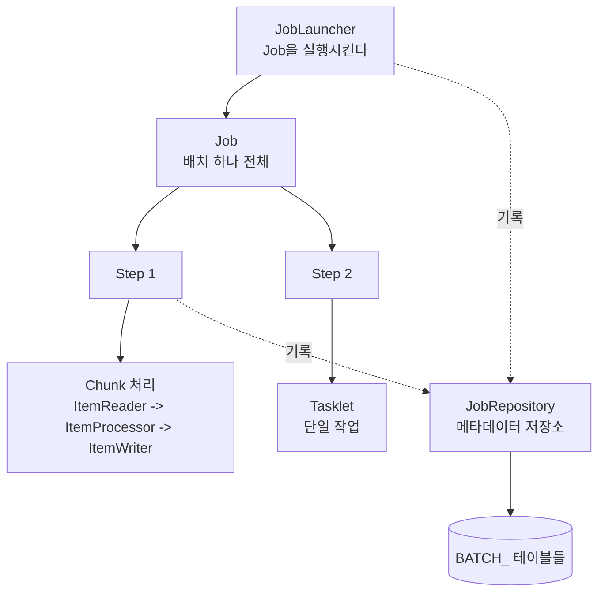
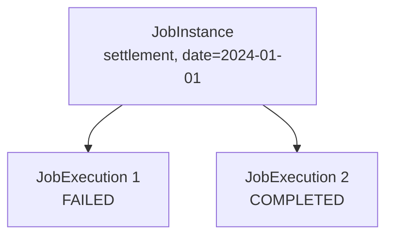
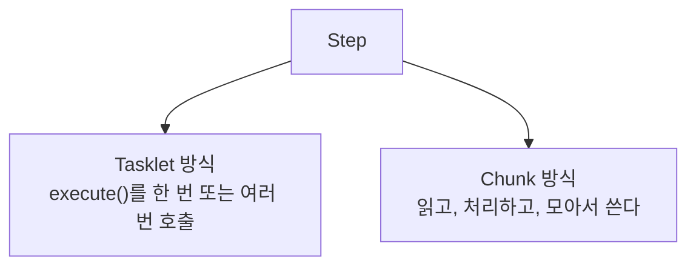
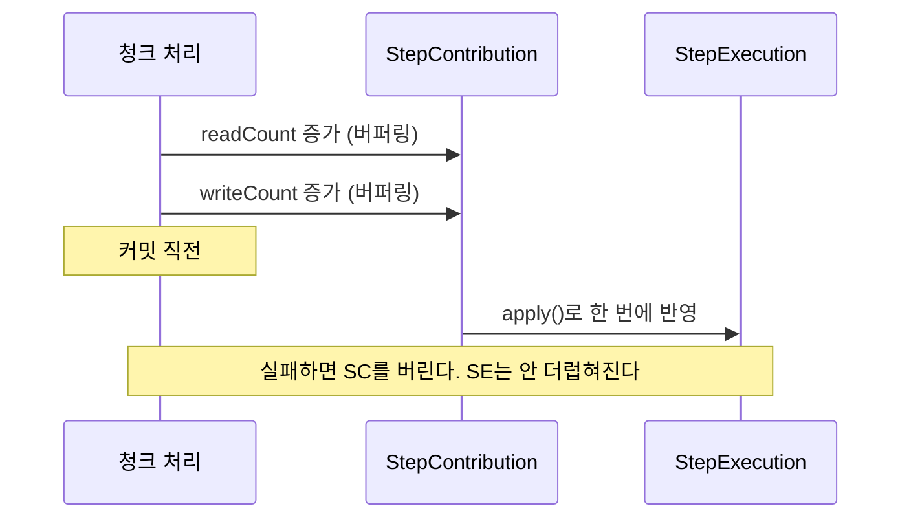
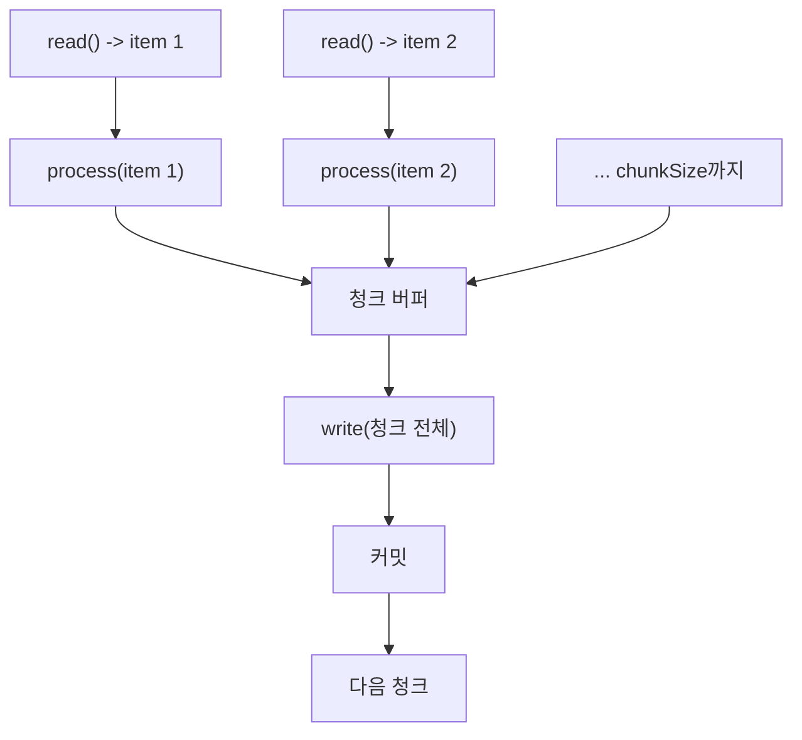
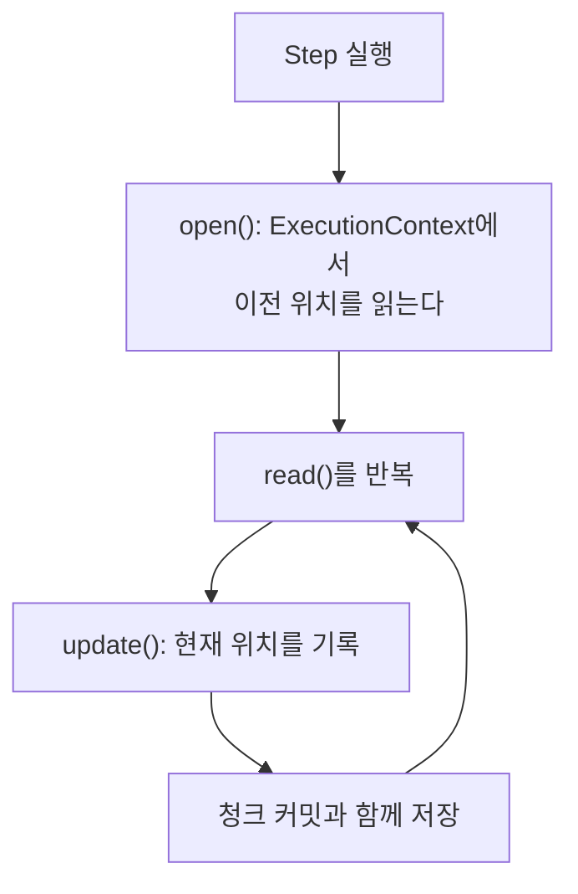

---

title: "스프링 배치의 구성 요소가 왜 이렇게 많은가"
date: 2024-08-07
categories: [Spring, Batch]
tags: [SpringBatch, Job, Step, Chunk, ItemReader, ItemWriter]
layout: post
toc: true
math: true
mermaid: true

---

## 참고자료

- [Spring Batch Reference - Introduction](https://docs.spring.io/spring-batch/reference/spring-batch-intro.html)
- [Spring Batch Reference - Domain Language](https://docs.spring.io/spring-batch/reference/domain.html)
- [Spring Batch Reference - Chunk-oriented Processing](https://docs.spring.io/spring-batch/reference/step/chunk-oriented-processing.html)
- [Spring Batch Reference - Meta-Data Schema](https://docs.spring.io/spring-batch/reference/schema-appendix.html)
- [Spring Batch 5.0 Migration Guide](https://github.com/spring-projects/spring-batch/wiki/Spring-Batch-5.0-Migration-Guide)
- [Terasoluna Batch Guideline - Spring Batch Architecture](https://terasoluna-batch.github.io/guideline/5.0.0.RELEASE/en/Ch02_SpringBatchArchitecture.html)

---

## 배경

배치 작업을 만들어야 했다. 처음에는 `@Scheduled`가 붙은 메서드에 반복문 하나면 될 것 같았다.

그런데 스프링 배치를 보니 `Job`, `JobInstance`, `JobExecution`, `Step`, `StepExecution`, `StepContribution`, `ExecutionContext` 같은 것들이 줄줄이 나왔다. **단순히 반복하면 되는 일에 왜 이렇게 많은 개념이 필요한지** 이해가 안 갔다.

정리하면서 확인하고 싶었던 것들이다.

- 반복문 하나로 안 되는 이유가 무엇인가?
- `JobInstance`와 `JobExecution`은 왜 나뉘어 있는가?
- 청크 단위로 처리한다는 것이 정확히 무엇인가?
- 실패한 배치를 다시 돌리면 어디서부터 시작하는가?

---

## 1. 반복문으로 안 되는 이유

첫 질문이다. 정산 배치를 예로 든다. 하루치 주문을 읽어서 정산 데이터를 만들어 저장하는 일이다.

```java
@Scheduled(cron = "0 0 2 * * *")
public void settle() {
    List<Order> orders = orderRepository.findByDate(yesterday());
    for (Order order : orders) {
        settlementRepository.save(toSettlement(order));
    }
}
```

**돌긴 한다.** 문제는 실제 운영에서 부딪히는 것들이다.

**주문이 천만 건이면 메모리가 터진다.** `findByDate`가 전부 메모리에 올린다.

**중간에 실패하면 어디까지 됐는지 모른다.** 500만 건째에서 죽었다면, 다시 돌릴 때 처음부터 해야 하고 그러면 앞의 500만 건이 중복으로 들어간다.

**같은 날짜로 두 번 돌면 두 번 들어간다.** 이미 돌았는지 확인할 방법이 없다.

**얼마나 진행됐는지 알 수 없다.** 로그를 직접 찍지 않으면 밖에서 볼 방법이 없다.

**스프링 배치의 개념들은 전부 이 네 가지를 위한 것**이다.

| 문제 | 스프링 배치의 대응 |
|---|---|
| 메모리 | 청크 단위 읽기, 처리, 쓰기 |
| 재시작 위치 | `ExecutionContext`에 진행 상태 저장 |
| 중복 실행 | `JobInstance`로 같은 실행인지 판별 |
| 진행 상황 | 메타데이터 테이블에 기록 |

이걸 알고 나면 개념 하나하나가 어느 문제에 대응하는지 보인다.

---

## 2. 전체 구조



**`Job`이 배치 하나 전체**이고, **`Step`이 그 안의 단계**다.

`JobLauncher`가 `Job`을 실행시키고, `JobRepository`가 무슨 일이 있었는지를 DB에 기록한다.

**이 기록이 스프링 배치의 핵심이다.** 재시작, 중복 방지, 진행 추적이 전부 이 기록에서 나온다.

---

## 3. Job

여러 `Step`을 담는 그릇이다. **`Step`이 하나 이상 있어야 한다.**

실제 비즈니스 로직은 `Step`에 들어간다. `Job`은 어떤 순서로 어떤 `Step`을 실행할지만 정한다.

### 3.1 AbstractJob

`SimpleJob`과 `FlowJob`의 부모다. 갖고 있는 것들이다.

| 필드 | 무엇인가 |
|---|---|
| `name` | Job 이름 |
| `restartable` | 재시작 허용 여부 (기본값 true) |
| `jobRepository` | 메타데이터 저장소 |
| `jobExecutionListener` | 시작, 종료 시점에 끼어들 수 있는 리스너 |
| `jobParametersIncrementer` | 파라미터를 자동으로 증가시키는 장치 |
| `jobParametersValidator` | 파라미터 검증기 |

### 3.2 SimpleJob과 FlowJob

**`SimpleJob`은 `Step`을 순서대로 실행한다.** 앞 단계가 실패하면 뒤는 안 돈다.

**`FlowJob`은 조건에 따라 갈라진다.** `Step`의 종료 코드를 보고 다음에 무엇을 할지 정한다.

```java
@Bean
public Job flowJob(JobRepository jobRepository, Step step1, Step step2, Step step3) {
    return new JobBuilder("flowJob", jobRepository)
            .start(step1())
                .on("FAILED").to(step3())     // 실패하면 복구 단계로
                .from(step1()).on("*").to(step2())   // 그 외에는 다음 단계로
            .end()
            .build();
}
```

### 3.3 코드로 만들기

```java
@Configuration
@RequiredArgsConstructor
public class JobConfiguration {

    @Bean
    public Job job(JobRepository jobRepository, Step step1, Step step2) {
        return new JobBuilder("job", jobRepository)
                .start(step1)
                .next(step2)
                .build();
    }

    @Bean
    public Step step1(JobRepository jobRepository, PlatformTransactionManager txManager) {
        return new StepBuilder("step1", jobRepository)
                .tasklet((contribution, chunkContext) -> RepeatStatus.FINISHED, txManager)
                .build();
    }
}
```

**여기서 버전 차이를 짚어둔다.** 스프링 배치 4까지는 `JobBuilderFactory`와 `StepBuilderFactory`를 주입받아 썼다.

```java
// 4.x 방식. 5.0에서 제거됐다
private final JobBuilderFactory jobBuilderFactory;

@Bean
public Job job() {
    return jobBuilderFactory.get("job").start(step1()).next(step2()).build();
}
```

**5.0에서 이 팩토리들이 사라졌다.** 대신 `JobBuilder`와 `StepBuilder`를 직접 만들고 `JobRepository`를 생성자로 넘긴다.

`StepBuilder`의 `tasklet()`과 `chunk()`도 **`PlatformTransactionManager`를 인자로 받도록 바뀌었다.** 전에는 알아서 찾아 썼는데, 어느 트랜잭션 매니저를 쓸지 명시하게 만든 것이다. 데이터소스가 여럿인 환경에서 엉뚱한 것이 잡히던 문제를 막기 위한 변경이다.

`@EnableBatchProcessing`도 이제 선택이다. 스프링 부트 3에서는 안 붙여도 자동 설정이 동작하고, **오히려 붙이면 자동 설정이 꺼진다.**

---

## 4. JobInstance와 JobExecution

두 번째 질문이다. 이름이 비슷해서 가장 헷갈렸던 부분이다.

### 4.1 JobInstance

**"논리적으로 한 번의 실행"** 이다.

정산 배치를 매일 돌린다면, **1월 1일치 정산과 1월 2일치 정산이 서로 다른 `JobInstance`** 다.

무엇으로 구분하는지가 중요하다. **Job 이름과 파라미터 조합이다.**

```text
JobInstance = Job 이름 + 식별용 JobParameter들의 해시
```

| JobInstance ID | Job Name | Job Key (파라미터 해시) |
|---|---|---|
| 1 | settlement | date=2024-01-01의 해시 |
| 2 | settlement | date=2024-01-02의 해시 |

**여기서 중복 실행 방지가 나온다.** 같은 이름과 같은 파라미터로 실행하려고 하면, `JobRepository`가 이미 있는 `JobInstance`를 찾아낸다.

그리고 **이미 성공적으로 끝난 `JobInstance`는 다시 못 돌린다.** `JobInstanceAlreadyCompleteException`이 난다.

```java
// 같은 파라미터로 두 번 실행
jobLauncher.run(job, params);   // 성공
jobLauncher.run(job, params);   // JobInstanceAlreadyCompleteException
```

**개발 중에 이것 때문에 자주 막힌다.** 그래서 시각을 파라미터에 넣어서 매번 다른 `JobInstance`가 되게 하는 방법을 쓴다.

```java
new JobParametersBuilder()
        .addLong("time", System.currentTimeMillis())
        .toJobParameters();
```

**이건 개발 중에나 쓸 방법이다.** 운영에서 이렇게 하면 중복 실행 방지가 통째로 무력화된다. 그 날짜를 두 번 돌려도 막히지 않는다.

### 4.2 JobExecution

**"실제 실행 시도"** 다.

1월 1일치 정산이 첫 시도에 실패하고 두 번째 시도에 성공했다면, **`JobInstance`는 하나인데 `JobExecution`은 둘**이다.



**이 관계가 재시작을 가능하게 한다.** 실패한 시도의 기록이 남아 있으니 다음 시도가 그걸 보고 이어서 할 수 있다.

`JobExecution`이 담고 있는 것들이다.

| 필드 | 내용 |
|---|---|
| `jobParameters` | 실행할 때 받은 파라미터 |
| `jobInstance` | 어느 논리적 실행에 속하는지 |
| `executionContext` | 실행 중 유지할 데이터 |
| `status` | 실행 상태 (`BatchStatus`) |
| `exitStatus` | 종료 결과 (`ExitStatus`) |
| `startTime`, `endTime` | 시작, 종료 시각 |
| `failureExceptions` | 실행 중 발생한 예외들 |

### 4.3 BatchStatus와 ExitStatus

둘 다 상태를 나타내는데 역할이 다르다.

**`BatchStatus`는 프레임워크가 쓰는 열거형**이다. 값이 정해져 있다.

| 값 | 의미 |
|---|---|
| `STARTING` | 실행 직전 |
| `STARTED` | 실행 중 |
| `STOPPING` | 중지 요청을 받고 현재 단계가 끝나기를 기다리는 중 |
| `STOPPED` | 요청에 의해 중지됨 |
| `COMPLETED` | 성공적으로 완료 |
| `FAILED` | 실패 |
| `ABANDONED` | 제대로 중지되지 않아 재시작할 수 없음 |
| `UNKNOWN` | 상태를 알 수 없음 |

**`ExitStatus`는 문자열 코드**다. 그래서 직접 만들 수 있다.

기본으로 `COMPLETED`, `FAILED`, `STOPPED`, `NOOP`, `EXECUTING`, `UNKNOWN`이 있지만, **`FlowJob`에서 분기 조건으로 쓰려면 직접 정의하는 편이 낫다.**

```java
@Bean
public Step decidingStep(JobRepository jobRepository, PlatformTransactionManager txManager) {
    return new StepBuilder("decidingStep", jobRepository)
            .tasklet((contribution, context) -> {
                if (hasNoData()) {
                    contribution.setExitStatus(new ExitStatus("NO_DATA"));
                }
                return RepeatStatus.FINISHED;
            }, txManager)
            .build();
}
```

이제 `Job`에서 `.on("NO_DATA")`로 분기할 수 있다.

**`ABANDONED`가 왜 있는지도 짚어둔다.** 배치가 돌던 서버가 그냥 죽으면 DB에는 `STARTED`로 남는다. 프레임워크 입장에서는 아직 도는 중인지 죽은 것인지 알 수 없다. 이럴 때 운영자가 `ABANDONED`로 표시해서 "이건 끝난 것으로 치되 재시작은 못 한다"고 정리한다.

### 4.4 JobParameters

`JobInstance`를 구분하는 값들이다.

```java
JobParameters jobParameters = new JobParametersBuilder()
        .addString("name", "user1")
        .addLong("seq", 2L)
        .addLocalDate("date", LocalDate.now())
        .addDouble("rate", 12.3)
        .toJobParameters();

jobLauncher.run(job, jobParameters);
```

**`identifying` 플래그가 중요하다.** 파라미터마다 이 값이 붙고, **true인 것들만 `JobInstance` 구분에 쓰인다.**

```java
new JobParametersBuilder()
        .addString("date", "2024-01-01")           // identifying = true (기본값)
        .addString("runBy", "admin", false)        // identifying = false
        .toJobParameters();
```

`runBy`가 달라도 같은 `JobInstance`다. **실행 맥락을 기록하고 싶지만 그것 때문에 다른 실행으로 취급되면 곤란한 값**을 이렇게 넣는다.

**5.0에서 파라미터 타입이 바뀌었다.** 4.x에서는 `JobParameter`가 `Object`와 `ParameterType` 열거형을 갖고 있었고 타입이 네 가지(`STRING`, `DATE`, `LONG`, `DOUBLE`)로 제한됐다.

5.0부터는 `JobParameter<T>`로 제네릭이 됐다. **변환기를 등록하면 어떤 타입이든 쓸 수 있다.**

---

## 5. Step

실제 로직이 들어가는 곳이다. **`Step`은 두 가지 방식 중 하나로 동작한다.**



### 5.1 AbstractStep

모든 `Step`의 부모다.

| 필드 | 내용 |
|---|---|
| `name` | Step 이름 |
| `startLimit` | 재시작 허용 횟수 (기본값 `Integer.MAX_VALUE`) |
| `allowStartIfComplete` | 이미 완료된 Step을 다시 실행할지 (기본값 false) |
| `jobRepository` | 메타데이터 저장소 |
| `stepExecutionListener` | 이벤트 리스너 |

**`allowStartIfComplete`가 재시작 동작을 좌우한다.** 기본값이 false라서, 재시작하면 **이미 성공한 `Step`은 건너뛰고 실패한 곳부터 시작한다.**

준비 작업처럼 매번 다시 해야 하는 단계는 true로 둔다.

### 5.2 하위 구현체

| 구현체 | 역할 |
|---|---|
| `TaskletStep` | 기본. `Tasklet`을 실행한다. 청크 방식도 내부적으로는 이것이다 |
| `PartitionStep` | 데이터를 나눠서 여러 스레드나 프로세스로 병렬 처리 |
| `JobStep` | Step 안에서 다른 Job을 실행 |
| `FlowStep` | Step 안에서 Flow를 실행 |

### 5.3 StepExecution

`Step`이 실제로 시작될 때 만들어진다. **시작되지 않은 `Step`에는 `StepExecution`이 없다.**

하나의 `JobExecution`이 여러 `StepExecution`을 갖는다.

**여기에 처리 건수가 전부 기록된다.**

| 필드 | 내용 |
|---|---|
| `readCount` | 읽기에 성공한 건수 |
| `writeCount` | 쓰기에 성공한 건수 |
| `filterCount` | `ItemProcessor`가 걸러낸 건수 |
| `commitCount` | 커밋한 횟수 |
| `rollbackCount` | 롤백한 횟수 |
| `readSkipCount` | 읽다가 실패해서 건너뛴 건수 |
| `processSkipCount` | 처리하다가 실패해서 건너뛴 건수 |
| `writeSkipCount` | 쓰다가 실패해서 건너뛴 건수 |

**이 숫자들이 배치 모니터링의 기본이다.** `readCount`와 `writeCount`가 크게 차이 나면 어딘가에서 데이터가 사라지고 있다는 뜻이다.

### 5.4 StepContribution

**청크 하나를 처리하는 동안의 변경분을 임시로 담아두는 객체**다.

왜 필요한지 생각해보면 이렇다. 청크 하나를 처리하다가 실패하면 그 청크는 롤백된다. **그런데 `StepExecution`의 `readCount`를 처리할 때마다 바로 올려버리면, 롤백된 건수까지 세어진 상태가 남는다.**

그래서 청크를 처리하는 동안에는 `StepContribution`에 쌓아두고, **커밋 직전에 `StepExecution.apply()`로 한꺼번에 반영한다.**



---

## 6. 청크 기반 처리

세 번째 질문이다.

### 6.1 무엇을 하는가

**한 건씩 읽고, 한 건씩 처리하고, 정해진 개수만큼 모이면 한꺼번에 쓴다.**



```java
@Bean
public Step chunkStep(JobRepository jobRepository, PlatformTransactionManager txManager) {
    return new StepBuilder("chunkStep", jobRepository)
            .<Order, Settlement>chunk(1000, txManager)
            .reader(orderReader())
            .processor(settlementProcessor())
            .writer(settlementWriter())
            .build();
}
```

`chunk(1000)`이 **1000건마다 쓰고 커밋한다**는 뜻이다.

### 6.2 왜 이렇게 하는가

1절의 메모리 문제가 여기서 풀린다.

**읽기는 한 건씩이다.** 천만 건이어도 메모리에 올라오는 것은 청크 크기만큼이다.

**쓰기는 모아서 한다.** 한 건씩 쓰면 왕복이 천만 번이지만, 1000건씩 모아 쓰면 만 번이다.

**트랜잭션도 청크 단위다.** 전체를 한 트랜잭션으로 묶으면 언두 로그가 감당이 안 되고 롤백도 오래 걸린다. 이 부분은 [벌크 삽입에 관한 글](/posts/ConnectionLeak-OOM/)에 정리한 내용과 같다.

### 6.3 청크 크기 정하기

**너무 작으면** 커밋 횟수가 늘어 느려진다.

**너무 크면** 메모리를 많이 쓰고, 실패했을 때 되돌릴 것이 많아진다.

수백에서 수천 사이가 흔하게 쓰인다. **한 건의 크기와 쓰기 대상의 성격을 보고 정해야 한다.**

### 6.4 ItemReader

**`read()`를 부르면 한 건을 돌려주고, 더 없으면 `null`을 돌려준다.** 그게 전부다.

자주 쓰는 구현체들이다.

| 구현체 | 무엇을 읽는가 |
|---|---|
| `JdbcCursorItemReader` | 커서를 열고 한 건씩. 커넥션을 계속 잡는다 |
| `JdbcPagingItemReader` | 페이지 단위로 나눠 조회 |
| `JpaPagingItemReader` | JPA로 페이지 단위 조회 |
| `FlatFileItemReader` | CSV 같은 텍스트 파일 |
| `StaxEventItemReader` | XML |

**커서와 페이징 중에 무엇을 쓸지가 자주 나오는 선택**이다.

커서는 커넥션 하나를 배치 내내 붙잡는다. [커넥션이 말랐던 이야기](/posts/ConnectionLeak-OOM/)에 적은 문제가 그대로 생긴다. 대신 데이터가 중간에 바뀌어도 일관된 결과를 본다.

페이징은 조회할 때마다 커넥션을 쓰고 놓는다. 대신 **페이지를 넘기는 사이에 데이터가 바뀌면 건너뛰거나 중복되는 건이 생긴다.**

`OFFSET`을 쓰면 뒤로 갈수록 느려지는 문제도 있다. 이 부분은 [커서 페이징 글](/posts/Cursor-Paging/)에 정리했다.

### 6.5 ItemProcessor

**한 건을 받아 변환해서 돌려준다.** 없어도 되는 단계다.

```java
@Bean
public ItemProcessor<Order, Settlement> settlementProcessor() {
    return order -> {
        if (order.isCancelled()) {
            return null;   // null을 돌려주면 이 건은 쓰이지 않는다
        }
        return Settlement.from(order);
    };
}
```

**`null`을 돌려주면 그 건은 걸러진다.** 이게 `filterCount`로 잡힌다.

`readCount`는 100인데 `writeCount`가 80이면, `filterCount`가 20이거나 어딘가에서 건너뛴 것이다.

### 6.6 ItemWriter

**청크 전체를 한 번에 받는다.** 한 건씩이 아니다.

```java
public interface ItemWriter<T> {
    void write(Chunk<? extends T> chunk) throws Exception;
}
```

**시그니처가 리스트를 받는 것이 핵심이다.** 그래서 배치 삽입이나 대량 갱신을 쓸 수 있다.

여기서 흔히 실수하는 것이 있다. **`ItemWriter` 안에서 한 건씩 저장하면 모아 쓰는 의미가 사라진다.**

```java
// 이러면 청크로 모은 이득이 없다
return chunk -> chunk.forEach(repository::save);
```

`JdbcBatchItemWriter`나 벌크 쿼리를 쓰는 것이 맞다.

---

## 7. 재시작하면 어디서부터 시작하는가

네 번째 질문이다.

### 7.1 ExecutionContext

**진행 상태를 담는 저장소**다. `JobExecution`과 `StepExecution` 각각에 하나씩 있다.

`ItemReader` 중 `ItemStream`을 구현한 것들이 여기에 **"어디까지 읽었는지"를 기록한다.**



**청크를 커밋할 때 이 위치도 함께 저장된다.** 같은 트랜잭션 안에서 저장되므로, 데이터와 진행 위치가 어긋나지 않는다.

### 7.2 재시작 동작

같은 파라미터로 다시 실행하면 이렇게 된다.

1. `JobRepository`가 같은 `JobInstance`를 찾는다
2. 마지막 `JobExecution`이 실패 상태인지 확인한다
3. 새 `JobExecution`을 만들되, **이전 것의 `ExecutionContext`를 물려받는다**
4. 이미 `COMPLETED`인 `Step`은 건너뛴다
5. 실패한 `Step`은 `ExecutionContext`에 적힌 위치부터 이어간다

**그래서 500만 건째에서 죽었으면 500만 건째부터 시작한다.**

### 7.3 그런데 조건이 있다

**`ItemReader`가 위치를 기록할 수 있어야 한다.**

`JdbcPagingItemReader`는 몇 번째 페이지까지 읽었는지 저장한다. 반면 직접 만든 리더가 `ItemStream`을 구현하지 않으면 아무것도 저장되지 않고, **재시작해도 처음부터 다시 읽는다.**

**`saveState`가 켜져 있어야 한다.** 기본값은 true지만 끄는 경우가 있다. 여러 스레드로 병렬 처리할 때는 위치 기록이 의미가 없어서 꺼야 한다. **대신 그 `Step`은 재시작이 안 된다.**

**데이터가 그대로여야 한다.** 위치를 "몇 번째 행"으로 기억하는데, 그 사이에 앞쪽 데이터가 지워지면 엉뚱한 곳부터 시작한다.

### 7.4 재시작보다 나은 방법

재시작에 기대는 것보다 **여러 번 돌려도 결과가 같게 만드는 편**이 안전하다.

정산 배치라면 시작할 때 그 날짜의 기존 정산 데이터를 지우고 새로 만든다. 아니면 유니크 키를 걸고 `ON DUPLICATE KEY UPDATE`를 쓴다.

**그러면 어디서 죽었든 처음부터 다시 돌리면 된다.** `ExecutionContext`가 제대로 저장됐는지 신경 쓸 필요가 없다.

---

## 8. 메타데이터 테이블

지금까지 나온 것들이 전부 테이블에 남는다.

| 테이블 | 담는 것 |
|---|---|
| `BATCH_JOB_INSTANCE` | JobInstance. Job 이름과 파라미터 해시 |
| `BATCH_JOB_EXECUTION` | JobExecution. 실행 시각, 상태 |
| `BATCH_JOB_EXECUTION_PARAMS` | 실행할 때 받은 파라미터 |
| `BATCH_JOB_EXECUTION_CONTEXT` | Job 수준의 ExecutionContext |
| `BATCH_STEP_EXECUTION` | StepExecution. 처리 건수 |
| `BATCH_STEP_EXECUTION_CONTEXT` | Step 수준의 ExecutionContext. 재시작 위치 |

`BATCH_JOB_INSTANCE`를 보면 이렇다.

| JOB_INSTANCE_ID | JOB_NAME | JOB_KEY |
|---|---|---|
| 1 | settlement | (date=2024-01-01의 해시) |
| 2 | settlement | (date=2024-01-02의 해시) |

`BATCH_STEP_EXECUTION`은 이렇다.

| STEP_EXECUTION_ID | STEP_NAME | JOB_EXECUTION_ID | STATUS |
|---|---|---|---|
| 1 | step1 | 1 | COMPLETED |
| 2 | step2 | 1 | FAILED |
| 3 | step2 | 2 | COMPLETED |

**`JOB_EXECUTION_ID` 1에서 step2가 실패했고, 2에서 step2만 다시 돌아 성공했다.** step1은 이미 완료라서 두 번째 시도에 안 나온다.

### 8.1 운영에서 신경 쓸 것

**이 테이블들이 계속 쌓인다.** 매일 도는 배치가 여럿이면 몇 년 뒤에는 상당한 양이 된다. 오래된 기록을 지우는 작업이 필요하다.

**운영 DB와 같은 곳에 두는 것이 문제가 될 수 있다.** 배치가 도는 동안 이 테이블에 쓰기가 계속 일어나므로, 서비스 DB에 부담을 준다. 별도 데이터소스로 분리하는 경우가 많다.

**여러 인스턴스가 같은 메타데이터 DB를 보면 중복 실행이 막힌다.** 서버 두 대에서 같은 배치가 뜨더라도 같은 `JobInstance`를 만들려다 한쪽이 막힌다. 별도 잠금 장치 없이 이걸 이용할 수 있다.

---

## 정리하며

처음 던진 질문들에 대한 답이다.

**반복문으로 안 되는 이유.** 대량 데이터에서 메모리가 터지고, 중간에 실패하면 어디까지 됐는지 모르고, 두 번 돌면 두 번 들어가고, 진행 상황을 볼 수 없다. 스프링 배치의 개념들은 이 네 가지에 하나씩 대응한다.

**`JobInstance`와 `JobExecution`이 왜 나뉘어 있는가.** `JobInstance`는 "1월 1일치 정산"이라는 논리적 단위이고, `JobExecution`은 그것을 실제로 시도한 기록이다. 실패하고 다시 시도하면 `JobInstance`는 하나인데 `JobExecution`이 둘이 된다. 이 구분이 있어야 "같은 일을 다시 시도하는 것"과 "다른 일을 하는 것"을 구별할 수 있다.

**청크 단위 처리가 무엇인가.** 읽기는 한 건씩, 쓰기는 정해진 개수만큼 모아서 한 번에, 트랜잭션도 그 단위로 끊는 것이다. 메모리와 왕복 횟수와 롤백 비용을 동시에 다룬다.

**재시작하면 어디서부터 시작하는가.** `ExecutionContext`에 적힌 위치부터다. 이 위치는 청크를 커밋할 때 같은 트랜잭션에서 함께 저장되므로 데이터와 어긋나지 않는다. 다만 `ItemReader`가 `ItemStream`을 구현하고 `saveState`가 켜져 있어야 하며, 그 사이에 원본 데이터가 안 바뀌어야 한다.

정리하고 나서 남은 감각은 **스프링 배치의 개념 대부분이 "기록"을 위한 것**이라는 점이었다. 처음에는 왜 이렇게 많은 객체가 필요한지 몰랐는데, 전부 "무엇을 어디까지 했는지"를 남기기 위한 구조였다. 그리고 그 기록이 있어야 재시작과 중복 방지가 가능해진다. 반복문 하나로 안 되는 이유가 여기 있었다.
