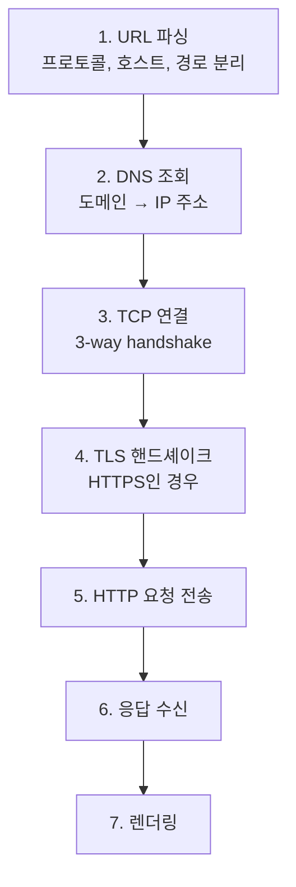
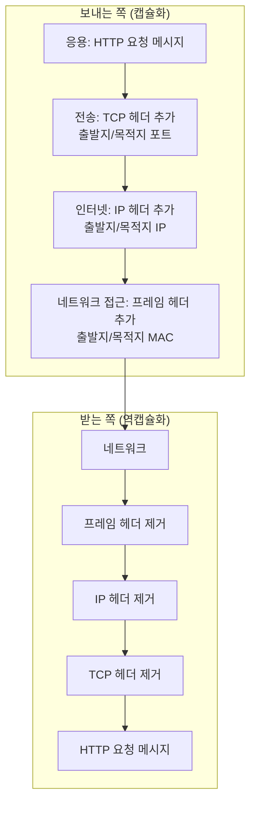
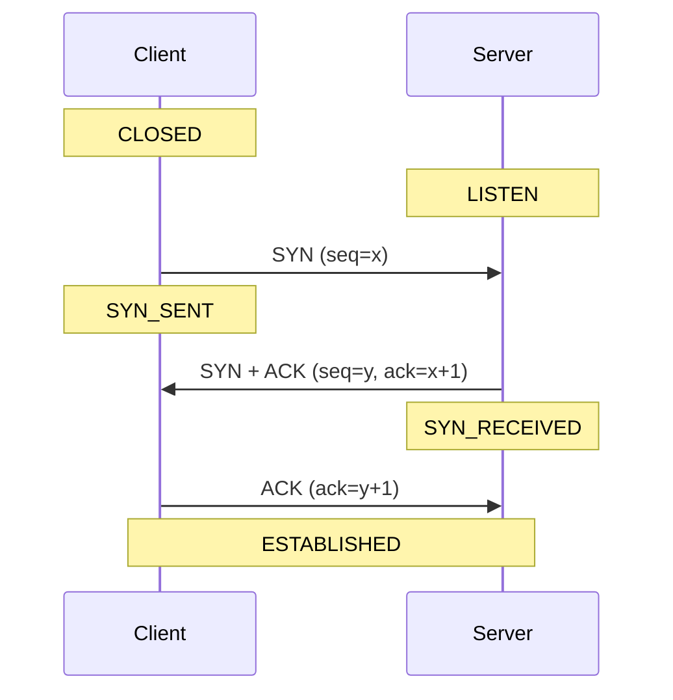
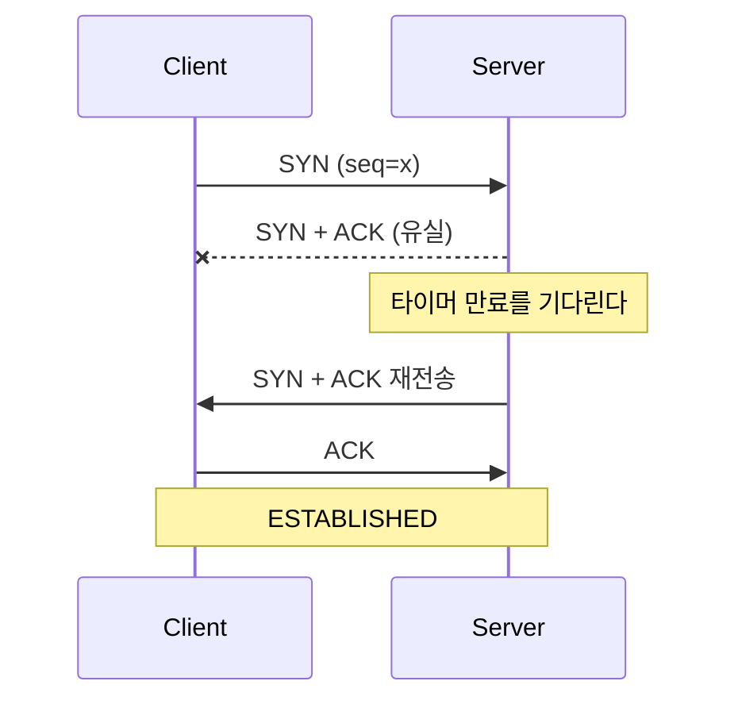
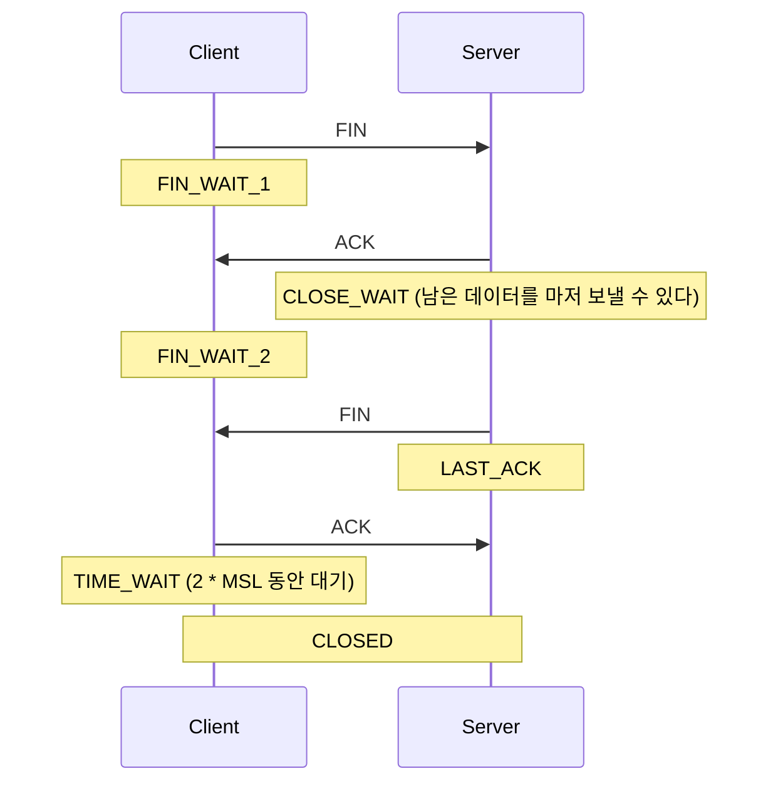

---

title: "네트워크 자문자답, 브라우저에 주소를 치면 무슨 일이 벌어지는가"
date: 2024-09-20
categories: [Network]
tags: [Network, TCP, UDP, OSI, Handshake, RUDP]
layout: post
toc: true
math: true
mermaid: true

---

## 참고자료

- [RFC 9293 - Transmission Control Protocol (TCP)](https://www.rfc-editor.org/rfc/rfc9293.html)
- [RFC 768 - User Datagram Protocol (UDP)](https://www.rfc-editor.org/rfc/rfc768.html)
- [RFC 1122 - Requirements for Internet Hosts](https://www.rfc-editor.org/rfc/rfc1122.html)
- [RFC 1035 - Domain Names, Implementation and Specification](https://www.rfc-editor.org/rfc/rfc1035.html)
- [MDN - HTTP 개요](https://developer.mozilla.org/ko/docs/Web/HTTP/Overview)

---

## 배경

면접에서 "브라우저에 주소를 치면 무슨 일이 일어나는가"를 묻는다는 말을 들었다. 답해보려니 **DNS로 IP를 찾고 요청을 보낸다** 정도에서 막혔다.

그 사이에 무엇이 있는지, TCP가 신뢰성을 보장한다는 말이 정확히 무엇을 보장한다는 뜻인지 설명하지 못했다.

스스로 묻고 답하는 방식으로 정리했다.

정리하면서 확인하고 싶었던 것들이다.

- 주소를 치고 화면이 나오기까지 어떤 단계를 지나는가?
- TCP가 보장한다는 신뢰성이 정확히 무엇인가?
- 연결은 세 번인데 해제는 왜 네 번인가?
- UDP를 쓰면서 신뢰성이 필요하면 어떻게 하는가?

---

## 1. 브라우저에 HTTP 입력하면 일어나는 일(OSI 7 Layer || TCP/IP 4 Layer)

두 모델을 나란히 놓으면 이렇게 대응된다.

| OSI 7계층 | TCP/IP 4계층 | 여기서 하는 일 | 대표 프로토콜 |
|---|---|---|---|
| 7. 응용 | 응용 | 사용자와 맞닿은 데이터 형식 | HTTP, DNS, FTP |
| 6. 표현 | 응용 | 인코딩, 압축, 암호화 | TLS, JPEG |
| 5. 세션 | 응용 | 연결의 시작과 끝 관리 | |
| 4. 전송 | 전송 | 포트로 프로세스 식별, 신뢰성 | TCP, UDP |
| 3. 네트워크 | 인터넷 | IP로 목적지까지 경로 결정 | IP, ICMP, ARP |
| 2. 데이터 링크 | 네트워크 접근 | 같은 네트워크 안에서 MAC 주소로 전달 | Ethernet |
| 1. 물리 | 네트워크 접근 | 전기 신호로 변환 | |

주소창에 URL을 넣고 나서 일어나는 일을 순서대로 보면 이렇다.

각 단계가 어느 계층에서 일어나는지도 함께 보면 이렇다.

**각 계층이 자기 헤더만 붙이고 위 계층의 내용은 그냥 데이터로 취급한다.** 그래서 계층을 독립적으로 교체할 수 있다. IPv4에서 IPv6로 바꿔도 HTTP는 그대로다.

---

## 2. TCP/UDP 특징

### TCP (Transfer Controller Protocol)

Server-Client구조에서 사용되는 연결 지향형 프로토콜로 HTTP 1, 2버전에 적용된 프로토콜이다. 연결/연결해제 시 사용되는 N-way Handshake 규약으로 신뢰성을 확보한다.

#### TCP가 신뢰성을 보장할 수 있는 이유

1. 데이터의 순서를 보장한다. 보낸 순서와 받는 순서가 일치하게 해준다. (패킷의 Sequence Number, Ack Number를 활용)
2. 데이터의 도착을 보장한다. 보낸 데이터가 반드시 도착한다는 것을 보장한다. (재전송)
3. 데이터의 무결성을 보장한다. 보낸 데이터와 받는 데이터가 일치 하다는 것을 보장한다. (CheckSum을 통한 오류검출)

---

#### 3-way handshake - 연결

1. 클라이언트가 SYN을 보낸다. 자기 시작 순번 `x`를 알린다
2. 서버가 SYN과 ACK를 함께 보낸다. 자기 시작 순번 `y`를 알리고 `x`를 받았음을 확인한다
3. 클라이언트가 ACK를 보낸다. `y`를 받았음을 확인한다

**왜 세 번인지가 핵심이다.** 양쪽 모두 "내가 보낸 것이 상대에게 닿았다"를 확인해야 하기 때문이다.

2번까지는 클라이언트만 확인이 끝난 상태다. 서버는 자기가 보낸 SYN이 도착했는지 모른다. 3번이 그것을 확인해준다.

**시작 순번을 주고받는 것도 중요하다.** 0부터 시작하지 않고 매번 다른 값에서 시작한다. 이전 연결의 지연된 패킷이 새 연결에 섞여 들어오는 것을 막기 위해서다.

---

#### 3-way handshake - 패킷을 잃어버렸을 때

**TCP에는 "못 받았다"고 알리는 신호가 없다.** NAK 같은 것은 정의되어 있지 않다.

대신 **보낸 쪽이 타이머를 걸고 기다린다.** 정해진 시간 안에 ACK가 안 오면 같은 것을 다시 보낸다.

**재전송 간격은 실패할 때마다 늘어난다.** 첫 재시도는 1초 뒤, 그다음은 2초, 4초 식이다. 상대가 응답을 못 하는 상황에서 연달아 때려봐야 상황만 나빠지기 때문이다.

이 재전송 대기 때문에 **연결이 안 되는 상황에서 응답이 늦게 온다.** 애플리케이션에서 연결 타임아웃을 짧게 잡아야 하는 이유가 여기 있다.

---

#### 4-way handshake - 연결 해제

1. 클라이언트가 FIN을 보낸다. "나는 더 보낼 것이 없다"는 뜻이다
2. 서버가 ACK로 답한다
3. 서버가 자기 할 일을 마친 뒤 FIN을 보낸다
4. 클라이언트가 ACK로 답한다

**연결은 왜 세 번인데 해제는 네 번인가.**

연결할 때는 서버의 SYN과 ACK를 한 패킷에 합칠 수 있다. 받자마자 둘 다 보내면 되기 때문이다.

**해제할 때는 합칠 수 없다.** 클라이언트가 FIN을 보낸 시점에 서버는 아직 보낼 데이터가 남아 있을 수 있다. 그래서 "받았다"는 ACK를 먼저 보내고, 남은 것을 다 보낸 뒤에 FIN을 따로 보낸다.

**`TIME_WAIT`이 왜 있는지도 짚어둔다.** 마지막 ACK를 보낸 쪽은 그것이 도착했는지 확인할 방법이 없다. 유실됐다면 상대가 FIN을 재전송할 텐데, 그때 응답할 수 있어야 한다.

그래서 **패킷이 네트워크에서 사라지기에 충분한 시간만큼 기다린다.** 운영체제에 따라 수십 초에서 몇 분이다.

이 상태가 운영에서 문제를 만든다. **연결을 자주 맺고 끊는 서버에서 `TIME_WAIT` 소켓이 쌓이면 포트가 고갈된다.** `netstat`에 `TIME_WAIT`이 수만 개 보이는 상황이 그것이다. 커넥션 풀을 쓰는 이유 중 하나가 이걸 피하려는 것이다.

---

### UDP

Server-Client구조에서 사용되는 전송 프로토콜이고 TCP와 같이 연결을 수립하고/해제하는 Handshake과정이 없기 때문에 속도는 빠르지만, 신뢰성을 보장할 수 없는 프로토콜이다.

HTTP 3버전부터는 UDP를 기반으로한 프로토콜을 사용하는데 어떻게 이 프로토콜로 변경한건지 알아보자.

---

### Reliable UDP

RUDP 또한 TCP가 신뢰성을 보장하는 방법을 최소화하여 구현한 프로토콜이다.

#### 순서를 보장하는 방법

패킷에 번호를 붙이고, 번호순서대로 패킷이 도착할때까지 기다렸다가 패킷이 모두 모이면 그때 패킷을 사용한다.

#### 도착을 보장하는 방법

패킷에 번호를 붙이고, 해당 번호의 패킷이 도착할때까지 재전송한다. 보내는 입장에서 재전송을 하는 이유는, UDP이기에 받는 입장에서는 자신에게 보내려는 패킷이 있었는지 알 방법이 없기 때문이다.

#### 무결성을 보장하는 방법

CheckSum을 통해서, 데이터가 손실되지 않았는지 검증한다.

---

### RUDP 구현 모델 - 패킷구성

전송하는 패킷에 RDUP 관련된 헤더를 추가해서 네트워크 패킷을 구성한다.

- 전송 타입
- 패킷의 고유넘버
- 에러 검출코드

### RUDP 구현 모델 - 전송 타입

RUDP에서 UDP의 특성을 보완하는 것은 `전송을 보장하는 것`과 `순서를 보정하는 것`이다. 이 특성을로 `3가지 타입의 패킷`을 나눌 수 있다.

- `전송을 보장하지 않는`타입 (도착하지 않더라도 상관없다는 UDP의 특징)
  - 이 타입은 수신 즉시 클라이언트에 넘겨주면 된다.
- `전송을 보장`하지만 `순서가 상관없는` 타입 (보내기만 하면 된다는 UDP의 특징)
  - 이 타입은 즉시 처리하되 수신했다는 패킷을 상대방에게 보낸다.
- `전송을 보장`하며, 보낸 `순서대로 받는` 타입 (TCP의 특징)
  - 이 타입은 받았다는 패킷을 상대방에게 전송은 하며, 순서가 맞으면 즉시 처리하고 그렇지 않는 패킷은 버퍼에 쌓아둔 후 순서가 맞으면 순서대로 패킷을 처리한다.

### RUDP 구현 모델 - 연결 검사

UDP의 경우 기본적으로 연결이 끊겼는지에 대한 이벤트가 없으므로 disconnect에 대한 패킷을 정의할 필요가 있다.

WSAECONNRESET 에러를 내는 경우에는 끊겼다고 판단할 수 있지만, 강제 종료된 경우(혹은 시스템이 강제 종료된 경우)에 한해서는 판단할 수가 없으므로 `주기적으로 연결 여부를 확인`하는 것이 좋다.

---

## 정리하며

처음 던진 질문들에 대한 답이다.

**주소를 치고 화면이 나오기까지.** 이름을 IP로 바꾸고(DNS), 그 IP까지 경로를 찾아가고(IP, 라우팅), 연결을 맺고(TCP 3-way handshake), 요청을 보내고(HTTP), 응답을 받아 그리는 순서다.

계층으로 나눠서 보면 각 단계가 어디에 속하는지가 정리된다. **위 계층은 아래 계층이 어떻게 하는지 몰라도 된다.** HTTP는 패킷이 어떤 경로로 가는지 신경 쓰지 않고, IP는 그 안에 무엇이 들었는지 보지 않는다.

**TCP가 보장하는 신뢰성.** 세 가지다.

**순서**를 보장한다. 각 세그먼트에 순번이 붙어 있어서, 도착 순서가 뒤바뀌어도 받는 쪽이 다시 맞춘다.

**도착**을 보장한다. 받은 쪽이 확인 응답을 보내고, 정해진 시간 안에 안 오면 보낸 쪽이 다시 보낸다.

**무결성**을 보장한다. 체크섬으로 손상을 검출한다.

여기서 짚어둘 것이 있다. **"반드시 도착한다"가 아니라 "도착하지 않으면 알 수 있다"에 가깝다.** 재전송을 여러 번 해도 안 되면 연결이 끊어지고, 그 사실이 애플리케이션에 전달된다.

**연결은 세 번인데 해제는 왜 네 번인가.** 연결할 때는 서버가 "받았다"와 "나도 연다"를 한 패킷에 합칠 수 있다. 해제할 때는 합칠 수 없다. 상대가 끝내자고 해도 **내가 아직 보낼 데이터가 남아 있을 수 있기 때문**이다. 그래서 확인만 먼저 보내고, 다 보낸 뒤에 끝내자는 신호를 따로 보낸다.

**UDP에서 신뢰성이 필요하면.** 애플리케이션이 직접 만든다. 순번을 붙여 순서를 맞추고, 확인 응답과 재전송으로 도착을 보장하고, 체크섬으로 무결성을 본다. **결국 TCP가 하던 일을 위 계층에서 다시 하는 것**이다.

그럼에도 이렇게 하는 이유는 **필요한 것만 고를 수 있기 때문**이다. 게임처럼 최신 상태가 중요한 경우, 늦게 도착한 데이터를 재전송받는 것보다 버리는 편이 낫다. TCP는 그 선택을 못 하게 한다.

HTTP/3가 UDP 위에 만들어진 것도 같은 맥락이다. TCP의 순서 보장이 오히려 걸림돌이 되는 상황이 있었고, 그것을 애플리케이션 계층에서 다시 설계한 것이다.

정리하고 나서 남은 감각은 **신뢰성이 공짜가 아니라는 것**이었다. TCP가 주는 보장은 왕복과 대기로 산 것이고, 그것이 필요 없는 상황에서는 비용만 남는다.
