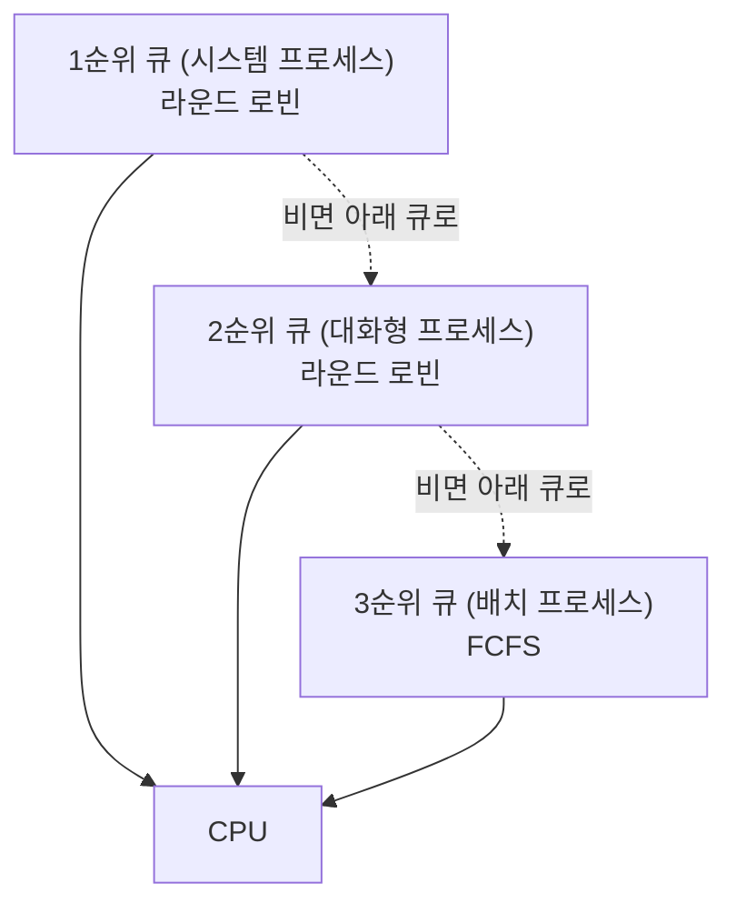
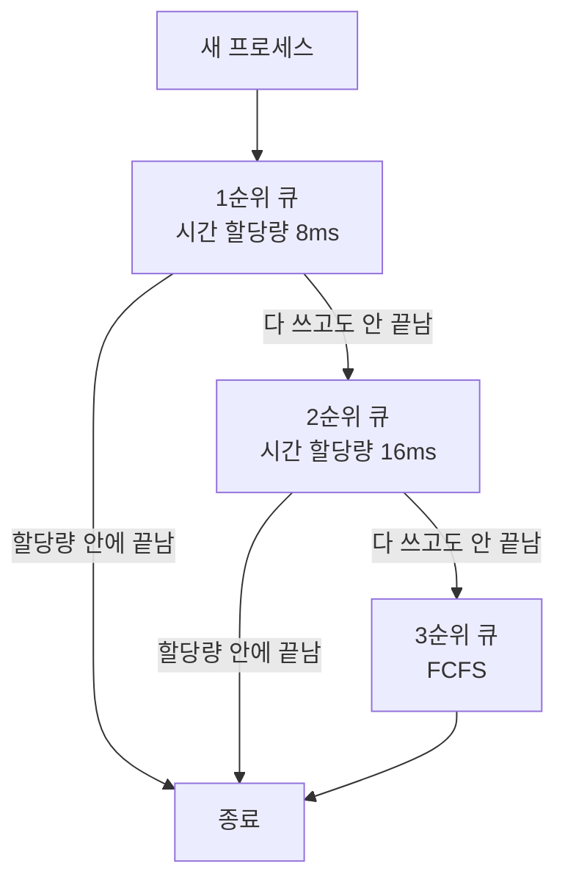

---

title: "운영체제 자문자답, 프로세스부터 CPU 스케줄링까지"
date: 2024-09-20
categories: [OperatingSystem]
tags: [OperatingSystem, Process, Thread, Scheduling, Blocking, CallByValue]
layout: post
toc: true
math: true
mermaid: true

---

## 참고자료

- [The Java Tutorials - Processes and Threads](https://docs.oracle.com/javase/tutorial/essential/concurrency/procthread.html)
- [JLS SE21, 8.4.1 Formal Parameters](https://docs.oracle.com/javase/specs/jls/se21/html/jls-8.html#jls-8.4.1)
- [Linux man - sched(7)](https://man7.org/linux/man-pages/man7/sched.7.html)
- [Linux man - select(2)](https://man7.org/linux/man-pages/man2/select.2.html)
- [Linux man - epoll(7)](https://man7.org/linux/man-pages/man7/epoll.7.html)

---

## 배경

프로세스와 스레드의 차이 같은 것은 외워서 답할 수 있었다. 그런데 **왜 그렇게 나뉘어 있는지**를 물으면 막혔다.

동기와 비동기, 블로킹과 논블로킹도 마찬가지였다. 네 가지 조합이 있다는 것은 아는데, 각 조합이 실제로 어떤 코드인지 그리지 못했다.

스스로 묻고 답하는 방식으로 정리했다.

정리하면서 확인하고 싶었던 것들이다.

- 프로세스와 스레드를 나눈 이유가 무엇인가? 무엇을 공유하고 무엇을 안 나누는가?
- 자바는 주소를 넘기는데 왜 값에 의한 호출이라고 하는가?
- 동기와 블로킹은 다른 축인가? 다르다면 무엇을 각각 말하는가?
- 스케줄링 기법이 여럿인데 무엇을 기준으로 갈리는가?

---

## 1. 프로세스와 쓰레드의 차이점

### 프로세스

프로세스는 디스크에 있는 프로그램이 실제 메모리에 할당되어 실행 중인 작업을 나타낸다.

운영체제는 프로세스가 생성되면 PCB를 통해 해당 프로세스의 정보를 관리하는데 PCB가 담고있는 정보는 아래와 같다.

- PID
- Process의 상태
- PC 레지스터
- 스택 포인터
- 등...

이 정보들이 필요한 이유는 여러 프로세스를 번갈아가면서 처리하는데, 이 때 각 프로세스에 대한 처리를 기록해야 정상적인 처리 운용이 가능하기 때문이다.

프로세스는 문맥교환이 일어날 때 현재 프로세스의 정보를 저장하고 다른 프로세스의 상태를 불러와야하므로 상대적으로 시간이 오래 소요된다.

또한 프로세스의 구조는 아래와 같다.

- Code : 컴파일된 소스 코드 저장
- Data: 전역 변수/초기화된 데이터 저장
- Stack: 임시 데이터(함수 호출, 로컬 변수 등)저장
- Heap: 코드에서 동적으로 생성되는 데이터 저장

### 쓰레드

쓰레드는 프로세스를 처리하기 위한 작업의 단위를 이야기한다. 따라서 프로세스에 여러 개의 쓰레드는 프로세스가 할당받은 자원을 모두 공유한다.

---

## 2. 멀티 프로세스와 멀티 스레드의 공통/차이점

### 공통점

- 하나의 프로그램에서 여러 작업을 동시에 수행할 수 있다.
- 운영체제의 스케줄링을 통해 작업을 관리한다.
- 작업 간의 통신이 필요하다.

### 차이점

- `프로세스`는 `메모리를 독립적`으로 사용하지만 / `쓰레드`는 `메모리를 공유`하여 사용한다.
  - 이로인해 `프로세스`는 `문맥 전환 비용이 크지만` / `쓰레드는 문맥 교환 비용이 작다`.
- `프로세스`는 스레드보다 `많은 메모리 공간`과 `CPU시간`을 차지한다.
- `프로세스`는 다른 프로세스에서 문제가 생겨도 `오류가 전파되지 않기 때문에` 안정성이 높지만 / 쓰레드는 공유된 영역을 사용하기 때문에 다른 쓰레드에 `문제가 발생`하면 `전파`될 가능성이 커 안정성이 비교적 낮다.

---

## 3. 언제 멀티 프로세스, 멀티 스레드를 사용하면 될까? (멀티 프로세스 예시가 적절한게 안떠오름)

### 멀티 프로세스 사례

#### 우리가 사용하는 컴퓨팅 환경

인텔리제이를 키고, 데이터그립을 키고, 웹 브라우저를 키고 여러 애플리케이션을 자유롭게 사용한다.

### 멀티 쓰레드 사례

#### 웹 브라우저

하나의 브라우저에 `A,B 탭`이 있을 때 `A탭이 사용 불능` 되어도 `B탭은 사용`할 수 있다.

#### 게임

하나의 게임 애플리케이션에서 `그래픽 렌더링`, `물리 엔진 컴퓨팅` 등 다양한 작업을 동시에 처리한다.

---

## 4. 프로세스 메모리 영역

- Code : 컴파일된 소스 코드 저장
- Data: 전역 변수/초기화된 데이터 저장
- Stack: 임시 데이터(함수 호출, 로컬 변수 등)저장
- Heap: 코드에서 동적으로 생성되는 데이터 저장

---

## 5. Call By Value(자체 값의 복사), Reference(값의 주소 참조)

[참고 블로그](https://inpa.tistory.com/entry/JAVA-☕-자바는-Call-by-reference-개념이-없다-❓)

### Primitive Type

원시타입의 파라미터는 Value로 사용된다. Primitive Type의 값은 메모리 상에 직접 저장되기 때문에, 파라미터로 전달된 값을 변경하면 원본 값도 변경된다.

#### 원시 타입 도식화

```text
       +-----------------------------------+
       |          Stack Memory             |
       |                                   |
       |  +--------------+                 |
       |  |    Variable  |                 |
       |  |  (Primitive Type)              |
       |  +--------------+                 |
       |                                   |
       +-----------------------------------+
```

위 그림과 같이 기본 타입을 직접 가지고 있게 된다.

### Reference Type

참조타입(객체, 배열 등)의 파라미터는 Reference를 가지고 있다. Reference Type의 값은 메모리 상에 객체로 저장되기 때문에, 파라미터로 전달된 Reference를 변경하면 원본 객체의 참조가 변경된다.

파라미터가 `Reference Type`인 경우 `해당 참조`가 `힙 메모리에 있는 객체`를 가리키고 이 `객체는 힙 메모리`에 저장된다.

`객체의 데이터와 메서드는 힙 메모리에 저장되며`, `참조는 스택 메모리에 저장된다`.

따라서 파라미터가 `Reference Type`인 경우 `실제 객체는 힙 메모리`에 저장되고, `스택 메모리의 참조가 해당 객체`를 가리키게 된다.

#### 참조 타입 도식화

```text
 +-----------------------------------+
       |          Stack Memory             |
       |                                   |
       |  +--------------+                 |
       |  |   Reference  |                 |
       |  |    Variable  |                 |
       |  +--------------+                 |
       |       (참조 변수)                   |
       |                                   |
       +--------------|-------------------+
                      |
                      |
                      v
       +--------------|-------------------+
       |          Heap Memory              |
       |                                   |
       |  +--------------+                 |
       |  |    Object    |                 |
       |  |   (데이터 및 메서드) |             |
       |  +--------------+                 |
       |        (객체)                      |
       |                                   |
       +-----------------------------------+
```

### 예시 코드

```java
public class main {
    static void main(String[] args) {

        int primitiveVariable = 1;
        int[] referenceVariable = {1};

        // 변수 자체를 보냄 (call by value)
        increasePrimitiveValue(primitiveVariable);

        // 1 : 값 변화가 없음
        System.out.println(var);

        // ------------------------------------ //

        // 배열 자체를 보냄 (간접적 call by reference)
        increaseReferenceValue(referenceVariable);

        // 101 : 값이 변화함
        System.out.println(arr[0]);
    }

    private static void increasePrimitiveValue(int primitiveVariable) {
        primitiveVariable += 100;
    }

    private static void increaseReferenceValue(int[] referenceVariable) {
        referenceVariable[0] += 100;
    }
}
```

### 예시 코드 메모리 도식화

#### increasePrimitiveValue()

```text
[함수 실행 전]

  main 스택 프레임
  ┌──────────────────┐
  │ primitiveValue=1 │
  └──────────────────┘

[increasePrimitiveValue(primitiveValue) 호출]

  main 스택 프레임              increasePrimitiveValue 스택 프레임
  ┌──────────────────┐          ┌──────────────────────────┐
  │ primitiveValue=1 │  ──값 복사──▶│ primitiveVariable=1      │
  └──────────────────┘          └──────────────────────────┘

[함수 안에서 += 100 수행]

  main 스택 프레임              increasePrimitiveValue 스택 프레임
  ┌──────────────────┐          ┌──────────────────────────┐
  │ primitiveValue=1 │          │ primitiveVariable=101    │
  └──────────────────┘          └──────────────────────────┘
        그대로                        여기만 바뀐다

[함수 반환 후]

  main 스택 프레임
  ┌──────────────────┐
  │ primitiveValue=1 │   ← 변하지 않았다
  └──────────────────┘
```

#### increaseReferenceValue

```text
[함수 실행 전]

  main 스택 프레임                  힙
  ┌───────────────────────┐      ┌──────────────┐
  │ referenceValue = 0x100│ ────▶│ int[] { 1 }  │  주소 0x100
  └───────────────────────┘      └──────────────┘

[increaseReferenceValue(referenceValue) 호출]

  main 스택 프레임                  힙
  ┌───────────────────────┐      ┌──────────────┐
  │ referenceValue = 0x100│ ────▶│ int[] { 1 }  │  주소 0x100
  └───────────────────────┘      └──────────────┘
                                       ▲
  increaseReferenceValue 프레임         │
  ┌────────────────────────────┐       │
  │ referenceVariable = 0x100  │ ──────┘
  └────────────────────────────┘
        주소값이 복사됐다

[함수 안에서 referenceVariable[0] += 100 수행]

  main 스택 프레임                  힙
  ┌───────────────────────┐      ┌───────────────┐
  │ referenceValue = 0x100│ ────▶│ int[] { 101 } │  ← 힙의 내용이 바뀌었다
  └───────────────────────┘      └───────────────┘

[함수 반환 후]

  main에서 referenceValue[0]을 읽으면 101이 나온다.
  같은 힙 객체를 가리키고 있었기 때문이다.
```

**주소값 자체는 복사됐다는 점**이 요점이다. 함수 안에서 `referenceVariable = new int[]{999}`처럼 **변수에 다른 주소를 대입해도** 호출한 쪽의 `referenceValue`는 바뀌지 않는다. 바뀐 것은 복사된 지역 변수뿐이다.

바뀌는 것은 **그 주소가 가리키는 힙 객체의 내용**을 고쳤을 때뿐이다.

#### 결론

각 메서드는 고유한 스택 프레임을 가지기 때문에 참조값을 파라미터로 넘기는 것이 아니면 파라미터 값을 수정해도 다른 메서드에 아무런 영향이 없다.

그리고 이 방식을 Call By Value라고 한다.

### 주소값을 넘기는데 왜 Call by Value라고 하는걸까?

C언어에서는 Call by Reference방식을 사용하는데 그 대표적인 예시가 `*`포인터와, `&`주소 연산이다.

사용자가 직접 주소값에 접근하고 다룰 수 있게 하는 C언어와 달리, 간접적으로 타입에 의존하여 주소값을 넘기는 Java는 Call By Reference라고 하질 않는 것이다.

### 그러면 왜 Java는 Call By Value를 채택했는가?

주소값을 사용자가 직접 다루게 된다면 예기치 못한 코드에서 메모리에 접근하여 값을 변경하고 이를 사용하는 입장에서는 원치 않은 결과를 받을 수 있다.

Call By Value는 `파라미터`로 전달되는 값이 실제 값이 아닌 `복사된 값`이 전달되는 것으로 `오버헤드`가 발생하는 `단점`이 있지만 `코드의 안정성`을 확보할 수 있는 `장점`이 있다.

이러한 이유로 Java는 Call By Value를 사용한다.

---

## 6. Sync-Async, Blocking - Non-Blocking

- 예를들어, IO(입출력)를 처리할 때 Sync와 Async의 차이는 요청한 순서가 지켜지는가 아닌가에 있고

- Blocking과 Non-blocking은 그 요청에 대해 받은 쪽에서 처리가 끝나기 전에 리턴해주는가 아닌가에 있다.

### Blocking

A 함수가 B 함수를 호출 할 때, B 함수가 자신의 작업이 종료되기 전까지 A 함수에게 제어권을 돌려주지 않는 것

### Non-blocking

A 함수가 B 함수를 호출 할 때, B 함수가 제어권을 바로 A 함수에게 넘겨주면서, A 함수가 다른 일을 할 수 있도록 하는 것.

### Sync

A 함수가 B 함수를 호출 할 때, B 함수의 결과를 A 함수가 처리하는 것.

### Async

A 함수가 B 함수를 호출 할 때, B 함수의 결과를 B 함수가 처리하는 것. (callback)

---

### Sync-Blocking

```java
public class SyncNonBlocking {

    static void main(String[] args) throws InterruptedException {
        // waitOneSecond 함수 호출 후 바로 다음 코드가 실행된다.
        System.out.println("Sync-nonBlocking 시작");
        waitOneSecond();
        System.out.println("Sync-nonBlocking 종료");
    }

    private static void waitOneSecond() throws InterruptedException {
        Thread.sleep(1000);
    }
}
```

### Sync-NonBlocking

```java
public class SyncNonBlocking {

    static void main(String[] args) throws InterruptedException {
        // waitOneSecond 함수 호출 후 바로 다음 코드가 실행된다.
        System.out.println("Sync-nonBlocking 시작");
        waitOneSecond();
        System.out.println("Sync-nonBlocking 종료");
    }

    private static void waitOneSecond() throws InterruptedException {
        Thread.sleep(1000);
    }
}
```

### Async-Blocking

```java
public class AsyncBlocking {

    static void main(String[] args) throws InterruptedException {
        // 1초 동안 대기하는 함수
        private static void waitOneSecond() throws InterruptedException {
            Thread.sleep(1000);
        }

        // Async-Blocking 코드
        // 함수 호출 후 다음 코드가 실행되기 전까지 대기한다.
        // 함수의 결과는 나중에 콜백 함수에서 처리한다.
        System.out.println("Async-Blocking 시작");
        ExecutorService executorService = Executors.newSingleThreadExecutor();
        CompletionStage<Void> future = executorService.submit(() -> {
            try {
                waitOneSecond();
            } catch (InterruptedException e) {
                e.printStackTrace();
            }
            return null;
        });
        future.get();
        System.out.println("Async-Blocking 종료");
        executorService.shutdown();
    }
}

```

### Async-NonBlocking

```java
public class AsyncNonBlocking {

    static void main(String[] args) throws InterruptedException {
        // 1초 동안 대기하는 함수
        private static void waitOneSecond() throws InterruptedException {
            Thread.sleep(1000);
        }

        // Async-nonBlocking 코드
        // 함수 호출 후 바로 다음 코드가 실행된다.
        // 함수의 결과는 나중에 콜백 함수에서 처리한다.
        System.out.println("Async-nonBlocking 시작");
        ExecutorService executorService = Executors.newSingleThreadExecutor();
        executorService.submit(() -> {
            try {
                waitOneSecond();
            } catch (InterruptedException e) {
                e.printStackTrace();
            }
        });
        System.out.println("Async-nonBlocking 종료");
        executorService.shutdown();
    }
}
```

---

## 7. CPU 스케쥴링 기법

### 선점형 알고리즘

다른 프로세스에 CPU의 처리 순서를 `양보`한다. 이 과정에서 문맥 교환이 발생하기 때문에 처리 비용이 증가하게 된다.

#### Round Robin

각 프로세스마다 동일한 시간을 할당하여 처리하도록 한다. 실제 애플리케이션 로드밸런서에도 자주 사용되는 알고리즘이다. 공평하게 자원을 분배할 수 있는 `장점`이 있지만 근소한 차이로 작업을 처리하지 못했을 경우 해당 프로세스의 처리가 지연된다는 `단점`이 존재한다.

#### SRT (Shortest Remaining Time)

프로세스의 처리 시간이 가장 짧다고 계산된 순으로 처리하도록한다. `처리량`이 높아질 수 있다는 `장점`이 있지만 `우선적으로 처리해야할 프로세스에 대해 지연`될 수 있다는 `단점`이 있다.

작업 1, 작업 2, 작업 3이 순서대로 들어오는 환경에서

- 작업 1의 작업 시간 : 10초
- 작업 2의 작업 시간 : 5초
- 작업 3의 작업 시간 : 3초

`작업 1`을 먼저 처리하는 중 `5초 후 작업 2`를 처리하도록 문맥 교환하고, `작업 2 처리를 시작한 3초 후` `작업 3`을 처리하는 흐름이다.

#### 다단계 큐



작업 큐를 여러 개 두고 **큐마다 다른 스케줄링 기법을 적용한다.**

큐는 수직으로 배치되고 위쪽 큐가 먼저 선점한다. **위쪽 큐가 비어야 아래쪽 큐로 내려간다.**

여기서 문제가 하나 생긴다. **위쪽 큐에 작업이 계속 들어오면 아래쪽 큐는 영원히 실행되지 않는다.** 이걸 기아(starvation)라고 부른다.

#### 다단계 피드백 큐



앞의 다단계 큐와 다른 점은 **프로세스가 큐 사이를 옮겨 다닌다**는 것이다.

새 프로세스는 가장 높은 우선순위로 시작한다. **주어진 시간 안에 못 끝내면 한 단계 아래로 내려간다.** 마지막 단계는 FCFS다.

**이 구조가 두 가지를 동시에 해결한다.**

짧은 작업은 위쪽 큐에서 금방 끝난다. 응답이 빨라야 하는 대화형 작업이 여기 해당한다.

오래 도는 작업은 점점 아래로 내려가지만, **아래쪽 큐에서는 시간 할당량이 길어져서** 문맥 교환 횟수가 줄어든다.

**작업의 성격을 미리 알 필요가 없다는 것이 핵심이다.** 짧은 작업 우선(SJF)은 실행 시간을 미리 알아야 하는데, 그건 현실에서 알 수 없다. 다단계 피드백 큐는 **실제로 얼마나 오래 도는지를 보고 사후에 분류한다.**

기아 문제는 남는다. 그래서 **일정 시간이 지난 프로세스를 위쪽 큐로 올려주는 방식(aging)** 을 함께 쓴다.

---

### 비선점형 알고리즘

다른 프로세스에 CPU의 처리 순서를 `양보하지 않는다.`

#### FCFS 스케줄링  (First Come First Served Scheduling)

먼저 들어온 작업 순으로 처리된다. 우선순위가 높은 작업을 빠르게 처리하지 못할 수 있다.

#### SJF 스케줄링(Shortest Job First Scheduling)

가장 작업 시간이 짧은 순으로 처리된다. 수행시간이 긴 작업은 기아현상에 취약하다.

#### HRRN 스케줄링(Highest Response Ratio Next Scheduling)

프로세스 처리의 우선 순위를

- CPU 처리 기간과
- 해당 프로세스의 대기 시간

을 동시에 고려해 선정하는 스케줄링 알고리즘이다. SJF 스케줄링의 문제점인 수행 시간이 긴 프로세스의 무한 대기 현상(기아 현상)을 보완해 개발된 스케줄링이다.

---

## 정리하며

처음 던진 질문들에 대한 답이다.

**프로세스와 스레드를 나눈 이유.** 격리와 공유를 맞바꾼 결과다.

프로세스는 각자 메모리 공간을 갖는다. **하나가 잘못돼도 다른 쪽에 영향이 없다.** 대신 서로 데이터를 주고받으려면 별도의 통신 수단이 필요하고 그 비용이 크다.

스레드는 같은 프로세스 안에서 코드, 데이터, 힙을 공유하고 스택만 따로 갖는다. **주고받을 것이 없으니 빠르다.** 대신 하나가 잘못되면 프로세스 전체가 죽고, 공유하는 것을 동시에 건드리면 결과가 깨진다.

**스택만 안 나누는 이유**가 여기서 보인다. 스택에는 그 스레드가 지금 어디를 실행 중인지와 지역 변수가 들어 있다. 이건 스레드마다 달라야 하므로 공유할 수 없다.

**자바가 왜 값에 의한 호출인가.** 넘기는 것이 주소값이라도, **그 주소값 자체를 복사해서 넘기기 때문**이다.

그래서 두 가지가 갈린다. 넘겨받은 참조로 **객체 내부를 바꾸면** 원본에 반영된다. 같은 객체를 가리키고 있기 때문이다. 반면 넘겨받은 변수에 **다른 객체를 대입하면** 원본은 그대로다. 복사본이 가리키는 곳만 바뀐 것이다.

참조에 의한 호출이라면 뒤쪽도 반영돼야 한다. 자바에는 그 방법이 없다.

**동기와 블로킹이 다른 축인가.** 다르다.

**블로킹은 제어권 이야기다.** 호출한 함수가 일이 끝날 때까지 돌아오지 않으면 블로킹, 바로 돌아오면 논블로킹이다.

**동기는 결과 이야기다.** 결과를 언제 확인하는 책임이 호출한 쪽에 있으면 동기, 완료되면 알려주는 방식이면 비동기다.

그래서 네 조합이 다 성립한다. **논블로킹 동기**가 가장 헷갈리는데, 호출은 바로 돌아오지만 호출한 쪽이 계속 물어보는 형태다. 그 사이 다른 일을 못 하면 결국 기다리는 것과 비슷해진다.

**스케줄링 기법의 갈림.** 두 가지 축이다.

**실행 중인 것을 뺏을 수 있는가.** 뺏을 수 있으면 선점형이다. 응답이 빨라지는 대신 문맥 교환이 잦아진다.

**무엇을 기준으로 다음을 고르는가.** 도착 순서, 남은 실행 시간, 대기 시간과 실행 시간의 비율 같은 것들이다.

**짧은 작업 우선(SJF)이 평균 대기 시간에서 가장 좋다는 것은 증명돼 있지만 쓸 수 없다.** 실행 시간을 미리 알아야 하는데 현실에서는 모른다. 다단계 피드백 큐가 널리 쓰이는 이유가 여기 있다. **미리 아는 대신 실제로 얼마나 오래 도는지를 보고 사후에 분류한다.**

정리하고 나서 남은 감각은 **운영체제의 결정 대부분이 맞바꿈**이라는 것이었다. 격리와 공유, 응답성과 처리량, 공정성과 효율이 각각 반대 방향이고, 어느 쪽을 택했는지가 그 기법의 성격이 됐다.
