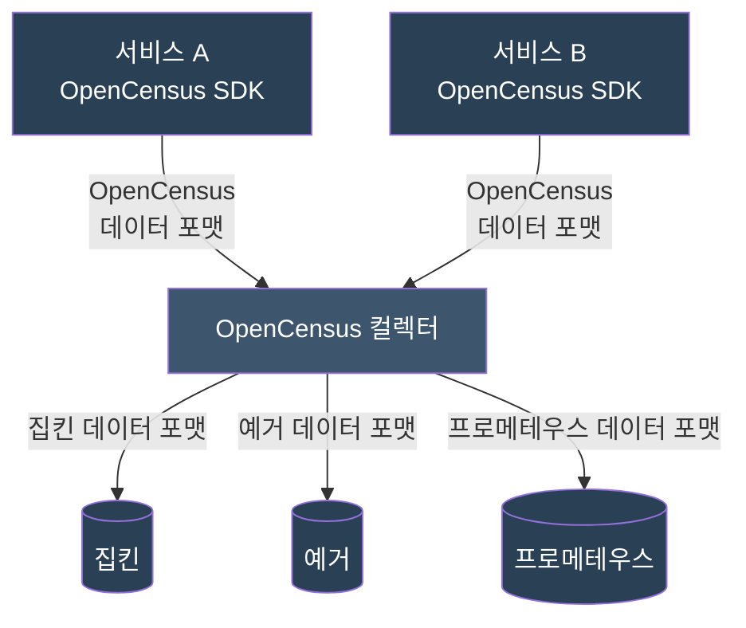
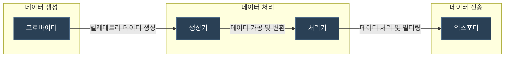
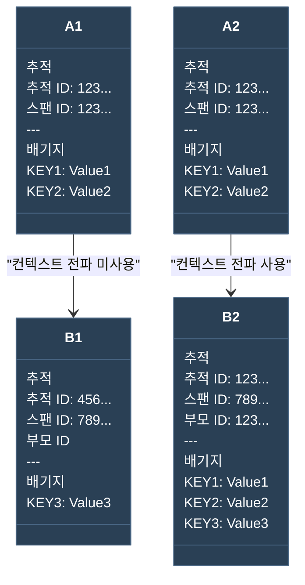

---

title: 관찰 가능성 엔지니어링 - Chapter1 (관찰 가능성의 역사와 개념)
date: 2025-01-19
categories: [Opentelementry]
tags: [Opentelementry]
layout: post
toc: true
math: true
mermaid: true

---

## 개요

관찰 가능성이라는 용어에는 Trace, Metric, Log를 구성하는 도구의 `원격측정(telemtry)` 데이터를 생성/수집함으로써 소프트웨어 작동의 가시성을 높이는 작업이 포함된다.

* 수신된 요청 수의 카운트 유지하기
* 이벤트 발생 시 로그 추가하기
* 서버의 현재 메모리 사용량 기록하기
* Client → Backend 서비스까지의 요청 추적하기

이런 원격 측정 환경을 구성해서 우리가 답해야하는 항목들의 예시는 아래와 같다.

* 운영환경에서 문제가 발생하면 이를 식별하기 위한 증거는 무엇이있는가?
* 멀쩡했던 서비스에 과부하가 걸리는 이유는 무엇인가?
* 클라이언트의 어떤 동작으로 내부 서비스의 비정상적인 동작을 유발할 때 사용자/지원팀의 컨택없이 알아차릴 수 있는가?

최근 MSA환경을 구축하여 수평적인 확장으로 비용을 감축시키려는 움직임이 보이는 추세이다. MSA가 비용에서는 더 좋은 면이 있을 수 있으나 실버불릿은 아니다. 다음과 같은 항목을 항상 고려해야한다.

* 이전에 없었던 Latency가 발생할 수 있고, 애플리케이션이 예기치 못한 방식으로 실패할 수 있다.
* 서비스간 의존성으로인해 오류가 발생할 수 있어 각 애플리케이션은 저마다의 연쇄적인 오류를 방어할 수 있어야한다.
* 서비스 전반에 사용되는 Secret 값의 관리가 어렵다.
* 서비스 오케스트레이션 방식이 어렵다.

MSA로 인해 팀을 구성하는 방식도 변화했다. 각 마이크로서비스를 단위로 팀으로 분배하여 각 팀마다 개발/운영/테스트 등을 수행하게된다. 이로인해 각 팀마다의 기술적 요구사항도 늘어나게 됐다.

### 중앙 집중식 로깅

각 애플리케이션 마다 로깅 구문을 심고, 이를 중앙 저장소에 로그를 쌓는 방식이다.

* Fluentd
* LogStash
* Apache Flume

### 메트릭과 대시보드

메트릭은 컴퓨팅 리소스가 어떻게 활용되고 있는지 알 수 있는 지표이다.

그리고 오류 비율이 임계치를 넘어가면 관리자에게 경고를 보낼 수 있는 시나리오도 이런 메트릭 지표를 통해 만들어진다.

* Prometheus
* Graphite
* StatsD
* Grafana

### 추적과 분석

네트워크를 통해 다수의 서비스가 서로 다른 서버에서 동작하는 흐름을 디버깅하기 위해서 이 지표가 사용된다.

구글연구원들이 내부적으로 사용하기 위해 만든 Dapper를 시작으로 다음과 같은 오픈소스들도 만들어졌다.

* OpenTracing
* OpenCensus
* Zipkin
* Jaeger

### Opentelemtry의 과거

OpenTracing, OpenCensus라는 두 프로젝트의 병합으로 탄생했다.

OpenTracing은 분산 추적을 도입할 때 API 규격을 제공하여 실제 분산 측정을 수행하는 구현체와 독릭접으로 활용 될 수 있어 애플리케이션 개발자가 API 호출 코드를 내장할 수 있게됐다.



OpenCencus는 구글 내부에서 시작된 프로젝트였고 메트릭 생산/수집할 수 있는 라이브러리를 제공했다.

독립적인 에이전트로써 동작하고 애플리케이션의 원격 측정 대상 역할을하고, OpenCensus 컬렉터를 제공하여 백엔드 스토리지로 데이터를 전송/분석할 수 있게 됐다.

OpenCensus는 자체적으로 제공하는 SDK와 관련된 강한 의존성을 갖게 했다.

이로 인해서 제공하는 내용을 사용하기만해도 되어 간편하게 이용할 수 있었으나 서드파티 라이브러리를 만들고 있는 개발자들에게는 의존성이 강하기 때문에 활용도가 낮아지게됐다.

사용자들은 Trace, Metric을 수집하기 위해 OpenCensus를 사용해야했지만 OpenTracing만 지원하는 라이브러리가 필요할 경우 분산 추적에는 OpenTracing, 메트릭은 OpenCensus를 사용하는 등 표준화가 이루어지지 않았다. 그리고 이 문제를 해결하기 위해 Opentelemetry가 등장했다.

## OpenTelemtry의 개념

OpenTelemtry의 주요 개념은 다음과 같다.

* 시그널
* 파이프라인
* 리소스
* 컨텍스트 전파

### 시그널

여러 종류의 Telemtry 데이터를 담기위한 규격을 만들기 위해 어떤 데이터 종류들을 담을건지부터 정리해야했다.

이것을 시그널이라고 한다. 아래에 해당하는 종류가 이에 해당할 수 있다.

* Trace
* Metric
* Log
* Baggage

그리고 아래 세부적인 컴포넌트들로 이 시그널을 정의한다.

* 규격 (Specification)
    * 데이터 모델 (정의)
    * API (인터페이스)
    * SDK (구현)
    * 시맨틱 표기법 (표준화)

**규격 (Specification)**

OpenTelemetry의 설계도와 같은 문서로 모든 구현체가 따라야 하는 표준을 정의한다. 서로 다른 구현체 간의 호환성 보장하기 위함이다.

* 데이터 구조
* 동작 방식
* API 정의
* 프로토콜
* 확장 방법

**데이터 모델 (Data Model)**

관찰성 데이터의 구조를 정의한다. 위에서 언급한 규격의 세부적인 레벨의 규격이라고 보면 될 것 같다.

* Traces
    * TraceId
    * SpanId
    * TraceState
    * SpanContext
* Metrics
    * Name
    * Description
    * Unit
    * DataPoints
* Logs
    * Timestamp
    * Severity
    * Body
    * Attributes

**API**

구현에 독립적인 추상화 계층으로 계측을 위한 인터페이스를 정의한다.

```java
// Tracer API
public interface Tracer {
  SpanBuilder spanBuilder(String name);
  Span getCurrentSpan();
}

// Meter API
public interface Meter {
  LongCounter counterBuilder(String name);
  DoubleGauge gaugeBuilder(String name);
}
```

**SDK**

API의 실제 구현체이다.

```java
// 샘플러 구현
public class CustomSampler implements Sampler {
  SamplingResult shouldSample(...);
}

// 프로세서 구현
public class CustomSpanProcessor implements SpanProcessor {
  void onStart(SpanData span);
  void onEnd(SpanData span);
}
```

**시맨틱 표기법 (Semantic Conventions)**

* 표준화된 이름과 속성을 정의한다.
* 서비스 관련
    * service.name
    * service.version
    * service.instance.id
* HTTP 요청 관련
    * http.method
    * http.url
    * http.status_code
* 데이터베이스 관련
    * db.system
    * db.name
    * db.statement

### 파이프라인

Telemtry의 파이프라인은 아래와 같은 흐름이다.



각 컴포넌트는 데이터가 누락되지 않도록 애플리케이션 코드 초반부에서 초기화하는 것이 일반적이다.

각 컴포넌트의 역할은 아래와 같다.

**프로바이더 - 텔레메트리 데이터의 소스**

원격 측정 데이터 생성 시 사용하는 엔티티에 애플리케이션이 접근할 수 있도록 한다.

SDK가 제공하는 기본 전역 프로바이더를 사용하거나 여러 프로바이더를 지정할 수도 있다.

**생성기 - 원시 데이터를 OpenTelemetry 형식으로 변환**

SDK가 제공하는 생성기를 사용할 수 있으며 생성기가 계측하는 시그널에 따라 다른 이름을 갖는다.

생성기를 만들면 이를 사용하는 애플리케이션, 라이브러리는 프로바이더에 생성기의 이름을 전달해야한다.

그리고 생성기의 버전 식별자도 전달하는 것으로 원격측정 데이터의 메타데이터로 활용할 수 있다.

Trace → 추적기
Metric → 미터

**처리기 - 데이터 가공 및 필터링**

처리기를 통해 데이터의 컨텐츠를 추가적으로 수정할 수 있다. 주로 어떤 빈도로 처리되어야하는지, 어떻게 추출되어야하는 지 등 가공단계를 수행한다.

**익스포터 - 처리된 데이터를 외부 시스템으로 전송**

애플리케이션 컨텍스트를 빠져나가기 직전에, Opentelemetry의 내부 데이터 모델을 익스포터에 맞게 변환하는 역할을한다.

* OpenTelemetry 프로토콜
* 콘솔
* 예거
* 집킨
* 프로메테우스
* OpenCensus

위 형식들에 맞게 변환하고 추출을 수행한다.

### 리소스

서로 다른 시그널에 적용된 일련의 속성이다. 원격 측정 데이터의 출처가 서버인지, 컨테이너인지, 함수인지 등을 식별할 때 사용된다.

* service.name: 서비스명
* service.version: 서비스의 버전 식별자
* host.name: 서비스가 작동하고 있는 호스트명

### 컨텍스트 전파

핵심 컴포넌트로 분산되어있는 서비스 사이에 중요한 컨텍스트 정보를 전달할 수 있는 기능을 제공한다.

Trace 뿐만 아니라 Baggage로 알려진 사용자 정의 값도 전파될 수 있도록 한다. (Baggage는 여러 시그널에 대한 Telemetry주석을 붙일 때 사용한다.)

이 컨텍스트 전파는 아래와 같이 사용될 수 있다.



위와 같이 컨텍스트 전파를 활용하여 이전 서비스로부터 요청에 대한 메타데이터를 받아낼 수 있다.
