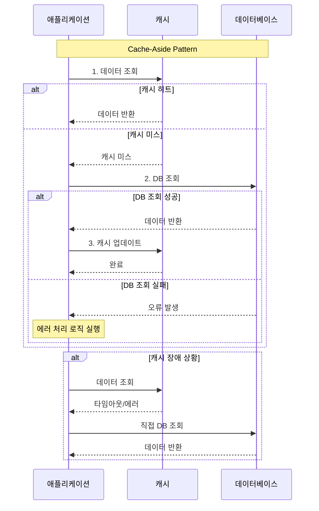
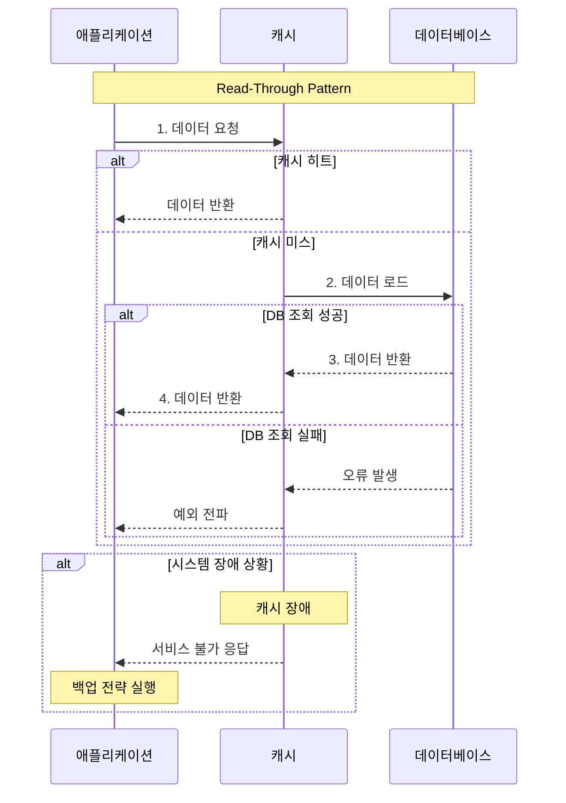
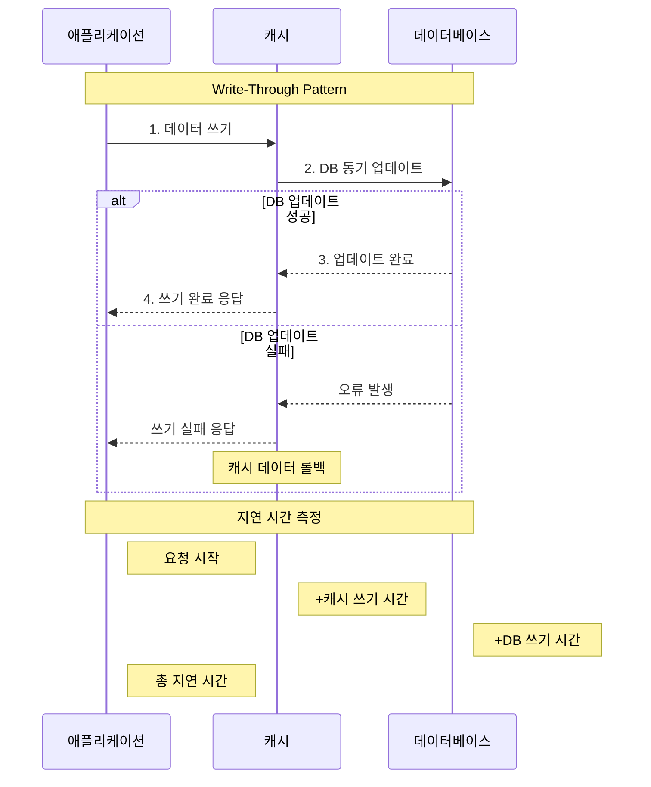
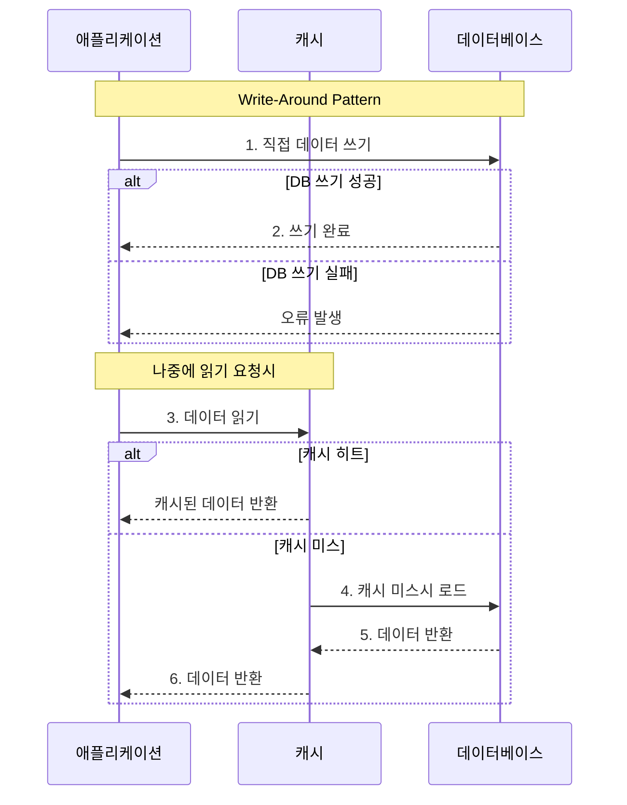
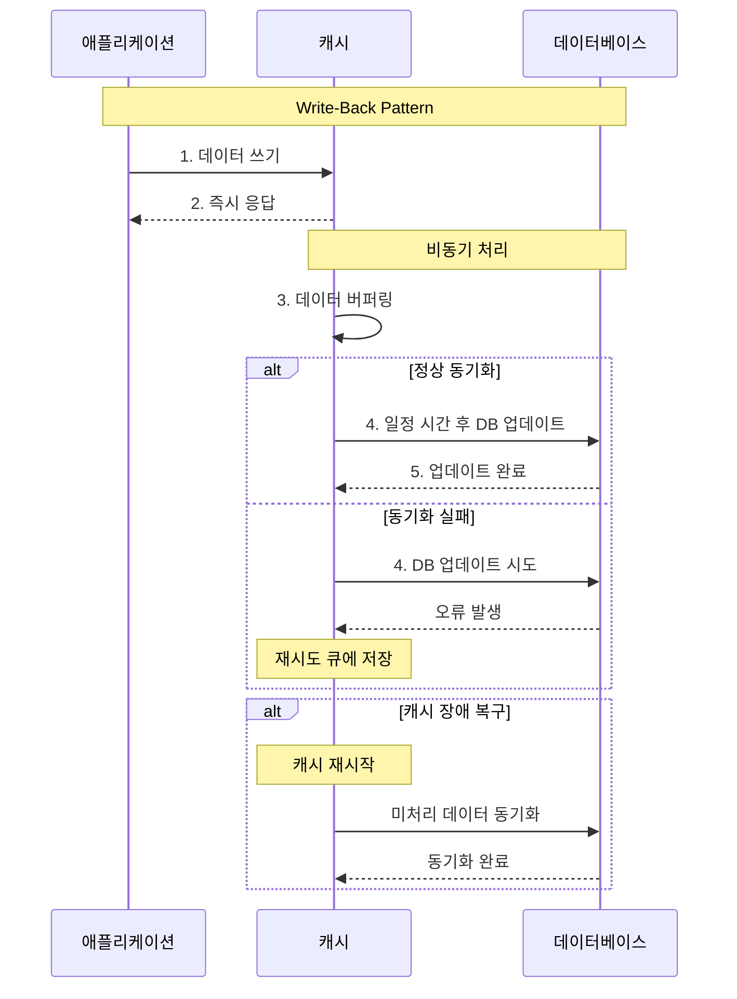

---

title: 가상 면접 사례로 배우는 대규모 시스템 설계 기초 - 사용자 수에 따른 규모 확장성
date: 2025-01-19
categories: [ScaleUp, ScaleOut, LB, Cache, CDN, Stateless]
tags: [ScaleUp, ScaleOut, LB, Cache, CDN, Stateless]
layout: post
toc: true
math: true
mermaid: true

---

# 단일 서버

가장 단순하게 사용자의 요청을 처리할 수 있는 구조이다.

- 사용자: 웹 브라우저, 모바앨 앱
- 서버: 웹 서버

위 상황에서 요청 흐름은 다음과 같다.

1. 사용자는 DNS에 질의하여 서버의 IP를 얻는다.
2. 해당 IP 주소로 HTTP 요청이 전달된다.
3. 요청 받은 웹 서버는 HTML 혹은 JSON과 같은 응답을 전달한다.

---

# 단일 서버 + DB 서버

- 사용자: 웹 브라우저, 모바앨 앱
- 서버: 웹 서버, DB

사용자가 늘어나면 트래픽을 처리하기 위한 용도의 서버와 데이터를 관리할 서버인 데이터베이스가 필요해진다.

이 때 어떤 방식의 데이터베이스를 선택할지도 결정해야한다.

- RDBMS(MySQL, Oracle, PostgreSQL, …)
- NoSQL(MongoDB, Neo4j, DynamoDB, …)
  - Key-Value
  - Graph
  - Column
  - Document

NoSQL 방식은 아래와 같은 요구사항이 있을 때 고려해볼만하다. 아래는 PostgreSQL과 MongoDB를 비교한 내용이다.

- 낮은 지연시간이 필요한 경우
  - MongoDB
    - 메모리 매핑 방식으로 빠른 데이터 접근
    - 문서 기반 구조로 복잡한 조인 연산 불필요
    - 샤딩을 통한 부하 분산 용이
  - PostgreSQL
    - 디스크 기반 저장으로 상대적으로 느림
    - 트랜잭션과 ACID 보장을 위한 오버헤드 발생
    - 복잡한 조인 연산시 지연시간 증가
- 비정형 데이터를 다루는 상황
  - MongoDB
    - 스키마리스 특성으로 빠른 데이터 입출력
    - 단순 CRUD 작업에 최적화된 성능
    - 자동 샤딩과 복제로 확장 용이
  - PostgreSQL
    - 정규화된 스키마가 오히려 오버헤드 발생
    - 불필요한 관계 정의와 제약조건 검사
    - 스키마 변경시 마이그레이션 필요
- 데이터 Serialization/Deserialization만 필요한 경우
  - MongoDB
    - BSON 형태로 네이티브 데이터 저장/조회
    - 스키마 검증 없이 빠른 데이터 처리
    - 애플리케이션 레벨에서 데이터 구조 관리 용이
  - PostgreSQL
    - JSON 타입 지원하지만 성능상 불이익
    - 타입 변환과 검증 과정에서 오버헤드
    - 트랜잭션 처리를 위한 추가 작업 필요
- 대용량 데이터 처리시
  - MongoDB
    - 자동 샤딩과 분산 처리 기본 지원
    - 수평적 확장이 간단하고 자동화
    - 고가용성을 위한 복제셋 구성 용이
  - PostgreSQL
    - 단일 서버의 용량 한계
    - 샤딩 구현이 복잡하고 관리 어려움
    - 데이터 정합성 유지를 위한 오버헤드

https://blog.teamtreehouse.com/should-you-go-beyond-relational-databases

위 링크는 RDB에서 벗어나야할 상황과 NoSQL의 어떤 종류가 있는지 기술되어있다.

## 관계형 데이터베이스의 한계 징후

**구조적 문제**

- 대부분의 열이 특정 행과 관련이 없는 희소 테이블이 빈번하게 발생한다
- 외래키, 속성명, 속성값으로 구성된 속성 테이블을 과도하게 사용하게 된다
- JSON, XML, YAML과 같은 구조화된 데이터를 단일 컬럼에 저장하게 된다
- 다대다 조인 테이블이나 재귀적 외래키를 포함한 복잡한 관계가 많이 발생한다
- 새로운 데이터 타입을 표현하기 위해 스키마 변경이 자주 필요하다

**확장성 문제**

- 단일 데이터베이스 서버의 쓰기 용량이 한계에 도달한다
- 데이터셋의 크기가 단일 서버의 저장 용량을 초과한다
- 배치 처리나 분석 쿼리로 인해 트랜잭션 성능이 저하된다

## 비관계형 데이터베이스의 유형

**키-값 저장소**

- 대표 제품: Redis, DynamoDB
- 적합한 용도: 캐싱, 세션 관리, 사용자 환경설정
- 특징: 낮은 지연시간과 높은 처리량 제공

**문서형 데이터베이스**

- 대표 제품: MongoDB, Couchbase
- 적합한 용도: 콘텐츠 관리 시스템, 상품 카탈로그, 사용자 프로필
- 특징: 문서 내부 필드 검색과 인덱싱 지원

**그래프 데이터베이스**

- 대표 제품: Neo4j, Amazon Neptune
- 적합한 용도: 소셜 네트워크, 추천 시스템, 부정 거래 탐지
- 특징: 복잡한 관계 데이터의 효율적인 쿼리 처리

## 데이터베이스 선택 시 고려사항

**데이터 구조 측면**

- 행과 열 구조가 적합한 경우 관계형 데이터베이스 선택
- 계층적, 희소, 상호연결된 데이터는 문서형 또는 그래프 데이터베이스 고려

**확장성 요구사항**

- 대규모 확장이 필요한 경우 Cassandra, DynamoDB 같은 분산 시스템 검토

**쿼리 패턴**

- 단순 키 기반 조회는 키-값 저장소 활용
- 복잡한 관계 데이터는 그래프 데이터베이스 활용
- 유연한 쿼리가 필요한 경우 문서형 데이터베이스 활용

**최신 데이터베이스 트렌드**

- 단일 시스템에서 여러 데이터 모델을 지원하는 다중 모델 데이터베이스의 증가
- 인프라 관리가 필요 없는 서버리스 데이터베이스 서비스의 확대
- 인공지능을 활용한 쿼리 최적화 기술의 등장

---

# Scale-Up vs Scale-Out

## 애플리케이션 서버의 관점

Scale-Up은 서버에 더 좋은 하드웨어 장비를 추가하는 것을 말한다. 단순하게 처리량을 늘릴 수 있는 방법이다.

하지만 무한대로 리소스를 늘릴 수 없다는 점과 장애에 대한 자동복구(Failover), 다중화(re-dundancy)를 고려하지 않기 때문에 아무리 좋은 하드웨어를 장착해도 장애가 나면 서비스가 중단될 수 있다.

서버로 유입되는 트래픽의 양이 적을 때는 이 방식이 좋은 선택일 수도 있다.

Scale-Up의 단점으로 인해 애플리케이션 서버에서는 주로 Scale-Out을 하고자한다. 한 대의 서버가 죽어도 다른 서버가 이를 대체할 수 있기 때문인데, 이처럼 여러대의 서버를 고가용성있게 다루기 위해서 LB가 필요하다.

LB가 각 서버의 앞단에서 트래픽을 받아주고 사설 네트워크 망에 있는 애플리케이션 서버에 트래픽을 전달한다.

## 데이터베이스 서버의 관점

데이터베이스 또한 Scale-Out 혹은 다중화를 위한 기술에 친화적이다.

여러 데이터베이스 서버를 두고 역할을 나눠 쓰기 작업은 Master, 읽기 작업은 Slave로 수행하도록 하는 것이 그 예시이다.

**데이터베이스 다중화의 장점 - 성능 개선**

보통 데이터베이스는 쓰기작업보다 읽기작업이 빈번하게 일어난다. 그렇기 때문에 Slave의 노드를 수평적으로 확장시켜 보다 적은 리소스를 가진 컴포넌트만을 늘려 처리량을 늘릴 수 있게 된다.

**데이터베이스 다중화의 장점 - 안정성/가용성**

데이터베이스 서버가 불용상태로 된다면 지역적으로 떨어뜨려놓은 다른 서버가 있다면 데이터를 보존할 수 있다.

또한 현재 처리중인 서버가 문제가 있다면 다른 서버에 있는 데이터를 가져와 계속 서비스할 수 있게 된다.

---

# 캐시

## 캐시 사용 시 유의할 점

- 쓰기작업은 자주 일어나지 않지만 읽기 작업이 빈번하게 일어나는 경우에 적합하다.
- 영속성이 보장되지 않아도 되는 데이터를 보관해야한다.
- 캐시 만료정책을 수립해야한다.
  - 만료기한이 너무 짧으면 데이터베이스를 자주 읽게 되고 너무 길게되면 원본값과 차이가 클 수 있다.
- 원본과의 일관성을 어떻게 지킬 것인지 정해야한다.
  - 캐시에 쓰는 트랜잭션과 DB에 쓰는 트랜잭션이 분리되면 일관성이 깨질 수 있다.
- 캐시 서버를 한대만 뒀을 때 장애에 어떻게 대응할 것인지 고려해야한다. (Single Point of Failure)
- 캐시 메모리의 크기를 지정해야한다.
  - 메모리가 너무 작으면 잦은 Eviction으로 성능이 떨어지게 될 것이다.
  - Overprovision을 하는 것으로 캐시에 보관될 데이터가 갑자기 많아질 때 문제를 방지할 수 있다.
- Eviction 정책을 결정해야한다.
  - LRU, LFU, FIFO 등 적절한 사용사례에 맞게 정책을 지정해야한다.

## 캐싱 방식

### Cache-Aside (사이드 캐시)

애플리케이션에서 먼저 캐시를 확인한 후 캐시 히트 시 즉시 데이터를 반환한다. 캐시 미스 시 데이터베이스를 조회하고, 결과를 캐시에 저장한다. 이 과정을 모두 개발자가 직접 구현하는 방식이다.



### 특징

- 읽기가 많은 워크로드에 최적화
- Memcached, Redis 등이 대표적인 구현체
- 개발자가 직접 캐시 제어가 가능하여 세밀한 캐시 정책 구현 가능
- 장애 격리(Fault Isolation) 지원: 캐시 장애 시에도 DB를 통한 시스템 운영 가능
- 캐시와 데이터베이스의 데이터 모델을 독립적으로 구성 가능
- TTL을 통한 데이터 일관성 관리

### 장점

- 캐시 계층 장애 시에도 시스템 가용성 보장
- 세밀한 캐시 제어 가능
- 캐시와 DB 스키마 독립적 설계 가능

### 단점

- Cache Stampede 현상 발생 가능 (동시에 많은 캐시 미스 발생 시 DB 과부하)
- 개발자가 직접 캐시 로직을 모두 구현해야 함
- 캐시 일관성 관리를 위한 추가 로직 필요

### 구현 예제 (Spring)

```java
@Service
public class UserService {
    private final RedisTemplate redisTemplate;
    private final UserRepository userRepository;

    public User getUser(String userId) {
        // 1. 캐시 확인
        String cacheKey = "user:" + userId;
        User cachedUser = (User) redisTemplate.opsForValue().get(cacheKey);

        if (cachedUser != null) {
            return cachedUser;
        }

        // 2. DB 조회
        User user = userRepository.findById(userId)
            .orElseThrow(() -> new UserNotFoundException(userId));

        // 3. 캐시 업데이트
        redisTemplate.opsForValue().set(cacheKey, user, 1, TimeUnit.HOURS);

        return user;
    }
}

```

### Read-Through Cache (읽기 전용 캐시)

캐시 라이브러리나 제공자를 통해 캐시 미스 시 DB에서 데이터를 로드하고 캐시에 적재하는 과정을 자동으로 처리한다.



### 특징

- 캐시 로직이 라이브러리나 제공자가 담당
- Cache-Aside에 비해 애플리케이션 코드가 단순화됨
- DB와 동일한 데이터 모델 필요
- 첫 요청은 항상 미스 발생 (캐시 예열 필요)

### 장점

- 애플리케이션 코드가 캐시 로직으로부터 분리됨
- 캐시 제공자의 최적화된 구현 활용 가능
- 일관된 캐시 정책 적용 가능

### 단점

- 캐시 라이브러리/제공자에 대한 종속성 발생
- 캐시 커스터마이징의 제한
- 캐시 장애 시 전체 시스템에 영향

### 구현 예제 (EhCache)

```java
@Configuration
public class CacheConfig {
    @Bean
    public CacheManager cacheManager() {
        CacheConfiguration<String, User> configuration = CacheConfiguration
            .builder(String.class, User.class)
            .withLoaderWriter(new CacheLoaderWriter<String, User>() {
                @Override
                public User load(String key) throws Exception {
                    return userRepository.findById(key).orElse(null);
                }

                @Override
                public void write(String key, User value) throws Exception {
                    userRepository.save(value);
                }
            })
            .build();

        return CacheManager.newCacheManager(configuration);
    }
}

```

## Write-Through Cache (동기식 쓰기 캐시)

캐시를 먼저 갱신한 후 DB를 업데이트한다. 캐시와 DB의 강력한 일관성을 보장할 수 있다.



### 특징

- Read-Through와 결합 시 데이터 일관성 보장
- 강력한 데이터 일관성이 필요한 금융, 결제 시스템에 적합
- DynamoDB Accelerator(DAX)가 대표적 사례
- 모든 쓰기 작업에 추가 지연 발생

### 장점

- 데이터 일관성 보장
- 캐시와 DB의 동기화 보장
- 읽기 성능 최적화

### 단점

- 쓰기 지연 증가
- 시스템 복잡도 증가
- DB 장애 시 쓰기 작업 불가

### 구현 예제 (Spring Cache)

```java
@Service
@CacheConfig(cacheNames = "users")
public class UserService {
    @CachePut(key = "#user.id")
    @Transactional
    public User updateUser(User user) {
        // DB 업데이트와 캐시 업데이트가 동시에 처리됨
        User savedUser = userRepository.save(user);
        return savedUser;
    }
}

```

## Write-Around (우회 쓰기)

DB에 직접 쓰기 작업을 수행한 후 읽기 요청이 있는 데이터만 캐시에 저장한다. 한 번 쓰고 덜 읽는 데이터에 적합하다.



### 특징

- 실시간 로그 수집, IoT 센서 데이터 수집 등에 적합
- 읽기 시 최초 지연 발생 가능
- 쓰기 성능 최적화
- 캐시 리소스 효율적 사용

### 장점

- 자주 접근하지 않는 데이터의 캐시 낭비 방지
- 쓰기 지연 최소화
- 캐시 용량 효율적 사용

### 단점

- 최초 읽기 시 지연 발생
- 데이터 일관성 보장 어려움
- 읽기 성능 저하 가능성

### 구현 예제 (Redis + JPA)

```java
@Service
public class LogService {
    public void saveLog(Log log) {
        // DB에 직접 저장
        logRepository.save(log);
    }

    public Log getLog(String logId) {
        // 캐시 확인
        String cacheKey = "log:" + logId;
        Log cachedLog = (Log) redisTemplate.opsForValue().get(cacheKey);

        if (cachedLog != null) {
            return cachedLog;
        }

        // DB에서 조회 후 캐시에 저장
        Log log = logRepository.findById(logId)
            .orElseThrow(() -> new LogNotFoundException(logId));

        redisTemplate.opsForValue().set(cacheKey, log, 1, TimeUnit.HOURS);

        return log;
    }
}

```

## Write-Back/Write-Behind (비동기식 쓰기 캐시)

캐시에 데이터를 쓰고 즉시 응답한다. DB에는 비동기적으로 업데이트된 값이 된다.



### 특징

- 쓰기 성능 향상
- DB 장애에 대한 내구성
- 배치 처리로 DB 부하 감소
- 캐시 장애 시 데이터 손실 위험
- 메모리 사용량 증가
- 주기적인 데이터 동기화 실패 시 복구 전략 필요

### 장점

- 빠른 쓰기 응답 시간
- DB 부하 분산
- 네트워크 효율성 향상

### 단점

- 데이터 손실 가능성
- 구현 복잡도 증가
- 메모리 부하 증가
- 데이터 정합성 보장의 어려움

### 구현 예제 (Spring + Redis)

```java
@Service
public class WriteBackService {
    private final RedisTemplate redisTemplate;
    private final ScheduledExecutorService scheduler;
    private final UserRepository userRepository;

    public WriteBackService(RedisTemplate redisTemplate, UserRepository userRepository) {
        this.redisTemplate = redisTemplate;
        this.userRepository = userRepository;
        this.scheduler = Executors.newScheduledThreadPool(1);

        // 주기적 동기화 작업 스케줄링
        scheduler.scheduleWithFixedDelay(
            this::synchronizeCache,
            0,
            5,
            TimeUnit.MINUTES
        );
    }

    public void updateUser(User user) {
        // 캐시에 즉시 저장
        String cacheKey = "user:" + user.getId();
        redisTemplate.opsForHash().put("pending_updates", cacheKey, user);
        redisTemplate.opsForValue().set(cacheKey, user);
    }

    private void synchronizeCache() {
        try {
            // pending_updates에서 모든 대기중인 업데이트 조회
            Map<String, User> pendingUpdates = redisTemplate.opsForHash()
                .entries("pending_updates");

            if (pendingUpdates.isEmpty()) {
                return;
            }

            // 배치로 DB 업데이트
            List<User> users = new ArrayList<>(pendingUpdates.values());
            userRepository.saveAll(users);

            // 성공적으로 동기화된 항목 제거
            redisTemplate.delete("pending_updates");

        } catch (Exception e) {
            log.error("캐시 동기화 실패", e);
            // 실패 시 재시도 로직 구현
        }
    }

    // 애플리케이션 종료 시 실행
    @PreDestroy
    public void flushCache() {
        synchronizeCache();
        scheduler.shutdown();
    }
}

```

## 캐시 패턴 선택 시 고려사항

### 1. 데이터 접근 패턴

- 읽기 비중이 높은 경우: Cache-Aside, Read-Through
- 쓰기 비중이 높은 경우: Write-Around, Write-Back
- 읽기/쓰기 비율이 비슷한 경우: Write-Through

### 2. 데이터 일관성 요구사항

- 강한 일관성 필요: Write-Through
- 최종 일관성 허용: Write-Back, Cache-Aside
- 일관성보다 성능 중요: Write-Around

### 3. 시스템 복원력

- 캐시 장애 대응 필요: Cache-Aside
- DB 장애 대응 필요: Write-Back
- 높은 가용성 필요: Cache-Aside + Write-Through

### 4. 성능 요구사항

- 읽기 레이턴시 중요: Cache-Aside, Read-Through
- 쓰기 레이턴시 중요: Write-Back
- 리소스 효율성 중요: Write-Around

## 일반적인 캐시 운영 이슈와 해결 방안

### 1. Cache Stampede

동시에 많은 캐시 미스가 발생하여 DB에 과부하가 발생하는 현상

해결방안:

```java
@Service
public class StampedePreventionService {
    private final LoadingCache<String, User> cache;

    public StampedePreventionService() {
        cache = Caffeine.newBuilder()
            .maximumSize(10_000)
            .refreshAfterWrite(1, TimeUnit.HOURS)
            // 동시 요청 방지를 위한 세마포어 적용
            .build(key -> {
                Thread.sleep(250); // 인위적인 지연
                return userRepository.findById(key)
                    .orElseThrow(() -> new UserNotFoundException(key));
            });
    }
}

```

### 2. 캐시 데이터 일관성

캐시와 DB 간의 데이터 불일치 발생

해결방안:

```java
@Service
public class ConsistencyService {
    public void updateUserWithConsistency(User user) {
        // 낙관적 락을 이용한 버전 관리
        String cacheKey = "user:" + user.getId();
        redisTemplate.execute(new SessionCallback<>() {
            @Override
            public Object execute(RedisOperations operations) {
                operations.watch(cacheKey);

                User cachedUser = (User) operations.opsForValue().get(cacheKey);
                if (cachedUser != null && cachedUser.getVersion() > user.getVersion()) {
                    throw new OptimisticLockException();
                }

                operations.multi();
                operations.opsForValue().set(cacheKey, user);
                return operations.exec();
            }
        });

        userRepository.save(user);
    }
}

```

### 3. 캐시 예열

시스템 시작 시 캐시가 비어있는 콜드 스타트 문제

해결방안:

```java
@Component
public class CacheWarmer implements ApplicationRunner {
    @Override
    public void run(ApplicationArguments args) {
        // 자주 접근되는 데이터 미리 로드
        List<User> frequentUsers = userRepository
            .findTop1000ByOrderByAccessCountDesc();

        for (User user : frequentUsers) {
            String cacheKey = "user:" + user.getId();
            redisTemplate.opsForValue().set(cacheKey, user);
        }
    }
}

```

## 모니터링 및 운영 지표

### 주요 모니터링 지표

- 캐시 히트율 (Cache Hit Ratio)
- 캐시 미스율 (Cache Miss Ratio)
- 평균 응답 시간 (Average Response Time)
- 캐시 메모리 사용량
- 캐시 제거율 (Eviction Rate)

### 모니터링 구현 예제

```java
@Aspect
@Component
public class CacheMonitoringAspect {
    private final MeterRegistry meterRegistry;

    @Around("@annotation(Cacheable)")
    public Object monitorCache(ProceedingJoinPoint joinPoint) throws Throwable {
        Timer.Sample sample = Timer.start(meterRegistry);

        try {
            Object result = joinPoint.proceed();

            if (result != null) {
                meterRegistry.counter("cache.hits").increment();
            } else {
                meterRegistry.counter("cache.misses").increment();
            }

            sample.stop(meterRegistry.timer("cache.request.latency"));
            return result;

        } catch (Exception e) {
            meterRegistry.counter("cache.errors").increment();
            throw e;
        }
    }
}

```

### 결론

각 캐싱 패턴은 시스템의 요구사항과 특성에 맞는 패턴을 선택하는 것이 중요하다. 특히 다음 사항들을 고려해야 한다.

- 데이터 일관성 vs 성능
- 시스템 복잡도
- 운영 및 유지보수 용이성
- 장애 대응 방안
- 모니터링 및 운영 전략

실제 구현 시에는 하나의 패턴만을 사용하기보다는 여러 패턴을 조합하여 사용하는 것이 일반적이며, 시스템의 요구사항 변화에 따라 유연하게 패턴을 조정할 수 있어야 한다.

---

## CDN

정적 컨텐츠를 지리적으로 분산된 서버에 캐시할 수 있는 시스템이다.

동적 컨텐츠는 요청 경로, 쿼리 스트링, 쿠키, 요청 헤더 등에 기반하여 HTML 페이징을 캐싱하는 방법이지만 CDN은 일관된 정적 컨텐츠를 다룬다.

사용자가 웹 사이트를 방문하면 해당 사용자에 가장 가까운 리전에 있는 서버에서 정적 파일을 제공한다.

CDN역시 캐시의 일종으로 볼 수 있어 적절한 만료시간과 CDN 장애에 대한 대처방안이 중요하다.

적절한 만료시간을 지정해서 컨텐츠의 신선도를 관리하고, CDN 불용상태 시 직접 서버로부터 컨텐츠를 가져갈 수 있는 조치가 필요하다.

---

## Stateless 웹 계층

상태 정보를 웹 계층에서 제거해야 수평적으로 확장이 가능하다. 상태를 DB와 같은 영속성 저장소에 보관하도록 하여 무상태 웹 계층을 구성할 수 있다.

