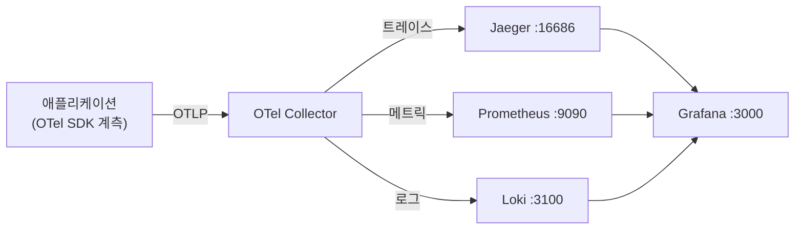
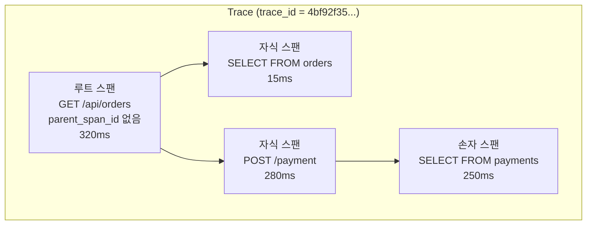
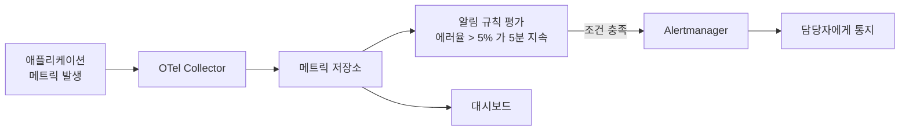

---

title: "OpenTelemetry의 세 가지 시그널, 추적과 지표와 로그"
date: 2025-01-26
categories: [Observability, OpenTelemetry]
tags: [OpenTelemetry, Trace, Span, Metric, Log, Observability]
layout: post
toc: true
math: true
mermaid: true

---

## 참고자료

- [OpenTelemetry - Traces](https://opentelemetry.io/docs/concepts/signals/traces/)
- [OpenTelemetry - Metrics](https://opentelemetry.io/docs/concepts/signals/metrics/)
- [OpenTelemetry - Logs](https://opentelemetry.io/docs/concepts/signals/logs/)
- [OpenTelemetry - Semantic Conventions](https://opentelemetry.io/docs/specs/semconv/)
- [W3C Trace Context](https://www.w3.org/TR/trace-context/)

---

## 배경

앞 글에서 시그널을 나눈 이유까지 정리했다. 이번에는 **각각이 실제로 어떻게 생겼는지**를 본다.

추적이라는 말은 여러 번 들었는데 스팬이 무엇이고 그것들이 어떻게 묶이는지는 몰랐다. 지표도 카운터와 게이지의 차이를 대충만 알고 있었다.

실습 환경을 띄워놓고 실제 데이터를 보면서 정리했다.

정리하면서 확인하고 싶었던 것들이다.

- 스팬 하나에는 무엇이 들어 있고 어떻게 부모 자식이 되는가?
- 지표에 종류가 여럿인데 무엇을 기준으로 고르는가?
- 로그를 추적과 어떻게 이어붙이는가?
- 속성을 아무거나 붙여도 되는가?

---

## 실습 환경

아래 이미지와 같은 구조를 마련하기 위해 도커 컴포즈를 사용한다.



| 서비스                     | 포트    |
|-------------------------|-------|
| Jagger (Trace)          | 16686 |
| Prometheus (Metric)     | 9090  |
| Loki (Log)              | 3100  |
| Grafana (Visualization) | 3000  |
| OpenTelemetry Collector | 13133 |
| Web Applicaiton         | 8080  |

실습 환경을 위한 docker compose는 아래와 같다.

```yml
version: "3.7"
services:
    shopper:
        image: codeboten/shopper:chapter2
        container_name: shopper
        environment:
            - OTEL_EXPORTER_OTLP_ENDPOINT=opentelemetry-collector:4317
            - OTEL_EXPORTER_OTLP_INSECURE=true
            - GROCERY_STORE_URL=http://grocery-store:8080/products
        networks:
            - cloud-native-observability
        depends_on:
            - grocery-store
            - opentelemetry-collector
        stop_grace_period: 1s
    grocery-store:
        image: codeboten/grocery-store:chapter2
        container_name: grocery-store
        environment:
            - OTEL_EXPORTER_OTLP_ENDPOINT=http://opentelemetry-collector:4317
            - OTEL_SERVICE_NAME=grocery-store
            - INVENTORY_URL=http://legacy-inventory:5001/inventory
        networks:
            - cloud-native-observability
        depends_on:
            - legacy-inventory
            - opentelemetry-collector
        stop_grace_period: 1s
        ports:
            - 8080:5000
        deploy:
            resources:
                limits:
                    cpus: "0.50"
                    memory: 80M
    legacy-inventory:
        image: codeboten/legacy-inventory:chapter2
        container_name: inventory
        environment:
            - OTEL_EXPORTER_OTLP_ENDPOINT=http://opentelemetry-collector:4317
            - OTEL_SERVICE_NAME=inventory
        networks:
            - cloud-native-observability
        depends_on:
            - opentelemetry-collector
        stop_grace_period: 1s
        ports:
            - 5001:5001
        deploy:
            resources:
                limits:
                    cpus: "0.50"
                    memory: 80M
    jaeger:
        image: jaegertracing/all-in-one:1.29.0
        container_name: jaeger
        ports:
            - 6831:6831/udp
            - 16686:16686
        networks:
            - cloud-native-observability
    prometheus:
        image: prom/prometheus:v2.29.2
        container_name: prometheus
        volumes:
            - ./config/prometheus/config.yml/:/etc/prometheus/prometheus.yml
        command:
            - "--config.file=/etc/prometheus/prometheus.yml"
            - "--enable-feature=exemplar-storage"
        ports:
            - 9090:9090
        networks:
            - cloud-native-observability
    opentelemetry-collector:
        image: otel/opentelemetry-collector-contrib:0.43.0
        container_name: opentelemetry-collector
        volumes:
            - ./config/collector/config.yml/:/etc/opentelemetry-collector.yml
            - /var/run/docker.sock:/var/run/docker.sock
        command:
            - "--config=/etc/opentelemetry-collector.yml"
        networks:
            - cloud-native-observability
        ports:
            - 4317:4317
            - 13133:13133
            - 8889:8889
        stop_grace_period: 1s
    loki:
        image: grafana/loki:2.3.0
        container_name: loki
        ports:
            - 3100:3100
        command: -config.file=/etc/loki/local-config.yaml
        networks:
            - cloud-native-observability
    promtail:
        image: grafana/promtail:2.3.0
        container_name: promtail
        volumes:
            - /var/log:/var/log
        command: -config.file=/etc/promtail/config.yml
        networks:
            - cloud-native-observability
    grafana:
        image: grafana/grafana:8.3.3
        container_name: grafana
        ports:
            - 3000:3000
        volumes:
            - ./config/grafana/provisioning:/etc/grafana/provisioning
        networks:
            - cloud-native-observability
        environment:
            - GF_AUTH_ANONYMOUS_ENABLED=true
            - GF_AUTH_ORG_ROLE=Editor
            - GF_AUTH_ANONYMOUS_ORG_ROLE=Admin
            - GF_AUTH_DISABLE_LOGIN_FORM=true

networks:
    cloud-native-observability:
```

---

## 분산 추적

추적은 전체 시스템에 대한 고유한 요청을 나타내며 `동기`, `비동기`로 구분된다.

또한 각 추적에 기록된 작업은 시스템에서 처리된 작업의 단위를 의미하는 `스팬`으로 표기된다.

### Span

단일 메서드 호출이나 메서드 내에서 호출되는 코드의 일부분을 나타낸다.

추적 내에서의 여러 스팬은 부모-자식 관계로 연결되어있고 각 자식 스팬은 부모 스팬에 대한 정보를 갖고 있다.

추적 내에 있는 첫 번째 스팬을 `루트 스팬`이라고 하며 당연하게도 부모 스팬에 대한 식별자를 가지고 있지 않다.

추적과 스팬의 관계를 그리면 이렇다.



추적 뷰어에서 보면 각 스팬이 시간축 위의 막대로 표시된다. 텍스트로 옮기면 이런 모양이다.

```text
GET /api/orders                                  ████████████████████████  320ms
  ├─ SELECT FROM orders                          ██                         15ms
  └─ POST /payment                                 ████████████████████    280ms
       └─ SELECT FROM payments                      ██████████████████     250ms
```

**막대의 길이와 위치를 보는 것이 요점이다.** 어느 구간이 전체 시간의 대부분을 차지하는지가 바로 보인다. 위 예에서는 320ms 중 250ms가 결제 쪽 조회에서 나왔다.

---

### Span Context

W3C의 권고에 따라 정의된 Span의 구성요소는 아래와 같다.

#### 추적 ID

고유 식별자로, 전체 시스템에서 요청을 식별할 수 있는 요소

#### 스팬 ID

컨텍스트와 상호 작용한 최종 스팬과 연결된다.

하위 스팬이 존재하는 경우 상위 스팬의 스팬 ID는 부모 식별자로 불린다.

#### 추적 플래그

추적 수준(Trace Level), 샘플링 여부(Sampling Decision)등 추적에 관한 메타데이터를 담고있다.

#### 추적 상태

개별 벤더가 각자의 시스템에서 필요로 하는 정보를 전파, 추적 데이터를 해석할 수 있도록 한다. ex) `vendorA=123456`와 같은 형태로 추적 상태 필드에 값을 넣는다.

---

### 실제 Span의 구조

수집된 스팬 하나를 열어보면 아래와 같은 정보가 담겨 있다.

```json
{
  "traceId": "4bf92f3577b34da6a3ce929d0e0e4736",
  "spanId": "00f067aa0ba902b7",
  "parentSpanId": "0020000000000001",
  "name": "GET /api/orders",
  "kind": "SPAN_KIND_SERVER",
  "startTimeUnixNano": "1706000000000000000",
  "endTimeUnixNano": "1706000000320000000",
  "attributes": {
    "http.request.method": "GET",
    "url.path": "/api/orders",
    "http.response.status_code": 200,
    "server.address": "api.example.com"
  },
  "status": { "code": "STATUS_CODE_OK" },
  "events": [
    { "name": "cache.miss", "timeUnixNano": "1706000000010000000" }
  ]
}
```

필드를 하나씩 보면 이렇다.

| 필드 | 의미 |
|---|---|
| `traceId` | 이 요청 전체를 식별한다. 서비스를 넘어가도 같은 값 |
| `spanId` | 이 구간 하나를 식별한다 |
| `parentSpanId` | 부모 구간. 루트 스팬에는 없다 |
| `kind` | 서버인지 클라이언트인지 내부인지 |
| `attributes` | 이 구간에 관한 부가 정보. 의미 규약을 따르는 이름을 쓴다 |
| `status` | 성공인지 실패인지 |
| `events` | 구간 안에서 일어난 시점 기록 |

**`attributes`의 이름이 의미 규약을 따라야 한다는 점**이 중요하다. `http.request.method`처럼 정해진 이름을 쓰면 언어와 프레임워크가 달라도 하나의 쿼리로 전체를 볼 수 있다.

---

## 메트릭

메트릭이 갖는 필드는 아래와 같다.

메트릭은 단순한 리소스 사용량을 측정할 수 있는 것 뿐만 아니라 아래처럼 Request Counter등 다양한 요소를 얻을 수 있다.

이런 다양한 메트릭 지표를 통해 On-Call 알림을 보내도록 설정하여 엔지니어에게 현재 서비스의 대한 경고를 보낸다.



`메트릭` 이라는 용어 자체는 서로 다른 측정값들을 캡슐화한 용어이다. 구체적인 데이터는 `데이터 포인트`라는 데이터 타입을 포착한다.

### 데이터 포인트 - 카운터(Counter)

단순히 증가만 하는 누적 값이다.

```
# HTTP 요청 카운터
http_requests_total{method="GET", endpoint="/api/users"} 23421
http_requests_total{method="POST", endpoint="/api/users"} 7832

# 시스템 에러 카운터
system_errors_total{type="connection_timeout"} 382
system_errors_total{type="internal_error"} 89
```

### 데이터 포인트 - 게이지(Gauge)

현재 상태를 나타내는 순간값이다.

```
# CPU 사용률
cpu_usage_percent{core="0"} 78.5
cpu_usage_percent{core="1"} 92.3

# 메모리 사용량
memory_usage_bytes{pod="backend-prod-1"} 1.28e+9
```

### 데이터 포인트 - 히스토그램(Histogram)

값의 분포를 구간(bucket)별로 측정하는 관측값이다. 구간은 보통 le(less equal) 레이블로 표시한다.

```
# HTTP 응답시간 분포
http_request_duration_seconds_bucket{le="0.1"} 12323  # 100ms 이하
http_request_duration_seconds_bucket{le="0.3"} 14236  # 300ms 이하
http_request_duration_seconds_bucket{le="1.0"} 15564  # 1s 이하
http_request_duration_seconds_bucket{le="+Inf"} 15600 # 전체
```

### 데이터 포인트 - 요약(Summary)

히스토그램과 유사하나 서버측에서 백분위를 계산하여 클라이언트 부하는 적으나 정확도는 떨어진다.

```
# API 응답시간 요약
api_response_latency_seconds{quantile="0.5"} 0.042  # 중앙값
api_response_latency_seconds{quantile="0.9"} 0.087  # 90th 백분위
api_response_latency_seconds{quantile="0.99"} 0.184 # 99th 백분위
```

---

## OpenTelemetry 데이터 포인트 구조

OpenTelemetry가 활성 스팬 정보를 메트릭에 포함시키도록하여 더 많은 정보를 얻게 해준다.

OpenTelemetry에서 정의된 데이터 포인트는 아래와 같은 정보들을 갖는다.

### 1. 추적 ID (Trace ID)

- 전체 트랜잭션의 고유 식별자
- 형식: 16바이트 hex 문자열

```yaml
trace_id: "4bf92f3577b34da6a3ce929d0e0e4736"
```

### 2. 스팬 ID (Span ID)

- 개별 작업 단위의 식별자
- 형식: 8바이트 hex 문자열

```yaml
span_id: "00f067aa0ba902b7"
```

### 3. 타임스탬프 (Timestamp)

- 이벤트 발생 시각 (나노초 단위)

```yaml
timestamp: "2024-01-26T09:00:00.123456789Z"
```

### 4. 표준 속성 (Standard Attributes)

#### 서비스 식별

```yaml
service:
  name: "payment-service"
  version: "1.2.3"
  environment: "production"
  instance_id: "pod-xyz-123"
```

#### HTTP 요청 정보

```yaml
http:
  method: "POST"
  url: "/api/v1/users"
  status_code: 200
  user_agent: "Mozilla/5.0..."
```

#### 데이터베이스 작업

```yaml
database:
  system: "postgresql"
  name: "users"
  operation: "SELECT"
  statement: "SELECT * FROM users WHERE id = ?"
```

#### 클라우드/인프라 정보

```yaml
cloud:
  provider: "aws"
  region: "us-east-1"
  zone: "us-east-1a"
kubernetes:
  pod_name: "backend-pod-123"
  namespace: "production"
```

#### 사용자 정의 속성

```yaml
custom:
  customer_id: "12345"
  transaction_id: "tx_789"
  error_type: "connection_timeout"
```

---

## 로그

로그는 공통 로그 형식이 있지만 이를 모두가 완벽하게 지킬 순 없을것이다. 그럼에도 다음 두 항목은 반드시 구성되어야하는 요소이다.

- 이벤트가 발생한 타임스탬프
- 이벤트를 나타내는 메세지

구조화된 로깅에서는 Key-Value로 표현하기도하고, 구분자와 정의된 순서를 이용한 로그를 만들어내기도한다.

---

## 정리하며

처음 던진 질문들에 대한 답이다.

**스팬에는 무엇이 들어 있는가.** 이름, 시작과 끝 시각, 그리고 스팬 컨텍스트다. 스팬 컨텍스트에 추적 ID와 스팬 ID가 들어 있고, **부모 스팬 ID를 함께 담아서 트리를 만든다.**

같은 추적 ID를 가진 스팬들이 하나의 요청이고, 부모 자식 관계로 순서와 포함 관계가 표현된다. 그래서 **어느 구간에서 시간을 썼는지가 그림으로 나온다.**

**지표 종류를 무엇으로 고르는가.** 값이 어떻게 변하는지를 보면 정해진다.

카운터는 **줄어들지 않는 값**이다. 누적 요청 수, 누적 에러 수가 여기 해당한다. 값 자체보다 변화율이 의미가 있다.

게이지는 **오르내리는 현재 값**이다. 메모리 사용량, 큐 길이, 활성 연결 수다.

히스토그램은 **분포**다. 응답 시간처럼 평균만으로는 부족하고 백분위를 봐야 하는 것들이다.

**응답 시간을 게이지로 두면 안 된다**는 것이 실무에서 중요하다. 게이지는 마지막 값만 남으므로 그 사이에 튄 요청이 사라진다. 히스토그램이어야 p99를 볼 수 있다.

**로그를 추적과 어떻게 잇는가.** 로그 레코드에 추적 ID와 스팬 ID를 함께 남긴다. 그러면 추적에서 느린 구간을 발견했을 때 **그 구간에서 나온 로그만 골라 볼 수 있다.**

이게 없으면 시간대로 짐작해서 뒤져야 한다. 요청이 초당 수백 개면 그 방법은 통하지 않는다.

**속성을 아무거나 붙여도 되는가.** 안 된다. 두 가지 이유다.

**이름이 제각각이면 이어지지 않는다.** 한쪽이 `http.status`, 다른 쪽이 `status_code`로 남기면 함께 조회할 수 없다. 그래서 시맨틱 표기법이라는 표준 이름 규약이 있고, 여기 있는 것은 그대로 쓰는 편이 낫다.

**카디널리티가 폭발한다.** 사용자 ID처럼 값의 종류가 무한한 것을 지표의 속성으로 붙이면, 값 조합마다 시계열이 하나씩 생긴다. 저장소가 감당하지 못한다. **그런 정보는 지표가 아니라 추적이나 로그의 속성으로 남겨야 한다.**

정리하고 나서 남은 감각은 **세 시그널이 각각 답할 수 있는 질문이 다르다는 것**이었다. 지표는 "지금 정상인가", 추적은 "이 요청에서 어디가 느렸나", 로그는 "그때 정확히 무슨 일이 있었나"에 답한다. 하나만 갖고 있으면 나머지 두 질문에서 막힌다.
