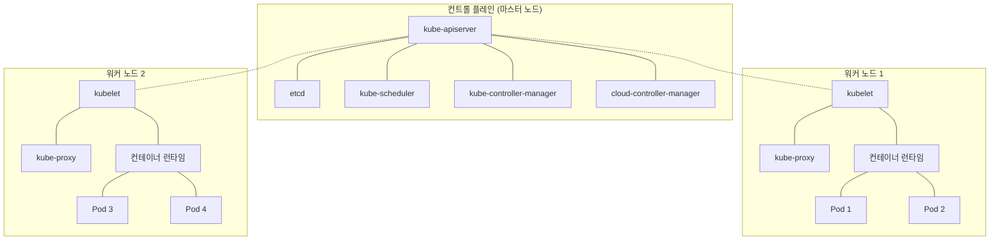

---

title: 김도현의 쿠버네티스 입문장벽 낮추기 1 - 쿠버네티스 용어 유래로 알아보기 
date: 2025-03-14
categories: [Kubernetes]
tags: [Kubernetes]
layout: post
toc: true
math: true
mermaid: true

---

## 쿠버네티스 == 항해 테마

쿠버네티스(Kubernetes)는 그리스어 "κυβερνήτης"(kybernetes)에서 유래했으며, 이는 "조타수" 또는 "항해사"를 의미한다. 컨테이너화된 애플리케이션의 배포, 확장, 관리를 자동화하는 역할을
하기 때문에 이런 이름이 붙었다. 쿠버네티스의 상징이 항해용 방향타인 것도 이 때문이다.

## 컨트롤 플레인 컴포넌트 유래와 역할

| 용어                           | 유래                                 | 설명                                                                                                              |
|------------------------------|------------------------------------|-----------------------------------------------------------------------------------------------------------------|
| **kubelet**                  | "kube" + "let"(작은 프로그램)            | 각 노드에서 실행되는 에이전트로, 파드에서 컨테이너가 확실하게 동작하도록 관리. PodSpec에 따라 컨테이너의 건강 상태를 확인하고 유지함                                  |
| **kubectl**                  | "kube" + "control"(제어)             | 쿠버네티스 클러스터를 제어하는 명령줄 인터페이스. API 서버와 통신하여 사용자 명령을 클러스터에 전달                                                       |
| **kubeadm**                  | "kube" + "admin"(관리자)              | 쿠버네티스 클러스터를 빠르게 부트스트랩하기 위한 도구. 고가용성(HA) 클러스터 구축에도 사용 가능                                                         |
| **kube-proxy**               | "kube" + "proxy"(프록시)              | 각 노드에서 실행되며 네트워크 규칙을 유지관리. 서비스 개념의 구현부로, 내부 네트워크 세션이나 클러스터 외부에서 파드로의 통신을 가능하게 함                                 |
| **kube-apiserver**           | "kube" + "API server"              | 쿠버네티스 API를 노출하는 컴포넌트. 컨트롤 플레인의 프론트엔드로, 수평 확장 가능하도록 설계됨                                                          |
| **kube-scheduler**           | "kube" + "scheduler"               | 새로 생성된 파드를 실행할 노드를 선택하는 컴포넌트. 리소스 요구사항, 하드웨어/소프트웨어 제약, 어피니티/안티-어피니티 규칙 등을 고려하여 최적의 노드를 선택                       |
| **kube-controller-manager**  | "kube" + "controller" + "manager"  | 여러 컨트롤러 프로세스를 실행하는 컴포넌트. 노드 컨트롤러, 잡 컨트롤러, 엔드포인트슬라이스 컨트롤러, 서비스어카운트 컨트롤러 등이 포함됨                                   |
| **cloud-controller-manager** | "cloud" + "controller" + "manager" | 클라우드별 컨트롤 로직을 포함하는 컴포넌트. 클라우드 제공자의 API와 클러스터를 연결하며, 노드 컨트롤러, 라우트 컨트롤러, 서비스 컨트롤러 등 클라우드 의존성을 가진 컨트롤러를 관리         |
| **etcd**                     | "etc distribution"                 | 모든 클러스터 데이터를 저장하는 일관성 있고 고가용성을 갖춘 키-값 저장소. Unix 시스템의 /etc 디렉토리(설정 파일을 저장)에서 영감을 받음. 쿠버네티스의 백엔드 저장소로, 백업 계획이 필수적 |

## 노드 컴포넌트 유래와 역할

노드 컴포넌트는 동작 중인 파드를 유지하고 쿠버네티스 런타임 환경을 제공하며, 모든 노드 상에서 실행된다.

| 용어             | 유래                      | 설명                                                                                      |
|----------------|-------------------------|-----------------------------------------------------------------------------------------|
| **kubelet**    | "kube" + "let"(작은 프로그램) | 위의 표에서 설명한 바와 같음                                                                        |
| **kube-proxy** | "kube" + "proxy"(프록시)   | 위의 표에서 설명한 바와 같음                                                                        |
| **컨테이너 런타임**   | Container Runtime       | 컨테이너 실행을 담당하는 소프트웨어. containerd, CRI-O 등이 있으며, 모든 Kubernetes CRI(컨테이너 런타임 인터페이스) 구현체 지원 |

## 리소스 및 개념 유래

| 용어              | 유래          | 설명                                                                          |
|-----------------|-------------|-----------------------------------------------------------------------------|
| **Pod**         | 고래나 돌고래의 무리 | 쿠버네티스에서 생성하고 관리할 수 있는 배포 가능한 가장 작은 컴퓨팅 단위. 하나 이상의 컨테이너 그룹이며, 스토리지와 네트워크를 공유 |
| **Helm**        | 배의 조타       | 쿠버네티스 패키지 매니저. 복잡한 애플리케이션 배포를 단순화하는 차트(Charts)라는 패키지 형식 제공                  |
| **Ingress**     | "들어오다"라는 의미 | 클러스터로 들어오는 HTTP 및 HTTPS 트래픽을 관리하는 API 객체. 라우팅 규칙을 제공하여 지정된 서비스로 트래픽 라우팅     |
| **Service**     |             | 파드 집합에 대한 네트워크 접근 방식을 정의하는 추상화 계층. 파드의 논리적 집합과 그것들에 접근할 수 있는 정책을 정의         |
| **Namespace**   |             | 하나의 클러스터 내에서 리소스 그룹을 격리하는 가상 클러스터. 여러 사용자가 있는 환경에서 리소스 분할에 유용               |
| **Deployment**  |             | 파드와 레플리카셋에 대한 선언적 업데이트를 제공. 애플리케이션 배포 상태를 설명하고 원하는 상태로 변경 가능                |
| **StatefulSet** |             | 상태 유지가 필요한 애플리케이션을 관리하기 위한 워크로드 API 객체. 파드의 순서 및 고유성을 보장                    |
| **DaemonSet**   |             | 모든(또는 일부) 노드가 파드의 사본을 실행하도록 보장. 로그 수집, 모니터링 등의 백그라운드 작업에 적합                 |
| **ConfigMap**   |             | 키-값 쌍으로 구성 데이터를 저장하는 API 객체. 환경 변수, 명령줄 인수 등으로 컨테이너에 전달 가능                  |
| **Secret**      |             | 비밀번호, OAuth 토큰, SSH 키와 같은 민감한 정보를 저장하는 객체. 암호화되어 관리됨                        |

## 애드온 및 확장 컴포넌트

| 용어                | 설명                                                             |
|-------------------|----------------------------------------------------------------|
| **클러스터 DNS**      | 쿠버네티스 서비스를 위해 DNS 레코드를 제공하는 DNS 서버. 모든 쿠버네티스 클러스터에 권장되는 필수 애드온 |
| **웹 UI (대시보드)**   | 쿠버네티스 클러스터를 위한 범용 웹 기반 UI. 클러스터와 애플리케이션 관리 및 문제 해결 지원          |
| **컨테이너 리소스 모니터링** | 컨테이너에 대한 포괄적인 시계열 메트릭스를 기록하고 데이터를 열람하기 위한 UI 제공                |
| **클러스터-레벨 로깅**    | 중앙 로그 저장소에 컨테이너 로그를 저장하고 검색/열람 인터페이스를 제공                       |

## 관련 도구

| 용어             | 유래                   | 설명                                                          |
|----------------|----------------------|-------------------------------------------------------------|
| **Minikube**   | "mini" + "kube"      | 로컬 환경에서 쿠버네티스를 실행하기 위한 도구. 개발, 테스트, 학습 목적으로 적합              |
| **Kind**       | Kubernetes in Docker | Docker 컨테이너를 노드로 사용하여 로컬에서 쿠버네티스 클러스터를 실행. CI 파이프라인 테스트에 유용 |
| **k3s**        | "K8s"의 경량화 버전        | 경량화된 쿠버네티스 배포판. IoT 및 엣지 컴퓨팅에 최적화됨                          |
| **Istio**      | 그리스어로 "항해, 돛"        | 서비스 메시 솔루션. 마이크로서비스 간의 트래픽 관리, 보안, 관찰 가능성 제공                |
| **Knative**    | "kube-native"의 줄임말   | 쿠버네티스 위에서 서버리스 워크로드를 실행하기 위한 플랫폼. 이벤트 기반 애플리케이션 개발 지원       |
| **Prometheus** |                      | 쿠버네티스 환경에서 널리 사용되는 오픈소스 모니터링 시스템. 메트릭 수집, 알림, 시각화 제공        |
| **Grafana**    |                      | 다양한 데이터 소스의 메트릭을 시각화하는 도구. Prometheus와 함께 자주 사용됨            |

## 쿠버네티스 아키텍처 개요

쿠버네티스는 크게 마스터 노드(컨트롤 플레인)와 워커 노드로 구성된다. 각 컴포넌트는 특정 역할을 담당하여 전체 클러스터의 원활한 운영을 보장한다.

## 쿠버네티스 작동 방식 간략 설명

1. 사용자가 `kubectl`이나 API를 통해 애플리케이션 배포를 요청한다.
2. `kube-apiserver`가 요청을 검증하고 처리한다.
3. 배포 정보는 `etcd`에 저장된다.
4. `kube-scheduler`가 적절한 노드를 선택한다.
5. 선택된 노드의 `kubelet`이 컨테이너 런타임을 통해 파드를 생성한다.
6. `kube-controller-manager`가 원하는 상태와 실제 상태를 일치시키기 위해 지속적으로 모니터링한다.
7. `kube-proxy`가 서비스에 대한 네트워크 규칙을 설정하여 파드에 접근할 수 있게 한다.

## 쿠버네티스의 중요한 개념

### 선언적 구성

쿠버네티스는 "선언적(declarative)" 접근 방식을 사용한다. 사용자는 시스템의 "원하는 상태"를 정의하고, 쿠버네티스는 현재 상태를 원하는 상태로 맞추기 위해 지속적으로 작업한다.

### 셀프 힐링

쿠버네티스는 노드 장애, 파드 충돌 등의 상황에서 자동으로 복구를 시도한다. 이는 높은 가용성과 안정성을 제공한다.

### 스케일링

수평적 스케일링(파드 복제본 수 증가) 및 수직적 스케일링(파드에 할당된 리소스 증가)을 통해 워크로드 요구사항에 맞게 조정할 수 있다.

### 롤백 및 업데이트

쿠버네티스는 애플리케이션의 롤링 업데이트를 지원하며, 문제 발생 시 이전 버전으로 쉽게 롤백할 수 있다.

---

- [다음 글 - 쿠버네티스 컴포넌트 역할 알아보기](https://k-diger.github.io/posts/KubernetesSeries2Components)
