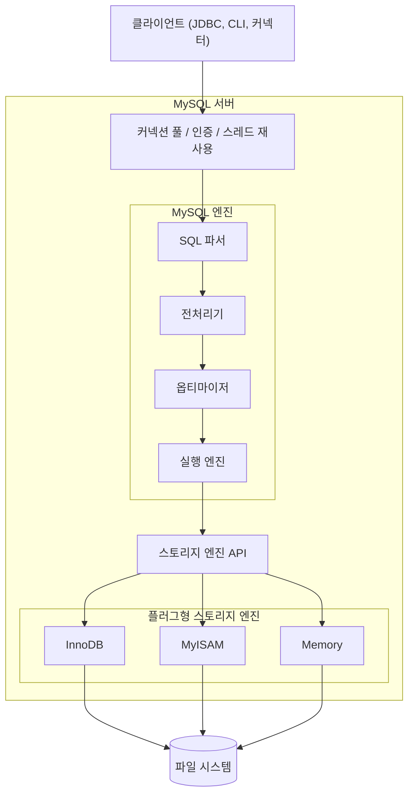
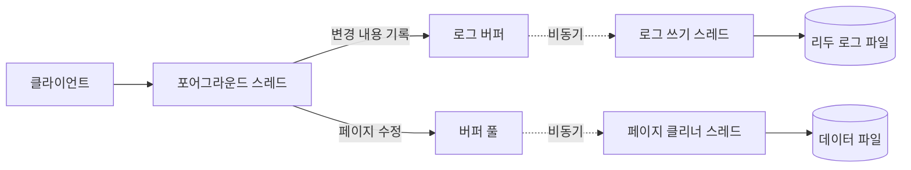
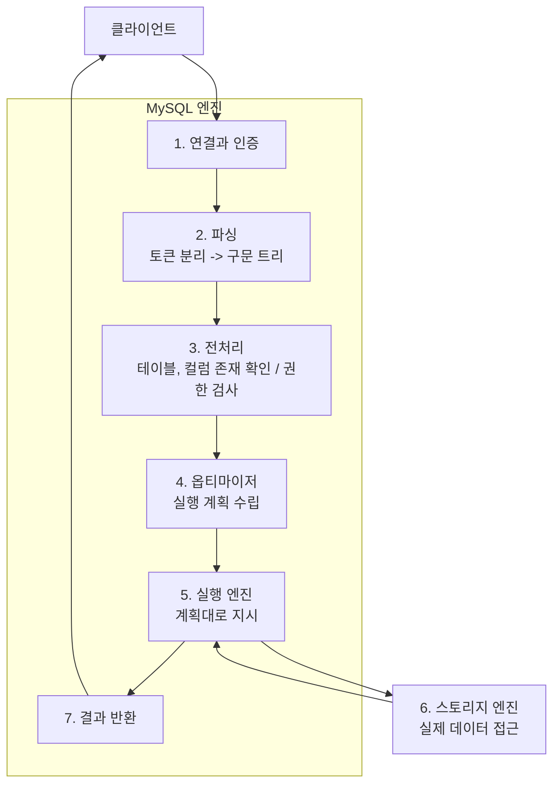
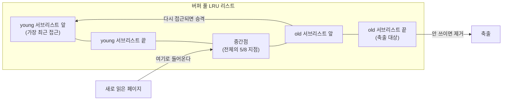
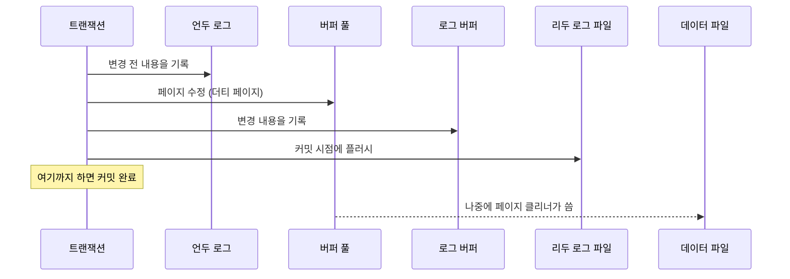
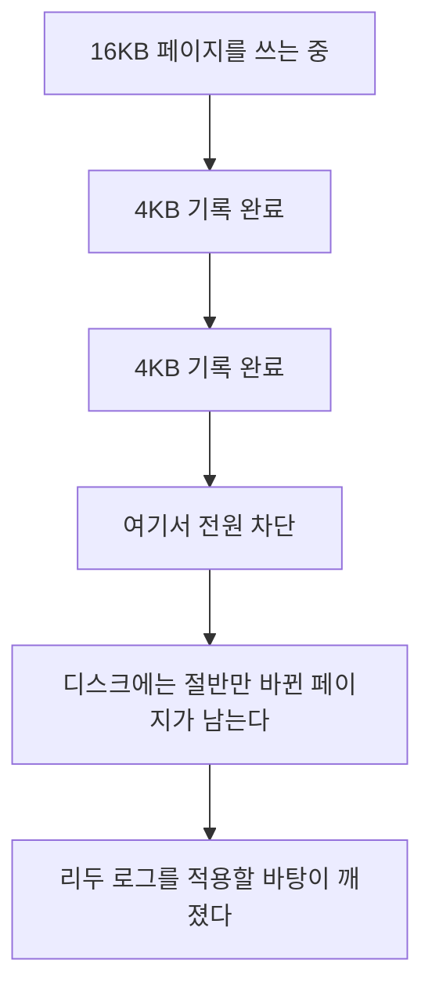

---

title: "Real MySQL 4장을 공식문서로 다시 읽기, 아키텍처와 InnoDB"
date: 2025-04-06
categories: [Database, MySQL]
tags: [MySQL, InnoDB, BufferPool, Architecture, Redo, MVCC]
layout: post
toc: true
math: true
mermaid: true

---

## 참고자료

- [MySQL 8.0 - Alternative Storage Engines](https://dev.mysql.com/doc/refman/8.0/en/storage-engines.html)
- [MySQL 8.0 - How MySQL Uses Memory](https://dev.mysql.com/doc/refman/8.0/en/memory-use.html)
- [MySQL 8.0 - Optimizing SQL Statements](https://dev.mysql.com/doc/refman/8.0/en/statement-optimization.html)
- [MySQL 8.0 - InnoDB Introduction](https://dev.mysql.com/doc/refman/8.0/en/innodb-introduction.html)
- [MySQL 8.0 - Clustered and Secondary Indexes](https://dev.mysql.com/doc/refman/8.0/en/innodb-index-types.html)
- [MySQL 8.0 - InnoDB Multi-Versioning](https://dev.mysql.com/doc/refman/8.0/en/innodb-multi-versioning.html)
- [MySQL 8.0 - The InnoDB Buffer Pool](https://dev.mysql.com/doc/refman/8.0/en/innodb-buffer-pool.html)
- [MySQL 8.0 - Doublewrite Buffer](https://dev.mysql.com/doc/refman/8.0/en/innodb-doublewrite-buffer.html)
- [MySQL 8.0 - Redo Log](https://dev.mysql.com/doc/refman/8.0/en/innodb-redo-log.html)
- [MySQL 8.0 - Undo Logs](https://dev.mysql.com/doc/refman/8.0/en/innodb-undo-logs.html)

---

## 배경

Real MySQL 4장을 읽는데 책에 나온 그림과 설명만으로는 감이 안 잡히는 곳이 많았다. 특히 버퍼 풀과 리두 로그, 더블라이트 버퍼가 서로 어떻게 얽히는지가 그랬다.

그래서 **책을 읽으면서 같은 내용을 공식문서에서 다시 찾아보는 방식**으로 정리했다. 책은 어디를 봐야 하는지 알려주고, 공식문서는 정확한 동작을 알려준다.

정리하면서 확인하고 싶었던 것들이다.

- MySQL 엔진과 스토리지 엔진의 경계는 정확히 어디인가?
- 메모리 설정이 이렇게 많은데 어느 것이 서버 전체 것이고 어느 것이 연결마다 붙는 것인가?
- 버퍼 풀에 있는 변경분이 아직 디스크에 없는데 서버가 죽으면 어떻게 복구되는가?
- 더블라이트 버퍼는 왜 필요한가? 리두 로그가 있는데도 부족한가?

---

## 4.1.1 MySQL 엔진 아키텍처



MySQL의 전체 아키텍처는 크게 두 가지로 나뉜다.

#### MySQL 엔진

- 커넥션 핸들러
- SQL 파서
- 전처리기
- 옵티마이저

#### 플러그형 스토리지 엔진

SQL 문장 분석 및 최적화, 실제 디스크로부터 데이터를 가져오는 역할이다. 스토리지 엔진은 여러 종류를 혼합하여 사용가능하다. (특정 테이블에는 InnoDB, 특정 테이블에는 MyISAM 등)

---

## 4.1.2 MySQL 스레딩 구조

[MySQL Documentation](https://dev.mysql.com/doc/refman/8.0/en/performance-schema-threads-table.html)

MySQL은 멀티스레드 아키텍처를 사용하여 클라이언트 요청과 내부 작업을 처리한다.

### 포어그라운드 스레드

**클라이언트 연결 하나에 스레드 하나가 붙는다.** 사용자 세션과 직접 연결되는 쪽이다.

연결 요청이 오면 서버가 **스레드 캐시에서 놀고 있는 스레드를 찾아 할당한다.** 없으면 새로 만든다. 스레드를 만드는 것 자체가 비용이라 재사용하는 것이다.

하는 일이다.

| 단계 | 내용 |
|---|---|
| 수신 | SQL 문장을 받아 파싱한다 |
| 계획 | 실행 계획을 만들고 최적화한다 |
| 실행 | 스토리지 엔진을 통해 데이터에 접근한다 |
| 반환 | 결과를 정리해 클라이언트로 보낸다 |
| 트랜잭션 | 시작, 커밋, 롤백을 관리한다 |

**연결이 끊어져도 스레드가 바로 사라지지 않는다.** [`thread_cache_size`](https://dev.mysql.com/doc/refman/8.0/en/server-system-variables.html#sysvar_thread_cache_size)만큼은 캐시에 남아 다음 연결을 기다린다.

**아무것도 안 하고 오래 있으면 서버가 연결을 끊는다.** [`wait_timeout`](https://dev.mysql.com/doc/refman/8.0/en/server-system-variables.html#sysvar_wait_timeout)과 [`interactive_timeout`](https://dev.mysql.com/doc/refman/8.0/en/server-system-variables.html#sysvar_interactive_timeout)이 그 시간을 정한다.

여기서 애플리케이션 쪽과 부딪히는 지점이 있다. **커넥션 풀이 들고 있는 커넥션을 서버가 먼저 끊으면**, 애플리케이션은 그걸 모른 채로 쓰다가 끊어진 커넥션에서 예외를 받는다. HikariCP의 `maxLifetime`을 서버의 `wait_timeout`보다 짧게 두라는 권고가 이 때문이다.

스레드 상태는 `SHOW PROCESSLIST`로 볼 수 있다.

| 상태 | 의미 |
|---|---|
| Active | 쿼리를 실행 중 |
| Sleep | 연결은 살아 있고 쿼리를 안 보내는 중 |
| Waiting for table metadata lock | 메타데이터 락을 기다리는 중 |

`Sleep`이 오래 쌓여 있으면 **애플리케이션이 커넥션을 잡아만 놓고 안 쓰고 있다는 뜻**이다. [커넥션이 말랐던 이야기](/posts/ConnectionLeak-OOM/)에 적은 상황이 여기서 보인다.

각 스레드는 자기 스택을 갖고, `sort_buffer_size`나 `join_buffer_size` 같은 세션 변수만큼 메모리를 더 쓴다. **연결 수가 많으면 이 값들이 곱해지므로** 크게 잡으면 안 된다.

### 백그라운드 스레드

**클라이언트와 무관하게 서버 내부 일을 하는 스레드들**이다. 대부분 서버가 시작할 때 만들어진다.

포어그라운드 스레드가 하는 일을 줄여주는 것이 이들의 존재 이유다. **디스크에 쓰는 작업을 사용자 요청 경로에서 떼어내서** 응답을 빠르게 만든다.

- **마스터 스레드(Master Thread)**:
    - InnoDB의 메인 백그라운드 스레드
    - 로그 버퍼를 로그 파일로 플러시
    - 변경된 버퍼 페이지(더티 페이지)를 디스크에 주기적으로 쓰기
    - 불필요한 데이터 삭제(purge operation)
    - [적응형 해시 인덱스(adaptive hash index)](https://dev.mysql.com/doc/refman/8.0/en/innodb-adaptive-hash.html) 관리
    - [버퍼 풀의 LRU 리스트](https://dev.mysql.com/doc/refman/8.0/en/innodb-buffer-pool.html#innodb-buffer-pool-lru) 관리
  - **I/O 스레드**:
    - [innodb_read_io_threads](https://dev.mysql.com/doc/refman/8.0/en/innodb-parameters.html#sysvar_innodb_read_io_threads)와 [innodb_write_io_threads](https://dev.mysql.com/doc/refman/8.0/en/innodb-parameters.html#sysvar_innodb_write_io_threads) 설정으로 개수 조정 가능
    - 읽기 I/O 스레드: 데이터 파일에서 페이지 읽기 작업 담당
    - 쓰기 I/O 스레드: 변경된 페이지를 데이터 파일에 쓰기 작업 담당
    - AIO(비동기 I/O) 요청 처리로 I/O 병렬성 향상
  - **정리 스레드(Purge Thread)**:
    - [MVCC(다중 버전 동시성 제어)](https://dev.mysql.com/doc/refman/8.0/en/innodb-multi-versioning.html)를 위한 언두 로그에서 더 이상 필요 없는 레코드 제거
    - 삭제 마크된 레코드의 실제 물리적 삭제 수행
    - [innodb_purge_threads](https://dev.mysql.com/doc/refman/8.0/en/innodb-parameters.html#sysvar_innodb_purge_threads) 설정으로 개수 조정 가능
  - **페이지 클리너 스레드(Page Cleaner Thread)**:
    - [버퍼 풀](https://dev.mysql.com/doc/refman/8.0/en/innodb-buffer-pool.html)의 더티 페이지를 디스크로 플러시하는 작업 전담
    - MySQL 5.7부터 도입되어 이전에 마스터 스레드가 수행하던 플러시 작업 분담
    - 사용자 쿼리 처리 스레드의 응답 시간 개선에 기여
  - **[로그 스레드](https://dev.mysql.com/doc/refman/8.0/en/binary-log.html)**:
    - 바이너리 로그 관리
    - 리두 로그 쓰기 및 플러시 작업 담당
  - **[에러 로그](https://dev.mysql.com/doc/refman/8.0/en/error-log.html) 스레드**:
    - 비동기적으로 에러 로그 메시지 기록
  - **[레플리케이션](https://dev.mysql.com/doc/refman/8.0/en/replication-implementation.html) 관련 스레드**:
    - 바이너리 로그 덤프 스레드: 소스 서버에서 레플리카로 바이너리 로그 이벤트 전송
    - 레플리케이션 I/O 스레드: 소스로부터 바이너리 로그 이벤트 수신 및 릴레이 로그에 기록
    - 레플리케이션 SQL 스레드: 릴레이 로그의 이벤트를 읽어 실행
- **모니터링 특성**:
  - [Performance Schema](https://dev.mysql.com/doc/refman/8.0/en/performance-schema-threads-table.html)에서 TYPE 컬럼 값이 'BACKGROUND'로 식별됨
  - PROCESSLIST_ID, PROCESSLIST_USER, PROCESSLIST_HOST 값은 모두 NULL
  - NAME 컬럼에 스레드의 구체적인 역할이 표시됨 (예: thread/innodb/io_ibuf_thread)

### 스레드 간 상호작용

둘은 잠금과 내부 큐로 소통한다.



**포어그라운드 스레드는 메모리까지만 건드리고 응답한다.** 디스크에 실제로 쓰는 것은 백그라운드 스레드의 몫이다.

이 구조가 왜 안전한지는 뒤의 리두 로그 절에서 다룬다.

---

## 4.1.3 메모리 사용 구조

MySQL의 메모리 사용은 두 가지 영역으로 나뉜다.


- **전역 메모리 영역(Global Memory)**: 모든 클라이언트 스레드가 공유하는 메모리 영역
- **스레드별 메모리 영역(Per-Thread Memory)**: 각 클라이언트 연결마다 할당되는 독립적인 메모리 영역

### 4.1.3.1 전역 메모리 영역

**서버가 시작할 때 한 번 잡고 모든 스레드가 공유한다.**

| 영역 | 무엇을 담는가 | 설정 변수 |
|---|---|---|
| InnoDB 버퍼 풀 | 테이블 데이터와 인덱스 페이지 | `innodb_buffer_pool_size` |
| MyISAM 키 버퍼 | MyISAM 인덱스 블록 | `key_buffer_size` |
| 테이블 캐시 | 열려 있는 테이블의 핸들러 구조 | `table_open_cache` |
| 테이블 정의 캐시 | 테이블 정의 | `table_definition_cache` |
| 퍼포먼스 스키마 | 모니터링 정보 | 동적으로 늘어난다 |
| 바이너리 로그 캐시 | 트랜잭션의 바이너리 로그 | `max_binlog_cache_size` |

**버퍼 풀이 압도적으로 크다.** 나머지는 다 합쳐도 버퍼 풀에 비하면 작다. 그래서 메모리 계획을 세울 때는 버퍼 풀부터 정하고 나머지를 얹는 순서가 된다.

몇 가지를 짚어둔다.

**버퍼 풀은 서버가 시작할 때 통째로 잡는다.** 쓰는 만큼 늘어나는 것이 아니라 처음부터 그 크기를 차지한다. 그래서 설정값이 물리 메모리를 넘으면 서버가 아예 안 뜬다.

권장값으로 시스템 메모리의 50에서 75퍼센트가 흔히 언급된다. **DB 전용 서버일 때의 이야기다.** 애플리케이션이 같은 서버에 있으면 그만큼 빼야 하고, 컨테이너면 컨테이너에 준 메모리를 기준으로 봐야 한다.

**`table_definition_cache`가 `table_open_cache`보다 가볍다.** 테이블 캐시는 열린 테이블마다 파일 디스크립터를 쓰지만, 정의 캐시는 정의만 들고 있어서 디스크립터를 안 쓴다.

**임시 테이블은 크기를 넘으면 디스크로 내려간다.** `tmp_table_size`와 `max_heap_table_size` 중 작은 쪽이 한계이고, 넘으면 자동으로 디스크 기반 테이블로 바뀐다.

`EXPLAIN`에서 `Using temporary`가 보이는데 쿼리가 유난히 느리다면 **이 전환이 일어나고 있을 가능성**이 있다. `Created_tmp_disk_tables` 상태 변수로 확인할 수 있다.

### 4.1.3.2 스레드별 메모리 영역

**연결마다 따로 잡힌다.** 그래서 연결 수를 곱해야 실제 사용량이 나온다.

| 영역 | 언제 쓰는가 | 설정 변수 |
|---|---|---|
| 스레드 스택 | 스레드 실행 자체 | `thread_stack` |
| 연결 버퍼 | 클라이언트와 주고받는 패킷 | `net_buffer_length` (최대 `max_allowed_packet`) |
| 결과 버퍼 | 결과를 보내기 전 담아두기 | `net_buffer_length` (최대 `max_allowed_packet`) |
| 정렬 버퍼 | `ORDER BY`, `GROUP BY` | `sort_buffer_size` |
| 순차 읽기 버퍼 | 테이블 풀 스캔 | `read_buffer_size` |
| 랜덤 읽기 버퍼 | 정렬 후 행을 다시 읽을 때 | `read_rnd_buffer_size` |
| 조인 버퍼 | 인덱스를 못 타는 조인 | `join_buffer_size` |
| 구문 다이제스트 버퍼 | 쿼리를 정규화해 통계 낼 때 | `max_digest_length` |

**여기가 메모리 사고가 나는 자리다.**

`sort_buffer_size`를 넉넉하게 잡고 싶어서 32MB로 두면, 연결이 500개일 때 정렬을 동시에 하면 16GB가 된다. **전역 설정처럼 보이지만 실제로는 연결 수만큼 곱해진다.**

**정렬 버퍼가 모자라면 디스크 임시 파일을 쓴다.** 결과 크기에 따라 0개에서 2개의 파일을 만든다. 그래서 무작정 작게 잡을 수도 없다.

**연결 버퍼와 결과 버퍼는 필요할 때만 커진다.** 평소에는 `net_buffer_length`만큼이고, 큰 패킷을 만나면 `max_allowed_packet`까지 늘었다가 문장이 끝나면 다시 줄어든다. 그래서 이 둘은 최대값을 크게 잡아도 부담이 덜하다.

**BLOB 처리 버퍼는 값 크기만큼 늘어난다.** 상한이 컬럼 값 크기라서 설정으로 제어할 수 없다. 큰 BLOB을 다루면 그만큼 쓴다.

### 4.1.3.3 메모리가 언제 잡히고 언제 풀리는가

**전역 메모리는 서버 시작 시, 스레드별 메모리는 연결할 때 잡힌다.**

풀리는 쪽이 덜 직관적이다. **스레드가 스레드 캐시로 돌아가면 메모리가 유지된다.** 다음 연결에서 다시 쓰려고 들고 있는 것이다.

그래서 `SHOW PROCESSLIST`에 연결이 몇 개 없는데도 메모리 사용량이 안 줄어들 수 있다.

명시적으로 정리하는 명령이 있다.

| 명령 | 하는 일 |
|---|---|
| `FLUSH TABLES` | 안 쓰는 테이블을 전부 닫는다 |
| `FLUSH PRIVILEGES` | 캐시된 권한 정보를 다시 읽는다 |

### 4.1.3.4 설정할 때 고려할 것

**버퍼 풀이 너무 작으면** 페이지가 금방 밀려나고, 조금 뒤에 다시 필요해져서 또 읽어 온다. 디스크 I/O가 늘어난다.

**버퍼 풀이 너무 크면** 운영체제가 쓸 메모리가 없어서 스와핑이 일어난다. **스와핑이 시작되면 메모리에 캐시한 의미가 사라진다.** 디스크를 안 읽으려고 캐시했는데 그 캐시가 디스크로 내려간 상황이다.

**연결이 많으면 스레드별 버퍼를 줄인다.** 반대로 무거운 분석 쿼리를 도는 연결이 몇 개뿐이면 그 세션에서만 값을 키우면 된다. 세션 변수라서 연결마다 다르게 줄 수 있다.

```sql
SET SESSION sort_buffer_size = 32 * 1024 * 1024;
```

**복제를 쓰면 추가로 볼 값들이 있다.**

| 변수 | 내용 | 기본값 |
|---|---|---|
| `max_allowed_packet` | 소스에서 레플리카로 보내는 최대 메시지 크기 | 64MB |
| `replica_pending_jobs_size_max` | 멀티스레드 레플리카가 대기 중인 작업에 쓸 최대 메모리 | 128MB |
| `rpl_read_size` | 바이너리 로그와 릴레이 로그에서 한 번에 읽는 최소 크기 | 8192바이트 |

**`max_allowed_packet`은 소스와 레플리카 양쪽에 맞춰야 한다.** 소스에서 큰 트랜잭션이 나갔는데 레플리카 설정이 작으면 복제가 그 자리에서 멈춘다.

---

## 4.1.6 쿼리 실행 구조

쿼리 한 줄이 결과가 되어 돌아오기까지 지나는 단계다.



**1번부터 5번, 7번까지가 MySQL 엔진의 일이고 6번만 스토리지 엔진의 일이다.**

첫 질문의 답이 여기 있다. **경계는 "데이터를 실제로 읽고 쓰는 지점"이다.** 파싱, 최적화, 결과 가공은 엔진을 바꿔도 그대로이고, 디스크에 어떻게 저장하고 잠금을 어떻게 거는지만 스토리지 엔진이 정한다.

그래서 테이블마다 다른 스토리지 엔진을 쓸 수 있다. 옵티마이저가 만드는 계획은 같고, 그 계획을 수행하는 방식만 달라진다.


### 4.1.6.1. 연결 및 인증 단계

- 클라이언트가 MySQL 서버에 접속 요청을 하면 서버는 연결 스레드를 할당
- 사용자 인증 정보를 확인하고, 권한을 검증
- 각 클라이언트 연결은 서버 내에서 독립적인 스레드로 관리

### 4.1.6.2. 쿼리 파싱 단계

- **어휘 분석(Lexical Analysis)**: SQL 문장을 토큰(키워드, 식별자, 연산자 등)으로 분리
- **구문 분석(Syntax Analysis)**: 토큰을 파싱하여 문법적 오류가 있는지 확인하고 구문 트리(Parse Tree)를 생성
- 이 단계에서 SQL 문법에 오류가 있으면 클라이언트에 오류 메시지를 반환

### 4.1.6.3. 전처리 단계

- 파서가 생성한 구문 트리를 기반으로 작업을 수행한다.
  - 테이블이나 컬럼이 실제로 존재하는지 확인
  - 사용자가 해당 객체에 접근 권한이 있는지 검사
  - 뷰가 사용된 경우 해당 뷰를 기본 테이블로 변환
  - 서브쿼리를 처리하기 위한 준비 작업

### 4.1.6.4. 옵티마이저 단계

- **쿼리 변환**: WHERE 조건 재배치, 서브쿼리 평탄화, 불필요한 조건 제거 등을 수행
- **실행 계획 생성**: 아래 사항들을 결정한다.
  - [테이블 접근 순서 (조인 순서)](https://dev.mysql.com/doc/refman/8.0/en/nested-join-optimization.html)
  - [사용할 인덱스](https://dev.mysql.com/doc/refman/8.0/en/optimization-indexes.html)
  - 임시 테이블 필요 여부
  - 정렬 방식
- **[비용 기반 최적화](https://dev.mysql.com/doc/refman/8.0/en/cost-model.html)**: 다양한 실행 계획의 비용(I/O, CPU 사용량, 메모리 사용량 등)을 예측하여 가장 효율적인 계획을 선택한다.
- MySQL은 [통계 정보(카디널리티, 히스토그램 등)](https://dev.mysql.com/doc/refman/8.0/en/optimizer-statistics.html)를 활용해 각 계획의 비용을 추정한다.

### 4.1.6.5. 쿼리 실행 엔진 단계

- 옵티마이저가 수립한 실행 계획에 따라 스토리지 엔진에 데이터를 요청한다.
- 각 작업(테이블 스캔, 인덱스 읽기, 조인, 정렬 등)을 실행한다.
- 여러 스토리지 엔진에서 반환된 데이터를 조합하고 가공한다.
- 필요한 경우 [임시 테이블](https://dev.mysql.com/doc/refman/8.0/en/internal-temporary-tables.html)을 생성하여 중간 결과를 저장한다.

### 4.1.6.6. [스토리지 엔진 단계](https://dev.mysql.com/doc/refman/8.0/en/storage-engines.html)

- 실행 엔진의 요청에 따라 실제 데이터를 디스크나 메모리에서 읽거나 쓴다.
- 각 스토리지 엔진은 고유한 방식으로 데이터를 관리한다.
  - **[InnoDB](https://dev.mysql.com/doc/refman/8.0/en/innodb-introduction.html)**: [MVCC](https://dev.mysql.com/doc/refman/8.0/en/innodb-multi-versioning.html)를 이용한 트랜잭션 처리, 외래 키 제약조건, 행 수준 잠금을 지원한다.
  - **[MyISAM](https://dev.mysql.com/doc/refman/8.0/en/myisam-storage-engine.html)**: 비트맵 인덱스, 전문 검색, 공간 인덱스를 지원하지만 트랜잭션을 지원하지 않는다.
  - **[Memory](https://dev.mysql.com/doc/refman/8.0/en/memory-storage-engine.html)**: 모든 데이터를 메모리에 저장하여 빠른 읽기/쓰기를 제공

### 4.1.6.7. 결과 반환 단계

- 실행된 쿼리의 결과를 클라이언트에 반환
- 네트워크를 통한 전송 과정에서 버퍼링 적용
- 대용량 결과셋의 경우 클라이언트가 요청한 만큼씩 페치(fetch)한다.

### 주요 성능 최적화 지점

- **파싱 및 옵티마이저 캐시**: MySQL 8.0에서는 쿼리 캐시가 제거되었지만, 파싱된 구문 객체는 세션 내에서 재사용될 수 있다.
- **[실행 계획 캐싱](https://dev.mysql.com/doc/refman/8.0/en/statement-preparation.html)**: Prepared Statement를 사용하면 쿼리 파싱과 최적화 비용을 줄일 수 있다.
- **[버퍼 풀과 캐시](https://dev.mysql.com/doc/refman/8.0/en/innodb-buffer-pool.html)**: InnoDB 버퍼 풀, 로그 버퍼 등을 적절히 설정하여 I/O 비용을 줄일 수 있다.
- **[인덱스 설계](https://dev.mysql.com/doc/refman/8.0/en/optimization-indexes.html)**: 쿼리 패턴에 맞는 인덱스를 설계하는 것이 성능에 도움이된다.

### 쿼리 실행 진단 도구

- **[EXPLAIN 명령](https://dev.mysql.com/doc/refman/8.0/en/explain.html)**: 쿼리의 실행 계획을 확인.
- **[EXPLAIN ANALYZE](https://dev.mysql.com/doc/refman/8.0/en/explain.html#explain-analyze)**: 실제 실행 시간과 비용을 확인 (MySQL 8.0.18 이상)
- **[Performance Schema](https://dev.mysql.com/doc/refman/8.0/en/performance-schema.html)**: 쿼리 실행 과정의 상세한 지표를 수집
- **[프로파일링](https://dev.mysql.com/doc/refman/8.0/en/show-profile.html)**: 쿼리 실행의 각 단계별 소요 시간을 측정

---

## 4.2.1 [InnoDB - 클러스터링 인덱스](https://dev.mysql.com/doc/refman/8.0/en/innodb-index-types.html)

### 클러스터링 인덱스의 특징

- InnoDB 테이블은 클러스터링 인덱스(Clustered Index)라는 특별한 인덱스로 행 데이터를 저장
- 일반적으로 클러스터링 인덱스는 기본 키(PRIMARY KEY)와 동일
- 데이터가 인덱스 키 순서대로 물리적으로 저장됨

### 클러스터링 인덱스 선택 기준

- **PRIMARY KEY 정의 시**: 해당 키가 클러스터링 인덱스로 사용됨
- **PRIMARY KEY 없는 경우**: 모든 컬럼이 NOT NULL인 첫 번째 UNIQUE 인덱스가 선택됨
- **적절한 인덱스 없는 경우**: 시스템이 자동으로 생성한 6바이트 크기의 행 ID 기반 숨겨진 인덱스(GEN_CLUST_INDEX) 사용

### 클러스터링 인덱스의 성능 이점

- 인덱스 검색이 데이터를 포함하는 페이지로 직접 연결되어 조회 속도가 빠름
- 범위 검색 시 물리적으로도 데이터가 연속되어 있어 효율적
- 큰 테이블에서 디스크 I/O 작업을 줄여줌

### 보조 인덱스와의 관계

- 클러스터링 인덱스 외의 인덱스는 보조 인덱스(Secondary Index)라고 함
- InnoDB의 보조 인덱스는 각 레코드에 기본 키 값을 포함
- 보조 인덱스 검색 시 먼저 보조 인덱스에서 기본 키를 찾은 후, 그 값으로 클러스터링 인덱스 검색
- 기본 키가 길수록 보조 인덱스도 더 많은 공간 사용 - 짧은 기본 키가 유리

### 실무 활용 고려사항

- 범위 조회가 많은 컬럼을 기본 키로 선택하면 성능 향상
- 기본 키는 가능한 작고 단순하게 유지
- 자주 변경되는 컬럼은 기본 키로 적합하지 않음
- AUTO_INCREMENT 컬럼은 효율적인 기본 키 옵션

---

## 4.2.2 [InnoDB - FK](https://dev.mysql.com/doc/refman/8.0/en/create-table-foreign-keys.html)

### 외래 키 기본 개념

- 외래 키 관계는 기본 값을 보유하는 부모 테이블과 부모 테이블의 컬럼 값을 참조하는 자식 테이블로 구성됨
- 외래 키 제약조건은 자식 테이블에 정의됨

### 외래 키의 기본 구문

```sql
[CONSTRAINT [symbol]] FOREIGN KEY
    [index_name] (col_name, ...)
    REFERENCES tbl_name (col_name,...)
    [ON DELETE reference_option]
    [ON UPDATE reference_option]

reference_option:
    RESTRICT | CASCADE | SET NULL | NO ACTION | SET DEFAULT
```

### 주요 제약사항과 조건

- 부모 테이블과 자식 테이블은 동일한 스토리지 엔진을 사용해야 하며, 임시 테이블로 정의할 수 없다.
- 외래 키 제약조건을 생성하려면 부모 테이블에 대한 `REFERENCES` 권한이 필요함
- 외래 키와 참조된 키의 대응 컬럼은 유사한 데이터 타입을 가져야 한다.
- 외래 키와 참조된 키에 인덱스가 필요하다. (PK or Unique)
- InnoDB는 가상 생성 컬럼을 참조하는 외래 키 제약조건을 지원하지 않음
- 외래 키 컬럼에 인덱스 프리픽스는 지원되지 않음(BLOB, TEXT 컬럼 불가)
- InnoDB는 현재 사용자 정의 파티셔닝된 테이블에 대한 외래 키를 지원하지 않음

### 참조 작업

부모 테이블의 키 값이 변경되거나 삭제될 때 자식 테이블 행에 적용할 수 있는 행동은 아래와 같다.

- `CASCADE`: 부모 테이블에서 행을 삭제하거나 업데이트하면 자식 테이블의 일치하는 행도 자동으로 삭제하거나 업데이트함
- `SET NULL`: 부모 테이블에서 행을 삭제하거나 업데이트하면 자식 테이블의 외래 키 컬럼을 NULL로 설정함
- `RESTRICT`: 부모 테이블의 삭제 또는 업데이트 작업을 거부함
- `NO ACTION`: InnoDB에서는 RESTRICT와 동일함
- `SET DEFAULT`: MySQL 파서는 이 작업을 인식하지만, InnoDB는 이 절이 포함된 테이블 정의를 거부함

### FK 검사 옵션

FK 검사는 `foreign_key_checks` 변수로 제어되며 기본적으로 활성화된다. FK 검사를 비활성화하면 외래 키 제약조건이 무시됨

---

## 4.2.3 [InnoDB - MVCC](https://dev.mysql.com/doc/refman/8.0/en/innodb-multi-versioning.html)


### 기본 구조

InnoDB는 각 행에3개의 시스템 필드를 추가한다.

- `DB_TRX_ID` (6바이트): 마지막으로 해당 행을 변경한 트랜잭션 ID
- `DB_ROLL_PTR` (7바이트): 언두 로그 레코드를 가리키는 포인터
- `DB_ROW_ID` (6바이트): 행이 삽입될 때 증가하는 ID 값

### 데이터 변경 시 발생하는 과정

1. 데이터 변경 전: 원본 데이터가 테이블에 존재
2. UPDATE 실행: 트랜잭션이 데이터를 변경할 때
  - 원본 데이터의 복사본이 언두 로그에 저장된다.
  - 테이블의 실제 데이터는 변경된다.
  - `DB_ROLL_PTR`는 언두 로그의 이전 버전을 가리킨다
  - `DB_TRX_ID`는 현재 트랜잭션 ID로 업데이트된다.

### 읽기 작업 처리

- 트랜잭션 A가 업데이트를 수행한 B보다 먼저 시작된 경우: 트랜잭션 A가 시작된 후 다른 트랜잭션이 데이터를 변경해도, 트랜잭션 A는 시작 시점의 데이터 스냅샷을 계속 읽는다.
- 새로운 트랜잭션 시작: 새 트랜잭션은 커밋된 최신 데이터를 읽는다.

### 스냅샷 읽기 과정

행을 읽을 때, InnoDB는 DB_TRX_ID를 확인한다. 만약 DB_TRX_ID가 현재 트랜잭션보다 큰 경우(나중에 시작된 트랜잭션이 변경한 경우) `DB_ROLL_PTR`를 따라 언두 로그에서 이 트랜잭션이 볼 수 있는 적절한 버전의 행을 찾는다.

### 삭제 작업 처리

행 삭제 시 즉시 물리적으로 제거되지 않고 삭제 마커만 설정된다. 실제 물리적 제거는 퍼지(purge) 작업을 통해 나중에 수행된다.

### 보조 인덱스 처리

클러스터드 인덱스와 달리 보조 인덱스는 제자리 업데이트가 되지 않는다. 보조 인덱스가 변경되면 이전 항목은 삭제 마킹되고 새 항목이 추가된다.

보조 인덱스 레코드에는 시스템 필드가 없어서 클러스터링 인덱스를 통해 버전 정보를 확인한다.

### 트랜잭션 격리 수준별 MVCC 동작

InnoDB의 MVCC는 트랜잭션 격리 수준에 따라 다르게 동작한다.

#### READ UNCOMMITTED

- 가장 낮은 격리 수준으로 MVCC를 사용하지 않는다.
- 다른 트랜잭션이 커밋하지 않은 변경사항도 읽을 수 있다(Dirty Read).
- 언두 로그를 참조하지 않고 현재 데이터베이스에 있는 값을 그대로 읽는다.

#### READ COMMITTED

- MVCC를 사용하여 커밋된 데이터만 읽습니다(No Dirty Read).
- 각 쿼리 실행 시점마다 새로운 스냅샷을 생성한다.
  - 따라서 같은 트랜잭션 내에서도 다른 시점에 실행된 쿼리는 다른 데이터를 볼 수 있다(Non-Repeatable Read).
- 다른 트랜잭션이 변경 후 커밋하기 전이라면 언두 로그에서 이전 버전을 읽는다.

#### REPEATABLE READ

- InnoDB의 기본 격리 수준으로, MVCC 사용한다.
- 트랜잭션 시작 시점의 스냅샷을 트랜잭션 내내 일관되게 사용한다.
  - 트랜잭션이 시작된 후 다른 트랜잭션이 데이터를 변경하고 커밋해도, 해당 변경사항은 보이지 않는다. (Non-Repeatable Read 문제 방지)

#### SERIALIZABLE

- MVCC + 읽기 작업 잠금
- 모든 읽기 작업에 공유 락(S-Lock)을 획득하여 읽고 있는 데이터는 다른 트랜잭션에서의 쓰기를 차단한다. (Phantom Read 문제 예방)

### MVCC 사용 방식의 차이

- `READ UNCOMMITTED`: MVCC 미사용 (현재 데이터 직접 읽음)
- `READ COMMITTED`: MVCC 사용 + 쿼리별 스냅샷
- `REPEATABLE READ`: MVCC 사용 + 트랜잭션별 스냅샷
- `SERIALIZABLE`: MVCC 사용 + 트랜잭션별 스냅샷 + 읽기 잠금

---

## 4.2.7 [InnoDB - Buffer Pool](https://dev.mysql.com/doc/refman/8.0/en/innodb-buffer-pool.html)

### 기본 개념

Buffer Pool은 InnoDB가 테이블과 인덱스 데이터를 캐싱하는 메인 메모리 영역이다. 자주 사용되는 데이터를 메모리에서 직접 액세스할 수 있게 하여 처리 속도를 향상시킨다.

물리적 메모리의 최대 80%까지 Buffer Pool에 할당하는 것이 일반적이다.

### Buffer Pool LRU 알고리즘

Buffer Pool은 LRU(Least Recently Used) 알고리즘의 변형을 사용하여 관리된다.

Buffer Pool에 새 페이지를 추가할 공간이 필요할 때, 가장 최근에 사용되지 않은 페이지가 제거되고 새 페이지가 리스트의 중간에 추가된다.

이러한 중간 삽입 전략은 리스트를 두 개의 하위 리스트로 나눈다.

- 리스트 앞부분: 최근에 액세스된 새로운("young") 페이지들의 하위 리스트
- 리스트 뒷부분: 덜 최근에 액세스된 오래된("old") 페이지들의 하위 리스트



### 알고리즘 동작 방식

- Buffer Pool의 3/8이 오래된 하위 리스트에 할당된다.
- 리스트의 중간점은 새로운 하위 리스트의 끝과 오래된 하위 리스트의 시작이 만나는 경계다.
- InnoDB가 페이지를 Buffer Pool로 읽어들일 때, 초기에는 중간점(오래된 하위 리스트의 시작)에 삽입한다.
- 오래된 하위 리스트의 페이지에 접근하면 "young" 상태가 되어 새로운 하위 리스트의 시작으로 이동한다.
- 데이터베이스가 작동함에 따라 Buffer Pool의 접근되지 않은 페이지들은 리스트의 끝으로 "aging"되어 이동한다.
- 결국, 사용되지 않은 페이지는 오래된 하위 리스트의 끝에 도달하여 제거된다.

### Buffer Pool 구성 옵션

- **Buffer Pool 크기**: 이상적으로는 서버의 다른 프로세스가 과도한 페이징 없이 실행할 수 있도록 충분한 메모리를 남겨두면서 가능한 한 큰 값으로 설정한다. (`innodb_buffer_pool_size`)
- **다중 Buffer Pool 인스턴스**: 충분한 메모리가 있는 64비트 시스템에서는 Buffer Pool을 여러 부분으로 나누어 동시 작업 간의 메모리 구조에 대한 경합을 최소화할 수 있다. (`innodb_buffer_pool_instances`)
- **스캔 저항성**: 자주 액세스되는 데이터를 갑작스러운 활동 급증에도 불구하고 메모리에 유지할 수 있다. (`innodb_old_blocks_pct`, `innodb_old_blocks_time`)
- **프리페칭(Read-Ahead)**: 필요할 것으로 예상되는 페이지를 Buffer Pool로 비동기적으로 프리페치하는 방법과 시기를 제어할 수 있다. (`innodb_read_ahead_threshold`)
- **플러싱 구성**: 백그라운드 플러싱이 발생하는 시기와 워크로드에 따라 플러싱 속도가 동적으로 조정되는지 여부를 제어할 수 있다. (`innodb_adaptive_flushing`)
- **Buffer Pool 상태 저장 및 복원**: 서버 재시작 후 길어질 수 있는 워밍업 기간을 피하기 위해 현재 Buffer Pool 상태를 유지하도록 InnoDB를 구성할 수 있다. (`innodb_buffer_pool_dump_at_shutdown`, `innodb_buffer_pool_load_at_startup`)

### Buffer Pool 모니터링

`SHOW ENGINE INNODB STATUS`를 통해 Buffer Pool 작동에 관한 메트릭을 확인할 수 있다.

Buffer Pool 메트릭은 출력의 `BUFFER POOL AND MEMORY` 섹션에 위치한다.

```shell
----------------------
BUFFER POOL AND MEMORY
----------------------
Total large memory allocated 2198863872
Dictionary memory allocated 776332
Buffer pool size   131072
Free buffers       124908
Database pages     5720
Old database pages 2071
Modified db pages  910
Pending reads 0
Pending writes: LRU 0, flush list 0, single page 0
Pages made young 4, not young 0
0.10 youngs/s, 0.00 non-youngs/s
Pages read 197, created 5523, written 5060
0.00 reads/s, 190.89 creates/s, 244.94 writes/s
Buffer pool hit rate 1000 / 1000, young-making rate 0 / 1000 not
0 / 1000
Pages read ahead 0.00/s, evicted without access 0.00/s, Random read
ahead 0.00/s
LRU len: 5720, unzip_LRU len: 0
I/O sum[0]:cur[0], unzip sum[0]:cur[0]
```

주요 모니터링 지표는 아래와 같다.

- `Buffer pool size`: Buffer Pool에 할당된 총 페이지 수
- `Database pages`: Buffer Pool LRU 리스트의 총 페이지 수
- `Old database pages`: Buffer Pool 오래된 LRU 하위 리스트의 총 페이지 수
- `Modified db pages`: Buffer Pool에서 수정된 현재 페이지 수
- `Pages made young`: Buffer Pool LRU 리스트에서 young으로 만들어진 총 페이지 수
- `Buffer pool hit rate`: 디스크 스토리지 대비 Buffer Pool에서 읽은 페이지 히트율

### 4.2.7.3 버퍼 풀과 리두 로그

두 구성요소의 결합으로 얻을 수 있는 아래와 같다.

- **버퍼링 역할**: 버퍼 풀은 디스크의 데이터 파일이나 인덱스 정보를 메모리에 캐시해 두는 공간이다. 또한 쓰기 작업을 지연시켜 일괄 작업으로 처리할 수 있게 해주는 버퍼 역할도 한다.
- **데이터 보호**: InnoDB는 변경된 데이터를 버퍼 풀에만 기록하고 디스크에는 기록하지 않은 상태에서 MySQL 서버가 비정상적으로 종료되면 데이터가 유실될 수 있다. 이런 문제를 막기 위해 리두 로그를 사용한다.
- **변경 기록 과정**: 데이터 변경 시 리두 로그에는 변경 내용을 바로 기록하고, 버퍼 풀의 데이터는 특정 시점에 디스크로 기록된다.
- **LSN(Log Sequence Number)의 역할**

LSN은 데이터베이스 변경 시점을 식별하는 숫자값으로, 로그가 기록된 시점과 해당 로그의 데이터 저장 포인트 등을 담고 있다.

매번 로그가 기록될 때마다 증가하며, 리두 로그 공간의 어느 지점에 변경 사항이 기록되었는지 나타낸다.

1. redo_lsn: 현재까지 기록된 리두 로그의 LSN
2. checkpoint_lsn: 체크포인트가 발생한 시점의 LSN (디스크로 안전하게 기록된 지점)

redo_lsn과 checkpoint_lsn의 차이는 아직 디스크로 기록되지 않은 더티 페이지의 양을 의미한다. 이 차이가 크면 클수록 장애 발생 시 복구해야 할 데이터가 많아진다.

InnoDB는 이 차이를 모니터링하고 필요시 체크포인트를 수행해 차이를 줄인다. 특히 리두 로그 공간이 부족해지면 체크포인트를 강제로 수행하여 redo_lsn과 checkpoint_lsn의 차이를 줄인다.

### 4.2.7.4 버퍼 풀 플러시

InnoDB는 버퍼 풀에서 아직 디스크로 기록되지 않은 데이터 페이지를 '더티 페이지(Dirty Page)'라고 한다. 이 더티 페이지들은 특정 시점에 디스크로 동기화되어야 하는데, 이 과정을 '플러시(Flush)'라고 한다.

InnoDB는 다음과 같은 경우에 플러시를 수행한다:

- 버퍼 풀의 공간이 필요한 경우
- 체크포인트가 발생하는 경우
- 리두 로그 공간이 부족한 경우

플러시는 일반적으로 다음 두 종류의 리스트를 이용한다:

1. LRU(Least Recently Used) 리스트
2. 플러시 리스트(Flush List)

### 4.2.7.4.1 플러시 리스트 플러시

플러시 리스트는 LSN 기준으로 오래된 것부터 정렬된 더티 페이지의 목록이다. 데이터가 변경되면, 해당 페이지는 플러시 리스트에 추가되고 리스트의 맨 처음은 가장 오래전에 변경된 페이지가 위치한다.

- **Page Cleaner 스레드**: InnoDB는 백그라운드 스레드인 'Page Cleaner' 스레드를 이용해 주기적으로 플러시 리스트에서 오래된 페이지부터 디스크에 기록한다.
- **적응형 플러시 알고리즘**: adaptive_flush 알고리즘은 현재 서버의 활동 상태에 따라 플러시 비율을 조정한다. `innodb_adaptive_flushing` 파라미터를 통해 이 기능을 켜거나 끌 수 있다.
- **체크포인트와의 관계**: 체크포인트는 플러시 리스트 플러시와 관련이 깊다. 체크포인트 LSN은 플러시된 더티 페이지 중 가장 오래된 LSN을 의미한다.

### 4.2.7.4.2 LRU 리스트 플러시

LRU 리스트는 버퍼 풀에서 페이지의 사용 빈도를 관리하는 리스트이다.

최근에 사용된 페이지는 리스트의 앞부분(MRU, Most Recently Used)에, 오래전에 사용된 페이지는 리스트의 뒷부분(LRU, Least Recently Used)에 위치한다.

InnoDB는 LRU 리스트를 다음과 같이 관리한다.

- 새로운 페이지가 필요하면 LRU의 끝부분(tail)의 페이지를 제거하고 새 페이지를 추가한다.
- 만약 제거할 페이지가 더티 페이지라면, 먼저 디스크에 기록해야 한다.

InnoDB는 LRU 리스트를 두 부분으로 나눈다.

1. New 서브리스트(young): 최근에 접근된 페이지들
2. Old 서브리스트: 상대적으로 오래전에 접근된 페이지들

이 구조는 버퍼 풀 폴루션(Buffer Pool Pollution)을 방지하는 데 도움이 된다. 대용량 테이블 스캔으로 인해 자주 사용되는 페이지들이 버퍼 풀에서 밀려나는 것을 방지한다.

### 4.2.7.5 버퍼 풀 상태 백업 및 복구

MySQL 5.6부터 InnoDB는 버퍼 풀의 상태를 백업하고 복구할 수 있는 기능을 제공한다. 서버가 재시작될 때 워밍업 시간을 줄이기 위한 목적이다.

관련 설정 파라미터:

- `innodb_buffer_pool_dump_at_shutdown`: 서버 종료 시 버퍼 풀 상태 덤프 여부
- `innodb_buffer_pool_load_at_startup`: 서버 시작 시 덤프된 버퍼 풀 상태 로드 여부

수동으로 덤프와 로드를 제어하는 명령:

- `SET GLOBAL innodb_buffer_pool_dump_now=ON`
- `SET GLOBAL innodb_buffer_pool_load_now=ON`
- `SET GLOBAL innodb_buffer_pool_load_abort=ON` (로드 작업 중단)

덤프 파일은 기본적으로 데이터 디렉토리에 'ib_buffer_pool'이라는 이름으로 저장되며, 이 파일에는 버퍼 풀에 저장된 페이지의 공간 ID와 페이지 번호 목록이 포함된다.

---

## 4.2.8 [Double Write Buffer](https://dev.mysql.com/doc/refman/8.0/en/innodb-doublewrite-buffer.html)


### 기본 개념

Double Write Buffer는 InnoDB가 버퍼 풀에서 플러시된 페이지를 데이터 파일의 적절한 위치에 쓰기 전에 페이지를 임시로 저장하는 영역이다. 이는 운영체제, 스토리지 하위 시스템 또는 예기치 않은 mysqld 프로세스 종료 중에 페이지 쓰기가 중단될 경우, InnoDB가 충돌 복구 과정에서 Double Write Buffer에서 페이지의 온전한 복사본을 찾아 데이터 무결성을 보장하기 위한 메커니즘이다.

데이터베이스가 데이터 페이지를 디스크로 플러시하는 도중에 운영체제가 비정상적으로 종료되면 일부만 기록된 페이지(Partial Page Write 또는 Torn Page)가 발생할 수 있는데, Double Write Buffer는 이런 문제를 해결한다.

MySQL 8.0.20 이전에는 Double Write Buffer가 InnoDB 시스템 테이블스페이스에 위치했지만, MySQL 8.0.20부터는 별도의 Double Write 파일에 위치한다.

### 작동 방식

Double Write Buffer의 작동 과정은 다음과 같다.

1. InnoDB가 버퍼 풀에서 더티 페이지를 플러시할 때, 해당 페이지들을 먼저 Double Write Buffer에 기록한다.
2. Double Write Buffer에 성공적으로 기록된 후에야 실제 데이터 파일의 적절한 위치에 페이지를 기록한다.
3. 만약 데이터 파일에 쓰는 도중 시스템이 비정상 종료되면, InnoDB는 복구 과정에서 Double Write Buffer에서 완전한 페이지 복사본을 찾아 데이터 파일을 복구할 수 있다.

데이터가 두 번 기록되지만, Double Write Buffer는 두 배의 I/O 오버헤드나 두 배의 I/O 작업을 필요로 하지 않는다. 데이터는 큰 순차적인 덩어리로 Double Write Buffer에 기록되며, 운영 체제에 대한 단일 fsync() 호출만 필요하다(innodb_flush_method가 O_DIRECT_NO_FSYNC로 설정된 경우 제외).

### 성능 영향

Double Write Buffer는 데이터 무결성을 위한 기능이라, 성능에 영향을 미칠 수 있다. 일반적으로 Double Write Buffer를 사용하면 약 5-10% 정도의 성능 저하가 있을 수 있다.

### 구성 변수

MySQL 8.0에서는 다음과 같은 Double Write Buffer 관련 구성 변수를 제공한다.

- **innodb_doublewrite**: Double Write Buffer의 활성화 여부를 제어한다(기본값: ON)
  - MySQL 8.0.30부터는 다음 설정을 지원한다.
    - **ON / DETECT_AND_RECOVER**: Double Write Buffer가 완전히 활성화되며, 복구 중 불완전한 페이지 쓰기를 수정하기 위해 Double Write Buffer의 데이터베이스 페이지 내용에 접근한다.
    - **DETECT_ONLY**: 메타데이터만 Double Write Buffer에 기록되고 데이터베이스 페이지 내용은 기록되지 않는다. 이 가벼운 설정은 불완전한 페이지 쓰기를 감지하는 용도로만 사용된다.
    - **OFF**: Double Write Buffer를 비활성화한다.

- **innodb_doublewrite_dir**: Double Write 파일이 생성될 디렉토리를 정의한다. 지정하지 않으면 innodb_data_home_dir 디렉토리(기본값: 데이터 디렉토리)에 생성된다.

- **innodb_doublewrite_files**: Double Write 파일의 수를 정의한다. 기본적으로 각 버퍼 풀 인스턴스에 대해 두 개의 Double Write 파일이 생성된다:
  - 플러시 리스트용 Double Write 파일
  - LRU 리스트용 Double Write 파일

- **innodb_doublewrite_pages**: 스레드당 최대 Double Write 페이지 수를 제어한다. 값을 지정하지 않으면 innodb_write_io_threads 값으로 설정된다.

### 파일 구조

Double Write 파일 이름은 다음 형식을 따른다: #ib_page_size_file_number.dblwr (또는 DETECT_ONLY 설정의 경우 .bdblwr)

예를 들어, InnoDB 페이지 크기가 16KB이고 단일 버퍼 풀이 있는 MySQL 인스턴스의 경우 다음과 같은 Double Write 파일이 생성된다.

```shell
#ib_16384_0.dblwr
#ib_16384_1.dblwr
```


---

## 4.2.9 리두 로그와 언두 로그, 그리고 복구

세 번째와 네 번째 질문을 여기서 묶어 정리한다.

### 4.2.9.1 두 로그가 하는 일이 다르다

이름이 비슷해서 헷갈리는데 **방향이 반대다.**

| | 리두 로그 | 언두 로그 |
|---|---|---|
| 담는 것 | 변경 후의 내용 | 변경 전의 내용 |
| 쓰는 곳 | 별도 로그 파일 | 시스템 테이블스페이스 또는 언두 테이블스페이스 |
| 목적 | 죽었다 살아났을 때 다시 적용 | 롤백, MVCC 읽기 |
| 언제 지우는가 | 해당 페이지가 디스크에 반영된 뒤 | 그 버전을 볼 트랜잭션이 없어진 뒤 |

**리두는 앞으로 감고 언두는 뒤로 감는다.**

### 4.2.9.2 서버가 죽으면 어떻게 복구되는가

세 번째 질문이다. 앞에서 본 구조를 이어 붙이면 답이 나온다.

변경이 일어나면 이렇게 된다.



**핵심은 커밋 시점에 데이터 파일이 아니라 리두 로그에만 쓴다는 것**이다.

이게 왜 빠른지가 중요하다. 데이터 파일에 쓰려면 **여기저기 흩어진 페이지를 찾아가야 한다.** 랜덤 쓰기다.

리두 로그는 **파일 끝에 순서대로 붙이기만 한다.** 순차 쓰기라 훨씬 빠르다.

그러면 안전한가. 서버가 죽어도 **리두 로그에 "무엇을 어떻게 바꿨는지"가 남아 있다.** 다시 뜰 때 그것을 읽어서 다시 적용하면 죽기 직전 상태로 돌아간다.

**이걸 WAL(Write-Ahead Logging)이라고 부른다.** 데이터를 고치기 전에 로그를 먼저 쓴다는 뜻이다.

복구 과정은 두 단계다.

**리두 적용.** 마지막 체크포인트 이후의 리두 로그를 읽어 페이지에 다시 적용한다. **커밋되지 않은 트랜잭션의 변경도 일단 적용한다.**

**언두 적용.** 그중 커밋되지 않았던 트랜잭션을 언두 로그로 되돌린다.

두 단계를 거치는 이유가 있다. **리두 로그에는 커밋 여부와 무관하게 모든 변경이 섞여 있다.** 커밋된 것만 골라 적용하는 것보다, 전부 적용하고 안 커밋된 것을 되돌리는 편이 단순하다.

### 4.2.9.3 커밋할 때 정말 디스크에 쓰는가

`innodb_flush_log_at_trx_commit`이 이걸 정한다.

| 값 | 동작 | 잃을 수 있는 것 |
|---|---|---|
| 1 (기본값) | 커밋마다 로그 버퍼를 파일에 쓰고 `fsync` | 없음 |
| 2 | 커밋마다 파일에 쓰지만 `fsync`는 1초에 한 번 | 서버가 죽으면 없음, OS가 죽으면 최대 1초 |
| 0 | 1초에 한 번만 쓰고 `fsync` | 서버가 죽으면 최대 1초 |

**1이어야 커밋의 의미가 지켜진다.** "커밋했다고 응답했으면 그 데이터는 살아 있다"는 약속이 성립하는 것은 1일 때뿐이다.

2나 0으로 낮추면 쓰기 처리량이 크게 오른다. **그 대신 최대 1초치를 잃을 수 있다는 것을 받아들이는 것**이다. 로그 수집처럼 일부 유실이 허용되는 데이터라면 선택지가 된다.

### 4.2.9.4 그럼 더블라이트 버퍼는 왜 필요한가

네 번째 질문이다. **리두 로그가 있는데도 왜 부족한가.**

리두 로그의 내용이 어떻게 생겼는지가 열쇠다. **"이 페이지의 이 위치를 이렇게 바꿔라"는 형태로, 페이지 전체가 아니라 변경분만 적혀 있다.**

이걸 적용하려면 **바탕이 되는 페이지가 온전해야 한다.**

여기서 문제가 생긴다. InnoDB의 페이지는 기본 16KB인데, **디스크나 파일 시스템이 한 번에 원자적으로 쓰는 단위는 그보다 작다.** 보통 4KB다.



**절반만 쓰인 페이지를 찢어진 페이지(torn page)라고 부른다.**

이 상태에서는 리두 로그를 적용할 수 없다. 바탕 페이지 자체가 무엇인지 알 수 없기 때문이다.

**더블라이트 버퍼가 이 공백을 메운다.** 데이터 파일에 쓰기 전에 같은 페이지를 별도 영역에 먼저 통째로 써둔다.

복구할 때 페이지의 체크섬을 확인해서 깨진 것이 보이면, **더블라이트 영역에 있는 온전한 사본으로 덮어쓰고** 그 위에 리두 로그를 적용한다.

**정리하면 역할이 이렇게 나뉜다.**

| 장치 | 무엇을 막는가 |
|---|---|
| 리두 로그 | 버퍼 풀에만 있던 변경이 사라지는 것 |
| 더블라이트 버퍼 | 페이지가 반만 쓰여서 바탕이 깨지는 것 |

**두 번 쓰는데 왜 두 배로 느려지지 않는가.** 더블라이트 영역에는 여러 페이지를 **큰 덩어리로 순차 기록하고 `fsync`를 한 번만 부른다.** 데이터 파일 쪽 쓰기가 랜덤인 것과 대비된다. 그래서 실제 성능 저하는 5에서 10퍼센트 수준으로 알려져 있다.

**끌 수 있는 경우도 있다.** 저장 장치가 16KB 쓰기를 원자적으로 보장하면 찢어진 페이지가 생기지 않으므로 필요 없다. 8.0.30부터 `DETECT_ONLY` 설정이 생긴 것도 이런 환경을 위한 것이다. 메타데이터만 기록해서 감지는 하되 사본은 안 남긴다.

---

## 정리하며

처음 던진 질문들에 대한 답이다.

**MySQL 엔진과 스토리지 엔진의 경계.** 데이터를 실제로 읽고 쓰는 지점이다. 파싱, 전처리, 최적화, 결과 가공은 MySQL 엔진이 하고, 디스크 저장 방식과 잠금 방식만 스토리지 엔진이 정한다. 그래서 테이블마다 다른 엔진을 써도 옵티마이저가 만드는 계획은 같다.

**전역 메모리와 스레드별 메모리.** 버퍼 풀, 테이블 캐시, 키 버퍼는 서버가 한 번 잡고 공유한다. 정렬 버퍼, 조인 버퍼, 읽기 버퍼는 연결마다 붙는다. 후자를 크게 잡으면 연결 수만큼 곱해지므로, 전역처럼 보이는 설정이 실제로는 곱셈이 된다는 점을 놓치면 안 된다.

**버퍼 풀의 변경분이 디스크에 없는데 서버가 죽으면.** 리두 로그에 변경 내용이 이미 순차 기록되어 있으므로 다시 뜰 때 재적용한다. 커밋 시점에 데이터 파일이 아니라 리두 로그에만 쓰는 것이 이 구조의 핵심이고, 랜덤 쓰기를 순차 쓰기로 바꾸면서 안전성을 유지하는 방법이다.

**더블라이트 버퍼가 왜 따로 필요한가.** 리두 로그는 페이지 전체가 아니라 변경분만 담고 있어서, 적용할 바탕 페이지가 온전해야 한다. 16KB 페이지를 쓰다가 중간에 죽으면 그 바탕 자체가 깨지고, 그때는 리두 로그로도 복구할 수 없다. 더블라이트 버퍼가 온전한 사본을 따로 남겨서 그 자리를 메운다.

공식문서를 함께 보면서 얻은 것은 **각 장치가 무엇을 막으려고 있는지**였다. 책만 볼 때는 버퍼 풀, 리두 로그, 언두 로그, 더블라이트 버퍼가 각각 따로 있는 기능처럼 읽혔는데, 실은 하나의 문제를 나눠 맡고 있었다. 메모리에서 빠르게 처리하되 죽어도 잃지 않겠다는 것 하나다.