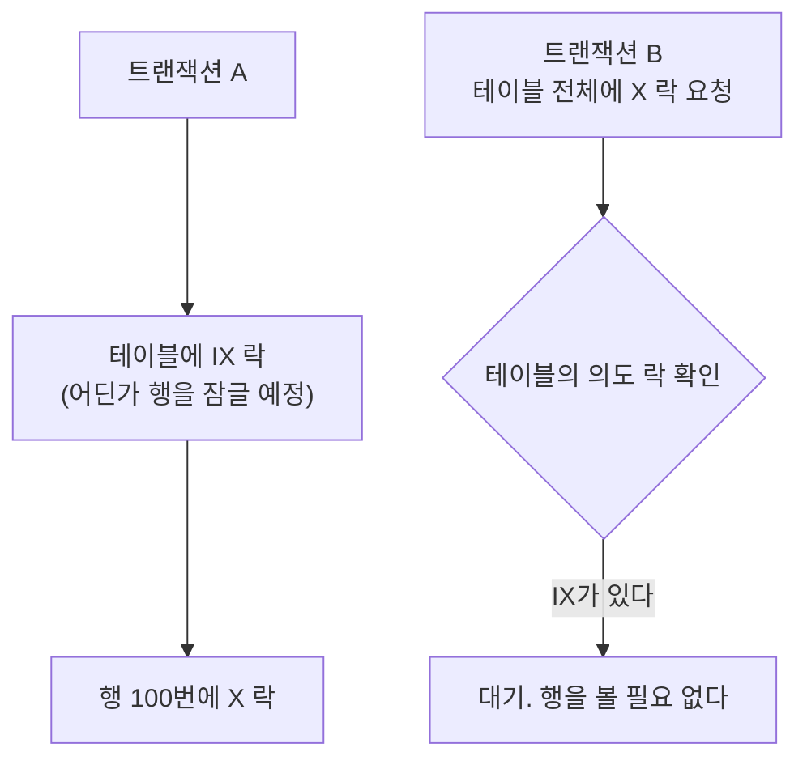
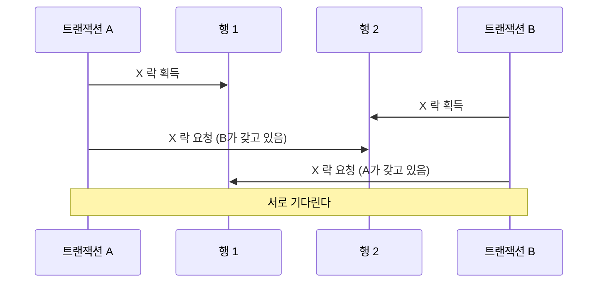

---

title: "Real MySQL 5장을 공식문서로 다시 읽기, 잠금의 종류와 격리 수준"
date: 2025-04-13
categories: [Database, MySQL]
tags: [MySQL, InnoDB, Lock, IsolationLevel, GapLock, NextKeyLock]
layout: post
toc: true
math: true
mermaid: true

---

## 참고자료

- [MySQL 8.0 - InnoDB Transaction Model](https://dev.mysql.com/doc/refman/8.0/en/innodb-transaction-model.html)
- [MySQL 8.0 - InnoDB Locking](https://dev.mysql.com/doc/refman/8.0/en/innodb-locking.html)
- [MySQL 8.0 - Transaction Isolation Levels](https://dev.mysql.com/doc/refman/8.0/en/innodb-transaction-isolation-levels.html)
- [MySQL 8.0 - Consistent Nonlocking Reads](https://dev.mysql.com/doc/refman/8.0/en/innodb-consistent-read.html)
- [MySQL 8.0 - Locking Reads](https://dev.mysql.com/doc/refman/8.0/en/innodb-locking-reads.html)
- [MySQL 8.0 - LOCK TABLES](https://dev.mysql.com/doc/refman/8.0/en/lock-tables.html)
- [MySQL 8.0 - Locking Functions](https://dev.mysql.com/doc/refman/8.0/en/locking-functions.html)
- [MySQL 8.0 - Metadata Locking](https://dev.mysql.com/doc/refman/8.0/en/metadata-locking.html)
- [MySQL 8.0 - Deadlocks in InnoDB](https://dev.mysql.com/doc/refman/8.0/en/innodb-deadlocks.html)

---

## 배경

[앞선 글](/posts/Transaction-Lock/)에서 트랜잭션과 락의 개념을 정리했는데, 공식문서를 읽다 보니 거기서 안 다룬 락이 여럿 더 있었다.

의도 락, 삽입 의도 락, 프레디케이트 락 같은 것들이다. **이름만 봐서는 어디에 쓰이는지 감이 안 잡혔고, 특히 "의도"라는 말이 무슨 뜻인지 몰랐다.**

정리하면서 확인하고 싶었던 것들이다.

- 행을 잠그는데 테이블 락이 왜 함께 필요한가?
- 갭에 여러 트랜잭션이 동시에 락을 걸 수 있다는데 그게 어떻게 락인가?
- 같은 UPDATE 문인데 격리 수준에 따라 왜 차단되고 안 되고가 갈리는가?
- 데드락은 어떻게 감지되고 어느 쪽이 희생되는가?

---

## 5.1 트랜잭션

락 이야기로 들어가기 전에 InnoDB가 트랜잭션을 어떻게 다루는지부터 정리한다.

### 자동 커밋

**MySQL은 기본적으로 문장 하나가 곧 트랜잭션 하나다.** `autocommit`이 켜져 있기 때문이다.

```sql
SELECT @@autocommit;   -- 기본값 1
```

`START TRANSACTION`이나 `BEGIN`을 쓰면 그때부터 명시적으로 묶이고, `COMMIT`이나 `ROLLBACK`까지 하나의 트랜잭션이 된다.

**여기서 착각하기 쉬운 것이 있다.** 자동 커밋이 켜져 있어도 각 문장은 여전히 트랜잭션이다. "트랜잭션을 안 쓴다"가 아니라 "문장마다 자동으로 시작하고 끝난다"는 뜻이다.

### 트랜잭션 시작 시점

`START TRANSACTION`을 실행해도 **그 순간 트랜잭션 ID가 배정되지는 않는다.** 실제로 무언가를 읽거나 쓸 때 배정된다.

읽기만 하는 트랜잭션은 더 가볍게 처리된다. 명시적으로 알려줄 수도 있다.

```sql
START TRANSACTION READ ONLY;
```

**읽기 전용이라고 알려주면 InnoDB가 트랜잭션 ID 배정 같은 준비 작업을 건너뛴다.** 조회만 하는 긴 트랜잭션이 많다면 이 차이가 쌓인다.

### 트랜잭션과 DDL

**DDL은 롤백되지 않는다.** `CREATE TABLE`이나 `ALTER TABLE`을 트랜잭션 안에서 실행하면 **암묵적으로 커밋이 일어난다.**

```sql
START TRANSACTION;
INSERT INTO t VALUES (1);
CREATE TABLE t2 (a INT);   -- 여기서 앞의 INSERT가 커밋된다
ROLLBACK;                  -- 되돌릴 것이 없다
```

마이그레이션 스크립트를 짤 때 이걸 모르면 **롤백했다고 생각한 변경이 남아 있다.**

---

## 5.2 MySQL 엔진의 잠금

MySQL 엔진 레벨에서는 모든 스토리지 엔진에 공통적으로 적용되는 잠금 기능을 제공한다.

### 글로벌 락 (Global Lock)

MySQL에서 제공하는 잠금 중 가장 범위가 큰 잠금이다. `FLUSH TABLES WITH READ LOCK` 명령으로 획득할 수 있으며, 이 잠금이 설정되면 SELECT를 제외한 대부분의 DDL 문장이나 DML 문장을 실행할 수 없다.

주로 백업 작업 시 사용된다.

### 테이블 락 (Table Lock)

테이블 단위로 설정되는 잠금이다. 명시적으로는 `LOCK TABLES table_name [READ | WRITE]` 명령으로 획득할 수 있고, 묵시적으로는 MyISAM이나 MEMORY 테이블에 데이터를 변경하는 쿼리를 실행할 때 자동으로 획득된다.

InnoDB는 대부분의 작업에서 테이블 락이 설정되지 않고 행 단위 잠금을 사용하지만, `ALTER TABLE`과 같은 DDL은 테이블 락을 사용한다.

### 네임드 락 (Named Lock)

사용자가 지정한 문자열에 대해 획득하는 잠금이다. `GET_LOCK()` 함수를 이용해 특정 문자열에 대한 잠금을 획득하고, `RELEASE_LOCK()` 함수로 해제할 수 있다. 이 잠금은 테이블이나 레코드가 아닌

사용자가 지정한 문자열(이름)에 대한 잠금이므로, 여러 클라이언트 간의 상호 동기화를 구현할 때 활용될 수 있다.

### 메타데이터 락 (Metadata Lock)

데이터베이스 객체(테이블, 뷰 등)의 이름이나 구조를 변경하는 경우 획득하는 잠금이다. 명시적으로 획득하거나 해제할 수 있는 방법은 없으며, 데이터베이스 객체에 대한 DDL 작업을 수행할 때 자동으로 획득된다.

이 잠금은 트랜잭션이 테이블 구조를 변경하는 동안 다른 트랜잭션이 해당 테이블을 조회하거나 변경하는 것을 방지한다.

## 5.3 InnoDB 스토리지 엔진 잠금

InnoDB는 MySQL의 기본 스토리지 엔진으로, 다양한 레벨의 잠금을 제공하여 트랜잭션의 일관성과 동시성을 관리한다.

### 공유 락과 배타적 락 (Shared and Exclusive Locks)

InnoDB는 표준 행 수준 잠금을 구현하며, 두 가지 유형의 잠금이 있다:

1. **공유(S) 락**: 잠금을 보유한 트랜잭션이 행을 읽을 수 있게 한다.
2. **배타적(X) 락**: 잠금을 보유한 트랜잭션이 행을 업데이트하거나 삭제할 수 있게 한다.

잠금 호환성:

- 트랜잭션 T1이 행 r에 대한 공유(S) 락을 보유하고 있을 때:
  - 다른 트랜잭션 T2의 S 락 요청은 즉시 승인될 수 있다.
  - 다른 트랜잭션 T2의 X 락 요청은 즉시 승인될 수 없다.
- 트랜잭션 T1이 행 r에 대한 배타적(X) 락을 보유하고 있을 때:
  - 다른 트랜잭션 T2의 어떤 유형의 락 요청도 즉시 승인될 수 없다.

### 의도 락 (Intention Locks)

첫 질문의 답이다. **행을 잠그는데 왜 테이블 락이 함께 필요한가.**

문제 상황부터 본다. 트랜잭션 A가 어떤 테이블의 100만 행 중 한 행에 배타적 락을 걸고 있다. 그때 트랜잭션 B가 그 테이블 전체에 락을 걸려고 한다.

**B는 걸 수 있는지 어떻게 판단하는가.**

의도 락이 없으면 **100만 행을 전부 확인해야 한다.** 하나라도 잠겨 있으면 안 되기 때문이다. 테이블 락을 걸 때마다 이 확인을 하면 감당이 안 된다.

**의도 락은 이 확인을 한 번으로 줄인다.**

행에 락을 걸기 전에 **"이 테이블 안 어딘가의 행을 잠글 것"이라는 표시를 테이블에 먼저 남긴다.** 그게 의도 락이다.



**B는 테이블 수준의 락 정보만 보고 판단한다.** 행을 하나도 안 본다.

| 종류 | 무엇을 뜻하는가 | 언제 걸리는가 |
|---|---|---|
| 의도 공유 락 (IS) | 개별 행에 공유 락을 걸 예정 | `SELECT ... FOR SHARE` |
| 의도 배타적 락 (IX) | 개별 행에 배타적 락을 걸 예정 | `SELECT ... FOR UPDATE`, `UPDATE`, `DELETE` |

**의도 락끼리는 서로 충돌하지 않는다.** IX를 가진 트랜잭션이 여럿이어도 문제가 없다. 각자 다른 행을 잠글 수도 있고, 같은 행이면 그때 행 수준에서 충돌한다.

의도 락이 충돌하는 상대는 **테이블 전체를 잠그려는 요청**뿐이다. 그래서 평소 동시성에는 영향이 없고, `LOCK TABLES`나 DDL이 들어올 때만 의미가 생긴다.

테이블 수준 락 유형 호환성은 다음과 같다:

|    | X  | IX | S  | IS |
|----|----|----|----|----|
| X  | 충돌 | 충돌 | 충돌 | 충돌 |
| IX | 충돌 | 호환 | 충돌 | 호환 |
| S  | 충돌 | 충돌 | 호환 | 호환 |
| IS | 충돌 | 호환 | 호환 | 호환 |

### 레코드 락 (Record Locks)

레코드 락은 인덱스 레코드에 대한 락이다. 예를 들어, `SELECT c1 FROM t WHERE c1 = 10 FOR UPDATE;`는 다른 트랜잭션이 t.c1 값이 10인 행을 삽입, 업데이트 또는 삭제하는 것을 방지한다.

레코드 락은 테이블이 인덱스 없이 정의된 경우에도 항상 인덱스 레코드를 잠근다. 이러한 경우 InnoDB는 숨겨진 클러스터드 인덱스를 생성하고 이 인덱스를 레코드 잠금에 사용한다.

### 갭 락 (Gap Locks)

갭 락은 인덱스 레코드 사이의 갭, 또는 첫 번째 인덱스 레코드 이전이나 마지막 인덱스 레코드 이후의 갭에 대한 락이다. 예를 들어,
`SELECT c1 FROM t WHERE c1 BETWEEN 10 and 20 FOR UPDATE;`는 열 값이 이미 있는지 여부에 관계없이 다른 트랜잭션이 t.c1 열에 15 값을 삽입하는 것을 방지한다.

갭 락은 성능과 동시성 간의 트레이드오프의 일부이며, 일부 트랜잭션 격리 수준에서는 사용되고 다른 수준에서는 사용되지 않는다.

갭 락은 고유한 인덱스를 사용하여 고유 행을 검색하는 문장에는 필요하지 않다.

두 번째 질문이 여기서 나온다. **서로 다른 트랜잭션이 같은 갭에 충돌하는 락을 동시에 가질 수 있다.** 트랜잭션 A가 어떤 갭에 공유 갭 락을 갖고, B가 같은 갭에 배타적 갭 락을 가질 수 있다.

**그러면 그게 어떻게 락인가.**

갭 락이 막는 대상이 무엇인지를 보면 답이 나온다. **갭 락은 다른 갭 락을 막는 것이 아니라 그 갭으로 들어오는 INSERT를 막는다.**

일반적인 락은 "이 자원을 나만 쓰겠다"는 뜻이다. 갭 락은 다르다. **"이 구간이 지금 비어 있다는 사실을 유지하라"는 뜻**에 가깝다.

여러 트랜잭션이 같은 요구를 하는 것은 서로 모순되지 않는다. 다들 "여기는 비어 있어야 한다"고 말하는 것이므로 함께 성립한다. 그래서 충돌하지 않는다.

**막히는 것은 그 요구를 깨는 쪽, 즉 INSERT다.**

갭 락은 READ COMMITTED 격리 수준으로 변경하면 명시적으로 비활성화될 수 있다. 이 경우 검색 및 인덱스 스캔에 대해 갭 락이 비활성화되고 외래 키 제약 조건 검사와 중복 키 검사에만 사용된다.

### 넥스트-키 락 (Next-Key Locks)

넥스트-키 락은 인덱스 레코드에 대한 레코드 락과 인덱스 레코드 이전의 갭에 대한 갭 락의 조합이다.

InnoDB는 테이블 인덱스를 검색하거나 스캔할 때 만나는 인덱스 레코드에 공유 또는 배타적 락을 설정하는 방식으로 행 수준 잠금을 수행한다. 따라서 행 수준 락은 실제로 인덱스 레코드 락이다. 인덱스 레코드에 대한 넥스트-키 락은 해당 인덱스 레코드 "이전의 갭"에도 영향을 미친다.

기본적으로 InnoDB는 REPEATABLE READ 트랜잭션 격리 수준에서 작동한다. 이 경우 InnoDB는 검색 및 인덱스 스캔에 넥스트-키 락을 사용하여 팬텀 행을 방지한다.

### 삽입 의도 락 (Insert Intention Locks)

삽입 의도 락은 행 삽입 전에 INSERT 작업에 의해 설정되는 갭 락의 한 유형이다. 이 락은 동일한 인덱스 갭에 삽입하는 여러 트랜잭션이 갭 내의 동일한 위치에 삽입하지 않는 경우 서로 기다릴 필요가 없음을 알린다.

예를 들어, 값이 4와 7인 인덱스 레코드가 있다고 가정하자.

각각 5와 6 값을 삽입하려는 별도의 트랜잭션은 삽입된 행에 대한 배타적 락을 얻기 전에 삽입 의도 락으로 4와 7 사이의 갭을 잠그지만, 행이 충돌하지 않기 때문에 서로 차단하지 않는다.

### AUTO-INC 락 (AUTO-INC Locks)

AUTO-INC 락은 AUTO_INCREMENT 열이 있는 테이블에 삽입하는 트랜잭션이 취하는 특수 테이블 수준 락이다. 가장 간단한 경우, 한 트랜잭션이 테이블에 값을 삽입하고 있다면, 다른 트랜잭션은 첫 번째
트랜잭션이 삽입한 행이 연속적인 기본 키 값을 받을 수 있도록 자신의 삽입을 하기 위해 기다려야 한다.

`innodb_autoinc_lock_mode` 변수는 자동 증가 잠금에 사용되는 알고리즘을 제어한다. 자동 증가 값의 예측 가능한 시퀀스와 삽입 작업에 대한 최대 동시성 사이에서 트레이드오프를 선택할 수 있다.

### 공간 인덱스를 위한 프레디케이트 락 (Predicate Locks for Spatial Indexes)

InnoDB는 공간 데이터를 포함하는 열의 SPATIAL 인덱싱을 지원한다.

SPATIAL 인덱스를 포함하는 작업의 잠금을 처리하기 위해, 넥스트-키 잠금은 REPEATABLE READ 또는 SERIALIZABLE 트랜잭션 격리 수준을 지원하는 데 잘 작동하지 않는다. 다차원 데이터에는
절대적인 순서 개념이 없어서 어떤 것이 "다음" 키인지 명확하지 않기 때문이다.

SPATIAL 인덱스가 있는 테이블에 대한 격리 수준을 지원하기 위해 InnoDB는 프레디케이트 락을 사용한다. SPATIAL 인덱스는 최소 경계 직사각형(MBR) 값을 포함하므로, InnoDB는 쿼리에 사용된
MBR 값에 프레디케이트 락을 설정하여 인덱스에서 일관된 읽기를 적용한다. 다른 트랜잭션은 쿼리 조건과 일치하는 행을 삽입하거나 수정할 수 없다.

## 잠금 레벨별 비교

| 잠금 유형      | 레벨       | 범위          | 주요 사용 목적                 |
|------------|----------|-------------|--------------------------|
| 글로벌 락      | MySQL 엔진 | 서버 전체       | 백업                       |
| 테이블 락      | MySQL 엔진 | 테이블         | 테이블 구조 변경, MyISAM 데이터 변경 |
| 네임드 락      | MySQL 엔진 | 문자열         | 애플리케이션 레벨 동기화            |
| 메타데이터 락    | MySQL 엔진 | 데이터베이스 객체   | 스키마 변경 보호                |
| 공유/배타적 락   | InnoDB   | 행           | 데이터 읽기/쓰기 제어             |
| 의도 락       | InnoDB   | 테이블         | 테이블과 행 잠금 공존             |
| 레코드 락      | InnoDB   | 인덱스 레코드     | 특정 행 보호                  |
| 갭 락        | InnoDB   | 인덱스 레코드 간 갭 | 팬텀 행 방지                  |
| 넥스트-키 락    | InnoDB   | 레코드 + 갭     | REPEATABLE READ 일관성      |
| 삽입 의도 락    | InnoDB   | 갭           | 삽입 작업 최적화                |
| AUTO-INC 락 | InnoDB   | 테이블         | 자동 증가 값 일관성              |
| 프레디케이트 락   | InnoDB   | 공간 인덱스      | 공간 데이터 일관성               |

---

## 5.4 MySQL의 격리 수준 (Isolation Levels)

### MySQL InnoDB의 격리 수준

InnoDB는 네 가지 트랜잭션 격리 수준을 가지고있다.

1. READ UNCOMMITTED (커밋되지 않은 읽기)
2. READ COMMITTED (커밋된 읽기)
3. REPEATABLE READ (반복 가능한 읽기)
4. SERIALIZABLE (직렬화 가능)

**InnoDB의 기본 격리 수준은 REPEATABLE READ**이다.

### 격리 수준 설정 방법

사용자는 격리 수준을 `SET TRANSACTION` 문을 사용하여 변경할 수 있다. 모든 연결에 대한 서버의 기본 격리 수준을 설정하려면 명령줄이나 옵션 파일에서 `--transaction-isolation`
옵션을 사용하면된다.

```sql
-- 현재 세션에 대한 격리 수준 설정
SET SESSION TRANSACTION ISOLATION LEVEL READ COMMITTED;

-- 서버 전체 기본 격리 수준 설정
SET GLOBAL TRANSACTION ISOLATION LEVEL READ COMMITTED;

-- 현재 값 확인
SELECT @@transaction_isolation, @@global.transaction_isolation;
```

**`SET GLOBAL`은 이미 열려 있는 연결에는 적용되지 않는다.** 그 이후에 새로 맺는 연결부터 적용된다. 서버를 재시작해도 유지하려면 설정 파일에 `transaction-isolation`을 넣어야 한다.

### 격리 수준별 특징

#### REPEATABLE READ (기본값)

이는 InnoDB의 기본 격리 수준이다. 동일한 트랜잭션 내에서의 일관된 읽기는 첫 번째 읽기에 의해 설정된 스냅샷을 읽는다.

즉, 동일한 트랜잭션 내에서 여러 개의 일반(비잠금) SELECT 문을 실행하면 이러한 SELECT 문도 서로 일관성을 유지한다.

잠금 읽기(`SELECT ... FOR UPDATE` 또는 `FOR SHARE`), `UPDATE`, `DELETE` 문의 경우, 잠금은 해당 문이 고유 인덱스와 고유 검색 조건을 사용하는지, 아니면 범위 유형 검색
조건을 사용하는지에 따라 달라진다.

- 고유 검색 조건이 있는 고유 인덱스의 경우, InnoDB는 찾은 인덱스 레코드만 잠그고, 그 앞의 갭은 잠그지 않는다.
- 다른 검색 조건의 경우, InnoDB는 스캔된 인덱스 범위를 잠그고, 갭 락이나 넥스트-키 락을 사용하여 범위에 포함된 갭으로의 다른 세션에 의한 삽입을 차단한다.

#### SERIALIZABLE

이 수준은 REPEATABLE READ와 유사하지만, InnoDB는 자동 커밋이 비활성화된 경우 모든 일반 SELECT 문을 암시적으로 `SELECT ... FOR SHARE`로 변환한다.

자동 커밋이 활성화된 경우, SELECT는 자체 트랜잭션으로 취급한다. 따라서 읽기 전용으로 알려져 있으며, 일관된(비잠금) 읽기로 수행되고 다른 트랜잭션에 대해 차단할 필요가 없다.

#### READ COMMITTED

각각의 일관된 읽기는 트랜잭션 내에서도 자체적인 새로운 스냅샷을 설정하고 읽는다.

잠금 읽기, `UPDATE` 문, `DELETE` 문의 경우, InnoDB는 인덱스 레코드만 잠그고 그 앞의 갭은 잠그지 않으므로 잠긴 레코드 옆에 새 레코드의 삽입을 허용한다.

갭 잠금은 외래키 제약조건 검사와 중복키 검사에만 사용된다. 갭 잠금이 비활성화되어 있기 때문에, 다른 세션이 갭에 새 행을 삽입할 수 있으므로 Phantom Read 문제가 발생할 수 있다.

추가적인 효과:

- `UPDATE` 또는 `DELETE` 문에 대해, InnoDB는 업데이트하거나 삭제하는 행에 대해서만 잠금을 유지한다.
- `UPDATE` 문의 경우, 행이 이미 잠겨 있으면 InnoDB는 "반일관적" 읽기를 수행하여 최신 커밋된 버전을 MySQL에 반환한다.

#### READ UNCOMMITTED

SELECT 문은 비잠금 방식으로 수행되지만, 행의 이전 버전이 사용될 수 있다. 따라서 이 격리 수준을 사용하면 이러한 읽기는 일관성이 없다. 이를 더티 리드(dirty read)라고도 한다. 그 외에는 이 격리
수준은 READ COMMITTED처럼 작동한다.

### 격리 수준 선택 시 고려사항

- **ACID 준수가 중요한 중요 데이터 작업**에는 기본 REPEATABLE READ 수준으로 높은 일관성을 강제할 수 있다.
- 정확한 일관성과 반복 가능한 결과보다 잠금 오버헤드 최소화가 더 중요한 **대량 보고와 같은 상황**에서는 READ COMMITTED나 READ UNCOMMITTED로 일관성 규칙을 완화할 수 있다.
- SERIALIZABLE은 REPEATABLE READ보다 더 엄격한 규칙을 적용하며, 주로 XA 트랜잭션이나 동시성 및 교착 상태 문제 해결과 같은 특수한 상황에서 사용된다.

### 격리 수준별 작동 예시

#### REPEATABLE READ와 READ COMMITTED 비교

다음 예제에서는 인덱스가 없는 테이블에서 두 개의 세션이 UPDATE를 수행할 때 두 격리 수준이 어떻게 다르게 작동하는지 보여준다:

```sql
CREATE TABLE t
(
  a INT NOT NULL,
  b INT
) ENGINE = InnoDB;
INSERT INTO t
VALUES (1, 2),
       (2, 3),
       (3, 2),
       (4, 3),
       (5, 2);
COMMIT;
```

**`b` 컬럼에 인덱스가 없다는 것이 이 예시의 핵심이다.** 인덱스가 없으면 조건에 맞는 행을 찾기 위해 테이블 전체를 훑어야 하고, 훑는 동안 지나가는 행을 전부 잠근다.

**세션 A:**

```sql
START TRANSACTION;
UPDATE t
SET b = 5
WHERE b = 3;
```

**세션 B:**

```sql
UPDATE t
SET b = 4
WHERE b = 2;
```

**REPEATABLE READ(기본값)에서는:**

- 첫 번째 UPDATE는 읽는 각 행에 대해 X-잠금을 획득하고 아무 것도 해제하지 않는다.
- 두 번째 UPDATE는 잠금을 획득하려고 하자마자 차단되며, 첫 번째 UPDATE가 커밋되거나 롤백될 때까지 진행되지 않는다.

**READ COMMITTED에서는:**

- 첫 번째 UPDATE는 읽는 각 행에 대해 X 락을 걸지만, **조건에 안 맞아서 수정하지 않는 행은 곧바로 풀어준다.**
- 두 번째 UPDATE는 반일관적 읽기(semi-consistent read)를 수행한다. **잠긴 행을 만나면 기다리는 대신 언두 로그에서 최신 커밋 버전을 가져와** 조건에 맞는지 먼저 판단한다. 조건에 안 맞으면 잠금을 기다리지 않고 지나간다.

**세 번째 질문의 답이 여기 있다.** 같은 두 문장인데 `REPEATABLE READ`에서는 B가 막히고 `READ COMMITTED`에서는 안 막힌다.

이유가 둘이다. **잠금을 언제 푸는가**와 **잠긴 행을 어떻게 다루는가**다.

| | REPEATABLE READ | READ COMMITTED |
|---|---|---|
| 스캔 중 지나간 행의 락 | 트랜잭션 끝까지 유지 | 조건에 안 맞으면 즉시 해제 |
| 잠긴 행을 만나면 | 기다린다 | 최신 커밋 버전을 읽어 조건부터 확인 |
| 갭 락 | 사용 | 대부분 사용하지 않음 |

**그래서 `READ COMMITTED`가 동시성이 높다.** 대신 같은 트랜잭션 안에서 두 번 읽었을 때 값이 달라질 수 있다는 것을 받아들여야 한다.

---

## 5.5 데드락

네 번째 질문이다.

### 데드락이 생기는 모양

**두 트랜잭션이 서로가 가진 락을 기다리면 영원히 안 풀린다.**



### 어떻게 감지하는가

InnoDB는 **대기 그래프를 만들어서 순환이 생기는지 본다.**

"A가 B를 기다린다"는 관계를 화살표로 그리면 방향 그래프가 되고, **이 그래프에 사이클이 있으면 데드락이다.**

감지되면 InnoDB가 **한쪽을 골라서 강제로 롤백한다.** 그러면 다른 쪽이 진행할 수 있다.

```text
ERROR 1213 (40001): Deadlock found when trying to get lock; try restarting transaction
```

### 어느 쪽이 희생되는가

**되돌리는 비용이 적은 쪽**이다. 변경한 행 수가 적고, 언두 로그를 덜 쓴 트랜잭션이 골라진다.

에러 메시지가 `try restarting transaction`인 이유가 여기 있다. **데드락은 예외가 아니라 정상적으로 일어날 수 있는 일이고, 애플리케이션이 재시도하는 것이 전제**다.

```java
@Retryable(
    retryFor = { DeadlockLoserDataAccessException.class },
    maxAttempts = 3,
    backoff = @Backoff(delay = 100, multiplier = 2)
)
@Transactional
public void updateOrder(Long id) { ... }
```

**즉시 재시도하면 또 부딪힐 수 있으므로 간격을 두는 편이 낫다.**

### 어떻게 줄이는가

**락을 거는 순서를 맞춘다.** 여러 행을 잠가야 한다면 항상 같은 순서로 잠근다. 앞의 예시에서 A와 B가 둘 다 행 1을 먼저 잠갔다면 데드락이 안 생긴다.

```java
// ID 순으로 정렬해서 잠근다
ids.stream().sorted().forEach(this::lockAndUpdate);
```

**트랜잭션을 짧게 만든다.** 잠근 상태로 오래 있을수록 부딪힐 확률이 올라간다.

**인덱스를 제대로 건다.** 인덱스가 없으면 풀 스캔하면서 필요 없는 행까지 잠그므로 충돌 범위가 넓어진다.

**격리 수준을 낮추는 것도 방법이다.** `READ COMMITTED`는 갭 락을 대부분 안 쓰므로 충돌 지점이 줄어든다.

### 무엇이 부딪혔는지 보기

```sql
SHOW ENGINE INNODB STATUS;
```

출력의 `LATEST DETECTED DEADLOCK` 절에 **마지막 데드락의 양쪽 트랜잭션이 어떤 문장을 실행 중이었고 어떤 락을 갖고 기다렸는지**가 그대로 나온다.

기록을 계속 남기려면 이걸 켠다.

```sql
SET GLOBAL innodb_print_all_deadlocks = ON;
```

**에러 로그에 모든 데드락이 남는다.** 운영 중에 간헐적으로 나는 데드락을 추적할 때 필요하다.

---

## 정리하며

처음 던진 질문들에 대한 답이다.

**행을 잠그는데 테이블 락이 왜 함께 필요한가.** 누군가 테이블 전체를 잠그려 할 때 100만 행을 다 확인하지 않으려는 것이다. 행을 잠그기 전에 테이블에 "어딘가 행을 잠글 것"이라는 의도 락을 남겨두면, 테이블 락 요청은 그 표시 하나만 보고 판단할 수 있다. 의도 락끼리는 충돌하지 않으므로 평소 동시성에는 영향이 없다.

**갭에 여러 트랜잭션이 동시에 락을 걸 수 있는 이유.** 갭 락이 막는 것은 다른 갭 락이 아니라 그 구간으로 들어오는 INSERT다. "이 구간이 비어 있어야 한다"는 요구를 여럿이 동시에 하는 것은 서로 모순되지 않는다.

**같은 UPDATE가 격리 수준에 따라 갈리는 이유.** `REPEATABLE READ`는 스캔하면서 지나간 행의 락을 트랜잭션 끝까지 들고 있고, `READ COMMITTED`는 조건에 안 맞는 행의 락을 즉시 푼다. 그리고 `READ COMMITTED`는 잠긴 행을 만나도 기다리지 않고 최신 커밋 버전을 읽어 조건부터 확인한다.

**데드락 감지와 희생자 선택.** 대기 관계를 그래프로 만들어 사이클이 생기는지 본다. 감지되면 되돌리는 비용이 적은 쪽을 롤백한다. 에러 메시지가 재시도를 권하는 것처럼, 데드락은 완전히 없앨 대상이 아니라 애플리케이션이 재시도로 흡수해야 하는 것이다.

공식문서를 따라가면서 얻은 것은 **락의 종류가 많은 이유**였다. 처음에는 왜 이렇게 세분화했는지 몰랐는데, 각각이 "무엇을 확인하는 비용을 줄이려고" 또는 "무엇을 허용하려고" 있는 것이었다. 의도 락은 확인 비용을 줄이고, 삽입 의도 락은 서로 다른 위치의 INSERT를 동시에 허용하고, 프레디케이트 락은 순서 개념이 없는 공간 데이터에서 같은 보장을 하려는 것이었다.

