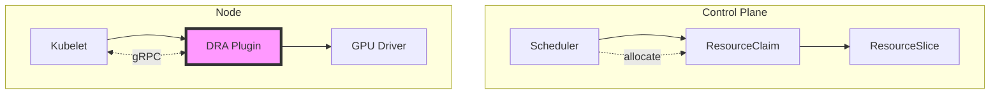
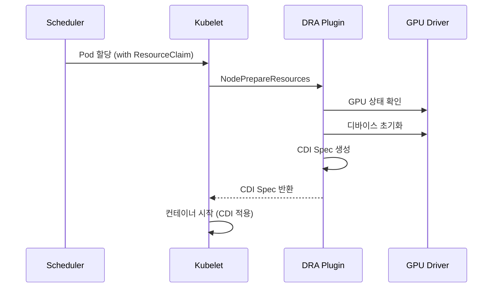
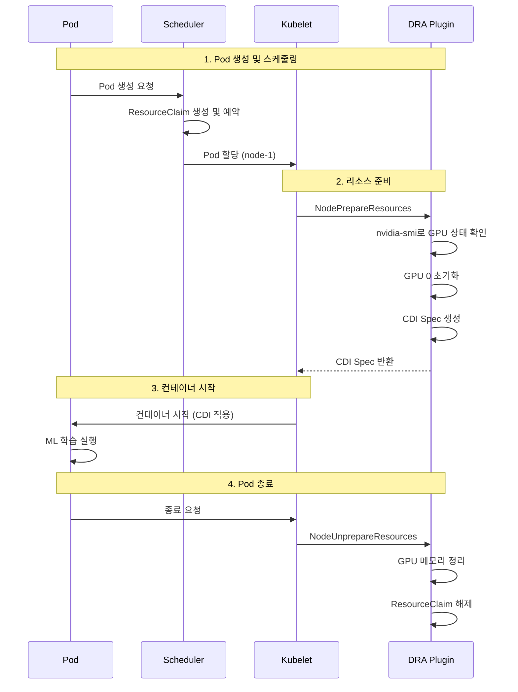
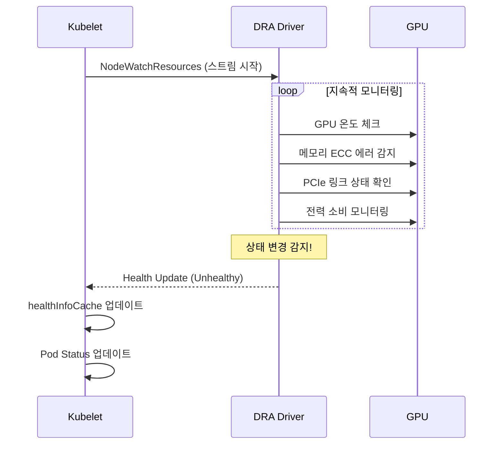

---

title: Kubernetes DRA Plugin gRPC 연결 관리 개선기  
date: 2025-12-20  
categories: [Kubernetes, DRA]  
tags: [Kubernetes, DRA, gRPC, Kubelet, DevOps, Infrastructure]  
layout: post  
toc: true  
math: true  
mermaid: true

---

## 개요

최근 Kubernetes 오픈소스 프로젝트에 기여한 [PR #133964](https://github.com/kubernetes/kubernetes/pull/133964)가 v1.36 마일스톤에 병합되었다.

이 글에서는 DRA(Dynamic Resource Allocation) 플러그인의 gRPC 연결 관리 방식을 개선한 과정과 그 배경을 다룬다.

## Dynamic Resource Allocation(DRA)란?

### DRA의 등장 배경

Dynamic Resource Allocation(DRA)은 Kubernetes v1.26에서 알파로 도입되어 v1.34에서 GA를 목표로 하는 기능이다.

GPU, TPU, FPGA와 같은 특수 하드웨어 리소스를 Pod에 동적으로 할당하는 새로운 API를 제공한다.

### 기존 Device Plugin의 한계

기존 Device Plugin 프레임워크는 다음과 같은 제약이 있다.

- **표현력 부족**: 디바이스 수량만 보고 가능하고, 특정 속성이나 기능은 표현 불가
- **할당 제약**: 단일 컨테이너에 전체 디바이스만 할당 가능 (부분 할당 불가)
- **공유 불가**: 리소스 공유 메커니즘 미지원
- **정적 관리**: 정적 보고 방식으로 동적 변경 대응 어려움

### DRA의 주요 개념

DRA는 PersistentVolume/PersistentVolumeClaim과 유사한 선언적 모델을 사용한다.

```yaml
# DeviceClass: GPU 종류와 같이 디바이스 카테고리 정의
apiVersion: resource.k8s.io/v1alpha3
kind: DeviceClass
metadata:
  name: nvidia-gpu
spec:
  selectors:
  - cel:
      expression: device.driver == "nvidia.com"
```

**주요 리소스 타입**:

- **DeviceClass**: GPU 종류와 같이 디바이스 카테고리 정의
- **ResourceClaim**: 특정 하드웨어를 요청하는 티켓 (여러 Pod이 공유 가능)
- **ResourceClaimTemplate**: 각 Pod마다 전용 ResourceClaim 자동 생성
- **ResourceSlice**: 노드별 사용 가능한 디바이스 정보를 동적으로 광고

### DRA 아키텍처



DRA 드라이버는 두 가지 컴포넌트로 구성된다.

1. **Controller Component**: 중앙에서 실행되며 ResourceSlice 관리
2. **Kubelet Plugin Component**: 각 노드에서 DaemonSet으로 실행되며 gRPC 인터페이스 구현

Kubelet은 DRA 플러그인과 gRPC 통신을 통해 리소스 생명주기를 관리한다.

## DRA API와 Health API의 역할

DRA 플러그인은 kubelet과 통신하기 위해 두 가지 주요 gRPC API를 구현한다. 이 API들은 서로 다른 목적을 가지고 있지만, 동일한 gRPC 연결을 공유한다.

### DRA API (Core Resource Management)

DRA API는 디바이스의 **생명주기 관리**를 담당하는 주요 인터페이스이다.

#### NodePrepareResources

Pod가 특정 노드에 스케줄링된 후, 실제로 시작하기 전에 호출된다.

```protobuf
// pkg/kubelet/apis/dra/v1/api.proto
service Node {
    rpc NodePrepareResources(NodePrepareResourcesRequest) 
        returns (NodePrepareResourcesResponse) {}
}

message NodePrepareResourcesRequest {
    repeated Claim claims = 1;
}
```

**동작 흐름**:



**주요 작업**:

1. **디바이스 검증 및 확보**

- 요청된 GPU가 실제로 사용 가능한지 확인
- 다른 Pod가 사용 중이지 않은지 검증

2. **하드웨어 초기화**

- GPU 메모리 초기화
- PCIe 링크 구성
- CUDA 컨텍스트 설정

3. **CDI Spec 생성**

- 컨테이너가 접근할 디바이스 파일 정의
- 환경 변수 설정
- 마운트 포인트 정의

4. **권한 및 네임스페이스 설정**

- cgroup 설정
- device 파일 권한 구성

**CDI Spec 예시** (NVIDIA GPU):

```yaml
devices:
  - name: gpu0
    containerEdits:
      deviceNodes:
        - path: /dev/nvidia0
          type: c
          major: 195
          minor: 0
      env:
        - NVIDIA_VISIBLE_DEVICES=GPU-abc123
        - CUDA_DEVICE_ORDER=PCI_BUS_ID
      mounts:
        - hostPath: /usr/lib/x86_64-linux-gnu/libnvidia-ml.so
          containerPath: /usr/lib/x86_64-linux-gnu/libnvidia-ml.so
```

#### NodeUnprepareResources

Pod가 종료될 때 호출되어 리소스를 정리하고 다른 Pod에서 사용할 수 있도록 해제한다.

**주요 작업**:

1. **디바이스 정리**

- GPU 메모리 해제
- 실행 중인 CUDA 프로세스 종료
- 하드웨어 상태 리셋

2. **리소스 해제**

- ResourceClaim 예약 해제
- 다른 Pod 할당 가능 상태로 전환

3. **메타데이터 정리**

- 사용 기록 업데이트
- 모니터링 메트릭 정리

#### 실제 사용 시나리오

AI 모델 학습 워크로드 예시

```yaml
apiVersion: v1
kind: Pod
metadata:
  name: ml-training
spec:
  containers:
  - name: trainer
    image: tensorflow/tensorflow:latest-gpu
    resources:
      claims:
      - name: gpu-claim
  resourceClaims:
  - name: gpu-claim
    resourceClaimTemplateName: gpu-template
```

**실행 흐름**:



### Health API (Device Monitoring)

Health API는 Kubernetes v1.34에서 알파로 도입된 기능으로, **디바이스 상태 모니터링**을 담당한다. 하드웨어 장애를 실시간으로 감지하고 Pod 상태에 반영한다.

#### NodeWatchResources (Server Streaming)

DRA 드라이버가 kubelet에게 디바이스 상태를 지속적으로 스트리밍한다.

```protobuf
// pkg/kubelet/apis/dra/dra-health/v1alpha1/api.proto
service DRAResourceHealth {
    rpc NodeWatchResources(NodeWatchResourcesRequest) 
        returns (stream NodeWatchResourcesResponse) {}
}

message ResourceHealth {
    string resource_id = 1;      // GPU 식별자
    HealthStatus health = 2;     // Healthy/Unhealthy/Unknown
}

enum HealthStatus {
    HEALTH_STATUS_UNSPECIFIED = 0;
    HEALTH_STATUS_HEALTHY = 1;
    HEALTH_STATUS_UNHEALTHY = 2;
    HEALTH_STATUS_UNKNOWN = 3;
}
```

**모니터링 흐름**:



### 전체 흐름

1. Pod 생성 요청
2. Scheduler가 ResourceClaim 할당
3. **NodePrepareResources (DRA API)** - GPU 준비 및 초기화
4. Pod 시작
5. **NodeWatchResources (Health API)** - 백그라운드 모니터링 시작
6. 정상 실행...
7. [선택] 장애 발생 시

- Health Update: Unhealthy
- Pod Status 업데이트
- 운영자 개입 또는 자동 복구

8. Pod 종료
9. **NodeUnprepareResources (DRA API)** - GPU 정리 및 해제

## 문제가 됐던 코드

이번 PR에서 해결하려는 주요 문제는 `getOrCreateGRPCConn()` 메서드에 있다.

### 문제 코드 구조

```go
// pkg/kubelet/cm/dra/plugin/dra_plugin.go (변경 전)

// DRA API 호출 시 매번 연결 확인
func (p *DRAPlugin) NodePrepareResources(ctx context.Context, 
    req *drapbv1.NodePrepareResourcesRequest) (*drapbv1.NodePrepareResourcesResponse, error) {
    
    conn, err := p.getOrCreateGRPCConn()  // 매번 연결 확인
    if err != nil {
        return nil, err
    }
    
    // DRA v1 클라이언트를 매번 새로 생성
    client := drapbv1.NewDRAPluginClient(conn)
    return client.NodePrepareResources(ctx, req)
}

// Health API 호출 - 지연 초기화 패턴
func (p *DRAPlugin) GetResourceHealthStatus(ctx context.Context, 
    req *drahealthv1alpha1.GetResourceHealthStatusRequest) (*drahealthv1alpha1.GetResourceHealthStatusResponse, error) {
    
    conn, err := p.getOrCreateGRPCConn()  // 또 다른 연결 관리
    if err != nil {
        return nil, err
    }
    
    // Lazy initialization - 여기서 healthClient가 nil일 수 있음!
    if p.healthClient == nil {
        p.healthClient = drahealthv1alpha1.NewDRAResourceHealthClient(conn)
    }
    return p.healthClient.GetResourceHealthStatus(ctx, req)
}

// 문제가 되는 연결 관리 로직
func (p *DRAPlugin) getOrCreateGRPCConn() (*grpc.ClientConn, error) {
    p.mu.Lock()
    defer p.mu.Unlock()
    
    if p.conn != nil {
        return p.conn, nil
    }
    
    // deprecated API 사용
    conn, err := grpc.Dial(p.endpoint, 
        grpc.WithInsecure(),
        grpc.WithBlock(),  // 차단 동작
        grpc.WithTimeout(connectionTimeout))
    
    if err != nil {
        return nil, err
    }
    
    p.conn = conn
    return conn, nil
}
```

### 주요 문제점

#### 1. 이중 연결 패턴

**DRA API**: 매번 `getOrCreateGRPCConn()` 호출 후 새로운 클라이언트 생성  
**Health API**: 별도의 lazy initialization으로 healthClient 관리

두 API가 같은 연결을 사용하지만 완전히 다른 방식으로 관리되어 일관성이 없었다.

#### 2. Lazy Initialization의 문제 시나리오

**시나리오 1: Race Condition**

```go
// Thread 1
func (p *DRAPlugin) GetResourceHealthStatus() {
    conn, _ := p.getOrCreateGRPCConn()
    if p.healthClient == nil {  // Check
        // Thread 2가 여기서 끼어들 수 있음
        p.healthClient = NewClient(conn)  // Initialize
    }
}

// Thread 2 (동시 실행)
func (p *DRAPlugin) GetResourceHealthStatus() {
    conn, _ := p.getOrCreateGRPCConn()
    if p.healthClient == nil {  // Check - 여전히 nil
        p.healthClient = NewClient(conn)  // 중복 초기화
    }
}
```

여러 고루틴이 동시에 호출하면 healthClient가 여러 번 생성될 수 있다.

**시나리오 2: 연결 재생성 후 클라이언트 불일치**

```go
// 1. 초기 연결 및 healthClient 생성
p.conn = grpc.Dial(endpoint)
p.healthClient = NewHealthClient(p.conn)  // conn#1 사용

// 2. 연결 끊김 발생
p.conn.Close()
p.conn = nil

// 3. DRA API 호출 - 새 연결 생성
conn, _ := p.getOrCreateGRPCConn()  // conn#2 생성
client := NewDRAPluginClient(conn)   // conn#2 사용

// 4. Health API 호출 - 문제 발생!
if p.healthClient == nil {  // false! (이미 존재)
    // 이 블록이 실행되지 않음
}
// p.healthClient는 여전히 닫힌 conn#1을 참조
return p.healthClient.GetHealthStatus()  // ERROR: connection closed
```

연결이 재생성되어도 healthClient는 이전의 닫힌 연결을 계속 참조하게 된다.

**시나리오 3: 초기화 시점 불확실성**

```go
// kubelet 시작 시
plugin := NewDRAPlugin(endpoint)
// healthClient는 아직 nil

// 몇 분 후 첫 Health 체크
plugin.GetResourceHealthStatus()  // 여기서 처음 초기화
// 만약 이 시점에 네트워크 문제가 있다면?
// healthClient는 계속 nil로 남을 수 있음

// 이후 DRA API는 정상 동작
plugin.NodePrepareResources()  // OK

// 하지만 Health API는 여전히 실패
plugin.GetResourceHealthStatus()  // healthClient == nil!
```

**시나리오 4: 메모리 누수 가능성**

```go
// 반복적인 연결 재생성
for {
    conn, _ := p.getOrCreateGRPCConn()
    
    // healthClient는 이전 연결 참조
    if p.healthClient == nil {
        p.healthClient = NewClient(conn)
    }
    
    // 연결 끊김
    conn.Close()
    p.conn = nil
    
    // 새 연결 생성되지만 healthClient는 교체되지 않음
    // 이전 healthClient가 참조하는 닫힌 연결들이 메모리에 누적
}
```

#### 3. Deprecated API 사용

`grpc.Dial`은 gRPC v1.64부터 deprecated되었으며, `grpc.NewClient`로 마이그레이션이 권장된다.

```go
// Deprecated
conn, err := grpc.Dial(endpoint, 
    grpc.WithInsecure(),
    grpc.WithBlock())  // 연결 확립까지 차단

// 권장 방식
conn, err := grpc.NewClient(endpoint,
    grpc.WithTransportCredentials(insecure.NewCredentials()))
// 실제 RPC 호출 시점에 연결 시도 (lazy connection)
```

`grpc.Dial`의 `WithBlock` 옵션은 연결이 확립될 때까지 블로킹하여 초기화 시간을 지연시킬 수 있다.

## 해결 방안: 연결 관리 코드 통합

### 새로운 아키텍처

```go
// pkg/kubelet/cm/dra/plugin/dra_plugin.go (변경 후)

type DRAPlugin struct {
    endpoint string
    conn     *grpc.ClientConn
    
    // 모든 클라이언트를 사전 생성
    draV1Client       drapbv1.DRAPluginClient
    draV1Beta1Client  drapbv1beta1.DRAPluginClient
    healthClient      drahealthv1alpha1.DRAResourceHealthClient
    
    mu sync.RWMutex
}

// 플러그인 등록 시 즉시 연결 및 모든 클라이언트 생성
func (p *DRAPlugin) Register(registrar pluginregistration.PluginRegistrar) error {
    if err := p.ensureConnection(); err != nil {
        return err
    }
    // 연결 성공 후 즉시 모든 클라이언트 생성
    p.createAllClients()
    return registrar.Register(p)
}

// 단일 연결 관리 메서드
func (p *DRAPlugin) ensureConnection() error {
    p.mu.Lock()
    defer p.mu.Unlock()
    
    if p.conn != nil {
        return nil
    }
    
    // 최신 API 사용
    conn, err := grpc.NewClient(p.endpoint,
        grpc.WithTransportCredentials(insecure.NewCredentials()))
    if err != nil {
        return err
    }
    
    p.conn = conn
    return nil
}

// 모든 클라이언트 즉시 생성
func (p *DRAPlugin) createAllClients() {
    p.mu.Lock()
    defer p.mu.Unlock()
    
    // 한 번에 모든 클라이언트 생성 - lazy initialization 제거
    p.draV1Client = drapbv1.NewDRAPluginClient(p.conn)
    p.draV1Beta1Client = drapbv1beta1.NewDRAPluginClient(p.conn)
    p.healthClient = drahealthv1alpha1.NewDRAResourceHealthClient(p.conn)
}

// DRA API - 사전 생성된 클라이언트 재사용
func (p *DRAPlugin) NodePrepareResources(ctx context.Context, 
    req *drapbv1.NodePrepareResourcesRequest) (*drapbv1.NodePrepareResourcesResponse, error) {
    
    p.mu.RLock()
    client := p.draV1Client  // 단순 참조
    p.mu.RUnlock()
    
    return client.NodePrepareResources(ctx, req)
}

// Health API - 사전 생성된 클라이언트 재사용
func (p *DRAPlugin) GetResourceHealthStatus(ctx context.Context, 
    req *drahealthv1alpha1.GetResourceHealthStatusRequest) (*drahealthv1alpha1.GetResourceHealthStatusResponse, error) {
    
    p.mu.RLock()
    client := p.healthClient  // 단순 참조, nil 체크 불필요!
    p.mu.RUnlock()
    
    return client.GetResourceHealthStatus(ctx, req)
}
```

### Before vs After 비교

```
[Before]
┌─────────────────────────────────────────────┐
│ DRA API 호출                                │
│  1. getOrCreateGRPCConn() 호출              │
│  2. Lock 획득/해제                          │
│  3. 연결 확인                               │
│  4. 새로운 클라이언트 생성 (매번 수행)          │
│  5. RPC 호출                                │
└─────────────────────────────────────────────┘

┌─────────────────────────────────────────────┐
│ Health API 호출                             │
│  1. getOrCreateGRPCConn() 호출              │
│  2. Lock 획득/해제                          │
│  3. healthClient nil 체크                   │
│  4. 조건부 클라이언트 생성 (race 가능)      │
│  5. RPC 호출                                │
└─────────────────────────────────────────────┘

문제: 
- 두 API가 다른 연결 관리 패턴
- 매번 오버헤드 발생
- Race condition 가능성
- 연결 재생성 시 불일치

[After]
┌─────────────────────────────────────────────┐
│ 플러그인 초기화 (한 번만)                   │
│  1. ensureConnection()                      │
│  2. createAllClients()                      │
│     - draV1Client 생성                      │
│     - draV1Beta1Client 생성                 │
│     - healthClient 생성                     │
└─────────────────────────────────────────────┘

┌─────────────────────────────────────────────┐
│ 모든 API 호출 (DRA, Health 동일)            │
│  1. RLock 획득                              │
│  2. 사전 생성된 클라이언트 참조             │
│  3. RUnlock                                 │
│  4. RPC 호출                                │
└─────────────────────────────────────────────┘

개선:
- 단일 연결 관리 패턴
- 초기화 비용만 한 번 발생
- Race condition 불가능
- 일관된 상태 보장
```

## 주요 변경 사항

### 1. 성능 향상

- 매번 클라이언트를 생성하는 오버헤드 제거
- Read lock만 사용하여 동시성 향상
- 연결 확인 로직 단순화

### 2. 안정성 개선

- Race condition 원천 차단
- 연결과 클라이언트 상태 일관성 보장
- nil 참조 가능성 제거

### 3. 유지보수성

- 단일 연결 관리 패턴으로 코드 이해도 향상
- 디버깅 용이성 증가
- 향후 확장 용이

### 4. 최신 표준 준수

- gRPC 최신 권장사항 적용
- Deprecated API 제거

## 참고 자료

- **PR**: [kubernetes/kubernetes#133964](https://github.com/kubernetes/kubernetes/pull/133964)
- **관련 이슈**: [kubernetes/kubernetes#133943](https://github.com/kubernetes/kubernetes/issues/133943)
- **DRA 공식 문서**: [Dynamic Resource Allocation](https://kubernetes.io/docs/concepts/scheduling-eviction/dynamic-resource-allocation/)
- **DRA Health Status KEP**: [KEP-4680](https://github.com/kubernetes/enhancements/issues/4680)
- **Health Status 블로그**: [Kubernetes v1.34: Pods Report DRA Resource Health](https://kubernetes.io/blog/2025/09/17/kubernetes-v1-34-pods-report-dra-resource-health/)
- **Kubernetes v1.36 마일스톤**
- **SIG Node 승인 완료**: 2025년 12월 18일
