## 1. 컨테이너 이전의 세계

### 1.1 전통적인 배포 방식의 한계

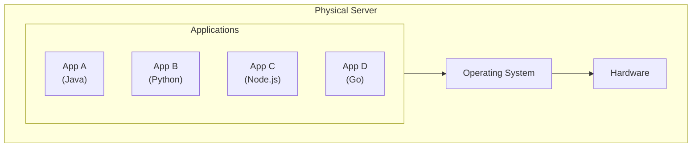

**문제점:**
- **리소스 충돌**: App A가 리소스를 독점하면 다른 앱이 영향받음
- **의존성 충돌**: 서로 다른 버전의 라이브러리 필요 시 충돌
- **확장성 제한**: 하나의 앱을 확장하려면 전체 서버 증설 필요
- **배포 복잡성**: 앱마다 다른 환경 설정 필요

### 1.2 가상화의 등장과 한계

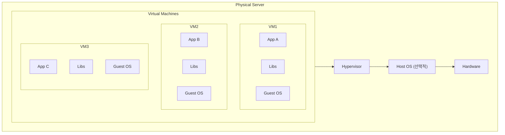

**개선된 점:**
- 애플리케이션 격리
- 독립적인 확장 가능

**여전한 한계:**
- 각 VM마다 전체 OS 필요 → 리소스 오버헤드
- 부팅 시간이 분 단위
- OS 라이선스 비용
- 이미지 크기가 GB 단위

### 1.3 컨테이너의 혁신

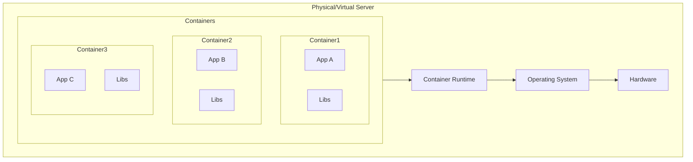

**컨테이너의 핵심 기술 (Linux 기반):**

| 기술 | 역할 | 상세 설명 |
|------|------|----------|
| **Namespace** | 격리 | PID, Network, Mount, UTS, IPC, User 등 6가지 네임스페이스로 프로세스 격리 |
| **Cgroups** | 리소스 제한 | CPU, Memory, I/O, Network 대역폭 제한 |
| **Union FS** | 이미지 레이어 | OverlayFS, AUFS 등을 통한 효율적인 이미지 관리 |

### 1.4 Linux 격리 기술 심화

컨테이너의 격리는 세 가지 핵심 Linux 기술로 구현된다:

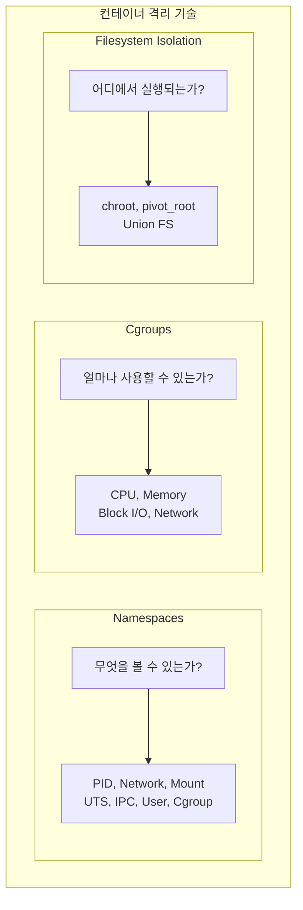

#### Namespace 종류별 역할

| Namespace | 격리 대상 | 컨테이너에서의 역할 |
|-----------|----------|-------------------|
| **PID** | 프로세스 ID | 컨테이너 내부에서 PID 1부터 시작, 다른 컨테이너 프로세스 안 보임 |
| **Network** | 네트워크 스택 | 독립된 IP, 포트, 라우팅 테이블, iptables 규칙 |
| **Mount** | 파일시스템 마운트 | 컨테이너별 독립된 파일시스템 뷰 |
| **UTS** | 호스트명, 도메인 | 컨테이너마다 다른 hostname 설정 가능 |
| **IPC** | 프로세스 간 통신 | 공유 메모리, 세마포어 격리 |
| **User** | UID/GID | 컨테이너 내 root가 호스트에서는 일반 사용자로 매핑 (보안 강화) |

#### Cgroups v1 vs v2

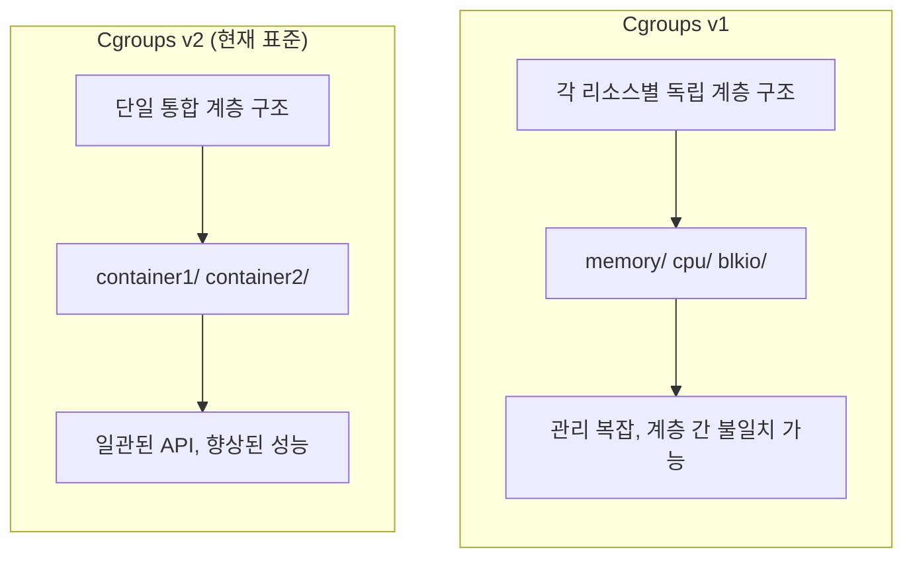

**주요 Cgroup 컨트롤러:**
- **Memory**: `memory.max` (최대 사용량), OOM Killer 제어
- **CPU**: `cpu.max` (할당량), `cpu.weight` (가중치)
- **I/O**: `io.max` (대역폭/IOPS 제한)

### 1.5 컨테이너 런타임 표준

#### OCI (Open Container Initiative)

컨테이너 이미지 포맷과 런타임 실행 방식을 표준화한 업계 공통 규약이다.

| 표준 | 역할 |
|------|------|
| **Runtime Spec** | 컨테이너를 어떻게 실행할지 (config.json) |
| **Image Spec** | 이미지를 어떻게 패키징할지 (레이어, 매니페스트) |
| **Distribution Spec** | 이미지를 어떻게 배포할지 (Registry API) |

#### CRI (Container Runtime Interface)

Kubernetes가 다양한 컨테이너 런타임과 통신하기 위한 표준 API다.

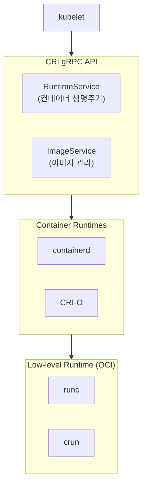

#### containerd vs CRI-O

| 특성 | containerd | CRI-O |
|------|-----------|-------|
| **범위** | 범용 (Docker, K8s 모두 지원) | Kubernetes 전용 |
| **기원** | Docker에서 분리됨 | Red Hat/CNCF 프로젝트 |
| **특징** | 모듈화, 플러그인 아키텍처 | 경량, 최소 권한 원칙 |
| **사용처** | GKE, EKS, Docker Desktop | OpenShift, 일부 K8s 배포판 |

> **dockershim 제거**: Kubernetes 1.24부터 dockershim이 제거되어 Docker Engine 직접 사용이 불가능하다. 대신 containerd나 CRI-O를 사용하며, 기존 Docker 이미지는 OCI 표준이므로 그대로 사용 가능하다.

**VM vs Container 비교:**

| 구분 | VM | Container |
|------|-----|-----------|
| 부팅 시간 | 분 단위 | 초 단위 (밀리초 가능) |
| 이미지 크기 | GB 단위 | MB 단위 |
| 격리 수준 | 하드웨어 레벨 (강함) | OS 레벨 (상대적으로 약함) |
| 오버헤드 | 높음 (전체 OS) | 낮음 (프로세스 수준) |
| 밀도 | 서버당 수십 개 | 서버당 수백~수천 개 |

---

## 2. 컨테이너 오케스트레이션이 필요한 이유

### 2.1 단일 컨테이너에서 발생하는 문제

컨테이너 하나를 실행하는 것은 간단하다:

```bash
docker run -d -p 80:80 nginx
```

하지만 프로덕션 환경에서는 다음 질문들에 답해야 한다:

1. **가용성**: 컨테이너가 죽으면 누가 재시작하는가?
2. **확장성**: 트래픽이 증가하면 어떻게 스케일 아웃하는가?
3. **배포**: 새 버전을 무중단으로 어떻게 배포하는가?
4. **네트워킹**: 여러 컨테이너가 서로 어떻게 통신하는가?
5. **스토리지**: 컨테이너가 재시작되면 데이터는?
6. **설정 관리**: 환경별로 다른 설정을 어떻게 관리하는가?
7. **보안**: 컨테이너 간 네트워크 격리는?
8. **리소스**: 컨테이너별 CPU, 메모리 제한은?

### 2.2 수동 관리의 한계

100개의 마이크로서비스를 10개의 서버에서 운영한다고 가정하면:

```
문제 상황들:
- Server 3이 다운됨 → 해당 서버의 컨테이너들을 다른 서버로 이동 필요
- App X의 트래픽 급증 → 어느 서버에 추가 인스턴스를 띄울지 결정 필요
- App Y 업데이트 → 100개 인스턴스를 순차적으로 업데이트 필요
- 새벽 2시 장애 발생 → 수동 대응 필요
```

**수동 관리의 문제:**
- 24/7 운영팀 필요
- 휴먼 에러 발생 가능성
- 스케일링에 시간 소요
- 일관성 유지 어려움

### 2.3 오케스트레이터의 역할

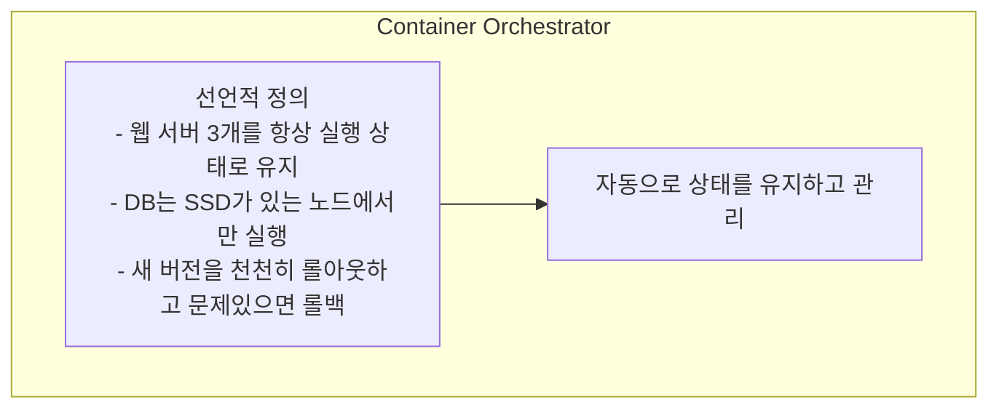

**오케스트레이터가 제공하는 기능:**

| 기능 | 설명 |
|------|------|
| 스케줄링 | 어느 노드에 컨테이너를 배치할지 결정 |
| 자동 복구 | 장애 발생 시 자동으로 컨테이너 재시작 |
| 스케일링 | 수요에 따라 자동으로 인스턴스 수 조절 |
| 로드 밸런싱 | 트래픽을 여러 인스턴스에 분산 |
| 롤링 업데이트 | 무중단 배포 지원 |
| 서비스 디스커버리 | 컨테이너 간 통신 자동화 |
| 설정 관리 | 환경 변수, 시크릿 중앙 관리 |
| 스토리지 관리 | 영속적 스토리지 연결 |

---

## 3. Kubernetes 소개

### 3.1 Kubernetes란?

> **원문 ([kubernetes.io - What is Kubernetes?](https://kubernetes.io/docs/concepts/overview/what-is-kubernetes/)):**
> Kubernetes is a portable, extensible, open source platform for managing containerized workloads and services, that facilitates both declarative configuration and automation.

**번역:** Kubernetes는 컨테이너화된 워크로드와 서비스를 관리하기 위한 이식 가능하고 확장 가능한 오픈 소스 플랫폼으로, 선언적 구성과 자동화를 모두 용이하게 한다.

> **원문 ([kubernetes.io - What is Kubernetes?](https://kubernetes.io/docs/concepts/overview/what-is-kubernetes/)):**
> Kubernetes provides you with a framework to run distributed systems resiliently. It takes care of scaling and failover for your application, provides deployment patterns, and more.

**번역:** Kubernetes는 분산 시스템을 탄력적으로 실행하기 위한 프레임워크를 제공한다. 애플리케이션의 스케일링과 장애 조치를 처리하고, 배포 패턴 등을 제공한다.

> 이름의 유래: 그리스어로 "조타수(helmsman)" 또는 "파일럿"을 의미한다. K8s는 K와 s 사이에 8글자가 있어서 붙여진 약어다.

### 3.2 Kubernetes의 역사

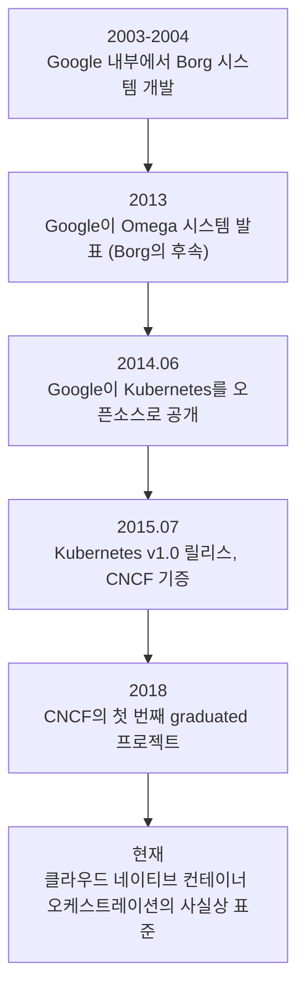

**Google의 경험:**
- Borg: Google 내부에서 15년 이상 운영
- 매주 수십억 개의 컨테이너 실행
- 이 경험이 Kubernetes 설계에 녹아있음

### 3.3 왜 Kubernetes가 표준이 되었나?

**경쟁 솔루션들:**

| 솔루션 | 특징 | 현재 상태 |
|--------|------|----------|
| Docker Swarm | Docker 네이티브, 단순함 | 축소됨 |
| Apache Mesos | 대규모 분산 시스템 | DC/OS와 함께 사용 감소 |
| HashiCorp Nomad | 가벼움, 다양한 워크로드 | 특정 분야에서 활용 |
| **Kubernetes** | 풍부한 기능, 생태계 | **사실상 표준** |

**Kubernetes가 승리한 이유:**
1. **Google의 경험**: 15년간의 대규모 운영 노하우
2. **오픈소스 & 커뮤니티**: 벤더 종속 없음, 활발한 생태계
3. **확장성**: CRD, Operator 등을 통한 무한 확장 가능
4. **클라우드 지원**: 모든 주요 클라우드에서 관리형 서비스 제공 (EKS, GKE, AKS)
5. **생태계**: Helm, Prometheus, Istio 등 풍부한 도구

### 3.4 Kubernetes의 핵심 철학

**1. 선언적(Declarative) 설정**

```yaml
# 명령형(Imperative): "nginx 컨테이너 3개를 실행해라"
kubectl scale deployment nginx --replicas=3

# 선언형(Declarative): "nginx 컨테이너가 3개인 상태를 원한다"
apiVersion: apps/v1
kind: Deployment
metadata:
  name: nginx
spec:
  replicas: 3  # 원하는 상태(Desired State)
  ...
```

**선언적 방식의 장점:**
- 현재 상태와 원하는 상태의 차이를 Kubernetes가 자동으로 해결
- 설정을 Git으로 버전 관리 가능 (GitOps)
- 멱등성(Idempotent): 같은 설정을 여러 번 적용해도 결과가 동일

**2. 자가 치유(Self-healing)**

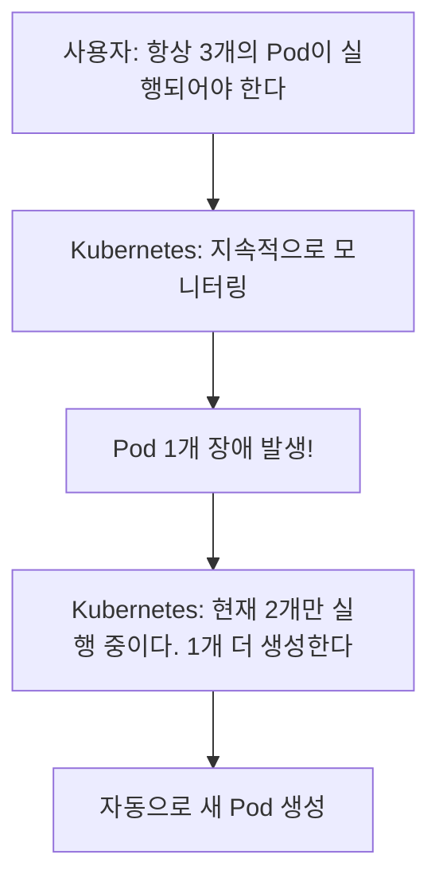

**3. 불변 인프라(Immutable Infrastructure)**
- 컨테이너는 수정하지 않고 교체
- 업데이트 = 기존 컨테이너 삭제 + 새 컨테이너 생성
- 일관성과 재현성 보장

---

## 4. Kubernetes 기본 개념 미리보기

다음 포스트들에서 자세히 다루지만, 전체 그림을 이해하기 위해 주요 개념을 미리 소개한다.

### 4.1 클러스터 구성

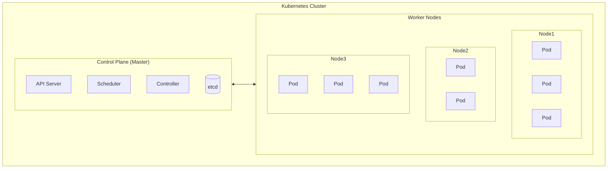

### 4.2 핵심 리소스 요약

| 리소스 | 역할 |
|--------|------|
| **Pod** | 컨테이너 실행 단위 |
| **Deployment** | Pod의 선언적 관리 |
| **Service** | Pod에 대한 네트워크 접근 |
| **ConfigMap** | 설정 데이터 저장 |
| **Secret** | 민감 정보 저장 |
| **PersistentVolume** | 영속적 스토리지 |

### 4.3 Kubernetes의 동작 흐름 (간략)

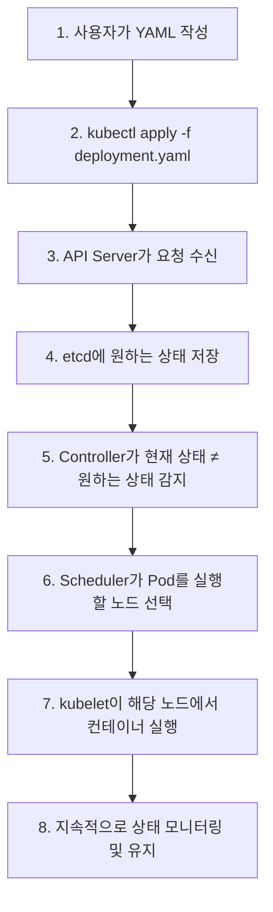

---

## 5. 면접 빈출 질문

### Q1. Docker와 Kubernetes의 관계를 설명해라

Docker는 컨테이너 런타임으로, 개별 컨테이너를 생성하고 실행하는 도구다. Kubernetes는 오케스트레이터로, 여러 노드에 걸쳐 다수의 컨테이너를 관리한다.

비유하자면, Docker는 화물을 담는 컨테이너 박스이고, Kubernetes는 수천 개의 컨테이너를 관리하는 항만 시스템이다.

실제로 Kubernetes는 Docker뿐만 아니라 containerd, CRI-O 등 다양한 컨테이너 런타임을 지원한다. Kubernetes 1.24부터는 dockershim이 제거되어, Docker를 직접 사용하는 대신 containerd를 주로 사용한다.

### Q2. 왜 Kubernetes를 사용하는가? Docker Compose로 충분하지 않은가?

Docker Compose는 단일 호스트에서 여러 컨테이너를 정의하고 실행하는 도구다. 개발 환경이나 소규모 배포에는 적합하지만, 프로덕션 환경의 요구사항을 충족하기 어렵다.

Kubernetes가 필요한 이유:
1. **고가용성**: 노드 장애 시 자동 복구
2. **수평 확장**: 여러 노드에 걸친 스케일 아웃
3. **서비스 디스커버리**: 동적으로 변하는 Pod IP를 자동 관리
4. **롤링 업데이트/롤백**: 무중단 배포
5. **리소스 관리**: 클러스터 전체의 리소스 최적화

단, 모든 상황에 Kubernetes가 필요한 것은 아니다. 단일 서버, 소규모 팀, 간단한 애플리케이션에서는 오버킬일 수 있다.

### Q3. 선언적(Declarative) 방식과 명령형(Imperative) 방식의 차이는?

**명령형**: "무엇을 어떻게 할지" 지시 (절차적)
- `kubectl run nginx --image=nginx`
- `kubectl scale deployment nginx --replicas=5`

**선언형**: "최종 상태가 무엇인지" 선언
- `kubectl apply -f nginx-deployment.yaml`
- YAML에 원하는 상태를 정의하고 Kubernetes가 알아서 달성

선언적 방식의 장점:
1. **버전 관리**: YAML 파일을 Git으로 관리 (GitOps)
2. **재현성**: 동일한 파일로 동일한 환경 구성
3. **자가 치유**: 상태가 변경되면 자동으로 복구

CKA 시험에서는 시간 절약을 위해 명령형을 사용하지만, 실무에서는 선언적 방식이 권장된다.

### Q4. Kubernetes를 사용하면서 겪을 수 있는 어려움은?

1. **학습 곡선**: 개념이 많고 복잡함
2. **운영 복잡성**: Control Plane 관리, 업그레이드, 모니터링
3. **네트워킹**: CNI, Ingress, NetworkPolicy 이해 필요
4. **디버깅 어려움**: 여러 계층(Pod, Service, Ingress)을 확인해야 함
5. **리소스 오버헤드**: 작은 팀/프로젝트에는 과할 수 있음

이를 완화하기 위해:
- 관리형 서비스(EKS, GKE, AKS) 사용 검토
- 점진적 도입 (처음부터 모든 기능 사용하지 않음)
- 팀 내 교육 및 문서화

---

## 6. 실습: Kubernetes 환경 구성

### 6.1 로컬 환경 선택

| 도구 | 특징 | 추천 대상 |
|------|------|----------|
| **minikube** | 가장 오래된 도구, 다양한 드라이버 지원 | 일반적인 학습 |
| **kind** | Docker 컨테이너로 클러스터 생성, 빠름 | CI/CD, 테스트 |
| **k3s** | 경량 Kubernetes, ARM 지원 | 엣지, IoT, 리소스 제한 환경 |
| **Docker Desktop** | 가장 간편, GUI 제공 | macOS/Windows 사용자 |

### 6.2 minikube 설치 및 시작

```bash
# macOS (Homebrew)
brew install minikube

# Linux
curl -LO https://storage.googleapis.com/minikube/releases/latest/minikube-linux-amd64
sudo install minikube-linux-amd64 /usr/local/bin/minikube

# Windows (Chocolatey)
choco install minikube

# 클러스터 시작
minikube start

# 상태 확인
minikube status
```

### 6.3 kubectl 설치

```bash
# macOS
brew install kubectl

# Linux
curl -LO "https://dl.k8s.io/release/$(curl -L -s https://dl.k8s.io/release/stable.txt)/bin/linux/amd64/kubectl"
chmod +x kubectl
sudo mv kubectl /usr/local/bin/

# 설치 확인
kubectl version --client
```

### 6.4 첫 번째 명령어 실행

```bash
# 클러스터 정보 확인
kubectl cluster-info

# 노드 확인
kubectl get nodes

# 모든 네임스페이스의 Pod 확인
kubectl get pods -A
```

**예상 출력:**
```
NAME       STATUS   ROLES           AGE   VERSION
minikube   Ready    control-plane   1m    v1.28.0
```

---

## 정리

### 주요 개념 체크리스트

- 컨테이너가 VM보다 가벼운 이유 (Namespace, Cgroups)
- 컨테이너 오케스트레이션이 필요한 이유
- Kubernetes의 선언적 철학
- 자가 치유(Self-healing)의 의미

### 다음 포스트

[Part 2: Kubernetes 아키텍처](/posts/kubernetes-02-architecture)에서는 Control Plane과 Worker Node의 각 컴포넌트를 상세히 다룬다.

---

## 참고 자료

- [Kubernetes 공식 문서 - 개요](https://kubernetes.io/docs/concepts/overview/)
- [What is Kubernetes?](https://kubernetes.io/docs/concepts/overview/what-is-kubernetes/)
- [Borg, Omega, and Kubernetes (Google 논문)](https://research.google/pubs/pub44843/)
- [CNCF Kubernetes 프로젝트](https://www.cncf.io/projects/kubernetes/)

