## 1. Kubernetes 클러스터 전체 아키텍처

> **원문 ([kubernetes.io - Cluster Architecture](https://kubernetes.io/docs/concepts/architecture/)):**
> A Kubernetes cluster consists of a set of worker machines, called nodes, that run containerized applications. Every cluster has at least one worker node.

**번역:** Kubernetes 클러스터는 컨테이너화된 애플리케이션을 실행하는 노드라고 불리는 워커 머신 집합으로 구성된다. 모든 클러스터에는 최소한 하나의 워커 노드가 있다.

> **원문 ([kubernetes.io - Cluster Architecture](https://kubernetes.io/docs/concepts/architecture/)):**
> The control plane manages the worker nodes and the Pods in the cluster. In production environments, the control plane usually runs across multiple computers and a cluster usually runs multiple nodes, providing fault-tolerance and high availability.

**번역:** 컨트롤 플레인은 클러스터의 워커 노드와 Pod를 관리한다. 프로덕션 환경에서 컨트롤 플레인은 일반적으로 여러 컴퓨터에서 실행되며 클러스터는 일반적으로 여러 노드를 실행하여 내결함성과 고가용성을 제공한다.

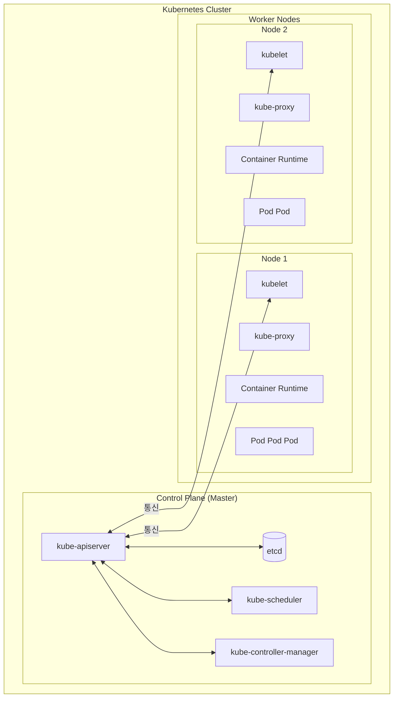

**주요 개념:**
- **Control Plane (Master)**: 클러스터 전체를 관리하고 조정하는 두뇌 역할
- **Worker Node**: 실제 애플리케이션(Pod)이 실행되는 곳
- **클러스터**: Control Plane + Worker Nodes의 집합

---

## 2. Control Plane 컴포넌트

### 2.1 kube-apiserver

**역할**: Kubernetes의 관문(Gateway)이자 중앙 통신 허브다.

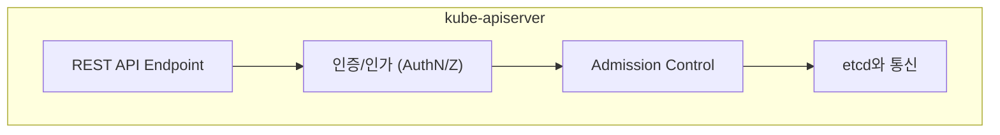

**특징:**
- 모든 컴포넌트는 API Server를 통해서만 통신한다
- **etcd와 직접 통신하는 유일한 컴포넌트**
- 수평 확장 가능 (HA 구성 시 여러 인스턴스 운영)
- RESTful API 제공 (kubectl, 다른 도구들이 사용)

**API 요청 처리 흐름:**
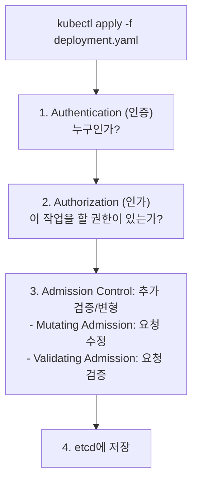

**API Server 포트:**
- **6443**: HTTPS (기본, 프로덕션)
- **8080**: HTTP (비권장, 인증 없음)
- 방화벽에서 6443 포트가 열려있어야 kubectl 접근 가능

```bash
# API Server 상태 확인
kubectl cluster-info

# 사용 가능한 API 리소스
kubectl api-resources

# API 버전 확인
kubectl api-versions

# API Server 로그 확인 (Static Pod인 경우)
kubectl logs -n kube-system kube-apiserver-<node-name>
```

### 2.2 etcd

**역할**: 클러스터의 모든 상태를 저장하는 분산 키-값 저장소다.

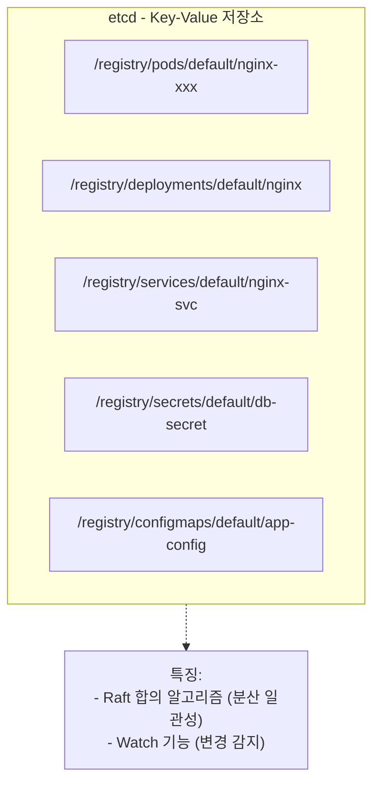

**저장되는 데이터:**
- 모든 Kubernetes 오브젝트 (Pod, Service, Deployment, ...)
- 클러스터 설정
- Secret (암호화 권장)
- RBAC 정책

**Raft 합의 알고리즘 (HA 구성 시):**

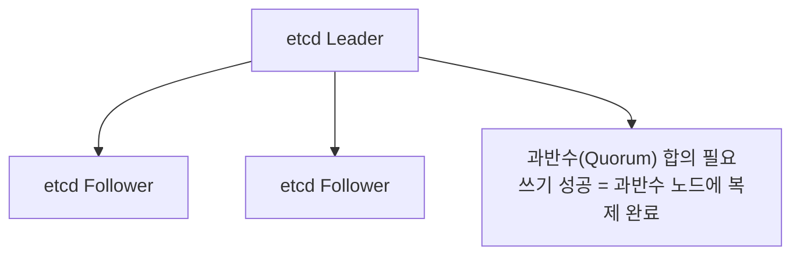

**etcd 노드 수와 장애 허용:**

| etcd 노드 수 | Quorum | 장애 허용 노드 수 |
|-------------|--------|------------------|
| 1 | 1 | 0 |
| 3 | 2 | 1 |
| 5 | 3 | 2 |
| 7 | 4 | 3 |

> **왜 홀수인가?**
> - 짝수는 비효율적이다 (4노드와 3노드의 장애 허용이 동일)
> - 네트워크 파티션 시 정확히 반으로 나뉘면 양쪽 모두 Quorum 불만족

**etcd 백업/복구 (CKA 필수):**

```bash
# etcd 스냅샷 생성
ETCDCTL_API=3 etcdctl snapshot save snapshot.db \
  --endpoints=https://127.0.0.1:2379 \
  --cacert=/etc/kubernetes/pki/etcd/ca.crt \
  --cert=/etc/kubernetes/pki/etcd/server.crt \
  --key=/etc/kubernetes/pki/etcd/server.key

# 스냅샷 상태 확인
ETCDCTL_API=3 etcdctl snapshot status snapshot.db

# 스냅샷 복원
ETCDCTL_API=3 etcdctl snapshot restore snapshot.db \
  --data-dir=/var/lib/etcd-restored
```

**etcd 성능 고려사항:**
- SSD 사용 강력 권장 (I/O 집약적)
- 네트워크 지연이 낮아야 함 (Raft 합의)
- 대규모 클러스터에서는 별도 etcd 클러스터 권장

### 2.3 kube-scheduler

**역할**: 새로 생성된 Pod를 어느 노드에 배치할지 결정한다.

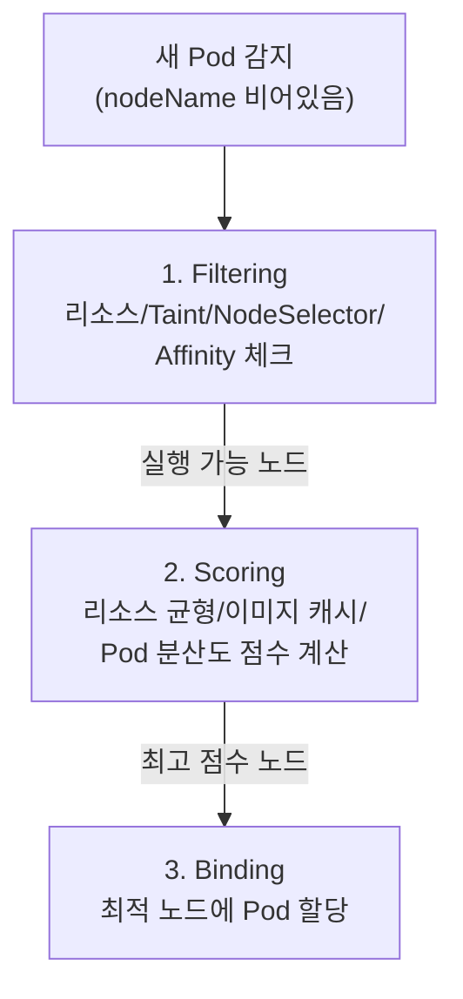

**스케줄링 고려 요소:**

| 단계 | 체크 항목 |
|------|----------|
| Filtering | 노드 리소스(CPU, Memory), Taint/Toleration, NodeSelector, Affinity, PV 위치 |
| Scoring | 리소스 균형, 이미지 캐시, Pod 분산, 선호도 가중치 |

**스케줄러가 노드를 못 찾는 경우:**

```bash
# Pod 상태 확인
kubectl describe pod <pod-name>
# Events 섹션에서 "FailedScheduling" 원인 확인

# 일반적인 원인:
# - Insufficient cpu/memory
# - 0/3 nodes are available: 3 node(s) had taints that the pod didn't tolerate
# - 0/3 nodes are available: 3 node(s) didn't match node selector
```

### 2.4 kube-controller-manager

**역할**: 여러 컨트롤러를 실행하여 클러스터 상태를 원하는 상태로 유지한다.

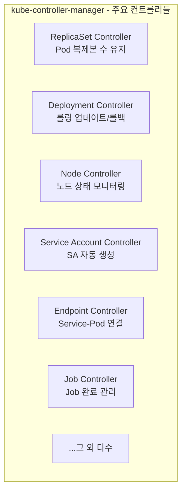

**주요 컨트롤러:**

| 컨트롤러 | 역할 |
|---------|------|
| ReplicaSet Controller | 지정된 수의 Pod 복제본 유지 |
| Deployment Controller | Deployment의 롤아웃/롤백 관리 |
| StatefulSet Controller | StatefulSet Pod의 순서와 고유성 관리 |
| DaemonSet Controller | 모든(또는 일부) 노드에 Pod 배포 |
| Job Controller | Job 실행 및 완료 관리 |
| Node Controller | 노드 상태 모니터링, 장애 감지 |
| Service Account Controller | 네임스페이스에 기본 SA 생성 |
| Endpoint Controller | Service와 Pod 연결 |

**Control Loop 패턴:**
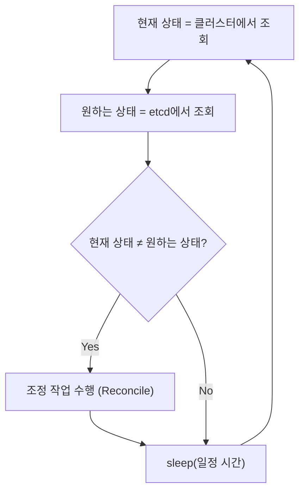

**Node Controller 타이밍:**
- `--node-monitor-period`: 노드 상태 확인 주기 (기본 5초)
- `--node-monitor-grace-period`: 노드를 NotReady로 표시하기 전 대기 시간 (기본 40초)
- `--pod-eviction-timeout`: NotReady 노드에서 Pod 퇴거 시작 시간 (기본 5분)

### 2.5 cloud-controller-manager (선택적)

**역할**: 클라우드 프로바이더 특정 기능을 Kubernetes와 연결한다.

**담당 기능:**
- LoadBalancer 타입 Service → 클라우드 로드밸런서 생성
- Node 삭제 시 클라우드 인스턴스 정리
- 클라우드 특정 라우팅 설정

---

## 3. Worker Node 컴포넌트

### 3.1 kubelet

**역할**: 각 노드에서 Pod를 실제로 실행하고 관리하는 에이전트다.

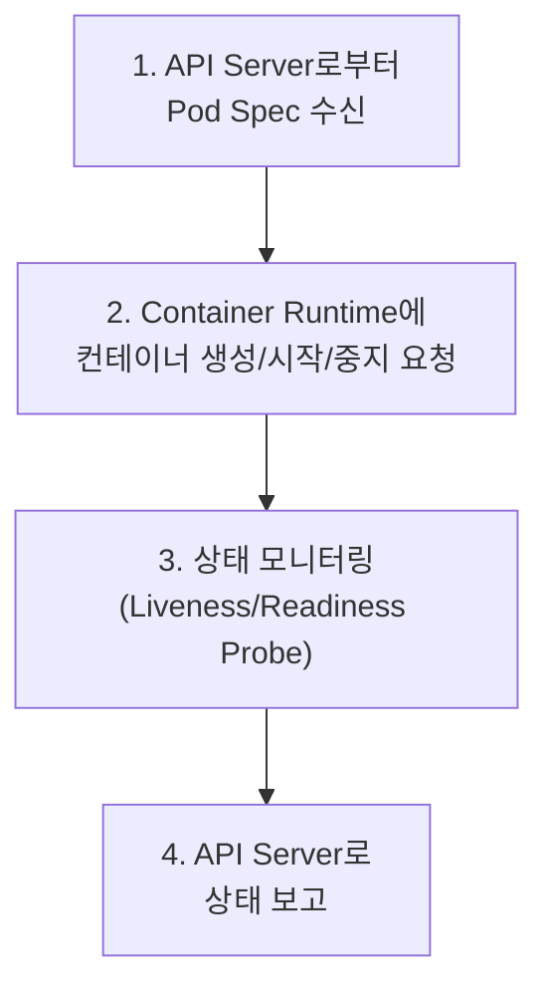

**주요 기능:**
- Pod 생명주기 관리 (생성, 시작, 중지, 삭제)
- Container Runtime과 CRI(Container Runtime Interface)를 통해 통신
- Liveness/Readiness/Startup Probe 실행
- 볼륨 마운트
- 노드 및 Pod 상태를 API Server에 보고
- Static Pod 관리

**CRI (Container Runtime Interface):**
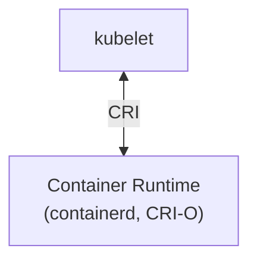

> **Docker와 Kubernetes**
> - Kubernetes 1.24부터 **dockershim 제거**
> - Docker는 내부적으로 containerd를 사용
> - 직접 containerd를 사용하는 것이 권장됨
> - 기존 Docker 이미지는 계속 사용 가능 (OCI 표준)

**kubelet은 Static Pod가 아니다:**
- kubelet은 systemd 서비스로 실행
- Pod 형태가 아니므로 `kubectl logs`로 확인 불가

```bash
# kubelet 상태 확인
systemctl status kubelet

# kubelet 로그 확인
journalctl -u kubelet -f

# kubelet 설정 확인
cat /var/lib/kubelet/config.yaml

# 노드 상태 확인
kubectl get nodes
kubectl describe node <node-name>
```

### 3.2 kube-proxy

**역할**: Service에 대한 네트워크 규칙을 관리하여 Pod 간 통신을 지원한다.

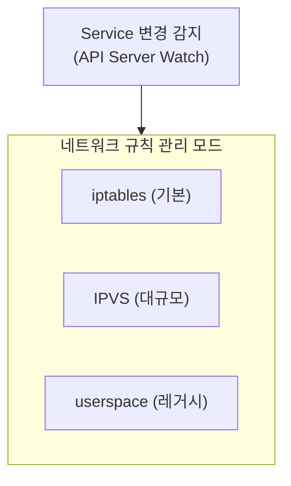

**동작 모드 비교:**

| 모드 | 동작 방식 | 장점 | 단점 |
|------|----------|------|------|
| **iptables** (기본) | iptables 규칙으로 트래픽 전달 | 설정 간단, 안정적 | 대규모에서 느림 |
| **IPVS** | Linux Virtual Server 사용 | 대규모에서 빠름, 다양한 알고리즘 | 설정 복잡 |
| **userspace** | 프록시 프로세스 경유 | 레거시 호환 | 성능 낮음 (비권장) |

**iptables vs IPVS 성능:**
- Service 개수가 적을 때: 큰 차이 없음
- Service 1000개 이상: IPVS가 현저히 빠름
- IPVS는 O(1) 복잡도, iptables는 O(n)

```bash
# kube-proxy 모드 확인
kubectl logs -n kube-system -l k8s-app=kube-proxy | grep "Using"

# 또는 ConfigMap 확인
kubectl get cm kube-proxy -n kube-system -o yaml | grep mode

# Service에 연결이 안 될 때
# - kube-proxy가 정상 동작하는지 확인
# - iptables 규칙 확인: iptables -t nat -L KUBE-SERVICES
# - Endpoint 확인: kubectl get endpoints <service-name>
```

### 3.3 Container Runtime

**역할**: 실제로 컨테이너를 실행하는 소프트웨어다.

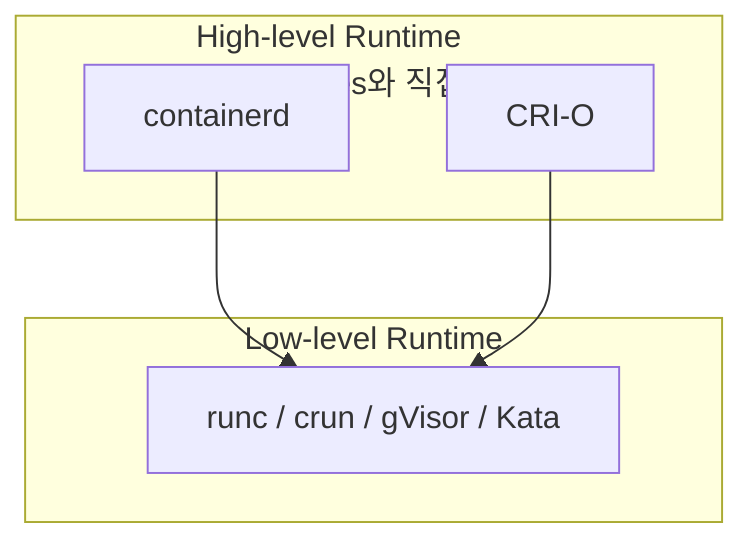

**Container Runtime 비교:**

| Runtime | 특징 | 사용 사례 |
|---------|------|----------|
| **containerd** | Docker에서 분리, CNCF 프로젝트, 가장 널리 사용 | 일반적인 프로덕션 |
| **CRI-O** | Kubernetes 전용, 경량 | OpenShift, 경량 환경 |
| **Docker Engine** | 1.24 이후 직접 지원 X (containerd 사용) | 레거시 |

```bash
# 노드의 Container Runtime 확인
kubectl get nodes -o wide
# CONTAINER-RUNTIME 열에서 확인 가능
```

---

## 4. 컴포넌트 간 상호작용

### 4.1 Pod 생성 흐름

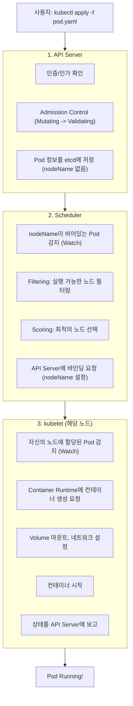

### 4.2 Watch 메커니즘

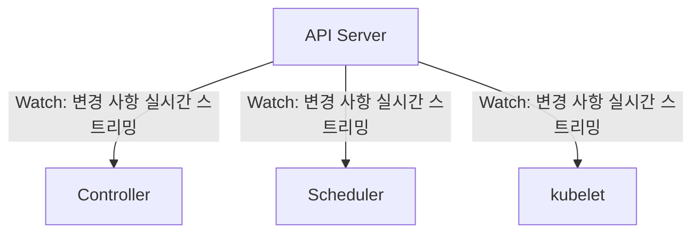

**Watch의 장점:**
- Polling보다 효율적 (변경 시에만 알림)
- 실시간 반응 가능
- API Server 부하 감소

```bash
# Pod 변경 실시간 모니터링
kubectl get pods -w

# Events 실시간 확인
kubectl get events -w
```

---

## 5. 고가용성(HA) 구성

### 5.1 Control Plane HA

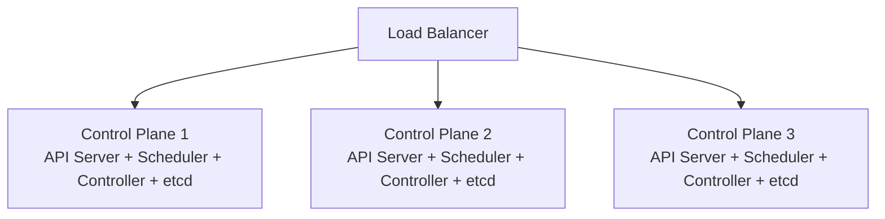

**HA 구성 고려사항:**

| 컴포넌트 | HA 방식 |
|---------|--------|
| API Server | 모두 Active (Load Balancer 뒤) |
| Scheduler | Leader Election (1개만 Active) |
| Controller Manager | Leader Election (1개만 Active) |
| etcd | Raft 합의 (모두 참여, 1개가 Leader) |

**Leader Election:**
```bash
# 현재 리더 확인
kubectl get endpoints kube-scheduler -n kube-system -o yaml
kubectl get endpoints kube-controller-manager -n kube-system -o yaml

# holderIdentity 필드에서 현재 리더 확인 가능
```

### 5.2 etcd 토폴로지

**Stacked etcd (기본):**
- etcd가 Control Plane 노드에 함께 위치
- 관리 단순화
- 단점: Control Plane 노드 장애 = etcd 노드 장애

**External etcd:**
- etcd 클러스터를 별도 운영
- 더 높은 복원력
- 관리 복잡도 증가

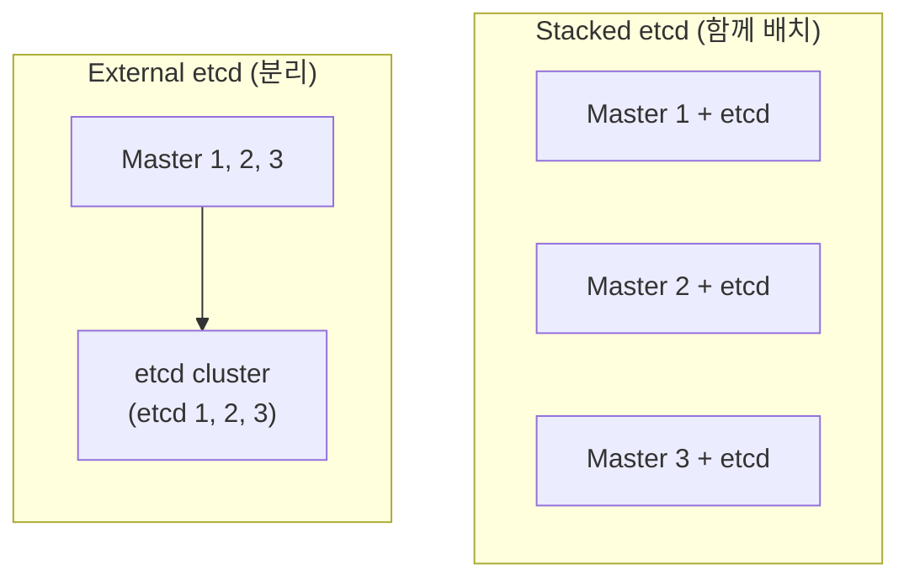

---

## 6. Static Pod (CKA 필수)

### 6.1 Static Pod란?

- kubelet이 직접 관리하는 Pod
- API Server 없이도 실행 가능
- Control Plane 컴포넌트 배포에 사용 (kubeadm 방식)

**Static Pod 경로:**
```bash
# kubelet 설정에서 확인
cat /var/lib/kubelet/config.yaml | grep staticPodPath
# 기본값: /etc/kubernetes/manifests

# Static Pod 매니페스트 위치
ls /etc/kubernetes/manifests/
# etcd.yaml  kube-apiserver.yaml  kube-controller-manager.yaml  kube-scheduler.yaml
```

### 6.2 Static Pod 특징

| 특징 | 설명 |
|------|------|
| 관리 주체 | kubelet (API Server X) |
| Mirror Pod | API Server에 읽기 전용 복사본 생성 |
| 삭제 방법 | 매니페스트 파일 삭제/이동 |
| 수정 방법 | 매니페스트 파일 직접 수정 |
| 이름 형식 | `<pod-name>-<node-name>` |

### 6.3 CKA 실습 - Static Pod 생성

```bash
# 1. Static Pod 경로 확인
cat /var/lib/kubelet/config.yaml | grep staticPodPath

# 2. Static Pod 매니페스트 생성
cat <<EOF > /etc/kubernetes/manifests/static-nginx.yaml
apiVersion: v1
kind: Pod
metadata:
  name: static-nginx
spec:
  containers:
  - name: nginx
    image: nginx
    ports:
    - containerPort: 80
EOF

# 3. Pod 확인 (자동 생성됨)
kubectl get pods -A | grep static-nginx
# static-nginx-<node-name> 형태로 표시

# 4. Static Pod 삭제
rm /etc/kubernetes/manifests/static-nginx.yaml
```

---

## 7. 트러블슈팅: 컴포넌트별 문제 해결

### 7.1 API Server 문제

```bash
# API Server 상태 확인
kubectl get pods -n kube-system -l component=kube-apiserver

# 로그 확인
kubectl logs -n kube-system kube-apiserver-<node>

# 일반적인 문제:
# - 인증서 만료
# - etcd 연결 실패
# - OOM (메모리 부족)
```

### 7.2 Scheduler 문제

```bash
# Scheduler 상태 확인
kubectl get pods -n kube-system -l component=kube-scheduler

# Pod가 Pending 상태일 때
kubectl describe pod <pod-name>
# Events 섹션에서 FailedScheduling 원인 확인

# 일반적인 원인:
# - Insufficient cpu/memory
# - node(s) had taints that the pod didn't tolerate
# - node(s) didn't match node selector
```

### 7.3 kubelet 문제

```bash
# kubelet 상태 확인
systemctl status kubelet

# kubelet 로그
journalctl -u kubelet -f

# 노드 상태 확인
kubectl describe node <node-name>
# Conditions 섹션 확인

# 일반적인 문제:
# - Container Runtime 연결 실패
# - 인증서 문제
# - 디스크 공간 부족
```

### 7.4 etcd 문제

```bash
# etcd 상태 확인 (Static Pod인 경우)
kubectl get pods -n kube-system -l component=etcd

# etcd 클러스터 상태
ETCDCTL_API=3 etcdctl endpoint status --cluster \
  --cacert=/etc/kubernetes/pki/etcd/ca.crt \
  --cert=/etc/kubernetes/pki/etcd/server.crt \
  --key=/etc/kubernetes/pki/etcd/server.key

# 일반적인 문제:
# - Quorum 손실
# - 디스크 I/O 지연
# - 네트워크 파티션
```

---

## 8. 면접 빈출 질문

### Q1. API Server가 다운되면 어떻게 되는가?

- 새로운 Pod 생성/수정/삭제 불가
- kubectl 명령어 사용 불가
- **기존 실행 중인 Pod은 계속 실행됨** (kubelet이 직접 관리)
- Service, kube-proxy 규칙은 유지됨
- 스케줄링, 자가 치유 기능 중단

이것이 HA 구성이 중요한 이유다. 프로덕션에서는 최소 3개의 Control Plane 노드를 권장한다.

### Q2. etcd가 손상되면 어떻게 복구하는가?

1. **스냅샷에서 복구** (가장 일반적)
   ```bash
   ETCDCTL_API=3 etcdctl snapshot restore snapshot.db \
     --data-dir=/var/lib/etcd-restored
   ```
2. etcd 데이터 디렉토리 교체
3. etcd 재시작

복구 후에는 클러스터 상태가 스냅샷 시점으로 롤백된다. 따라서 **정기적인 백업이 필수**다.

### Q3. Scheduler는 어떤 기준으로 노드를 선택하는가?

2단계 프로세스다:

1. **Filtering**: 실행 불가능한 노드 제거
   - 리소스 부족 (CPU, Memory)
   - Taint/Toleration 불일치
   - NodeSelector 불일치
   - PodAffinity/AntiAffinity 불만족

2. **Scoring**: 남은 노드에 점수 부여
   - LeastRequestedPriority: 리소스 여유가 많은 노드
   - BalancedResourceAllocation: CPU/Memory 균형
   - ImageLocalityPriority: 이미지가 이미 있는 노드
   - NodeAffinityPriority: Affinity 선호도

가장 높은 점수의 노드가 선택된다.

### Q4. kubelet과 Container Runtime의 관계는?

kubelet은 CRI(Container Runtime Interface)를 통해 Container Runtime과 통신한다.

- kubelet은 "이 컨테이너를 실행해라"라고 요청
- Container Runtime(containerd, CRI-O)이 실제 컨테이너 생성
- 내부적으로 runc 같은 low-level runtime이 컨테이너 실행

CRI 덕분에 Kubernetes는 특정 Container Runtime에 종속되지 않고, 다양한 런타임을 지원할 수 있다.

---

## 정리

### 주요 개념 체크리스트

- Control Plane 4대 컴포넌트 역할 (API Server, etcd, Scheduler, Controller Manager)
- Worker Node 컴포넌트 역할 (kubelet, kube-proxy, Container Runtime)
- Pod 생성 흐름
- etcd Quorum 개념
- Static Pod 개념과 생성 방법

### 다음 포스트

[Part 3: Kubernetes 동작 원리 - Control Loop와 Reconciliation](/posts/kubernetes-03-control-loop)에서는 Controller의 내부 동작 원리를 상세히 다룬다.

---

## 참고 자료

- [Kubernetes Components](https://kubernetes.io/docs/concepts/overview/components/)
- [Cluster Architecture](https://kubernetes.io/docs/concepts/architecture/)
- [etcd 공식 문서](https://etcd.io/docs/)
- [Kubernetes The Hard Way](https://github.com/kelseyhightower/kubernetes-the-hard-way)

