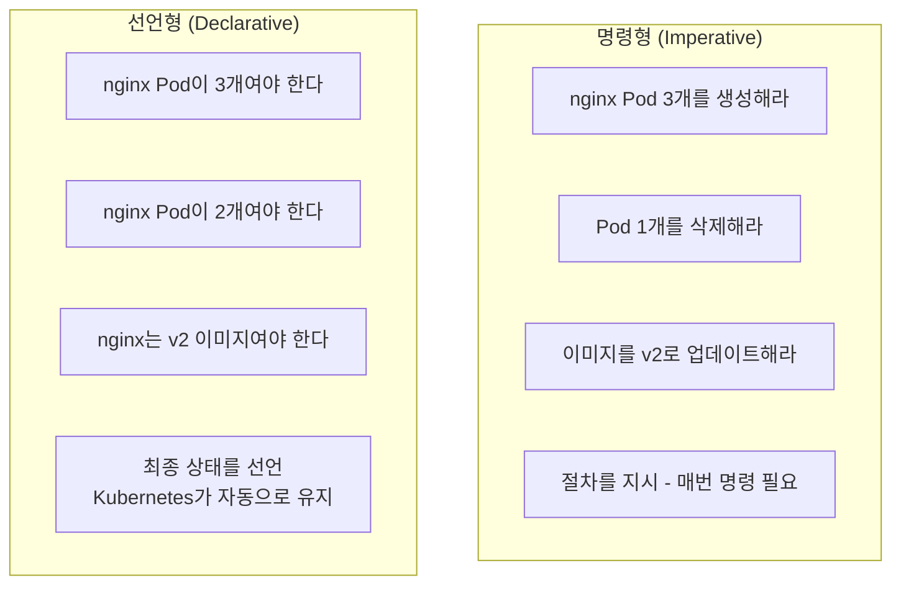
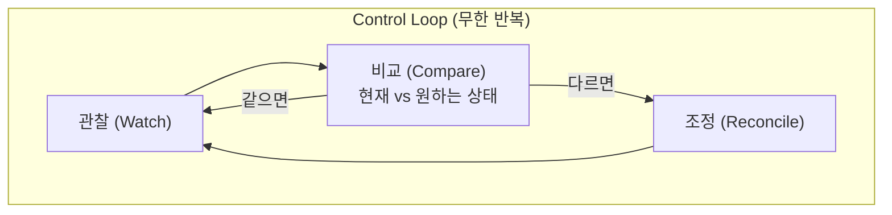
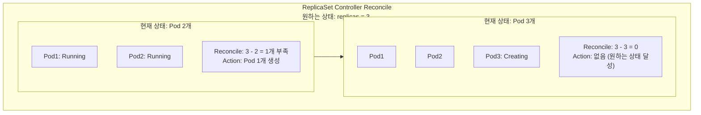
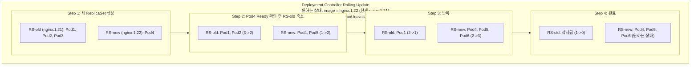
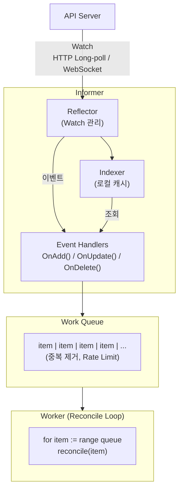
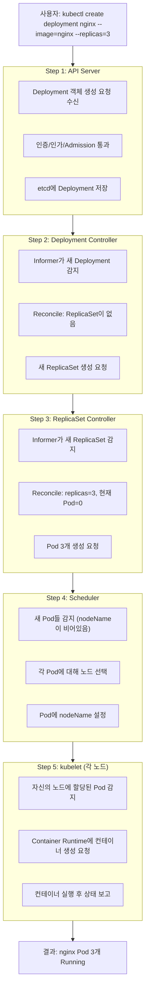
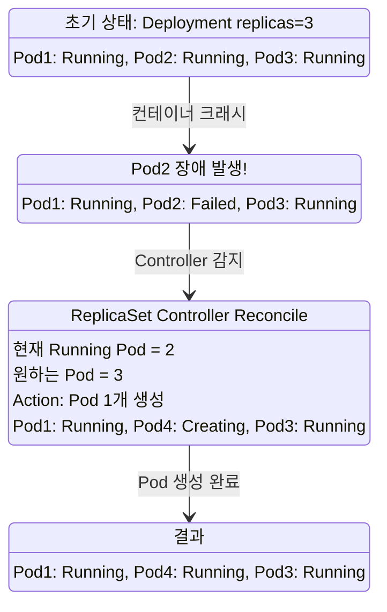
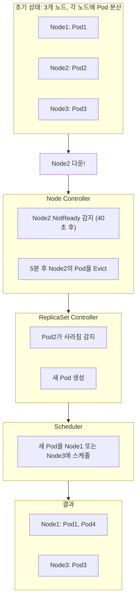

## 1. 선언적 시스템의 핵심: 원하는 상태(Desired State)

Kubernetes의 가장 핵심적인 철학은 **선언적(Declarative) 시스템**이다. 사용자는 "어떻게 할지"가 아니라 "최종 상태가 어떠해야 하는지"를 선언한다.



**예시:**

```yaml
# 선언형 명세
apiVersion: apps/v1
kind: Deployment
metadata:
  name: nginx
spec:
  replicas: 3  # "nginx Pod이 3개여야 한다"
  selector:
    matchLabels:
      app: nginx
  template:
    metadata:
      labels:
        app: nginx
    spec:
      containers:
      - name: nginx
        image: nginx:1.21  # "nginx는 1.21 버전이어야 한다"
```

이 YAML을 `kubectl apply`하면:
1. 현재 Pod이 0개라면 → 3개 생성
2. 현재 Pod이 5개라면 → 2개 삭제
3. 현재 이미지가 1.20이라면 → 롤링 업데이트

**Kubernetes가 알아서 현재 상태를 원하는 상태로 만든다.**

---

## 2. Control Loop (제어 루프)

### 2.1 Control Loop란?

> **원문 ([kubernetes.io - Controllers](https://kubernetes.io/docs/concepts/architecture/controller/)):**
> In Kubernetes, controllers are control loops that watch the state of your cluster, then make or request changes where needed. Each controller tries to move the current cluster state closer to the desired state.

**번역:** Kubernetes에서 컨트롤러는 클러스터의 상태를 관찰한 다음 필요한 곳에서 변경을 수행하거나 요청하는 제어 루프이다. 각 컨트롤러는 현재 클러스터 상태를 원하는 상태에 더 가깝게 이동하려고 한다.

Control Loop는 시스템의 현재 상태를 지속적으로 관찰하고, 원하는 상태와 비교하여 차이가 있으면 조정 작업을 수행하는 패턴이다.



### 2.2 Control Loop의 특징

**Level Triggered (Edge Triggered가 아님):**

- Edge Triggered: 이벤트가 발생할 때만 동작
- Level Triggered: 현재 상태를 지속적으로 확인

```
Edge Triggered 방식의 문제점:
- 이벤트를 놓치면 상태 불일치 발생
- 네트워크 장애로 이벤트 손실 가능

Level Triggered (Kubernetes 방식):
- 현재 상태와 원하는 상태를 주기적으로 비교
- 이벤트를 놓쳐도 다음 루프에서 발견
- 더 견고한 자가 치유
```

**멱등성(Idempotency):**

Reconcile 작업은 멱등해야 한다. 같은 작업을 여러 번 수행해도 결과가 동일해야 한다.

```
# 멱등한 작업
"Pod 개수를 3개로 맞춘다"
- 현재 2개 → 1개 생성
- 현재 3개 → 아무것도 안함
- 현재 5개 → 2개 삭제

# 멱등하지 않은 작업 (잘못된 방식)
"Pod 1개를 추가한다"
- 호출할 때마다 계속 증가
```

---

## 3. Reconciliation (조정)

### 3.1 Reconciliation이란?

> **원문 ([kubernetes.io - Controllers](https://kubernetes.io/docs/concepts/architecture/controller/)):**
> A controller tracks at least one Kubernetes resource type. These objects have a spec field that represents the desired state. The controller(s) for that resource are responsible for making the current state come closer to that desired state.

**번역:** 컨트롤러는 적어도 하나의 Kubernetes 리소스 타입을 추적한다. 이러한 객체에는 원하는 상태를 나타내는 spec 필드가 있다. 해당 리소스의 컨트롤러는 현재 상태를 원하는 상태에 더 가깝게 만드는 책임이 있다.

Reconciliation은 현재 상태를 원하는 상태로 만드는 작업이다. Controller의 핵심 로직이다.

```go
// 간소화된 Reconcile 의사 코드
func (c *Controller) Reconcile(request Request) Result {
    // 1. 원하는 상태 조회 (etcd에서)
    desired := c.getDesiredState(request.Name)

    // 2. 현재 상태 조회 (클러스터에서)
    current := c.getCurrentState(request.Name)

    // 3. 비교
    if desired == nil {
        // 삭제됨 → 관련 리소스 정리
        c.cleanup(current)
        return
    }

    if current == nil {
        // 새로 생성해야 함
        c.create(desired)
        return
    }

    if needsUpdate(current, desired) {
        // 업데이트 필요
        c.update(current, desired)
        return
    }

    // 4. 이미 원하는 상태 → 아무것도 안함
    return
}
```

### 3.2 ReplicaSet Controller 예시



### 3.3 Deployment Controller 예시: 롤링 업데이트



---

## 4. Controller 내부 구조

### 4.1 Watch, Informer, Work Queue



**각 컴포넌트 역할:**

| 컴포넌트 | 역할 |
|---------|------|
| **Reflector** | API Server의 Watch를 통해 이벤트 수신 |
| **Indexer** | 리소스를 로컬에 캐시하여 API Server 부하 감소 |
| **Event Handlers** | 이벤트 발생 시 Work Queue에 항목 추가 |
| **Work Queue** | 처리할 항목을 관리 (중복 제거, Rate Limiting) |
| **Worker** | Queue에서 항목을 꺼내 Reconcile 수행 |

### 4.2 Work Queue의 중요성

**중복 제거:**
```
이벤트: Pod-A 수정
이벤트: Pod-A 수정
이벤트: Pod-A 수정

Work Queue: [Pod-A]  ← 중복 제거됨

Reconcile은 한 번만 수행 (최신 상태 기준)
```

**Rate Limiting:**
```
- 실패 시 재시도 간격을 점점 늘림 (Exponential Backoff)
- API Server 과부하 방지
- 일시적 오류 시 자동 복구
```

### 4.3 SharedInformer

여러 Controller가 같은 리소스를 Watch할 때, 각각 Watch하면 API Server에 부담이 된다. SharedInformer는 하나의 Watch를 여러 Controller가 공유하게 해준다.

```mermaid
flowchart TB
    API["API Server"]
    SI["SharedInformer<br/>(Pod Informer)"]
    C1["Controller1<br/>(ReplicaSet)"]
    C2["Controller2<br/>(Deployment)"]
    C3["Controller3<br/>(Service)"]

    API -->|Watch (단일 연결)| SI
    SI --> C1
    SI --> C2
    SI --> C3
```

---

## 5. Kubernetes 주요 Controller 동작

### 5.1 ReplicaSet Controller

**책임:** 지정된 수의 Pod 복제본 유지

```
Watch 대상: ReplicaSet, Pod
Reconcile 로직:
1. ReplicaSet의 selector에 해당하는 Pod 목록 조회
2. 현재 Pod 수와 desired replicas 비교
3. 부족하면 Pod 생성, 초과하면 Pod 삭제
```

### 5.2 Deployment Controller

**책임:** 선언적 업데이트, 롤아웃/롤백 관리

```
Watch 대상: Deployment, ReplicaSet
Reconcile 로직:
1. Deployment의 Pod Template이 변경되었는지 확인
2. 변경되었으면 새 ReplicaSet 생성
3. 롤링 업데이트 전략에 따라 새/구 ReplicaSet 스케일 조정
4. 히스토리 관리 (rollback 지원)
```

### 5.3 StatefulSet Controller

**책임:** 순서 보장, 고유 네트워크 ID, 영구 스토리지

```
Watch 대상: StatefulSet, Pod, PVC
Reconcile 로직:
1. Pod을 순차적으로 생성 (pod-0, pod-1, pod-2...)
2. 각 Pod에 대한 PVC 생성 (존재하지 않으면)
3. 스케일 다운 시 역순으로 삭제
4. 업데이트 시 역순으로 롤링 업데이트
```

### 5.4 DaemonSet Controller

**책임:** 모든(또는 일부) 노드에 Pod 실행

```
Watch 대상: DaemonSet, Node, Pod
Reconcile 로직:
1. 모든 노드 목록 조회
2. 각 노드에 DaemonSet Pod이 있는지 확인
3. 없으면 생성, Taint가 추가되었으면 삭제
```

### 5.5 Endpoint Controller

**책임:** Service와 Pod 연결

```
Watch 대상: Service, Pod
Reconcile 로직:
1. Service의 selector에 해당하는 Ready Pod 목록 조회
2. Pod의 IP 주소를 Endpoints 객체에 업데이트
3. Pod이 NotReady 되면 Endpoints에서 제거
```

---

## 6. 실제 동작 예시: Pod 생성 흐름



---

## 7. 자가 치유(Self-Healing) 동작

### 7.1 Pod 장애 시



### 7.2 노드 장애 시



---

## 8. 면접 빈출 질문

### Q1. Control Loop와 Reconciliation을 설명해라

Control Loop는 Kubernetes Controller의 핵심 패턴이다. 무한 루프로 다음을 반복한다:

1. **관찰(Watch)**: 현재 상태를 지속적으로 관찰
2. **비교(Diff)**: 현재 상태와 원하는 상태(etcd에 저장된) 비교
3. **조정(Reconcile)**: 차이가 있으면 현재 상태를 원하는 상태로 변경

이 패턴의 장점:
- **자가 치유**: 상태가 변경되면 자동으로 복구
- **견고함**: 이벤트를 놓쳐도 다음 루프에서 감지
- **선언적**: 사용자는 원하는 상태만 정의

### Q2. Informer와 Work Queue의 역할은?

**Informer:**
- API Server의 Watch를 추상화
- 리소스를 로컬에 캐시하여 API Server 부하 감소
- 이벤트(Add/Update/Delete) 발생 시 핸들러 호출
- SharedInformer로 여러 Controller가 같은 Watch 공유

**Work Queue:**
- 처리할 항목을 관리
- 중복 제거: 같은 리소스에 대한 여러 이벤트를 하나로 병합
- Rate Limiting: 재시도 간격 조절, API Server 보호
- 순차 처리: 같은 키는 동시에 처리되지 않음

### Q3. Kubernetes가 Edge Triggered가 아닌 Level Triggered를 사용하는 이유는?

Edge Triggered는 이벤트 발생 시에만 동작하므로 이벤트를 놓치면 상태 불일치가 발생한다.

Level Triggered는 현재 상태를 주기적으로 확인하므로:
- 이벤트를 놓쳐도 다음 루프에서 감지
- 네트워크 장애로 인한 이벤트 손실에 강함
- Controller 재시작 후에도 올바른 상태로 수렴

분산 시스템에서 메시지 손실은 불가피하므로, Level Triggered가 더 견고하다.

### Q4. Controller가 API Server에 과부하를 주지 않는 방법은?

1. **SharedInformer**: 여러 Controller가 같은 Watch 공유
2. **로컬 캐시**: Indexer에 리소스를 캐시하여 API Server 조회 최소화
3. **Work Queue Rate Limiting**: 재시도 간격 조절
4. **중복 제거**: 같은 리소스에 대한 다수의 이벤트를 하나로 병합
5. **Exponential Backoff**: 실패 시 재시도 간격을 점점 늘림

---

## 9. 실습: Controller 동작 관찰

### 9.1 Deployment 롤아웃 관찰

```bash
# Deployment 생성
kubectl create deployment nginx --image=nginx:1.21 --replicas=3

# 이벤트 실시간 관찰 (다른 터미널에서)
kubectl get events -w

# 롤아웃 상태 관찰
kubectl rollout status deployment/nginx

# 이미지 업데이트 (롤링 업데이트 트리거)
kubectl set image deployment/nginx nginx=nginx:1.22

# ReplicaSet 변화 관찰
kubectl get rs -w
```

### 9.2 자가 치유 관찰

```bash
# Pod 삭제해보기
kubectl delete pod <nginx-pod-name>

# 즉시 새 Pod이 생성됨을 확인
kubectl get pods -w
```

### 9.3 Controller 로그 확인

```bash
# kube-controller-manager 로그
kubectl logs -n kube-system kube-controller-manager-<node> | grep "replicaset"

# 특정 Controller 로그 필터링
kubectl logs -n kube-system kube-controller-manager-<node> | grep -E "deployment|replicaset"
```

---

## 정리

### 주요 개념 체크리스트

- 선언적 시스템의 의미 (Desired State)
- Control Loop 패턴 (관찰 → 비교 → 조정)
- Reconciliation 로직
- Informer, Work Queue 역할
- Level Triggered vs Edge Triggered
- 자가 치유 동작 원리

### 다음 포스트

[Part 4: kubectl 마스터하기](/posts/kubernetes-04-kubectl)에서는 kubectl의 필수 명령어와 효율적인 사용법을 다룬다.

---

## 참고 자료

- [Kubernetes Controller 개발 가이드](https://kubernetes.io/docs/concepts/architecture/controller/)
- [Controllers](https://kubernetes.io/docs/concepts/architecture/controller/)
- [client-go 라이브러리](https://github.com/kubernetes/client-go)
- [Sample Controller](https://github.com/kubernetes/sample-controller)

