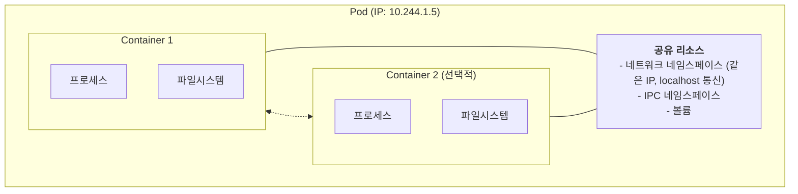
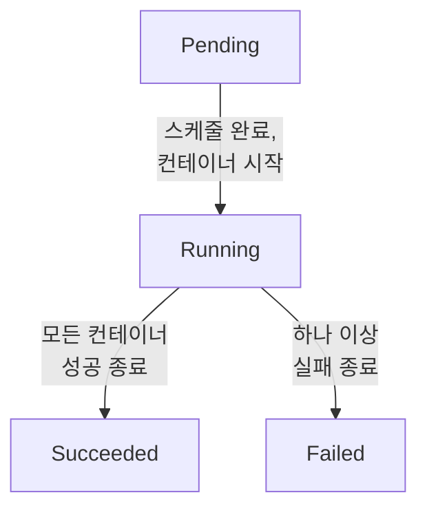
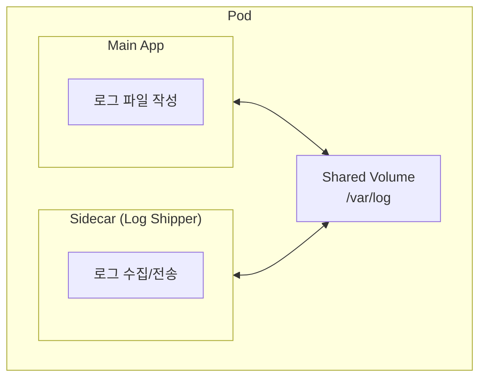
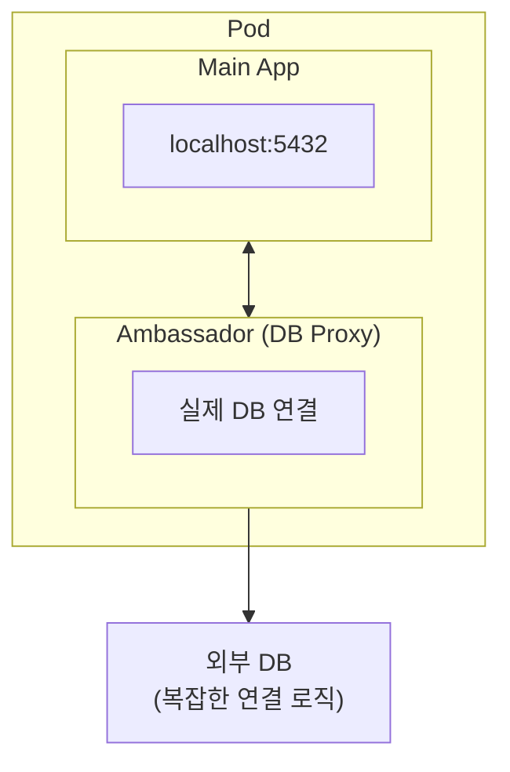
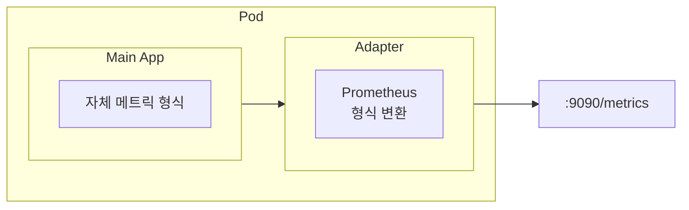
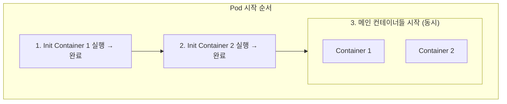
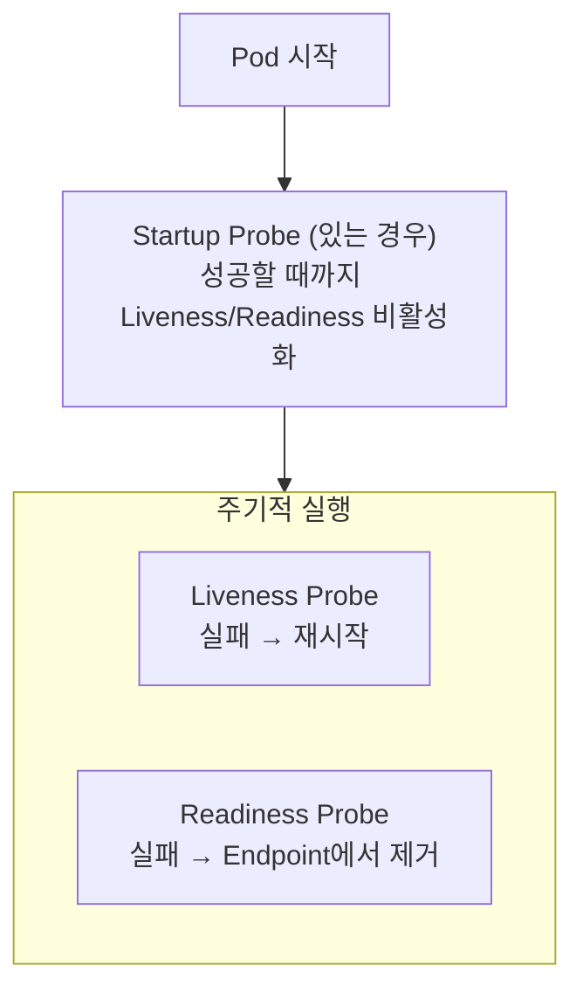

## 1. Pod 개념

### 1.1 Pod란?

> **원문 ([kubernetes.io - Pods](https://kubernetes.io/docs/concepts/workloads/pods/)):**
> Pods are the smallest deployable units of computing that you can create and manage in Kubernetes. A Pod is a group of one or more containers, with shared storage and network resources, and a specification for how to run the containers.

**번역:** Pod는 Kubernetes에서 만들고 관리할 수 있는 배포 가능한 컴퓨팅의 가장 작은 단위이다. Pod는 공유 스토리지와 네트워크 리소스, 그리고 컨테이너 실행 방법에 대한 명세를 가진 하나 이상의 컨테이너 그룹이다.

즉, Kubernetes는 컨테이너를 직접 실행하지 않고 항상 Pod 안에 컨테이너를 감싸서 실행한다.



**주요 특징:**
- 1개 이상의 컨테이너 포함 (일반적으로 1개)
- 컨테이너 간 네트워크 네임스페이스 공유 (같은 IP)
- 같은 Pod 내 컨테이너는 localhost로 통신
- 볼륨 공유 가능
- Pod은 **일시적(Ephemeral)**이며, 재시작 시 새로운 IP 주소를 받음
- Pod 자체는 자가 치유되지 않음 (Controller가 관리해야 함)

### 1.2 왜 컨테이너가 아닌 Pod인가?

**Pod이 필요한 이유:**
1. 여러 컨테이너가 긴밀하게 협력해야 할 때 (Sidecar 패턴)
2. 네트워크/스토리지를 공유하면서 독립적인 프로세스 유지
3. 스케일링과 배포의 단위를 명확히 함
4. 리소스 할당의 단위

```yaml
# 간단한 Pod 정의
apiVersion: v1
kind: Pod
metadata:
  name: nginx-pod
  labels:
    app: nginx
spec:
  containers:
  - name: nginx
    image: nginx:1.21
    ports:
    - containerPort: 80
```

---

## 2. Pod 생명주기

### 2.1 Pod Phase

Pod은 다음 Phase 중 하나의 상태를 가진다:

| Phase | 설명 |
|-------|------|
| **Pending** | Pod이 생성되었으나 아직 스케줄되지 않았거나, 이미지를 다운로드 중 |
| **Running** | Pod이 노드에 바인딩되고, 하나 이상의 컨테이너가 실행 중 |
| **Succeeded** | 모든 컨테이너가 성공적으로 종료됨 (exit code 0) |
| **Failed** | 모든 컨테이너가 종료되었고, 하나 이상이 실패 (exit code ≠ 0) |
| **Unknown** | Pod 상태를 확인할 수 없음 (노드 통신 문제) |



### 2.2 Container States

각 컨테이너는 독립적인 상태를 가진다:

| State | 설명 |
|-------|------|
| **Waiting** | 컨테이너가 시작을 기다리는 중 (이미지 풀, Init Container 대기 등) |
| **Running** | 컨테이너가 실행 중 |
| **Terminated** | 컨테이너가 종료됨 (정상 또는 비정상) |

```bash
# 컨테이너 상태 확인
kubectl get pod nginx -o jsonpath='{.status.containerStatuses[*].state}'

# 상세 정보
kubectl describe pod nginx
```

### 2.3 Pod Conditions

Pod은 여러 Condition을 가질 수 있다:

| Condition | 설명 |
|-----------|------|
| **PodScheduled** | Pod이 노드에 스케줄됨 |
| **ContainersReady** | 모든 컨테이너가 Ready |
| **Initialized** | 모든 Init Container가 완료됨 |
| **Ready** | Pod이 트래픽을 받을 준비 완료 |

```bash
# Conditions 확인
kubectl get pod nginx -o jsonpath='{.status.conditions}'
```

### 2.4 Restart Policy

```yaml
spec:
  restartPolicy: Always  # 기본값
  # Always: 항상 재시작 (Deployment에서 사용)
  # OnFailure: 실패 시에만 재시작 (Job에서 사용)
  # Never: 재시작 안함
```

**Restart Policy와 Controller:**

| Controller | 권장 Restart Policy |
|------------|---------------------|
| Deployment, ReplicaSet, DaemonSet | Always |
| Job | OnFailure 또는 Never |
| 단독 Pod | 상황에 따라 |

---

## 3. Multi-Container Pod 패턴

하나의 Pod에 여러 컨테이너를 배치하는 패턴들이 있다. 이들은 네트워크와 스토리지를 공유하며 긴밀하게 협력한다.

### 3.1 Sidecar 패턴

메인 애플리케이션을 **보조**하는 컨테이너를 함께 실행한다.



**사용 사례:**
- 로그 수집 (Fluentd, Filebeat)
- 모니터링 에이전트 (Prometheus exporter)
- 설정 동기화 (Git-sync)
- 프록시 (Istio envoy)

```yaml
apiVersion: v1
kind: Pod
metadata:
  name: app-with-sidecar
spec:
  containers:
  - name: main-app
    image: myapp:latest
    volumeMounts:
    - name: logs
      mountPath: /var/log/app
  - name: log-shipper
    image: fluentd:latest
    volumeMounts:
    - name: logs
      mountPath: /var/log/app
      readOnly: true
  volumes:
  - name: logs
    emptyDir: {}
```

### 3.2 Ambassador 패턴

외부 서비스와의 통신을 **대행**하는 프록시 컨테이너를 둔다.



**사용 사례:**
- 데이터베이스 프록시 (연결 풀링, 암호화)
- 서비스 메시 프록시
- API Gateway

```yaml
apiVersion: v1
kind: Pod
metadata:
  name: app-with-ambassador
spec:
  containers:
  - name: app
    image: myapp:latest
    env:
    - name: DATABASE_URL
      value: "localhost:5432"
  - name: db-proxy
    image: postgres-proxy:latest
    ports:
    - containerPort: 5432
    env:
    - name: REAL_DB_HOST
      value: "production-db.example.com"
```

### 3.3 Adapter 패턴

메인 애플리케이션의 출력을 **표준 형식으로 변환**한다.



**사용 사례:**
- 메트릭 형식 변환 (Prometheus exporter)
- 로그 형식 표준화
- 프로토콜 변환

---

## 4. Init Container

### 4.1 Init Container란?

Init Container는 **메인 컨테이너 실행 전에 초기화 작업을 수행**한다.



**특징:**
- 순차 실행 (하나가 완료되어야 다음 시작)
- 모두 완료되어야 메인 컨테이너 시작
- 실패하면 Pod 재시작 (restartPolicy에 따라)
- 메인 컨테이너와 다른 이미지, 권한 사용 가능

### 4.2 사용 사례

**1. 의존 서비스 대기:**
```yaml
initContainers:
- name: wait-for-db
  image: busybox
  command: ['sh', '-c', 'until nc -z mysql-service 3306; do echo waiting for db; sleep 2; done;']
```

**2. 설정 파일 다운로드:**
```yaml
initContainers:
- name: download-config
  image: busybox
  command: ['wget', '-O', '/config/app.conf', 'https://config-server/app.conf']
  volumeMounts:
  - name: config
    mountPath: /config
```

**3. 데이터베이스 마이그레이션:**
```yaml
initContainers:
- name: migrate
  image: myapp:latest
  command: ['./migrate.sh']
  env:
  - name: DATABASE_URL
    valueFrom:
      secretKeyRef:
        name: db-secret
        key: url
```

**4. 권한 설정:**
```yaml
initContainers:
- name: fix-permissions
  image: busybox
  command: ['chown', '-R', '1000:1000', '/data']
  securityContext:
    runAsUser: 0
  volumeMounts:
  - name: data
    mountPath: /data
```

### 4.3 완전한 예시

```yaml
apiVersion: v1
kind: Pod
metadata:
  name: app-with-init
spec:
  initContainers:
  - name: wait-for-db
    image: busybox
    command: ['sh', '-c', 'until nslookup mydb; do echo waiting for mydb; sleep 2; done;']
  - name: init-config
    image: busybox
    command: ['sh', '-c', 'echo "config loaded" > /config/app.conf']
    volumeMounts:
    - name: config
      mountPath: /config
  containers:
  - name: myapp
    image: myapp:v1
    ports:
    - containerPort: 8080
    volumeMounts:
    - name: config
      mountPath: /config
  volumes:
  - name: config
    emptyDir: {}
```

---

## 5. Probe (Health Check)

Probe는 컨테이너의 상태를 주기적으로 확인하여 자동 복구를 수행하는 메커니즘이다.

> **원문 ([kubernetes.io - Configure Probes](https://kubernetes.io/docs/tasks/configure-pod-container/configure-liveness-readiness-startup-probes/)):**
> The kubelet uses liveness probes to know when to restart a container. The kubelet uses readiness probes to know when a container is ready to start accepting traffic.

**번역:** kubelet은 컨테이너를 언제 재시작해야 하는지 알기 위해 liveness probe를 사용한다. kubelet은 컨테이너가 트래픽 수신을 시작할 준비가 되었는지 알기 위해 readiness probe를 사용한다.

### 5.1 세 가지 Probe 종류

| Probe | 목적 | 실패 시 동작 |
|-------|------|-------------|
| **Liveness** | 컨테이너가 살아있는지 확인 | 컨테이너 재시작 |
| **Readiness** | 트래픽을 받을 준비가 되었는지 확인 | Endpoint에서 제거 (트래픽 차단) |
| **Startup** | 애플리케이션이 시작되었는지 확인 | 실패 동안 Liveness/Readiness 비활성화 |



### 5.2 Liveness Probe

컨테이너가 **살아있는지(정상 동작하는지)** 확인한다.

```yaml
containers:
- name: myapp
  image: myapp:v1
  livenessProbe:
    httpGet:
      path: /healthz
      port: 8080
    initialDelaySeconds: 15    # 첫 체크 전 대기
    periodSeconds: 10          # 체크 주기
    timeoutSeconds: 3          # 타임아웃
    failureThreshold: 3        # 실패 허용 횟수
    successThreshold: 1        # 성공으로 간주하는 횟수
```

**실패 시:**
- kubelet이 컨테이너를 **재시작**
- restartPolicy에 따라 재시작 결정

**주의사항:**
- `initialDelaySeconds`를 충분히 설정 (앱 시작 시간 고려)
- 너무 민감하게 설정하면 불필요한 재시작 발생

### 5.3 Readiness Probe

Pod이 **트래픽을 받을 준비가 되었는지** 확인한다.

```yaml
containers:
- name: myapp
  image: myapp:v1
  readinessProbe:
    httpGet:
      path: /ready
      port: 8080
    initialDelaySeconds: 5
    periodSeconds: 5
```

**실패 시:**
- Pod이 Service의 **Endpoint에서 제거**됨
- 트래픽이 해당 Pod으로 라우팅되지 않음
- 컨테이너는 재시작되지 않음

**사용 사례:**
- 애플리케이션 초기화 완료 대기
- 외부 의존성(DB, Cache) 연결 확인
- 일시적 부하 상황에서 트래픽 차단

### 5.4 Startup Probe

**시작이 느린 애플리케이션**을 위한 Probe다.

```yaml
containers:
- name: legacy-app
  image: legacy-app:v1
  startupProbe:
    httpGet:
      path: /startup
      port: 8080
    failureThreshold: 30
    periodSeconds: 10
    # 최대 300초(5분) 동안 시작 대기
  livenessProbe:
    httpGet:
      path: /healthz
      port: 8080
    periodSeconds: 10
```

**특징:**
- Startup Probe가 성공하기 전까지 Liveness/Readiness Probe 비활성화
- 오래 걸리는 초기화 작업이 있는 레거시 애플리케이션에 유용
- Liveness Probe의 `initialDelaySeconds`를 대체

### 5.5 Probe 방법

세 가지 체크 방법을 사용할 수 있다:

**1. HTTP GET:**
```yaml
livenessProbe:
  httpGet:
    path: /healthz
    port: 8080
    httpHeaders:
    - name: Custom-Header
      value: "check"
```
- 200-399 응답 코드면 성공

**2. TCP Socket:**
```yaml
livenessProbe:
  tcpSocket:
    port: 3306
```
- TCP 연결이 성공하면 성공

**3. Exec (명령 실행):**
```yaml
livenessProbe:
  exec:
    command:
    - cat
    - /tmp/healthy
```
- exit code가 0이면 성공

### 5.6 Probe 설정

| 상황 | 권장 설정 |
|------|----------|
| 웹 애플리케이션 | Liveness: /healthz, Readiness: /ready |
| 시작이 느린 앱 | Startup Probe 사용 |
| DB 의존 앱 | Readiness에서 DB 연결 체크 |
| 워커/배치 | Liveness만 (Readiness 불필요) |

**일반적인 실수:**
- Liveness가 Readiness보다 먼저 실패 → 불필요한 재시작
- initialDelaySeconds 부족 → 시작 중 재시작
- 외부 의존성을 Liveness에서 체크 → 의존성 장애 시 무한 재시작

---

## 6. 리소스 관리

### 6.1 Requests와 Limits

```yaml
containers:
- name: app
  image: myapp:v1
  resources:
    requests:
      cpu: 250m          # 최소 필요량 (스케줄링 기준)
      memory: 256Mi
    limits:
      cpu: 500m          # 최대 사용량
      memory: 512Mi
```

**Requests:**
- Pod 스케줄링 시 **최소 필요한 리소스**
- Scheduler는 이 값을 기준으로 노드 선택
- 노드의 Allocatable ≥ sum(requests)

**Limits:**
- Pod이 사용할 수 있는 **최대 리소스**
- CPU: Throttle (느려짐)
- Memory: OOMKilled (프로세스 종료)

### 6.2 CPU와 Memory 단위

**CPU:**
- `1` = 1 vCPU/Core
- `500m` = 0.5 vCPU (m = milli)
- `100m` = 0.1 vCPU

**Memory:**
- `128Mi` = 128 MiB (1024 기반, Mebibyte)
- `128M` = 128 MB (1000 기반, Megabyte)
- `1Gi` = 1 GiB

### 6.3 QoS Classes

리소스 설정에 따라 Pod에 자동으로 QoS 클래스가 부여된다:

| QoS Class | 조건 | 우선순위 |
|-----------|------|---------|
| **Guaranteed** | 모든 컨테이너에 requests == limits | 최고 (마지막에 제거) |
| **Burstable** | 최소 하나의 컨테이너에 requests 또는 limits | 중간 |
| **BestEffort** | 모든 컨테이너에 requests/limits 없음 | 최저 (먼저 제거) |

**노드 리소스 부족 시 제거 순서:**
BestEffort → Burstable → Guaranteed

```yaml
# Guaranteed (requests == limits)
resources:
  requests:
    cpu: 500m
    memory: 256Mi
  limits:
    cpu: 500m
    memory: 256Mi

# Burstable (requests만 또는 requests < limits)
resources:
  requests:
    cpu: 250m
    memory: 128Mi
  limits:
    cpu: 500m
    memory: 256Mi

# BestEffort (설정 없음)
# resources 섹션 생략
```

---

## 7. 면접 빈출 질문

### Q1. Pod과 Container의 차이는?

Container는 단일 프로세스를 격리하는 단위이고, Pod는 하나 이상의 컨테이너를 포함하는 Kubernetes의 배포 단위다.

같은 Pod 내의 컨테이너는:
- 동일한 IP 주소 공유
- localhost로 통신 가능
- 볼륨 공유 가능
- 항상 같은 노드에서 실행

### Q2. Liveness와 Readiness Probe의 차이는?

**Liveness Probe:**
- 목적: 컨테이너가 살아있는지 확인
- 실패 시: 컨테이너 재시작
- 사용: 데드락, 무한 루프 등 복구 불가능한 상태 감지

**Readiness Probe:**
- 목적: 트래픽을 받을 준비가 되었는지 확인
- 실패 시: Endpoint에서 제거 (트래픽 차단)
- 사용: 초기화 대기, 일시적 장애 처리

### Q3. Init Container는 언제 사용하는가?

1. **의존 서비스 대기**: DB, 캐시 등이 준비될 때까지 대기
2. **설정 준비**: 설정 파일 다운로드, 템플릿 처리
3. **스키마 마이그레이션**: 메인 앱 시작 전 DB 스키마 업데이트
4. **보안 설정**: 인증서 발급, 권한 설정

Init Container는 메인 컨테이너와 다른 이미지, 다른 권한으로 실행할 수 있어 보안상 이점이 있다.

### Q4. QoS Class가 Guaranteed가 되려면?

모든 컨테이너에서 다음 조건을 만족해야 한다:
- CPU requests == CPU limits
- Memory requests == Memory limits

이렇게 설정하면 리소스 사용량이 예측 가능하고, 노드 리소스 부족 시 가장 마지막에 제거된다.

---

## 8. CKA 실습

### 8.1 Pod 생성

```bash
# 명령형으로 Pod 생성
kubectl run nginx --image=nginx

# YAML 생성 (dry-run)
kubectl run nginx --image=nginx --dry-run=client -o yaml > pod.yaml

# 포트와 라벨 지정
kubectl run nginx --image=nginx --port=80 --labels="app=nginx,env=prod"

# 리소스 제한
kubectl run nginx --image=nginx \
  --requests="cpu=100m,memory=128Mi" \
  --limits="cpu=200m,memory=256Mi"
```

### 8.2 Multi-container Pod

```yaml
# multi-container.yaml
apiVersion: v1
kind: Pod
metadata:
  name: multi-container
spec:
  containers:
  - name: nginx
    image: nginx
    ports:
    - containerPort: 80
    volumeMounts:
    - name: shared
      mountPath: /usr/share/nginx/html
  - name: content-gen
    image: busybox
    command: ['sh', '-c', 'while true; do date > /html/index.html; sleep 5; done']
    volumeMounts:
    - name: shared
      mountPath: /html
  volumes:
  - name: shared
    emptyDir: {}
```

### 8.3 Init Container Pod

```yaml
# init-container.yaml
apiVersion: v1
kind: Pod
metadata:
  name: init-demo
spec:
  initContainers:
  - name: wait-for-service
    image: busybox
    command: ['sh', '-c', 'until nslookup myservice; do echo waiting; sleep 2; done']
  containers:
  - name: app
    image: nginx
```

### 8.4 Probe 설정

```yaml
# probe-demo.yaml
apiVersion: v1
kind: Pod
metadata:
  name: probe-demo
spec:
  containers:
  - name: app
    image: nginx
    livenessProbe:
      httpGet:
        path: /
        port: 80
      initialDelaySeconds: 5
      periodSeconds: 10
    readinessProbe:
      httpGet:
        path: /
        port: 80
      initialDelaySeconds: 3
      periodSeconds: 5
```

---

## 정리

### 주요 개념 체크리스트

- Pod이 Kubernetes의 최소 배포 단위인 이유
- Pod 생명주기와 Phase
- Multi-container 패턴 (Sidecar, Ambassador, Adapter)
- Init Container의 용도와 동작 방식
- Liveness, Readiness, Startup Probe의 차이
- QoS Class와 리소스 관리

### 다음 포스트

[Part 6: Label, Selector, Annotation](/posts/kubernetes-06-label-selector)에서는 리소스 조직화의 핵심인 Label과 Selector를 상세히 다룬다.

---

## 참고 자료

- [Pod 공식 문서](https://kubernetes.io/docs/concepts/workloads/pods/)
- [Pod Lifecycle](https://kubernetes.io/docs/concepts/workloads/pods/pod-lifecycle/)
- [Configure Liveness, Readiness and Startup Probes](https://kubernetes.io/docs/tasks/configure-pod-container/configure-liveness-readiness-startup-probes/)
- [Resource Management](https://kubernetes.io/docs/concepts/configuration/manage-resources-containers/)

