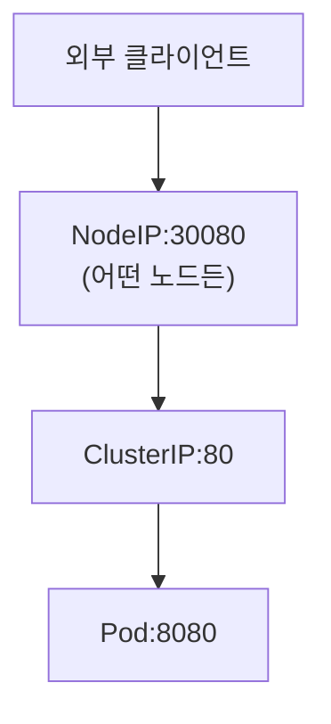
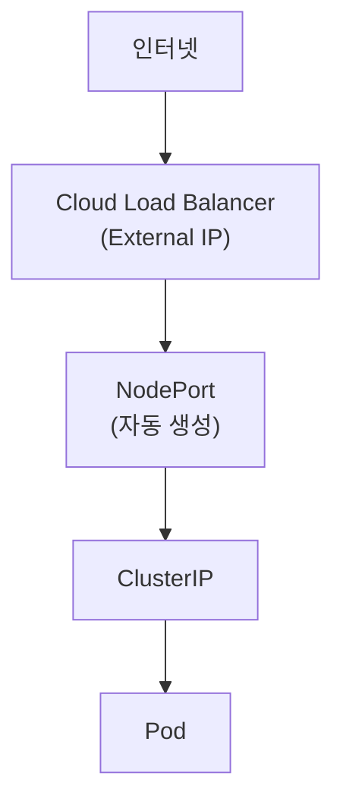
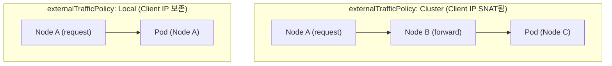

Kubernetes에서 Pod는 일시적(ephemeral)인 존재이다. Pod가 재시작되면 IP 주소가 변경되고, Deployment로 관리되는 Pod들은 언제든지 새로운 Pod로 교체될 수 있다. 이러한 환경에서 안정적인 네트워크 통신을 위해 **Service**라는 추상화 계층이 필요하다.

> **원문 ([kubernetes.io - Service](https://kubernetes.io/docs/concepts/services-networking/service/)):**
> In Kubernetes, a Service is a method for exposing a network application that is running as one or more Pods in your cluster. The Service API abstracts the way you access the workload from the underlying deployment.

**번역:** Kubernetes에서 Service는 클러스터에서 하나 이상의 Pod로 실행되는 네트워크 애플리케이션을 노출하는 방법이다. Service API는 기본 배포에서 워크로드에 접근하는 방식을 추상화한다.

## Service의 필요성

### Pod IP의 한계

```yaml
# Pod는 생성될 때마다 새로운 IP를 할당받는다
apiVersion: v1
kind: Pod
metadata:
  name: web-app
spec:
  containers:
  - name: nginx
    image: nginx:1.24
```

Pod IP의 문제점:
- **일시적**: Pod 재시작 시 IP 변경
- **예측 불가**: 어떤 IP가 할당될지 알 수 없음
- **직접 노출 불가**: 클러스터 외부에서 접근 불가
- **로드밸런싱 없음**: 여러 Pod에 트래픽 분산 불가

### Service의 역할

Service는 다음을 제공한다:
1. **안정적인 엔드포인트**: 변하지 않는 ClusterIP와 DNS 이름
2. **서비스 디스커버리**: DNS를 통한 자동 검색
3. **로드밸런싱**: 여러 Pod에 트래픽 분산
4. **외부 노출**: NodePort, LoadBalancer를 통한 외부 접근

## Service 기본 구조

### Service와 Endpoints

```yaml
apiVersion: v1
kind: Service
metadata:
  name: web-service
spec:
  selector:
    app: web        # 이 Label을 가진 Pod들을 선택
  ports:
  - port: 80        # Service 포트
    targetPort: 8080  # Pod의 컨테이너 포트
    protocol: TCP
```

Service를 생성하면 Kubernetes는 자동으로 **Endpoints** 오브젝트를 생성한다:

```bash
# Service 확인
kubectl get svc web-service
# NAME          TYPE        CLUSTER-IP     EXTERNAL-IP   PORT(S)   AGE
# web-service   ClusterIP   10.96.45.123   <none>        80/TCP    1m

# Endpoints 확인 - 실제 Pod IP 목록
kubectl get endpoints web-service
# NAME          ENDPOINTS                                AGE
# web-service   10.244.1.5:8080,10.244.2.6:8080,...     1m
```

**핵심 원리**: Service는 selector에 매칭되는 모든 Pod의 IP를 Endpoints에 등록하고, 트래픽을 이 Endpoints로 분산한다.

### Selector 없는 Service

외부 서비스나 다른 Namespace의 서비스에 연결할 때 사용한다:

```yaml
# Selector 없는 Service
apiVersion: v1
kind: Service
metadata:
  name: external-db
spec:
  ports:
  - port: 3306
---
# 수동으로 Endpoints 정의
apiVersion: v1
kind: Endpoints
metadata:
  name: external-db  # Service와 이름이 같아야 함
subsets:
  - addresses:
    - ip: 192.168.1.100  # 외부 DB 서버 IP
    - ip: 192.168.1.101
    ports:
    - port: 3306
```

이 패턴은 다음 상황에서 유용하다:
- 외부 데이터베이스 연결
- 다른 클러스터의 서비스 연결
- 레거시 시스템과의 통합

## Service 타입

### ClusterIP (기본값)

> **원문 ([kubernetes.io - Service Types](https://kubernetes.io/docs/concepts/services-networking/service/#type-clusterip)):**
> Exposes the Service on a cluster-internal IP. Choosing this value makes the Service only reachable from within the cluster. This is the default that is used if you don't explicitly specify a type for a Service.

**번역:** 클러스터 내부 IP에서 Service를 노출한다. 이 값을 선택하면 Service가 클러스터 내에서만 접근 가능하다. Service에 대한 type을 명시적으로 지정하지 않으면 사용되는 기본값이다.

클러스터 **내부에서만** 접근 가능한 가상 IP를 할당한다.

```yaml
apiVersion: v1
kind: Service
metadata:
  name: backend-service
spec:
  type: ClusterIP  # 생략해도 기본값
  selector:
    app: backend
  ports:
  - port: 80
    targetPort: 8080
```

**특징**:
- 클러스터 내부 통신 전용
- 안정적인 내부 DNS 제공
- 가장 기본적이고 많이 사용되는 타입

**접근 방법**:
```bash
# 같은 Namespace에서
curl http://backend-service:80

# 다른 Namespace에서
curl http://backend-service.default.svc.cluster.local:80
```

### NodePort

> **원문 ([kubernetes.io - Service Types](https://kubernetes.io/docs/concepts/services-networking/service/#type-nodeport)):**
> Exposes the Service on each Node's IP at a static port (the NodePort). To make the node port available, Kubernetes sets up a cluster IP address, the same as if you had requested a Service of type: ClusterIP.

**번역:** 각 노드의 IP에서 정적 포트(NodePort)로 Service를 노출한다. 노드 포트를 사용 가능하게 하기 위해 Kubernetes는 type: ClusterIP의 Service를 요청한 것과 동일하게 클러스터 IP 주소를 설정한다.

각 노드의 특정 포트를 열어 **외부에서 접근**할 수 있게 한다.

```yaml
apiVersion: v1
kind: Service
metadata:
  name: web-nodeport
spec:
  type: NodePort
  selector:
    app: web
  ports:
  - port: 80          # Service 포트 (ClusterIP)
    targetPort: 8080  # Pod 포트
    nodePort: 30080   # 노드 포트 (30000-32767)
```

**트래픽 흐름**:


**특징**:
- 포트 범위: 30000-32767 (기본값)
- 모든 노드에서 해당 포트 오픈
- nodePort 생략 시 자동 할당

**주의사항**:
- 노드 IP가 변경되면 클라이언트도 업데이트 필요
- 보안상 직접 노출보다는 LoadBalancer나 Ingress 권장
- 노드가 다운되면 해당 노드로의 접근 불가

### LoadBalancer

> **원문 ([kubernetes.io - Service Types](https://kubernetes.io/docs/concepts/services-networking/service/#loadbalancer)):**
> Exposes the Service externally using an external load balancer. Kubernetes does not directly offer a load balancing component; you must provide one, or you can integrate your Kubernetes cluster with a cloud provider.

**번역:** 외부 로드 밸런서를 사용하여 Service를 외부로 노출한다. Kubernetes는 직접 로드 밸런싱 컴포넌트를 제공하지 않는다. 로드 밸런서를 제공하거나 Kubernetes 클러스터를 클라우드 공급자와 통합해야 한다.

클라우드 프로바이더의 **외부 로드밸런서**를 프로비저닝한다.

```yaml
apiVersion: v1
kind: Service
metadata:
  name: web-lb
  annotations:
    # AWS NLB 사용 예시
    service.beta.kubernetes.io/aws-load-balancer-type: "nlb"
spec:
  type: LoadBalancer
  selector:
    app: web
  ports:
  - port: 80
    targetPort: 8080
```

**트래픽 흐름**:


**특징**:
- 클라우드 환경에서 자동으로 LB 생성
- 외부 IP 주소 할당
- NodePort를 자동으로 포함

**클라우드별 어노테이션 예시**:

```yaml
# AWS - Internal Load Balancer
metadata:
  annotations:
    service.beta.kubernetes.io/aws-load-balancer-internal: "true"

# GCP - Static IP
metadata:
  annotations:
    networking.gke.io/load-balancer-type: "Internal"

# Azure - Internal Load Balancer
metadata:
  annotations:
    service.beta.kubernetes.io/azure-load-balancer-internal: "true"
```

### ExternalName

클러스터 내부에서 외부 DNS 이름을 사용할 수 있게 해주는 특수한 Service 타입이다.

```yaml
apiVersion: v1
kind: Service
metadata:
  name: external-api
spec:
  type: ExternalName
  externalName: api.external-service.com
```

**특징**:
- ClusterIP 할당 없음
- CNAME 레코드 생성
- 외부 서비스를 내부 DNS로 접근 가능

**사용 예**:
```bash
# 클러스터 내부에서
curl http://external-api.default.svc.cluster.local
# → api.external-service.com 으로 리다이렉트
```

## Headless Service

ClusterIP가 없는 특수한 Service로, **개별 Pod에 직접 접근**해야 할 때 사용한다.

```yaml
apiVersion: v1
kind: Service
metadata:
  name: db-headless
spec:
  clusterIP: None  # Headless 선언
  selector:
    app: database
  ports:
  - port: 5432
```

**일반 Service vs Headless Service**:

| 구분 | 일반 Service | Headless Service |
|------|-------------|------------------|
| ClusterIP | 있음 | None |
| DNS 응답 | ClusterIP 반환 | Pod IP 목록 반환 |
| 로드밸런싱 | kube-proxy가 수행 | 클라이언트가 선택 |
| 용도 | 일반적인 서비스 | StatefulSet, 클라이언트 사이드 LB |

**DNS 조회 결과**:
```bash
# 일반 Service
nslookup web-service.default.svc.cluster.local
# → 10.96.45.123 (ClusterIP)

# Headless Service
nslookup db-headless.default.svc.cluster.local
# → 10.244.1.5, 10.244.2.6, 10.244.3.7 (모든 Pod IP)
```

**StatefulSet과 함께 사용**:
```bash
# StatefulSet의 각 Pod에 고유 DNS로 접근
nslookup mysql-0.db-headless.default.svc.cluster.local
# → mysql-0 Pod의 IP

nslookup mysql-1.db-headless.default.svc.cluster.local
# → mysql-1 Pod의 IP
```

## Service Discovery

### DNS 기반 디스커버리

Kubernetes는 CoreDNS를 통해 서비스 디스커버리를 제공한다.

**DNS 이름 규칙**:
```
<service-name>.<namespace>.svc.cluster.local
```

**DNS 레코드 종류**:
- **A 레코드**: Service → ClusterIP
- **SRV 레코드**: 포트 정보 포함
- **Pod DNS**: `<pod-ip-dashed>.<namespace>.pod.cluster.local`

```bash
# Service DNS 조회
nslookup web-service.production.svc.cluster.local

# SRV 레코드 조회 (포트 정보 포함)
nslookup -type=SRV _http._tcp.web-service.production.svc.cluster.local
```

**같은 Namespace에서 접근**:
```bash
curl http://web-service        # 축약형
curl http://web-service.default  # namespace 포함
curl http://web-service.default.svc.cluster.local  # FQDN
```

### 환경 변수 기반 디스커버리

Pod가 생성될 때 같은 Namespace의 Service 정보가 환경 변수로 주입된다.

```bash
# Pod 내부에서 확인
env | grep WEB_SERVICE
# WEB_SERVICE_SERVICE_HOST=10.96.45.123
# WEB_SERVICE_SERVICE_PORT=80
# WEB_SERVICE_PORT=tcp://10.96.45.123:80
```

**주의**: Pod보다 나중에 생성된 Service는 환경 변수에 포함되지 않는다. DNS 방식을 권장한다.

## Session Affinity

동일한 클라이언트의 요청을 **같은 Pod로 라우팅**하고 싶을 때 사용한다.

```yaml
apiVersion: v1
kind: Service
metadata:
  name: sticky-service
spec:
  selector:
    app: web
  sessionAffinity: ClientIP
  sessionAffinityConfig:
    clientIP:
      timeoutSeconds: 3600  # 1시간 (기본값: 10800초/3시간)
  ports:
  - port: 80
    targetPort: 8080
```

**sessionAffinity 옵션**:
- `None`: 기본값, 라운드로빈
- `ClientIP`: 클라이언트 IP 기준 고정

**참고**: Cookie 기반 세션 어피니티는 Service에서 지원하지 않는다. 필요하다면 Ingress 사용.

## 포트 설정

### Multi-Port Service

하나의 Service에서 여러 포트를 노출할 수 있다.

```yaml
apiVersion: v1
kind: Service
metadata:
  name: multi-port-service
spec:
  selector:
    app: web
  ports:
  - name: http      # 다중 포트 시 name 필수
    port: 80
    targetPort: 8080
  - name: https
    port: 443
    targetPort: 8443
  - name: metrics
    port: 9090
    targetPort: 9090
```

### Named Port 참조

Pod에서 정의한 포트 이름을 참조할 수 있다.

```yaml
# Pod 정의
apiVersion: v1
kind: Pod
metadata:
  name: web-pod
  labels:
    app: web
spec:
  containers:
  - name: nginx
    image: nginx
    ports:
    - name: http-port
      containerPort: 80
    - name: https-port
      containerPort: 443
---
# Service에서 이름으로 참조
apiVersion: v1
kind: Service
metadata:
  name: web-service
spec:
  selector:
    app: web
  ports:
  - name: http
    port: 80
    targetPort: http-port  # 포트 이름 참조
  - name: https
    port: 443
    targetPort: https-port
```

**장점**: Pod의 포트 번호가 변경되어도 Service 수정 불필요.

## External Traffic Policy

> **원문 ([kubernetes.io - Service External Traffic Policy](https://kubernetes.io/docs/tasks/access-application-cluster/create-external-load-balancer/#preserving-the-client-source-ip)):**
> Services with type LoadBalancer or NodePort have a field spec.externalTrafficPolicy which denotes if this Service desires to route external traffic to node-local or cluster-wide endpoints. There are two available options: Cluster (default) and Local. Cluster obscures the client source IP and may cause a second hop to another node, but should have good overall load-spreading. Local preserves the client source IP and avoids a second hop for LoadBalancer and NodePort type Services, but risks potentially imbalanced traffic spreading.

**번역:** LoadBalancer 또는 NodePort 타입의 Service에는 외부 트래픽을 노드 로컬 엔드포인트로 라우팅할지 클러스터 전체 엔드포인트로 라우팅할지를 나타내는 spec.externalTrafficPolicy 필드가 있다. Cluster(기본값)와 Local의 두 가지 옵션이 있다. Cluster는 클라이언트 소스 IP를 숨기고 다른 노드로의 두 번째 홉이 발생할 수 있지만 전체적으로 좋은 로드 분산을 제공한다. Local은 클라이언트 소스 IP를 보존하고 LoadBalancer 및 NodePort 타입 Service의 두 번째 홉을 방지하지만 잠재적으로 불균형한 트래픽 분산이 발생할 위험이 있다.

외부 트래픽(NodePort, LoadBalancer)의 라우팅 방식을 제어한다.

### Cluster (기본값)

```yaml
apiVersion: v1
kind: Service
metadata:
  name: web-service
spec:
  type: NodePort
  externalTrafficPolicy: Cluster
  selector:
    app: web
  ports:
  - port: 80
    nodePort: 30080
```

**동작**: 모든 노드가 트래픽을 받고, 클러스터 전체 Pod로 분산.

**장점**: 균등한 로드밸런싱
**단점**:
- 추가 네트워크 홉 발생 (다른 노드의 Pod로 전달 시)
- 클라이언트 IP 보존 안 됨 (SNAT)

### Local

```yaml
apiVersion: v1
kind: Service
metadata:
  name: web-service
spec:
  type: NodePort
  externalTrafficPolicy: Local
  selector:
    app: web
  ports:
  - port: 80
    nodePort: 30080
```

**동작**: 해당 노드에 있는 Pod로만 트래픽 전달.

**장점**:
- 네트워크 홉 감소
- 클라이언트 IP 보존

**단점**:
- Pod가 없는 노드에서는 연결 실패
- 불균등한 로드밸런싱 가능



## Internal Traffic Policy

클러스터 내부 트래픽의 라우팅 방식을 제어한다. Kubernetes 1.21+에서 지원.

```yaml
apiVersion: v1
kind: Service
metadata:
  name: local-service
spec:
  selector:
    app: web
  internalTrafficPolicy: Local  # 같은 노드의 Pod로만
  ports:
  - port: 80
```

**옵션**:
- `Cluster`: 기본값, 클러스터 전체 Pod로 분산
- `Local`: 같은 노드의 Pod로만 라우팅

## kube-proxy와 Service 구현

Service의 실제 네트워크 규칙은 kube-proxy가 각 노드에서 구현한다.

### kube-proxy 모드

**iptables 모드** (기본값):
```bash
# iptables 규칙 확인
iptables -t nat -L -n | grep web-service
```
- 연결 기반 라우팅
- 낮은 오버헤드
- 백엔드 선택 후 변경 불가

**IPVS 모드**:
```bash
# IPVS 규칙 확인
ipvsadm -Ln
```
- 고성능 (많은 Service 처리에 유리)
- 다양한 로드밸런싱 알고리즘 지원
  - rr (round-robin)
  - lc (least connection)
  - dh (destination hashing)
  - sh (source hashing)
  - sed (shortest expected delay)
  - nq (never queue)

**모드 변경** (kube-proxy ConfigMap):
```yaml
apiVersion: v1
kind: ConfigMap
metadata:
  name: kube-proxy
  namespace: kube-system
data:
  config.conf: |
    mode: "ipvs"
    ipvs:
      scheduler: "lc"  # least connection
```

## 트러블슈팅

### Service 연결 문제 진단

```bash
# 1. Service 상태 확인
kubectl get svc web-service -o wide

# 2. Endpoints 확인 (Pod가 연결되어 있는지)
kubectl get endpoints web-service
# ENDPOINTS가 비어있다면 selector 미스매치

# 3. Pod Label 확인
kubectl get pods --show-labels

# 4. Selector 매칭 테스트
kubectl get pods -l app=web

# 5. Pod 상태 확인 (Ready 상태여야 Endpoints에 등록)
kubectl get pods -l app=web -o wide

# 6. DNS 테스트
kubectl run test --rm -it --image=busybox -- nslookup web-service

# 7. 연결 테스트
kubectl run test --rm -it --image=curlimages/curl -- curl web-service:80
```

### 일반적인 문제와 해결

**Endpoints가 비어있는 경우**:
1. Selector가 Pod Label과 일치하는지 확인
2. Pod가 Running 상태인지 확인
3. Pod가 Ready 상태인지 확인 (Readiness Probe 통과)

**연결은 되지만 응답이 없는 경우**:
1. targetPort가 컨테이너 포트와 일치하는지 확인
2. 컨테이너 내부에서 서비스가 실행 중인지 확인
3. NetworkPolicy가 트래픽을 차단하는지 확인

**외부에서 접근이 안 되는 경우** (NodePort/LoadBalancer):
1. 방화벽 규칙 확인
2. 보안 그룹(클라우드) 확인
3. externalTrafficPolicy 설정 확인

## 기술 면접 대비 (8년차 DevOps TL 관점)

### Q1: ClusterIP, NodePort, LoadBalancer의 차이점은?

**A:** ClusterIP는 클러스터 내부 통신 전용으로 가상 IP를 할당한다. NodePort는 각 노드의 특정 포트(30000-32767)를 열어 외부 접근을 허용하며, ClusterIP를 포함한다. LoadBalancer는 클라우드 환경에서 외부 로드밸런서를 프로비저닝하고, NodePort와 ClusterIP를 모두 포함한다. 계층적 구조로 LoadBalancer ⊃ NodePort ⊃ ClusterIP 관계이다.

**꼬리질문 1-1: NodePort 포트 범위가 30000-32767인 이유는? 변경할 수 있는가?**

A: 이 범위는 well-known ports(0-1023)와 registered ports(1024-49151)와의 충돌을 피하기 위함이다. kube-apiserver의 `--service-node-port-range` 플래그로 변경 가능하지만, 다른 서비스와 충돌하지 않도록 주의해야 한다.

**꼬리질문 1-2: 프로덕션에서 NodePort를 직접 사용하면 안 되는 이유는?**

A: 보안상 노드 IP가 직접 노출되고, 노드 장애 시 해당 엔드포인트로의 접근이 불가능해진다. 또한 포트 관리가 복잡해지고, SSL 종료나 고급 라우팅 기능이 없다. 대신 LoadBalancer나 Ingress를 통해 접근하는 것이 Best Practice이다.

---

### Q2: Headless Service는 무엇이고 언제 사용하는가?

**A:** ClusterIP가 None인 Service로, DNS 조회 시 ClusterIP 대신 Pod IP 목록을 직접 반환한다. StatefulSet과 함께 개별 Pod에 직접 접근해야 할 때, 또는 클라이언트 사이드 로드밸런싱이 필요할 때 사용한다.

**꼬리질문 2-1: Headless Service에서 DNS A 레코드와 SRV 레코드의 차이는?**

A: A 레코드는 `service-name.namespace.svc.cluster.local`로 조회하면 모든 Pod IP를 반환한다. SRV 레코드는 포트 정보까지 포함하여 `_port-name._protocol.service-name.namespace.svc.cluster.local`로 조회한다. Kafka나 ZooKeeper같은 애플리케이션이 SRV 레코드를 사용하여 클러스터 멤버를 자동 발견한다.

**꼬리질문 2-2: 그럼 StatefulSet 없이 일반 Deployment에서 Headless Service를 사용하면 어떻게 되는가?**

A: 동작은 하지만, Pod 이름이 랜덤하므로 특정 Pod에 DNS로 접근할 수 없다. StatefulSet은 `pod-name.service-name.namespace.svc.cluster.local` 형태의 예측 가능한 DNS를 제공하지만, Deployment의 Pod는 개별 DNS 엔트리가 없다.

---

### Q3: Service는 어떻게 Pod를 선택하고 트래픽을 분산하는가?

**A:** Service의 selector와 일치하는 Label을 가진 Pod들이 자동으로 Endpoints에 등록된다. kube-proxy가 각 노드에서 iptables/IPVS 규칙을 설정하여 실제 트래픽 라우팅을 수행한다.

**꼬리질문 3-1: iptables 모드와 IPVS 모드의 차이는? 대규모 클러스터에서 어떤 것을 선택해야 하는가?**

A: iptables 모드는 구현이 단순하고 널리 사용되지만, Service/Endpoints가 많아지면 규칙 수가 O(n)으로 증가하여 성능 저하가 발생한다. IPVS 모드는 해시 테이블 기반으로 O(1) 조회가 가능하고, round-robin 외에 least-connection, source-hashing 등 다양한 알고리즘을 지원한다. 1000개 이상의 Service가 있다면 IPVS를 권장한다.

**꼬리질문 3-2: Endpoints가 아닌 EndpointSlice가 도입된 이유는?**

A: 대규모 클러스터에서 수천 개의 Pod가 있으면 단일 Endpoints 객체가 너무 커져서 etcd와 API Server에 부담이 된다. EndpointSlice는 최대 100개씩 분할하여 변경 시 전체가 아닌 일부만 업데이트되도록 한다. Kubernetes 1.21부터 기본 활성화되었다.

---

### Q4: externalTrafficPolicy: Local의 장단점은?

**A:** 장점은 클라이언트 IP 보존과 네트워크 홉 감소이다. 단점은 해당 노드에 Pod가 없으면 연결이 실패하고, Pod 분포에 따라 불균등한 로드밸런싱이 발생할 수 있다.

**꼬리질문 4-1: Local 정책 사용 시 불균등 로드밸런싱 문제를 어떻게 해결하는가?**

A: Pod Anti-Affinity로 Pod를 노드에 균등 분포시키거나, Topology Spread Constraints를 사용한다. 또는 클라우드 LB의 헬스체크와 연동하여 Pod가 없는 노드는 LB 백엔드에서 제외한다. AWS NLB는 이 기능을 자동으로 지원한다.

**꼬리질문 4-2: internalTrafficPolicy도 있던데, 이건 언제 사용하는가?**

A: Kubernetes 1.22에 도입된 기능으로, 클러스터 내부 트래픽에 대해 동일한 노드의 Pod만 선택하도록 설정한다. 노드 간 네트워크 트래픽을 줄이고 지연을 최소화할 때 유용하다. `internalTrafficPolicy: Local` 설정 시 같은 노드의 Endpoints만 사용한다.

---

### Q5: Pod가 Ready 상태가 아니면 Service에서 어떻게 처리되는가?

**A:** Pod가 Ready 상태가 아니면(Readiness Probe 실패) Endpoints에서 자동으로 제거된다.

**꼬리질문 5-1: Readiness Probe가 실패하는 동안에도 트래픽을 받고 싶다면?**

A: `publishNotReadyAddresses: true` 설정을 사용한다. StatefulSet의 Headless Service에서 주로 사용하며, 클러스터 부트스트랩 시 모든 멤버를 알아야 할 때 유용하다.

**꼬리질문 5-2: Terminating 상태의 Pod는 Endpoints에서 어떻게 처리되는가?**

A: 기본적으로 Terminating Pod도 Endpoints에서 제거된다. 하지만 연결 드레이닝을 위해 `preStop` 훅과 `terminationGracePeriodSeconds`를 활용하여 기존 연결을 처리할 시간을 확보할 수 있다. 롤링 업데이트 시 5xx 에러를 방지하려면 이 설정이 중요하다.

## CKA 시험 대비 필수 명령어

```bash
# Service 생성 (명령형)
kubectl create service clusterip web-svc --tcp=80:8080
kubectl create service nodeport web-svc --tcp=80:8080 --node-port=30080
kubectl create service loadbalancer web-svc --tcp=80:8080

# Deployment 노출 (권장 방법)
kubectl expose deployment web --port=80 --target-port=8080 --type=ClusterIP
kubectl expose deployment web --port=80 --target-port=8080 --type=NodePort
kubectl expose deployment web --port=80 --target-port=8080 --type=LoadBalancer

# Pod 직접 노출
kubectl expose pod nginx --port=80 --name=nginx-svc

# Service 조회
kubectl get svc -o wide
kubectl describe svc web-service

# Endpoints 조회
kubectl get endpoints web-service

# DNS 테스트
kubectl run test --rm -it --image=busybox --restart=Never -- nslookup web-service

# 연결 테스트
kubectl run test --rm -it --image=curlimages/curl --restart=Never -- curl -s web-service:80

# Service 수정
kubectl edit svc web-service
kubectl patch svc web-service -p '{"spec":{"type":"NodePort"}}'

# Service 삭제
kubectl delete svc web-service
```

### CKA 빈출 시나리오

```bash
# 시나리오 1: 특정 Deployment를 NodePort로 노출
kubectl expose deployment frontend --port=80 --target-port=8080 --type=NodePort --name=frontend-svc

# 시나리오 2: 특정 NodePort 지정
kubectl create service nodeport web --tcp=80:8080 --node-port=30100

# 시나리오 3: Service의 selector 수정
kubectl patch svc web-service -p '{"spec":{"selector":{"app":"web-v2"}}}'

# 시나리오 4: 외부 서비스용 Service 생성
kubectl create service externalname ext-api --external-name=api.external.com
```

## 실전 예제

### 완전한 애플리케이션 배포

```yaml
# Frontend Deployment
apiVersion: apps/v1
kind: Deployment
metadata:
  name: frontend
spec:
  replicas: 3
  selector:
    matchLabels:
      app: frontend
  template:
    metadata:
      labels:
        app: frontend
    spec:
      containers:
      - name: nginx
        image: nginx:1.24
        ports:
        - containerPort: 80
---
# Frontend Service (외부 노출)
apiVersion: v1
kind: Service
metadata:
  name: frontend-svc
spec:
  type: LoadBalancer
  selector:
    app: frontend
  ports:
  - port: 80
    targetPort: 80
---
# Backend Deployment
apiVersion: apps/v1
kind: Deployment
metadata:
  name: backend
spec:
  replicas: 3
  selector:
    matchLabels:
      app: backend
  template:
    metadata:
      labels:
        app: backend
    spec:
      containers:
      - name: api
        image: myapp/api:1.0
        ports:
        - containerPort: 8080
---
# Backend Service (내부 통신)
apiVersion: v1
kind: Service
metadata:
  name: backend-svc
spec:
  type: ClusterIP
  selector:
    app: backend
  ports:
  - port: 80
    targetPort: 8080
---
# Database StatefulSet
apiVersion: apps/v1
kind: StatefulSet
metadata:
  name: mysql
spec:
  serviceName: mysql-headless
  replicas: 3
  selector:
    matchLabels:
      app: mysql
  template:
    metadata:
      labels:
        app: mysql
    spec:
      containers:
      - name: mysql
        image: mysql:8.0
        ports:
        - containerPort: 3306
---
# Database Headless Service
apiVersion: v1
kind: Service
metadata:
  name: mysql-headless
spec:
  clusterIP: None
  selector:
    app: mysql
  ports:
  - port: 3306
---
# Database ClusterIP Service (일반 접근용)
apiVersion: v1
kind: Service
metadata:
  name: mysql-svc
spec:
  type: ClusterIP
  selector:
    app: mysql
  ports:
  - port: 3306
```

---

## 참고 자료

- [Kubernetes Service 공식 문서](https://kubernetes.io/docs/concepts/services-networking/service/)
- [DNS for Services and Pods](https://kubernetes.io/docs/concepts/services-networking/dns-pod-service/)
- [EndpointSlices](https://kubernetes.io/docs/concepts/services-networking/endpoint-slices/)
- [Connecting Applications with Services](https://kubernetes.io/docs/tutorials/services/connect-applications-service/)

## 다음 단계

- [Kubernetes - Ingress와 Ingress Controller](/kubernetes/kubernetes-11-ingress)
- [Kubernetes - NetworkPolicy](/kubernetes/kubernetes-12-networkpolicy)
