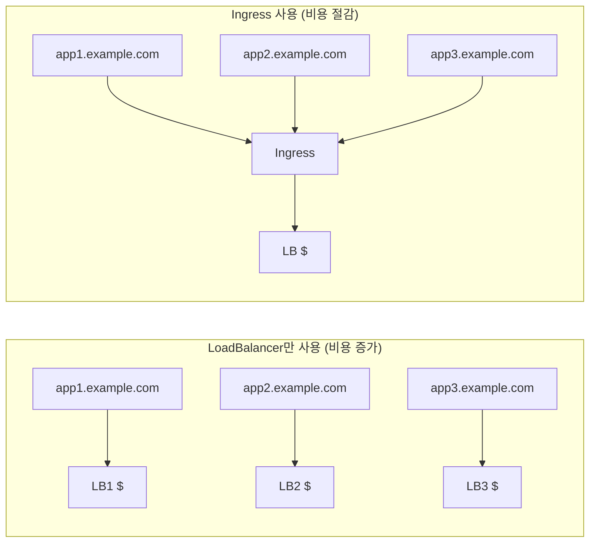
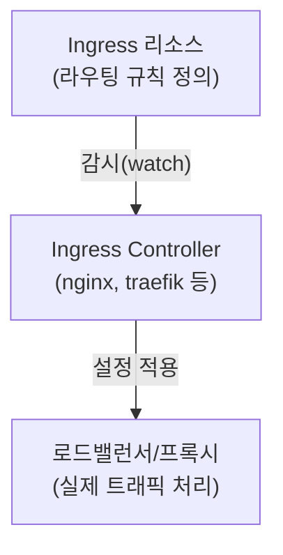

Service의 NodePort나 LoadBalancer는 L4(TCP/UDP) 수준에서 동작한다. 웹 애플리케이션에서 URL 경로나 호스트 기반 라우팅, TLS 종료 등 L7(HTTP/HTTPS) 기능이 필요할 때 **Ingress**를 사용한다.

> **원문 ([kubernetes.io - Ingress](https://kubernetes.io/docs/concepts/services-networking/ingress/)):**
> Ingress exposes HTTP and HTTPS routes from outside the cluster to services within the cluster. Traffic routing is controlled by rules defined on the Ingress resource.

**번역:** Ingress는 클러스터 외부에서 클러스터 내의 서비스로 HTTP 및 HTTPS 경로를 노출한다. 트래픽 라우팅은 Ingress 리소스에 정의된 규칙에 의해 제어된다.

> **원문 ([kubernetes.io - Ingress Controllers](https://kubernetes.io/docs/concepts/services-networking/ingress-controllers/)):**
> You must have an Ingress controller to satisfy an Ingress. Only creating an Ingress resource has no effect.

**번역:** Ingress를 충족하려면 Ingress 컨트롤러가 있어야 한다. Ingress 리소스만 생성하면 아무 효과가 없다.

## Ingress의 필요성

### Service만으로 부족한 경우



### Ingress가 제공하는 기능

1. **호스트 기반 라우팅**: 도메인별로 다른 서비스 연결
2. **경로 기반 라우팅**: URL 경로별로 다른 서비스 연결
3. **TLS 종료**: HTTPS 처리를 Ingress에서 수행
4. **로드밸런싱**: 여러 백엔드로 트래픽 분산
5. **이름 기반 가상 호스팅**: 하나의 IP로 여러 도메인 서비스

## Ingress vs Ingress Controller

**Ingress**는 라우팅 규칙을 정의하는 Kubernetes 리소스이다.
**Ingress Controller**는 Ingress 규칙을 실제로 구현하는 컴포넌트이다.



**중요**: Ingress 리소스만 생성해서는 아무 일도 일어나지 않는다. 반드시 Ingress Controller가 설치되어 있어야 한다.

## Ingress Controller 종류

### 주요 Ingress Controller

| Controller | 특징 | 사용 사례 |
|------------|------|----------|
| NGINX Ingress | 가장 널리 사용, 안정적 | 범용, CKA 시험 |
| Traefik | 자동 설정, 대시보드 | 마이크로서비스 |
| HAProxy | 고성능, 상세 설정 | 엔터프라이즈 |
| Contour | Envoy 기반 | 고급 트래픽 관리 |
| AWS ALB | AWS 통합 | AWS 환경 |
| GCE | GCP 통합 | GCP 환경 |

### NGINX Ingress Controller 설치

```bash
# Helm으로 설치
helm repo add ingress-nginx https://kubernetes.github.io/ingress-nginx
helm install ingress-nginx ingress-nginx/ingress-nginx \
  --namespace ingress-nginx --create-namespace

# 또는 매니페스트로 설치
kubectl apply -f https://raw.githubusercontent.com/kubernetes/ingress-nginx/controller-v1.10.0/deploy/static/provider/cloud/deploy.yaml

# 설치 확인
kubectl get pods -n ingress-nginx
kubectl get svc -n ingress-nginx
```

**주의**: kubernetes.io 공식 NGINX와 nginx.org의 NGINX Ingress Controller는 다른 프로젝트이다.
- `kubernetes.io/ingress-nginx`: 커뮤니티 버전 (CKA에서 사용)
- `nginx.org/nginx-ingress`: NGINX Inc. 상용 버전

## Ingress 기본 구조

```yaml
apiVersion: networking.k8s.io/v1
kind: Ingress
metadata:
  name: my-ingress
  annotations:
    nginx.ingress.kubernetes.io/rewrite-target: /
spec:
  ingressClassName: nginx  # Ingress Controller 지정
  rules:
  - host: example.com      # 호스트 매칭
    http:
      paths:
      - path: /api         # 경로 매칭
        pathType: Prefix
        backend:
          service:
            name: api-service
            port:
              number: 80
```

### pathType 옵션

**Prefix**: 경로 접두사 매칭
```yaml
- path: /api
  pathType: Prefix
# /api, /api/, /api/users, /api/v1/users 모두 매칭
```

**Exact**: 정확한 경로 매칭
```yaml
- path: /api
  pathType: Exact
# /api 만 매칭, /api/ 나 /api/users 는 매칭 안 됨
```

**ImplementationSpecific**: Controller마다 다른 동작
```yaml
- path: /api
  pathType: ImplementationSpecific
# NGINX의 경우 정규표현식 사용 가능
```

## 라우팅 설정

### 경로 기반 라우팅

하나의 도메인에서 URL 경로에 따라 다른 서비스로 라우팅한다.

```yaml
apiVersion: networking.k8s.io/v1
kind: Ingress
metadata:
  name: path-based-ingress
  annotations:
    nginx.ingress.kubernetes.io/rewrite-target: /$2
spec:
  ingressClassName: nginx
  rules:
  - host: myapp.example.com
    http:
      paths:
      - path: /api(/|$)(.*)
        pathType: ImplementationSpecific
        backend:
          service:
            name: api-service
            port:
              number: 80
      - path: /web(/|$)(.*)
        pathType: ImplementationSpecific
        backend:
          service:
            name: web-service
            port:
              number: 80
      - path: /
        pathType: Prefix
        backend:
          service:
            name: frontend-service
            port:
              number: 80
```

**트래픽 흐름**:
```
myapp.example.com/api/users → api-service (rewrite: /users)
myapp.example.com/web/about → web-service (rewrite: /about)
myapp.example.com/         → frontend-service
```

### 호스트 기반 라우팅

다른 도메인을 다른 서비스로 라우팅한다.

```yaml
apiVersion: networking.k8s.io/v1
kind: Ingress
metadata:
  name: host-based-ingress
spec:
  ingressClassName: nginx
  rules:
  - host: api.example.com
    http:
      paths:
      - path: /
        pathType: Prefix
        backend:
          service:
            name: api-service
            port:
              number: 80
  - host: web.example.com
    http:
      paths:
      - path: /
        pathType: Prefix
        backend:
          service:
            name: web-service
            port:
              number: 80
  - host: "*.example.com"  # 와일드카드 호스트
    http:
      paths:
      - path: /
        pathType: Prefix
        backend:
          service:
            name: default-service
            port:
              number: 80
```

### Default Backend

어떤 규칙에도 매칭되지 않는 요청을 처리한다.

```yaml
apiVersion: networking.k8s.io/v1
kind: Ingress
metadata:
  name: ingress-with-default
spec:
  ingressClassName: nginx
  defaultBackend:
    service:
      name: default-service
      port:
        number: 80
  rules:
  - host: example.com
    http:
      paths:
      - path: /api
        pathType: Prefix
        backend:
          service:
            name: api-service
            port:
              number: 80
```

## TLS 설정

### TLS Secret 생성

```bash
# 자체 서명 인증서 생성 (테스트용)
openssl req -x509 -nodes -days 365 -newkey rsa:2048 \
  -keyout tls.key -out tls.crt \
  -subj "/CN=example.com/O=example"

# Secret 생성
kubectl create secret tls example-tls \
  --key tls.key \
  --cert tls.crt
```

### TLS Ingress 설정

```yaml
apiVersion: networking.k8s.io/v1
kind: Ingress
metadata:
  name: tls-ingress
spec:
  ingressClassName: nginx
  tls:
  - hosts:
    - example.com
    - www.example.com
    secretName: example-tls  # TLS Secret 참조
  rules:
  - host: example.com
    http:
      paths:
      - path: /
        pathType: Prefix
        backend:
          service:
            name: web-service
            port:
              number: 80
  - host: www.example.com
    http:
      paths:
      - path: /
        pathType: Prefix
        backend:
          service:
            name: web-service
            port:
              number: 80
```

### HTTP → HTTPS 리다이렉트

```yaml
apiVersion: networking.k8s.io/v1
kind: Ingress
metadata:
  name: redirect-ingress
  annotations:
    nginx.ingress.kubernetes.io/ssl-redirect: "true"
    nginx.ingress.kubernetes.io/force-ssl-redirect: "true"
spec:
  ingressClassName: nginx
  tls:
  - hosts:
    - example.com
    secretName: example-tls
  rules:
  - host: example.com
    http:
      paths:
      - path: /
        pathType: Prefix
        backend:
          service:
            name: web-service
            port:
              number: 80
```

## NGINX Ingress 주요 Annotation

### 트래픽 제어

```yaml
metadata:
  annotations:
    # Rewrite 규칙
    nginx.ingress.kubernetes.io/rewrite-target: /$2

    # Proxy 설정
    nginx.ingress.kubernetes.io/proxy-body-size: "50m"
    nginx.ingress.kubernetes.io/proxy-connect-timeout: "30"
    nginx.ingress.kubernetes.io/proxy-read-timeout: "300"
    nginx.ingress.kubernetes.io/proxy-send-timeout: "300"
```

### 인증 설정

```yaml
metadata:
  annotations:
    # Basic 인증
    nginx.ingress.kubernetes.io/auth-type: basic
    nginx.ingress.kubernetes.io/auth-secret: basic-auth-secret
    nginx.ingress.kubernetes.io/auth-realm: "Authentication Required"
```

Basic Auth Secret 생성:
```bash
# htpasswd 파일 생성
htpasswd -c auth admin

# Secret 생성
kubectl create secret generic basic-auth-secret --from-file=auth
```

### Rate Limiting

```yaml
metadata:
  annotations:
    nginx.ingress.kubernetes.io/limit-rps: "10"
    nginx.ingress.kubernetes.io/limit-connections: "5"
```

### CORS 설정

```yaml
metadata:
  annotations:
    nginx.ingress.kubernetes.io/enable-cors: "true"
    nginx.ingress.kubernetes.io/cors-allow-origin: "https://example.com"
    nginx.ingress.kubernetes.io/cors-allow-methods: "GET, POST, PUT, DELETE"
    nginx.ingress.kubernetes.io/cors-allow-headers: "Content-Type, Authorization"
```

### 로드밸런싱 설정

```yaml
metadata:
  annotations:
    # 로드밸런싱 알고리즘
    nginx.ingress.kubernetes.io/upstream-hash-by: "$request_uri"

    # Session Affinity
    nginx.ingress.kubernetes.io/affinity: "cookie"
    nginx.ingress.kubernetes.io/session-cookie-name: "route"
    nginx.ingress.kubernetes.io/session-cookie-max-age: "172800"
```

### Canary 배포

```yaml
# 메인 Ingress
apiVersion: networking.k8s.io/v1
kind: Ingress
metadata:
  name: production-ingress
spec:
  ingressClassName: nginx
  rules:
  - host: example.com
    http:
      paths:
      - path: /
        pathType: Prefix
        backend:
          service:
            name: production-service
            port:
              number: 80
---
# Canary Ingress (20% 트래픽)
apiVersion: networking.k8s.io/v1
kind: Ingress
metadata:
  name: canary-ingress
  annotations:
    nginx.ingress.kubernetes.io/canary: "true"
    nginx.ingress.kubernetes.io/canary-weight: "20"
spec:
  ingressClassName: nginx
  rules:
  - host: example.com
    http:
      paths:
      - path: /
        pathType: Prefix
        backend:
          service:
            name: canary-service
            port:
              number: 80
```

**Canary 라우팅 옵션**:
```yaml
# 헤더 기반
nginx.ingress.kubernetes.io/canary-by-header: "X-Canary"
nginx.ingress.kubernetes.io/canary-by-header-value: "always"

# 쿠키 기반
nginx.ingress.kubernetes.io/canary-by-cookie: "canary"
```

## IngressClass

Kubernetes 1.18+에서 여러 Ingress Controller를 구분하기 위해 IngressClass를 사용한다.

### IngressClass 정의

```yaml
apiVersion: networking.k8s.io/v1
kind: IngressClass
metadata:
  name: nginx
  annotations:
    ingressclass.kubernetes.io/is-default-class: "true"  # 기본 클래스
spec:
  controller: k8s.io/ingress-nginx
  parameters:
    apiGroup: k8s.nginx.org
    kind: NginxIngressController
    name: nginx-config
```

### IngressClass 사용

```yaml
apiVersion: networking.k8s.io/v1
kind: Ingress
metadata:
  name: my-ingress
spec:
  ingressClassName: nginx  # IngressClass 참조
  rules:
  - host: example.com
    http:
      paths:
      - path: /
        pathType: Prefix
        backend:
          service:
            name: web-service
            port:
              number: 80
```

**여러 Controller 사용 시**:
```bash
# IngressClass 목록 확인
kubectl get ingressclass

# 특정 IngressClass 사용
spec:
  ingressClassName: nginx-internal  # 내부용
  # 또는
  ingressClassName: nginx-external  # 외부용
```

## 트러블슈팅

### 일반적인 문제 진단

```bash
# 1. Ingress 상태 확인
kubectl get ingress
kubectl describe ingress my-ingress

# 2. Ingress Controller Pod 상태
kubectl get pods -n ingress-nginx
kubectl logs -n ingress-nginx <ingress-controller-pod>

# 3. Ingress Controller Service 확인
kubectl get svc -n ingress-nginx

# 4. 백엔드 Service와 Endpoints 확인
kubectl get svc,endpoints <backend-service>

# 5. DNS 확인 (테스트)
nslookup example.com

# 6. 직접 테스트
curl -H "Host: example.com" http://<ingress-controller-ip>/
```

### 흔한 문제와 해결

**404 Not Found**:
- host 또는 path가 일치하는지 확인
- backend service 이름과 포트 확인
- pathType 설정 확인

**503 Service Unavailable**:
- 백엔드 Service의 Endpoints 확인
- Pod가 Ready 상태인지 확인
- 백엔드 Service 포트 확인

**SSL 인증서 오류**:
- TLS Secret이 존재하는지 확인
- Secret의 tls.crt, tls.key 키 확인
- 인증서의 CN/SAN이 호스트와 일치하는지 확인

**Ingress 규칙이 적용되지 않음**:
- Ingress Controller가 실행 중인지 확인
- ingressClassName이 올바른지 확인
- annotation 문법 오류 확인

## 기술 면접 대비

### 자주 묻는 질문

**Q: Ingress와 Service의 차이점은?**

A: Service는 L4(TCP/UDP) 수준에서 Pod 그룹에 안정적인 네트워크 엔드포인트를 제공한다. Ingress는 L7(HTTP/HTTPS) 수준에서 호스트/경로 기반 라우팅, TLS 종료, 가상 호스팅 등 HTTP 계층 기능을 제공한다. Service는 Kubernetes 핵심 컴포넌트이고, Ingress는 별도의 Ingress Controller가 필요하다.

**Q: Ingress Controller 없이 Ingress 리소스를 생성하면?**

A: Ingress 리소스는 생성되지만 아무 동작도 하지 않는다. Ingress는 단순히 "규칙 정의"이고, 실제 트래픽 라우팅은 Ingress Controller가 수행한다. 규칙만 정의하고 구현체가 없는 상태와 같다.

**Q: 여러 개의 Ingress Controller를 사용할 수 있는가?**

A: 가능하다. IngressClass를 사용하여 각 Ingress가 어떤 Controller에 의해 처리될지 지정할 수 있다. 내부/외부 트래픽 분리, 서로 다른 기능이 필요한 경우에 유용하다. Ingress 리소스에서 ingressClassName으로 지정한다.

**Q: Ingress에서 TLS 종료(termination)의 의미는?**

A: 클라이언트와 Ingress Controller 간에는 HTTPS로 암호화된 통신을 하고, Ingress Controller와 백엔드 Pod 간에는 HTTP(평문)로 통신한다. TLS 암호화/복호화 부담을 Ingress에서 처리하여 백엔드 서비스의 부하를 줄인다. 필요하다면 백엔드까지 TLS를 유지하는 SSL Passthrough도 가능하다.

**Q: pathType의 Prefix와 Exact 차이는?**

A: Prefix는 경로 접두사 기준 매칭으로 `/api`가 `/api`, `/api/`, `/api/users`를 모두 매칭한다. Exact는 정확히 일치해야 하므로 `/api`는 오직 `/api`만 매칭한다. Prefix가 더 유연하지만, 의도치 않은 경로가 매칭될 수 있어 주의가 필요하다.

## CKA 시험 대비 필수 명령어

```bash
# Ingress 생성 (YAML 작성이 일반적)
kubectl create ingress simple-ingress \
  --rule="example.com/api*=api-svc:80" \
  --class=nginx

# Ingress 조회
kubectl get ingress
kubectl describe ingress my-ingress

# Ingress YAML 생성
kubectl create ingress my-ingress \
  --rule="example.com/*=web-svc:80" \
  --class=nginx \
  --dry-run=client -o yaml > ingress.yaml

# TLS Ingress 생성
kubectl create ingress tls-ingress \
  --rule="example.com/*=web-svc:80,tls=example-tls" \
  --class=nginx

# IngressClass 조회
kubectl get ingressclass

# TLS Secret 생성
kubectl create secret tls my-tls --cert=tls.crt --key=tls.key
```

### CKA 빈출 시나리오

```yaml
# 시나리오 1: 기본 Ingress 생성
apiVersion: networking.k8s.io/v1
kind: Ingress
metadata:
  name: minimal-ingress
spec:
  ingressClassName: nginx
  rules:
  - host: example.com
    http:
      paths:
      - path: /
        pathType: Prefix
        backend:
          service:
            name: web-service
            port:
              number: 80

# 시나리오 2: 경로 기반 라우팅
apiVersion: networking.k8s.io/v1
kind: Ingress
metadata:
  name: path-ingress
  annotations:
    nginx.ingress.kubernetes.io/rewrite-target: /
spec:
  ingressClassName: nginx
  rules:
  - host: example.com
    http:
      paths:
      - path: /shop
        pathType: Prefix
        backend:
          service:
            name: shop-service
            port:
              number: 80
      - path: /api
        pathType: Prefix
        backend:
          service:
            name: api-service
            port:
              number: 80

# 시나리오 3: TLS 적용
apiVersion: networking.k8s.io/v1
kind: Ingress
metadata:
  name: tls-ingress
spec:
  ingressClassName: nginx
  tls:
  - hosts:
    - secure.example.com
    secretName: secure-tls
  rules:
  - host: secure.example.com
    http:
      paths:
      - path: /
        pathType: Prefix
        backend:
          service:
            name: secure-service
            port:
              number: 80
```

## 실전 예제

### 마이크로서비스 라우팅

```yaml
apiVersion: networking.k8s.io/v1
kind: Ingress
metadata:
  name: microservices-ingress
  annotations:
    nginx.ingress.kubernetes.io/rewrite-target: /$2
    nginx.ingress.kubernetes.io/proxy-body-size: "10m"
spec:
  ingressClassName: nginx
  tls:
  - hosts:
    - api.myapp.com
    secretName: myapp-tls
  rules:
  - host: api.myapp.com
    http:
      paths:
      - path: /users(/|$)(.*)
        pathType: ImplementationSpecific
        backend:
          service:
            name: user-service
            port:
              number: 80
      - path: /orders(/|$)(.*)
        pathType: ImplementationSpecific
        backend:
          service:
            name: order-service
            port:
              number: 80
      - path: /products(/|$)(.*)
        pathType: ImplementationSpecific
        backend:
          service:
            name: product-service
            port:
              number: 80
      - path: /
        pathType: Prefix
        backend:
          service:
            name: gateway-service
            port:
              number: 80
```

---

## 참고 자료

- [Kubernetes Ingress 공식 문서](https://kubernetes.io/docs/concepts/services-networking/ingress/)
- [Ingress Controllers](https://kubernetes.io/docs/concepts/services-networking/ingress-controllers/)
- [Gateway API (Ingress의 차세대 버전)](https://gateway-api.sigs.k8s.io/)
- [NGINX Ingress Controller](https://kubernetes.github.io/ingress-nginx/)

## 다음 단계

- [Kubernetes - NetworkPolicy](/kubernetes/kubernetes-12-networkpolicy)
- [Kubernetes - ConfigMap과 Secret](/kubernetes/kubernetes-13-configmap-secret)
