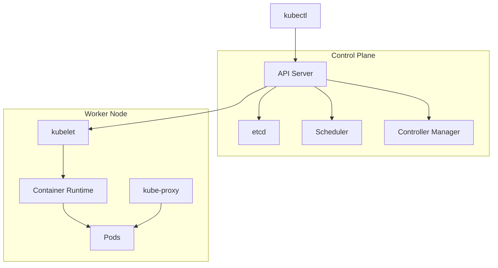

# Part 2: Kubernetes 아키텍처

## 3. Kubernetes 클러스터 구조

### 3.1 Control Plane (Master Node)

**역할:**

Control Plane은 **클러스터 전체의 상태를 관리하고 의사결정을 내리는 중뇌** 역할을 한다.

**책임:**

- 클러스터 상태 저장 및 관리 (etcd)
- API 서버를 통한 모든 요청 처리
- Pod 스케줄링
- 컨트롤러 실행

**고가용성 설정:**

- 프로덕션 환경에서는 3개 이상의 Control Plane 권장
- Active-Active 구조로 부하 분산
- etcd 역시 3개 이상 실행 권장

```
┌─────────────────────────────────────────────┐
│         Control Plane (Master)              │
│  ┌──────────────┐  ┌────────────────────┐  │
│  │  API Server  │  │  etcd (State DB)   │  │
│  └──────────────┘  └────────────────────┘  │
│  ┌──────────────┐  ┌────────────────────┐  │
│  │  Scheduler   │  │ Controller Manager │  │
│  └──────────────┘  └────────────────────┘  │
└─────────────────────────────────────────────┘
```

### 3.2 Worker Node

**역할:**

Worker Node는 **실제 컨테이너가 실행되는 장소**이다.

**책임:**

- Pod 실행
- Control Plane의 명령 수행
- 리소스 리포팅
- 헬스체크

**확장성:**

- 클러스터에 노드를 추가하여 용량 증가
- 자동 스케일링으로 동적 관리

```
┌────────────────────────────────────────┐
│          Worker Node                   │
│  ┌──────────────────────────────────┐  │
│  │ kubelet (Node Agent)             │  │
│  │  - Pod 관리                      │  │
│  │  - CRI 인터페이스               │  │
│  └──────────────────────────────────┘  │
│  ┌──────────────────────────────────┐  │
│  │ kube-proxy (Network)             │  │
│  │  - 서비스 네트워킹               │  │
│  │  - 트래픽 라우팅                │  │
│  └──────────────────────────────────┘  │
│  ┌──────────────────────────────────┐  │
│  │ Container Runtime (Docker, etc)  │  │
│  │  - 컨테이너 실행                │  │
│  └──────────────────────────────────┘  │
│  ┌──────────────────────────────────┐  │
│  │ [Pod] [Pod] [Pod]               │  │
│  └──────────────────────────────────┘  │
└────────────────────────────────────────┘
```

### 3.3 클러스터 통신 흐름

**배포 요청 흐름:**

```
1. kubectl (사용자)
      ↓ (YAML 전송)
2. API Server (인증/인가)
      ↓ (상태 저장)
3. etcd (저장소)
      ↓ (상태 변경 감지)
4. Scheduler (Pod 배치 결정)
      ↓ (바인딩)
5. API Server (업데이트)
      ↓ (감시)
6. kubelet (노드에서 감시)
      ↓ (Pod 생성 명령)
7. Container Runtime (컨테이너 실행)
      ↓
8. Pod 실행 및 상태 리포팅
```

**Pod 통신:**

- Pod-to-Pod: CNI 플러그인이 네트워크 제공
- Pod-to-Service: kube-proxy가 라우팅
- 외부-to-Service: Ingress Controller가 관리

---

## 4. Control Plane 컴포넌트

### 4.1 API Server (kube-apiserver)

**역할:**

API Server는 **Kubernetes의 프론트엔드**로, 모든 요청의 진입점이다.

**책임:**

- RESTful API 제공
- 모든 컴포넌트 간의 통신 중심점
- 인증 및 인가 (Authentication/Authorization)
- Admission Control
- etcd와의 유일한 직접 통신

**특징:**

- Stateless (상태는 etcd에만 저장)
- 수평 확장 가능 (여러 인스턴스 실행)
- 높은 가용성 필수

```bash
# API Server 상태 확인
kubectl cluster-info

# 사용 가능한 API 리소스
kubectl api-resources

# API 버전 확인
kubectl api-versions
```

### 4.2 etcd

**역할:**

etcd는 **분산형 키-값 저장소**로, **클러스터의 모든 상태 데이터를 저장**한다.

**저장하는 데이터:**

- 모든 클러스터 설정
- 모든 Kubernetes 오브젝트 (Pod, Service, Deployment 등)
- 네트워크 설정
- Secrets 및 ConfigMap

**특징:**

- Raft 합의 알고리즘으로 데이터 일관성 보장
- 고가용성을 위해 홀수 개 (3, 5, 7개) 실행 권장
- 정기적인 백업 필수
- 쓰기 성능이 전체 클러스터 성능에 영향

```bash
# etcd 버전 확인
etcdctl version

# 백업 (kubeadm 기반 클러스터)
ETCDCTL_API=3 etcdctl snapshot save snapshot.db \
  --endpoints=https://127.0.0.1:2379 \
  --cacert=/etc/kubernetes/pki/etcd/ca.crt \
  --cert=/etc/kubernetes/pki/etcd/server.crt \
  --key=/etc/kubernetes/pki/etcd/server.key
```

### 4.3 Scheduler (kube-scheduler)

**역할:**

**새로 생성된 Pod를 어떤 노드에 배치할지 결정**한다.

**스케줄링 과정:**

1. **필터링 (Filtering)**: 조건을 만족하는 노드 선택
  - CPU/메모리 요청 확인
  - 노드 셀렉터 확인
  - Affinity/Anti-affinity 규칙 확인
  - Taints와 Tolerations 확인
  - 기타 제약 조건 확인

2. **점수 부여 (Scoring)**: 적합한 노드 순위 지정
  - 리소스 활용률
  - 데이터 지역성
  - Pod Affinity/Anti-affinity
  - 토폴로지 분산

3. **바인딩 (Binding)**: 최고 점수 노드에 Pod 할당

```yaml
# 스케줄링 제약 예시
apiVersion: v1
kind: Pod
metadata:
  name: example
spec:
  nodeSelector:
    disktype: ssd  # ssd 라벨이 있는 노드 선택
  affinity:
    nodeAffinity:
      requiredDuringSchedulingIgnoredDuringExecution:
        nodeSelectorTerms:
          - matchExpressions:
              - key: kubernetes.io/hostname
                operator: In
                values:
                  - node-1
                  - node-2
  tolerations:
    - key: gpu
      operator: Equal
      value: "true"
      effect: NoSchedule
  containers:
    - name: app
      image: myapp:latest
      resources:
        requests:
          cpu: 500m
          memory: 512Mi
        limits:
          cpu: 1000m
          memory: 1Gi
```

### 4.4 Controller Manager (kube-controller-manager)

**역할:**

**여러 컨트롤러를 실행하는 데몬**이다. 각 컨트롤러는 **Reconciliation Loop**를 통해 원하는 상태를 유지한다.

```
원하는 상태 (YAML)
       ↓
    감시 (Watch)
       ↓
  현재 상태와 비교
       ↓
   일치 여부?
   X → 액션 취하기 → 현재 상태 변경
   O → 대기
```

**주요 컨트롤러:**

**Node Controller**

- 노드 상태 모니터링
- 응답 없는 노드 감지
- Pod 제거 및 재할당

**Replication Controller**

- ReplicaSet과 유사 (이전 버전)
- Pod 복제본 수 유지

**Endpoints Controller**

- Service와 Pod 연결
- Endpoint 자동 생성/업데이트

**Service Account Controller**

- 기본 ServiceAccount 생성

**기타 컨트롤러:**

- Deployment Controller
- StatefulSet Controller
- DaemonSet Controller
- Job Controller
- CronJob Controller

---

## 5. Worker Node 컴포넌트

### 5.1 Kubelet

**역할:**

Kubelet은 **각 노드의 에이전트**로, **Pod 생성 및 관리를 담당**한다.

**책임:**

- Pod YAML 감시 및 실행
- Container Runtime Interface (CRI) 통신
- Pod 헬스체크 (Liveness, Readiness Probe)
- 노드 상태 리포팅
- 리소스 제한 강제

**특징:**

- 모든 Worker Node에서 실행
- Control Plane의 지시만 따름
- Self-healing: Static Pod 지원

```bash
# Kubelet 상태 확인
systemctl status kubelet

# Kubelet 로그
journalctl -u kubelet -f

# 노드 상태 확인
kubectl get nodes
kubectl describe node <node-name>
```

### 5.2 Kube-proxy

**역할:**

**서비스 네트워킹을 담당**한다. Pod에서 Service로 트래픽을 라우팅한다.

**네트워킹 모드:**

**iptables 모드 (기본값)**

- Linux iptables 사용
- 성능 우수
- 대규모 클러스터에서 느릴 수 있음

**IPVS 모드**

- Linux IP Virtual Server 사용
- 더 나은 성능
- 복잡한 로드 밸런싱

**userspace 모드**

- 가장 느림
- 호환성 우수

```bash
# Kube-proxy 모드 확인
kubectl get configmap -n kube-system kube-proxy-config -o yaml | grep mode
```

### 5.3 Container Runtime

**역할:**

**실제 컨테이너를 실행**한다. CRI (Container Runtime Interface)를 통해 kubelet과 통신한다.

**주요 런타임:**

**Docker**

- 가장 널리 사용
- K8s 1.24부터 직접 지원 중단 (dockershim 제거)
- 하지만 여전히 호환성 유지

**containerd**

- Docker가 사용하던 컨테이너 런타임
- 경량, 고성능
- 현재 권장 표준

**CRI-O**

- Kubernetes 전용 런타임
- 경량, 보안 중심

**runc**

- OCI (Open Container Initiative) 표준 구현
- 위 런타임들의 기반

```bash
# 노드의 Container Runtime 확인
kubectl get nodes -o wide

# Container Runtime 버전
docker version
containerd --version
```

---

## 6. 애드온 (Addons)

### 6.1 DNS (CoreDNS)

**역할:**

**클러스터 내부 DNS 제공**으로 Pod-to-Pod 통신을 가능하게 한다.

**기능:**

- Pod 이름 → IP 주소 변환
- Service 이름 → ClusterIP 변환
- 자동 DNS 레코드 생성

**DNS 네이밍:**

```
<pod-name>.<namespace>.pod.cluster.local
<service-name>.<namespace>.svc.cluster.local
```

```bash
# CoreDNS 확인
kubectl get pods -n kube-system | grep coredns

# DNS 테스트
kubectl run -it --image=busybox --restart=Never -- nslookup kubernetes.default
```

### 6.2 Dashboard

**역할:**

**웹 기반 GUI**로 Kubernetes 클러스터를 시각적으로 관리한다.

```bash
# Dashboard 설치
kubectl apply -f https://raw.githubusercontent.com/kubernetes/dashboard/v2.7.0/aio/deploy/recommended.yaml

# 접근
kubectl proxy

# http://localhost:8001/api/v1/namespaces/kubernetes-dashboard/services/https:kubernetes-dashboard:/proxy/
```

### 6.3 Metrics Server

**역할:**

**리소스 사용량 수집**으로 HPA 등이 자동 스케일링을 결정하는데 필요하다.

```bash
# Metrics Server 설치 (kubeadm, kind 등)
kubectl apply -f https://github.com/kubernetes-sigs/metrics-server/releases/latest/download/components.yaml

# 메트릭 확인
kubectl top nodes
kubectl top pods -A
```

### 6.4 CNI (Container Network Interface)

**역할:**

**Pod 간 네트워킹**을 제공한다. 자세한 내용은 [Part 8: 고급 네트워킹](https://k-diger.github.io/posts//posts/kubernetes-09-ingress-networkpolicy) 참고.

---

### 아키텍처 다이어그램



---

## 실습 과제

1. **클러스터 컴포넌트 확인**
   ```bash
   # Control Plane 컴포넌트
   kubectl get pods -n kube-system

   # 노드 상태 확인
   kubectl get nodes
   kubectl describe node <node-name>

   # API Server 버전
   kubectl version
   ```

2. **etcd 탐색**
   ```bash
   # etcd Pod 확인
   kubectl get pods -n kube-system | grep etcd

   # etcd 상태 (Control Plane 노드에서)
   ETCDCTL_API=3 etcdctl \
     --endpoints=https://127.0.0.1:2379 \
     --cacert=/etc/kubernetes/pki/etcd/ca.crt \
     --cert=/etc/kubernetes/pki/etcd/server.crt \
     --key=/etc/kubernetes/pki/etcd/server.key \
     endpoint health
   ```

3. **리소스 사용량 모니터링**
   ```bash
   # Metrics Server 설치 확인
   kubectl get pods -n kube-system | grep metrics

   # 리소스 사용량
   kubectl top nodes
   kubectl top pods -A
   ```

---

## 추가 학습 자료

- [Kubernetes 컴포넌트](https://kubernetes.io/docs/concepts/overview/components/)
- [etcd 공식 문서](https://etcd.io/docs/)
- [Kubernetes 아키텍처 심화](https://kubernetes.io/docs/concepts/architecture/)

---

**이전**: [Part 1: 컨테이너 오케스트레이션과 Kubernetes 소개](https://k-diger.github.io/posts//posts/kubernetes-01-container-orchestration) ←
**다음**: [Part 3: Pod, Label, Namespace](https://k-diger.github.io/posts//posts/kubernetes-03-pod-label-namespace) →
