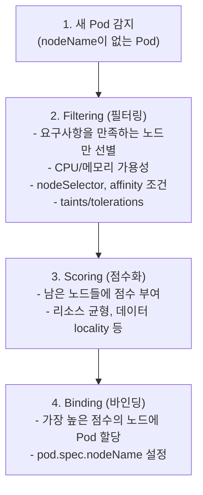

Kubernetes 스케줄러는 Pod가 실행될 노드를 결정한다. 기본적으로 리소스 가용성과 균형을 고려하지만, **nodeSelector**, **Affinity/Anti-Affinity**, **Taints/Tolerations** 등을 통해 세밀한 제어가 가능하다.

## 스케줄링 과정

### kube-scheduler의 동작



### 스케줄링되지 않는 Pod

```bash
# Pending 상태인 Pod 확인
kubectl get pods --field-selector=status.phase=Pending

# 스케줄 실패 원인 확인
kubectl describe pod <pod-name>
# Events 섹션의 "FailedScheduling" 메시지 확인
```

**일반적인 스케줄 실패 원인**:
- 리소스 부족 (Insufficient cpu/memory)
- nodeSelector 조건 불만족
- Taint가 있는 노드만 존재
- PVC 바인딩 대기

## nodeSelector

> **원문 ([kubernetes.io - Assigning Pods to Nodes](https://kubernetes.io/docs/concepts/scheduling-eviction/assign-pod-node/)):**
> nodeSelector is the simplest recommended form of node selection constraint. You can add the nodeSelector field to your Pod specification and specify the node labels you want the target node to have.

**번역:** nodeSelector는 노드 선택 제약의 가장 간단한 권장 형태이다. Pod 명세에 nodeSelector 필드를 추가하고 대상 노드에 원하는 노드 라벨을 지정할 수 있다.

가장 간단한 노드 선택 방법이다. **노드 Label을 기준**으로 필터링한다.

### 노드 Label 관리

```bash
# 노드에 Label 추가
kubectl label nodes node1 disktype=ssd
kubectl label nodes node2 disktype=hdd

# Label 확인
kubectl get nodes --show-labels
kubectl get nodes -L disktype  # 특정 label 컬럼으로

# Label 삭제
kubectl label nodes node1 disktype-
```

### nodeSelector 사용

```yaml
apiVersion: v1
kind: Pod
metadata:
  name: ssd-pod
spec:
  nodeSelector:
    disktype: ssd    # 이 label을 가진 노드에만 스케줄
  containers:
  - name: app
    image: nginx
```

**한계점**:
- 단순 AND 조건만 가능 (OR 불가)
- 선호도(soft) 설정 불가
- Pod 간 규칙 불가

## Node Affinity

> **원문 ([kubernetes.io - Node Affinity](https://kubernetes.io/docs/concepts/scheduling-eviction/assign-pod-node/#node-affinity)):**
> Node affinity is conceptually similar to nodeSelector, allowing you to constrain which nodes your Pod can be scheduled on based on node labels. There are two types of node affinity: requiredDuringSchedulingIgnoredDuringExecution (hard) and preferredDuringSchedulingIgnoredDuringExecution (soft). You can think of them as "hard" and "soft" respectively, in the sense that the former specifies rules that must be met for a pod to be scheduled onto a node, while the latter specifies preferences that the scheduler will try to enforce but will not guarantee.

**번역:** Node affinity는 개념적으로 nodeSelector와 유사하며, 노드 레이블을 기반으로 Pod를 스케줄할 수 있는 노드를 제한할 수 있다. requiredDuringSchedulingIgnoredDuringExecution(hard)과 preferredDuringSchedulingIgnoredDuringExecution(soft)의 두 가지 유형이 있다. 전자는 Pod를 노드에 스케줄하기 위해 반드시 충족해야 하는 규칙을 지정하고, 후자는 스케줄러가 적용하려고 시도하지만 보장하지는 않는 선호도를 지정한다는 점에서 각각 "hard"와 "soft"로 생각할 수 있다.

nodeSelector보다 **표현력이 풍부**한 노드 선택 방법이다.

### requiredDuringSchedulingIgnoredDuringExecution

**반드시 만족해야 하는** 조건이다. 조건을 만족하는 노드가 없으면 Pod는 Pending 상태가 된다.

```yaml
apiVersion: v1
kind: Pod
metadata:
  name: affinity-required
spec:
  affinity:
    nodeAffinity:
      requiredDuringSchedulingIgnoredDuringExecution:
        nodeSelectorTerms:
        - matchExpressions:
          - key: disktype
            operator: In
            values:
            - ssd
            - nvme
          - key: zone
            operator: In
            values:
            - zone-a
            - zone-b
  containers:
  - name: app
    image: nginx
```

### preferredDuringSchedulingIgnoredDuringExecution

**선호하지만 필수는 아닌** 조건이다. 조건을 만족하는 노드가 없어도 다른 노드에 스케줄된다.

```yaml
apiVersion: v1
kind: Pod
metadata:
  name: affinity-preferred
spec:
  affinity:
    nodeAffinity:
      preferredDuringSchedulingIgnoredDuringExecution:
      - weight: 80  # 1-100, 높을수록 우선
        preference:
          matchExpressions:
          - key: disktype
            operator: In
            values:
            - ssd
      - weight: 20
        preference:
          matchExpressions:
          - key: zone
            operator: In
            values:
            - zone-a
  containers:
  - name: app
    image: nginx
```

### 연산자(Operator)

| Operator | 설명 |
|----------|------|
| In | 값 목록 중 하나와 일치 |
| NotIn | 값 목록 어디에도 불일치 |
| Exists | 키가 존재 (값 무관) |
| DoesNotExist | 키가 존재하지 않음 |
| Gt | 값보다 큼 (숫자) |
| Lt | 값보다 작음 (숫자) |

```yaml
# 예시: zone-a 또는 zone-b에 있지 않은 노드
matchExpressions:
- key: zone
  operator: NotIn
  values:
  - zone-a
  - zone-b

# 예시: gpu label이 있는 노드
matchExpressions:
- key: gpu
  operator: Exists

# 예시: cpu-cores가 8보다 큰 노드
matchExpressions:
- key: cpu-cores
  operator: Gt
  values:
  - "8"
```

### required + preferred 조합

```yaml
apiVersion: v1
kind: Pod
metadata:
  name: combined-affinity
spec:
  affinity:
    nodeAffinity:
      # 필수: zone이 있어야 함
      requiredDuringSchedulingIgnoredDuringExecution:
        nodeSelectorTerms:
        - matchExpressions:
          - key: zone
            operator: Exists
      # 선호: SSD면 좋음
      preferredDuringSchedulingIgnoredDuringExecution:
      - weight: 100
        preference:
          matchExpressions:
          - key: disktype
            operator: In
            values:
            - ssd
  containers:
  - name: app
    image: nginx
```

## Pod Affinity / Anti-Affinity

**다른 Pod와의 관계**를 기준으로 스케줄링을 제어한다.

### Pod Affinity

특정 Pod가 있는 노드(또는 같은 토폴로지)에 배치한다.

```yaml
apiVersion: v1
kind: Pod
metadata:
  name: frontend
spec:
  affinity:
    podAffinity:
      requiredDuringSchedulingIgnoredDuringExecution:
      - labelSelector:
          matchLabels:
            app: backend
        topologyKey: kubernetes.io/hostname  # 같은 노드
  containers:
  - name: frontend
    image: nginx
```

**topologyKey**:
- `kubernetes.io/hostname`: 같은 노드
- `topology.kubernetes.io/zone`: 같은 가용 영역
- `topology.kubernetes.io/region`: 같은 리전
- 커스텀 label도 사용 가능

### Pod Anti-Affinity

특정 Pod가 **없는** 노드에 배치한다. 고가용성을 위해 Pod를 분산할 때 사용한다.

```yaml
apiVersion: apps/v1
kind: Deployment
metadata:
  name: web
spec:
  replicas: 3
  selector:
    matchLabels:
      app: web
  template:
    metadata:
      labels:
        app: web
    spec:
      affinity:
        podAntiAffinity:
          # 필수: 같은 노드에 배치하지 않음
          requiredDuringSchedulingIgnoredDuringExecution:
          - labelSelector:
              matchLabels:
                app: web
            topologyKey: kubernetes.io/hostname
          # 선호: 같은 zone도 피함
          preferredDuringSchedulingIgnoredDuringExecution:
          - weight: 100
            podAffinityTerm:
              labelSelector:
                matchLabels:
                  app: web
              topologyKey: topology.kubernetes.io/zone
      containers:
      - name: web
        image: nginx
```

### 실전 예시: Web + Cache 함께 배치

```yaml
# Cache Pod
apiVersion: v1
kind: Pod
metadata:
  name: cache
  labels:
    app: cache
spec:
  containers:
  - name: redis
    image: redis
---
# Web Pod (Cache와 같은 노드에)
apiVersion: v1
kind: Pod
metadata:
  name: web
spec:
  affinity:
    podAffinity:
      requiredDuringSchedulingIgnoredDuringExecution:
      - labelSelector:
          matchLabels:
            app: cache
        topologyKey: kubernetes.io/hostname
  containers:
  - name: web
    image: nginx
```

## Taints와 Tolerations

> **원문 ([kubernetes.io - Taints and Tolerations](https://kubernetes.io/docs/concepts/scheduling-eviction/taint-and-toleration/)):**
> Taints allow a node to repel a set of pods. Tolerations are applied to pods, and allow (but do not require) the pods to schedule onto nodes with matching taints.

**번역:** Taint는 노드가 Pod 집합을 거부할 수 있게 한다. Toleration은 Pod에 적용되며, Pod가 일치하는 taint가 있는 노드에 스케줄되는 것을 허용한다(필수는 아님).

**Taint**는 노드가 특정 Pod를 거부하게 한다.
**Toleration**은 Pod가 Taint를 무시하고 해당 노드에 스케줄될 수 있게 한다.

### Taint 관리

```bash
# Taint 추가
kubectl taint nodes node1 key=value:NoSchedule
kubectl taint nodes node1 dedicated=gpu:NoExecute

# Taint 확인
kubectl describe node node1 | grep -A5 Taints

# Taint 제거
kubectl taint nodes node1 key=value:NoSchedule-
kubectl taint nodes node1 dedicated-  # 모든 effect 제거
```

### Taint Effect

| Effect | 설명 |
|--------|------|
| NoSchedule | 새 Pod 스케줄 거부 (기존 Pod 유지) |
| PreferNoSchedule | 가능하면 스케줄 안 함 (soft) |
| NoExecute | 새 Pod 거부 + 기존 Pod도 축출 |

### Toleration 정의

```yaml
apiVersion: v1
kind: Pod
metadata:
  name: tolerant-pod
spec:
  tolerations:
  # 정확히 일치하는 Taint 허용
  - key: "dedicated"
    operator: "Equal"
    value: "gpu"
    effect: "NoSchedule"
  # 키만 일치하면 허용 (값 무관)
  - key: "zone"
    operator: "Exists"
    effect: "NoSchedule"
  # NoExecute에 대해 300초 동안만 허용
  - key: "node.kubernetes.io/unreachable"
    operator: "Exists"
    effect: "NoExecute"
    tolerationSeconds: 300
  containers:
  - name: app
    image: nginx
```

### 모든 Taint 허용

```yaml
tolerations:
- operator: "Exists"  # 모든 Taint 허용
```

### 기본 시스템 Taints

Master 노드와 문제 있는 노드에는 기본 Taint가 있다:

| Taint | 설명 |
|-------|------|
| node-role.kubernetes.io/control-plane:NoSchedule | Master 노드 |
| node.kubernetes.io/not-ready:NoExecute | 노드 미준비 |
| node.kubernetes.io/unreachable:NoExecute | 노드 연결 불가 |
| node.kubernetes.io/memory-pressure:NoSchedule | 메모리 부족 |
| node.kubernetes.io/disk-pressure:NoSchedule | 디스크 부족 |
| node.kubernetes.io/pid-pressure:NoSchedule | PID 부족 |
| node.kubernetes.io/network-unavailable:NoSchedule | 네트워크 문제 |

### 실전 예시: GPU 노드 전용

```bash
# GPU 노드에 Taint
kubectl taint nodes gpu-node1 gpu=true:NoSchedule
kubectl taint nodes gpu-node2 gpu=true:NoSchedule
```

```yaml
# GPU 워크로드만 스케줄 가능
apiVersion: v1
kind: Pod
metadata:
  name: gpu-workload
spec:
  tolerations:
  - key: "gpu"
    operator: "Equal"
    value: "true"
    effect: "NoSchedule"
  nodeSelector:
    accelerator: nvidia  # GPU 노드 선택도 함께
  containers:
  - name: ml-training
    image: tensorflow/tensorflow:gpu
```

## nodeName

**직접 노드를 지정**한다. 스케줄러를 우회한다.

```yaml
apiVersion: v1
kind: Pod
metadata:
  name: direct-node
spec:
  nodeName: node1  # 스케줄러 무시, 직접 지정
  containers:
  - name: app
    image: nginx
```

**주의사항**:
- 스케줄러가 관여하지 않음
- 노드가 없거나 리소스 부족해도 실패
- 테스트 용도 외에는 사용하지 않는 것이 좋음

## 스케줄링 전략 조합

### Taint/Toleration + Affinity 조합

Taint/Toleration만으로는 Pod가 특정 노드에 스케줄되도록 **강제할 수 없다**.
다른 노드에도 스케줄될 수 있다.

```yaml
# 완전한 노드 전용화 예시
apiVersion: v1
kind: Pod
metadata:
  name: dedicated-gpu-pod
spec:
  # 1. Toleration: GPU 노드의 Taint 허용
  tolerations:
  - key: "dedicated"
    operator: "Equal"
    value: "gpu"
    effect: "NoSchedule"
  # 2. Affinity: GPU 노드만 선택
  affinity:
    nodeAffinity:
      requiredDuringSchedulingIgnoredDuringExecution:
        nodeSelectorTerms:
        - matchExpressions:
          - key: accelerator
            operator: In
            values:
            - nvidia
  containers:
  - name: ml
    image: tensorflow/tensorflow:gpu
```

### 고가용성 배포 전략

```yaml
apiVersion: apps/v1
kind: Deployment
metadata:
  name: ha-web
spec:
  replicas: 6
  selector:
    matchLabels:
      app: web
  template:
    metadata:
      labels:
        app: web
    spec:
      affinity:
        # 같은 앱끼리 다른 노드에 분산
        podAntiAffinity:
          requiredDuringSchedulingIgnoredDuringExecution:
          - labelSelector:
              matchLabels:
                app: web
            topologyKey: kubernetes.io/hostname
        # 특정 zone 선호
        nodeAffinity:
          preferredDuringSchedulingIgnoredDuringExecution:
          - weight: 100
            preference:
              matchExpressions:
              - key: topology.kubernetes.io/zone
                operator: In
                values:
                - zone-a
      # 시스템 노드 회피
      tolerations:
      - key: "node-role.kubernetes.io/control-plane"
        operator: "Exists"
        effect: "NoSchedule"
      containers:
      - name: web
        image: nginx
```

## 트러블슈팅

### 스케줄링 문제 진단

```bash
# Pod 상태 확인
kubectl get pods -o wide

# 스케줄링 실패 원인
kubectl describe pod <pod-name>
# "Events:" 섹션 확인
# "FailedScheduling" 메시지 확인

# 노드 리소스 확인
kubectl describe node <node-name>
# Allocatable vs Allocated 비교

# Taint 확인
kubectl get nodes -o custom-columns=NAME:.metadata.name,TAINTS:.spec.taints
```

### 흔한 문제와 해결

**0/3 nodes are available: insufficient cpu**
- 리소스 요청량 감소
- 노드 추가
- 기존 Pod 정리

**0/3 nodes are available: node(s) didn't match node selector**
- nodeSelector label 확인
- 노드에 label 추가

**0/3 nodes are available: node(s) had taints that the pod didn't tolerate**
- Pod에 toleration 추가
- 노드의 taint 제거

## 기술 면접 대비

### 자주 묻는 질문

**Q: nodeSelector와 Node Affinity의 차이는?**

A: nodeSelector는 단순 AND 조건만 가능하고 hard 제약만 설정할 수 있다. Node Affinity는 In, NotIn, Exists 등 다양한 연산자를 지원하고, required(필수)와 preferred(선호) 두 가지 수준의 제약을 설정할 수 있다. 복잡한 스케줄링 요구사항에는 Node Affinity가 적합하다.

**Q: Taint와 Toleration의 관계는?**

A: Taint는 노드가 "이 조건을 tolerate하지 않는 Pod는 거부한다"고 선언하는 것이다. Toleration은 Pod가 "이 Taint가 있어도 괜찮다"고 선언하는 것이다. 중요한 점은 Toleration이 있다고 해서 해당 노드에 스케줄되는 것이 보장되는 것은 아니라는 것이다. Taint는 거부 메커니즘일 뿐, 유인 메커니즘은 Affinity로 구현해야 한다.

**Q: Pod Anti-Affinity는 어떤 경우에 사용하는가?**

A: 고가용성을 위해 같은 애플리케이션의 Pod를 다른 노드나 다른 가용 영역에 분산시킬 때 사용한다. 예를 들어 웹 서버 3개를 서로 다른 노드에 배포하면 한 노드가 장애가 나도 서비스가 유지된다. topologyKey로 분산 수준(노드, zone, region)을 제어한다.

**Q: requiredDuringSchedulingIgnoredDuringExecution의 의미는?**

A: 스케줄링 시점에는 조건을 반드시 만족해야 하지만, 이미 실행 중인 Pod는 조건이 변해도 축출하지 않는다는 의미이다. 예를 들어 노드의 label이 변경되어 조건에 맞지 않게 되어도 기존 Pod는 계속 실행된다. "IgnoredDuringExecution" 대신 "RequiredDuringExecution"은 아직 구현되지 않았다.

**Q: NoSchedule과 NoExecute의 차이는?**

A: NoSchedule은 새로운 Pod의 스케줄링만 막고, 이미 해당 노드에서 실행 중인 Pod는 영향받지 않는다. NoExecute는 새로운 스케줄링을 막을 뿐 아니라, toleration이 없는 기존 Pod도 축출한다. 노드 유지보수 시 NoExecute를 사용하면 Pod들이 다른 노드로 이동한다.

## CKA 시험 대비 필수 명령어

```bash
# 노드 Label 관리
kubectl label nodes <node> key=value
kubectl label nodes <node> key-
kubectl get nodes --show-labels
kubectl get nodes -L key

# Taint 관리
kubectl taint nodes <node> key=value:NoSchedule
kubectl taint nodes <node> key=value:NoSchedule-
kubectl taint nodes <node> key-

# 노드 정보 확인
kubectl describe node <node> | grep -A5 Taints
kubectl get nodes -o custom-columns=NAME:.metadata.name,TAINTS:.spec.taints

# Pod 스케줄링 확인
kubectl get pods -o wide
kubectl describe pod <pod> | grep -A10 Events
```

### CKA 빈출 시나리오

```yaml
# 시나리오 1: nodeSelector 사용
apiVersion: v1
kind: Pod
metadata:
  name: node-selector-pod
spec:
  nodeSelector:
    disktype: ssd
  containers:
  - name: app
    image: nginx

# 시나리오 2: Taint 허용
apiVersion: v1
kind: Pod
metadata:
  name: toleration-pod
spec:
  tolerations:
  - key: "app"
    operator: "Equal"
    value: "blue"
    effect: "NoSchedule"
  containers:
  - name: app
    image: nginx

# 시나리오 3: Node Affinity
apiVersion: v1
kind: Pod
metadata:
  name: affinity-pod
spec:
  affinity:
    nodeAffinity:
      requiredDuringSchedulingIgnoredDuringExecution:
        nodeSelectorTerms:
        - matchExpressions:
          - key: size
            operator: In
            values:
            - large
            - medium
  containers:
  - name: app
    image: nginx

# 시나리오 4: Pod Anti-Affinity (고가용성)
apiVersion: apps/v1
kind: Deployment
metadata:
  name: ha-deployment
spec:
  replicas: 3
  selector:
    matchLabels:
      app: web
  template:
    metadata:
      labels:
        app: web
    spec:
      affinity:
        podAntiAffinity:
          requiredDuringSchedulingIgnoredDuringExecution:
          - labelSelector:
              matchLabels:
                app: web
            topologyKey: kubernetes.io/hostname
      containers:
      - name: web
        image: nginx
```

---

## 참고 자료

### 공식 문서

- [Assigning Pods to Nodes](https://kubernetes.io/docs/concepts/scheduling-eviction/assign-pod-node/)
- [Taints and Tolerations](https://kubernetes.io/docs/concepts/scheduling-eviction/taint-and-toleration/)
- [Pod Priority and Preemption](https://kubernetes.io/docs/concepts/scheduling-eviction/pod-priority-preemption/)
- [Pod Topology Spread Constraints](https://kubernetes.io/docs/concepts/scheduling-eviction/topology-spread-constraints/)
- [Scheduler Configuration](https://kubernetes.io/docs/reference/scheduling/config/)

## 다음 단계

- [Kubernetes - 리소스 관리](/kubernetes/kubernetes-16-resource-management)
- [Kubernetes - RBAC](/kubernetes/kubernetes-17-rbac)
